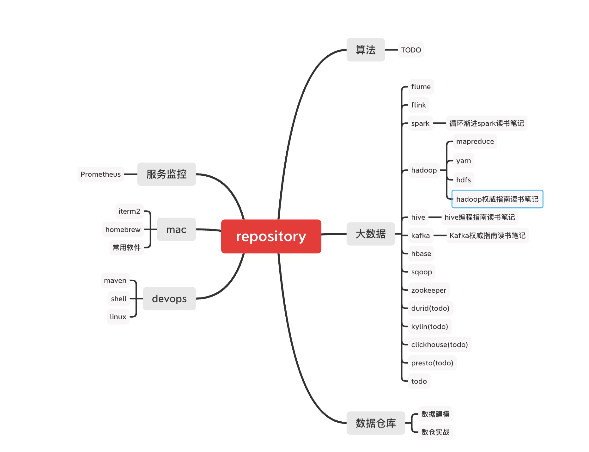

# repository
## 概述
* 个人学习知识库涉及到数据仓库建模、实时计算、大数据、Java、算法等。

## RoadMap

## 基础能力

### Scala

* [ScalaOverView](./base/scala/ScalaOverView.md)

### Java

#### JVM
#### JDK源码
#### todo

## BigData
### Hadoop
#### HDFS

* [Hadoop快速入门](bigdata/hadoop/Hadoop快速开始.xmind)
* [HDFSOverView](bigdata/hadoop/HDFS/HDFSOverView.xmind)
* [Hadoop广义生态系统](bigdata/hadoop/Hadoop广义生态系统.xmind)
* [Hadoop高可用配置](bigdata/hadoop/Hadoop高可用配置.md)
* [HadoopCommon分析](bigdata/hadoop/HDFS/Common包解析.md)
* [HDFS集群相关管理](bigdata/hadoop/HDFS/HDFS集群管理.md)

#### MapReduce

* [分布式处理框架MapReduce](bigdata/hadoop/MapReduce/分布式处理框架MapReduce.md)
* [MapReduce概览](bigdata/hadoop/MapReduce/MapReduceOverView.xmind)
* [MapReduce调优](bigdata/hadoop/MapReduce/MapReduce调优.xmind)
* [MapReduce数据相关操作](bigdata/hadoop/MapReduce/MapReduce数据操作.md)
* [MapReduce输入输出剖析](bigdata/hadoop/MapReduce/MapReduce输入输出剖析.md)
* [MapReduce的工作机制](bigdata/hadoop/MapReduce/MapReduce的工作原理剖析.md)

#### Yarn
* [Yarn快速入门](bigdata/hadoop/Yarn/YARN快速入门.md)

#### 高可用配置

* [Hadoop高可用配置](bigdata/hadoop/Hadoop高可用配置.md)

### Hive

* [HiveOverwrite](bigdata/hive/HiveOverwrite.md)
* [Hive SQL](bigdata/hive/Hive%20SQL.xmind)
* [Hive调优指南](bigdata/hive/Hive调优指南.xmind)
* [Hive踩坑解决方案](bigdata/hive/Hive踩坑解决方案.xmind)
* [Hive编程指南读书笔记](bigdata/hive/hive编程指南)

### Spark

* [Spark基础入门](bigdata/spark/Spark基础入门.xmind)
* [SparkCore](bigdata/spark/Spark%20Core.xmind)
* [SparkOnYarn](bigdata/spark/SparkOnYarn.md)
* [SparkOperator](bigdata/spark/Spark%20Operator.xmind)
* [SparkConnector](bigdata/spark/Spark%20Connector.xmind)
* [SparkSQLAPI](bigdata/spark/Spark%20SQL%20API.xmind)
* [SparkSQL](bigdata/spark/Spark%20SQL.xmind)
* [SparkStreaming](bigdata/spark/Spark%20Steaming.xmind)
* [Spark大数据处理读书笔记](bigdata/spark/Spark大数据处理读书笔记.xmind)

### Zookeeper

* [Zookeeper原理和参数配置](bigdata/zookeeper/Zookeeper原理和参数配置.md)
* [Zookeeper操作与部署](bigdata/zookeeper/Zookeeper操作与部署.md)

### Flume

* [Flume快速入门](bigdata/flume/FlumeOverwrite.md)
* [Flume对接Kafka](bigdata/flume/Flume对接Kafka.md)

### Kafka

* [kafka概览](bigdata/kafka/KafkaOverView.xmind)
* [基本概念](bigdata/kafka/基本概念.md)
* [kafka监控](bigdata/kafka/Kafka监控.md)
* [生产者源码剖析](bigdata/kafka/生产者源码剖析.md)
* [消费者源码剖析](bigdata/kafka/消费者源码剖析.md)
* [kafkaShell](bigdata/kafka/KafkaShell.xmind)
* [kafka权威指南读书笔记](bigdata/kafka/kafka权威指南)

### HBase

* [HBase概览](bigdata/hbase/HBaseOverview.md)
* [HBaseShell](bigdata/hbase/HBase%20Shell.xmind)
* [HBaseJavaAPI](bigdata/hbase/HBase%20Java%20API.xmind)
* [HBase整合MapReduce](bigdata/hbase/HBase整合第三方组件.md)

### Sqoop

* [SqoopOverview](bigdata/sqoop/SqoopOverview.md)
* [Sqoop实战操作](bigdata/sqoop/Sqoop实战操作.md)

### DolphinScheduler

* [DolphinScheduler快速开始](bigdata/scheduler/DolphinScheduler快速开始.md)

### Flink

* [FlinkOverView](bigdata/flink/FlinkOverview.md)
* [DataStream API](bigdata/flink/FlinkDataStream%20API.xmind)
* [ProcessFunction API](bigdata/flink/ProcessFunction%20API.xmind)
* [Flink踩坑指南](bigdata/flink/Flink踩坑.xmind)

### olap
#### Presto

* [presto概述](bigdata/olap/presto/PrestoOverview.md)

#### Druid

* [Druid概述](bigdata/olap/druid/DruidOverView.md)

### Kylin

## 数据仓库

* [数据建模](datawarehouse/DataModeler.md)
* [数据仓库建模](datawarehouse/数据仓库建模.xmind)
* [数据仓库](datawarehouse/数据仓库实战.md)

## devops

* [shell命令](devops/Shell学习.xmind)
* [Linux命令](devops/Linux学习.xmind)
* [openshift基础命令](devops/k8s-openshift客户端命令使用.md)

## maven

* [maven骨架制作](devops/maven/制作maven骨架.md)
* [maven命令](devops/maven/Maven命令.md)

## 服务监控
* [Prometheus](servicemonitor/Prometheus/Prometheus实战.md)

## mac

* [iterm2](mac/iterm2)