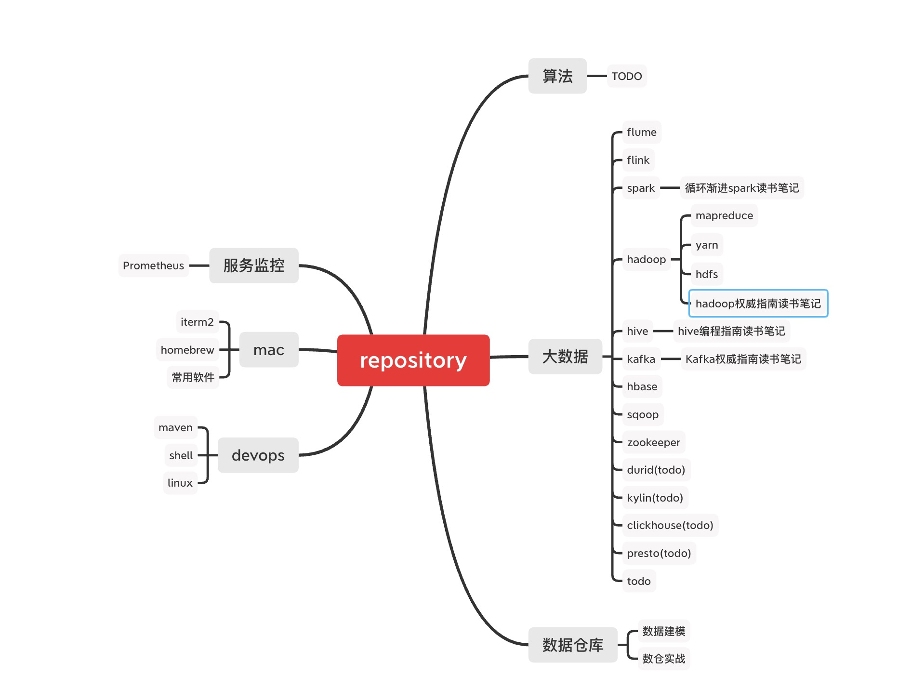

# 大数据知识库 (BigData Knowledge Repository)

[](https://opensource.org/licenses/MIT/)

[](https://github.com/collabH/repository)

[](https://github.com/collabH/repository/fork)

## 概述

* 个人学习知识库涉及到数据仓库建模、实时计算、大数据、Java、算法等。
* [在线文档](https://shimin-huang.gitbook.io/doc/)

## 🤖 AI知识库助手

本项目集成了 **大数据知识库AI Skill助手**，可以帮助您：

- **📚 知识复习**：基于Flink、Spark、Hadoop、数据仓库、数据湖等知识库提供智能复习指导
- **💼 面试准备**：提供大数据技术面试问题解答和面试技巧
- **🎯 学习路径**：根据您的需求制定个性化的学习计划和路径
- **❓ 问题解答**：解答大数据相关技术问题，提供详细解释和示例

### 使用方法

在支持的AI平台上激活 `bigdata-knowledge-coach` Skill，然后您可以：

```
# 询问技术问题
"请帮我解释Flink的Checkpoint机制"

# 请求面试准备
"准备一下Spark Streaming的面试题"

# 学习规划
"我想学习数据仓库，请给出学习路径"

# 知识点复习
"帮我复习Hive的调优策略"
```

## RoadMap



## 基础能力

### 数据结构

* [数据结构概述](base/datastructure/数据结构.md)

### 分布式理论

* [分布式架构](base/分布式理论/分布式架构.md)

### 计算机理论

* [LSM存储模型](base/计算机理论/LSM存储模型.md)

### Scala

* [Scala概述](base/scala/ScalaOverView.md)

### JVM

### Java

#### 并发编程

* [认识并发编程](base/java/并发编程/认识并发编程.md)
* [并发工具类](base/java/并发编程/并发工具类concurrent.md)

#### JDK源码

#### 待补充

## 算法

* [算法题解](base/algorithm/算法题解.md)

## BigData

### cache

**数据编排技术**

#### alluxio

* [Alluxio概览](bigdata/cache/alluxio/AlluxioOverView.md)
* [Alluxio部署](bigdata/cache/alluxio/AlluxioDeployment.md)
* [Alluxio整合计算引擎](bigdata/cache/alluxio/AlluxioWithEngine.md)

### datalake


#### hudi

##### 快速开始

* [Hudi概览](bigdata/datalake/hudi/hudiOverview.md)
* [Hudi整合Spark](bigdata/datalake/hudi/hudiWithSpark.md)
* [Hudi整合Flink](bigdata/datalake/hudi/hudiWithFlink.md)
* [Hudi调优实践](bigdata/datalake/hudi/hudi调优实践.md)
* [Hudi原理分析](bigdata/datalake/hudi/hudi原理分析.md)
* [Hudi数据湖实践](bigdata/datalake/hudi/hudi数据湖实践.md)

##### doc with source

**配合官方文档和源码带从0到1学习hudi**

* [Timeline](bigdata/datalake/hudi/docwithsource/timeline.md)
* [TableType](bigdata/datalake/hudi/docwithsource/tabletype.md)

##### article

* [Flink基于Apache Hudi+Alluxio的数据湖实践](bigdata/datalake/hudi/article/Flink基于Apache%20Hudi+Alluxio的数据湖实践.md)
* [Apache Hudi在LakeHouse趋势下的优势](bigdata/datalake/hudi/article/Apache%20Hudi在LakeHouse趋势下的优势.md)

#### Paimin

* [Paimon概览](bigdata/datalake/paimon/PaimonOverview.md)
* [Paimon主键表](bigdata/datalake/paimon/PaimonPkTable.md)
* [Paimon非主键表](bigdata/datalake/paimon/PaimonWithoutPkTable.md)
* [Flink操作Paimon](bigdata/datalake/paimon/PaimonOnFlink.md)
* [Spark操作Paimon](bigdata/datalake/paimon/PaimonOnSpark.md)
* [Paimon Maintenance](bigdata/datalake/paimon/PaimonOnMaintenance.md)
* [PaimonPrivileges](bigdata/datalake/paimon/PaimonPrivileges.md)
* [Paimon实践](bigdata/datalake/paimon/PaimonPractice.md)

#### iceberg

* [IceBerg概览](bigdata/datalake/iceberg/icebergOverview.md)
* [IceBerg整合Flink](bigdata/datalake/iceberg/icebergWithFlink.md)
* [IceBerg整合Hive](bigdata/datalake/iceberg/icebergWithHive.md)
* [IceBerg整合Spark](bigdata/datalake/iceberg/IcebergWithSpark.md)

### rss

**remote shuffle service**

#### celeborn

* [celeborn概述](bigdata/rss/celeborn/CelebornOverview.md)


### store

**存储相关，包含rocksdb、Hbase、BookKeeper、Zookeeper等**


#### rocksDB

* [rocksDB概述](bigdata/store/rocksdb/RocksdbOverview.md)
* [rocksDB配置](bigdata/store/rocksdb/Rocksdb配置.md)
* [rocksDB组件描述](bigdata/store/rocksdb/Rocksdb组件描述.md)
* [rocksdb on flink](bigdata/store/rocksdb/RocksDB%20On%20Flink.md)
* [rocksdb API](bigdata/store/rocksdb/RocksDB%20API.xmind)

#### Bookkeeper

* [BookkeeperOverview](bigdata/store/bookkeeper/BookkeeperOverview.md)
* [BookkeeperAPI](bigdata/store/bookkeeper/BookkeeperAPI.md)
* [BookkeeperApplication](bigdata/store/bookkeeper/BookkeeperApplication.md)

#### HBase

* [HBase概览](bigdata/store/hbase/HBaseOverview.md)
* [HBaseShell](bigdata/store/hbase/HBase%20Shell.xmind)
* [HBaseJavaAPI](bigdata/store/hbase/HBase%20Java%20API.xmind)
* [HBase整合MapReduce](bigdata/store/hbase/HBase整合第三方组件.md)
* [HBase过滤器](bigdata/store/hbase/Hbase过滤器.md)

#### Zookeeper

* [Zookeeper原理和参数配置](bigdata/store/zookeeper/ZookeeperOverView.md)
* [Zookeeper操作与部署](bigdata/store/zookeeper/Zookeeper操作与部署.md)

### Hadoop

**广义上的Hadoop生态圈的学习笔记，主要记录HDFS、MapReduce、Yarn相关读书笔记及源码分析等。**

#### HDFS

* [Hadoop快速入门](bigdata/hadoop/Hadoop快速开始.xmind)
* [HDFS概述](bigdata/hadoop/HDFS/HDFSOverView.xmind)
* [Hadoop广义生态系统](bigdata/hadoop/Hadoop广义生态系统.xmind)
* [Hadoop高可用配置](bigdata/hadoop/Hadoop高可用配置.md)
* [HadoopCommon分析](bigdata/hadoop/HDFS/HadoopCommon包分析.pdf)
* [HDFS集群相关管理](bigdata/hadoop/HDFS/HDFS集群管理.md)
* [HDFS Shell](bigdata/hadoop/HDFS/HDFS%20Shell命令.md)

#### MapReduce

* [分布式处理框架MapReduce](bigdata/hadoop/MapReduce/分布式处理框架MapReduce.md)
* [MapReduce概览](bigdata/hadoop/MapReduce/MapReduceOverView.xmind)
* [MapReduce调优](bigdata/hadoop/MapReduce/MapReduce调优.xmind)
* [MapReduce数据操作](bigdata/hadoop/MapReduce/MapReduce数据操作.md)
* [MapReduce输入输出剖析](bigdata/hadoop/MapReduce/MapReduce输入输出剖析.md)
* [MapReduce工作机制](bigdata/hadoop/MapReduce/MapReduce的工作原理剖析.md)

#### Yarn

* [Yarn快速入门](bigdata/hadoop/Yarn/YARN快速入门.md)

#### 生产配置

* [Hadoop高可用配置](bigdata/hadoop/Hadoop高可用配置.md)
* [Hadoop生产相关配置](bigdata/hadoop/Hadoop相关组件生产级别配置.md)

### Engine

**计算引擎相关，主要包含Flink、Spark等**

#### Flink

* 主要包含对Flink文档阅读的总结和相关Flink源码的阅读，以及Flink新特性记录等等

##### Core

* [FlinkOverView](bigdata/engine/flink/core/FlinkOverview.md)
* [CheckPoint机制](bigdata/engine/flink/core/Checkpoint机制.md)
* [TableSQLOverview](bigdata/engine/flink/core/TableSQLOverview.md)
* [DataStream API](bigdata/engine/flink/core/FlinkDataStream%20API.xmind)
* [ProcessFunction API](bigdata/engine/flink/core/ProcessFunction%20API.xmind)
* [Data Source](bigdata/engine/flink/core/Data%20Source.xmind)
* [Table API](bigdata/engine/flink/core/TABLE%20API.xmind)
* [Flink SQL](bigdata/engine/flink/core/FlinkSQL.xmind)
* [Flink Hive](bigdata/engine/flink/core/Flink%20SQL%20Hive.xmind)
* [Flink CEP](bigdata/engine/flink/core/Flink%20Cep.xmind)
* [Flink Function](bigdata/engine/flink/core/Flink%20SQL%20Function.xmind)
* [DataSource API](bigdata/engine/flink/core/Data%20Source.xmind)

##### SourceCode

* [FlinkCheckpoint源码分析](bigdata/engine/flink/sourcecode/FlinkCheckpoint源码分析.md)
* [FlinkChangelogCheckpoint](bigdata/engine/flink/sourcecode/Flink%20Changelog%20Checkpoint.md)
* [FlinkSQL源码解析](bigdata/engine/flink/sourcecode/FlinkSQL源码解析.md)
* [Flink内核源码分析](bigdata/engine/flink/sourcecode/Flink内核源码分析.md)
* [Flink网络流控及反压](bigdata/engine/flink/sourcecode/Flink网络流控及反压.md)
* [TaskExecutor内存模型原理深入](bigdata/engine/flink/sourcecode/TaskExecutor内存模型原理深入.md)
* [Flink窗口实现应用](bigdata/engine/flink/sourcecode/Flink窗口实现应用原理.md)
* [Flink运行环境源码解析](bigdata/engine/flink/sourcecode/Flink运行环境源码解析.md)
* [FlinkTimerService机制分析](bigdata/engine/flink/sourcecode/FlinkTimerService机制分析.md)
* [StreamSource源解析](bigdata/engine/flink/sourcecode/StreamSource源解析.md)
* [Flink状态管理与检查点机制](bigdata/engine/flink/sourcecode/Flink状态管理与检查点机制.xmind)
* [Flink内幕解析](bigdata/engine/flink/sourcecode/Flink内幕解析.md)

##### zoology

###### Flink CDC Connector

* [FlinkCdcOverview](bigdata/engine/flink/zoology/flink%20cdc%20connector/FlinkCdcOverview.md)

##### devops

###### Flink On K8s

* [Flink On Native K8s实践](bigdata/engine/flink/devops/Flink%20On%20Native%20K8s.md)
* [Flink On K8s Operator](bigdata/engine/flink/devops/Flink%20On%20K8s%20Operator.md)
* [Flink On K8s Operator Operations](bigdata/engine/flink/devops/Flink%20On%20K8s%20Operator%20Operation.md)

###### Flink SQL Tools

* [Flink SQL Tools](bigdata/engine/flink/devops/Flink%20SQL%20Tools.md)

##### Book

###### Flink内核原理与实现

* [1-3章读书笔记](bigdata/engine/flink/books/Flink内核原理与实现/1-3章读书笔记.xmind)
* [第4章时间与窗口](bigdata/engine/flink/books/Flink内核原理与实现/第4章时间与窗口.xmind)
* [5-6章读书笔记](bigdata/engine/flink/books/Flink内核原理与实现/5-6章类型序列化和内存管理读书笔记.xmind)
* [第7章状态原理](bigdata/engine/flink/books/Flink内核原理与实现/第7章状态原理.xmind)
* [第8章作业提交](bigdata/engine/flink/books/Flink内核原理与实现/第8章作业提交.xmind)
* [第9章资源管理](bigdata/engine/flink/books/Flink内核原理与实现/第9章资源管理.xmind)
* [第10章作业调度](bigdata/engine/flink/books/Flink内核原理与实现/第10章作业调度.xmind)
* [第11-13章Task执行数据交换等](bigdata/engine/flink/books/Flink内核原理与实现/第11-13章Task执行数据交换等.md)

##### Feature

* [Flink1.12新特性](bigdata/engine/flink/feature/Flink1.12新特性.md)
* [Flink1.13新特性](bigdata/engine/flink/feature/Flink1.13新特性.md)
* [Flink1.14新特性](bigdata/engine/flink/feature/Flink1.14新特性.md)

##### Practice

* [Flink踩坑指南](bigdata/engine/flink/practice/Flink踩坑.xmind)
* [记录一次Flink反压问题](bigdata/engine/flink/practice/记录一次Flink反压问题.md)
* [Flink SQL实践调优](bigdata/engine/flink/practice/Flink%20SQL调优.xmind)
* [Flink Runtime核心机制浅入深出](bigdata/engine/flink/practice/Flink%20Runtime核心机制浅入深出.md)
* [Flink JDBC Driver](bigdata/engine/flink/practice/Flink%20JDBC%20Driver.md)

##### Connector

* [自定义Table Connector](bigdata/engine/flink/connector/自定义TableConnector.md)

##### monitor

* [搭建Flink任务指标监控系统](bigdata/engine/flink/monitor/搭建Flink任务指标监控系统.md)

#### Spark

**主要包含Spark相关书籍读书笔记、Spark核心组件分析、Spark相关API实践以及Spark生产踩坑等。**

* [Spark基础入门](bigdata/engine/spark/Spark基础入门.xmind)
* [SparkOnDeploy](bigdata/engine/spark/SparkOnDeploy.md)
* [Spark调度系统](bigdata/engine/spark/Spark调度系统.md)
* [Spark计算引擎和Shuffle](bigdata/engine/spark/Spark计算引擎和Shuffle.md)
* [Spark存储体系](bigdata/engine/spark/Spark存储体系.md)
* [Spark大数据处理读书笔记](bigdata/engine/spark/Spark大数据处理读书笔记.xmind)

##### Spark Core

* [SparkCore](bigdata/engine/spark/spark%20core/Spark%20Core.xmind)
* [SparkOperator](bigdata/engine/spark/spark%20core/Spark%20Operator.xmind)
* [SparkConnector](bigdata/engine/spark/spark%20core/Spark%20Connector.xmind)

##### Spark SQL

* [SparkSQLAPI](bigdata/engine/spark/spark%20sql/Spark%20SQL%20API.xmind)
* [SparkSQL](bigdata/engine/spark/spark%20sql/Spark%20SQL.xmind)
* [SparkSQL API](bigdata/engine/spark/spark%20sql/SparkSQL%20API.md)
* [SparkSQL优化分析](bigdata/engine/spark/spark%20sql/SparkSQL优化分析.md)

##### Spark Practice

* [Spark生产实践](bigdata/engine/spark/practice/Spark生产实践.md)

##### Spark Streaming

* [SparkStreaming](bigdata/engine/spark/spark%20streaming/Spark%20Steaming.xmind)
* [SparkStreaming整合Flume](bigdata/engine/spark/spark%20streaming/SparkStreaming整合Flume.md)

##### Native SQL Engine

* [Spark Native SQL Engine概览](bigdata/engine/spark/native%20sql%20engine/Spark%20Native%20SQL%20Engine%20Overview.md)

##### 源码解析

* [从浅到深剖析Spark源码](bigdata/engine/spark/从浅到深剖析Spark源码.md)
* [源码分析系列](bigdata/engine/spark/源码分析)

### Collect

**数据采集框架，主要包含Binlog增量与SQL快照方式框架**

### Canal

* [CanalOverView](bigdata/collect/canal/CanalOverView.md)

### Debezium

* [DebeziumOverView](bigdata/collect/debezium/DebeziumOverView.md)
* [Debezium踩坑](bigdata/collect/debezium/Debezium踩坑.xmind)
* [Debezium监控系统搭建](bigdata/collect/debezium/Debezium监控系统搭建.md)
* [Debezium使用改造](bigdata/collect/debezium/Debezium使用改造.md)

#### Flume

* [Flume快速入门](bigdata/collect/flume/FlumeOverwrite.md)
* [Flume对接Kafka](bigdata/collect/flume/Flume对接Kafka.md)

#### Sqoop

* [SqoopOverview](bigdata/collect/sqoop/SqoopOverview.md)
* [Sqoop实战操作](bigdata/collect/sqoop/Sqoop实战操作.md)

### MQ

**消息中间件相关，主要包含大数据中使用比较多的Kafka和Pulsar**

#### Kafka

* [kafka概览](bigdata/mq/kafka/KafkaOverView.xmind)
* [基本概念](bigdata/mq/kafka/基本概念.md)
* [kafka监控](bigdata/mq/kafka/Kafka监控.md)
* [生产者源码剖析](bigdata/mq/kafka/生产者源码剖析.md)
* [消费者源码剖析](bigdata/mq/kafka/消费者源码剖析.md)
* [kafkaShell](bigdata/mq/kafka/KafkaShell.xmind)
* [kafka权威指南读书笔记](bigdata/mq/kafka/kafka权威指南)
* [深入理解Kafka读书笔记](bigdata/mq/kafka/深入理解Kafka)

#### Pulsar

* [快速入门](bigdata/mq/pulsar/1.快速入门.md)
* [原理与实践](bigdata/mq/pulsar/2.原理与实践.md)

### schedule

#### Azkaban

* [Azkaban生产实践](bigdata/scheduler/Azkaban生产实践.md)

#### DolphinScheduler

* [DolphinScheduler快速开始](bigdata/scheduler/DolphinScheduler快速开始.md)

### olap

**主要核心包含Kudu、Impala相关Olap引擎，生产实践及论文记录等。**

#### Hive

* [HiveOverwrite](bigdata/olap/hive/HiveOverwrite.md)
* [Hive SQL](bigdata/olap/hive/Hive%20SQL.xmind)
* [Hive调优指南](bigdata/olap/hive/Hive调优指南.xmind)
* [Hive踩坑解决方案](bigdata/olap/hive/Hive踩坑解决方案.xmind)
* [Hive编程指南读书笔记](bigdata/olap/hive/hive编程指南)
* [Hive Shell Beeline](bigdata/olap/hive/Hive%20Shell和Beeline命令.md)
* [Hive分区表和分桶表](bigdata/olap/hive/Hive分区表和分桶表.md)

#### Presto

* [presto概述](bigdata/olap/presto/PrestoOverview.md)

#### clickhouse

* [ClickHouse快速入门](bigdata/olap/clickhouse/ClickHouseOverView.md)
* [ClickHouse表引擎](bigdata/olap/clickhouse/ClickHouse表引擎.xmind)

#### Druid

* [Druid概述](bigdata/olap/druid/DruidOverView.md)

#### Kylin

* [Kylin概述](bigdata/olap/kylin/KylinOverWrite.md)

#### Kudu

* [KuduOverView](bigdata/olap/kudu/KuduOverView.md)
* [Kudu表和Schema设计](bigdata/olap/kudu/KuduSchemaDesgin.md)
* [KuduConfiguration](bigdata/olap/kudu/KuduConfiguration.md)
* [Kudu原理分析](bigdata/olap/kudu/Kudu原理分析.md)
* [Kudu踩坑](bigdata/olap/kudu/Kudu踩坑.xmind)
* [Kudu存储结构架构图](bigdata/olap/kudu/Kudu存储结构)
* [Kudu生产实践](bigdata/olap/kudu/Kudu生产实践.md)

#### Flink

* [Flink Olap](bigdata/olap/flink/Flink%20Olap.md)

##### paper

* [Kudu论文阅读](bigdata/olap/kudu/paper/KuduPaper阅读.md)

#### Impala

* [ImpalaOverView](bigdata/olap/impala/ImpalaOverView.md)
* [ImpalaSQL](bigdata/olap/impala/Impala%20SQL.xmind)
* [Impala操作KUDU](bigdata/olap/impala/使用Impala查询Kudu表.md)
* [Impala生产实践](bigdata/olap/impala/Impala生产实践.md)

### graph

**图库相关**

#### nebula graph

* [1.简介](bigdata/graph/nebula%20graph/1.简介.md)
* [2.快速入门](bigdata/graph/nebula%20graph/2.快速入门.md)

### tools

**工具集相关，包含计算平台、sql语法Tree等**

#### zeppelin

* [zeppelin](bigdata/tools/zeppelin/Zeppelin.xmind)

#### SQL语法树

##### calcite

* [ApacheCalciteOverView](bigdata/tools/sqltree/calcite/CalciteOverView.md)

## 数据仓库建设

### 理论

* [数据建模](datawarehouse/理论/DataModeler.md)
* [数据仓库建模](datawarehouse/理论/数据仓库建模.xmind)
* [数据仓库](datawarehouse/理论/数据仓库实战.md)

### 数据中台设计

* [数据中台设计](datawarehouse/数据中台模块设计/数据中台设计.md)
* [thoth自研元数据平台设计](datawarehouse/数据中台模块设计/thoth自研元数据平台设计.md)

### 方案实践

* [Kudu数据冷备](datawarehouse/方案实践/Kudu数据冷备方案.md)
* [基于Flink的实时数仓建设](datawarehouse/方案实践/基于Flink的实时数仓建设.md)

### 读书笔记

* [数据中台读书笔记](datawarehouse/数据中台读书笔记.md)

## 算法策略

### 特征工程

* [Embedding快速入门](strategy/embedding/EmbeddingOverview.md)
* [常用特征工程清洗方法](strategy/feature_engineering/常用特征工程清洗方法.md)

## books

**数据笔记相关**

### DDIA读书笔记

* [数据系统基础](books/ddia/1.数据系统基础.md)

## devops

* [shell命令](devops/Shell学习.xmind)
* [Linux命令](devops/Linux学习.xmind)
* [openshift基础命令](devops/k8s-openshift客户端命令使用.md)

## maven

* [maven骨架制作](devops/maven/制作maven骨架.md)
* [maven命令](devops/maven/Maven命令.md)

## 服务监控

* [Prometheus](servicemonitor/Prometheus/Prometheus实战.md)

## mac

* [iterm2](mac/iterm2)

# 🤝 贡献方式

欢迎为这个知识库贡献内容！

* 📝 **提交Pull Request**：修正错误、补充内容、更新文档
* 🐛 **提交Issue**：报告bug、提出改进建议、询问问题
* 💬 **参与讨论**：在Issue和Discussion中分享您的见解
* 🌟 **Star支持**：如果这个项目对您有帮助，请给我们一个Star！

* [贡献者指南](./CONTRIBUTING.md)
* [代码规范](./CODE_OF_CONDUCT.md)
* [安全政策](./SECURITY.md)

## 📚 技术分享


### 技术栈覆盖

- **实时计算**：Flink、Spark Streaming
- **批处理**：Spark、MapReduce
- **数据湖**：Hudi、Iceberg、Paimon
- **数据仓库**：Hive、Kudu
- **消息队列**：Kafka、Pulsar
- **存储系统**：HDFS、RocksDB、HBase
- **OLAP引擎**：ClickHouse、Druid、Impala
- **调度系统**：DolphinScheduler、Azkaban
- **采集工具**：Canal、Debezium、Flume
- **缓存系统**：Alluxio
- **图数据库**：Nebula Graph
- **工具集**：Zeppelin、Calcite
