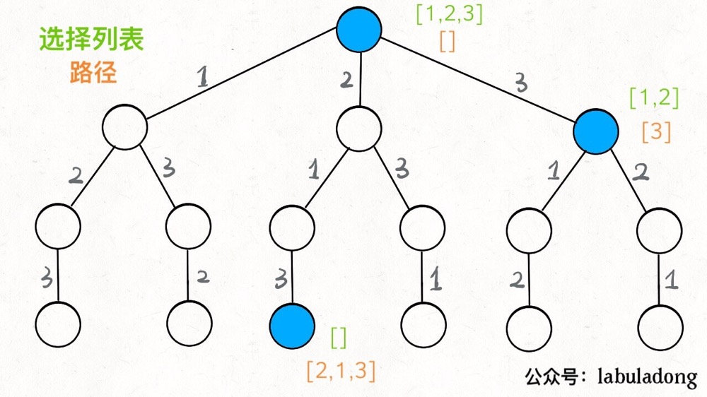

# DP核心思想

* 重叠子问题
  * 可以使用"备忘录"和"DPTable"来记录中间结果
* 最优子结构
* 状态转移方程

## 三要素框架

* **明确 base case -> 明确「状态」-> 明确「选择」 -> 定义 dp 数组/函数的含义**。

```python
# 初始化 base case
dp[0][0][...] = base
# 进行状态转移
for 状态1 in 状态1的所有取值：
    for 状态2 in 状态2的所有取值：
        for ...
            dp[状态1][状态2][...] = 求最值(选择1，选择2...)
```

# 回溯算法核心思想

* **解决一个回溯问题，实际上就是一个决策树的遍历过程**。

## 三个问题

1. 路径：也就是已经做出的选择。

2. 选择列表：也就是你当前可以做的选择。

3. 结束条件：也就是到达决策树底层，无法再做选择的条件。

## 算法框架

```python
result = []
def backtrack(路径, 选择列表):
    if 满足结束条件:
        result.add(路径)
        return

    for 选择 in 选择列表:
        做选择
        backtrack(路径, 选择列表)
        撤销选择
        
        
# 核型代码详解
for 选择 in 选择列表:
    # 做选择
    将该选择从选择列表移除
    路径.add(选择)
    backtrack(路径, 选择列表)
    # 撤销选择，深度优先遍历需要回溯的过程，撤回选择在选择上次没选择的路线。
    路径.remove(选择)
    将该选择再加入选择列表
```




