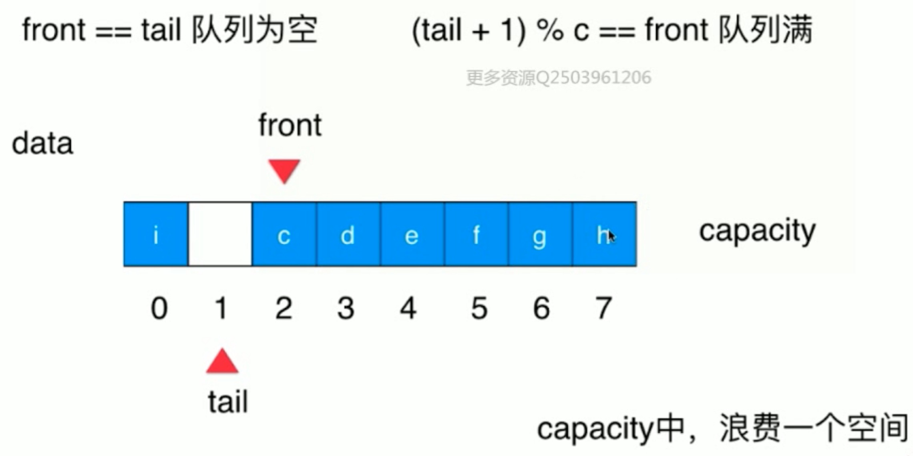

# 数组

## 基础概念

* 将数据码成一排进行存放
* 连续的，支持根据index快速检索数据（随机访问），但是对于任意位置添加或任意位置删除时间复杂度存在最好和最坏的情况。

# 栈

* 栈是一种线性结构，相比数组，栈对应的操作是数组的子集，只能从一端添加元素，也只能从一端取出元素，此端为栈顶。
* 后进先出的数据结构，Last In First Out(LIFO)
* 程序调用的系统栈，A方法调用B方法调用C方法，AB都在系统栈中，当C方法调用完后，下次调用的是B方法。

## 队列

* 队列是一种线性结构，底层可以用动态数组实现，是一种FIFO(先进先出)的数据结构。

## 循环队列

* 利用index来记录队头和队位标示来记录队列的情况。



```java
public class LoopQueue<E> implements Queue<E> {

    private E[] data;
    // 队首索引
    private int front;
    // 队尾索引
    private int tail;

    private int size;

    public LoopQueue(int cap) {
        /**
         * 会浪费一个位置，front==tail为null front==tail+1 队列满
         */
        this.data = (E[]) new Object[cap + 1];
    }

    public LoopQueue() {
        this(10);
    }

    public int getCap() {
        return data.length - 1;
    }

    private boolean isValid() {
        // 防止数据越界
        return (this.tail + 1) % data.length == front;
    }

    private void resize(int cap) {
        E[] resizeQueue = (E[]) new Object[cap + 1];
        for (int i = 0; i < size; i++) {
            // 防止数组越界
            resizeQueue[i] = data[(i + front) % data.length];
        }
        data = resizeQueue;
        front = 0;
        tail = size;
    }

    @Override
    public void enqueue(E e) {
        // 扩容
        if (isValid()) {
            resize(getCap() * 2);
        }
        this.data[this.tail] = e;
        tail = (tail + 1) % data.length;
        size++;
    }

    @Override
    public E dequeue() {
        if (isEmpty()) {
            throw new NullPointerException("循环队列为空");
        }
        E ret = data[front];
        // help gc
        data[front] = null;
        front = (front + 1) % data.length;
        size--;
        // lazy 缩容
        if (this.size == getCap() / 4 && getCap() / 2 != 0) {
            resize(getCap() / 2);
        }
        return ret;
    }

    @Override
    public E getFront() {
        if (isEmpty()) {
            throw new NullPointerException("循环队列为空");
        }
        return data[front];
    }

    @Override
    public int getSize() {
        return size;
    }

    @Override
    public boolean isEmpty() {
        return this.front == this.tail;
    }

    @Override
    public String toString() {
        return "LoopQueue{" +
                "data=" + Arrays.toString(data) +
                ", front=" + front +
                ", tail=" + tail +
                ", size=" + size +
                '}';
    }

    public static void main(String[] args) {
        LoopQueue<Integer> loopQueue = new LoopQueue<>();
        for (int i = 0; i < 4; i++) {
            loopQueue.enqueue(i);
        }
        System.out.println(loopQueue.getCap());
        System.out.println(loopQueue.dequeue());
        System.out.println(loopQueue.getFront());
        System.out.println(loopQueue);
    }
}
```

# 链表

* 线性结构，动态的数据结构不需要处理固定容量的问题，更深入的理解引入(或者指针)。
* 深入理解的递归结构，数据存储在"节点(Node)"中
* 不能够随机访问的能力

```java
public class LinkedList<E> {
    private class Node {
        E data;
        Node next;

        public Node(E data, Node next) {
            this.data = data;
            this.next = next;
        }

        public Node(E data) {
            this.data = data;
            this.next = null;
        }

        public Node() {
            this(null, null);
        }

        @Override
        public String toString() {
            return data.toString();
        }
    }

    private int size;
    private Node dummyHead;

    public LinkedList() {
        this.size = 0;
        this.dummyHead = new Node();
    }

    public int getSize() {
        return this.size;
    }

    public boolean isEmpty() {
        return this.size == 0;
    }

    public void add(int index, E e) {
        indexValid(index);
        Node pred = this.dummyHead;
        for (int i = 0; i < index; i++) {
            pred = pred.next;
        }
        pred.next = new Node(e, pred.next);
        size++;

    }

    public void addFirst(E e) {
        add(0, e);
    }

    public void addLast(E e) {
        add(size, e);
    }

    public E get(int index) {
        indexValid(index);
        Node cur = dummyHead.next;
        int i = 0;
        while (cur != null) {
            if (i == index) {
                return cur.data;
            }
            cur = cur.next;
            i++;
        }
        return null;
    }

    public E getFirst() {
        return get(0);
    }

    public E getLast() {
        return get(size - 1);
    }

    public void set(int index, E e) {
        indexValid(index);
        Node cur = this.dummyHead.next;
        for (int i = 0; i < index; i++) {
            cur = cur.next;
        }
        cur.data = e;
    }

    public boolean contains(E e) {
        Node cur = dummyHead.next;
        while (cur != null) {
            if (e == cur.data) {
                return true;
            }
            cur = cur.next;
        }
        return false;
    }

    public void remove(int index) {
        indexValid(index);
        Node prev = this.dummyHead;
        for (int i = 0; i < index; i++) {
            prev = prev.next;
        }
        Node deleteNode = prev.next;
        prev.next = deleteNode.next;
        // 移除删除节点引用
        deleteNode.next = null;
        size--;
    }

    private void indexValid(int index) {
        if (index < 0 || index > size) {
            throw new IllegalArgumentException("add failed.Illegal index.");
        }
    }

    @Override
    public String toString() {
        StringBuilder res = new StringBuilder();

        Node cur = dummyHead.next;
        while (cur != null) {
            res.append(cur).append("->");
            cur = cur.next;
        }
        res.append("NULL");
        return res.toString();
    }
}
```

# 二分搜索树(非线性数据结构)

## 特点

* 二叉树具有天然的递归结构
  * 每个节点的左子树也是二叉树
  * 每个节点的右子树也是二叉树
* 二分搜索数时二叉树
  * 二分搜索数的每个节点的值都大于其左子树所有节点的值，小于其右子树的所有节点的值。
  * 每颗子树也是一个二分搜索树

## 遍历

### 前序遍历

```java
//根 左 右
public void preOrder(Node<E> node) {
        if (node != null) {
                    // 访问根节点
            System.out.println(node.e);
            preOrder(node.left);
            preOrder(node.right);
        }
    }

// 非递归方式
private void preOrderNR() {
        Stack<Node<E>> stack = new Stack<>();
        if (root != null) {
            stack.push(root);
            while (!stack.isEmpty()) {
                Node<E> cur = stack.pop();
                System.out.println(cur.e);

                if (cur.right != null) {
                    stack.push(cur.right);
                }
                if (cur.left != null) {
                    stack.push(cur.left);
                }
            }
        }
    }

```

### 中序遍历

* 中序遍历后得到的元素是顺序排列的

```java
// 左 根 右
 public void inOrder(Node<E> node) {
        if (node != null) {
            inOrder(node.left);
          // 访问根节点
            System.out.println(node.e);
            inOrder(node.right);
        }
    }
```

### 后序遍历

```java
// 左 右 根
public void postOrder(Node<E> node) {
        if (node != null) {
            preOrder(node.left);
            preOrder(node.right);
            System.out.println(node.e);
        }
    }
```

### 层序遍历

* 根据树的深度去遍历(BFS，广度优先遍历)，利用队列一层一层进行遍历,能够更快的找到搜索的元素
* 解决算法设计中的最短路径问题

```java
public void bfs() {
        Queue<Node<E>> queue = new LinkedList<>();
        if (root != null) {
            queue.add(root);
            while (!queue.isEmpty()) {
                Node<E> cur = queue.remove();
                System.out.println(cur.e);
                if (cur.left != null) {
                    queue.add(cur.left);
                }
                if (cur.right != null) {
                    queue.add(cur.right);
                }
            }
        }
    }
```

## 删除节点

### 删除左右都有孩子的节点d

* 找到s=min(d->right),s是d的后继
* s->right=delMin(d->right)
* s->left=d->left
* 删除d后，d的后继就是新的d，使用前驱也可以

```java
 /**
     * 最小值的节点
     *
     * @return
     */
    public Node<E> minimum(Node<E> node) {
        if (node.left == null) {
            return node;
        }
        return minimum(node.left);
    }

    public E maximum() {
        if (root == null) {
            throw new IllegalArgumentException();
        }
        return maximum(root).e;
    }

    /**
     * 最大值节点
     *
     * @param node
     * @return
     */
    public Node<E> maximum(Node<E> node) {
        if (node.right == null) {
            return node;
        }
        return maximum(node.right);
    }

    public E removeMin() {
        E ret = minimum();
        root = removeMin(root);
        return ret;
    }

    private Node<E> removeMin(Node<E> node) {
        if (node.left == null) {
            Node<E> rightNode = node.right;
            node.right = null;
            size--;
            return rightNode;
        }
        node.left = removeMin(node.left);
        return node;
    }

    public E removeMax() {
        E maximum = maximum();
        root = removeMax(root);
        return maximum;
    }

    public Node<E> removeMax(Node<E> node) {
        if (node.right == null) {
            Node<E> leftNode = node.left;
            node.left = null;
            size--;
            return leftNode;
        }
        node.right = removeMax(node.right);
        return node;
    }

    public void remove(E e) {
        root = remove(root, e);
    }

    private Node<E> remove(Node<E> node, E e) {
        if (node == null) {
            return null;
        }
        if (e.compareTo(node.e) < 0) {
            node.left = remove(node.left, e);
            return node;
        } else if (e.compareTo(node.e) > 0) {
            node.right = remove(node.right, e);
            return node;
        } else {
            if (node.left == null) {
                Node<E> rightNode = node.right;
                node.right = null;
                size--;
                return rightNode;
            } else if (node.right == null) {
                Node<E> leftNode = node.left;
                node.left = null;
                size--;
                return leftNode;
            }   // 如果存在左右孩子节点，找到node的后继，右节点的左节点
            Node<E> successor = minimum(node.right);
            successor.right = removeMin(node.right);
            successor.left = node.left;
            return successor;
        }
    }

/**
     * 使用删除节点的前驱来替代删除的节点
     *
     * @param node
     * @param e
     * @return
     */
    private Node<E> remove1(Node<E> node, E e) {
        if (node == null) {
            return null;
        }
        if (e.compareTo(node.e) < 0) {
            node.left = remove(node.left, e);
            return node;
        } else if (e.compareTo(node.e) > 0) {
            node.right = remove(node.right, e);
            return node;
        } else {
            if (node.left == null) {
                Node<E> rightNode = node.right;
                node.right = null;
                size--;
                return rightNode;
            } else if (node.right == null) {
                Node<E> leftNode = node.left;
                node.left = null;
                size--;
                return leftNode;
            }   // 如果存在左右孩子节点，找到node的前驱，右节点的左节点
            Node<E> successor = maximum(node.left);
            successor.left = removeMax(node.left);
            successor.right = node.right;
            return successor;
        }
    }
```

# 堆和优先队列

## 优先队列

* 普通队列:先进先出；后进后出
* 出队顺序和入队顺序无关；和优先级相关

## 堆

* 二叉堆是一颗满二叉树
* 堆中某节点的值总是不大于其父节点的值，最大堆
* 父亲节点index是(childIndex-1)/2,LeftChildIndex=parentIndex*2+1,RightChildIndex=parentIndex*2+2

