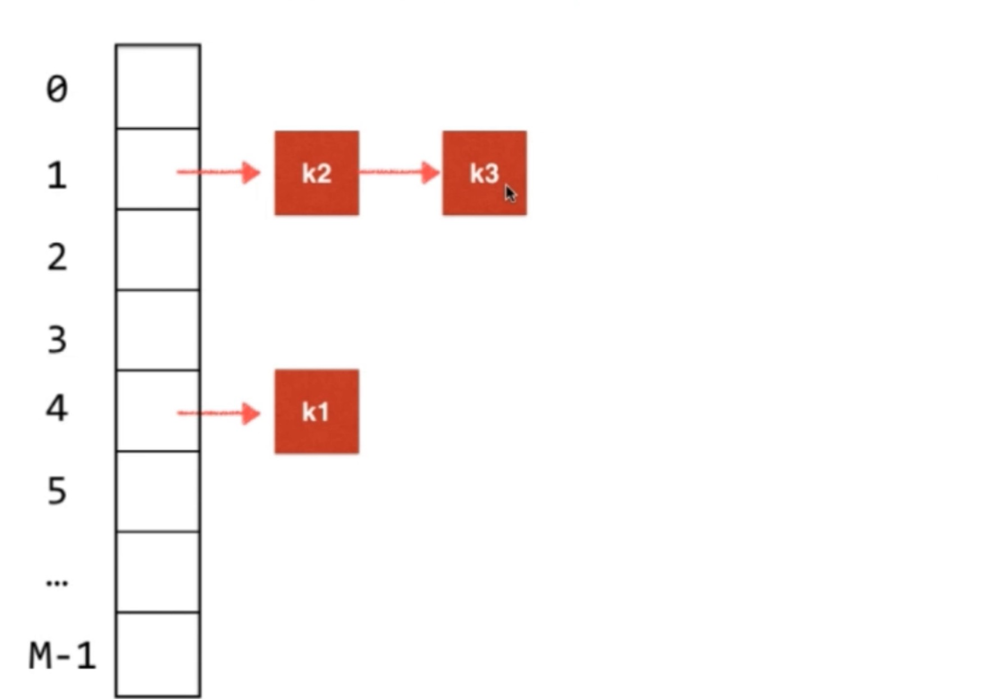
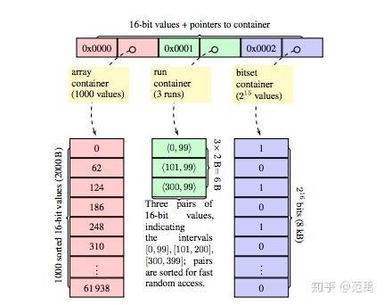
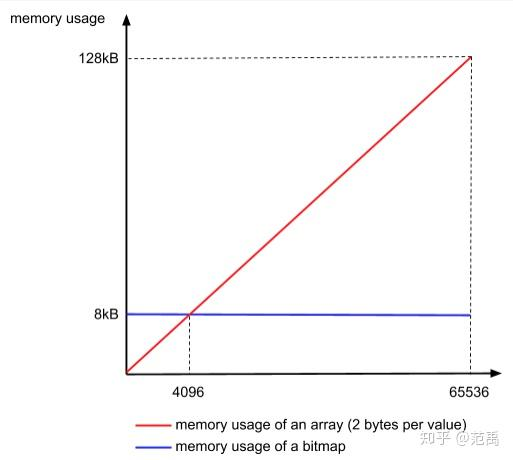
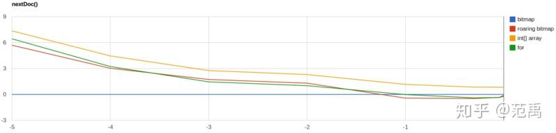
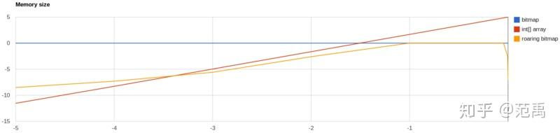
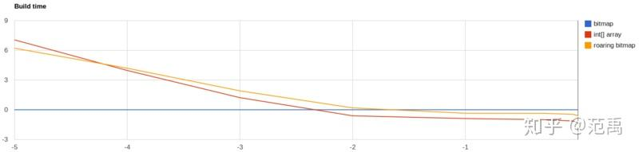
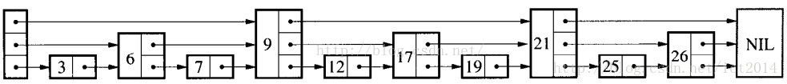
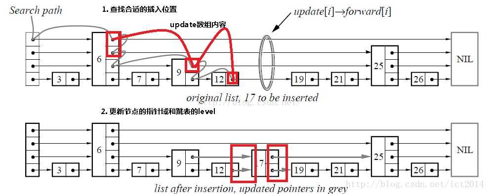
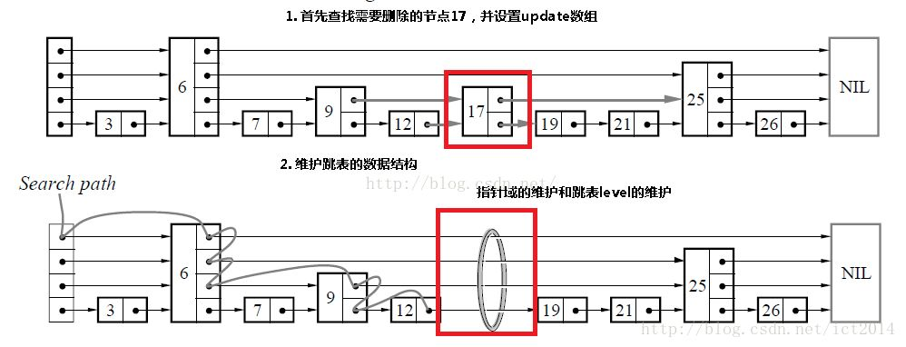

# 数组

## 基础概念

* 将数据码成一排进行存放。
* 连续的，支持根据`index`快速检索数据（随机访问），但是对于任意位置添加或任意位置删除时间复杂度存在最好和最坏的情况。

# 栈

* 栈是一种线性结构，相比数组，栈对应的操作是数组的子集，只能从一端添加元素，也只能从一端取出元素，此端为栈顶。
* 后进先出的数据结构，Last In First Out(LIFO)
* 类似于：**程序调用的系统栈**，A方法调用B方法调用C方法，AB都在系统栈中，当C方法调用完后，下次调用的是B方法。
* 可以利用数组和队列来实现，利用数组实现可以**向数组尾部插入数据，并且从尾部读取数据**。

# 队列

* 队列是一种线性结构，底层可以用动态数组实现，是一种FIFO(先进先出)的数据结构。

## 循环队列

* 利用index来记录队头和队位标示来记录队列的情况。


```java
public class LoopQueue<E> implements Queue<E> {

    private E[] data;
    // 队首索引
    private int front;
    // 队尾索引
    private int tail;

    private int size;

    public LoopQueue(int cap) {
        /**
         * 会浪费一个位置，front==tail为null front==tail+1 队列满
         */
        this.data = (E[]) new Object[cap + 1];
    }

    public LoopQueue() {
        this(10);
    }

    public int getCap() {
        return data.length - 1;
    }

    private boolean isValid() {
        // 防止数据越界
        return (this.tail + 1) % data.length == front;
    }

    private void resize(int cap) {
        E[] resizeQueue = (E[]) new Object[cap + 1];
        for (int i = 0; i < size; i++) {
            // 防止数组越界
            resizeQueue[i] = data[(i + front) % data.length];
        }
        data = resizeQueue;
        front = 0;
        tail = size;
    }

    @Override
    public void enqueue(E e) {
        // 扩容
        if (isValid()) {
            resize(getCap() * 2);
        }
        this.data[this.tail] = e;
        tail = (tail + 1) % data.length;
        size++;
    }

    @Override
    public E dequeue() {
        if (isEmpty()) {
            throw new NullPointerException("循环队列为空");
        }
        E ret = data[front];
        // help gc
        data[front] = null;
        front = (front + 1) % data.length;
        size--;
        // lazy 缩容
        if (this.size == getCap() / 4 && getCap() / 2 != 0) {
            resize(getCap() / 2);
        }
        return ret;
    }

    @Override
    public E getFront() {
        if (isEmpty()) {
            throw new NullPointerException("循环队列为空");
        }
        return data[front];
    }

    @Override
    public int getSize() {
        return size;
    }

    @Override
    public boolean isEmpty() {
        return this.front == this.tail;
    }

    @Override
    public String toString() {
        return "LoopQueue{" +
                "data=" + Arrays.toString(data) +
                ", front=" + front +
                ", tail=" + tail +
                ", size=" + size +
                '}';
    }

    public static void main(String[] args) {
        LoopQueue<Integer> loopQueue = new LoopQueue<>();
        for (int i = 0; i < 4; i++) {
            loopQueue.enqueue(i);
        }
        System.out.println(loopQueue.getCap());
        System.out.println(loopQueue.dequeue());
        System.out.println(loopQueue.getFront());
        System.out.println(loopQueue);
    }
}
```

# 链表

* 线性结构，动态的数据结构不需要处理固定容量的问题，更深入的理解引入(或者指针)。
* 深入理解的递归结构，数据存储在"**节点(Node)**"中，Node包含next指针和数据
* 不能够随机访问的能力，一般会通过一个虚拟节点来作为头部节点，向index位置插入数据时，需要遍历到index的节点，在其下一个节点插入元素即可，remove和get逻辑类似，详细查看如下代码

```java
public class LinkedList<E> {
    private class Node {
        E data;
        Node next;

        public Node(E data, Node next) {
            this.data = data;
            this.next = next;
        }

        public Node(E data) {
            this.data = data;
            this.next = null;
        }

        public Node() {
            this(null, null);
        }

        @Override
        public String toString() {
            return data.toString();
        }
    }

    private int size;
    private Node dummyHead;

    public LinkedList() {
        this.size = 0;
        this.dummyHead = new Node();
    }

    public int getSize() {
        return this.size;
    }

    public boolean isEmpty() {
        return this.size == 0;
    }

    public void add(int index, E e) {
        indexValid(index);
        Node pred = this.dummyHead;
        for (int i = 0; i < index; i++) {
            pred = pred.next;
        }
        pred.next = new Node(e, pred.next);
        size++;

    }

    public void addFirst(E e) {
        add(0, e);
    }

    public void addLast(E e) {
        add(size, e);
    }

    public E get(int index) {
        indexValid(index);
        Node cur = dummyHead.next;
        int i = 0;
        while (cur != null) {
            if (i == index) {
                return cur.data;
            }
            cur = cur.next;
            i++;
        }
        return null;
    }

    public E getFirst() {
        return get(0);
    }

    public E getLast() {
        return get(size - 1);
    }

    public void set(int index, E e) {
        indexValid(index);
        Node cur = this.dummyHead.next;
        for (int i = 0; i < index; i++) {
            cur = cur.next;
        }
        cur.data = e;
    }

    public boolean contains(E e) {
        Node cur = dummyHead.next;
        while (cur != null) {
            if (e == cur.data) {
                return true;
            }
            cur = cur.next;
        }
        return false;
    }

    public void remove(int index) {
        indexValid(index);
        Node prev = this.dummyHead;
        for (int i = 0; i < index; i++) {
            prev = prev.next;
        }
        Node deleteNode = prev.next;
        prev.next = deleteNode.next;
        // 移除删除节点引用
        deleteNode.next = null;
        size--;
    }

    private void indexValid(int index) {
        if (index < 0 || index > size) {
            throw new IllegalArgumentException("add failed.Illegal index.");
        }
    }

    @Override
    public String toString() {
        StringBuilder res = new StringBuilder();

        Node cur = dummyHead.next;
        while (cur != null) {
            res.append(cur).append("->");
            cur = cur.next;
        }
        res.append("NULL");
        return res.toString();
    }
}
```

# 二分搜索树(非线性数据结构)

## 特点

* 二叉树具有天然的递归结构
  * 每个节点的左子树也是二叉树
  * 每个节点的右子树也是二叉树
* 二分搜索数时二叉树
  * 二分搜索数的每个节点的值都大于其左子树所有节点的值，小于其右子树的所有节点的值。
  * 每颗子树也是一个二分搜索树

## 遍历

### 前序遍历

```java
//根 左 右
public void preOrder(Node<E> node) {
        if (node != null) {
                    // 访问根节点
            System.out.println(node.e);
            preOrder(node.left);
            preOrder(node.right);
        }
    }

// 非递归方式
private void preOrderNR() {
        Stack<Node<E>> stack = new Stack<>();
        if (root != null) {
            stack.push(root);
            while (!stack.isEmpty()) {
                Node<E> cur = stack.pop();
                System.out.println(cur.e);
						//  后进先出，会先处理完右子树
                if (cur.right != null) {
                    stack.push(cur.right);
                }
                if (cur.left != null) {
                    stack.push(cur.left);
                }
            }
        }
    }

```

### 中序遍历

* 中序遍历后得到的元素是顺序排列的

```java
// 左 根 右
 public void inOrder(Node<E> node) {
        if (node != null) {
            inOrder(node.left);
          // 访问根节点
            System.out.println(node.e);
            inOrder(node.right);
        }
    }
```

### 后序遍历

```java
// 左 右 根
public void postOrder(Node<E> node) {
        if (node != null) {
            preOrder(node.left);
            preOrder(node.right);
            System.out.println(node.e);
        }
    }
```

### 层序遍历

* 根据树的深度去遍历(BFS，广度优先遍历)，利用队列一层一层进行遍历,能够更快的找到搜索的元素
* 解决算法设计中的最短路径问题

```java
public void bfs() {
        Queue<Node<E>> queue = new LinkedList<>();
        if (root != null) {
            queue.add(root);
            while (!queue.isEmpty()) {
                Node<E> cur = queue.remove();
                System.out.println(cur.e);
                if (cur.left != null) {
                    queue.add(cur.left);
                }
                if (cur.right != null) {
                    queue.add(cur.right);
                }
            }
        }
    }
```

## 删除节点

### 删除左右都有孩子的节点d

* 找到s=min(d->right),s是d的后继
* s->right=delMin(d->right)
* s->left=d->left
* 删除d后，d的后继就是新的d，使用前驱也可以

```java
 /**
     * 最小值的节点
     *
     * @return
     */
    public Node<E> minimum(Node<E> node) {
        if (node.left == null) {
            return node;
        }
        return minimum(node.left);
    }

    public E maximum() {
        if (root == null) {
            throw new IllegalArgumentException();
        }
        return maximum(root).e;
    }

    /**
     * 最大值节点
     *
     * @param node
     * @return
     */
    public Node<E> maximum(Node<E> node) {
        if (node.right == null) {
            return node;
        }
        return maximum(node.right);
    }

    public E removeMin() {
        E ret = minimum();
        root = removeMin(root);
        return ret;
    }

    private Node<E> removeMin(Node<E> node) {
        if (node.left == null) {
            Node<E> rightNode = node.right;
            node.right = null;
            size--;
            return rightNode;
        }
        node.left = removeMin(node.left);
        return node;
    }

    public E removeMax() {
        E maximum = maximum();
        root = removeMax(root);
        return maximum;
    }

    public Node<E> removeMax(Node<E> node) {
        if (node.right == null) {
            Node<E> leftNode = node.left;
            node.left = null;
            size--;
            return leftNode;
        }
        node.right = removeMax(node.right);
        return node;
    }

    public void remove(E e) {
        root = remove(root, e);
    }

    private Node<E> remove(Node<E> node, E e) {
        if (node == null) {
            return null;
        }
        if (e.compareTo(node.e) < 0) {
            node.left = remove(node.left, e);
            return node;
        } else if (e.compareTo(node.e) > 0) {
            node.right = remove(node.right, e);
            return node;
        } else {
            if (node.left == null) {
                Node<E> rightNode = node.right;
                node.right = null;
                size--;
                return rightNode;
            } else if (node.right == null) {
                Node<E> leftNode = node.left;
                node.left = null;
                size--;
                return leftNode;
            }   // 如果存在左右孩子节点，找到node的后继，右节点的左节点
            Node<E> successor = minimum(node.right);
            successor.right = removeMin(node.right);
            successor.left = node.left;
            return successor;
        }
    }

   /**
     * 使用删除节点的前驱来替代删除的节点
     *
     * @param node
     * @param e
     * @return
     */
    private Node<E> remove1(Node<E> node, E e) {
        if (node == null) {
            return null;
        }
        if (e.compareTo(node.e) < 0) {
            node.left = remove(node.left, e);
            return node;
        } else if (e.compareTo(node.e) > 0) {
            node.right = remove(node.right, e);
            return node;
        } else {
            if (node.left == null) {
                Node<E> rightNode = node.right;
                node.right = null;
                size--;
                return rightNode;
            } else if (node.right == null) {
                Node<E> leftNode = node.left;
                node.left = null;
                size--;
                return leftNode;
            }   // 如果存在左右孩子节点，找到node的前驱，右节点的左节点
            Node<E> successor = maximum(node.left);
            successor.left = removeMax(node.left);
            successor.right = node.right;
            return successor;
        }
    }
```

# 堆和优先队列

## 优先队列

* 普通队列:先进先出；后进后出
* 出队顺序和入队顺序无关；和优先级相关

## 堆

* 二叉堆是一颗满二叉树
* 堆中某节点的值总是不大于其父节点的值，最大堆
* 父亲节点index是`(childIndex-1)/2`,`LeftChildIndex=parentIndex * 2+1`,`RightChildIndex=parentIndex * 2+2`
* 下沉和上浮核心逻辑

```java
   /**
     * 满足最大堆特性
     * 上升
     *
     * @param index
     */
    private void siftUp(int index) {
        // 如果index的parent小于index，则切换parent和index的位置，并且index赋值为parent
        // 滑动将特定index的数据按照大小往上移动
        while (index > 0 && data.get(parent(index)).compareTo(data.get(index)) < 0) {
            data.swap(parent(index), index);
            index = parent(index);
        }
    }

    /**
     * 下沉
     *
     * @param index
     */
    private void siftDown(int index) {
        // index的左孩子index小于数据size,直到找到最后
        while (leftChild(index) < data.size()) {
            // 找到index的左孩子
            int j = leftChild(index);
            // 左index+1小于数据大小并且获取左index+1大于左
            if (j + 1 < data.size() && data.get(j + 1).compareTo(data.get(j)) > 0) {
                j = rightChild(index);
            }
            if (data.get(index).compareTo(data.get(j)) >= 0) {
                break;
            }
            data.swap(index, j);
            index = j;
        }
    }
```

# 线段树【Draft】

* 检索查询复杂度Ologn
* 每个节点表示的都是一个区间内的数据,子节点都是区间的拆分，直到最终的子叶节点存储的为**一个长度的区间**。
* 线段树不是完全二叉树，也不一定是满二叉树
* 线段树是平衡二叉树，可以用数组来表示。

# 字典树


* 每个节点有26个指向下个节点的指针

```java
public class Trie {
  private static class Node{
    private boolean isWord;
    private TreeMap<Character,Node> next;
    public Node(boolean isWord){
      this.isWord=isWord;
      next=new TreeMap<>();
    }
    public Node(){
      this(false);
    }
  }
  private Node root;
  private int size;
  public Trie() {
    root = new Node();
    size = 0;
  }
  
  public int getSize(){
    return size;
  }
  
  public boolean isEmpty(){
    return size==0;
  }
  
  public void add(String word){
		Node cur=this.root;
    for (int i = 0; i < word.length(); i++) {
     Character c= word.charAt(i);
     if(!cur.next.containsKey(c)){
       cur.next.put(c,new Node());
     }
     cur=cur.next.get(c); 
    }
    if(!cur.isWord){
      cur.isWord=true;
    }
	  size++;
  }
  
  public boolean contains(String word){
		Node cur=this.root;
   for(int i=0; i<word.length();i++){
     char c= word.chatAt(i);
     if(!cur.next.containKey(c)){
       return false;
     }
     cur=cur.next.get(c);
   }
    return cur.isWord;
  }
  
   public boolean isPrefix(String prefix){
		Node cur=this.root;
   for(int i=0; i<word.length();i++){
     char c= word.chatAt(i);
     if(!cur.next.containKey(c)){
       return false;
     }
     cur=cur.next.get(c);
   }
    return true;
  }
}
```

# 并查集

## 概念

* 由孩子节点指向父亲节点。
* 主要用于解决俩个节点的连接问题。

## 实现

### Quick Union Find

 ```java
public class QuickUnionFind implements UnionFind {
    // 每个数据对应的集合的编号
    private int[] id;

    public QuickUnionFind(int size) {
        id = new int[size];
        // 将集合编号指向自己
        for (int i = 0; i < id.length; i++) {
            id[i] = i;
        }
    }

    @Override
    public int getSize() {
        return id.length;
    }

    @Override
    public boolean isConnected(int p, int q) {
        // p和q所存储的集合编号是否相等
        return find(p) == find(q);
    }


    /**
     * O n
     *
     * @param p
     * @param q
     */
    @Override
    public void unionElements(int p, int q) {
        int rootP = find(p);
        int rootQ = find(q);
        if (rootP == rootQ) {
            return;
        }
        for (int i = 0; i < id.length; i++) {
            if (id[i] == rootP) {
                id[i] = rootQ;
            }
        }
    }

    /**
     * 查找元素p对应的编号
     *
     * @param p
     * @return
     */
    private int find(int p) {
        if (p < 0 || p >= id.length) {
            throw new IllegalArgumentException();
        }
        return id[p];
    }
}
 ```

### Tree Uinon Find

```java
public class TreeUnionFind implements UnionFind {

    private int[] parent;
    private int count;
    private int[] size;

    public TreeUnionFind(int count) {
        this.count = count;
        size = new int[count];
        parent = new int[count];
        // 节点指向自己
        for (int i = 0; i < parent.length; i++) {
            parent[i] = i;
            size[i] = 1;
        }
    }

    @Override
    public int getSize() {
        return count;
    }

    @Override
    public boolean isConnected(int p, int q) {
        return find(p) == find(q);
    }

    @Override
    public void unionElements(int p, int q) {
        int rootP = find(p);
        int rootQ = find(q);
        if (rootP == rootQ) {
            return;
        }
        // 防止数据倾斜将小树接到大树下, size优化
        if (size[rootP] >= size[rootQ]) {
            parent[rootQ] = rootP;
            size[rootP] += size[rootQ];
        } else {
            parent[rootP] = rootQ;
            size[rootQ] += size[rootP];
        }
        count--;
    }

    private int find(int p) {
        if (p < 0 || p >= parent.length) {
            throw new IllegalArgumentException();
        }
        while (parent[p] != p) {
            // 路径压缩，减少遍历数据深度
            parent[p] = parent[parent[p]];
            p = parent[p];
        }
        return p;
    }
}
```

### rank和路径压缩

```java
public class TreeUnionFind1 implements UnionFind {

    private int[] parent;
    private int count;
    private int[] rank;

    public TreeUnionFind1(int count) {
        this.count = count;
        rank = new int[count];
        parent = new int[count];
        // 节点指向自己
        for (int i = 0; i < parent.length; i++) {
            parent[i] = i;
            rank[i] = 1;
        }
    }

    @Override
    public int getSize() {
        return count;
    }

    @Override
    public boolean isConnected(int p, int q) {
        return find(p) == find(q);
    }

    @Override
    public void unionElements(int p, int q) {
        int rootP = find(p);
        int rootQ = find(q);
        if (rootP == rootQ) {
            return;
        }
        // 防止数据倾斜将小树接到大树下, size优化
        if (rank[rootP] > rank[rootQ]) {
            parent[rootQ] = rootP;
        } else if (rank[rootP] < rank[rootQ]) {
            parent[rootP] = rootQ;
        } else {
            parent[rootP] = rootQ;
            rank[rootQ] += 1;
        }
        count--;
    }

    private int find(int p) {
        if (p < 0 || p >= parent.length) {
            throw new IllegalArgumentException();
        }
        while (parent[p] != p) {
            // 路径压缩，减少遍历数据深度
            parent[p] = parent[parent[p]];
            p = parent[p];
        }
        return p;
    }
}
```

# AVL树

## 平衡二叉树

* 对于任意一个节点，左子树和右子树的高度差不能超过1。
* 标注节点的高度，计算平衡因子，平衡因子为高度差，一旦其绝对值大于1则不为平衡二叉树。

## 左旋转和右旋转

* 添加节点后，沿着节点向上维护平衡性。

### 右旋转

* LL:新插入节点在left子树的left


* 插入的元素在不平衡的节点的左侧的左侧，此时可以使用右旋转保证树的平衡
* 将原本的根节点y顺时针旋转到x的右子树，x为新的根节点。

```java
# 右旋转调节
if( balanceFactor > 1 && getBalanceFactor(node.left) > 0){
return   rightRotate(node);
}


   private Node<E> rightRotate(Node<E> y) {
        Node<E> x = y.left;
        Node<E> T3 = x.right;
        // 向右旋转
        x.right = y;
        y.left = T3;

        // 更新height
        y.height = Math.max(getHeight(y.left), getHeight(y.right)) + 1;
        x.height = Math.max(getHeight(x.left), getHeight(x.right)) + 1;
        return x;
    }
```

### 左旋转

* RR:插入的节点在right树的right

* 插入的元素在不平衡的节点的右侧的右侧

```java
# 左旋转条件
if (balanceFactor<-1&&getBalanceFactor(node.right)<=0){
            return leftRotate(node);
        }


	 /**
     *    y                                     x
     *   / \                                   / \
     *  T1  x                                 y   z
     *      /\         ------->向左旋转       / \  / \
     *     T2 z                            T1 T2 T3 T4
     *        /\
     *       T3 T4
     * @param y
     * @return
     */
private Node<E> leftRotate(Node<E> y) {
  Node<E> x = y.right;
  Node<E> T2 = x.left;
  // 向左旋转
  x.left = y;
  y.right = T2;

  // 更新height
  y.height=Math.max(getHeight(y.left),getHeight(y.right))+1;
  x.height=Math.max(getHeight(x.left),getHeight(x.right))+1;
  return x;
}

```

### LR


* 新插入的节点在Left子树的Right侧。
* 先对x节点左旋转后，转换为LL，在进行右旋转。

```java
# 满足LR的条件
// 左子树大于右子树，并且左子树的左子树小于左子树的右子树
        if (balanceFactor > 1 && getBalanceFactor(node.left) < 0) {
            node.left = leftRotate(node.left);
            return rightRotate(node);
        }
```


### RL


* 先对x节点进行右旋转,转换成了RR，再进行左旋转。

```java
# 满足RL的条件
    if (balanceFactor < -1 && getBalanceFactor(node.right) > 0) {
            node.right = rightRotate(node.right);
            return leftRotate(node);
        }
```

# 红黑树

## 特点

* 每个节点或者是红色或者是黑色
* 根节点是黑色
* 每一个叶子结点(最后的空节点)是黑色
* 如果一个节点是红色的，那么它的孩子节点都是黑色的
* 从任意一个节点到叶子节点，经过的黑色节点是一样的
* 红黑树是保持"黑平衡"的二叉树，严格意义上不是平衡二叉树，最大高度是:2logn O(logn)

```java
import java.util.ArrayList;

public class RBTree<K extends Comparable<K>, V> {

    private static final boolean RED = true;
    private static final boolean BLACK = false;

    private class Node{
        public K key;
        public V value;
        public Node left, right;
        public boolean color;

        public Node(K key, V value){
            this.key = key;
            this.value = value;
            left = null;
            right = null;
            color = RED;
        }
    }

    private Node root;
    private int size;

    public RBTree(){
        root = null;
        size = 0;
    }

    public int getSize(){
        return size;
    }

    public boolean isEmpty(){
        return size == 0;
    }

    // 判断节点node的颜色
    private boolean isRed(Node node){
        if(node == null)
            return BLACK;
        return node.color;
    }

    //   node                     x
    //  /   \     左旋转         /  \
    // T1   x   --------->   node   T3
    //     / \              /   \
    //    T2 T3            T1   T2
    private Node leftRotate(Node node){

        Node x = node.right;

        // 左旋转
        node.right = x.left;
        x.left = node;

        x.color = node.color;
        node.color = RED;

        return x;
    }

    //     node                   x
    //    /   \     右旋转       /  \
    //   x    T2   ------->   y   node
    //  / \                       /  \
    // y  T1                     T1  T2
    private Node rightRotate(Node node){

        Node x = node.left;

        // 右旋转
        node.left = x.right;
        x.right = node;

        x.color = node.color;
        node.color = RED;

        return x;
    }

    // 颜色翻转
    private void flipColors(Node node){

        node.color = RED;
        node.left.color = BLACK;
        node.right.color = BLACK;
    }

    // 向红黑树中添加新的元素(key, value)
    public void add(K key, V value){
        root = add(root, key, value);
        root.color = BLACK; // 最终根节点为黑色节点
    }

    // 向以node为根的红黑树中插入元素(key, value)，递归算法
    // 返回插入新节点后红黑树的根
    private Node add(Node node, K key, V value){

        if(node == null){
            size ++;
            return new Node(key, value); // 默认插入红色节点
        }

        if(key.compareTo(node.key) < 0)
            node.left = add(node.left, key, value);
        else if(key.compareTo(node.key) > 0)
            node.right = add(node.right, key, value);
        else // key.compareTo(node.key) == 0
            node.value = value;

        if (isRed(node.right) && !isRed(node.left))
            node = leftRotate(node);

        if (isRed(node.left) && isRed(node.left.left))
            node = rightRotate(node);

        if (isRed(node.left) && isRed(node.right))
            flipColors(node);

        return node;
    }

    // 返回以node为根节点的二分搜索树中，key所在的节点
    private Node getNode(Node node, K key){

        if(node == null)
            return null;

        if(key.equals(node.key))
            return node;
        else if(key.compareTo(node.key) < 0)
            return getNode(node.left, key);
        else // if(key.compareTo(node.key) > 0)
            return getNode(node.right, key);
    }

    public boolean contains(K key){
        return getNode(root, key) != null;
    }

    public V get(K key){

        Node node = getNode(root, key);
        return node == null ? null : node.value;
    }

    public void set(K key, V newValue){
        Node node = getNode(root, key);
        if(node == null)
            throw new IllegalArgumentException(key + " doesn't exist!");

        node.value = newValue;
    }

    // 返回以node为根的二分搜索树的最小值所在的节点
    private Node minimum(Node node){
        if(node.left == null)
            return node;
        return minimum(node.left);
    }

    // 删除掉以node为根的二分搜索树中的最小节点
    // 返回删除节点后新的二分搜索树的根
    private Node removeMin(Node node){

        if(node.left == null){
            Node rightNode = node.right;
            node.right = null;
            size --;
            return rightNode;
        }

        node.left = removeMin(node.left);
        return node;
    }

    // 从二分搜索树中删除键为key的节点
    public V remove(K key){

        Node node = getNode(root, key);
        if(node != null){
            root = remove(root, key);
            return node.value;
        }
        return null;
    }

    private Node remove(Node node, K key){

        if( node == null )
            return null;

        if( key.compareTo(node.key) < 0 ){
            node.left = remove(node.left , key);
            return node;
        }
        else if(key.compareTo(node.key) > 0 ){
            node.right = remove(node.right, key);
            return node;
        }
        else{   // key.compareTo(node.key) == 0

            // 待删除节点左子树为空的情况
            if(node.left == null){
                Node rightNode = node.right;
                node.right = null;
                size --;
                return rightNode;
            }

            // 待删除节点右子树为空的情况
            if(node.right == null){
                Node leftNode = node.left;
                node.left = null;
                size --;
                return leftNode;
            }

            // 待删除节点左右子树均不为空的情况

            // 找到比待删除节点大的最小节点, 即待删除节点右子树的最小节点
            // 用这个节点顶替待删除节点的位置
            Node successor = minimum(node.right);
            successor.right = removeMin(node.right);
            successor.left = node.left;

            node.left = node.right = null;

            return successor;
        }
    }

    public static void main(String[] args){

        System.out.println("Pride and Prejudice");

        ArrayList<String> words = new ArrayList<>();
        if(FileOperation.readFile("pride-and-prejudice.txt", words)) {
            System.out.println("Total words: " + words.size());

            RBTree<String, Integer> map = new RBTree<>();
            for (String word : words) {
                if (map.contains(word))
                    map.set(word, map.get(word) + 1);
                else
                    map.add(word, 1);
            }

            System.out.println("Total different words: " + map.getSize());
            System.out.println("Frequency of PRIDE: " + map.get("pride"));
            System.out.println("Frequency of PREJUDICE: " + map.get("prejudice"));
        }

        System.out.println();
    }
}

```

# 2-3树

## 特点

* 满足二分搜索树的基本性质
* 节点可以存放一个元素或者两个元素


## 红黑树和2-3树


* 每个三节点都会产生一个红色节点。

# 哈希表

## 哈希函数的设计

* 整型
  * 小范围正整数直接使用
  * 小范围负整数进行偏移

### 原则

* 一致性:如果a==b,hash(a)==hash(b)
* 高效性:计算高效简便
* 均匀性:哈希值均匀分布

## 解决哈希冲突

### 链表地址法（JDK1.8之前HashMap hash冲突解决方式，数组+链表）



# BitMap分析1

## 实现原理

​     在java中，一个int类型占32个比特，我们用一个int数组来表示时为new int[32],总计占用内存32*32bit,现假如我们用int字节码的每一位表示一个数字的话，那么32个数字只需要一个int类型所占内存空间大小就够了，这样在大数据量的情况下会节省很多内存。

**具体思路:**

　1个int占4字节即4*8=32位，那么我们只需要申请一个int数组长度为 int tmp[1+N/32]即可存储完这些数据，其中N代表要进行查找的总数，tmp中的每个元素在内存在占32位可以对应表示十进制数0~31,所以可得到BitMap表:

　　　　tmp[0]:可表示0~31

　　　　tmp[1]:可表示32~63

　　　　tmp[2]可表示64~95

　　　　.......

　　那么接下来就看看十进制数如何转换为对应的bit位：

　　假设这40亿int数据为：6,3,8,32,36,......，那么具体的BitMap表示为：


　　如何判断int数字在tmp数组的哪个下标，这个其实可以通过直接`除以32取整数部分`，例如：`整数8除以32取整等于0，那么8就在tmp[0]上`。另外，我们如何知道了8在tmp[0]中的32个位中的哪个位，这种情况直接`mod上32`就ok，又如整数8，在tmp[0]中的第8mod上32等于8，那么整数8就在tmp[0]中的第八个bit位（从右边数起）。

```java
public class BitMap {
    //保存数据的
    private byte[] bits;
    
    //能够存储多少数据
    private int capacity;
    
    
    public BitMap(int capacity){
        this.capacity = capacity;
        
        //1bit能存储8个数据，那么capacity数据需要多少个bit呢，capacity/8+1,右移3位相当于除以8
        bits = new byte[(capacity >>3 )+1];
    }
    
    public void add(int num){
        // num/8得到byte[]的index
        int arrayIndex = num >> 3; 
        
        // num%8得到在byte[index]的位置
        int position = num & 0x07; 
        
        //将1左移position后，那个位置自然就是1，然后和以前的数据做|，这样，那个位置就替换成1了。
        bits[arrayIndex] |= 1 << position; 
    }
    
    public boolean contain(int num){
        // num/8得到byte[]的index
        int arrayIndex = num >> 3; 
        
        // num%8得到在byte[index]的位置
        int position = num & 0x07; 
        
        //将1左移position后，那个位置自然就是1，然后和以前的数据做&，判断是否为0即可
        return (bits[arrayIndex] & (1 << position)) !=0; 
    }
    
    public void clear(int num){
        // num/8得到byte[]的index
        int arrayIndex = num >> 3; 
        
        // num%8得到在byte[index]的位置
        int position = num & 0x07; 
        
        //将1左移position后，那个位置自然就是1，然后对取反，再与当前值做&，即可清除当前的位置了.
        bits[arrayIndex] &= ~(1 << position); 

    }
}
```

## bitMap应用

1. 看个小场景 > 在3亿个整数中找出不重复的整数，限制内存不足以容纳3亿个整数。

   > 对于这种场景我可以采用2-BitMap来解决，即为每个整数分配2bit，用不同的0、1组合来标识特殊意思，如00表示此整数没有出现过，01表示出现一次，11表示出现过多次，就可以找出重复的整数了，其需要的内存空间是正常BitMap的2倍，为：`3亿*2/8/1024/1024=71.5MB`。

　　**具体的过程如下：**

> 扫描着3亿个整数，组BitMap，先查看BitMap中的对应位置，如果00则变成01，是01则变成11，是11则保持不变，当将3亿个整数扫描完之后也就是说整个BitMap已经组装完毕。最后查看BitMap将对应位为11的整数输出即可。

2. 已知某个文件内包含一些电话号码，每个号码为8位数字，统计不同号码的个数。

   > 8位最多99 999 999，大概需要99 999 999个bit，大概10几m字节的内存即可。 （可以理解为从0-99 999 999的数字，每个数字对应一个Bit位，所以只需要99M个Bit==1.2MBytes，这样，就用了小小的1.2M左右的内存表示了所有的8位数的电话）　　

## bitMap问题

　BitMap 的思想在面试的时候还是可以用来解决不少问题的，然后在很多系统中也都会用到，算是一种不错的解决问题的思路。

　　但是 BitMap 也有一些局限，因此会有其它一些基于 BitMap 的算法出现来解决这些问题。

- 数据碰撞。比如将字符串映射到 BitMap 的时候会有碰撞的问题，那就可以考虑用 **Bloom Filter** 来解决，Bloom Filter 使用多个 Hash 函数来减少冲突的概率。
- 数据稀疏。又比如要存入(10,8887983,93452134)这三个数据，我们需要建立一个 99999999 长度的 BitMap ，但是实际上只存了3个数据，这时候就有很大的空间浪费，碰到这种问题的话，可以通过引入 Roaring BitMap 来解决。

# BitMap分析2

* bitMap是位图，其实准确的来说，翻译成基于位的映射，举一个例子，有一个无序有界int数组{1,2,5,7},初步估计占用内存4x4=16字节，假如有10亿个这样的数呢，10亿 x 4字节/(1024 x 1024 x 1024)=3.72G左右（1GB=1024MB 、1MB=1024KB 、1KB=1024B 、1B=8b）。如果这样的一个大的数据做查找和排序，那估计内存也崩溃了，有人说，这些数据可以不用一次性加载，那就是要存盘了，存盘必然消耗IO。我们提倡的是高性能，这个方案直接不考虑。

## 问题分析

　　如果用BitMap思想来解决的话，就好很多，解决方案如下：

* 一个byte是占8个bit，如果每一个bit的值就是有或者没有，也就是二进制的0或者1，如果用bit的位置代表数组值有还是没有， 那么0代表该数值没有出现过，1代表该数组值出现过。不也能描述数据了吗？具体如下图：


* 现在假如10亿的数据所需的空间就是3.72G/32了吧，一个占用32bit的数据现在只占用了1bit，节省了不少的空间，排序就更不用说了，一切显得那么顺利。这样的数据之间没有关联性，要是读取的，你可以用多线程的方式去读取。时间复杂度方面也是O(Max/n)，其中Max为byte[]数组的大小，n为线程大小。

## 应用与代码实现

* 一个数怎么快速定位它的索引号，也就是说搞清楚byte[index]的index是多少，position是哪一位。举个例子吧，例如add(14)。14已经超出byte[0]的映射范围，在byte[1]范围之类。那么怎么快速定位它的索引呢。如果找到它的索引号，又怎么定位它的位置呢。Index(N)代表N的索引号，Position(N)代表N的所在的位置号。

```java
Index(N) = N/8 = N >> 3;
Position(N) = N%8 = N & 0x07;
```

### add(int num)

* 你要向bitmap里add数据该怎么办呢，不用担心，很简单，也很神奇。上面已经分析了，add的目的是为了将所在的位置从0变成1.其他位置不变.


```java
public void add(int num){
        // num/8得到byte[]的index
        int arrayIndex = num >> 3; 
        
        // num%8得到在byte[index]的位置
        int position = num & 0x07; 
        
        //将1左移position后，那个位置自然就是1，然后和以前的数据做|，这样，那个位置就替换成1了。
        bits[arrayIndex] |= 1 << position; 
}
```

### clear(int num)

* 对1进行左移，然后取反，最后与byte[index]作与操作。


```java
public void clear(int num){
        // num/8得到byte[]的index
        int arrayIndex = num >> 3; 
        
        // num%8得到在byte[index]的位置
        int position = num & 0x07; 
        
        //将1左移position后，那个位置自然就是1，然后对取反，再与当前值做&，即可清除当前的位置了.
        bits[arrayIndex] &= ~(1 << position); 

}
```

### contain(int num)


```java
public boolean contain(int num){ // num/8得到byte[]的index
        int arrayIndex = num >> 3; // num%8得到在byte[index]的位置
        int position = num & 0x07; //将1左移position后，那个位置自然就是1，然后和以前的数据做&，判断是否为0即可
        return (bits[arrayIndex] & (1 << position)) !=0; 
}
```

### 完整代码

```java
public class BitMap {
    //保存数据的
    private byte[] bits;
    
    //能够存储多少数据
    private int capacity;
    
    
    public BitMap(int capacity){
        this.capacity = capacity;
        
        //1bit能存储8个数据，那么capacity数据需要多少个bit呢，capacity/8+1,右移3位相当于除以8
        bits = new byte[(capacity >>3 )+1];
    }
    
    public void add(int num){
        // num/8得到byte[]的index
        int arrayIndex = num >> 3; 
        
        // num%8得到在byte[index]的位置
        int position = num & 0x07; 
        
        //将1左移position后，那个位置自然就是1，然后和以前的数据做|，这样，那个位置就替换成1了。
        bits[arrayIndex] |= 1 << position; 
    }
    
    public boolean contain(int num){
        // num/8得到byte[]的index
        int arrayIndex = num >> 3; 
        
        // num%8得到在byte[index]的位置
        int position = num & 0x07; 
        
        //将1左移position后，那个位置自然就是1，然后和以前的数据做&，判断是否为0即可
        return (bits[arrayIndex] & (1 << position)) !=0; 
    }
    
    public void clear(int num){
        // num/8得到byte[]的index
        int arrayIndex = num >> 3; 
        
        // num%8得到在byte[index]的位置
        int position = num & 0x07; 
        
        //将1左移position后，那个位置自然就是1，然后对取反，再与当前值做&，即可清除当前的位置了.
        bits[arrayIndex] &= ~(1 << position); 

    }
    
    public static void main(String[] args) {
        BitMap bitmap = new BitMap(100);
        bitmap.add(7);
        System.out.println("插入7成功");
        
        boolean isexsit = bitmap.contain(7);
        System.out.println("7是否存在:"+isexsit);
        
        bitmap.clear(7);
        isexsit = bitmap.contain(7);
        System.out.println("7是否存在:"+isexsit);
    }
}
```

# 稀疏位图

位图（bitmap／bitset）在工程中应用广泛（如搜索引擎中的posting list），同时也是面试中一个重要考点

位图在求交（introsect），求并（union）计算时有很好的性能，但如果数据集分布稀疏时，也会浪费较多空间。例如，当数据取值范围为[0, 2^32-1]，数据个数在1000w左右时，位图占用512MB，其中0的个数只占0.2%，空间浪费相当严重。

为了解决空间浪费，显然位图需要进行压缩。Daniel Lemire的[Roaring Bitmaps](https://link.zhihu.com/?target=http%3A//roaringbitmap.org/)是众多压缩（稀疏）位图实现中的性能最好的一种：

1. 支持动态修改位图（静态的位图有其它压缩方式）
2. 利用SIMD加速位图操作

## Roaring的数据结构

* Roaring Bitmaps明确面向稀疏位图，使用之前你要明确数据的分布／数量，否则Roaring可能占用比未压缩位图更多的空间和耗费更多的操作时间。
* Roaring Bitmaps思路是将取值范围分片，每片大小相同，可容纳2^16个数。根据范围内实际数据的个数／分布选择最紧凑的存储形式：
  * 区间内数据较多，且分布零散，则选择（未压缩）位图
  * 区间内数据较少，且分布零散，则选择使用有序数组
  * 区间内数据连续分布，则选择用Run Length Encoding编码



* Roaring将Bitmap从一层的连续存储，转换为一个二级的存储结构
  * 第一层称之为Chunk，每个Chunk表示该区间取值范围的base(n2^16, 0<= n < 2^16)，如果该取值范围内没有数据则Chunk不会创建
  * 第二层称之为Container，会依据数据分布进行创建（Container内的值实际是区间内的offset）
    * Roaring并不是一种静态数据结构，随着数据的增删，Container选择的存储格式也会随之自动调整

* 这里另一个重要参数是如何依据数据个数来判定使用位图还是数组。Roaring 选择**4096**作为阈值。
  * 当区间内数量少于4096时，数组占用更紧凑；多于4096，则使用位图更经济



Roaring Bitmap提供O(logn)的查找性能：

- 首先二分查找key值的高16位是否在分片`(chunk）`中
- 如果分片存在，则查找分片对应的Container是否存在
  - 如果Bitmap Container，查找性能是O(1)
  - 其它两种Container，需要进行二分查找


## **Roaring的性能**

* Roaring使用了SIMD对操作进行了加速
* Lucene在5.0中引入了Roaring缓存filter，并对Roaring进行了[性能评测](https://link.zhihu.com/?target=https%3A//www.elastic.co/blog/frame-of-reference-and-roaring-bitmaps)。

### 遍历



- 当数据比较稀疏时，Roaring相比Bitmap性能更好，但弱于int数组
- 当数据比较密集时，Roaring性能会比Bitmap差，最好的是int数组

### **内存占用**



- 数据极其稀疏时，int数组更节省空间，但到了某一拐点后，Roaring会更加节省空间
- 数据很密集时，int数组占用空间呈线性增长会快速超越Bitmap占用，而Roaring甚至可能由于其紧凑的编码格式（Run Length Encoding）反而比Bitmap更节省空间

### **构建时间**



- 当数据极其稀疏时，位图构建速度远远快过int数组和Roaring
- 当数据超过全量1%时，Roaring成为构建速度更快的格式

# skiplist

* skiplist就是普通单向链表的基础上增加了分层索引，可以快速地根据分层索引定位数据。



## 查找

* 比如我们要查找key为19的结点，那么我们不需要逐个遍历，而是按照如下步骤:
  - 从header出发，从高到低的level进行查找，先索引到9这个结点，发现9 < 19,继续查找(然后在level==2这层)，查找到21这个节点，由于21 > 19, 所以结点不往前走，而是level由2降低到1
  - 然后索引到17这个节点，由于17 < 19, 所以继续往后，索引到21这个结点，发现21>19, 所以level由1降低到0
  - 在结点17上，level==0索引到19,查找完毕。
  - 如果在level==0这层没有查找到，那么说明不存在key为19的节点，查找失败

```c++
# Node节点
//forward declaration
template<typename K, typename V>
class SkipList;

template<typename K, typename V>
class Node {

    friend class SkipList<K, V>;

public:

    Node() {}

    Node(K k, V v);

    ~Node();

    K getKey() const;

    V getValue() const;

private:
    K key;
    V value;
    Node<K, V> **forward;
    int nodeLevel;
};

template<typename K, typename V>
Node<K, V>::Node(const K k, const V v) {
    key = k;
    value = v;
};

template<typename K, typename V>
Node<K, V>::~Node() {
    delete[]forward;
};

template<typename K, typename V>
K Node<K, V>::getKey() const {
    return key;
}

template<typename K, typename V>
V Node<K, V>::getValue() const {
    return value;
}
# 查找实现
template<typename K, typename V>
Node<K, V> *SkipList<K, V>::search(const K key) const {
    Node<K, V> *node = header;
    for (int i = level; i >= 0; --i) {
        while ((node->forward[i])->key < key) {
            node = *(node->forward + i);
        }
    }
    node = node->forward[0];
    if (node->key == key) {
        return node;
    } else {
        return nullptr;
    }
};
```

## 插入



* 其实插入节点的关键就是找到合适的插入位置，即从所有小于待插入节点key值的节点中，找出最大的那个，所以插入节点的过程如下:
  - 查找合适的插入位置，比如上图中要插入key为17的结点，就需要一路查找到12,由于12 < 17,而12的下一个结点19 > 17,因而满足条件
  - 创建新结点，并且产生一个在1~MAX_LEVEL之间的随机level值作为该结点的level
  - 调整指针指向

```c++
template<typename K, typename V>
bool SkipList<K, V>::insert(K key, V value) {
    Node<K, V> *update[MAX_LEVEL];
    Node<K, V> *node = header;
    for (int i = level; i >= 0; --i) {
        while ((node->forward[i])->key < key) {
            node = node->forward[i];
        }
        update[i] = node;
    }
    //首个结点插入时，node->forward[0]其实就是footer
    node = node->forward[0];
    //如果key已存在，则直接返回false
    if (node->key == key) {
        return false;
    }
    int nodeLevel = getRandomLevel();
    if (nodeLevel > level) {
        nodeLevel = ++level;
        update[nodeLevel] = header;
    }
    //创建新结点
    Node<K, V> *newNode;
    createNode(nodeLevel, newNode, key, value);
    //调整forward指针
    for (int i = nodeLevel; i >= 0; --i) {
        node = update[i];
        newNode->forward[i] = node->forward[i];
        node->forward[i] = newNode;
    }
    ++nodeCount;
#ifdef DEBUG
    dumpAllNodes();
#endif
    return true;
};
```

## 移除



* 移除结点其实很简单,就分以下3步:
  - 查找到指定的结点，如果没找到则返回
  - 调整指针指向
  - 释放结点空间

```c++
template<typename K, typename V>
bool SkipList<K, V>::remove(K key, V &value) {
    Node<K, V> *update[MAX_LEVEL];
    Node<K, V> *node = header;
    for (int i = level; i >= 0; --i) {
        while ((node->forward[i])->key < key) {
            node = node->forward[i];
        }
        update[i] = node;
    }
    node = node->forward[0];
    //如果结点不存在就返回false
    if (node->key != key) {
        return false;
    }
    value = node->value;
    for (int i = 0; i <= level; ++i) {
        if (update[i]->forward[i] != node) {
            break;
        }
        update[i]->forward[i] = node->forward[i];
    }
    //释放结点
    delete node;
    //更新level的值，因为有可能在移除一个结点之后，level值会发生变化，及时移除可避免造成空间浪费
    while (level > 0 && header->forward[level] == footer) {
        --level;
    }
    --nodeCount;
#ifdef DEBUG
    dumpAllNodes();
#endif
    return true;
};
```

