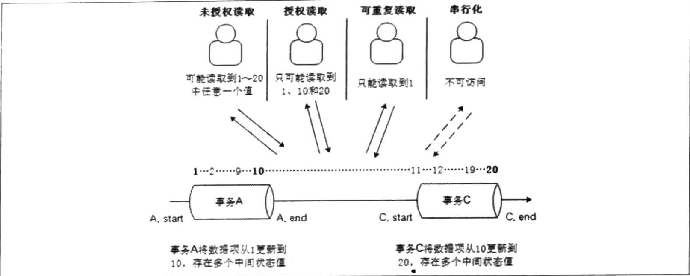
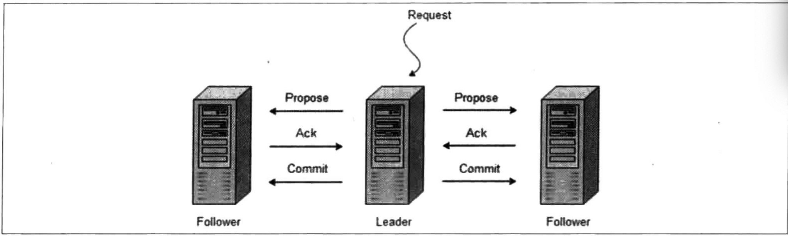
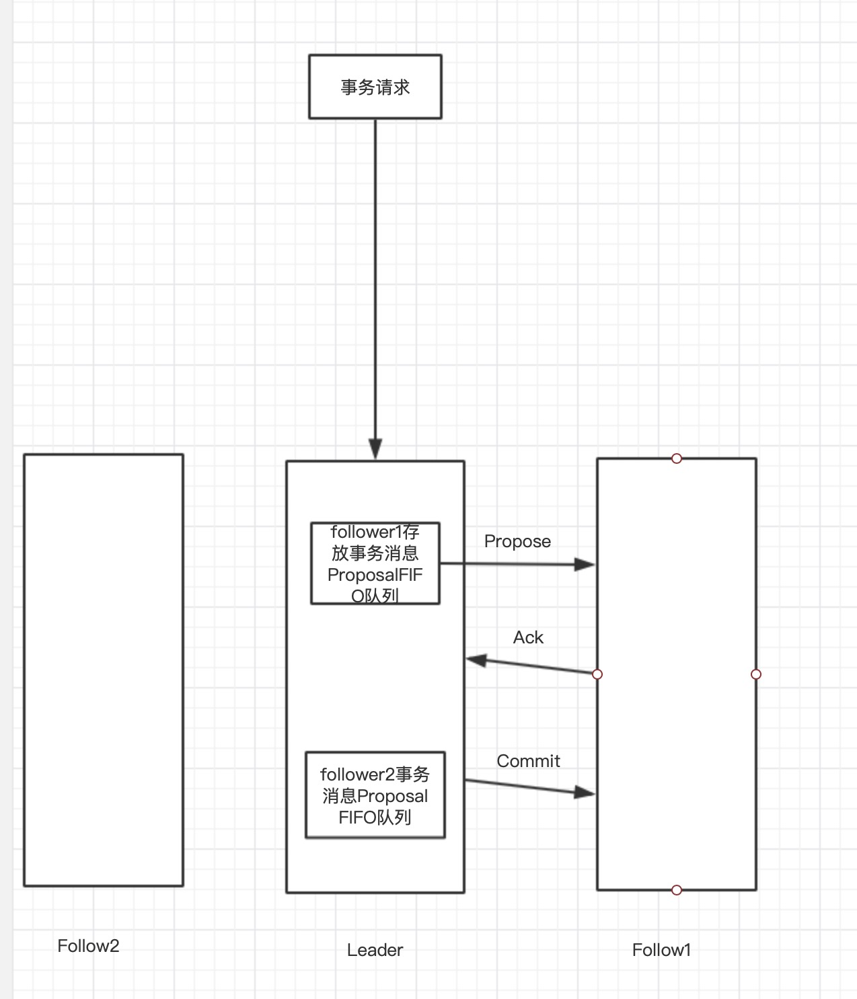
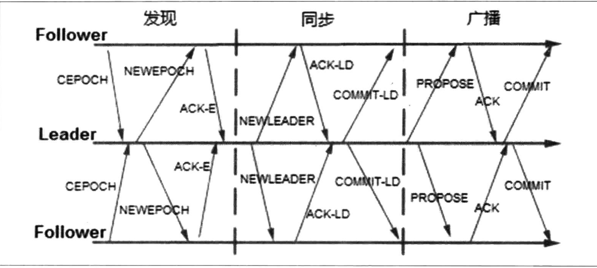

# 分布式架构

## 分布式理论

### ACID



### CAP

* CAP:Consistency:一致性、Availability:可用性、Partition tolerance:分区容错性
* 最多只能同时满足两项

#### 一致性

* 多个副本之间是否能够保持`数据一致`的特性，即一个节点数据更新后，另一个节点的数据也应到更新，这是一种`强一致性`。

#### 可用性

* 可用性是指系统提供的服务必须一直处于可用状态，对于用户的每一个操作请求都可以在有限的时间内返回结果。

#### 分区容错性

* 分区容错性约束了一个分布式系统具有的特性，分布式系统在遇到任何网络分区故障的时候，仍然需要能够保证对外提供满足一致性和可用性的服务，除非整个网络环境都发生了故障。

### BASE

* Basically Availabe(基本可用)、Soft state(软状态)和Eventually consistent(最终一致性)，是对CAP中一致性和可用性权衡的结果。

#### 基本可用

* 响应时间上的损失:正常来说响应时0.5s，发生故障时可以维持在2～3s左右
* 功能上的损失:服务降级方式保证基本可用

#### 软状态

* 运行系统中的数据存在中间状态，并认为该中间状态的存在不会影响整个系统的可用性，即运行系统在不同节点上的数据副本之间进行数据同步的过程存在延时。

#### 最终一致性

* 系统中所有的数据副本在经过一段时间的同步后，最终能够达到一个一致的状态。

**最终一致性的变体**

* 因果一致性:如果进程A在更新完某个数据后通知了进程B，那么进程B之后对该数据的访问都应该能够获取A更新后的最新值，并且如果进程B要对该数据进行更新的话，务必基于进程A更新后的最新值。
* 读己之所写:进程A更新一个数据项之后，它自己总是能够访问到更新过的最新值，而不会看到旧值。
* 会话一致性:对系统数据的访问过程框定在了一个会话当中:系统能保证在同一个有效的会话中实现"读己之所写"的一致性，执行更新操作后，客户端能够在同一个会话中始终读取到该数据项的最新值。
* 单调读一致性:如果一个进程从系统中读取出一个数据的某值后，那么系统对于该进程后续的任何数据访问都不应该返回更旧的值。
* 单调写一致性:一个系统需要能保证来自同一个进程的写操作被顺序执行。

## 一致性协议

### 2PC

* Two-Phase Commit二阶段提交为了使分布式系统架构下所有节点在进行事务处理过程中能够保证原子性和一致性设计的算法。

#### 2PC阶段

**阶段一:提交事务请求(投票阶段)**

* 事务询问:协调者向所有的参与者发送事务内容，询问是否可以执行事务提交操作，并开始等待各参入者的响应。
* 执行事务:各参与者节点执行事务操作，并将Undo和Redo信息记入事务日志中。
* 各参与者向协调者反馈事务询问的响应
  * 如果参与者成功执行了事务操作，那么就反馈给协调者"Yes"响应，表示事务可以执行，如果参与者没有成功执行事务，就返回"NO"响应，表示事务不可以执行。

**阶段二:执行事务提交**

* 协调者更加各个参与者反馈情况来决定最终是否可以进行事务提交操作，正常来说存在俩种情况。
* 执行事务提交，所有参入者都反馈了"YES"响应
  * 发送提交请求:协调者向所有参入者发送Commit请求。
  * 事务提交:参与者接收到Commit请求后，正式执行事务提交操作，并在完成提交之后释放在整个事务执行期间占用的事务资源。
  * 反馈事务提交结果:参与者在完成事务提交后，向协调者发送Ack消息。
  * 完成事务:协调者接收到所有参与者反馈的Ack消息后，完成事务。


* 中断事务,有参与者反馈了"No"响应
  * 发送回滚请求:协调者向所有参与者发送Rollback请求。
  * 事务回滚:参与者接收到Rollback请求后，会利用其在阶段一中记录的Undo信息来执行事务回滚操作，并在完成回滚之后释放在整个事务执行期间占用的资源。
  * 反馈事务回滚结果:参与者在完成事务回滚之后，向协调者发送Ack消息。
  * 中断事务:协调者接收到所有参与者反馈到Ack消息后，完成事务中断。


#### 优缺点

* 优点:原理简单，实现方便。
* 缺点:同步阻塞、单点问题、脑裂。

**同步阻塞**

* 2PC存在同步阻塞问题，所有参与该事务操作的逻辑都处于阻塞状态，各个参与者都在等待对方返回响应给协调者，然后在等待协调者给相应的事务操作。

**单点问题**

* 协调者存在单点问题，一旦协调者挂掉就会导致事务无法提交并且锁定事务资源的状态。

**数据不一致性**

* 在协调者发送commit请求出现宕机导致部分参与者没有接收到commit请求，最终一部分参与者提交了事务，一部分参与者没有提交事务，导致数据不一致性问题。

**容错不健全**

### 3PC

* Three-Phase Commit三阶段提交，是2PC的改进版，将2PC的"投票阶段"分为CanCommit、PreCommit。


#### 阶段一:CanCommit

**事务询问**

* 协调者向所有参与者发送一个包含事务内容的`canCommit`请求，询问`是否可以执行事务提交操作`，并开始`等待各参与者的响应`

**各参与者向协调者反馈事务询问的响应**

* 参与者在接收到协调者的canCommit请求后，正常情况下，如果其自身认为可以顺利执行事务，那么会反馈`Yes`响应，进入预备状态，否则反馈No响应。

#### 阶段二:PreCommit

* 协调者会根据各个参与者的反馈情况来决定是否可以进行事务的`PreCommit`操作，存在俩种情况。

**执行事务预提交**

* 发送预提交请求:协调者向所有参与者节点发送`preCommit`的请求，并进入`Prepared`阶段。
* 事务预提交:参与者接收到`preCommit`请求后，会执行事务操作，并将`Undo和Redo信息记录到事务日志`中。
* 各个参与者向协调者反馈事务执行的响应：如果参与者成功执行事务操作，那么就会反馈给协调者Ack响应，同时等待最终的指令:提交(commit)或中止(abort)

**中断事务**

* 如果有任何一个参与者反馈`No`响应，则中断事务。
* 发送中断请求:协调者向所有参与者节点发送abort请求
* 中断事务:无论是`收到来自协调组的abort请求或是等待协调者请求过程中出现超时`，参与者都会中断事务。

#### 阶段三:doCommit

**执行提交**

* 发送提交请求:假设协调者工作正常，并且它接收到了来自所有参与者的Ack响应，那么它将从"预提交"状态转换到"提交"状态，并向所有参与者发送doCommit请求。
* 事务提交:参与者接收到doCommit请求后，会正式执行事务提交操作，并在完成提交之后释放在整个事务执行期间占用的事务资源。
* 反馈事务提交结果:参与者在完成事务提交之后，向协调者发送Ack消息
* 完成事务:协调者接收到所有参与者反馈的Ack消息后，完成事务。

**中断事务**

* 发送中断请求:协调者先所有参与者节点发送abort请求
* 事务回滚:参与者接收到abort请求后，会利用其在阶段二中记录的Undo信息来执行事务回滚操作，并在完成回滚之后释放在整个事务执行期间占用的资源。
* 反馈事务回滚结果:参与者在完成事务回滚之后，向协调者发送Ack消息。
* 中断事务:协调者接收到所有参与者的Ack消息后，中断事务。

#### 优缺点

* 优点：降低参与者的`阻塞范围`,添加超时机制
* 缺点：仍然存在`数据一致性`问题

## Zookeeper和Paxos

### Zookeeper

#### 介绍

* 组成Zookeeper集群的每台机器都会在`内存中维护当前的服务器状态`，并且`每台机器之间都相互保持通信`，只有`存在半数以上`的服务器才能对外提供服务。
* 顺序访问，每个客户端的每个更新请求，Zookeeper都会为其分配一个`全局唯一的递增编号`，其反映了所有事务操作的先后顺序。
* 高性能，Zookeeper将`全量数据存储在内存中`，并且直接服务于客户端的所有非事务请求，因此适用于`以读操作为主`的应用场景。

### ZAB协议

* Zookeeper Atomic Broadcast(ZAB，Zookeeper原子消息广播协议)的协议作为数据一致性的核心算法。
* Zookeeper使用一个`单一的主进程来接收并处理客户端的所有事务请求`，并采用ZAB的原子广播协议，将服务器数据的状态变更以事务`Proposal`的形式广播到所有的副本进程上去。
* ZAB协议的主备模型保证在同一时刻集群只能有一个`主进程来广播服务器的状态的变更`，ZAB还会保证一个状态变更以及被处理后，所有Follower的状态变更都应该提前被处理掉了。

#### ZAB核心概念

```
所有事务请求必须由一个全局唯一的服务器来协调处理，这样的服务器被称为Leader服务器，而余下的其他服务器则称为Follower服务器。Leader服务器负责将一个客户端事务请求转换成一个事务Proposal(提议)，并将该Proposal分发给集群中所有的Follower服务器。之后Leader服务器需要等到所有Follower服务器的反馈，一旦超过半数的Follower服务器进行正确的反馈后，那么Leader就会再次向所有的Follower服务器分发Commit消息，要求其将前一个Proposal进行提交。
```

#### ZAB基本模式

**崩溃恢复**

* 当整个服务框架启动过程中或Leader服务器`出现网络中断、崩溃退出或重启等异常情况时`，ZAB协议就会进入恢复模式并选举`产生新的Leader服务器`，当选举产生了新的Leader服务器，`同时集群中已经有过半的机器与该Leader服务器完成了状态同步之后`，ZAB协议就退出恢复模式。
* 让Leader选举算法保证新选举出来的Leader服务器拥有集群中`所有机器最高编号(ZXID最大)的事务Proposal`或者最大的(SID(Myid))，可以保证新选举出来的Leader一定具有所有已经提交的事务Proposal，这样也省去Leader服务器检查Proposal的提交和丢弃工作。
* 新Leader服务器会确认事务日志的所有Proposal是否都已经被集群中过半的机器提交，Leader服务器会为每个Follower服务器准备一个FIFO队列，**并将没有被各个Follower提交的事务以Proposal消息的方式发送，并在每个Proposal消息紧接着发送一个Commit消息**，标示该事务已经提交，等到Follower服务器将所有未同步的Proposal都从Leader服务器上同步过来并成功应用到本地数据库后，Leader服务器会将该Follower服务器`真正加入到可用Follower列表中`。
* ZXID是64位其中低32为单调递增的计数器高32位标示Leader周期epoch的编号，每产生一个Leader服务器就会从本地日志最大事务Proposal的ZXID并从中解析出来epoch，并将低32位置0.
* 如果数据只在Leader接收后立刻发送崩溃恢复就可能导致这部分数据丢失

**消息广播**



* 当一台服务器启动加入集群时，此时集群已经存在Leader服务器在负责进行消息广播，新加入的服务器会自觉进行数据恢复模式\`:找到Leader所在服务器，并与其进行数据同步，然后一切参与到消息广播流程中。
* 消息广播是类似于2PC的过程，针对客户端的事务请求，Leader服务器会使其`生成对应的事务Proposal`，并将其发送到集群中其余所有的机器，然后在分别收集各自的选票，最后进行事务提交。
* 与2PC的不同是消息广播移除了中断逻辑，Follower服务器要么正常反馈Leader提出的事务Proposal，要么就抛弃Leader服务器，`移除中断逻辑后在Leader服务器收到半数Follower服务器的ACK后就可以提交事务`。
* 移除中断逻辑后无法解决数据一致性问题，因此引入了崩溃恢复模式来解决问题，消息广播协议基于`具有FIFO特性的TCP协议来进行网络通信`，因此可以保证消息广播过程中消息接收与发送的顺序性。Leader服务器会为每个事务请求生成对应的`Proposal来进行广播`，并且在广播事务Proposal之前，Leader服务器会首先为其分配一个全局递增的唯一ID，称为ZXID。ZAB协议需要保证每个消息严格的因果关系，因此必须将每一个事务Proposal按照其ZXID的先后顺序来进行排序和处理。
* 在消息广播过程中，Leader服务器会为每一个Follower服务器都各自分配一个单独的队列，然后将需要广播的事务Proposal依次放入队列汇总，并且根据FIFO策略进行消息发送，每个Follower在接收到这个事务Proposal之后，`会首先将其以事务日志的形式写入本地磁盘中，并且在成功写入后反馈给Leader服务器一个ACK响应`。当Leader服务器收到半数之上的Follower的ack响应后就会广播一个Commit消息给所有的Follower服务器以通知其进行事务提交，同时Leader自身也会完成对事务的提交。



#### ZAB算法阶段



### ZAB与Paxos算法的联系与区别

* 两者都存在一个类似于Leader进程的角色，由其负责协调多个Follower进程的运行。
* Leader进程都会等待半数的Follower作出正确的反馈后，才会将一个提案进行提交。
* 在ZAB协议中，每个Proposal中都包含了一个`epoch`值，用来代表当前的Leader周期，在Paxos算法中，同样存在这样的一个标识，只是名字变成了`Ballot`。

```
在Paxos算法中，一个新选举产生的主进程会进行两个阶段的工作，第一个阶段称为读阶段，这个阶段新的主进程会通过和所有其他进程进行通信的方式来收集上一个主进程提出的天，并将它们提交。第二个阶段为写阶段，这个阶段当前主进程开始提出它自己的提案。
在Paxos的基础上，ZAB协议额外添加了一个同步阶段，在同步阶段之前，ZAB协议也存在一个和Paxos算法中的读阶段类似的过程，称为发现(Discovery)阶段。在同步阶段汇总，新的Leader会确保存在过半的Follower已经提交了之前Leader周期中所有事务Proposal。同步阶段的引入可以有效的保证Leader在新的周期提出事务Proposal之前，所有的进程都已经完成了对之前所有事务Proposal的提交。一旦同步阶段完成后，ZAB就会执行和Paxos算法类似的写阶段。
```

### ZAB和Paxos本质区别

* 设计目标不同，ZAB协议主要用于构建一个高可用的分布式数据主备系统，例如Zookeeper，而Paxos算法则是用于构建一个分布式的一致性状态机系统。
