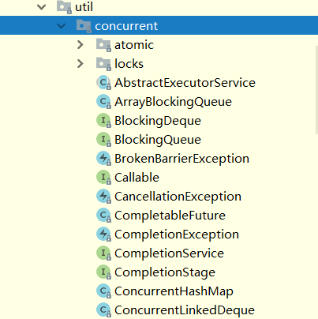
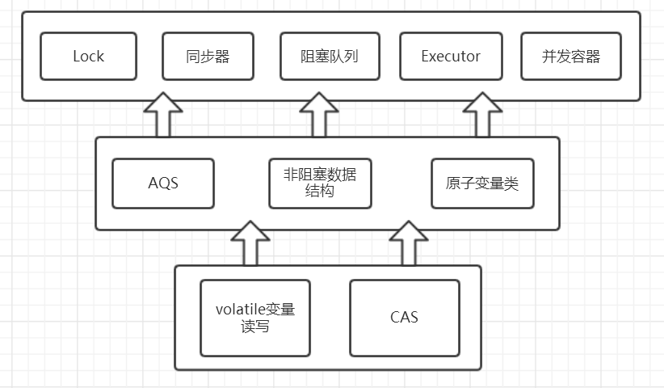
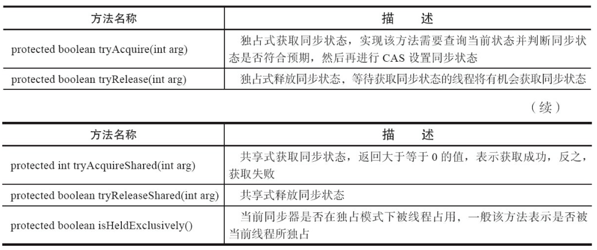
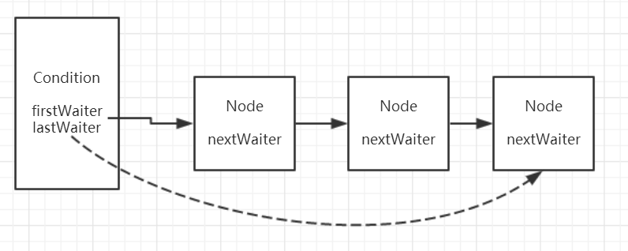
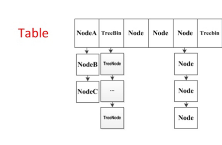
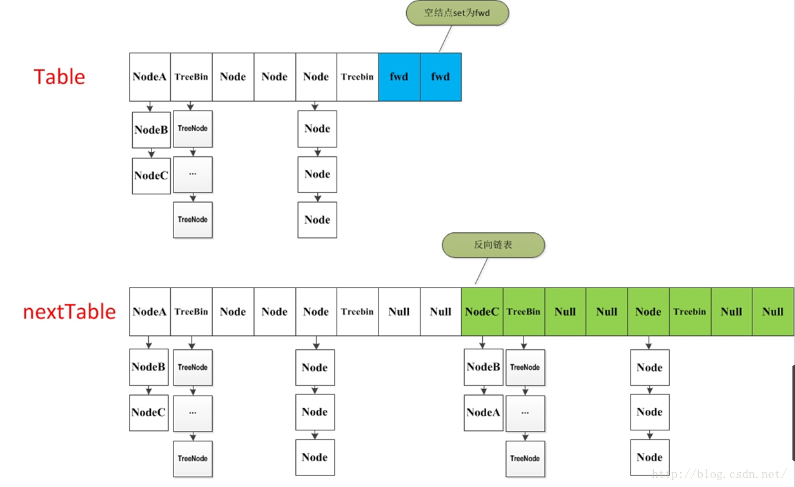

# 概览

## concurrent包的结构层次



* 子包主要包含:atomic和lock分别是原子类和锁,外部的是一些阻塞队列和Executors等。



# lock

* lock用来控制多个线程访问共享资源的方式，一个锁能够防止多个线程同时访问共享资源，没有lock接口之前主要靠synchronized关键字实现锁功能。

```java
Lock lock = new ReentrantLock();
lock.lock();
try{
	.......
}finally{
	lock.unlock();
}
```

* Lock API
  * lock:获取锁
  * lockInterruptibly:获取锁除非当前线程中断
  * tryLock:尝试获取锁
  * tryLock(long time,TimeUnit unit):尝试获取锁，存在超时时间
  * unlock:解锁
  * newCondition:获取与lock绑定的等待通知组件，当前线程必须获得了锁才能进行等待，进行等待时会先释放锁，当再次获取锁时才能从等待中返回
* ReentrantLock实现Lock接口，**基本上所有的方法的实现实际上都是调用了其静态内存类`Sync`中的方法，而Sync类继承了`AbstractQueuedSynchronizer（AQS）`**。可以看出要想理解ReentrantLock关键核心在于对队列同步器AbstractQueuedSynchronizer（简称同步器）的理解。

## AQS

* 同步器是用来构建锁和其他同步组件的基础框架，它的实现主要依赖一个int成员变量来表示同步状态以及通过一个FIFO队列构成等待队列。它的**子类必须重写AQS的几个protected修饰的用来改变同步状态的方法**，其他方法主要是实现了排队和阻塞机制。**状态的更新使用getState,setState以及compareAndSetState这三个方法**。
* 子类被**推荐定义为自定义同步组件的静态内部类**，同步器自身没有实现任何同步接口，它仅仅是定义了若干同步状态的获取和释放方法来供自定义同步组件的使用，同步器既支持独占式获取同步状态，也可以支持共享式获取同步状态，这样就可以方便的实现不同类型的同步组件。
* 同步器是实现锁（也可以是任意同步组件）的关键，在锁的实现中聚合同步器，利用同步器实现锁的语义。可以这样理解二者的关系：**锁是面向使用者，它定义了使用者与锁交互的接口，隐藏了实现细节；同步器是面向锁的实现者，它简化了锁的实现方式，屏蔽了同步状态的管理，线程的排队，等待和唤醒等底层操作**。锁和同步器很好的隔离了使用者和实现者所需关注的领域。

```java
 public final void acquire(int arg) {
        if (!tryAcquire(arg) &&
            acquireQueued(addWaiter(Node.EXCLUSIVE), arg))
            selfInterrupt();
 }
```

* 会调用tryAcquire方法，而此时当继承AQS的NonfairSync调用模板方法acquire时就会调用已经被NonfairSync重写的tryAcquire方法。这就是使用AQS的方式，在弄懂这点后会lock的实现理解有很大的提升。可以归纳总结为这么几点：
  * 同步组件（这里不仅仅值锁，还包括CountDownLatch等）的实现依赖于同步器AQS，在同步组件实现中，使用AQS的方式被推荐定义继承AQS的静态内存类；
  * AQS采用模板方法进行设计，AQS的protected修饰的方法需要由继承AQS的子类进行重写实现，当调用AQS的子类的方法时就会调用被重写的方法；
  * AQS负责同步状态的管理，线程的排队，等待和唤醒这些底层操作，而Lock等同步组件主要专注于实现同步语义；
  * 在重写AQS的方式时，使用AQS提供的`getState(),setState(),compareAndSetState()`方法进行修改同步状态



* AQS提供的模板方法可以分为3类：
  * 独占式获取与释放同步状态；
  * 共享式获取与释放同步状态；
  * 查询同步队列中等待线程情况；

```java
public class MutextDemo {
    private static Mutex mutex = new Mutex();

    public static void main(String[] args) {
        for (int i = 0; i < 10; i++) {
            Thread thread = new Thread(() -> {
                mutex.lock();
                try {
                    Thread.sleep(3000);
                } catch (InterruptedException e) {
                    e.printStackTrace();
                } finally {
                    mutex.unlock();
                }
            });
            thread.start();
        }
    }
}
```

* **同步组件实现者的角度：**
  * 通过可重写的方法：**独占式**： tryAcquire()(独占式获取同步状态），tryRelease()（独占式释放同步状态）；**共享式** ：tryAcquireShared()(共享式获取同步状态)，tryReleaseShared()(共享式释放同步状态)；**告诉AQS怎样判断当前同步状态是否成功获取或者是否成功释放**。同步组件专注于对当前同步状态的逻辑判断，从而实现自己的同步语义。这句话比较抽象，举例来说，上面的Mutex例子中通过tryAcquire方法实现自己的同步语义，在该方法中如果当前同步状态为0（即该同步组件没被任何线程获取），当前线程可以获取同时将状态更改为1返回true，否则，该组件已经被线程占用返回false。很显然，该同步组件只能在同一时刻被线程占用，Mutex专注于获取释放的逻辑来实现自己想要表达的同步语义。
* **AQS的角度**
  * 而对AQS来说，只需要同步组件返回的true和false即可，因为AQS会对true和false会有不同的操作，true会认为当前线程获取同步组件成功直接返回，而false的话就AQS也会将当前线程插入同步队列等一系列的方法。

## **ReentrantLock**

* ReentrantLock重入锁，是实现Lock接口的一个类，**支持重入性，表示能够对共享资源能够重复加锁，即当前线程获取该锁再次获取不会被阻塞**。在java关键字synchronized隐式支持重入性synchronized通过获取自增，释放自减的方式实现重入。与此同时，ReentrantLock还支持**公平锁和非公平锁**两种方式。

### 重入性的实现原理

* 想获取重入性就需要1.在线程获取锁的时候，如果已经获取锁的线程是当前线程的话则执行再次获取成功。2.由于锁会被获取n次，那么只有锁在被释放同样的n次之后，该锁才算是完全释放成功。

```java
// 获取锁 可重入 
final boolean nonfairTryAcquire(int acquires) {
            final Thread current = Thread.currentThread();
            int c = getState();
           // 没有占用锁的线程
            if (c == 0) {
                if (compareAndSetState(0, acquires)) {
                    setExclusiveOwnerThread(current);
                    return true;
                }
            }
           // 如果是当前线程
            else if (current == getExclusiveOwnerThread()) {
              // state++
                int nextc = c + acquires;
                if (nextc < 0) // overflow
                    throw new Error("Maximum lock count exceeded");
                setState(nextc);
                return true;
            }
            return false;
        }
// 释放锁
 protected final boolean tryRelease(int releases) {
            int c = getState() - releases;
            if (Thread.currentThread() != getExclusiveOwnerThread())
                throw new IllegalMonitorStateException();
            boolean free = false;
            if (c == 0) {
                free = true;
                setExclusiveOwnerThread(null);
            }
  				 // 修改状态
            setState(c);
            return free;
        }
```

### 公平锁和非公平锁

* **公平锁**和**非公平锁**。**何谓公平性，是针对获取锁而言的，如果一个锁是公平的，那么锁的获取顺序就应该符合请求上的绝对时间顺序，满足FIFO**。

```java
// 公平锁获取
protected final boolean tryAcquire(int acquires) {
    final Thread current = Thread.currentThread();
    int c = getState();
    if (c == 0) {
      // 需要考虑队列 查询是否有任何线程等待获取的时间比当前线程长。
        if (!hasQueuedPredecessors() &&
            compareAndSetState(0, acquires)) {
            setExclusiveOwnerThread(current);
            return true;
        }
    }
    else if (current == getExclusiveOwnerThread()) {
        int nextc = c + acquires;
        if (nextc < 0)
            throw new Error("Maximum lock count exceeded");
        setState(nextc);
        return true;
    }
    return false;
  }
}
   public final boolean hasQueuedPredecessors() {
        // The correctness of this depends on head being initialized
        // before tail and on head.next being accurate if the current
        // thread is first in queue.
        Node t = tail; // Read fields in reverse initialization order
        Node h = head;
        Node s;
     		// 判断队列是否为空。
        return h != t &&
            ((s = h.next) == null || s.thread != Thread.currentThread());
    }
// 非公平锁
final boolean nonfairTryAcquire(int acquires) {
            final Thread current = Thread.currentThread();
            int c = getState();
            if (c == 0) {
                if (compareAndSetState(0, acquires)) {
                    setExclusiveOwnerThread(current);
                    return true;
                }
            }
            else if (current == getExclusiveOwnerThread()) {
                int nextc = c + acquires;
                if (nextc < 0) // overflow
                    throw new Error("Maximum lock count exceeded");
                setState(nextc);
                return true;
            }
            return false;
        }
```

> **公平锁 VS 非公平锁**

1. 公平锁每次获取到锁为同步队列中的第一个节点，**保证请求资源时间上的绝对顺序**，而非公平锁有可能刚释放锁的线程下次继续获取该锁，则有可能导致其他线程永远无法获取到锁，**造成“饥饿”现象**。
2. 公平锁为了保证时间上的绝对顺序，需要频繁的上下文切换，而非公平锁会降低一定的上下文切换，降低性能开销。因此，ReentrantLock默认选择的是非公平锁，则是为了减少一部分上下文切换，**保证了系统更大的吞吐量**。

## **ReentrantReadWriteLock**

* **读写所允许同一时刻被多个读线程访问，但是在写线程访问时，所有的读线程和其他的写线程都会被阻塞**。

1. **公平性选择**：支持非公平性（默认）和公平的锁获取方式，吞吐量还是非公平优于公平；
2. **重入性**：支持重入，读锁获取后能再次获取，写锁获取之后能够再次获取写锁，同时也能够获取读锁；
3. **锁降级**：遵循获取写锁，获取读锁再释放写锁的次序，写锁能够降级成为读锁

### 写锁

#### 写锁的获取

```java
protected final boolean tryAcquire(int acquires) {
    /*
     * Walkthrough:
     * 1. If read count nonzero or write count nonzero
     *    and owner is a different thread, fail.
     * 2. If count would saturate, fail. (This can only
     *    happen if count is already nonzero.)
     * 3. Otherwise, this thread is eligible for lock if
     *    it is either a reentrant acquire or
     *    queue policy allows it. If so, update state
     *    and set owner.
     */
    Thread current = Thread.currentThread();
	// 1. 获取写锁当前的同步状态
    int c = getState();
	// 2. 获取写锁获取的次数
    int w = exclusiveCount(c);
    if (c != 0) {
        // (Note: if c != 0 and w == 0 then shared count != 0)
		// 3.1 当读锁已被读线程获取或者当前线程不是已经获取写锁的线程的话
		// 当前线程获取写锁失败
        if (w == 0 || current != getExclusiveOwnerThread())
            return false;
        if (w + exclusiveCount(acquires) > MAX_COUNT)
            throw new Error("Maximum lock count exceeded");
        // Reentrant acquire
		// 3.2 当前线程获取写锁，支持可重复加锁
        setState(c + acquires);
        return true;
    }
	// 3.3 写锁未被任何线程获取，当前线程可获取写锁
    if (writerShouldBlock() ||
        !compareAndSetState(c, c + acquires))
        return false;
    setExclusiveOwnerThread(current);
    return true;
}
```

* **当读锁已经被读线程获取或者写锁已经被其他写线程获取，则写锁获取失败；否则，获取成功并支持重入，增加写状态。**

### 读锁

```java
protected final int tryAcquireShared(int unused) {
    /*
     * Walkthrough:
     * 1. If write lock held by another thread, fail.
     * 2. Otherwise, this thread is eligible for
     *    lock wrt state, so ask if it should block
     *    because of queue policy. If not, try
     *    to grant by CASing state and updating count.
     *    Note that step does not check for reentrant
     *    acquires, which is postponed to full version
     *    to avoid having to check hold count in
     *    the more typical non-reentrant case.
     * 3. If step 2 fails either because thread
     *    apparently not eligible or CAS fails or count
     *    saturated, chain to version with full retry loop.
     */
    Thread current = Thread.currentThread();
    int c = getState();
	//1. 如果写锁已经被获取并且获取写锁的线程不是当前线程的话，当前
	// 线程获取读锁失败返回-1
    if (exclusiveCount(c) != 0 &&
        getExclusiveOwnerThread() != current)
        return -1;
    int r = sharedCount(c);
    if (!readerShouldBlock() &&
        r < MAX_COUNT &&
		//2. 当前线程获取读锁
        compareAndSetState(c, c + SHARED_UNIT)) {
		//3. 下面的代码主要是新增的一些功能，比如getReadHoldCount()方法
		//返回当前获取读锁的次数
        if (r == 0) {
            firstReader = current;
            firstReaderHoldCount = 1;
        } else if (firstReader == current) {
            firstReaderHoldCount++;
        } else {
            HoldCounter rh = cachedHoldCounter;
            if (rh == null || rh.tid != getThreadId(current))
                cachedHoldCounter = rh = readHolds.get();
            else if (rh.count == 0)
                readHolds.set(rh);
            rh.count++;
        }
        return 1;
    }
	//4. 处理在第二步中CAS操作失败的自旋已经实现重入性
    return fullTryAcquireShared(current);
}
```

* **当写锁被其他线程获取后，读锁获取失败**，否则获取成功利用CAS更新同步状态。另外，当前同步状态需要加上SHARED_UNIT（`(1 << SHARED_SHIFT)`即0x00010000）的原因这是我们在上面所说的同步状态的高16位用来表示读锁被获取的次数。如果CAS失败或者已经获取读锁的线程再次获取读锁时，是靠fullTryAcquireShared方法实现的

### 锁降级

* 读写锁支持锁降级，**遵循按照获取写锁，获取读锁再释放写锁的次序，写锁能够降级成为读锁**，不支持锁升级

```java
void processCachedData() {
        rwl.readLock().lock();
        if (!cacheValid) {
            // Must release read lock before acquiring write lock
            rwl.readLock().unlock();
            rwl.writeLock().lock();
            try {
                // Recheck state because another thread might have
                // acquired write lock and changed state before we did.
                if (!cacheValid) {
                    data = ...
            cacheValid = true;
          }
          // Downgrade by acquiring read lock before releasing write lock
          rwl.readLock().lock();
        } finally {
          rwl.writeLock().unlock(); // Unlock write, still hold read
        }
      }
 
      try {
        use(data);
      } finally {
        rwl.readLock().unlock();
      }
    }
}
```

## Condition

* 任何一个java对象都天然继承于Object类，在线程间实现通信的往往会应用到Object的几个方法，比如wait(),wait(long timeout),wait(long timeout, int nanos)与notify(),notifyAll()几个方法实现等待/通知机制，同样的， 在java Lock体系下依然会有同样的方法实现等待/通知机制。从整体上来看**Object的wait和notify/notify是与对象监视器配合完成线程间的等待/通知机制，而Condition与Lock配合完成等待通知机制，前者是java底层级别的，后者是语言级别的，具有更高的可控制性和扩展性**。两者除了在使用方式上不同外，在**功能特性**上还是有很多的不同：
  1. Condition能够支持不响应中断，而通过使用Object方式不支持；
  2. Condition能够支持多个等待队列（new 多个Condition对象），而Object方式只能支持一个；
  3. Condition能够支持超时时间的设置，而Object不支持
* **针对Object的wait方法**
  * void await() throws InterruptedException:当前线程进入等待状态，如果其他线程调用condition的signal或者signalAll方法并且当前线程获取Lock从await方法返回，如果在等待状态中被中断会抛出被中断异常；
  * long awaitNanos(long nanosTimeout)：当前线程进入等待状态直到被通知，中断或者**超时**；
  * boolean await(long time, TimeUnit unit)throws InterruptedException：同第二种，支持自定义时间单位
  * boolean awaitUntil(Date deadline) throws InterruptedException：当前线程进入等待状态直到被通知，中断或者**到了某个时间**
* **针对Object的notify/notifyAll方法**
  * void signal()：唤醒一个等待在condition上的线程，将该线程从**等待队列**中转移到**同步队列**中，如果在同步队列中能够竞争到Lock则可以从等待方法中返回。
  * void signalAll()：与1的区别在于能够唤醒所有等待在condition上的线程

```java
    Condition condition = REENTRANT_LOCK.newCondition();
        for (int i = 0; i < 10; i++) {
            Thread thread = new Thread(() -> {
                REENTRANT_LOCK.lock();
                try {
                    condition.await();
                    System.out.println("test");
                } catch (InterruptedException e) {
                    e.printStackTrace();
                }finally {
                    REENTRANT_LOCK.unlock();
                }
            });
```

* 调用condition.await方法后线程依次尾插入到等待队列中，如图队列中的线程引用依次为Thread-0,Thread-1,Thread-2....Thread-8；2. 等待队列是一个单向队列。通过我们的猜想然后进行实验验证，我们可以得出等待队列的示意图如下图所示：



* 多次调用lock.newCondition()方法创建多个condition对象，也就是一个lock可以持有多个等待队列。而在之前利用Object的方式实际上是指在**对象Object对象监视器上只能拥有一个同步队列和一个等待队列，而并发包中的Lock拥有一个同步队列和多个等待队列**。示意图如下：


### await实现原理

* **当调用condition.await()方法后会使得当前获取lock的线程进入到等待队列，如果该线程能够从await()方法返回的话一定是该线程获取了与condition相关联的lock**

```java
public final void await() throws InterruptedException {
    if (Thread.interrupted())
        throw new InterruptedException();
	// 1. 将当前线程包装成Node，尾插入到等待队列中
    Node node = addConditionWaiter();
	// 2. 释放当前线程所占用的lock，在释放的过程中会唤醒同步队列中的下一个节点
    int savedState = fullyRelease(node);
    int interruptMode = 0;
    while (!isOnSyncQueue(node)) {
		// 3. 当前线程进入到等待状态
        LockSupport.park(this);
        if ((interruptMode = checkInterruptWhileWaiting(node)) != 0)
            break;
    }
	// 4. 自旋等待获取到同步状态（即获取到lock）
    if (acquireQueued(node, savedState) && interruptMode != THROW_IE)
        interruptMode = REINTERRUPT;
    if (node.nextWaiter != null) // clean up if cancelled
        unlinkCancelledWaiters();
	// 5. 处理被中断的情况
    if (interruptMode != 0)
        reportInterruptAfterWait(interruptMode);
}
```

### 使用方式

```java
public class AwaitSignal {
    private static ReentrantLock lock = new ReentrantLock();
    private static Condition condition = lock.newCondition();
    private static volatile boolean flag = false;

    public static void main(String[] args) {
        Thread waiter = new Thread(new waiter());
        waiter.start();
        Thread signaler = new Thread(new signaler());
        signaler.start();
    }

    static class waiter implements Runnable {

        @Override
        public void run() {
            lock.lock();
            try {
                while (!flag) {
                    System.out.println(Thread.currentThread().getName() + "当前条件不满足等待");
                    try {
                        condition.await();
                    } catch (InterruptedException e) {
                        e.printStackTrace();
                    }
                }
                System.out.println(Thread.currentThread().getName() + "接收到通知条件满足");
            } finally {
                lock.unlock();
            }
        }
    }

    static class signaler implements Runnable {

        @Override
        public void run() {
            lock.lock();
            try {
                flag = true;
                condition.signalAll();
            } finally {
                lock.unlock();
            }
        }
    }
}
```

* 开启了两个线程waiter和signaler，waiter线程开始执行的时候由于条件不满足，执行condition.await方法使该线程进入等待状态同时释放锁，signaler线程获取到锁之后更改条件，并通知所有的等待线程后释放锁。这时，waiter线程获取到锁，并由于signaler线程更改了条件此时相对于waiter来说条件满足，继续执行。

## LockSupport

* 每个使用LockSupport的线程都会与一个许可关联，如果该许可可用，并且可在线程中使用，则调用park()将会立即返回，否则可能阻塞。如果许可尚不可用，则可以调用 unpark 使其可用。但是注意许可**不可重入**，也就是说只能调用一次park()方法，否则会一直阻塞。

### 方法介绍

> **阻塞线程**

1. void park()：阻塞当前线程，如果调用unpark方法或者当前线程被中断，从能从park()方法中返回
2. void park(Object blocker)：功能同方法1，入参增加一个Object对象，用来记录导致线程阻塞的阻塞对象，方便进行问题排查；
3. void parkNanos(long nanos)：阻塞当前线程，最长不超过nanos纳秒，增加了超时返回的特性；
4. void parkNanos(Object blocker, long nanos)：功能同方法3，入参增加一个Object对象，用来记录导致线程阻塞的阻塞对象，方便进行问题排查；
5. void parkUntil(long deadline)：阻塞当前线程，知道deadline；
6. void parkUntil(Object blocker, long deadline)：功能同方法5，入参增加一个Object对象，用来记录导致线程阻塞的阻塞对象，方便进行问题排查；

> **唤醒线程**

1. void unpark(Thread thread):唤醒处于阻塞状态的指定线程

# 并发容器

## ConcurrentHashMap

* jdk1.8之前利用锁分段的方式来提升并行度，segment继承了ReentrantLock充当锁的角色，为每一个segment提供了线程安全的保障；segment维护了哈希散列表的若干个桶，每个桶由HashEntry构成的链表。
* jdk1.8使用了synchronized，以及CAS无锁操作以保证ConcurrentHashMap操作的线程安全性，底层数据结构改变为采用数组+链表+红黑树的数据形式。

### 关键属性

1. **table** volatile Node<K,V>[] table://装载Node的数组，作为ConcurrentHashMap的数据容器，采用懒加载的方式，直到第一次插入数据的时候才会进行初始化操作，数组的大小总是为2的幂次方。
2. **nextTable** volatile Node<K,V>[] nextTable; //扩容时使用，平时为null，只有在扩容的时候才为非null
3. **sizeCtl** volatile int sizeCtl; 该属性用来控制table数组的大小，根据是否初始化和是否正在扩容有几种情况： **当值为负数时：**如果为-1表示正在初始化，如果为-N则表示当前正有N-1个线程进行扩容操作； **当值为正数时：**如果当前数组为null的话表示table在初始化过程中，sizeCtl表示为需要新建数组的长度； 若已经初始化了，表示当前数据容器（table数组）可用容量也可以理解成临界值（插入节点数超过了该临界值就需要扩容），具体指为数组的长度n 乘以 加载因子loadFactor； 当值为0时，即数组长度为默认初始值。
4. **sun.misc.Unsafe U** 在ConcurrentHashMapde的实现中可以看到大量的U.compareAndSwapXXXX的方法去修改ConcurrentHashMap的一些属性。这些方法实际上是利用了CAS算法保证了线程安全性，这是一种乐观策略，假设每一次操作都不会产生冲突，当且仅当冲突发生的时候再去尝试。而CAS操作依赖于现代处理器指令集，通过底层**CMPXCHG**指令实现。CAS(V,O,N)核心思想为：**若当前变量实际值V与期望的旧值O相同，则表明该变量没被其他线程进行修改，因此可以安全的将新值N赋值给变量；若当前变量实际值V与期望的旧值O不相同，则表明该变量已经被其他线程做了处理，此时将新值N赋给变量操作就是不安全的，在进行重试**。而在大量的同步组件和并发容器的实现中使用CAS是通过`sun.misc.Unsafe`类实现的，该类提供了一些可以直接操控内存和线程的底层操作，可以理解为java中的“指针”。该成员变量的获取是在静态代码块中：

```java
 static {
     try {
         U = sun.misc.Unsafe.getUnsafe();
 		.......
     } catch (Exception e) {
         throw new Error(e);
     }
 }
```

### 关键内部类

* Node实现Map.Entry接口，主要存放key-value

```java
 static class Node<K,V> implements Map.Entry<K,V> {
         final int hash;
         final K key;
         volatile V val;
         volatile Node<K,V> next;
 		......
 }
```

* **TreeNode** 树节点，继承于承载数据的Node类。而红黑树的操作是针对TreeBin类的

```java
 **
  * Nodes for use in TreeBins
  */
 static final class TreeNode<K,V> extends Node<K,V> {
         TreeNode<K,V> parent;  // red-black tree links
         TreeNode<K,V> left;
         TreeNode<K,V> right;
         TreeNode<K,V> prev;    // needed to unlink next upon deletion
         boolean red;
 		......
 }
```

* **TreeBin** 这个类并不负责包装用户的key、value信息，而是包装的很多TreeNode节点。

```java
 static final class TreeBin<K,V> extends Node<K,V> {
         TreeNode<K,V> root;
         volatile TreeNode<K,V> first;
         volatile Thread waiter;
         volatile int lockState;
         // values for lockState
         static final int WRITER = 1; // set while holding write lock
         static final int WAITER = 2; // set when waiting for write lock
         static final int READER = 4; // increment value for setting read lock
 		......
 }
```

* **ForwardingNode** 在扩容时才会出现的特殊节点，其key,value,hash全部为null。并拥有nextTable指针引用新的table数组。

```java
 static final class ForwardingNode<K,V> extends Node<K,V> {
     final Node<K,V>[] nextTable;
     ForwardingNode(Node<K,V>[] tab) {
         super(MOVED, null, null, null);
         this.nextTable = tab;
     }
    .....
 }
```



### put流程

1. 首先对于每一个放入的值，首先利用spread方法对key的hashcode进行一次hash计算，由此来确定这个值在 table中的位置；
2. 如果当前table数组还未初始化，先将table数组进行初始化操作；
3. 如果这个位置是null的，那么使用CAS操作直接放入；
4. 如果这个位置存在结点，说明发生了hash碰撞，首先判断这个节点的类型。如果该节点fh==MOVED(代表forwardingNode,数组正在进行扩容)的话，说明正在进行扩容；
5. 如果是链表节点（fh>0）,则得到的结点就是hash值相同的节点组成的链表的头节点。需要依次向后遍历确定这个新加入的值所在位置。如果遇到key相同的节点，则只需要覆盖该结点的value值即可。否则依次向后遍历，直到链表尾插入这个结点；
6. 如果这个节点的类型是TreeBin的话，直接调用红黑树的插入方法进行插入新的节点；
7. 插入完节点之后再次检查链表长度，如果长度大于8，就把这个链表转换成红黑树；
8. 对当前容量大小进行检查，如果超过了临界值（实际大小*加载因子）就需要扩容。

### get流程

```java
public V get(Object key) {
    Node<K,V>[] tab; Node<K,V> e, p; int n, eh; K ek;
	// 1. 重hash
    int h = spread(key.hashCode());
    if ((tab = table) != null && (n = tab.length) > 0 &&
        (e = tabAt(tab, (n - 1) & h)) != null) {
        // 2. table[i]桶节点的key与查找的key相同，则直接返回
		if ((eh = e.hash) == h) {
            if ((ek = e.key) == key || (ek != null && key.equals(ek)))
                return e.val;
        }
		// 3. 当前节点hash小于0说明为树节点，在红黑树中查找即可
        else if (eh < 0)
            return (p = e.find(h, key)) != null ? p.val : null;
        while ((e = e.next) != null) {
		//4. 从链表中查找，查找到则返回该节点的value，否则就返回null即可
            if (e.hash == h &&
                ((ek = e.key) == key || (ek != null && key.equals(ek))))
                return e.val;
        }
    }
    return null;
}
```

* 首先先看当前的hash桶数组节点即table[i]是否为查找的节点，若是则直接返回；若不是，则继续再看当前是不是树节点？通过看节点的hash值是否为小于0，如果小于0则为树节点。如果是树节点在红黑树中查找节点；如果不是树节点，那就只剩下为链表的形式的一种可能性了，就向后遍历查找节点，若查找到则返回节点的value即可，若没有找到就返回null。

### transfer方法

* 当ConcurrentHashMap容量不足的时候，需要对table进行扩容。这个方法的基本思想跟HashMap是很像的，但是由于它是支持并发扩容的，所以要复杂的多。原因是它支持多线程进行扩容操作，而并没有加锁。我想这样做的目的不仅仅是为了满足concurrent的要求，而是希望利用并发处理去减少扩容带来的时间影响。

**第一部分**是构建一个nextTable,它的容量是原来的两倍，这个操作是单线程完成的。新建table数组的代码为:`Node<K,V>[] nt = (Node<K,V>[])new Node<?,?>[n << 1]`,在原容量大小的基础上右移一位。

**第二个部分**就是将原来table中的元素复制到nextTable中，主要是遍历复制的过程。 根据运算得到当前遍历的数组的位置i，然后利用tabAt方法获得i位置的元素再进行判断：

1. 如果这个位置为空，就在原table中的i位置放入forwardNode节点，这个也是触发并发扩容的关键点；
2. 如果这个位置是Node节点（fh>=0），如果它是一个链表的头节点，就构造一个反序链表，把他们分别放在nextTable的i和i+n的位置上
3. 如果这个位置是TreeBin节点（fh<0），也做一个反序处理，并且判断是否需要untreefi，把处理的结果分别放在nextTable的i和i+n的位置上
4. 遍历过所有的节点以后就完成了复制工作，这时让nextTable作为新的table，并且更新sizeCtl为新容量的0.75倍 ，完成扩容。设置为新容量的0.75倍代码为 `sizeCtl = (n << 1) - (n >>> 1)`，仔细体会下是不是很巧妙，n<<1相当于n右移一位表示n的两倍即2n,n>>>1左右一位相当于n除以2即0.5n,然后两者相减为2n-0.5n=1.5n,是不是刚好等于新容量的0.75倍即2n*0.75=1.5n。最后用一个示意图来进行总结（图片摘自网络）：



### 总结

JDK6,7中的ConcurrentHashmap主要使用Segment来实现减小锁粒度，分割成若干个Segment，在put的时候需要锁住Segment，get时候不加锁，使用volatile来保证可见性，当要统计全局时（比如size），首先会尝试多次计算modcount来确定，这几次尝试中，是否有其他线程进行了修改操作，如果没有，则直接返回size。如果有，则需要依次锁住所有的Segment来计算。

1.8之前put定位节点时要先定位到具体的segment，然后再在segment中定位到具体的桶。而在1.8的时候摒弃了segment臃肿的设计，直接针对的是Node[] tale数组中的每一个桶，进一步减小了锁粒度。并且防止拉链过长导致性能下降，当链表长度大于8的时候采用红黑树的设计。

主要设计上的变化有以下几点:

1. 不采用segment而采用node，锁住node来实现减小锁粒度。
2. 设计了MOVED状态 当resize的中过程中 线程2还在put数据，线程2会帮助resize。
3. 使用3个CAS操作来确保node的一些操作的原子性，这种方式代替了锁。
4. sizeCtl的不同值来代表不同含义，起到了控制的作用。
5. 采用synchronized而不是ReentrantLock

## ConcurrentLinkedQueue

* `ConcurrentLinkedQueue`是线程安全的队列

### Node

```java
private static class Node<E> {
        volatile E item;
        volatile Node<E> next;
		.......
}
```

### 队列链表节点

```java
private transient volatile Node<E> head;
private transient volatile Node<E> tail;
public ConcurrentLinkedQueue() {
    head = tail = new Node<E>(null);
}
```

### 核心CAS方法

```java
//更改Node中的数据域item	
boolean casItem(E cmp, E val) {
    return UNSAFE.compareAndSwapObject(this, itemOffset, cmp, val);
}
//更改Node中的指针域next
void lazySetNext(Node<E> val) {
    UNSAFE.putOrderedObject(this, nextOffset, val);
}
//更改Node中的指针域next
boolean casNext(Node<E> cmp, Node<E> val) {
    return UNSAFE.compareAndSwapObject(this, nextOffset, cmp, val);
}
```

### offer

```java
public boolean offer(E e) {
        checkNotNull(e);
        final Node<E> newNode = new Node<E>(e);

        for (Node<E> t = tail, p = t;;) {
            Node<E> q = p.next;
            if (q == null) {
                // p is last node cas获取p
                if (p.casNext(null, newNode)) {
                    // Successful CAS is the linearization point
                    // for e to become an element of this queue,
                    // and for newNode to become "live".
                    if (p != t) // hop two nodes at a time
                        casTail(t, newNode);  // Failure is OK.
                    return true;
                }
                // Lost CAS race to another thread; re-read next
            }
            else if (p == q)
                // We have fallen off list.  If tail is unchanged, it
                // will also be off-list, in which case we need to
                // jump to head, from which all live nodes are always
                // reachable.  Else the new tail is a better bet.
                p = (t != (t = tail)) ? t : head;
            else
                // Check for tail updates after two hops.
                p = (p != t && t != (t = tail)) ? t : q;
        }
    }
```

