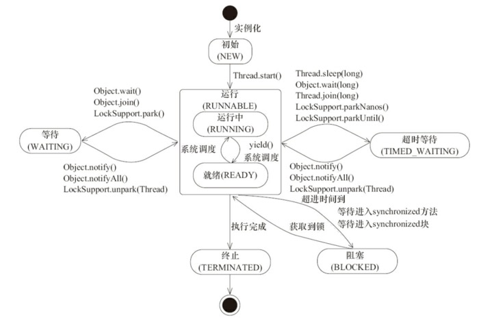
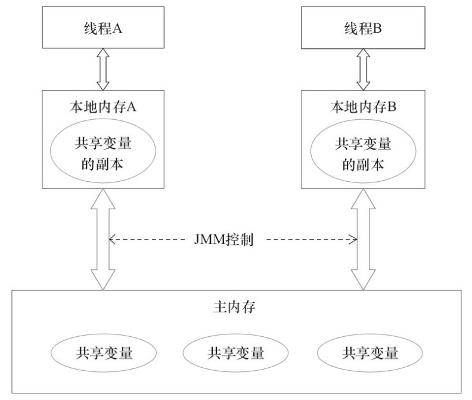
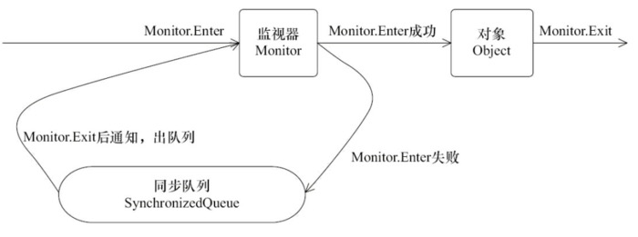
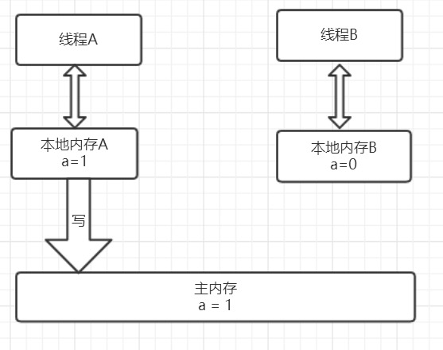

# 并发编程缺点

## 频繁的上下文切换

* 时间片是CPU分配给各个线程的时间，CPU通过不断切换线程让我觉得多个线程同时执行，时间片一般是几十毫秒。而每次切换时，需要保存当前线程状态，以便能够进行恢复先前状态，而这个切换时非常消耗性能，过于频繁反而无法发挥出多线程编程的优势。通常减少上下文切换可以采用无锁并发编程，CAS算法，使用最少的线程和使用协程。
  * 无锁并发编程：可以参照concurrentHashMap锁分段的思想，不同的线程处理不同段的数据，这样在多线程竞争的条件下，可以减少上下文切换的时间。
  * CAS算法，利用Atomic下使用CAS算法来更新数据，使用了乐观锁，可以有效的减少一部分不必要的锁竞争带来的上下文切换
  * 使用最少线程：避免创建不需要的线程，比如任务很少，但是创建了很多的线程，这样会造成大量的线程都处于等待状态
  * 协程：在单线程里实现多任务的调度，并在单线程里维持多个任务间的切换

## 线程安全问题

* 多线程程序中需要考虑线程安全问题，防止死锁导致程序不可用。

### 打破死锁

1. 避免一个线程同时获取多个锁
2. 避免一个线程在锁内部占有多个资源，尽量保证每个锁只占用一个资源
3. 尝试使用定时锁，使用lock.tryLock(timeOut)，当超时等待时当前线程不会阻塞；
4. 对于数据库锁，加锁和解锁必须在一个数据库连接里，否则会出现解锁失败的情况

# 线程状态转换

## Java线程状态

* java程序天生就是一个多线程程序，包含了：（1）分发处理发送给给JVM信号的线程；（2）调用对象的finalize方法的线程；（3）清除Reference的线程；（4）main线程，用户程序的入口。

### 线程状态

* NEW:初始状态，线程被构建，但是没有调用start方法
* RUNNABLE:运行状态，Java线程将操作系统中的就绪和运行两种状态笼统地称为"运行中"
* BLOCKED:阻塞状态，表示线程阻塞
* WAITING:等待状态，表示线程进入等待状态，进入改状态表示当前线程需要等待其他线程做出一些特定动作（通知或中断）
* TIME_WAITING:超时等待状态
* TERMINATED:终止状态，表示当前线程已经执行完毕。



## interrupted

* 线程中断可以理解为线程的一个标志位，它表示了一个运行中的线程是否被其他线程进行了中断操作。中断好比其他线程对该线程打了一个招呼。其他线程可以调用该线程的interrupt()方法对其进行中断操作，同时该线程可以调用 isInterrupted（）来感知其他线程对其自身的中断操作，从而做出响应。另外，同样可以调用Thread的静态方法 interrupted（）对当前线程进行中断操作，该方法会清除中断标志位。**需要注意的是，当抛出InterruptedException时候，会清除中断标志位，也就是说在调用isInterrupted会返回false。**

## Join

* join方法可以看做是线程间协作的一种方式，很多时候，一个线程的输入可能非常依赖于另一个线程的输出，这就像两个好基友，一个基友先走在前面突然看见另一个基友落在后面了，这个时候他就会在原处等一等这个基友，等基友赶上来后，就两人携手并进。其实线程间的这种协作方式也符合现实生活。在软件开发的过程中，从客户那里获取需求后，需要经过需求分析师进行需求分解后，这个时候产品，开发才会继续跟进。如果一个线程实例A执行了threadB.join(),其含义是：当前线程A会等待threadB线程终止后threadA才会继续执行。

```java
public final synchronized void join(long millis) 
public final synchronized void join(long millis, int nanos) 
public final void join() throws InterruptedException
```

## sleep

### sleep vs wait

1. sleep()方法是Thread的静态方法，而wait是Object实例方法
2. wait()方法必须要在同步方法或者同步块中调用，也就是必须已经获得对象锁。而sleep()方法没有这个限制可以在任何地方种使用。另外，wait()方法会释放占有的对象锁，使得该线程进入等待池中，等待下一次获取资源。而sleep()方法只是会让出CPU并不会释放掉对象锁；
3. sleep()方法在休眠时间达到后如果再次获得CPU时间片就会继续执行，而wait()方法必须等待Object.notift/Object.notifyAll通知后，才会离开等待池，并且再次获得CPU时间片才会继续执行。

## yield

* 一旦执行，它会是当前线程让出CPU，但是，需要注意的是，让出的CPU并不是代表当前线程不再运行了，如果在下一次竞争中，又获得了CPU时间片当前线程依然会继续运行。另外，让出的时间片只会分配**给当前线程相同优先级**的线程。
* 现代操作系统基本采用时分的形式调度运行的线程，操作系统会分出一个个时间片，线程会分配到若干时间片，当前时间片用完后就会发生线程调度，并等待这下次分配。线程分配到的时间多少也就决定了线程使用处理器资源的多少，而线程优先级就是决定线程需要或多或少分配一些处理器资源的线程属性。
* 在Java程序中，通过一个**整型成员变量Priority**来控制优先级，优先级的范围从1~10.在构建线程的时候可以通过**setPriority(int)**方法进行设置，默认优先级为5，优先级高的线程相较于优先级低的线程优先获得处理器时间片。需要注意的是在不同JVM以及操作系统上，线程规划存在差异，有些操作系统甚至会忽略线程优先级的设定。
* 另外需要注意的是，sleep()和yield()方法，同样都是当前线程会交出处理器资源，而它们不同的是，sleep()交出来的时间片其他线程都可以去竞争，也就是说都有机会获得当前线程让出的时间片。而yield()方法只允许与当前线程具有相同优先级的线程能够获得释放出来的CPU时间片。

## 守护线程Daemon

* 守护线程是一种特殊的线程，就和它的名字一样，它是系统的守护者，在后台默默地守护一些系统服务，比如垃圾回收线程，JIT线程就可以理解守护线程。与之对应的就是用户线程，用户线程就可以认为是系统的工作线程，它会完成整个系统的业务操作。用户线程完全结束后就意味着整个系统的业务任务全部结束了，因此系统就没有对象需要守护的了，守护线程自然而然就会退。当一个Java应用，只有守护线程的时候，虚拟机就会自然退出。

# 内存模型和happens-before

## 内存模型

### 共享变量

* 在java程序中所有**实例域，静态域和数组元素**都是放在堆内存中（所有线程均可访问到，是可以共享的），而局部变量，方法定义参数和异常处理器参数不会在线程间共享。共享数据会出现线程安全的问题，而非共享数据不会出现线程安全的问题。

### JMM抽象结构模型

* 我们知道CPU的处理速度和主存的读写速度不是一个量级的，为了平衡这种巨大的差距，每个CPU都会有缓存。因此，共享变量会先放在主存中，每个线程都有属于自己的工作内存，并且会把位于主存中的共享变量拷贝到自己的工作内存，之后的读写操作均使用位于工作内存的变量副本，并在某个时刻将工作内存的变量副本写回到主存中去。JMM就从抽象层次定义了这种方式，并且JMM决定了一个线程对共享变量的写入何时对其他线程是可见的。



* 如图为JMM抽象示意图，线程A和线程B之间要完成通信的话，要经历如下两步：

  1. 线程A从主内存中将共享变量读入线程A的工作内存后并进行操作，之后将数据重新写回到主内存中；
  2. 线程B从主存中读取最新的共享变量

  从横向去看看，线程A和线程B就好像通过共享变量在进行隐式通信。这其中有很有意思的问题，如果线程A更新后数据并没有及时写回到主存，而此时线程B读到的是过期的数据，这就出现了“脏读”现象。可以通过同步机制（控制不同线程间操作发生的相对顺序）来解决或者通过volatile关键字使得每次volatile变量都能够强制刷新到主存，从而对每个线程都是可见的。

##  happens-before规则

### happens-before定义

happens-before的概念最初由Leslie Lamport在其一篇影响深远的论文（《Time，Clocks and the Ordering of Events in a Distributed System》）中提出，有兴趣的可以google一下。JSR-133使用happens-before的概念来指定两个操作之间的执行顺序。由于这两个操作可以在一个线程之内，也可以是在不同线程之间。因此，**JMM可以通过happens-before关系向程序员提供跨线程的内存可见性保证**（如果A线程的写操作a与B线程的读操作b之间存在happens-before关系，尽管a操作和b操作在不同的线程中执行，但JMM向程序员保证a操作将对b操作可见）。具体的定义为：

1）如果一个操作happens-before另一个操作，那么第一个操作的执行结果将对第二个操作可见，而且第一个操作的执行顺序排在第二个操作之前。

2）两个操作之间存在happens-before关系，并不意味着Java平台的具体实现必须要按照happens-before关系指定的顺序来执行。如果重排序之后的执行结果，与按happens-before关系来执行的结果一致，那么这种重排序并不非法（也就是说，JMM允许这种重排序）。

上面的**1）是JMM对程序员的承诺**。从程序员的角度来说，可以这样理解happens-before关系：如果A happens-before B，那么Java内存模型将向程序员保证——A操作的结果将对B可见，且A的执行顺序排在B之前。注意，这只是Java内存模型向程序员做出的保证！

上面的**2）是JMM对编译器和处理器重排序的约束原则**。正如前面所言，JMM其实是在遵循一个基本原则：只要不改变程序的执行结果（指的是单线程程序和正确同步的多线程程序），编译器和处理器怎么优化都行。JMM这么做的原因是：程序员对于这两个操作是否真的被重排序并不关心，程序员关心的是程序执行时的语义不能被改变（即执行结果不能被改变）。因此，happens-before关系本质上和as-if-serial语义是一回事。

下面来比较一下as-if-serial和happens-before:

> **as-if-serial VS happens-before**

1. as-if-serial语义保证单线程内程序的执行结果不被改变，happens-before关系保证正确同步的多线程程序的执行结果不被改变。
2. as-if-serial语义给编写单线程程序的程序员创造了一个幻境：单线程程序是按程序的顺序来执行的。happens-before关系给编写正确同步的多线程程序的程序员创造了一个幻境：正确同步的多线程程序是按happens-before指定的顺序来执行的。
3. as-if-serial语义和happens-before这么做的目的，都是为了在不改变程序执行结果的前提下，尽可能地提高程序执行的并行度。

### 具体规则

1. 程序顺序规则：一个线程中的每个操作，happens-before于该线程中的任意后续操作。
2. 监视器锁规则：对一个锁的解锁，happens-before于随后对这个锁的加锁。
3. volatile变量规则：对一个volatile域的写，happens-before于任意后续对这个volatile域的读。
4. 传递性：如果A happens-before B，且B happens-before C，那么A happens-before C。
5. start()规则：如果线程A执行操作ThreadB.start()（启动线程B），那么A线程的ThreadB.start()操作happens-before于线程B中的任意操作。
6. join()规则：如果线程A执行操作ThreadB.join()并成功返回，那么线程B中的任意操作happens-before于线程A从ThreadB.join()操作成功返回。
7. 程序中断规则：对线程interrupted()方法的调用先行于被中断线程的代码检测到中断时间的发生。
8. 对象finalize规则：一个对象的初始化完成（构造函数执行结束）先行于发生它的finalize()方法的开始。

# synchronized介绍

## 原理

### 对象锁机制

* 执行同步代码块后首先要先执行**monitorenter**指令，退出的时候**monitorexit**指令。通过分析之后可以看出，使用Synchronized进行同步，其关键就是必须要对对象的监视器monitor进行获取，当线程获取monitor后才能继续往下执行，否则就只能等待。而这个获取的过程是**互斥**的，即同一时刻只有一个线程能够获取到monitor。上面的demo中在执行完同步代码块之后紧接着再会去执行一个静态同步方法，而这个方法锁的对象依然就这个类对象，那么这个正在执行的线程还需要获取该锁吗？答案是不必的，从上图中就可以看出来，执行静态同步方法的时候就只有一条monitorexit指令，并没有monitorenter获取锁的指令。这就是**锁的重入性**，即在同一锁程中，线程不需要再次获取同一把锁。Synchronized先天具有重入性。**每个对象拥有一个计数器，当线程获取该对象锁后，计数器就会加一，释放锁后就会将计数器减一**。
* 任意一个对象都拥有自己的监视器，当这个对象由同步块或者这个对象的同步方法调用时，执行方法的线程必须先获取该对象的监视器才能进入同步块和同步方法，如果没有获取到监视器的线程将会被阻塞在同步块和同步方法的入口处，进入到BLOCKED状态


* 任意线程对Object的访问，首先要获得Object的监视器，如果获取失败，该线程就进入同步状态，线程状态变为BLOCKED，当Object的监视器占有者释放后，在同步队列中得线程就会有机会重新获取该监视器。

### synchronized的happens-before关系

```java
public class MonitorDemo {
    private int a = 0;

    public synchronized void writer() {     // 1
        a++;                                // 2
    }                                       // 3

    public synchronized void reader() {    // 4
        int i = a;                         // 5
    }                                      // 6
}
```

* 如果A happens-before B，则A的执行结果对B可见，并且A的执行顺序先于B。线程A先对共享变量A进行加一，由2 happens-before 5关系可知线程A的执行结果对线程B可见即线程B所读取到的a的值为1。

### 锁获取和锁释放内存语义


* 线程A首先从主内存中读取共享变量a=0的值然后将该变量拷贝到自己的本地内存，进行加1操作后，再将该值刷新到主内存，整个过程即为线程A 加锁-->执行临界区代码-->释放锁相对应的内存语义。

* 线程B获取锁的时候同样会从主内存中共享变量a的值，这个时候就是最新的值1,然后将该值拷贝到线程B的工作内存中去，释放锁的时候同样会重写到主内存中。从整体上来看，线程A的执行结果（a=1）对线程B是可见的，实现原理为：释放锁的时候会将值刷新到主内存中，其他线程获取锁时会强制从主内存中获取最新的值

##  synchronized优化

* （1）CAS操作 （2）Java对象头

### CAS操作

* CAS比较交换的过程可以通俗的理解为CAS(V,O,N)，包含三个值分别为：**V 内存地址存放的实际值；O 预期的值（旧值）；N 更新的新值**。当V和O相同时，也就是说旧值和内存中实际的值相同表明该值没有被其他线程更改过，即该旧值O就是目前来说最新的值了，自然而然可以将新值N赋值给V。反之，V和O不相同，表明该值已经被其他线程改过了则该旧值O不是最新版本的值了，所以不能将新值N赋给V，返回V即可。当多个线程使用CAS操作一个变量是，只有一个线程会成功，并成功更新，其余会失败。失败的线程会重新尝试，当然也可以选择挂起线程。
* CAS的实现需要硬件指令集的支撑，在JDK1.5后虚拟机才可以使用处理器提供的**CMPXCHG**指令实现。

#### CAS的问题

* **ABA问题** 因为CAS会检查旧值有没有变化，这里存在这样一个有意思的问题。比如一个旧值A变为了成B，然后再变成A，刚好在做CAS时检查发现旧值并没有变化依然为A，但是实际上的确发生了变化。解决方案可以沿袭数据库中常用的乐观锁方式，添加一个版本号可以解决。原来的变化路径A->B->A就变成了1A->2B->3C。java这么优秀的语言，当然在java 1.5后的atomic包中提供了`AtomicStampedReference`来解决ABA问题，解决思路就是这样的。
* 使用CAS时非阻塞同步，也就是说不会将线程挂起，会自旋（无非就是一个死循环）进行下一次尝试，如果这里自旋时间过长对性能是很大的消耗。如果JVM能支持处理器提供的pause指令，那么在效率上会有一定的提升。
* 当对一个共享变量执行操作时CAS能保证其原子性，如果对多个共享变量进行操作,CAS就不能保证其原子性。有一个解决方案是利用对象整合多个共享变量，即一个类中的成员变量就是这几个共享变量。然后将这个对象做CAS操作就可以保证其原子性。atomic中提供了`AtomicReference`来保证引用对象之间的原子性。

### 对象头


* 如图在Mark Word会默认存放hasdcode，年龄值以及锁标志位等信息。

  Java SE 1.6中，锁一共有4种状态，级别从低到高依次是：**无锁状态、偏向锁状态、轻量级锁状态和重量级锁状态**，这几个状态会随着竞争情况逐渐升级。**锁可以升级但不能降级**，意味着偏向锁升级成轻量级锁后不能降级成偏向锁。这种锁升级却不能降级的策略，目的是为了提高获得锁和释放锁的效率。对象的MarkWord变化为下图：
    
  
  

#### 偏向锁

##### 偏向锁获取

* 当一个线程访问同步块并获取锁时，会在**对象头**和**栈帧中的锁记录**里存储锁偏向的线程ID，以后该线程在进入和退出同步块时不需要进行CAS操作来加锁和解锁，只需简单地测试一下对象头的Mark Word里是否存储着指向当前线程的偏向锁。如果测试成功，表示线程已经获得了锁。如果测试失败，则需要再测试一下Mark Word中偏向锁的标识是否设置成1（表示当前是偏向锁）：如果没有设置，则使用CAS竞争锁；如果设置了，则尝试使用CAS将对象头的偏向锁指向当前线程

##### **偏向锁的撤销**

* 偏向锁使用了一种**等到竞争出现才释放锁**的机制，所以当其他线程尝试竞争偏向锁时，持有偏向锁的线程才会释放锁。


* 如图，偏向锁的撤销，需要等待**全局安全点**（在这个时间点上没有正在执行的字节码）。它会首先暂停拥有偏向锁的线程，然后检查持有偏向锁的线程是否活着，如果线程不处于活动状态，则将对象头设置成无锁状态；如果线程仍然活着，拥有偏向锁的栈会被执行，遍历偏向对象的锁记录，栈中的锁记录和对象头的Mark Word**要么**重新偏向于其他线程，**要么**恢复到无锁或者标记对象不适合作为偏向锁，最后唤醒暂停的线程。

##### 关闭偏向锁

* 偏向锁在Java 6和Java 7里是默认启用的，但是它在应用程序启动几秒钟之后才激活，如有必要可以使用JVM参数来关闭延迟：**-XX:BiasedLockingStartupDelay=0**。如果你确定应用程序里所有的锁通常情况下处于竞争状态，可以通过JVM参数关闭偏向锁：**-XX:-UseBiasedLocking=false**，那么程序默认会进入轻量级锁状态

#### 轻量级锁

##### **加锁**

* 线程在执行同步块之前，JVM会先在当前线程的栈桢中**创建用于存储锁记录的空间**，并将对象头中的Mark Word复制到锁记录中，官方称为**Displaced Mark Word**。然后线程尝试使用CAS**将对象头中的Mark Word替换为指向锁记录的指针**。如果成功，当前线程获得锁，如果失败，表示其他线程竞争锁，当前线程便尝试使用自旋来获取锁。

##### **解锁**

* 轻量级解锁时，会使用原子的CAS操作将Displaced Mark Word替换回到对象头，如果成功，则表示没有竞争发生。如果失败，表示当前锁存在竞争，锁就会膨胀成重量级锁。下图是两个线程同时争夺锁，导致锁膨胀的流程图。
* 因为自旋会消耗CPU，为了避免无用的自旋（比如获得锁的线程被阻塞住了），一旦锁升级成重量级锁，就不会再恢复到轻量级锁状态。当锁处于这个状态下，其他线程试图获取锁时，都会被阻塞住，当持有锁的线程释放锁之后会唤醒这些线程，被唤醒的线程就会进行新一轮的夺锁之争。


