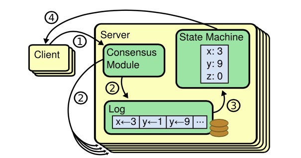
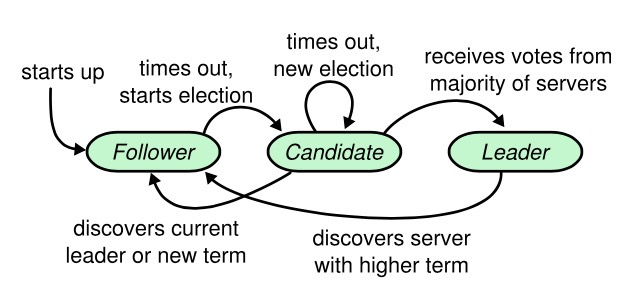
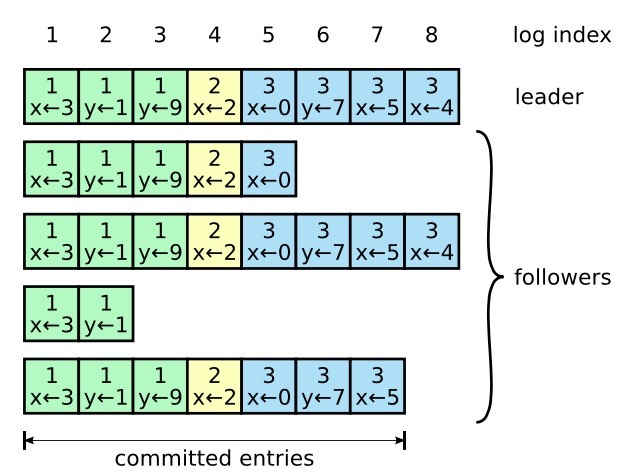

https://zhuanlan.zhihu.com/p/32052223

# 介绍

- **强领导者**：和其他一致性算法相比，Raft 使用一种更强的领导能力形式。比如，日志条目只从leader发送给其他的followers。这种方式简化了对复制日志的管理并且使得 Raft 算法更加易于理解。
- **领导选举**：Raft 算法使用一个`随机计时器`来选举leader。这种方式只是在任何一致性算法都必须实现的心跳机制上增加了一点机制。在解决冲突的时候会更加简单快捷。
- **成员关系调整**：Raft 使用一种共同一致的方法来处理集群成员变换的问题，在这种方法下，处于调整过程中的两种不同的配置集群中大多数机器会有重叠，这就使得集群在成员变换的时候依然可以继续工作。

# 复制状态机

* 一组服务器上的状态机产生相同状态的副本，并且在一些机器宕掉的情况下也可以继续运行。`复制状态机`在分布式系统中被用于解决很多容错的问题。例如，大规模的系统中通常都有一个集群领导者，像 GFS、HDFS 和 RAMCloud，典型应用就是一个独立的复制状态机去管理领导选举和存储配置信息并且在Leader宕机的情况下也要存活下来。比如 Chubby 和 ZooKeeper。

> 复制状态机的结构。一致性算法管理着来自客户端指令的复制日志。状态机从日志中处理相同顺序的相同指令，所以产生的结果也是相同的。

* 保证`复制日志相同`就是一致性算法的工作了。在一台服务器上，一致性模块接收客户端发送来的指令然后增加到自己的日志中去。它和其他服务器上的一致性模块进行通信来保证每一个服务器上的日志最终都以相同的顺序包含相同的请求，尽管有些服务器会宕机。一旦指令被正确的复制，每一个服务器的状态机按照日志顺序处理他们，然后输出结果被返回给客户端。因此，服务器集群看起来形成一个高可靠的状态机。
* 实际系统中使用的一致性算法通常含有以下特性：
  - 安全性保证（绝对不会返回一个错误的结果）：在非拜占庭错误情况下，包括网络延迟、分区、丢包、冗余和乱序等错误都可以保证正确。
  - 可用性：集群中只要有大多数的机器可运行并且能够相互通信、和客户端通信，就可以保证可用。因此，一个典型的包含 5 个节点的集群可以容忍两个节点的失败。服务器被停止就认为是失败。他们当有稳定的存储的时候可以从状态中恢复回来并重新加入集群。
  - 不依赖时序来保证一致性：物理时钟错误或者极端的消息延迟只有在最坏情况下才会导致可用性问题。
  - 通常情况下，一条指令可以尽可能快的在集群中大多数节点响应一轮远程过程调用时完成。小部分比较慢的节点不会影响系统整体的性能。

# Raft一致性算法

* Raft 通过选举一个领导人，然后给予他全部的`管理复制日志的责任`来实现一致性。领导人从客户端接收日志条目，把日志条目`复制到其他服务器`上，并且当保证安全性的时候告诉其他的服务器应用日志条目到他们的状态机中。拥有一个领导人大大简化了对复制日志的管理。例如，领导人可以决定新的日志条目需要放在日志中的什么位置而不需要和其他服务器商议，并且数据都从领导人流向其他服务器。一个领导人可以宕机，可以和其他服务器失去连接，这时一个新的领导人会被选举出来。
* 通过领导人的方式，Raft 将一致性问题分解成了三个相对独立的子问题
  * **领导选举**：一个新的领导人需要被选举出来，当现存的领导人宕机的时候
  * **日志复制**：领导人必须从客户端接收日志然后复制到集群中的其他节点，并且强制要求其他节点的日志保持和自己相同。
  * **安全性**：如果有任何的服务器节点已经应用了一个确定的日志条目到它的状态机中，那么其他服务器节点不能在同一个日志索引位置应用一个不同的指令。

## 状态

**所有服务器上的持久性状态 (在响应RPC请求之前 已经更新到了稳定的存储设备)**

| 参数        | 解释                                                         |
| ----------- | ------------------------------------------------------------ |
| currentTerm | 服务器已知最新的任期（在服务器首次启动的时候初始化为0，单调递增） |
| votedFor    | 当前任期内收到选票的候选者id 如果没有投给任何候选者 则为空   |
| log[]       | 日志条目;每个条目包含了用于状态机的命令，以及领导者接收到该条目时的任期（第一个索引为1） |

**所有服务器上的易失性状态**

| 参数        | 解释                                                         |
| ----------- | ------------------------------------------------------------ |
| commitIndex | 已知已提交的最高的日志条目的索引（初始值为0，单调递增）      |
| lastApplied | 已经被应用到状态机的最高的日志条目的索引（初始值为0，单调递增） |

**领导者（服务器）上的易失性状态 (选举后已经重新初始化)**

| 参数         | 解释                                                         |
| ------------ | ------------------------------------------------------------ |
| nextIndex[]  | 对于每一台服务器，发送到该服务器的下一个日志条目的索引（初始值为领导者最后的日志条目的索引+1） |
| matchIndex[] | 对于每一台服务器，已知的已经复制到该服务器的最高日志条目的索引（初始值为0，单调递增） |

**追加条目RPC**：

**被领导者调用 用于日志条目的复制 同时也被当做心跳使用**

参数：

| 参数         | 解释                                                         |
| ------------ | ------------------------------------------------------------ |
| term         | 领导者的任期                                                 |
| leaderId     | 领导者ID 因此跟随者可以对客户端进行重定向（译者注：跟随者根据领导者id把客户端的请求重定向到领导者，比如有时客户端把请求发给了跟随者而不是领导者） |
| prevLogIndex | 紧邻新日志条目之前的那个日志条目的索引                       |
| prevLogTerm  | 紧邻新日志条目之前的那个日志条目的任期                       |
| entries[]    | 需要被保存的日志条目（被当做心跳使用是 则日志条目内容为空；为了提高效率可能一次性发送多个） |
| leaderCommit | 领导者的已知已提交的最高的日志条目的索引                     |

结果：

| 返回值  | 解释                                                         |
| ------- | ------------------------------------------------------------ |
| term    | 当前任期,对于领导者而言 它会更新自己的任期                   |
| success | 结果为真 如果跟随者所含有的条目和preLogIndex以及preLogTerm匹配上了 |

接收者的实现：

1. `返回假` 如果领导者的任期小于接收者的当前任期（译者注：这里的接收者是指跟随者或者候选者）
2. `返回假` 如果接收者日志中没有包含这样一个条目`即该条目的任期在preLogIndex上能和prevLogTerm匹配上` （译者注：在接收者日志中如果能找到一个和preLogIndex以及prevLogTerm一样的索引和任期的日志条目则返回真否则返回假）
3. 如果一个已经存在的条目和新条目（译者注：即刚刚接收到的日志条目）发生了冲突（因为索引相同，任期不同），那么就删除这个已经存在的条目以及它之后的所有条目 
4. 追加日志中尚未存在的任何新条目
5. 如果领导者的已知已经提交的最高的日志条目的索引大于接收者的已知已经提交的最高的日志条目的索引则把接收者的已知已经提交的最高的日志条目的索引重置为领导者的已知已经提交的最高的日志条目的索引或者是上一个新条目的索引取两者的最小值

**请求投票 RPC**：

由候选人负责调用用来征集选票

| 参数         | 解释                         |
| ------------ | ---------------------------- |
| term         | 候选人的任期号               |
| candidateId  | 请求选票的候选人的 Id        |
| lastLogIndex | 候选人的最后日志条目的索引值 |
| lastLogTerm  | 候选人最后日志条目的任期号   |

| 返回值      | 解释                                       |
| ----------- | ------------------------------------------ |
| term        | 当前任期号，以便于候选人去更新自己的任期号 |
| voteGranted | 候选人赢得了此张选票时为真                 |

接收者实现：

1. 如果`term < currentTerm`返回 false （5.2 节）
2. 如果 votedFor 为空或者为 candidateId，并且候选人的日志至少和自己一样新(根据lastLogIndex和lastLogTerm判断)，那么就投票给他（5.2 节，5.4 节）

**所有服务器需遵守的规则**：

所有服务器：

- 如果`commitIndex > lastApplied`，那么就 lastApplied 加一，并把`log[lastApplied]`应用到状态机中（5.3 节）
- 如果接收到的 RPC 请求或响应中，任期号`T > currentTerm`，那么就令 currentTerm 等于 T，并切换状态为跟随者（5.1 节）

跟随者（5.2 节）：

- 响应来自候选人和领导者的请求
- 如果在超过选举超时时间的情况之前没有收到**当前领导人**（即该领导人的任期需与这个跟随者的当前任期相同）的心跳/附加日志，或者是给某个候选人投了票，就自己变成候选人

候选人（5.2 节）：

- 在转变成候选人后就立即开始选举过程
  - 自增当前的任期号（currentTerm）
  - 给自己投票
  - 重置选举超时计时器
  - 发送请求投票的 RPC 给其他所有服务器
- 如果接收到大多数服务器的选票，那么就变成领导人
- 如果接收到来自新的领导人的附加日志 RPC，转变成跟随者
- 如果选举过程超时，再次发起一轮选举

领导人：

- 一旦成为领导人：发送空的附加日志 RPC（心跳）给其他所有的服务器；在一定的空余时间之后不停的重复发送，以阻止跟随者超时（5.2 节）
- 如果接收到来自客户端的请求：附加条目到本地日志中，在条目被应用到状态机后响应客户端（5.3 节）
- 如果对于一个跟随者，最后日志条目的索引值大于等于 nextIndex，那么：发送从 nextIndex 开始的所有日志条目：
  - 如果成功：更新相应跟随者的 nextIndex 和 matchIndex
  - 如果因为日志不一致而失败，减少 nextIndex 重试
- 如果存在一个满足`N > commitIndex`的 N，并且大多数的`matchIndex[i] ≥ N`成立，并且`log[N].term == currentTerm`成立，那么令 commitIndex 等于这个 N （5.3 和 5.4 节）

| 特性             | 解释                                                         |
| ---------------- | ------------------------------------------------------------ |
| 选举安全特性     | 对于一个给定的任期号，最多只会有一个领导人被选举出来（5.2 节） |
| 领导人只附加原则 | 领导人绝对不会删除或者覆盖自己的日志，只会增加（5.3 节）     |
| 日志匹配原则     | 如果两个日志在相同的索引位置的日志条目的任期号相同，那么我们就认为这个日志从头到这个索引位置之间全部完全相同（5.3 节） |
| 领导人完全特性   | 如果某个日志条目在某个任期号中已经被提交，那么这个条目必然出现在更大任期号的所有领导人中（5.4 节） |
| 状态机安全特性   | 如果一个领导人已经将给定的索引值位置的日志条目应用到状态机中，那么其他任何的服务器在这个索引位置不会应用一个不同的日志（5.4.3 节） |

## Raft基础

* 一个 Raft 集群包含若干个服务器节点；通常是 5 个，这允许整个系统容忍 `2 个节点`的失效。在任何时刻，每一个服务器节点都处于这三个状态之一：`领导人、跟随者或者候选人`。在通常情况下，系统中只有一个领导人并且其他的节点全部都是跟随者。跟随者都是被动的：他们不会发送任何请求，只是简单的响应来自领导者或者候选人的请求。领导人处理所有的客户端请求（如果一个客户端和跟随者联系，那么跟随者会把请求重定向给领导人）。第三种状态，候选人，是用来在 5.2 节描述的选举新领导人时使用。下图展示了这些状态和他们之间的转换关系；这些转换关系会在接下来进行讨论。

> 服务器状态。跟随者只响应来自其他服务器的请求。如果跟随者接收不到消息，那么他就会变成候选人并发起一次选举。获得集群中大多数选票的候选人将成为领导者。在一个任期内，领导人一直都会是领导人直到自己宕机了。

## 领导人选举

* Raft 使用一种`心跳机制`来触发领导人选举。当服务器程序启动时，他们都是`跟随者`身份。一个服务器节点继续保持着跟随者状态`只要他从领导人或者候选者处接收到有效的 RPCs`。领导者`周期性的向所有跟随者发送心跳包`（即不包含日志项内容的附加日志项 RPCs）来维持自己的权威。如果一个跟随者在一段时间里没有接收到任何消息，也就是`选举超时`，那么他就会`认为系统中没有可用的领导者`,并且发起选举以选出新的领导者。

* 要开始一次选举过程，跟随者先要`增加自己的当前任期号并且转换到候选人状态`。然后他会并行的向集群中的其他服务器节点发送请求投票的 RPCs 来给自己投票。候选人会继续保持着当前状态直到以下三件事情之一发生：(a) 他自己赢得了这次的选举，(b) 其他的服务器成为领导者，(c) 一段时间之后没有任何一个获胜的人。这些结果会分别的在下面的段落里进行讨论。

* 当一个候选人从整个集群的大多数服务器节点获得了针对同一个任期号的选票，那么他就赢得了这次选举并成为领导人。每一个服务器最多会对一个任期号投出一张选票，按照先来先服务的原则（注意：5.4 节在投票上增加了一点额外的限制）。要求大多数选票的规则确保了最多只会有一个候选人赢得此次选举（图 3 中的选举安全性）。一旦候选人赢得选举，他就立即成为领导人。然后他会向其他的服务器发送心跳消息来建立自己的权威并且阻止新的领导人的产生。

* 在等待投票的时候，候选人可能会从其他的服务器接收到声明它是领导人的附加日志项 RPC。如果这个领导人的任期号（包含在此次的 RPC中）不小于候选人当前的任期号，那么候选人会承认领导人合法并回到跟随者状态。 如果此次 RPC 中的任期号比自己小，那么候选人就会拒绝这次的 RPC 并且继续保持候选人状态。

* 第三种可能的结果是候选人既没有赢得选举也没有输：如果有多个跟随者同时成为候选人，那么选票可能会被瓜分以至于没有候选人可以赢得大多数人的支持。当这种情况发生的时候，每一个候选人都会超时，然后通过增加当前任期号来开始一轮新的选举。然而，`没有其他机制的话，选票可能会被无限的重复瓜分`。

* Raft 算法使用`随机选举超时时间`的方法来确保很少会发生选票瓜分的情况，就算发生也能很快的解决。为了阻止选票起初就被瓜分，选举超时时间是从一个固定的区间（例如 150-300 毫秒）随机选择。这样可以把服务器都分散开以至于在大多数情况下只有一个服务器会选举超时；然后他赢得选举并在其他服务器超时之前发送心跳包。同样的机制被用在选票瓜分的情况下。每一个候选人在开始一次选举的时候会重置一个随机的选举超时时间，然后在超时时间内等待投票的结果；这样`减少了在新的选举中另外的选票瓜分的可能性`。
* 领导人选举这个例子，体现了可理解性原则是如何指导我们进行方案设计的。起初我们计划使用一种排名系统：每一个候选人都被赋予一个唯一的排名，供候选人之间竞争时进行选择。如果一个候选人发现另一个候选人拥有更高的排名，那么他就会回到跟随者状态，这样高排名的候选人能够更加容易的赢得下一次选举。但是我们发现这种方法在可用性方面会有一点问题（如果高排名的服务器宕机了，那么低排名的服务器可能会超时并再次进入候选人状态。而且如果这个行为发生得足够快，则可能会导致整个选举过程都被重置掉）。我们针对算法进行了多次调整，但是每次调整之后都会有新的问题。最终我们认为随机重试的方法是更加明显和易于理解的。

## 日志复制

* 一旦一个领导人被选举出来，他就开始为客户端提供服务。客户端的每一个请求都包含一条被复制状态机执行的指令。领导人把这条指令作为一条新的日志条目附加到日志中去，然后并行的发起附加条目 RPCs 给其他的服务器，让他们复制这条日志条目。当这条日志条目被安全的复制（下面会介绍），领导人会应用这条日志条目到它的状态机中然后把执行的结果返回给客户端。如果跟随者崩溃或者运行缓慢，再或者网络丢包，领导人会不断的重复尝试附加日志条目 RPCs （尽管已经回复了客户端）直到所有的跟随者都最终存储了所有的日志条目。

* 领导人来决定什么时候把日志条目应用到状态机中是安全的；这种日志条目被称为**已提交**。Raft 算法保证所有已提交的日志条目都是持久化的并且最终会被所有可用的状态机执行。在领导人将创建的日志条目复制到大多数的服务器上的时候，日志条目就会被提交（例如在图 6 中的条目 7）。同时，领导人的日志中之前的所有日志条目也都会被提交，包括由其他领导人创建的条目。5.4 节会讨论某些当在领导人改变之后应用这条规则的隐晦内容，同时他也展示了这种提交的定义是安全的。领导人跟踪了最大的将会被提交的日志项的索引，并且索引值会被包含在未来的所有附加日志 RPCs （包括心跳包），这样其他的服务器才能最终知道领导人的提交位置。**一旦跟随者知道一条日志条目已经被提交，那么他也会将这个日志条目应用到本地的状态机中**（按照日志的顺序）。
  * **如果在不同的日志中的两个条目拥有相同的索引和任期号，那么他们存储了相同的指令。**
  * **如果在不同的日志中的两个条目拥有相同的索引和任期号，那么他们之前的所有日志条目也全部相同。**