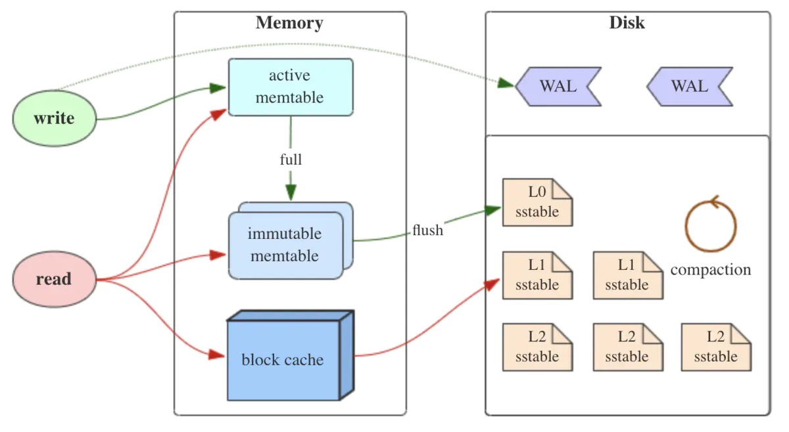
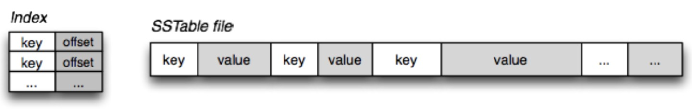

# 概述

LSM树并没有一种固定死的实现方式，更多的是一种将：

**“磁盘顺序写” + “多个树(状数据结构)” + “冷热（新老）数据分级” + “定期归并” + “非原地更新”** 这几种特性统一在一起的思想。

## 简介

* LSM树全称Log-Structured-Merge-Tree，中文含义为日志结构合并树，实际上其并不是一种树的数据结构，而是**存储结构**，目前例如RocksDB、HBase、LevelDB、Kudu都采用了LSM树存储结构；
* LSM树的核心特点是利用**顺序写**来提高写性能，但因为**分层**(此处分层是指的分为Memory和Disk File两部分)的设计会稍微降低读性能，但是通过**牺牲小部分读性能换来高性能写**，使得LSM树成为非常流行的存储结构。

## LSM树的定义

* LSM树是一个横跨**内存和磁盘**的存储结构，包含多颗"子树"的一个森林。
* LSM树分为**Level 0，Level 1... Level n** 多颗子树，其中只有**Level 0在内存**中，其余Level 1-n在磁盘中。
* 内存中的Level 0子树一般采用**排序树（红黑树/AVL树）、跳表或者TreeMap**等这类有序的数据结构，方便后续顺序写磁盘。
* 磁盘中的Level 1-n子树，本质是**数据排好序后顺序写到磁盘上的文件**，LSM树存储结构中称为SSTable(Sorted String Table)。
* 每一层的子树都有一个阈值大小，达到阈值后会进行合并，合并结果写入下一层。
* 只有内存中数据允许原地更新，磁盘上数据的变更只允许追加写，不做原地更新。

## 核心思想

如上图所示，LSM树有以下三个重要组成部分：

### MemTable

* MemTable是在内存中的数据结构，用于保存最近更新的数据，会按照Key有序地组织这些数据，LSM树对于具体如何组织有序地组织数据并没有明确的数据结构定义，例如Hbase使跳跃表来保证内存中key的有序。
* 因为数据暂时保存在内存中，内存并不是可靠存储，如果断电会丢失数据，因此通常会通过WAL(Write-ahead logging，预写式日志)的方式来保证数据的可靠性。

### Immutable MemTable

* 当 MemTable达到一定大小后，会转化成Immutable MemTable。Immutable MemTable是将转MemTable变为SSTable的一种中间状态。写操作由新的MemTable处理，在转存过程中不阻塞数据更新操作。

### SSTable(Sorted String Table)

* 有序键值对集合，是LSM树组在磁盘中的数据结构。为了加快SSTable的读取，可以通过建立key的索引以及布隆过滤器来加快key的查找。

* **这里需要关注一个重点**，LSM树(Log-Structured-Merge-Tree)正如它的名字一样，LSM树会将所有的数据插入、修改、删除等操作记录(注意是操作记录**)保存在内存之中**，内存中的数据是**通过原地修改方式**，当此类操作达到一定的数据量后，**再批量地顺序写入到磁盘当中**。这与B+树不同，B+树数据的更新会直接在原数据所在处修改对应的值，但是LSM数的数据更新是日志式的，**当一条数据的更新是直接append一条更新记录**后续只需关心最新的更新记录即可。这样设计的目的就是为了**顺序写**，不断地将**Immutable MemTable flush**到持久化存储即可，而不用去修改之前的SSTable中的key，保证了顺序写。

* 因此当MemTable达到一定大小flush到持久化存储变成SSTable后，在不同的SSTable中，可能存在相同Key的记录，以最新的那条记录才是准确的。这样设计的虽然大大提高了写性能，但同时也会带来一些问题：
  * 冗余存储，对于某个key，实际上除了最新的那条记录外，其他的记录都是冗余无用的，但是仍然占用了存储空间。因此需要进行Compact操作(合并多个SSTable)来清除冗余的记录。【写放大问题】
  * 读取时需要从最新的倒着查询，直到找到某个key的记录。**最坏情况需要查询完所有的SSTable**，这里可以通过前面提到的**索引/布隆过滤器**来优化查找速度；【读放大问题】

## 核心逻辑

1. 当有`写操作(或update操作)`时，写入位于内存的buffer，内存中通过某种`数据结构(如skiplist、vertor等)保持key有序`
2. 一般的实现也会将数据追加写到磁盘Log(wal)文件，以备必要时恢复
3. 内存中的`数据定时或按固定大小`地刷到磁盘，更新操作只不断地写到内存，并不更新磁盘上已有文件  compact操作
4. 随着越来越多写操作，磁盘上积累的文件也越来越多，这些文件不可写且有序
5. 定时对文件进行合并操作(compaction)，消除冗余数据，减少文件数量

### 写流程

* LSM存储结构的写操作，只需更新内存，内存中的数据以块数据形式刷到磁盘，是顺序的IO操作，另外磁盘文件定期的合并操作，也将带来磁盘IO操作。

### 读流程

* LSM存储结构的读操作，先从内存数据L0层开始访问，如果在内存中访问不到，再顺序从一个个磁盘文件(L1、L2.... Ln)中查找，由于文件本身有序，并且定期的合并减少了磁盘文件个数，因而查找过程相对较快速，该策略保证了查到的一定是目标key最新版本的数据（有点MVCC的感觉）。
* 通过策略我们会发现一旦出现Key在LSM树中不存在的情况，我们就需要从L0层查找到Ln层，这就导致读的成本无限放大，目前一些基于LSM树的存储会通过**布隆过滤器+建立稀疏索引+建立key的范围索引**等手段来提前剪枝，防止出现读放大问题。

### 删除流程

* LSM树的删除操作并不是直接删除数据，而是通过一种叫**“墓碑标记”**的特殊数据来标识数据的删除。删除操作分为：待删除数据在内存中、待删除数据在磁盘中 和 该数据根本不存在 三种情况。

#### 待删除数据在内存中

* 待删除的数据如果在L0层内存中，直接标识删除的数据为**墓碑数据**即可

#### 待删除数据在磁盘中

* 待删除的数据不在L0层的话，**直接往L0层插入一条墓碑数据**

#### 该数据根本不存在

* 与上述"待删除数据在磁盘中"流程一致

无论数据在不在内存中，墓碑数据都会写入L0层，如果存在则覆盖，不存在这插入。

### 修改流程

* LSM树的修改操作和删除操作很像，也是分为三种情况：待修改数据在内存中、在磁盘中和 该数据根本不存在。修改操作都是对内存中Level 0进行覆盖/新增操作。该操作复杂度为树高log(n)，代价很低。

### Compaction操作

* 合并操作是LSM实现中重要的一环，LevelDB、Cassandra中，使用基于层级的合并方式(Levelled compaction)，生成第N层的时候，对N-1层的数据进行排序，使得每层内的数据文件之间都是有序的，但最高层除外，因为该层不断有数据文件产生，因而只是数据文件内部按key有序。
* 合并操作存在俩个场景1.L0层内存数据达到阈值需要flush到磁盘的过程中2.磁盘上达到阈值的顺序文件进行**归并**，并将归并结果写入下一层，**归并过程中会清理重复的数据和被删除的数据(墓碑标记)**。
* 除最高层外，其他层文件间数据有序，这也加速了读过程，因为一个key对应的value只存在一个文件中。假设总共有N层，每层最多K个数据文件，最差的情况下，读操作先遍历K个文件，再遍历每层，共需要K+(N-1)次读盘操作。

# LSM快速熟悉

## 什么是LSM，解决什么问题

* **磁盘的顺序读写速度很快，随机读写很慢**。现在市面上7200rpm的希捷SATA硬盘顺序读写基本都能达到300MB/s；但是随机读写却很慢，100 IOPS，假设随机读写每次IO大小为1KB，则随机读写数据带宽为100KB/s；顺序读写和随机读写差了三个数量级。
  针对磁盘的上述特性，应用都根据自身读写特点做一些优化。比如数据库的binlog日志就是顺序写入，所以效率很高，但是缺点也比较明显，数据很难查询读取（其实binlog是用来回放恢复数据的，不存在查询读取的使用场景）；
  Mysql的innodb存储引擎底层用B+树数据结构来组织磁盘上的数据，B+树因其节点的度远大于平衡二叉树（平衡二叉树度为2），所以B+树树高很低（3~4），每一次数据的查询只需`3~4次`磁盘随机IO即可查找到数据（说法不太准确，其实是找到数据所在的page 16K，加载到内存中，再以二分法查找数据，内存二分查找所耗时间远小于磁盘IO，可忽略不计），效率很高；但是insert和update操作是随机的，update隐藏的含义先找到更新的primary-key，更新，调整B+树；查找primary-key的过程很高效，但是调整B+树的磁盘IO开销却很大，因此关系型数据库mysql的写效率一直饱受诟病。**那有没有一种替代B+树的数据组织模型，在不太影响读效率的前提下，提高数据的写效率（随机写->顺序写）?**
* 由O'Neil提出的LSM存储模型[LSM paper](https://link.zhihu.com/?target=https%3A//www.cs.umb.edu/~poneil/lsmtree.pdf)就是解决上述问题的。

## LSM如何解决问题

* 看下LSM是如何解决上述问题的：
  **简单来说，就是放弃部分磁盘读性能来换取写的顺序性。**
  我们假设要写入一个1000个key是随机数的数据，对磁盘来说，最快的写入方式一定是顺序地将每一次写入都直接写入到磁盘中即可。但这样带来的问题是，没办法查询，因为每次查询一个值都需要遍历整个数据才能找到，这个读性能就太差了；那么如果我想获取磁盘读性能最高，应该怎么做呢？把数据全部排序就行了，B+树就是这样的结构，但B+树的写性能太差了，需要提升写，可以放弃部分磁盘读性能，怎么办呢？

  简单，那就划分很多个小的有序结构，比如每m个数据，在内存里排序一次，下面100个数据，再排序一次……这样依次做下去，我就可以获得N/m个有序的小的有序结构，在查询的时候，因为不知道这个数据到底是在哪里，所以就从最新的一个小的有序结构里做二分查找，找得到就返回，找不到就继续找下一个小有序结构，一直到找到为止。

  很容易可以看出，这样的模式，读取的时间复杂度是(N/m)*log2N，读取效率是会下降的，这就是LSM的根本思路。当然RocksDB为了优化效率又引入了`bloomfilter，compact`机制，感兴趣可以阅读RocksDB的wiki：[RocksDBwiki](https://link.zhihu.com/?target=https%3A//github.com/facebook/rocksdb/wiki)

## LSM好处

* B+索引树和log型（append）文件操作（数据库WAL日志）是数据读写的两个极端。B+树读效率高而写效率差；log型文件操作写效率高而读效率差；因此要在排序和log型文件操作之间做个折中，于是就引入了log-structed merge tree模型，通过名称可以看出LSM既有日志型的文件操作，提升写效率，又在每个`sstable`中排序，保证了查询效率。

# LSM Paper解读

## 为什么要有LSM-TREE

* 对于大量写操作B-Tree的写入会带来大量的IO开销，存在维护索引、排序写成本，LSM-Tree的核心思想是将写入推迟(Defer)并转换为批量(Batch)写，先将大量写入缓存在内存中，当积攒到一定程度后，批量写入文件中充分利用每一次IO。

## LSM-Tree大量写优于B-Tree的原因

1. **multi-page block**：不同于B-Tree，LSM-Tree的延时写(数据可以积攒)可以有效的利用multi-page block，在Rolling Merge的过程中，一次从C1中读出多个连续pages，与C0进行Merge，然后一次向C1写回这些连续pages，这样有效利用单次I/O完成多个pages的读写（B-Tree在此场景下无法利用multi-page的优势）
2. **batch**：同样因为延迟写，LSM-Tree可以在Rolling Merge中，通过一次I/O批量向C1写入C0多条数据，那么这多条数据就均摊了这一次I/O，减少磁盘的I/O开销
