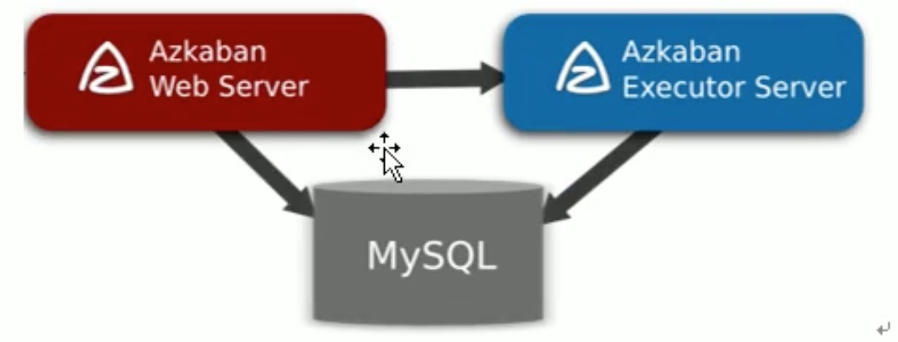

# 概述

## Azkaban特点

* 兼容任何版本的Hadoop
* 易于使用的Web用户界面
* 简单的工作流上传
* 方便设置任务之间的关系
* 调度工作流
* 模块化和可插拔的插件机制
* 认证/授权(权限的工作)
* 能够杀死并重启工作流
* 有关失败和成功的电子邮件提醒。

## 常见工作流调度系统

* 简单的任务调度:直接使用crontab实现；
* 复杂的任务调度:开发调度平台或使用现成的开源调度系统，比如ooize、azkaban等

## Azkaban的架构



* AzkabanWebServer:AzkabanWebServer是整个Azkaban工作流系统的主要管理者，它负责用户认证、project管理、定时执行工作流、跟踪工作流执行进度等一些列任务。
* AzkabanExecutorServer:负责具体的工作流提交、执行、它们通过mysql数据库来协调任务的执行。
* 关系型数据库(MySQL):存储大部分执行流状态，AzkabanWebServer和AzkabanExecutorServer都需要访问数据库。

# Azkaban安装部署

## 安装前准备

* 将Azkaban Web服务器、Azkaban执行服务器、Azkaban的sql执行脚本
  * azkaban-web-server
  * azkaban-executor-server
  * azkaban-sql-script
* 选择Mysql作为Azkaban数据库，Azkaban建立了一些Mysql连接增强功能，以方便Azkaban设置。

## 安装Azkaban

* 导入sql脚本

```shell
mysql -uroot -proot
create database azkaban
use azkaban
source create-all-sql.sql
```

## 配置密钥对和证书

```

```


