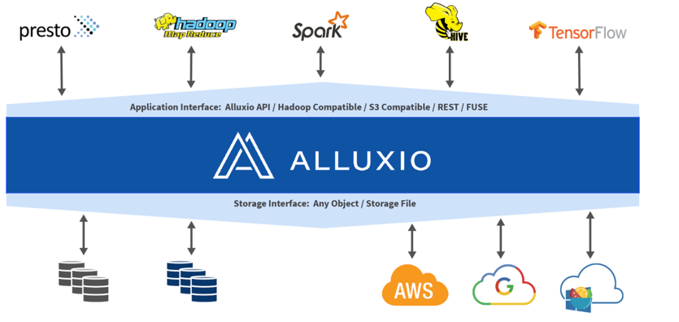

# 概述

# 特点


* **内存速度 I/O**：Alluxio 能够用作分布式共享缓存服务，这样与 Alluxio 通信的计算应用程序可以透明地缓存频繁访问的数据（尤其是从远程位置），以提供内存级 I/O 吞吐率。此外，Alluxio的层次化存储机制能够充分利用内存、固态硬盘或者磁盘，降低具有弹性扩张特性的数据驱动型应用的成本开销。
* **简化云存储和对象存储接入**：与传统文件系统相比，云存储系统和对象存储系统使用不同的语义，这些语义对性能的影响也不同于传统文件系统。在云存储和对象存储系统上进行常见的文件系统操作（如列出目录和重命名）通常会导致显著的性能开销。当访问云存储中的数据时，应用程序没有节点级数据本地性或跨应用程序缓存。将 Alluxio 与云存储或对象存储一起部署可以缓解这些问题，因为这样将从 Alluxio 中检索读取数据，而不是从底层云存储或对象存储中检索读取。
* **简化数据管理**：Alluxio 提供对多数据源的单点访问。除了连接不同类型的数据源之外，Alluxio 还允许用户同时连接同一存储系统的不同版本，如多个版本的 HDFS，并且无需复杂的系统配置和管理。
* **应用程序部署简易**：Alluxio 管理应用程序和文件或对象存储之间的通信，将应用程序的数据访问请求转换为底层存储接口的请求。Alluxio 与 Hadoop 生态系统兼容，现有的数据分析应用程序，如 Spark 和 MapReduce 程序，无需更改任何代码就能在 Alluxio 上运行。

## 快速搭建

* max os系统需要安装ssh（一般安装过hadoop环境的这个都已经安装了）
* 下载allux并且配置环境变量，[alluxio下载地址](https://www.alluxio.io/download/)，修改相应配置

```shell
tar -xzf alluxio-2.7.2-bin.tar.gz
cd alluxio-2.7.2
# 配置${ALLUXIO_HOME}
export ALLUXIO_HOME=$MODULE_HOME/alluxio-2.7.2
export PATH=$PATH:$ALLUXIO_HOME/bin

# 修改conf
cp conf/alluxio-site.properties.template conf/alluxio-site.properties
echo "alluxio.master.hostname=localhost" >> conf/alluxio-site.properties
```

* 验证Alluxio运行环境

```shell
alluxio validateEnv local
```

* 启动Alluxio

```shell
# 格式化alluxio
alluxio format
# 本地运行1master和1worker
alluxio-start.sh local SudoMount
```

* 使用alluxio shell

```shell
alluxio fs copyFromLocal LICENSE /LICENSE

$ alluxio fs ls /
-rw-r--r--  xiamuguizhi    staff                    27040       PERSISTED 01-05-2022 23:33:15:361 100% /LICENSE
```

**默认情况：**alluxio使用的本地系统为底层文件系统(UFS)，默认路径为`./underFSStorage`,端口`19999`查看alluxio文件目录

* 挂在hdfs上的数据到alluxio中

```shell
# 创建一个目录作为挂载点
alluxio fs mkdir /mnt
alluxio fs mount --readonly alluxio://localhost:19998/mnt/hdfs hdfs://hadoop:8020/user/flink/hudi_user
```

* 使用Alluxio加速数据访问,如果ls文件状态下显示100%则代表文件已经完全加载至`alluxio`则可以利用`alluxio`来加速读取。

# 核心功能

## 缓存

### 概述

* Alluxio将存储分为俩个类别的方式来帮助统一跨各种平台用户数据的同时还有助于为用户提升总体I / O吞吐量。
  * **UFS(底层文件系统，底层存储)**:表示不受Alluxio管理的空间，UFS存储可能来自外部文件系统，如HDFS或S3， 通常，UFS存储旨在相当长一段时间持久存储大量数据。
  * **Alluxio存储**
    * alluxio作为一个分布式缓存来管理Alluxio workers本地存储，包括内存。这个在用户应用程序与各种底层存储之间的快速数据层带来的是显著提高的I / O性能。
    * Alluxio存储主要用于存储热数据，暂态数据，而不是长期持久数据存储。
    * 每个Alluxio节点要管理的存储量和类型由用户配置决定。
    * 即使数据当前不在Alluxio存储中，通过Alluxio连接的UFS中的文件仍然 对Alluxio客户可见。当客户端尝试读取仅可从UFS获得的文件时数据将被复制到Alluxio存储中（这里体现在alluxio文件目录下的进度条）



* Alluxio存储通过将数据`存储在计算节点内存`中来提高性能。Alluxio存储中的数据可以被`复制来形成"热"数据`，更易于I/O并行操作和使用。
* Alluxio中的`数据副本独立于UFS中可能已存在的副本`。 Alluxio存储中的数据副本数是由集群活动动态决定的。 由于Alluxio依赖底层文件存储来存储大部分数据， Alluxio不需要`保存未使用的数据副本`。
* Alluxio还支持让系统存储软件可感知的分层存储，使类似L1/L2 CPU缓存一样的数据存储优化成为可能。

### 配置Alluxio存储

#### 单层存储

* Alluxio默认为单层存储，Alluxio将在每个worker节点上发放一个ramdisk并占用一定比例的系统的总内存。 此`ramdisk`将用作分配给每个Alluxio worker的唯一存储介质。
* 通过修改`alluxio-site.properties`

```properties
# 设置每个worker的ramdisk大小
alluxio.worker.ramdisk.size=16GB
# 指定worker多个存储介质
alluxio.worker.tieredstore.level0.dirs.path=/mnt/ramdisk,/mnt/ssd1,/mnt/ssd2
alluxio.worker.tieredstore.level0.dirs.mediumtype=MEM,SSD,SSD
# 多个存储介质分配worker使用大小
alluxio.worker.tieredstore.level0.dirs.quota=16GB,100GB,100GB
```

#### 多层存储

* 通常建议异构存储介质也使用单个存储层。 在特定环境中，工作负载将受益于基于I/O速度存储介质明确排序。 Alluxio假定根据按I/O性能从高到低来对多层存储进行排序。 例如，用户经常指定以下层：
  * MEM(内存)
  * SSD(固态存储)
  * HDD(硬盘存储)
