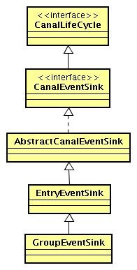

# 概述

## 工作原理

* Canal的核心思想是模拟MySQL Slave的交互协议，将自己伪装成一个MySQL的Slave机器，然后不断地向Master服务器发送Dump请求。Master收到Dump请求后，就会开始推送相应的Binlog给该Slave(也就是Canal)。Canal收到Binlog，解析出相应的Binlog对象后就可以进行二次消费了。


1. Canal模拟MySQL从站的交互协议，伪装成MySQL Slave，然后将转储协议发送到MySQL主服务器。
2. MySQL Master接收到转储请求，并开始将binlog推送到slave（即canal）。
3. canal将binlog对象解析为其自己的数据类型（最初为字节流）

### Canal Server主备切换设计

* 在Canal设计中，基于容灾的考虑会配置多个Canal Server来负责一个MySQL数据库实例的数据增量复制。为了减少Canal Server的Dump请求对MySQL Master带来的性能影响，要求`不同的Canal Server上的instance在同一时刻只能有一个处于Running状态，其他的instance都处于Standby状态，这可以让Canal拥有主备自动切换的能力`。主要依赖于Zookeeper的Watcher来完成的主备自动切换能力。


1. 尝试启动
   * 每个Canal Server在启动某个Canal instance的时候都会首先向Zookeeper进行一次尝试启动判断。向Zookeeper创建一个相同的临时节点，哪个Canal Server创建成功了，就让哪个Canal Server启动。
2. 启动instance
   * 假设最终IP地址为10.21.144.51的Canal Server成功创建了该节点，那么它就会将自己的机器信息写入到该节点中去:"{"active":true,"address":"10.20.144.51:11111","cid":1}",并同时启动instance。其他Canal Server由于没有成功创建节点，会讲自己的状态设置为Standby，同时对"/otter/canal/destinations/example/running"节点注册Watcher监听，以监听该节点变化情况。
3. 主备切换
   * Canal Server运行时期突然宕机的话会自动进行主备切换，基于Zookeeper临时节点的特点，客户端断开链接会自动删除临时节点，StandBy状态的Canal Server会收到Watcher的通知然后创建临时节点成为新的Active节点。

* 避免"脑裂"策略，每个Standby会延迟一段时间再去成为Active，原本是Active节点可以无需延迟直接继续成为Active，延迟时间默认为5秒，即Running节点针对假死状态的保护期为5秒。

### Canal Client的HA设计

1. 从Zookeeper中读取出当前处于Running状态的Server。
   * Canal Client在启动的时候，会从"/otter/canal/destinations/example/running"节点上读取出当前处于Running状态的Canal Server。同时，客户端也会将自己的信息注册到Zookeeper的"/otter/canal/destinations/example/1001/running"节点上，其中"1001"代表客户端的唯一标识，内容为"{"active":true,"address":"10.12.48.171:50544","clientId":1001}"
2. 注册Running节点数据变化的Watcher
   * Canal Server会存在挂掉的问题，Canal Client需要监听Canal Server运行的节点，如果该节点发生变化可以通知到客户端。
3. 连接对应的Running Server进行数据消费。

### 数据消费位点记录

* Canal Client存在重启或其他变化，为了避免数据消费的重复性和顺序错乱，Canal必须对数据消费的位点进行实时记录。数据消费成功后，Canal Server会在Zookeeper中记录下当前最后一次消费成功的Binary Log位点，一旦发生Client重启，只需要从这个最后一个位点继续进行消费即可。
* 具体是在Zookeeper的"/otter/canal/destinations/example/1001/cursor"节点记录下客户端消费的详细位点新鲜。

```json
{
  "@type":"com.alibaba.otter.canal.protocol.postion.LogPosition",
  "identity":{"slaveId":-1,"sourceAddress":{"address":"10.20.144.15","port":"3306"}},
  "postition":{"included":false,"journalName":"mysql-bin.002253","position":2574756,"timestamp":1363688722000}
}
```

## 快速开始

### 准备

* 对于自建 MySQL , 需要先开启 Binlog 写入功能，配置 binlog-format 为 ROW 模式，my.cnf 中配置如下

```
[mysqld]
log-bin=mysql-bin # 开启 binlog
binlog-format=ROW # 选择 ROW 模式
server_id=1 # 配置 MySQL replaction 需要定义，不要和 canal 的 slaveId 重复
```

* 授权 canal 链接 MySQL 账号具有作为 MySQL slave 的权限, 如果已有账户可直接 grant

```sql
CREATE USER canal IDENTIFIED BY 'canal';  
GRANT SELECT, REPLICATION SLAVE, REPLICATION CLIENT ON *.* TO 'canal'@'%';
-- GRANT ALL PRIVILEGES ON *.* TO 'canal'@'%' ;
FLUSH PRIVILEGES;
```

### 启动

* 下载canal压缩包

```shell
wget https://github.com/alibaba/canal/releases/download/canal-1.0.17/canal.deployer-1.0.17.tar.gz
```

* 配置修改

```shell
vi conf/example/instance.properties
```

```properties
## mysql serverId
canal.instance.mysql.slaveId = 1234
#position info，需要改成自己的数据库信息
canal.instance.master.address = 127.0.0.1:3306 
canal.instance.master.journal.name = 
canal.instance.master.position = 
canal.instance.master.timestamp = 
#canal.instance.standby.address = 
#canal.instance.standby.journal.name =
#canal.instance.standby.position = 
#canal.instance.standby.timestamp = 
#username/password，需要改成自己的数据库信息
canal.instance.dbUsername = canal  
canal.instance.dbPassword = canal
canal.instance.defaultDatabaseName =
# 代表数据库的编码方式对应到java中的编码类型，比如 UTF-8，GBK , ISO-8859-1
canal.instance.connectionCharset = UTF-8
#table regex
canal.instance.filter.regex = .\*\\\\..\*
# 是否并行方式解析binlog
canal.instance.parser.parallel= true
```

* 启动 `sh bin/startup.sh`
* 查看server日志

```shell
vi logs/canal/canal.log</pre>
```

* 查看instance的日志

```shell
vi logs/example/example.log
```

* 关闭`sh bin/stop.sh`

## Canal到MQ

[Canal到MQ](https://github.com/alibaba/canal/wiki/Canal-Kafka-RocketMQ-QuickStart)

# 核心概念

## Canal设计


* server代表一个canal运行实例，对应于一个jvm。
* instance对应于一个数据队列(一个canal sever对应1..n个instance)
* instance的子模块
  * eventParser:数据源介入，模拟slave协议和master进行交互，协议解析
  * eventSink:Parser和Store链接器，进行数据过滤，加工，分发的工作
  * eventStore:数据存储
  * metaManager:增量订阅&消费信息管理器

## 整体类图


* CanalLifeCycle:所有canal模块的生命周期接口
* CanalInstance: 组合 parser,sink,store 三个子模块，三个子模块的生命周期统一受 CanalInstance 管理
* CanalServer: 聚合了多个 CanalInstance

### EventParser 设计


* 每个EventParser都会关联两个内部组件
  * CanalLogPositionManager : 记录binlog 最后一次解析成功位置信息，主要是描述下一次canal启动的位点
  * CanalHAController: 控制 EventParser 的链接主机管理，判断当前该链接哪个mysql数据库
* 目前开源版本只支持 MySQL binlog , 默认通过 MySQL binlog dump 远程获取 binlog ,但也可以使用 LocalBinlog - 类 relay log 模式，直接消费本地文件中的 binlog

### CanalLogPositionManager设计


- 如果 CanalEventStore 选择的是内存模式，可不保留解析位置，下一次 canal 启动时直接依赖 CanalMetaManager 记录的最后一次消费成功的位点即可. (最后一次ack提交的数据位点)
- 如果 CanalEventStore 选择的是持久化模式，可通过 zookeeper 记录位点信息，canal instance 发生 failover 切换到另一台机器，可通过读取 zookeeper 获取位点信息
- 可通过实现自己的 CanalLogPositionManager，比如记录位点信息到本地文件/nas 文件实现简单可用的无 HA 模式

### CanalHAController类图设计


- 失败检测常见方式可定时发送心跳语句到当前链接的数据库，超过一定次数检测失败时，尝试切换到备机
- 如果有一套数据库主备信息管理系统，当数据库主备切换或者机器下线，推送配置到各个应用节点，HAController 收到后，控制 EventParser 进行链接切换

### EventSink类图设计和扩展




- 常见的 sink 业务有 1:n 和 n:1 形式，目前 GroupEventSink 主要是解决 n:1 的归并类业务##

## 应用扩展

- canal instance 基于 spring 的管理方式，主要由两部分组成
  - xxx.properties
  - xxx-instance.xml
- xxx-instance.xml 描述对应 instance 所使用的模块组件定义，默认的 instance 模块组件定义有
  - memory-instance.xml:选择 memory 模式的组件，速度优先，简单
  - default-instance.xml:选择 mixed/preiodmixed 模式的组件，可以提供 HA 的功能
  - group-instance.xml:提供 n:1 的 sink 模式