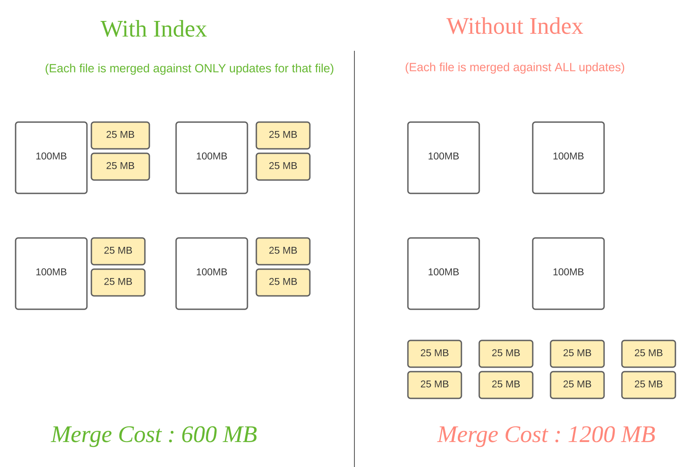

>indexing作为hudi毕竟核心的模块不仅仅提供file粒度的剪枝能力，还支持根据indexing来区分update和insert，从而是rewrite还是append操作。indexing的构成一般是partitionField+recordKey组成的HoodieKey作为key，其value存储的是对应的filePath。

# Doc

* Hudi通过hoodie key(record key+partition path)和file id的映射来提供一个高性能的upsert能力。record key和file group/file id之间的映射，一旦记录的第一个版本被写入到文件中，就不会改变。因此，映射file group包含一组记录的所有版本。
* 对于Cow表通过避免连接整个数据集来确定重写哪些文件，能够开启快速的upsert/delete操作。对于Mor表这个设计允许hudi绑定任何给定的base file需要合并的记录数量。具体来说，一个给定的base file只需要针对作为该base file一部分的记录的更新进行合并。

## Index Type

* **Bloom Index:**默认，使用由record key构建的布隆过滤器，还可以按需要使用record key范围来修剪候选文件。
* **Simple Index:**根据对应hoodieKey查询对应record记录，主要是hoodieKey和record的映射关系。
* **HBase Index:**管理索引映射在外部的hbase表
* **自己实现的index:**根据业务需求自定义实现的index

#### 使用方式

* 通过`hoodie.index.type`指定index类型，通过`hoodie.index.class`指定自定义index实现类（需要实现`SparkHoodieIndex`）

#### Global Index和Non Global Index

* **Global Index:**全局索引强制一个表的全部分区的key不能重复。保证对于给定的记录键，表中只存在一条记录。全局索引提供了更强的保证，但是更新/删除成本会随着表O(表的大小)的大小而增加，这对于较小的表来说仍然可以接受。
* **Non Global index:** 默认索引实现只在特定分区内强制此约束。可以想象，非全局索引依赖于写入器在更新/删除期间为给定的记录键提供相同的一致分区路径，但可以提供更好的性能，因为索引查找操作变成O(更新/删除记录的数量)，并且可以很好地随写量伸缩。

## Index Strategies

### 对事实表的迟到更新

* 许多公司在NoSQL数据存储中存储了大量的事务性数据。大部分的更新会进入比较新的分区，少部分数据会进入旧分区。这种情况选择bloom index可以大幅度提升性能，此外，如果可以将键构造成具有一定的顺序，则通过范围修剪进一步减少要比较的文件的数量。Hudi构造了一个包含所有文件键范围的间隔树，并有效地过滤出与更新/删除记录中任何键范围不匹配的文件。
* 有时候可能因为bloom filter的假阳性导致扫描的file大幅度增加可以通过`hoodie.bloom.index.filter.type=DYNAMIC_V0`配置动态根据文件大小去修改种子参数，从而降低bloom filter的假阳性。

### 去重的新分区事件流场景

* 这里如果使用k-v存储Hbase index会导致index存储线性增长，因为事实数据并且只新分区，使用带范围修剪的BLOOM索引是这里的最优解。我们可以利用时间来进行第一层过滤，并构造一个诸如event_ts + event_id这样的键，这样插入的记录具有单调递增的键。这可以通过在最新的表分区中修剪大量的文件来获得巨大的回报。

### 随机修改场景

* 这种场景涉及到很多分区的修改和删除因此不能通过范围去进行很好的剪枝，所以选择Hbase Index活Simple Index这类的k-v index更为合适。

# Code

## HoodieIndex

* 索引底层抽象基础类，封装了通用的检索索引、更新索引等方法，其子类为`HBASE, INMEMORY, BLOOM, GLOBAL_BLOOM, SIMPLE, GLOBAL_SIMPLE, BUCKET, FLINK_STATE`索引类型的实现类。

