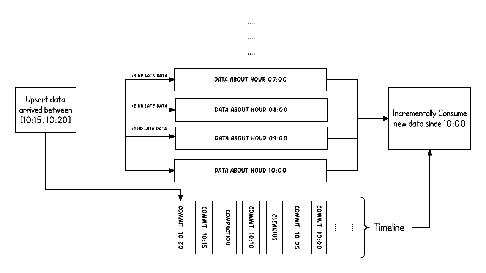

> Timeline从字面意思也能看出来记录时间线的一种特性，在hudi中timeline维护了在不同时间在hudi上的相关操作进一步提供一种瞬时视图，并且支持有效地按抵达顺序检索数据。其主要特性也包含**Instatnt action**、**Instant time**、**state**

# Doc

> 主要基于官方文档对timeline进行一个通俗的描述，使得可以更加通俗的了解timeline特性。

## Timeline

* **Instant action**
  * `COMMIT`:表示将一批记录原子地写入一个表。
  * `CLEANS`:以后台运行的方式去清理hudi表不在需要的一系列旧版本数据
  * `DELTA_COMMIT`:表示将一批数据原子的写入MOR表中，并且这些数据仅仅只写入delta logs
  * `COMPACTION`:以后台运行的方式去整理Hudi内部不同的数据结构，例如移动修改的row base log文件合并为列格式。在内部，compaction显示为timeline上的特殊提交
  * `ROLLBACK`:表示当commit/delta commit不成功或者回滚的时候，移除一些由于这次写入产生的不完成文件。
  * `SAVEPOINT`:将某些文件组标记为“已保存”，这样cleaner就不会删除它们。它有助于在灾难/数据恢复场景中将表恢复到timeline上的某个点。
* **state**
  * `REQUESTED`:表示计划某个action，但是还没有初始化
  * `INFLIGHT`:表示当前正在处理某个action
  * `COMPLETED`:表示timeline上的某个action已经处理完成

* 这个图表示在10:00到10:20之间向hudi表进行upsert操作，大约每5分钟在timeline上提交一次元数据，并且连通着**CLEANING**和**COMPACTION** Action。可以看到提交的时间也就是`arrival time`在上午10:20，但是实际的数据时间是`event time`,该数据用于(从07:00开始的每小时桶)。
* 当发生迟到的数据(数据应该在9:00到达但是迟到了1个多小时10:20才到达)，可以看到上图迟到的数据虽然timeline是10:20但是真实的数据还是在旧的buckets中。在时间轴的帮助下，试图获取10:00小时以来成功提交的所有新数据的增量查询能够非常有效地只使用更改的文件，而无需扫描所有时间桶> 07:00。

**从上述描述也可以初步对timeline有个大体的了解，timeline的作用就是为用户提供一个可以顺序检索hudi表对应发生操作的记录。**

# Code

## HoodieTimeline

* 封装支持的`action`,并且定义支持的timeline相关操作包含查询、过滤对应`instant action`等，其实现类有`HoodieArchivedTimeline`、`HoodieDefaultTimeline`、`HoodieActiveTimeline`

### HoodieDefaultTimeline

* 默认的HoodieTimeline实现提供了检索hoodileinstant的列表能力，并且实现了对于hoodieInstant列表的过滤，完成一些基础的instant action的记录与操作。

### HoodieActiveTimeline

* 记录hoodie近12小时(可配置)的instant action的ActiveTimeline和其他被归档的timeline记录。ActiveTimeline支持创建instant在timeline上。

### HoodieArchivedTimeline

* 表示hudi表的archived timeline. 过期12个小时的instants在activeTimeline和archivedTimeline