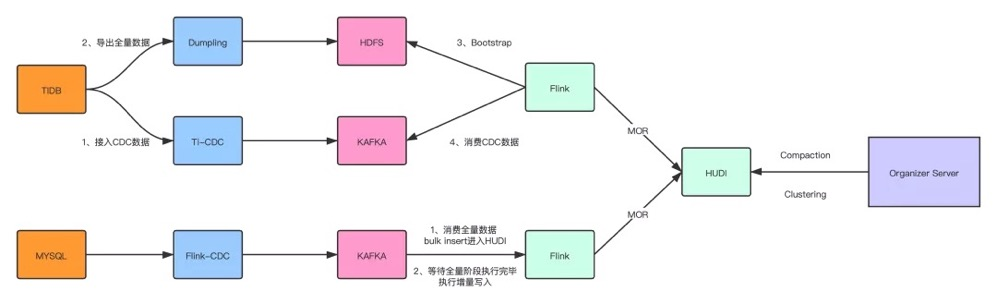

* `Configuration`:`$FLINK_HOME/conf/flink-conf.yaml`修改相关配置
* `Writing Data`:Flink支持[Bulk Insert](https://hudi.apache.org/docs/flink-quick-start-guide#bulk-insert), [Index Bootstrap](https://hudi.apache.org/docs/flink-quick-start-guide#index-bootstrap), [Changelog Mode](https://hudi.apache.org/docs/flink-quick-start-guide#changelog-mode), [Insert Mode](https://hudi.apache.org/docs/flink-quick-start-guide#insert-mode) 和 [Offline Compaction](https://hudi.apache.org/docs/flink-quick-start-guide#offline-compaction).
* `Querying Data`:Flink支持[Hive Query](https://hudi.apache.org/docs/flink-quick-start-guide#hive-query), [Presto Query](https://hudi.apache.org/docs/flink-quick-start-guide#presto-query).
* `Optimization`:对于写/读任务，提供了 [Memory Optimization](https://hudi.apache.org/docs/flink-quick-start-guide#memory-optimization)和 [Write Rate Limit](https://hudi.apache.org/docs/flink-quick-start-guide#write-rate-limit).

# 快速开始

## 设置

* 下载1.11.2或1.12.2版本的flink
* 启动Flink集群
  * `flink-conf.yaml`中添加`taskmanager.numberOfTaskSlots: 4`

```shell
bash start-cluster.sh
```

* 启动Flink SQL客户端

```shell
bash sql-client.sh embedded -j ~/Downloads/hudi-flink-bundle_2.11-0.9.0.jar shell
```

## Insert Data

```sql
-- sets up the result mode to tableau to show the results directly in the CLI
set execution.result-mode=tableau;

CREATE TABLE t1(
  uuid VARCHAR(20),
  name VARCHAR(10),
  age INT,
  ts TIMESTAMP(3),
  `partition` VARCHAR(20)
)
PARTITIONED BY (`partition`)
WITH (
  'connector' = 'hudi',
  'path' = 'schema://base-path',
  'table.type' = 'MERGE_ON_READ' -- this creates a MERGE_ON_READ table, by default is COPY_ON_WRITE
);

-- insert data using values
INSERT INTO t1 VALUES
  ('id1','Danny',23,TIMESTAMP '1970-01-01 00:00:01','par1'),
  ('id2','Stephen',33,TIMESTAMP '1970-01-01 00:00:02','par1'),
  ('id3','Julian',53,TIMESTAMP '1970-01-01 00:00:03','par2'),
  ('id4','Fabian',31,TIMESTAMP '1970-01-01 00:00:04','par2'),
  ('id5','Sophia',18,TIMESTAMP '1970-01-01 00:00:05','par3'),
  ('id6','Emma',20,TIMESTAMP '1970-01-01 00:00:06','par3'),
  ('id7','Bob',44,TIMESTAMP '1970-01-01 00:00:07','par4'),
  ('id8','Han',56,TIMESTAMP '1970-01-01 00:00:08','par4');
```

## Update data

```sql
-- 主键相同为修改
insert into t1 values
  ('id1','Danny',27,TIMESTAMP '1970-01-01 00:00:01','par1');
```

## Streaming Query

* 可以通过提交的时间戳去流式消费数据

```sql
CREATE TABLE t1(
  uuid VARCHAR(20),
  name VARCHAR(10),
  age INT,
  ts TIMESTAMP(3),
  `partition` VARCHAR(20)
)
PARTITIONED BY (`partition`)
WITH (
  'connector' = 'hudi',
  'path' = 'oss://vvr-daily/hudi/t1',
  'table.type' = 'MERGE_ON_READ',
  'read.streaming.enabled' = 'true',  -- this option enable the streaming read
  'read.streaming.start-commit' = '20210316134557' -- specifies the start commit instant time
  'read.streaming.check-interval' = '4' -- specifies the check interval for finding new source commits, default 60s.
);

-- Then query the table in stream mode
select * from t1;
```

# Table Option

* 通过Flink SQL WITH配置的表配置

## Memory

| Option Name              | Description                                                  | Default | Remarks                                                      |
| ------------------------ | ------------------------------------------------------------ | ------- | ------------------------------------------------------------ |
| `write.task.max.size`    | 写任务的最大内存(以MB为单位)，当达到阈值时，它刷新最大大小的数据桶以避免OOM。默认1024 mb | `1024D` | 为写缓冲区预留的内存为write.task.max.size - compact .max_memory。当写任务的总缓冲区达到阈值时，将刷新内存中最大的缓冲区 |
| `write.batch.size`       | 为了提高写的效率，Flink写任务会根据写桶将数据缓存到缓冲区中，直到内存达到阈值。当达到阈值时，数据缓冲区将被清除。默认64 mb | `64D`   | 推荐使用默认值                                               |
| `write.log_block.size`   | hudi的日志写入器接收到消息后不会立刻flush数据，写入器以LogBlock为单位将数据刷新到磁盘。在LogBlock达到阈值之前，记录将以序列化字节的形式在写入器中进行缓冲。默认128 mb | `128`   | 推荐使用默认值                                               |
| `write.merge.max_memory` | 如果写入类型是`COPY_ON_WRITE`，Hudi将会合并增量数据和base文件数据。增量数据将会被缓存和溢写磁盘。这个阈值控制可使用的最大堆大小。默认100 mb | `100`   | 推荐使用默认值                                               |
| `compaction.max_memory`  | 与write.merge.max内存相同，但在压缩期间发生。默认100 mb      | `100`   | 如果是在线压缩，则可以在资源足够时打开它，例如设置为1024MB   |

## Parallelism

| Option Name                  | Description                                                  | Default                                                      | Remarks                                                      |
| ---------------------------- | ------------------------------------------------------------ | ------------------------------------------------------------ | ------------------------------------------------------------ |
| `write.tasks`                | 写入器任务的并行度，每个写任务依次向1到N个桶写。默认的4      | `4`                                                          | 增加并行度对小文件的数量没有影响                             |
| `write.bucket_assign.tasks`  | 桶分配操作符的并行性。无默认值，使用Flink parallelism.default | [`parallelism.default`](https://hudi.apache.org/docs/flink-quick-start-guide#parallelism) | 增加并行度也会增加桶的数量，从而增加小文件(小桶)的数量。     |
| `write.index_boostrap.tasks` | index bootstrap的并行度，增加并行度可以提高bootstarp阶段的效率。因此，需要设置更多的检查点容错时间。默认使用Flink并行 | [`parallelism.default`](https://hudi.apache.org/docs/flink-quick-start-guide#parallelism) | 只有当index. bootstrap .enabled为true时才生效                |
| `read.tasks`                 | Default `4`读操作的并行度(批和流)                            | `4`                                                          |                                                              |
| `compaction.tasks`           | 实时compaction的并行度，默认为10                             | `10`                                                         | `Online compaction` 会占用写任务的资源，推荐使用offline compaction`](https://hudi.apache.org/docs/flink-quick-start-guide#offline-compaction) |

## Compaction

* 以下配置近支持实时compaction
* 通过设置`compaction.async.enabled = false`关闭在线压缩，但我们仍然建议对写作业启用`compaction.schedule.enable`。然后，您可以通过脱机压缩来执行压缩计划。

| Option Name                   | Description                                             | Default       | Remarks                                                      |
| ----------------------------- | ------------------------------------------------------- | ------------- | ------------------------------------------------------------ |
| `compaction.schedule.enabled` | 是否定期生成compaction计划                              | `true`        | 即使compaction.async.enabled = false，也建议打开它           |
| `compaction.async.enabled`    | 异步压缩，MOR默认启用                                   | `true`        | 通过关闭此选项来关闭`online compaction`                      |
| `compaction.trigger.strategy` | 触发compaction的策略                                    | `num_commits` | Options are `num_commits`: 当达到N个delta提交时触发压缩; `time_elapsed`: 当距离上次压缩时间> N秒时触发压缩; `num_and_time`: 当满足`NUM_COMMITS`和`TIME_ELAPSED`时，进行rigger压缩;`num_or_time`: 在满足`NUM_COMMITS`或`TIME_ELAPSED`时触发压缩。 |
| `compaction.delta_commits`    | 触发压缩所需的最大delte提交，默认为5次提交              | `5`           | --                                                           |
| `compaction.delta_seconds`    | 触发压缩所需的最大增量秒数，默认为1小时                 | `3600`        | --                                                           |
| `compaction.max_memory`       | `compaction`溢出映射的最大内存(以MB为单位)，默认为100MB | `100`         | 如果您有足够的资源，建议调整到1024MB                         |
| `compaction.target_io`        | 每次压缩的目标IO(读和写)，默认为5GB                     | `5120`        | `offline compaction` 的默认值是500GB                         |

# Memory Optimization

## MOR

* 设置Flink状态后端为`RocksDB`(默认为`in memory`状态后端)
* 如果有足够的内存，`compaction.max_memory`可以设置大于100MB建议调整至1024MB。
* 注意taskManager分配给每个写任务的内存，确保每个写任务都能分配到所需的内存大小`write.task.max.size`。例如，taskManager有4GB内存运行两个streamWriteFunction，所以每个写任务可以分配2GB内存。请保留一些缓冲区，因为taskManager上的网络缓冲区和其他类型的任务(如bucketAssignFunction)也会占用内存。
* 注意compaction的内存变化，`compaction.max_memory`控制在压缩任务读取日志时可以使用每个任务的最大内存。`compaction.tasks`控制压缩任务的并行性。

## COW

* 设置Flink状态后端为`RocksDB`(默认为`in memory`状态后端)
* 增大`write.task.max.size`和`write.merge.max_memory`(默认1024MB和100MB，调整为2014MB和1024MB)
* 注意taskManager分配给每个写任务的内存，确保每个写任务都能分配到所需的内存大小`write.task.max.size`。例如，taskManager有4GB内存运行两个streamWriteFunction，所以每个写任务可以分配2GB内存。请保留一些缓冲区，因为taskManager上的网络缓冲区和其他类型的任务(如bucketAssignFunction)也会占用内存。

# Bulk Insert

* 用于快照数据导入。如果快照数据来自其他数据源，可以使用bulk_insert模式将快照数据快速导入到Hudi中。
* Bulk_insert消除了序列化和数据合并。用户无需重复数据删除，因此需要保证数据的唯一性。
* Bulk_insert在批处理执行模式下效率更高。默认情况下，批处理执行方式根据分区路径对输入记录进行排序，并将这些记录写入Hudi，避免了频繁切换文件句柄导致的写性能下降。有序写入一个分区中不会频繁写换对应的数据分区
* bulk_insert的并行度由write.tasks指定。并行度会影响小文件的数量。从理论上讲，bulk_insert的并行性是bucket的数量(特别是，当每个bucket写到最大文件大小时，它将转到新的文件句柄。最后，文件的数量>= write.bucket_assign.tasks)。

| Option Name                              | Required | Default  | Remarks                                                      |
| ---------------------------------------- | -------- | -------- | ------------------------------------------------------------ |
| `write.operation`                        | `true`   | `upsert` | Setting as `bulk_insert` to open this function               |
| `write.tasks`                            | `false`  | `4`      | The parallelism of `bulk_insert`, `the number of files` >= [`write.bucket_assign.tasks`](https://hudi.apache.org/docs/flink-quick-start-guide#parallelism) |
| `write.bulk_insert.shuffle_by_partition` | `false`  | `true`   | 写入前是否根据分区字段进行shuffle。启用此选项将减少小文件的数量，但可能存在数据倾斜的风险 |
| `write.bulk_insert.sort_by_partition`    | `false`  | `true`   | 写入前是否根据分区字段对数据进行排序。启用此选项将在写任务写多个分区时减少小文件的数量 |
| `write.sort.memory`                      | `false`  | `128`    | Available managed memory of sort operator. default `128` MB  |

# Index Bootstrap

* 用于`snapshot data`+`incremental data`导入的需求。如果`snapshot data`已经通过`bulk insert`插入到Hudi中。通过`Index Bootstrap`功能，用户可以实时插入`incremental data`，保证数据不重复。
* 如果您认为这个过程非常耗时，可以在写入快照数据的同时增加资源以流模式写入，然后减少资源以写入增量数据(或打开速率限制函数)。

| Option Name               | Required | Default | Remarks                                                      |
| ------------------------- | -------- | ------- | ------------------------------------------------------------ |
| `index.bootstrap.enabled` | `true`   | `false` | 开启index.bootstrap.enabled时，Hudi表中的剩余记录将一次性加载到Flink状态 |
| `index.partition.regex`   | `false`  | `*`     | 优化选择。设置正则表达式来过滤分区。默认情况下，所有分区都被加载到flink状态 |

## 使用方式

1. `CREATE TABLE`创建一条与Hudi表对应的语句。注意这个`table.type`必须正确。
2. 设置`index.bootstrao.enabled`为true开启index bootstrap。
3. 设置`execution.checkpointing.tolerable-failed-checkpoints = n`
4. 等待第一次ck成功则index boostrap执行完毕。
5. 等待index boostrap完成，用户可以退出并保存保存点(或直接使用外部化检查点)。
6. 重启job, 设置 `index.bootstrap.enable` 为 `false`.

# Changelog Mode

* Hudi可以保留消息的所有中间变化(I / -U / U / D)，然后通过flink的状态计算消费，从而拥有一个接近实时的数据仓库ETL管道(增量计算)。Hudi MOR表以行的形式存储消息，支持保留所有更改日志(格式级集成)。所有的更新日志记录可以使用Flink流reader

| Option Name         | Required | Default | Remarks                                                      |
| ------------------- | -------- | ------- | ------------------------------------------------------------ |
| `changelog.enabled` | `false`  | `false` | 它在默认情况下是关闭的，为了拥有upsert语义，只有合并的消息被确保保留，中间的更改可以被合并。设置为true以支持使用所有更改 |

* 批处理(快照)读取仍然合并所有中间更改，不管格式是否存储了中间更改日志消息。
* `changelog.enable`设置为true后，更改日志记录的保留只是最好的工作:异步压缩任务将更改日志记录合并到一个记录中，因此，如果流源不及时使用，则压缩后只能读取每个键的合并记录。解决方案是通过调整压缩策略，比如压缩选项:compress .delta_commits和compression .delta_seconds，为读取器保留一些缓冲时间。

# Insert Mode

* 默认情况下，Hudi对插入模式采用小文件策略:MOR将增量记录追加到日志文件中，COW合并 base parquet文件(增量数据集将被重复数据删除)。这种策略会导致性能下降。
* 如果要禁止文件合并行为，可将`write.insert.deduplicate`设置为`false`，则跳过重复数据删除。每次刷新行为直接写入一个now parquet文件(MOR表也直接写入parquet文件)。

| Option Name                | Required | Default | Remarks                                                      |
| -------------------------- | -------- | ------- | ------------------------------------------------------------ |
| `write.insert.deduplicate` | `false`  | `true`  | Insert mode 默认启用重复数据删除功能。关闭此选项后，每次刷新行为直接写入一个now parquet文件 |

# Hive Query

* hive1.x只能同步元数据不能进行Hive查询，需要通过Spark查询Hive

## Hive环境

1. 导入`hudi-hadoop-mr-bundle`到hive，在hive的根目录创建`auxlib`,将`hudi-hadoop-mr-bundle-0.x.x-SNAPSHOT.jar`放入`auxlib`
2. 启动`hive metastore`和`hiveServer2`服务

## 同步模板

* Flink hive sync现在支持两种hive同步模式，hms和jdbc。HMS模式只需要配置metastore uris即可。对于jdbc模式，需要配置jdbc属性和metastore uri。选项模板如下:

```sql
-- hms mode template
CREATE TABLE t1(
  uuid VARCHAR(20),
  name VARCHAR(10),
  age INT,
  ts TIMESTAMP(3),
  `partition` VARCHAR(20)
)
PARTITIONED BY (`partition`)
WITH (
  'connector' = 'hudi',
  'path' = 'oss://vvr-daily/hudi/t1',
  'table.type' = 'COPY_ON_WRITE',  --If MERGE_ON_READ, hive query will not have output until the parquet file is generated
  'hive_sync.enable' = 'true',     -- Required. To enable hive synchronization
  'hive_sync.mode' = 'hms'         -- Required. Setting hive sync mode to hms, default jdbc
  'hive_sync.metastore.uris' = 'thrift://ip:9083' -- Required. The port need set on hive-site.xml
);


-- jdbc mode template
CREATE TABLE t1(
  uuid VARCHAR(20),
  name VARCHAR(10),
  age INT,
  ts TIMESTAMP(3),
  `partition` VARCHAR(20)
)
PARTITIONED BY (`partition`)
WITH (
  'connector' = 'hudi',
  'path' = 'oss://vvr-daily/hudi/t1',
  'table.type' = 'COPY_ON_WRITE',  --If MERGE_ON_READ, hive query will not have output until the parquet file is generated
  'hive_sync.enable' = 'true',     -- Required. To enable hive synchronization
  'hive_sync.mode' = 'hms'         -- Required. Setting hive sync mode to hms, default jdbc
  'hive_sync.metastore.uris' = 'thrift://ip:9083'  -- Required. The port need set on hive-site.xml
  'hive_sync.jdbc_url'='jdbc:hive2://ip:10000',    -- required, hiveServer port
  'hive_sync.table'='t1',                          -- required, hive table name
  'hive_sync.db'='testDB',                         -- required, hive database name
  'hive_sync.username'='root',                     -- required, HMS username
  'hive_sync.password'='your password'             -- required, HMS password
);
```

## 查询

* 使用hive beeline查询需要设置以下参数：

```sql
set hive.input.format = org.apache.hudi.hadoop.hive.HoodieCombineHiveInputFormat;
```

# Offline Compaction

* 默认情况下，MERGE_ON_READ表的压缩是启用的。触发器策略是在完成五次提交后执行压缩。因为压缩会消耗大量内存，并且与写操作处于相同的管道中，所以当数据量很大(> 100000 /秒)时，很容易干扰写操作。此时，使用离线压缩更稳定地执行压缩任务。
* 压缩任务的执行包含俩个部分：调度压缩计划和执行压缩计划。建议调度压缩计划的进程由写任务周期性触发，默认情况下写参数`compact.schedule.enable`为启用状态。
* offline compaction需要提交一个flink任务后台运行

```shell
./bin/flink run -c org.apache.hudi.sink.compact.HoodieFlinkCompactor lib/hudi-flink-bundle_2.11-0.9.0.jar --path hdfs://xxx:9000/table
```

| Option Name               | Required | Default | Remarks                                                      |
| ------------------------- | -------- | ------- | ------------------------------------------------------------ |
| `--path`                  | `frue`   | `--`    | 目标表存储在Hudi上的路径                                     |
| `--compaction-max-memory` | `false`  | `100`   | 压缩期间日志数据的索引映射大小，默认为100 MB。如果您有足够的内存，您可以打开这个参数 |
| `--schedule`              | `false`  | `false` | 是否执行调度压缩计划的操作。当写进程仍在写时，打开此参数有丢失数据的风险。因此，开启该参数时，必须确保当前没有写任务向该表写入数据 |
| `--seq`                   | `false`  | `LIFO`  | 压缩任务执行的顺序。默认情况下从最新的压缩计划执行。`LIFO`:从最新的计划开始执行。`FIFO`:从最古老的计划执行。 |

# Write Rate Limit

* 在现有的数据同步中，`snapshot data`和`incremental data`发送到kafka，然后通过Flink流写入到Hudi。因为直接使用`snapshot data`会导致高吞吐量和严重无序(随机写分区)等问题，这会导致写性能下降和吞吐量故障。此时，可以打开`write.rate.limit`选项，以确保顺利写入。

| Option Name        | Required | Default | Remarks   |
| ------------------ | -------- | ------- | --------- |
| `write.rate.limit` | `false`  | `0`     | 默认 关闭 |

# Flink SQL Writer

| Option Name                                | Required | Default                              | Remarks                                                      |
| ------------------------------------------ | -------- | ------------------------------------ | ------------------------------------------------------------ |
| path                                       | Y        | N/A                                  | 目标hudi表的基本路径。如果路径不存在，则会创建该路径，否则hudi表将被成功初始化 |
| table.type                                 | N        | COPY_ON_WRITE                        | Type of table to write. COPY_ON_WRITE (or) MERGE_ON_READ     |
| write.operation                            | N        | upsert                               | The write operation, that this write should do (insert or upsert is supported) |
| write.precombine.field                     | N        | ts                                   | 实际写入前precombine中使用的字段。当两条记录具有相同的键值时，我们将挑选一个值最大的precombine字段，由Object.compareTo(..)决定。预聚合 |
| write.payload.class                        | N        | OverwriteWithLatestAvroPayload.class | 插入/插入时滚动您自己的合并逻辑                              |
| write.insert.drop.duplicates               | N        | false                                | 插入时是否删除重复项。                                       |
| write.ignore.failed                        | N        | true                                 | Flag to indicate whether to ignore any non exception error (e.g. writestatus error). within a checkpoint batch. By default true (in favor of streaming progressing over data integrity) |
| hoodie.datasource.write.recordkey.field    | N        | uuid                                 | Record key field. Value to be used as the `recordKey` component of `HoodieKey`. Actual value will be obtained by invoking .toString() on the field value. Nested fields can be specified using the dot notation eg: `a.b.c` |
| hoodie.datasource.write.keygenerator.class | N        | SimpleAvroKeyGenerator.class         | Key generator class, that implements will extract the key out of incoming record |
| write.tasks                                | N        | 4                                    | Parallelism of tasks that do actual write, default is 4      |
| write.batch.size.MB                        | N        | 128                                  | Batch buffer size in MB to flush data into the underneath filesystem |

# Key Generation

* Hudi维护hoodie keys(record key + partition path)，以唯一地标识一个特定的记录。key的生成类将从传入的记录中提取这些信息。
* Hudi目前支持如下不同的记录键和分区路径组合：
  * 简单的记录键(只包含一个字段)和简单的分区路径(可选的hive风格分区)
  * 简单的记录键和自定义基于时间戳的分区路径
  * 复杂的记录键(多个字段的组合)和复杂的分区路径
  * 复杂的记录键和基于时间戳的分区路径
  * 非分区表

# Deletes

* hudi支持2种类型删除hudi表数据，通过允许用户指定不同的记录有效负载实现。
  * `Soft Deletes`:保留记录键，并将所有其他字段的值空出来。这可以通过确保表模式中适当的字段为空，并在将这些字段设置为空后简单地插入表来实现。
  * `Hard Deletes`:更强的删除形式是物理地从表中删除记录的任何跟踪。这可以通过3种不同的方式实现。
    * 使用DataSource，设置`OPERATION.key()`为`DELETE_OPERATION_OPT_VAL`.这将会移除这个正在提交的数据集的全部记录。
    * 使用DataSource，设置`HoodieWriteConfig.WRITE_PAYLOAD_CLASS_NAME.key()`为`org.apache.hudi.EmptyHoodieRecordPayload`.这将会移除这个正在提交的数据集的全部记录。
    * 使用DataSource或DeltaStreamer，添加列名为`_hoodie_is_deleted`在 这个数据集。对于所有要删除的记录，该列的值必须设置为true，对于要被推翻的记录，该列的值必须设置为false或为空。

```scala
 deleteDF // dataframe containing just records to be deleted
   .write().format("org.apache.hudi")
   .option(...) // Add HUDI options like record-key, partition-path and others as needed for your setup
   // specify record_key, partition_key, precombine_fieldkey & usual params
   .option(HoodieWriteConfig.WRITE_PAYLOAD_CLASS_NAME.key(), "org.apache.hudi.EmptyHoodieRecordPayload")
```

# Flink SQL使用实践



## precombine

* hudi的precombine指定一个字段如果recordKey和basePartitionPath一致会基于改键进行compore取最大，可以实现Top One的效果，这样就可以不用基于flink提供的row number函数求top one。

# Flink Hudi Connector源码分析

* 源码都基于Flink-hudi 0.9.0版本

## WritePipeline

### StreamWriteFunction

* 用于将数据写入外部系统，这个函数首先会buffer一批HoodieRecord数据，当一批buffer数据上超过` FlinkOptions#WRITE_BATCH_SIZE`大小或者全部的buffer数据超过`FlinkOptions#WRITE_TASK_MAX_SIZE`，或者是Flink开始做ck，则flush。如果一批数据写入成功，则StreamWriteOperatorCoordinator会标识写入成功。
* 这个operator coordinator会校验和提交最后一个instant，当最后一个instant提交成功时会启动一个新的instant。它会开启一个新的instant之前回滚全部inflight instant，hoodie的instant只会在一个ck中。写函数在它ck超时抛出异常时刷新数据buffer，任何检查点失败最终都会触发作业失败。

#### 核心属性

```java
 /**
   * Write buffer as buckets for a checkpoint. The key is bucket ID.
   */
  private transient Map<String, DataBucket> buckets;

  /**
   * Config options.
   */
  private final Configuration config;

  /**
   * Id of current subtask.
   */
  private int taskID;

  /**
   * Write Client.
   */
  private transient HoodieFlinkWriteClient writeClient;

/**
* 写入函数
*/
  private transient BiFunction<List<HoodieRecord>, String, List<WriteStatus>> writeFunction;

  /**
   * The REQUESTED instant we write the data.
   */
  private volatile String currentInstant;

  /**
   * Gateway to send operator events to the operator coordinator.
   */
  private transient OperatorEventGateway eventGateway;

  /**
   * Commit action type.
   */
  private transient String actionType;

  /**
   * Total size tracer. 记录大小的tracer
   */
  private transient TotalSizeTracer tracer;

  /**
   * Flag saying whether the write task is waiting for the checkpoint success notification
   * after it finished a checkpoint.
   *
   * <p>The flag is needed because the write task does not block during the waiting time interval,
   * some data buckets still flush out with old instant time. There are two cases that the flush may produce
   * corrupted files if the old instant is committed successfully:
   * 1) the write handle was writing data but interrupted, left a corrupted parquet file;
   * 2) the write handle finished the write but was not closed, left an empty parquet file.
   *
   * <p>To solve, when this flag was set to true, we block the data flushing thus the #processElement method,
   * the flag was reset to false if the task receives the checkpoint success event or the latest inflight instant
   * time changed(the last instant committed successfully).
   */
  private volatile boolean confirming = false;

  /**
   * List state of the write metadata events.
   */
  private transient ListState<WriteMetadataEvent> writeMetadataState;

  /**
   * Write status list for the current checkpoint.
   */
  private List<WriteStatus> writeStatuses;
```

#### open

```java
public void open(Configuration parameters) throws IOException {
    this.tracer = new TotalSizeTracer(this.config);
    initBuffer();
    initWriteFunction();
  }
  
  private static class TotalSizeTracer {
    private long bufferSize = 0L;
    private final double maxBufferSize;

    TotalSizeTracer(Configuration conf) {
      long mergeReaderMem = 100; // constant 100MB
      long mergeMapMaxMem = conf.getInteger(FlinkOptions.WRITE_MERGE_MAX_MEMORY);
      // 最大的buffer大小
      this.maxBufferSize = (conf.getDouble(FlinkOptions.WRITE_TASK_MAX_SIZE) - mergeReaderMem - mergeMapMaxMem) * 1024 * 1024;
      final String errMsg = String.format("'%s' should be at least greater than '%s' plus merge reader memory(constant 100MB now)",
          FlinkOptions.WRITE_TASK_MAX_SIZE.key(), FlinkOptions.WRITE_MERGE_MAX_MEMORY.key());
      ValidationUtils.checkState(this.maxBufferSize > 0, errMsg);
    }

    /**
     * Trace the given record size {@code recordSize}.
     *
     * @param recordSize The record size
     * @return true if the buffer size exceeds the maximum buffer size
     */
    boolean trace(long recordSize) {
      // 判断是否大于maxBufferSize
      this.bufferSize += recordSize;
      return this.bufferSize > this.maxBufferSize;
    }

    void countDown(long size) {
      this.bufferSize -= size;
    }

    public void reset() {
      this.bufferSize = 0;
    }
  }

// 初始化bucket
  private void initBuffer() {
    this.buckets = new LinkedHashMap<>();
  }

// 初始writeFunction
 private void initWriteFunction() {
    final String writeOperation = this.config.get(FlinkOptions.OPERATION);
    switch (WriteOperationType.fromValue(writeOperation)) {
      case INSERT:
        this.writeFunction = (records, instantTime) -> this.writeClient.insert(records, instantTime);
        break;
      case UPSERT:
        this.writeFunction = (records, instantTime) -> this.writeClient.upsert(records, instantTime);
        break;
      case INSERT_OVERWRITE:
        this.writeFunction = (records, instantTime) -> this.writeClient.insertOverwrite(records, instantTime);
        break;
      case INSERT_OVERWRITE_TABLE:
        this.writeFunction = (records, instantTime) -> this.writeClient.insertOverwriteTable(records, instantTime);
        break;
      default:
        throw new RuntimeException("Unsupported write operation : " + writeOperation);
    }
  }
```

#### 初始化状态

* 创建hudi写入客户端，获取actionType，然后根据是否savepoint确定是否重新提交inflight阶段的instant

```java
  public void initializeState(FunctionInitializationContext context) throws Exception {
    this.taskID = getRuntimeContext().getIndexOfThisSubtask();
    // 创建hudi写入客户端
    this.writeClient = StreamerUtil.createWriteClient(this.config, getRuntimeContext());
    // 读取with配置
    this.actionType = CommitUtils.getCommitActionType(
        WriteOperationType.fromValue(config.getString(FlinkOptions.OPERATION)),
        HoodieTableType.valueOf(config.getString(FlinkOptions.TABLE_TYPE)));

    this.writeStatuses = new ArrayList<>();
    // 写入元数据状态
    this.writeMetadataState = context.getOperatorStateStore().getListState(
        new ListStateDescriptor<>(
            "write-metadata-state",
            TypeInformation.of(WriteMetadataEvent.class)
        ));

    this.currentInstant = this.writeClient.getLastPendingInstant(this.actionType);
    if (context.isRestored()) {
      restoreWriteMetadata();
    } else {
      sendBootstrapEvent();
    }
    // blocks flushing until the coordinator starts a new instant
    this.confirming = true;
  }


//WriteMetadataEvent
public class WriteMetadataEvent implements OperatorEvent {
  private static final long serialVersionUID = 1L;

  public static final String BOOTSTRAP_INSTANT = "";

  private List<WriteStatus> writeStatuses;
  private int taskID;
  // instant时间
  private String instantTime;
  // 是否最后一个批次
  private boolean lastBatch;

  /**
   * Flag saying whether the event comes from the end of input, e.g. the source
   * is bounded, there are two cases in which this flag should be set to true:
   * 1. batch execution mode
   * 2. bounded stream source such as VALUES
   */
  private boolean endInput;

  /**
   * Flag saying whether the event comes from bootstrap of a write function.
   */
  private boolean bootstrap;
}

// 恢复写入元数据
private void restoreWriteMetadata() throws Exception {
    String lastInflight = this.writeClient.getLastPendingInstant(this.actionType);
    boolean eventSent = false;
    for (WriteMetadataEvent event : this.writeMetadataState.get()) {
      if (Objects.equals(lastInflight, event.getInstantTime())) {
        // The checkpoint succeed but the meta does not commit,
        // re-commit the inflight instant
        // 重新提交inflight的instant
        this.eventGateway.sendEventToCoordinator(event);
        LOG.info("Send uncommitted write metadata event to coordinator, task[{}].", taskID);
        eventSent = true;
      }
    }
    if (!eventSent) {
      sendBootstrapEvent();
    }
  }

  private void sendBootstrapEvent() {
    // 发送空的event
    this.eventGateway.sendEventToCoordinator(WriteMetadataEvent.emptyBootstrap(taskID));
    LOG.info("Send bootstrap write metadata event to coordinator, task[{}].", taskID);
  }
```

#### snapshotState

```java
  public void snapshotState(FunctionSnapshotContext functionSnapshotContext) throws Exception {
  //基于协调器首先启动检查点的事实，
  //它将检查有效性。
  //等待缓冲区数据刷新，并请求一个新的即时
    flushRemaining(false);
    // 重新加载writeMeta状态
    reloadWriteMetaState();
  }
// endInput标识是否无界流
private void flushRemaining(boolean endInput) {
  	// hasData==(this.buckets.size() > 0 && this.buckets.values().stream().anyMatch(bucket -> bucket.records.size() > 0);)
  // 获取当前instant
    this.currentInstant = instantToWrite(hasData());
    if (this.currentInstant == null) {
      // in case there are empty checkpoints that has no input data
      throw new HoodieException("No inflight instant when flushing data!");
    }
    final List<WriteStatus> writeStatus;
    if (buckets.size() > 0) {
      writeStatus = new ArrayList<>();
      this.buckets.values()
          // The records are partitioned by the bucket ID and each batch sent to
          // the writer belongs to one bucket.
          .forEach(bucket -> {
            List<HoodieRecord> records = bucket.writeBuffer();
            if (records.size() > 0) {
              if (config.getBoolean(FlinkOptions.INSERT_DROP_DUPS)) {
                // 去重
                records = FlinkWriteHelper.newInstance().deduplicateRecords(records, (HoodieIndex) null, -1);
              }
              // 预写 在刷新之前设置:用正确的分区路径和fileID修补第一个记录。
              bucket.preWrite(records);
              // 写入数据
              writeStatus.addAll(writeFunction.apply(records, currentInstant));
              records.clear();
              bucket.reset();
            }
          });
    } else {
      LOG.info("No data to write in subtask [{}] for instant [{}]", taskID, currentInstant);
      writeStatus = Collections.emptyList();
    }
  // 构造WriteMetadataEvent
    final WriteMetadataEvent event = WriteMetadataEvent.builder()
        .taskID(taskID)
        .instantTime(currentInstant)
        .writeStatus(writeStatus)
        .lastBatch(true)
        .endInput(endInput)
        .build();
	// 发送event
    this.eventGateway.sendEventToCoordinator(event);
    this.buckets.clear();
    this.tracer.reset();
    this.writeClient.cleanHandles();
  // 写入状态放入状态
    this.writeStatuses.addAll(writeStatus);
    // blocks flushing until the coordinator starts a new instant
    this.confirming = true;
  }

 /**
   * Reload the write metadata state as the current checkpoint.
   */
  private void reloadWriteMetaState() throws Exception {
    // 清理writeMetadataState
    this.writeMetadataState.clear();
    WriteMetadataEvent event = WriteMetadataEvent.builder()
        .taskID(taskID)
        .instantTime(currentInstant)
        .writeStatus(new ArrayList<>(writeStatuses))
        .bootstrap(true)
        .build();
    this.writeMetadataState.add(event);
    writeStatuses.clear();
  }
```

#### bufferRecord

```java
private void bufferRecord(HoodieRecord<?> value) {
  // 根据record获取bucketId {partition path}_{fileID}.
    final String bucketID = getBucketID(value);
		// 获取对应bucket
    DataBucket bucket = this.buckets.computeIfAbsent(bucketID,
        k -> new DataBucket(this.config.getDouble(FlinkOptions.WRITE_BATCH_SIZE), value));
  // 包装hoodie记录
    final DataItem item = DataItem.fromHoodieRecord(value);
		// 判断是否需要刷新bucket，是否超过WRITE_BATCH_SIZE大小
    boolean flushBucket = bucket.detector.detect(item);
   // 判断是否需要刷新buffer，是否超过maxBufferSize，总buffer大小
    boolean flushBuffer = this.tracer.trace(bucket.detector.lastRecordSize);
    if (flushBucket) {
      if (flushBucket(bucket)) {
        // 清理总buffer大小
        this.tracer.countDown(bucket.detector.totalSize);
        // 重置bucket大小
        bucket.reset();
      }
    } else if (flushBuffer) {
      // find the max size bucket and flush it out，找到最大的bucket然后flush
      List<DataBucket> sortedBuckets = this.buckets.values().stream()
          .sorted((b1, b2) -> Long.compare(b2.detector.totalSize, b1.detector.totalSize))
          .collect(Collectors.toList());
      final DataBucket bucketToFlush = sortedBuckets.get(0);
      if (flushBucket(bucketToFlush)) {
        this.tracer.countDown(bucketToFlush.detector.totalSize);
        bucketToFlush.reset();
      } else {
        LOG.warn("The buffer size hits the threshold {}, but still flush the max size data bucket failed!", this.tracer.maxBufferSize);
      }
    }
  // 一批buffer数据上不超过` FlinkOptions#WRITE_BATCH_SIZE`大小或者全部的buffer数据超过`FlinkOptions#WRITE_TASK_MAX_SIZE`
    bucket.records.add(item);
  }

// 刷新bucket
private boolean flushBucket(DataBucket bucket) {
    String instant = instantToWrite(true);

    if (instant == null) {
      // in case there are empty checkpoints that has no input data
      LOG.info("No inflight instant when flushing data, skip.");
      return false;
    }

    List<HoodieRecord> records = bucket.writeBuffer();
    ValidationUtils.checkState(records.size() > 0, "Data bucket to flush has no buffering records");
    if (config.getBoolean(FlinkOptions.INSERT_DROP_DUPS)) {
      // 去重hoodieRecord
      records = FlinkWriteHelper.newInstance().deduplicateRecords(records, (HoodieIndex) null, -1);
    }
  	// 预写 在刷新之前设置:用正确的分区路径和fileID修补第一个记录。
    bucket.preWrite(records);
    // 写入记录
    final List<WriteStatus> writeStatus = new ArrayList<>(writeFunction.apply(records, instant));
    records.clear();
   // 发送数据
    final WriteMetadataEvent event = WriteMetadataEvent.builder()
        .taskID(taskID)
        .instantTime(instant) // the write instant may shift but the event still use the currentInstant.
        .writeStatus(writeStatus)
        .lastBatch(false)
        .endInput(false)
        .build();

    this.eventGateway.sendEventToCoordinator(event);
    writeStatuses.addAll(writeStatus);
    return true;
  }
```

### StreamWriteOperator

```java
public class StreamWriteOperator<I> extends AbstractWriteOperator<I> {

  public StreamWriteOperator(Configuration conf) {
    super(new StreamWriteFunction<>(conf));
  }

  public static <I> WriteOperatorFactory<I> getFactory(Configuration conf) {
    return WriteOperatorFactory.instance(conf, new StreamWriteOperator<>(conf));
  }
}
```

### BucketAssignFunction

* 为检查点内的记录构建增量写入配置文件的功能，然后，它使用{@link BucketAssigner}分配带有ID的桶。

```java
public class BucketAssignFunction<K, I, O extends HoodieRecord<?>>
    extends KeyedProcessFunction<K, I, O>
    implements CheckpointedFunction, CheckpointListener {

  /**
   * 为外部文件基于BloomFilter构建索引cache(用于加速)状态
   * 当消费记录的时候
   *1. 尝试加载该记录所属的分区路径中的所有记录
   *2. 检查状态是否包含这个record key
   *3. 如果包含这标注这个记录的location
   *4. 如果不包含则生成一个新的bucket id
   */
  private ValueState<HoodieRecordGlobalLocation> indexState;

  /**
   * 桶分配器分配新的桶id或重用现有的桶id。
   */
  private BucketAssigner bucketAssigner;

  private final Configuration conf;

  private final boolean isChangingRecords;

  /**
   * 用于创建DELETE的payload
   */
  private PayloadCreation payloadCreation;

  /**
   * If the index is global, update the index for the old partition path
   * if same key record with different partition path came in.
   */
  private final boolean globalIndex;

  public BucketAssignFunction(Configuration conf) {
    this.conf = conf;
    //是以下操作 operationType == UPSERT || operationType == UPSERT_PREPPED || operationType == DELETE;
    this.isChangingRecords = WriteOperationType.isChangingRecords(
        WriteOperationType.fromValue(conf.getString(FlinkOptions.OPERATION)));
    // 是否开启全局索引，并且没有开启changelog
    this.globalIndex = conf.getBoolean(FlinkOptions.INDEX_GLOBAL_ENABLED)
        && !conf.getBoolean(FlinkOptions.CHANGELOG_ENABLED);
  }

  @Override
  public void open(Configuration parameters) throws Exception {
    super.open(parameters);
    // 获取hoodieClient配置
    HoodieWriteConfig writeConfig = StreamerUtil.getHoodieClientConfig(this.conf);
    // 创建flink引擎上下文
    HoodieFlinkEngineContext context = new HoodieFlinkEngineContext(
        new SerializableConfiguration(StreamerUtil.getHadoopConf()),
        new FlinkTaskContextSupplier(getRuntimeContext()));
    // 创建bucket assigger
    this.bucketAssigner = BucketAssigners.create(
        getRuntimeContext().getIndexOfThisSubtask(),
        getRuntimeContext().getMaxNumberOfParallelSubtasks(),
        getRuntimeContext().getNumberOfParallelSubtasks(),
      // insert overwrite和insert_overwrite_table忽略小文件
        ignoreSmallFiles(),
        HoodieTableType.valueOf(conf.getString(FlinkOptions.TABLE_TYPE)),
        context,
        writeConfig);
    // 创建PayloadCreation
    this.payloadCreation = PayloadCreation.instance(this.conf);
  }

  private boolean ignoreSmallFiles() {
    WriteOperationType operationType = WriteOperationType.fromValue(conf.getString(FlinkOptions.OPERATION));
    return WriteOperationType.isOverwrite(operationType);
  }

  @Override
  public void snapshotState(FunctionSnapshotContext context) {
    // 每次ck重置bucket分配器
    this.bucketAssigner.reset();
  }

  @Override
  public void initializeState(FunctionInitializationContext context) {
    ValueStateDescriptor<HoodieRecordGlobalLocation> indexStateDesc =
        new ValueStateDescriptor<>(
            "indexState",
            TypeInformation.of(HoodieRecordGlobalLocation.class));
    double ttl = conf.getDouble(FlinkOptions.INDEX_STATE_TTL) * 24 * 60 * 60 * 1000;
    if (ttl > 0) {
      indexStateDesc.enableTimeToLive(StateTtlConfig.newBuilder(Time.milliseconds((long) ttl)).build());
    }
    indexState = context.getKeyedStateStore().getState(indexStateDesc);
  }

  @Override
  public void processElement(I value, Context ctx, Collector<O> out) throws Exception {
    if (value instanceof IndexRecord) {
      IndexRecord<?> indexRecord = (IndexRecord<?>) value;
      // 更新index状态
      this.indexState.update((HoodieRecordGlobalLocation) indexRecord.getCurrentLocation());
    } else {
      processRecord((HoodieRecord<?>) value, out);
    }
  }

  @SuppressWarnings("unchecked")
  private void processRecord(HoodieRecord<?> record, Collector<O> out) throws Exception {
    // 1. put the record into the BucketAssigner;
    // 2. look up the state for location, if the record has a location, just send it out;
    // 3. if it is an INSERT, decide the location using the BucketAssigner then send it out.
    final HoodieKey hoodieKey = record.getKey();
    final String recordKey = hoodieKey.getRecordKey();
    final String partitionPath = hoodieKey.getPartitionPath();
    final HoodieRecordLocation location;

    // Only changing records need looking up the index for the location,
    // append only records are always recognized as INSERT.
    HoodieRecordGlobalLocation oldLoc = indexState.value();
    if (isChangingRecords && oldLoc != null) {
      if (!Objects.equals(oldLoc.getPartitionPath(), partitionPath)) {
        if (globalIndex) {
          HoodieRecord<?> deleteRecord = new HoodieRecord<>(new HoodieKey(recordKey, oldLoc.getPartitionPath()),
              payloadCreation.createDeletePayload((BaseAvroPayload) record.getData()));
          deleteRecord.setCurrentLocation(oldLoc.toLocal("U"));
          deleteRecord.seal();
          out.collect((O) deleteRecord);
        }
       	// 获取新记录的location
        location = getNewRecordLocation(partitionPath);
        // 更新indexState
        updateIndexState(partitionPath, location);
      } else {
        location = oldLoc.toLocal("U");
        // 添加到bucekt中
        this.bucketAssigner.addUpdate(partitionPath, location.getFileId());
      }
    } else {
      location = getNewRecordLocation(partitionPath);
    }
    // always refresh the index
    if (isChangingRecords) {
      updateIndexState(partitionPath, location);
    }
    record.setCurrentLocation(location);
    out.collect((O) record);
  }

  private HoodieRecordLocation getNewRecordLocation(String partitionPath) {
    final BucketInfo bucketInfo = this.bucketAssigner.addInsert(partitionPath);
    final HoodieRecordLocation location;
    switch (bucketInfo.getBucketType()) {
      case INSERT:
        // This is an insert bucket, use HoodieRecordLocation instant time as "I".
        // Downstream operators can then check the instant time to know whether
        // a record belongs to an insert bucket.
        location = new HoodieRecordLocation("I", bucketInfo.getFileIdPrefix());
        break;
      case UPDATE:
        location = new HoodieRecordLocation("U", bucketInfo.getFileIdPrefix());
        break;
      default:
        throw new AssertionError();
    }
    return location;
  }

  private void updateIndexState(
      String partitionPath,
      HoodieRecordLocation localLoc) throws Exception {
    this.indexState.update(HoodieRecordGlobalLocation.fromLocal(partitionPath, localLoc));
  }

  @Override
  public void notifyCheckpointComplete(long checkpointId) {
    // Refresh the table state when there are new commits.
    this.bucketAssigner.reload(checkpointId);
  }

  @Override
  public void close() throws Exception {
    this.bucketAssigner.close();
  }
}

```

#### BucketAssigner

* bucket分配器，如果记录是一个更新，检查并重用现有的update桶或生成一个新的;如果记录是插入的，首先检查记录分区是否有小文件，尝试找到一个小文件有空间追加新记录和重用小文件的数据桶，如果没有小文件(或没有留给新记录的空间)，生成一个INSERT桶。

```java
public abstract class BucketAssigners {

  private BucketAssigners() {
  }

  public static BucketAssigner create(
      int taskID,
      int maxParallelism,
      int numTasks,
      boolean ignoreSmallFiles,
      HoodieTableType tableType,
      HoodieFlinkEngineContext context,
      HoodieWriteConfig config) {
    // 是否delta file
    boolean delta = tableType.equals(HoodieTableType.MERGE_ON_READ);
    // 写入的配置
    WriteProfile writeProfile = WriteProfiles.singleton(ignoreSmallFiles, delta, config, context);
    // 创建bucket分配器
    return new BucketAssigner(taskID, maxParallelism, numTasks, writeProfile, config);
  }
}

// bucket分配器
public class BucketAssigner implements AutoCloseable {
  private static final Logger LOG = LogManager.getLogger(BucketAssigner.class);
  private final int taskID;
  private final int maxParallelism;
   // subTask个数
  private final int numTasks;
  //每个桶的类型
  private final HashMap<String, BucketInfo> bucketInfoMap;
  protected final HoodieWriteConfig config;
  private final WriteProfile writeProfile;
  // 小文件分配映射
  private final Map<String, SmallFileAssign> smallFileAssignMap;
  /**
   * Bucket ID(partition + fileId) -> new file assign state.
   */
  private final Map<String, NewFileAssignState> newFileAssignStates;
  /**
   * Num of accumulated successful checkpoints, used for cleaning the new file assign state.
   */
  private int accCkp = 0;

  public BucketAssigner(
      int taskID,
      int maxParallelism,
      int numTasks,
      WriteProfile profile,
      HoodieWriteConfig config) {
    this.taskID = taskID;
    this.maxParallelism = maxParallelism;
    this.numTasks = numTasks;
    this.config = config;
    this.writeProfile = profile;

    this.bucketInfoMap = new HashMap<>();
    this.smallFileAssignMap = new HashMap<>();
    this.newFileAssignStates = new HashMap<>();
  }
  // 重置bucket类型记录map
  public void reset() {
    bucketInfoMap.clear();
  }
  public BucketInfo addUpdate(String partitionPath, String fileIdHint) {
    final String key = StreamerUtil.generateBucketKey(partitionPath, fileIdHint);
    // 如果bucketmap没有则创建update bucket
    if (!bucketInfoMap.containsKey(key)) {
      BucketInfo bucketInfo = new BucketInfo(BucketType.UPDATE, fileIdHint, partitionPath);
      bucketInfoMap.put(key, bucketInfo);
    }
	// 复用现有的
    return bucketInfoMap.get(key);
  }

  public BucketInfo addInsert(String partitionPath) {
    // 判断是否存在小文件的bucket
    SmallFileAssign smallFileAssign = getSmallFileAssign(partitionPath);

    // 首先尝试将其打包到一个smallfile中
    if (smallFileAssign != null && smallFileAssign.assign()) {
      return new BucketInfo(BucketType.UPDATE, smallFileAssign.getFileId(), partitionPath);
    }

    // if we have anything more, create new insert buckets, like normal
    if (newFileAssignStates.containsKey(partitionPath)) {
      NewFileAssignState newFileAssignState = newFileAssignStates.get(partitionPath);
      if (newFileAssignState.canAssign()) {
        newFileAssignState.assign();
        final String key = StreamerUtil.generateBucketKey(partitionPath, newFileAssignState.fileId);
        if (bucketInfoMap.containsKey(key)) {
          // the newFileAssignStates is cleaned asynchronously when received the checkpoint success notification,
          // the records processed within the time range:
          // (start checkpoint, checkpoint success(and instant committed))
          // should still be assigned to the small buckets of last checkpoint instead of new one.

          // the bucketInfoMap is cleaned when checkpoint starts.

          // A promotion: when the HoodieRecord can record whether it is an UPDATE or INSERT,
          // we can always return an UPDATE BucketInfo here, and there is no need to record the
          // UPDATE bucket through calling #addUpdate.
          return bucketInfoMap.get(key);
        }
        return new BucketInfo(BucketType.UPDATE, newFileAssignState.fileId, partitionPath);
      }
    }
    BucketInfo bucketInfo = new BucketInfo(BucketType.INSERT, createFileIdOfThisTask(), partitionPath);
    final String key = StreamerUtil.generateBucketKey(partitionPath, bucketInfo.getFileIdPrefix());
    bucketInfoMap.put(key, bucketInfo);
    NewFileAssignState newFileAssignState = new NewFileAssignState(bucketInfo.getFileIdPrefix(), writeProfile.getRecordsPerBucket());
    newFileAssignState.assign();
    newFileAssignStates.put(partitionPath, newFileAssignState);
    return bucketInfo;
  }

  private synchronized SmallFileAssign getSmallFileAssign(String partitionPath) {
    if (smallFileAssignMap.containsKey(partitionPath)) {
      return smallFileAssignMap.get(partitionPath);
    }
    List<SmallFile> smallFiles = smallFilesOfThisTask(writeProfile.getSmallFiles(partitionPath));
    if (smallFiles.size() > 0) {
      LOG.info("For partitionPath : " + partitionPath + " Small Files => " + smallFiles);
      SmallFileAssignState[] states = smallFiles.stream()
          .map(smallFile -> new SmallFileAssignState(config.getParquetMaxFileSize(), smallFile, writeProfile.getAvgSize()))
          .toArray(SmallFileAssignState[]::new);
      SmallFileAssign assign = new SmallFileAssign(states);
      smallFileAssignMap.put(partitionPath, assign);
      return assign;
    }
    smallFileAssignMap.put(partitionPath, null);
    return null;
  }

  /**
   * Refresh the table state like TableFileSystemView and HoodieTimeline.
   */
  public synchronized void reload(long checkpointId) {
    this.accCkp += 1;
    if (this.accCkp > 1) {
      // do not clean the new file assignment state for the first checkpoint,
      // this #reload calling is triggered by checkpoint success event, the coordinator
      // also relies on the checkpoint success event to commit the inflight instant,
      // and very possibly this component receives the notification before the coordinator,
      // if we do the cleaning, the records processed within the time range:
      // (start checkpoint, checkpoint success(and instant committed))
      // would be assigned to a fresh new data bucket which is not the right behavior.
      this.newFileAssignStates.clear();
      this.accCkp = 0;
    }
    this.smallFileAssignMap.clear();
    this.writeProfile.reload(checkpointId);
  }

  private boolean fileIdOfThisTask(String fileId) {
    // the file id can shuffle to this task
    return KeyGroupRangeAssignment.assignKeyToParallelOperator(fileId, maxParallelism, numTasks) == taskID;
  }

  @VisibleForTesting
  public String createFileIdOfThisTask() {
    String newFileIdPfx = FSUtils.createNewFileIdPfx();
    while (!fileIdOfThisTask(newFileIdPfx)) {
      newFileIdPfx = FSUtils.createNewFileIdPfx();
    }
    return newFileIdPfx;
  }

  @VisibleForTesting
  public List<SmallFile> smallFilesOfThisTask(List<SmallFile> smallFiles) {
    // computes the small files to write inserts for this task.
    return smallFiles.stream()
        .filter(smallFile -> fileIdOfThisTask(smallFile.location.getFileId()))
        .collect(Collectors.toList());
  }

  public void close() {
    reset();
    WriteProfiles.clean(config.getBasePath());
  }

  /**
   * Assigns the record to one of the small files under one partition.
   *
   * <p> The tool is initialized with an array of {@link SmallFileAssignState}s.
   * A pointer points to the current small file we are ready to assign,
   * if the current small file can not be assigned anymore (full assigned), the pointer
   * move to next small file.
   * <pre>
   *       |  ->
   *       V
   *   | smallFile_1 | smallFile_2 | smallFile_3 | ... | smallFile_N |
   * </pre>
   *
   * <p>If all the small files are full assigned, a flag {@code noSpace} was marked to true, and
   * we can return early for future check.
   */
  private static class SmallFileAssign {
    final SmallFileAssignState[] states;
    int assignIdx = 0;
    boolean noSpace = false;

    SmallFileAssign(SmallFileAssignState[] states) {
      this.states = states;
    }

    public boolean assign() {
      if (noSpace) {
        return false;
      }
      SmallFileAssignState state = states[assignIdx];
      while (!state.canAssign()) {
        assignIdx += 1;
        if (assignIdx >= states.length) {
          noSpace = true;
          return false;
        }
        // move to next slot if possible
        state = states[assignIdx];
      }
      state.assign();
      return true;
    }

    public String getFileId() {
      return states[assignIdx].fileId;
    }
  }

  /**
   * Candidate bucket state for small file. It records the total number of records
   * that the bucket can append and the current number of assigned records.
   */
  private static class SmallFileAssignState {
    long assigned;
    long totalUnassigned;
    final String fileId;

    SmallFileAssignState(long parquetMaxFileSize, SmallFile smallFile, long averageRecordSize) {
      this.assigned = 0;
      this.totalUnassigned = (parquetMaxFileSize - smallFile.sizeBytes) / averageRecordSize;
      this.fileId = smallFile.location.getFileId();
    }

    public boolean canAssign() {
      return this.totalUnassigned > 0 && this.totalUnassigned > this.assigned;
    }

    /**
     * Remembers to invoke {@link #canAssign()} first.
     */
    public void assign() {
      Preconditions.checkState(canAssign(),
          "Can not assign insert to small file: assigned => "
              + this.assigned + " totalUnassigned => " + this.totalUnassigned);
      this.assigned++;
    }
  }

  /**
   * Candidate bucket state for a new file. It records the total number of records
   * that the bucket can append and the current number of assigned records.
   */
  private static class NewFileAssignState {
    long assigned;
    long totalUnassigned;
    final String fileId;

    NewFileAssignState(String fileId, long insertRecordsPerBucket) {
      this.fileId = fileId;
      this.assigned = 0;
      this.totalUnassigned = insertRecordsPerBucket;
    }

    public boolean canAssign() {
      return this.totalUnassigned > 0 && this.totalUnassigned > this.assigned;
    }

    /**
     * Remembers to invoke {@link #canAssign()} first.
     */
    public void assign() {
      Preconditions.checkState(canAssign(),
          "Can not assign insert to new file: assigned => "
              + this.assigned + " totalUnassigned => " + this.totalUnassigned);
      this.assigned++;
    }
  }
}
```

### Pipelines

* 构造write pipeline

```java
public static DataStream<Object> hoodieStreamWrite(Configuration conf, int defaultParallelism, DataStream<HoodieRecord> dataStream) {
    WriteOperatorFactory<HoodieRecord> operatorFactory = StreamWriteOperator.getFactory(conf);
    return dataStream
        // Key-by record key, to avoid multiple subtasks write to a bucket at the same time
        .keyBy(HoodieRecord::getRecordKey)
       // 分配桶
        .transform(
            "bucket_assigner",
            TypeInformation.of(HoodieRecord.class),
            new KeyedProcessOperator<>(new BucketAssignFunction<>(conf)))
        .uid("uid_bucket_assigner_" + conf.getString(FlinkOptions.TABLE_NAME))
        .setParallelism(conf.getOptional(FlinkOptions.BUCKET_ASSIGN_TASKS).orElse(defaultParallelism))
        // shuffle by fileId(bucket id)
        .keyBy(record -> record.getCurrentLocation().getFileId())
        .transform("hoodie_stream_write", TypeInformation.of(Object.class), operatorFactory)
        .uid("uid_hoodie_stream_write" + conf.getString(FlinkOptions.TABLE_NAME))
        .setParallelism(conf.getInteger(FlinkOptions.WRITE_TASKS));
  }
  
  
// write pipeline
pipeline = Pipelines.hoodieStreamWrite(conf, parallelism, hoodieRecordDataStream);
```

## Bootstrap

### BatchBootstrapOperator

* 批量Bootstrap函数

```java
public class BatchBootstrapOperator<I, O extends HoodieRecord<?>> extends BootstrapOperator<I, O> {
    private Set<String> partitionPathSet;
    private boolean haveSuccessfulCommits;

    public BatchBootstrapOperator(Configuration conf) {
        super(conf);
    }

    public void open() throws Exception {
        super.open();
        this.partitionPathSet = new HashSet();
        this.haveSuccessfulCommits = StreamerUtil.haveSuccessfulCommits(this.hoodieTable.getMetaClient());
    }

    protected void preLoadIndexRecords() {
    }

    public void processElement(StreamRecord<I> element) throws Exception {
        HoodieRecord<?> record = (HoodieRecord)element.getValue();
        String partitionPath = record.getKey().getPartitionPath();
        if (this.haveSuccessfulCommits && !this.partitionPathSet.contains(partitionPath)) {
            this.loadRecords(partitionPath);
            this.partitionPathSet.add(partitionPath);
        }

        this.output.collect(element);
    }

    protected boolean shouldLoadFile(String fileId, int maxParallelism, int parallelism, int taskID) {
        return true;
    }
}

```


### BootstrapFunction

* 从外部的hudi表加载索引，当第一个元素进入时，函数的每个子任务都会触发index bootstarp，
  直到所有索引记录都被发送后，记录才会被发送。
* 然后输出记录应该按recordKey移动，从而进行可伸缩的写入。
* index boostrap相关核心参数配置可以通过flink提供的Configuration类配置，比如加载的hoodie表path等

#### 核心属性

```java
 // 外部hudi表
 private HoodieTable<?, ?, ?, ?> hoodieTable;
	// flink配置
  private final Configuration conf;
	// hadoop配置
  private transient org.apache.hadoop.conf.Configuration hadoopConf;
// hudi写入配置
  private transient HoodieWriteConfig writeConfig;
	// 全局聚合管理器
  private GlobalAggregateManager aggregateManager;
 // 加载的分区规则
  private final Pattern pattern;
// 是否已经Bootstrap index
  private boolean alreadyBootstrap;

  public BootstrapFunction(Configuration conf) {
    this.conf = conf;
    this.pattern = Pattern.compile(conf.getString(FlinkOptions.INDEX_PARTITION_REGEX));
  }

```

#### open

* 获取hadoop配置、获取hudi写入配置，获取外部hudiTbale。

```java
  public void open(Configuration parameters) throws Exception {
    super.open(parameters);
    this.hadoopConf = StreamerUtil.getHadoopConf();
    this.writeConfig = StreamerUtil.getHoodieClientConfig(this.conf);
    this.hoodieTable = getTable();
    this.aggregateManager = ((StreamingRuntimeContext) getRuntimeContext()).getGlobalAggregateManager();
  }

private HoodieFlinkTable getTable() {
    HoodieFlinkEngineContext context = new HoodieFlinkEngineContext(
        new SerializableConfiguration(this.hadoopConf),
        new FlinkTaskContextSupplier(getRuntimeContext()));
  // 根据配置创建对应的HoodieFlinkTable
    return HoodieFlinkTable.create(this.writeConfig, context);
  }
```

#### processElement

* 获取外部hudi表的path，

```java
 public void processElement(I value, Context ctx, Collector<O> out) throws Exception {
    if (!alreadyBootstrap) {
      String basePath = hoodieTable.getMetaClient().getBasePath();
      int taskID = getRuntimeContext().getIndexOfThisSubtask();
      LOG.info("Start loading records in table {} into the index state, taskId = {}", basePath, taskID);
      // 遍历分区文件全部分区文件目录
      for (String partitionPath : FSUtils.getAllFoldersWithPartitionMetaFile(FSUtils.getFs(basePath, hadoopConf), basePath)) {
        // 如果符合index加载规则则加载记录
        if (pattern.matcher(partitionPath).matches()) {
         	// 加载baseFile和avro log文件并构造为indexRecord下发到下游
          loadRecords(partitionPath, out);
        }
      }

      // wait for others bootstrap task send bootstrap complete.
      waitForBootstrapReady(taskID);

      alreadyBootstrap = true;
      LOG.info("Finish sending index records, taskId = {}.", getRuntimeContext().getIndexOfThisSubtask());
    }

    // send the trigger record
    out.collect((O) value);
  }

// 获取全部的分区元数据文件目录
 public static List<String> getAllFoldersWithPartitionMetaFile(FileSystem fs, String basePathStr) throws IOException {
    // If the basePathStr is a folder within the .hoodie directory then we are listing partitions within an
    // internal table.
   // 判断基础base下是否存在.hoodie/metadata
    final boolean isMetadataTable = HoodieTableMetadata.isMetadataTable(basePathStr);
    final Path basePath = new Path(basePathStr);
    final List<String> partitions = new ArrayList<>();
    processFiles(fs, basePathStr, (locatedFileStatus) -> {
      Path filePath = locatedFileStatus.getPath();
      if (filePath.getName().equals(HoodiePartitionMetadata.HOODIE_PARTITION_METAFILE)) {
        partitions.add(getRelativePartitionPath(basePath, filePath.getParent()));
      }
      return true;
    }, !isMetadataTable);
    return partitions;
  }
```

## BulkInsert

### BulkInsertWriteFunction

* 将数据写入配置的文件系统中，将会使用WriteOperationType#BULK_INSERT类型，需要输入数据按照分区路径shuffle。

#### 核心属性

```java
/**
   * Helper class for bulk insert mode.
   */
  private transient BulkInsertWriterHelper writerHelper;

  /**
   * Config options. flink配置类，支持一些hudi bulk insert配置（未在FlinkOptions下）
   */
  private final Configuration config;

  /**
   * Table row type. 表的类型，Row或RowData格式
   */
  private final RowType rowType;

  /**
   * Id of current subtask.
   */
  private int taskID;

  /**
   * Write Client.
   */
  private transient HoodieFlinkWriteClient writeClient;

  /**
   * The initial inflight instant when start up.
   */
  private volatile String initInstant;

  /**
   * Gateway to send operator events to the operator coordinator.
   */
  private transient OperatorEventGateway eventGateway;

  /**
   * Commit action type.
   */
  private transient String actionType;

  /**
   * Constructs a StreamingSinkFunction.
   *
   * @param config The config options
   */
  public BulkInsertWriteFunction(Configuration config, RowType rowType) {
    this.config = config;
    this.rowType = rowType;
  }
```

#### open

* 初始化写入客户端、actionType、初始化instant，发送启动event，初始化写入helper类

```java
public void open(Configuration parameters) throws IOException {
    this.taskID = getRuntimeContext().getIndexOfThisSubtask();
    this.writeClient = StreamerUtil.createWriteClient(this.config, getRuntimeContext());
    this.actionType = CommitUtils.getCommitActionType(
        WriteOperationType.fromValue(config.getString(FlinkOptions.OPERATION)),
        HoodieTableType.valueOf(config.getString(FlinkOptions.TABLE_TYPE)));

    this.initInstant = this.writeClient.getLastPendingInstant(this.actionType);
    sendBootstrapEvent();
    initWriterHelper();
  }
```

#### processElement

* RowData格式数据通过HoodieWriterHelper写入hudi

```java
 public void write(RowData record) throws IOException {
    try {
      String recordKey = keyGen.getRecordKey(record);
      String partitionPath = keyGen.getPartitionPath(record);
			// 更新lastKnownPartitionPath并且创建新的HoodieRowDataCreateHandle
      if ((lastKnownPartitionPath == null) || !lastKnownPartitionPath.equals(partitionPath) || !handle.canWrite()) {
        LOG.info("Creating new file for partition path " + partitionPath);
        handle = getRowCreateHandle(partitionPath);
        lastKnownPartitionPath = partitionPath;
      }
      // 写入record
      handle.write(recordKey, partitionPath, record);
    } catch (Throwable t) {
      LOG.error("Global error thrown while trying to write records in HoodieRowCreateHandle ", t);
      throw t;
    }
  }

// HoodieRowDataCreateHandle#write
 public void write(String recordKey, String partitionPath, RowData record) throws IOException {
    try {
      String seqId = HoodieRecord.generateSequenceId(instantTime, taskPartitionId, SEQGEN.getAndIncrement());
      // 创建hoodie自带的meta column+record row，根据"hoodie.allow.operation.metadata.field"确定是否存储记录的操作符
      HoodieRowData rowData = new HoodieRowData(instantTime, seqId, recordKey, partitionPath, path.getName(),
          record, writeConfig.allowOperationMetadataField());
      try {
        // 写数据
        fileWriter.writeRow(recordKey, rowData);
        writeStatus.markSuccess(recordKey);
      } catch (Throwable t) {
        writeStatus.markFailure(recordKey, t);
      }
    } catch (Throwable ge) {
      writeStatus.setGlobalError(ge);
      throw ge;
    }
  }
```

### use case

* 通过Flink SQL将数据按照Bulk Insert的方式将数据落湖。

* 0.9.0版本不支持bulk insert

  * COW表会报错Kryo并发修改异常
  * MOR表会无限创建rollback元数据

  

```java
 /**
     * 不支持bulk insert
     * COW表会报错Kryo并发修改异常
     * MOR表会无限创建rollback元数据
     * @throws ClassNotFoundException
     */
    @Test
    public void testBulkInsert() throws ClassNotFoundException {
        StreamTableEnvironment streamTableEnv = FlinkEnvConfig.getStreamTableEnv();
        int cores = Runtime.getRuntime().availableProcessors();
        String columns = "id int,age int,name string,create_time date,update_time date,dt string";
        String sourceTableName = "source";
        String sourceSQLDDL = HudiSqlConfig.getGeneratorSourceSQLDDL(sourceTableName, columns);

        Map<String, Object> props = Maps.newHashMap();
        String sinkTableName = "bulk_insert_user";
        props.put(FactoryUtil.CONNECTOR.key(), HoodieTableFactory.FACTORY_ID);
        props.put(FlinkOptions.PATH.key(), "hdfs://hadoop:8020/user/flink/" + sinkTableName);
        props.put(FlinkOptions.TABLE_TYPE.key(), HoodieTableType.MERGE_ON_READ.name());
        props.put(FlinkOptions.PRECOMBINE_FIELD.key(), "dt");
        props.put(FlinkOptions.RECORD_KEY_FIELD.key(), "id");
        props.put(FlinkOptions.PARTITION_PATH_FIELD.key(), "dt");
        props.put(FlinkOptions.TABLE_NAME.key(), sinkTableName);
        props.put(FlinkOptions.COMPACTION_ASYNC_ENABLED.key(), true);
        props.put(FlinkOptions.COMPACTION_DELTA_COMMITS.key(), 5);
        props.put(FlinkOptions.COMPACTION_SCHEDULE_ENABLED.key(), true);
        props.put(FlinkOptions.COMPACTION_TASKS.key(), 20);
        props.put(FlinkOptions.COMPACTION_MAX_MEMORY.key(), 200);
        props.put(FlinkOptions.COMPACTION_TRIGGER_STRATEGY.key(), FlinkOptions.NUM_COMMITS);
        props.put(FlinkOptions.ARCHIVE_MAX_COMMITS.key(), 30);
        props.put(FlinkOptions.ARCHIVE_MIN_COMMITS.key(), 20);
        props.put(FlinkOptions.BUCKET_ASSIGN_TASKS.key(), cores);
        props.put(FlinkOptions.CLEAN_RETAIN_COMMITS.key(), 10);
        props.put(FlinkOptions.WRITE_TASKS.key(), cores);
        props.put(FlinkOptions.WRITE_BATCH_SIZE.key(), "128D");
        props.put(FlinkOptions.OPERATION.key(), WriteOperationType.BULK_INSERT.value());
        String sinkDDL = SqlBuilderFactory.getSqlBuilder(SQLEngine.FLINK, props, sinkTableName,
                Lists.newArrayList(ColumnInfo.builder()
                                .columnName("id")
                                .columnType("int").build(),
                        ColumnInfo.builder()
                                .columnName("age")
                                .columnType("int").build(),
                        ColumnInfo.builder()
                                .columnType("string")
                                .columnName("name").build(),
//                        ColumnInfo.builder()
//                                .columnName("create_time")
//                                .columnType("date").build(),
//                        ColumnInfo.builder()
//                                .columnName("update_time")
//                                .columnType("date").build(),
                        ColumnInfo.builder()
                                .columnName("dt")
                                .columnType("string").build())).generatorDDL();
//        String insertSQLDML = HudiSqlConfig.getDML(OperatorEnums.INSERT, "*", sinkTableName, sourceTableName, "");
        Date date = new Date();
        SQLOperator sqlOperator = SQLOperator.builder()
                .ddlSQLList(Lists.newArrayList(sinkDDL))
                .coreSQLList(Lists.newArrayList("insert into "+sinkTableName+" values(1,20,'hsm','20211209')"))
                .build();
        hudiOperatorService.operation(streamTableEnv, sqlOperator, new Consumer<TableResult>() {
            @Override
            public void accept(TableResult tableResult) {
                tableResult.print();
            }
        });
    }

```

### bulk insert引用

```java
      if (WriteOperationType.fromValue(writeOperation) == WriteOperationType.BULK_INSERT) {
        return context.isBounded() ? Pipelines.bulkInsert(conf, rowType, dataStream) : Pipelines.append(conf, rowType, dataStream);
      }

public static DataStreamSink<Object> bulkInsert(Configuration conf, RowType rowType, DataStream<RowData> dataStream) {
  // 获取bulkInsert opeartorFactory，底层为包装了BulkInsertFunction
    WriteOperatorFactory<RowData> operatorFactory = BulkInsertWriteOperator.getFactory(conf, rowType);
		// 获取分区字段
    final String[] partitionFields = FilePathUtils.extractPartitionKeys(conf);
    if (partitionFields.length > 0) {
      // 生产RowDataKey生成器
      RowDataKeyGen rowDataKeyGen = RowDataKeyGen.instance(conf, rowType);
      // 如果开启根据partition shuffle
      if (conf.getBoolean(FlinkOptions.WRITE_BULK_INSERT_SHUFFLE_BY_PARTITION)) {

        // shuffle by partition keys
        dataStream = dataStream.keyBy(rowDataKeyGen::getPartitionPath);
      }
      // 如果开启根据partition sort
      if (conf.getBoolean(FlinkOptions.WRITE_BULK_INSERT_SORT_BY_PARTITION)) {
        SortOperatorGen sortOperatorGen = new SortOperatorGen(rowType, partitionFields);
        // sort by partition keys 外部排序
        dataStream = dataStream
            .transform("partition_key_sorter",
                TypeInformation.of(RowData.class),
                sortOperatorGen.createSortOperator())
            .setParallelism(conf.getInteger(FlinkOptions.WRITE_TASKS));
        ExecNodeUtil.setManagedMemoryWeight(dataStream.getTransformation(),
            conf.getInteger(FlinkOptions.WRITE_SORT_MEMORY) * 1024L * 1024L);
      }
    }
    return dataStream
        .transform("hoodie_bulk_insert_write",
            TypeInformation.of(Object.class),
            operatorFactory)
        // follow the parallelism of upstream operators to avoid shuffle
        .setParallelism(conf.getInteger(FlinkOptions.WRITE_TASKS))
        .addSink(DummySink.INSTANCE)
        .name("dummy");
  }
```


## Compact

### CompactionPlanOperator

* 生成特定的compact plan在ck结束时更加插件化生成。

```java
public class CompactionPlanOperator extends AbstractStreamOperator<CompactionPlanEvent>
    implements OneInputStreamOperator<Object, CompactionPlanEvent> {

  /**
   * hudi配置
   */
  private final Configuration conf;

  /**
   * Meta Client.
   */
  @SuppressWarnings("rawtypes")
  private transient HoodieFlinkTable table;

  public CompactionPlanOperator(Configuration conf) {
    this.conf = conf;
  }

  @Override
  public void open() throws Exception {
    super.open();
    this.table = FlinkTables.createTable(conf, getRuntimeContext());
    // when starting up, rolls back all the inflight compaction instants if there exists,
    // these instants are in priority for scheduling task because the compaction instants are
    // scheduled from earliest(FIFO sequence).
   // 当启动时回滚全部的inflight compaction
    CompactionUtil.rollbackCompaction(table);
  }

  @Override
  public void processElement(StreamRecord<Object> streamRecord) {
    // no operation
  }

  @Override
  public void notifyCheckpointComplete(long checkpointId) {
    try {
      table.getMetaClient().reloadActiveTimeline();
      // There is no good way to infer when the compaction task for an instant crushed
      // or is still undergoing. So we use a configured timeout threshold to control the rollback:
      // {@code FlinkOptions.COMPACTION_TIMEOUT_SECONDS},
      // when the earliest inflight instant has timed out, assumes it has failed
      // already and just rolls it back.

      // comment out: do we really need the timeout rollback ?
      // CompactionUtil.rollbackEarliestCompaction(table, conf);
      scheduleCompaction(table, checkpointId);
    } catch (Throwable throwable) {
      // make it fail-safe
      LOG.error("Error while scheduling compaction plan for checkpoint: " + checkpointId, throwable);
    }
  }

  private void scheduleCompaction(HoodieFlinkTable<?> table, long checkpointId) throws IOException {
    // the last instant takes the highest priority.
    Option<HoodieInstant> firstRequested = table.getActiveTimeline().filterPendingCompactionTimeline()
        .filter(instant -> instant.getState() == HoodieInstant.State.REQUESTED).firstInstant();
    if (!firstRequested.isPresent()) {
      // do nothing.
      LOG.info("No compaction plan for checkpoint " + checkpointId);
      return;
    }

    String compactionInstantTime = firstRequested.get().getTimestamp();

    // generate compaction plan
    // should support configurable commit metadata
    HoodieCompactionPlan compactionPlan = CompactionUtils.getCompactionPlan(
        table.getMetaClient(), compactionInstantTime);

    if (compactionPlan == null || (compactionPlan.getOperations() == null)
        || (compactionPlan.getOperations().isEmpty())) {
      // do nothing.
      LOG.info("Empty compaction plan for instant " + compactionInstantTime);
    } else {
      HoodieInstant instant = HoodieTimeline.getCompactionRequestedInstant(compactionInstantTime);
      // Mark instant as compaction inflight
      table.getActiveTimeline().transitionCompactionRequestedToInflight(instant);
      table.getMetaClient().reloadActiveTimeline();

      List<CompactionOperation> operations = compactionPlan.getOperations().stream()
          .map(CompactionOperation::convertFromAvroRecordInstance).collect(toList());
      LOG.info("Execute compaction plan for instant {} as {} file groups", compactionInstantTime, operations.size());
      for (CompactionOperation operation : operations) {
        output.collect(new StreamRecord<>(new CompactionPlanEvent(compactionInstantTime, operation)));
      }
    }
  }

  @VisibleForTesting
  public void setOutput(Output<StreamRecord<CompactionPlanEvent>> output) {
    this.output = output;
  }
}
```

### CompactFunction

* 函数来执行由compaction plan任务分配的实际compaction任务，为了执行可伸缩的，输入应该被压缩事件{@link CompactionPlanEvent}打乱。

```java
# 传入CompactionPlanEvent，返回CompactionCommitEvent
public class CompactFunction extends ProcessFunction<CompactionPlanEvent, CompactionCommitEvent>
  
# CompactionPlanEvent
// 压缩instant时间 
private String compactionInstantTime;

private CompactionOperation operation;  
## CompactionOperation
// base文件instant时间
private String baseInstantTime;
// 基础文件提交时间
private Option<String> dataFileCommitTime;
// delta文件名称
private List<String> deltaFileNames;
// data文件名称
private Option<String> dataFileName;
// 文件组id
private HoodieFileGroupId id;
private Map<String, Double> metrics;
// 引导文件路径
private Option<String> bootstrapFilePath;

# CompactionCommitEvent
  
/**
 * The compaction commit instant time.
 */
private String instant;
/**
   * The write statuses.
   */
private List<WriteStatus> writeStatuses;
/**
   * The compaction task identifier.
   */
private int taskID;  
```

#### 核心属性

```java
// compact相关配置
private final Configuration conf;
// hoodieflink客户端
private transient HoodieFlinkWriteClient writeClient;
// 是否异步compact
private final boolean asyncCompaction;
// 当先subtaks id
private int taskID;
// 不抛异常线程池,异步compact时使用
private transient NonThrownExecutor executor;
```

#### processElement

* 处理CompactionPlanEvent执行compact

```java
 final String instantTime = event.getCompactionInstantTime();
    final CompactionOperation compactionOperation = event.getOperation();
    if (asyncCompaction) {
      // executes the compaction task asynchronously to not block the checkpoint barrier propagate.
      // 异步
      executor.execute(
          () -> doCompaction(instantTime, compactionOperation, collector),
          "Execute compaction for instant %s from task %d", instantTime, taskID);
    } else {
      // 同步
      // executes the compaction task synchronously for batch mode.
      LOG.info("Execute compaction for instant {} from task {}", instantTime, taskID);
      doCompaction(instantTime, compactionOperation, collector);
    }

// doCompaction
 private void doCompaction(String instantTime, CompactionOperation compactionOperation, Collector<CompactionCommitEvent> collector) throws IOException {
    HoodieFlinkMergeOnReadTableCompactor compactor = new HoodieFlinkMergeOnReadTableCompactor();
    List<WriteStatus> writeStatuses = compactor.compact(
      // 将mor表的delta file合并到base file中，通过cow hanlder来处理
        new HoodieFlinkCopyOnWriteTable<>(
            writeClient.getConfig(),
            writeClient.getEngineContext(),
            writeClient.getHoodieTable().getMetaClient()),
        writeClient.getHoodieTable().getMetaClient(),
        writeClient.getConfig(),
        compactionOperation,
        instantTime,
        writeClient.getHoodieTable().getTaskContextSupplier());
    collector.collect(new CompactionCommitEvent(instantTime, compactionOperation.getFileId(), writeStatuses, taskID));
  }
```

### HoodieFlinkMergeOnReadTableCompactor

* 核心flink compact类

```java
public List<WriteStatus> compact(HoodieCompactionHandler compactionHandler,
                                   HoodieTableMetaClient metaClient,
                                   HoodieWriteConfig config,
                                   CompactionOperation operation,
                                   String instantTime,
                                   TaskContextSupplier taskContextSupplier) throws IOException {
    FileSystem fs = metaClient.getFs();
	// 获取携带hoodie元数据schema配置
    Schema readerSchema = HoodieAvroUtils.addMetadataFields(
        new Schema.Parser().parse(config.getSchema()), config.allowOperationMetadataField());
    LOG.info("Compacting base " + operation.getDataFileName() + " with delta files " + operation.getDeltaFileNames()
        + " for commit " + instantTime);
    // TODO - FIX THIS
    // Reads the entire avro file. Always only specific blocks should be read from the avro file
    // (failure recover).
    // Load all the delta commits since the last compaction commit and get all the blocks to be
    // loaded and load it using CompositeAvroLogReader
    // Since a DeltaCommit is not defined yet, reading all the records. revisit this soon.
// 获取commit、rollback、delta_commit类型action中最大的instantTime
  String maxInstantTime = metaClient
        .getActiveTimeline().getTimelineOfActions(CollectionUtils.createSet(HoodieTimeline.COMMIT_ACTION,
            HoodieTimeline.ROLLBACK_ACTION, HoodieTimeline.DELTA_COMMIT_ACTION))
        .filterCompletedInstants().lastInstant().get().getTimestamp();
  // 读取配置最大的perCompaction内存
    long maxMemoryPerCompaction = IOUtils.getMaxMemoryPerCompaction(taskContextSupplier, config);
    LOG.info("MaxMemoryPerCompaction => " + maxMemoryPerCompaction);
		// 加载全部delta文件
    List<String> logFiles = operation.getDeltaFileNames().stream().map(
        p -> new Path(FSUtils.getPartitionPath(metaClient.getBasePath(), operation.getPartitionPath()), p).toString())
        .collect(toList());
  // 构造scanner，读取delta文件
    HoodieMergedLogRecordScanner scanner = HoodieMergedLogRecordScanner.newBuilder()
        .withFileSystem(fs)
        .withBasePath(metaClient.getBasePath())
        .withLogFilePaths(logFiles)
        .withReaderSchema(readerSchema)
        .withLatestInstantTime(maxInstantTime)
        .withMaxMemorySizeInBytes(maxMemoryPerCompaction)
        .withReadBlocksLazily(config.getCompactionLazyBlockReadEnabled())
        .withReverseReader(config.getCompactionReverseLogReadEnabled())
        .withBufferSize(config.getMaxDFSStreamBufferSize())
        .withSpillableMapBasePath(config.getSpillableMapBasePath())
        .withDiskMapType(config.getCommonConfig().getSpillableDiskMapType())
        .withBitCaskDiskMapCompressionEnabled(config.getCommonConfig().isBitCaskDiskMapCompressionEnabled())
        .withOperationField(config.allowOperationMetadataField())
        .withPartition(operation.getPartitionPath())
        .build();
  // 如果为null则返回空list
    if (!scanner.iterator().hasNext()) {
      scanner.close();
      return new ArrayList<>();
    }
	// 获取老的dataFile文件
    Option<HoodieBaseFile> oldDataFileOpt =
        operation.getBaseFile(metaClient.getBasePath(), operation.getPartitionPath());

    // Compacting is very similar to applying updates to existing file
    Iterator<List<WriteStatus>> result;
    // If the dataFile is present, perform updates else perform inserts into a new base file.
    if (oldDataFileOpt.isPresent()) {
      // 合并deltaFile和dataFile
      result = compactionHandler.handleUpdate(instantTime, operation.getPartitionPath(),
          operation.getFileId(), scanner.getRecords(),
          oldDataFileOpt.get());
    } else {
      // 单纯的处理deltaFile
      result = compactionHandler.handleInsert(instantTime, operation.getPartitionPath(), operation.getFileId(),
          scanner.getRecords());
    }
    scanner.close();
    Iterable<List<WriteStatus>> resultIterable = () -> result;
    return StreamSupport.stream(resultIterable.spliterator(), false).flatMap(Collection::stream).peek(s -> {
      s.getStat().setTotalUpdatedRecordsCompacted(scanner.getNumMergedRecordsInLog());
      s.getStat().setTotalLogFilesCompacted(scanner.getTotalLogFiles());
      s.getStat().setTotalLogRecords(scanner.getTotalLogRecords());
      s.getStat().setPartitionPath(operation.getPartitionPath());
      s.getStat()
          .setTotalLogSizeCompacted(operation.getMetrics().get(CompactionStrategy.TOTAL_LOG_FILE_SIZE).longValue());
      s.getStat().setTotalLogBlocks(scanner.getTotalLogBlocks());
      s.getStat().setTotalCorruptLogBlock(scanner.getTotalCorruptBlocks());
      s.getStat().setTotalRollbackBlocks(scanner.getTotalRollbacks());
      RuntimeStats runtimeStats = new RuntimeStats();
      runtimeStats.setTotalScanTime(scanner.getTotalTimeTakenToReadAndMergeBlocks());
      s.getStat().setRuntimeStats(runtimeStats);
    }).collect(toList());
  }
```

### CompactionCommitSink

* 检查和提交compaction action，每次接收到一个compaction commit event之后，它会加载并且校验这个compaction计划，如果全部的compaction操作已经结果，讲会尝试提交这些compaction action。
* 这个函数继承了CleanFunction的清理能力，这是必要的，因为SQL API不允许在一个表接收器提供程序中包含多个sink。

```java
public class CompactionCommitSink extends CleanFunction<CompactionCommitEvent> {
  private static final Logger LOG = LoggerFactory.getLogger(CompactionCommitSink.class);
  private final Configuration conf;

  /**
	** 每个compact任务的缓存
   *	
   * <p>Stores the mapping of instant_time -> file_id -> event. Use a map to collect the
   * events because the rolling back of intermediate compaction tasks generates corrupt
   * events.
   */
  private transient Map<String, Map<String, CompactionCommitEvent>> commitBuffer;

  /**
   * The hoodie table.
   */
  private transient HoodieFlinkTable<?> table;

  public CompactionCommitSink(Configuration conf) {
    super(conf);
    this.conf = conf;
  }

  @Override
  public void open(Configuration parameters) throws Exception {
    super.open(parameters);
    if (writeClient == null) {
      this.writeClient = StreamerUtil.createWriteClient(conf, getRuntimeContext());
    }
    this.commitBuffer = new HashMap<>();
    this.table = this.writeClient.getHoodieTable();
  }

  @Override
  public void invoke(CompactionCommitEvent event, Context context) throws Exception {
    final String instant = event.getInstant();
    // 如果失败则回滚
    if (event.isFailed()) {
      // handle failure case
      CompactionUtil.rollbackCompaction(table, event.getInstant());
      return;
    }
    // 存入buffer
    commitBuffer.computeIfAbsent(instant, k -> new HashMap<>())
        .put(event.getFileId(), event);
    // 判断是否提交
    commitIfNecessary(instant, commitBuffer.get(instant).values());
  }

  /**
   * Condition to commit: the commit buffer has equal size with the compaction plan operations
   * and all the compact commit event {@link CompactionCommitEvent} has the same compaction instant time.
   *
   * @param instant Compaction commit instant time
   * @param events  Commit events ever received for the instant
   */
  private void commitIfNecessary(String instant, Collection<CompactionCommitEvent> events) throws IOException {
    HoodieCompactionPlan compactionPlan = CompactionUtils.getCompactionPlan(
        this.writeClient.getHoodieTable().getMetaClient(), instant);
    // 判断这个instant是否已经满足提交逻辑
    boolean isReady = compactionPlan.getOperations().size() == events.size();
    if (!isReady) {
      return;
    }
    try {
      // 提交操作
      doCommit(instant, events);
    } catch (Throwable throwable) {
      // make it fail-safe
      LOG.error("Error while committing compaction instant: " + instant, throwable);
    } finally {
      // reset the status
      reset(instant);
    }
  }

  @SuppressWarnings("unchecked")
  private void doCommit(String instant, Collection<CompactionCommitEvent> events) throws IOException {
    List<WriteStatus> statuses = events.stream()
        .map(CompactionCommitEvent::getWriteStatuses)
        .flatMap(Collection::stream)
        .collect(Collectors.toList());

    // commit the compaction
    this.writeClient.commitCompaction(instant, statuses, Option.empty());

    // Whether to clean up the old log file when compaction
    if (!conf.getBoolean(FlinkOptions.CLEAN_ASYNC_ENABLED)) {
      this.writeClient.clean();
    }
  }

  private void reset(String instant) {
    this.commitBuffer.remove(instant);
  }
}

```

### Compact引用方

* 根据配置调用compact对应opeartor或function

```java
 // compaction
      if (StreamerUtil.needsAsyncCompaction(conf)) {
        return Pipelines.compact(conf, pipeline);
      } else {
        return Pipelines.clean(conf, pipeline);
      }

public static DataStreamSink<CompactionCommitEvent> compact(Configuration conf, DataStream<Object> dataStream) {
    return dataStream.transform("compact_plan_generate",
        TypeInformation.of(CompactionPlanEvent.class),
        new CompactionPlanOperator(conf))
        .setParallelism(1) // plan generate must be singleton
        .rebalance()
        .transform("compact_task",
            TypeInformation.of(CompactionCommitEvent.class),
            new ProcessOperator<>(new CompactFunction(conf)))
        .setParallelism(conf.getInteger(FlinkOptions.COMPACTION_TASKS))
        .addSink(new CompactionCommitSink(conf))
        .name("compact_commit")
        .setParallelism(1); // compaction commit should be singleton
  }
```

## Append

* 如果是COW表并且operation为`insert`并且`write.insert.cluster`配置为false，不为insert模式合并小文件，append模式才会生效。

### AppendWriteOperator

* 创建对应的ProcessOperator,底层保证对应的ProcessFunction

```java
public class AppendWriteOperator<I> extends AbstractWriteOperator<I> {

  public AppendWriteOperator(Configuration conf, RowType rowType) {
    super(new AppendWriteFunction<>(conf, rowType));
  }

  public static <I> WriteOperatorFactory<I> getFactory(Configuration conf, RowType rowType) {
    return WriteOperatorFactory.instance(conf, new AppendWriteOperator<>(conf, rowType));
  }
}
```

### AppendWriteFunction

* 该函数直接为每个检查点写入base文件，当它的大小达到配置的阈值时，文件可能会滚动。

```java
public class AppendWriteFunction<I> extends AbstractStreamWriteFunction<I> {

  private static final long serialVersionUID = 1L;

  /**
   * bulk insert写入hepler
   */
  private transient BulkInsertWriterHelper writerHelper;

  /**
   * 表的行类型
   */
  private final RowType rowType;

  /**
   * Constructs an AppendWriteFunction.
   *
   * @param config The config options
   */
  public AppendWriteFunction(Configuration config, RowType rowType) {
    super(config);
    this.rowType = rowType;
  }

  @Override
  public void snapshotState() {
	// 每次ck刷新数据，底层类似bulk insert
    flushData(false);
  }

  @Override
  public void processElement(I value, Context ctx, Collector<Object> out) throws Exception {
    if (this.writerHelper == null) {
      // 初始化写入helper
      initWriterHelper();
    }
    // 写入数据
    this.writerHelper.write((RowData) value);
  }

  /**
   * End input action for batch source.
   */
  public void endInput() {
    flushData(true);
    this.writeStatuses.clear();
  }

  // -------------------------------------------------------------------------
  //  GetterSetter
  // -------------------------------------------------------------------------
  @VisibleForTesting
  public BulkInsertWriterHelper getWriterHelper() {
    return this.writerHelper;
  }

  // -------------------------------------------------------------------------
  //  Utilities
  // -------------------------------------------------------------------------
  private void initWriterHelper() {
    this.currentInstant = instantToWrite(true);
    if (this.currentInstant == null) {
      // in case there are empty checkpoints that has no input data
      throw new HoodieException("No inflight instant when flushing data!");
    }
    this.writerHelper = new BulkInsertWriterHelper(this.config, this.writeClient.getHoodieTable(), this.writeClient.getConfig(),
        this.currentInstant, this.taskID, getRuntimeContext().getNumberOfParallelSubtasks(), getRuntimeContext().getAttemptNumber(),
        this.rowType);
  }

  private void flushData(boolean endInput) {
    if (this.writerHelper == null) {
      // does not process any inputs, returns early.
      return;
    }
    // 提交元数据记录，每次快照的时候提交
    final List<WriteStatus> writeStatus = this.writerHelper.getWriteStatuses(this.taskID);
    final WriteMetadataEvent event = WriteMetadataEvent.builder()
        .taskID(taskID)
        .instantTime(this.writerHelper.getInstantTime())
        .writeStatus(writeStatus)
        .lastBatch(true)
        .endInput(endInput)
        .build();
    this.eventGateway.sendEventToCoordinator(event);
    // nullify the write helper for next ckp
    this.writerHelper = null;
    this.writeStatuses.addAll(writeStatus);
    // blocks flushing until the coordinator starts a new instant
    this.confirming = true;
  }
}
```

## Clean

### CleanFunction

* 清理老的commit数据函数,每次新的ck会开始一个清理任务，同一时间下只有一个清理任务，新的任务不能立刻调度直到最后的任务完成（失败或者成功），清理任务异常永远不会抛出，而只会抛出日志。

```java
public class CleanFunction<T> extends AbstractRichFunction
    implements SinkFunction<T>, CheckpointedFunction, CheckpointListener {
  private static final Logger LOG = LoggerFactory.getLogger(CleanFunction.class);
  private final Configuration conf;
  protected HoodieFlinkWriteClient writeClient;
	// 异步clean执行器
  private NonThrownExecutor executor;
	// 标识是否正在进行清理，每次ck会设置为true，ck完毕等待清理完毕后设置为false
  private volatile boolean isCleaning;

  public CleanFunction(Configuration conf) {
    this.conf = conf;
  }

  @Override
  public void open(Configuration parameters) throws Exception {
    super.open(parameters);
    // 是否启用异步clean
    if (conf.getBoolean(FlinkOptions.CLEAN_ASYNC_ENABLED)) {
      // do not use the remote filesystem view because the async cleaning service
      // local timeline is very probably to fall behind with the remote one.
      this.writeClient = StreamerUtil.createWriteClient(conf, getRuntimeContext());
      this.executor = NonThrownExecutor.builder(LOG).build();
    }
  }

  @Override
  public void notifyCheckpointComplete(long l) throws Exception {
    if (conf.getBoolean(FlinkOptions.CLEAN_ASYNC_ENABLED) && isCleaning) {
      executor.execute(() -> {
        try {
          this.writeClient.waitForCleaningFinish();
        } finally {
          // ensure to switch the isCleaning flag
          this.isCleaning = false;
        }
      }, "wait for cleaning finish");
    }
  }

  @Override
  public void snapshotState(FunctionSnapshotContext context) throws Exception {
    if (conf.getBoolean(FlinkOptions.CLEAN_ASYNC_ENABLED) && !isCleaning) {
      try {
        // 异步清理old commit
        this.writeClient.startAsyncCleaning();
        this.isCleaning = true;
      } catch (Throwable throwable) {
        // catch the exception to not affect the normal checkpointing
        LOG.warn("Error while start async cleaning", throwable);
      }
    }
  }

  @Override
  public void initializeState(FunctionInitializationContext context) throws Exception {
    // no operation
  }
}
```

#### Pipelines

```java
public static DataStreamSink<Object> clean(Configuration conf, DataStream<Object> dataStream) {
    return dataStream.addSink(new CleanFunction<>(conf))
        .setParallelism(1)
        .name("clean_commits");
  }

 public SinkRuntimeProvider getSinkRuntimeProvider(Context context) {
    return (DataStreamSinkProvider) dataStream -> {

      // setup configuration
      long ckpTimeout = dataStream.getExecutionEnvironment()
          .getCheckpointConfig().getCheckpointTimeout();
      conf.setLong(FlinkOptions.WRITE_COMMIT_ACK_TIMEOUT, ckpTimeout);

      RowType rowType = (RowType) schema.toSourceRowDataType().notNull().getLogicalType();

      // bulk_insert mode
      final String writeOperation = this.conf.get(FlinkOptions.OPERATION);
      if (WriteOperationType.fromValue(writeOperation) == WriteOperationType.BULK_INSERT) {
        return context.isBounded() ? Pipelines.bulkInsert(conf, rowType, dataStream) : Pipelines.append(conf, rowType, dataStream);
      }

      // Append mode
      if (OptionsResolver.isAppendMode(conf)) {
        return Pipelines.append(conf, rowType, dataStream);
      }

      // default parallelism
      int parallelism = dataStream.getExecutionConfig().getParallelism();
      DataStream<Object> pipeline;

      // bootstrap
      final DataStream<HoodieRecord> hoodieRecordDataStream =
          Pipelines.bootstrap(conf, rowType, parallelism, dataStream, context.isBounded(), overwrite);
      // write pipeline
      pipeline = Pipelines.hoodieStreamWrite(conf, parallelism, hoodieRecordDataStream);
      // compaction
      if (StreamerUtil.needsAsyncCompaction(conf)) {
        return Pipelines.compact(conf, pipeline);
      } else {
        return Pipelines.clean(conf, pipeline);
      }
    };
  }
```

## Source

* 读取Hudi表数据

### StreamReadOperator

* 这个operator通过`StreamReadMonitoringFunction`读取`MergeOnReadInputSplit`分片数据，与并行度为1的`StreamReadMonitoringFunction`相反，这个运算符可以有多个并行度。
* 一旦收到一个input split  `MergeOnReadInputSplit`，它就被放入一个队列中，`MailboxExecutor`读取分裂的实际数据。这种架构允许分离读取和处理检查点障碍，从而消除任何潜在的背压。

#### 源码分析

```java
// 入参MergeOnReadInputSplit转换为RowData
public class StreamReadOperator extends AbstractStreamOperator<RowData>
    implements OneInputStreamOperator<MergeOnReadInputSplit, RowData> {
  private static final Logger LOG = LoggerFactory.getLogger(StreamReadOperator.class);
	// 一批消费的数据量
  private static final int MINI_BATCH_SIZE = 1000;
//运行这个操作符和检查点操作的是同一个线程。仅使用此执行程序来调度
//对后续的读取进行拆分，这样可以触发一个新的检查点，而不会阻塞很长时间
//用于耗尽所有预定的分割阅读任务。
  private final MailboxExecutor executor;
	// 读取hoodie data和log文件
  private MergeOnReadInputFormat format;
	// source上下文
  private transient SourceFunction.SourceContext<RowData> sourceContext;
  private transient ListState<MergeOnReadInputSplit> inputSplitsState;
  private transient Queue<MergeOnReadInputSplit> splits;
//当队列中有读任务时，它被设置为RUNNING。当没有更多的文件可读时，这将被设置为IDLE。
  private transient volatile SplitState currentSplitState;
	// mor输入格式读取inputSplit， processTime服务
  private StreamReadOperator(MergeOnReadInputFormat format, ProcessingTimeService timeService,
                             MailboxExecutor mailboxExecutor) {
    this.format = Preconditions.checkNotNull(format, "The InputFormat should not be null.");
    this.processingTimeService = timeService;
    this.executor = Preconditions.checkNotNull(mailboxExecutor, "The mailboxExecutor should not be null.");
 @Override
  public void initializeState(StateInitializationContext context) throws Exception {
    super.initializeState(context);
		// 处理事split状态
    // TODO Replace Java serialization with Avro approach to keep state compatibility.
    inputSplitsState = context.getOperatorStateStore().getListState(
        new ListStateDescriptor<>("splits", new JavaSerializer<>()));
    // Initialize the current split state to IDLE.
    currentSplitState = SplitState.IDLE;
		// 用于从状态后端服务split状态的双端阻塞队列
    // Recover splits state from flink state backend if possible.
    splits = new LinkedBlockingDeque<>();
    if (context.isRestored()) {
      int subtaskIdx = getRuntimeContext().getIndexOfThisSubtask();
      LOG.info("Restoring state for operator {} (task ID: {}).", getClass().getSimpleName(), subtaskIdx);

      for (MergeOnReadInputSplit split : inputSplitsState.get()) {
        // state放入队列
        splits.add(split);
      }
    }
		// 获取sourceContext
    this.sourceContext = StreamSourceContexts.getSourceContext(
        getOperatorConfig().getTimeCharacteristic(),
        getProcessingTimeService(),
        new Object(), // no actual locking needed
        getContainingTask().getStreamStatusMaintainer(),
        output,
        getRuntimeContext().getExecutionConfig().getAutoWatermarkInterval(),
        -1);

    // Enqueue to process the recovered input splits.
    // 入队列处理恢复input split
    enqueueProcessSplits();
  }

  @Override
  public void snapshotState(StateSnapshotContext context) throws Exception {
    super.snapshotState(context);
    inputSplitsState.clear();
    inputSplitsState.addAll(new ArrayList<>(splits));
  }

  @Override
  public void processElement(StreamRecord<MergeOnReadInputSplit> element) {
    // 放入双端队列
    splits.add(element.getValue());
    // 处理split
    enqueueProcessSplits();
  }

  private void enqueueProcessSplits() {
    // 如果挡圈是空闲状态并且split队列不为空则处理队列的split
    if (currentSplitState == SplitState.IDLE && !splits.isEmpty()) {
      currentSplitState = SplitState.RUNNING;
      executor.execute(this::processSplits, "process input split");
    }
  }

  private void processSplits() throws IOException {
    // 获取头部split但是不移除
    MergeOnReadInputSplit split = splits.peek();
    // 为空则设置当前split状态为空闲
    if (split == null) {
      currentSplitState = SplitState.IDLE;
      return;
    }

    // 1. open a fresh new input split and start reading as mini-batch
    // 2. if the input split has remaining records to read, switches to another runnable to handle
    // 3. if the input split reads to the end, close the format and remove the split from the queue #splits
    // 4. for each runnable, reads at most #MINI_BATCH_SIZE number of records
    if (format.isClosed()) {
      // This log is important to indicate the consuming process,
      // there is only one log message for one data bucket.
      LOG.info("Processing input split : {}", split);
      format.open(split);
    }
    try {
      // 消费微批数据
      consumeAsMiniBatch(split);
    } finally {
      currentSplitState = SplitState.IDLE;
    }
		// 再次调度
    // Re-schedule to process the next split.
    enqueueProcessSplits();
  }

  /**
   * Consumes at most {@link #MINI_BATCH_SIZE} number of records
   * for the given input split {@code split}.
   *
   * <p>Note: close the input format and remove the input split for the queue {@link #splits}
   * if the split reads to the end.
   *
   * @param split The input split
   */
  private void consumeAsMiniBatch(MergeOnReadInputSplit split) throws IOException {
    for (int i = 0; i < MINI_BATCH_SIZE; i++) {
      // 如果没读取完毕，继续下发
      if (!format.reachedEnd()) {
        // 下发记录
        sourceContext.collect(format.nextRecord(null));
        // 消费标识+1
        split.consume();
      } else {

        // close the input format
        format.close();
        // remove the split
        // 删除队列里消费完的数据
        splits.poll();
        break;
      }
    }
  }

  @Override
  public void processWatermark(Watermark mark) {
    // we do nothing because we emit our own watermarks if needed.
  }

  @Override
  public void dispose() throws Exception {
    super.dispose();

    if (format != null) {
      format.close();
      format.closeInputFormat();
      format = null;
    }

    sourceContext = null;
  }

  @Override
  public void close() throws Exception {
    super.close();
    output.close();
    if (sourceContext != null) {
      sourceContext.emitWatermark(Watermark.MAX_WATERMARK);
      sourceContext.close();
      sourceContext = null;
    }
  }

  public static OneInputStreamOperatorFactory<MergeOnReadInputSplit, RowData> factory(MergeOnReadInputFormat format) {
    return new OperatorFactory(format);
  }

  private enum SplitState {
    IDLE, RUNNING
  }

  private static class OperatorFactory extends AbstractStreamOperatorFactory<RowData>
      implements YieldingOperatorFactory<RowData>, OneInputStreamOperatorFactory<MergeOnReadInputSplit, RowData> {

    private final MergeOnReadInputFormat format;

    private transient MailboxExecutor mailboxExecutor;

    private OperatorFactory(MergeOnReadInputFormat format) {
      this.format = format;
    }

    @Override
    public void setMailboxExecutor(MailboxExecutor mailboxExecutor) {
      this.mailboxExecutor = mailboxExecutor;
    }

    @SuppressWarnings("unchecked")
    @Override
    public <O extends StreamOperator<RowData>> O createStreamOperator(StreamOperatorParameters<RowData> parameters) {
      StreamReadOperator operator = new StreamReadOperator(format, processingTimeService, mailboxExecutor);
      operator.setup(parameters.getContainingTask(), parameters.getStreamConfig(), parameters.getOutput());
      return (O) operator;
    }

    @Override
    public Class<? extends StreamOperator> getStreamOperatorClass(ClassLoader classLoader) {
      return StreamReadOperator.class;
    }
  }
}
```

### MergeOnReadInputFormat

* 基于Flink的InputFormat用于处理hoodie data和log文件，使用`ParquetRecordReader`替代`FSDataInputStream`读取文件，重写`createInputSplits`和`close`方法

#### 核心属性

```java
// flink配置
 private final Configuration conf;
	// hadoop配置
  private transient org.apache.hadoop.conf.Configuration hadoopConf;
	// 表状态
  private final MergeOnReadTableState tableState;
  /**
   * 读取数据迭代器
   */
  private transient RecordIterator iterator;
  // for project push down
  /**
   * Full table names.
   */
  private final List<String> fieldNames;
  /**
   * Full field data types.
   */
  private final List<DataType> fieldTypes;
  /**
   * Default partition name when the field value is null.
   */
  private final String defaultPartName;
  /**
   * Required field positions.
   */
  private final int[] requiredPos;

  // for limit push down
  /**
   * Limit for the reader, -1 when the reading is not limited.
   */
  private final long limit;
  /**
   * Recording the current read count for limit check.
   */
  private long currentReadCount = 0;
  /**
  标识是否输出delete记录
   * Flag saying whether to emit the deletes. In streaming read mode, downstream
   * operators need the DELETE messages to retract the legacy accumulator.
   */
  private boolean emitDelete;
  /**
   * Flag saying whether the input format has been closed.
   */
  private boolean closed = true;
```

#### open

```#java
 public void open(MergeOnReadInputSplit split) throws IOException {
    this.currentReadCount = 0L;
    this.closed = false;
    this.hadoopConf = StreamerUtil.getHadoopConf();
   // 如果不存在delta log，创建base fileiterator
    if (!(split.getLogPaths().isPresent() && split.getLogPaths().get().size() > 0)) {
      if (split.getInstantRange() != null) {
        // base file only with commit time filtering
        this.iterator = new BaseFileOnlyFilteringIterator(
            split.getInstantRange(),
            this.tableState.getRequiredRowType(),
            getReader(split.getBasePath().get(), getRequiredPosWithCommitTime(this.requiredPos)));
      } else {
        // base file only
        this.iterator = new BaseFileOnlyIterator(getRequiredSchemaReader(split.getBasePath().get()));
      }
      // 如果不存在base file
    } else if (!split.getBasePath().isPresent()) {
      // log files only
      if (OptionsResolver.emitChangelog(conf)) {
        this.iterator = new LogFileOnlyIterator(getUnMergedLogFileIterator(split));
      } else {
        this.iterator = new LogFileOnlyIterator(getLogFileIterator(split));
      }
      // 创建skipMerge iterator
    } else if (split.getMergeType().equals(FlinkOptions.REALTIME_SKIP_MERGE)) {
      this.iterator = new SkipMergeIterator(
          getRequiredSchemaReader(split.getBasePath().get()),
          getLogFileIterator(split));
      // 创建merge iterator，会根据precombine去最新的
    } else if (split.getMergeType().equals(FlinkOptions.REALTIME_PAYLOAD_COMBINE)) {
      this.iterator = new MergeIterator(
          hadoopConf,
          split,
          this.tableState.getRowType(),
          this.tableState.getRequiredRowType(),
          new Schema.Parser().parse(this.tableState.getAvroSchema()),
          new Schema.Parser().parse(this.tableState.getRequiredAvroSchema()),
          this.requiredPos,
          this.emitDelete,
          this.conf.getBoolean(FlinkOptions.CHANGELOG_ENABLED),
          this.tableState.getOperationPos(),
          getFullSchemaReader(split.getBasePath().get()));
    } else {
      throw new HoodieException("Unable to select an Iterator to read the Hoodie MOR File Split for "
          + "file path: " + split.getBasePath()
          + "log paths: " + split.getLogPaths()
          + "hoodie table path: " + split.getTablePath()
          + "spark partition Index: " + split.getSplitNumber()
          + "merge type: " + split.getMergeType());
    }
    mayShiftInputSplit(split);
  }
```

### 读取Hudi表

```java
public DataStream<RowData> produceDataStream(StreamExecutionEnvironment execEnv) {
        @SuppressWarnings("unchecked")
        TypeInformation<RowData> typeInfo =
            (TypeInformation<RowData>) TypeInfoDataTypeConverter.fromDataTypeToTypeInfo(getProducedDataType());
  // 	根据配置是否流式读取
        if (conf.getBoolean(FlinkOptions.READ_AS_STREAMING)) {
          StreamReadMonitoringFunction monitoringFunction = new StreamReadMonitoringFunction(
              conf, FilePathUtils.toFlinkPath(path), metaClient, maxCompactionMemoryInBytes);
          InputFormat<RowData, ?> inputFormat = getInputFormat(true);
          if (!(inputFormat instanceof MergeOnReadInputFormat)) {
            throw new HoodieException("No successful commits under path " + path);
          }
          OneInputStreamOperatorFactory<MergeOnReadInputSplit, RowData> factory = StreamReadOperator.factory((MergeOnReadInputFormat) inputFormat);
          SingleOutputStreamOperator<RowData> source = execEnv.addSource(monitoringFunction, "streaming_source")
              .uid("uid_streaming_source_" + conf.getString(FlinkOptions.TABLE_NAME))
              .setParallelism(1)
              .transform("split_reader", typeInfo, factory)
              .uid("uid_split_reader_" + conf.getString(FlinkOptions.TABLE_NAME))
              .setParallelism(conf.getInteger(FlinkOptions.READ_TASKS));
          return new DataStreamSource<>(source);
        } else {
          InputFormatSourceFunction<RowData> func = new InputFormatSourceFunction<>(getInputFormat(), typeInfo);
          DataStreamSource<RowData> source = execEnv.addSource(func, asSummaryString(), typeInfo);
          return source.name("bounded_source").setParallelism(conf.getInteger(FlinkOptions.READ_TASKS));
        }
      }
    };
  }
```

### StreamReadMonitoringFunction

```java
public class StreamReadMonitoringFunction
    extends RichSourceFunction<MergeOnReadInputSplit> implements CheckpointedFunction {
  private static final Logger LOG = LoggerFactory.getLogger(StreamReadMonitoringFunction.class);
  private static final long serialVersionUID = 1L;
  // 监听的表路径
  private final Path path;
  // 监听的间隔
  private final long interval;
	// ck lock保证数据一致性写入
  private transient Object checkpointLock;
	// 标识允许状态
  private volatile boolean isRunning = true;
  private String issuedInstant;
	// instant状态
  private transient ListState<String> instantState;
  private final Configuration conf;
  private transient org.apache.hadoop.conf.Configuration hadoopConf;
  private final HoodieTableMetaClient metaClient;
	// 最大的compaction内存
  private final long maxCompactionMemoryInBytes;
  public StreamReadMonitoringFunction(
      Configuration conf,
      Path path,
      HoodieTableMetaClient metaClient,
      long maxCompactionMemoryInBytes) {
    this.conf = conf;
    this.path = path;
    this.metaClient = metaClient;
    this.interval = conf.getInteger(FlinkOptions.READ_STREAMING_CHECK_INTERVAL);
    this.maxCompactionMemoryInBytes = maxCompactionMemoryInBytes;
  }
  @Override
  public void initializeState(FunctionInitializationContext context) throws Exception {
		// 防止state多次初始化
    ValidationUtils.checkState(this.instantState == null,
        "The " + getClass().getSimpleName() + " has already been initialized.");
    this.instantState = context.getOperatorStateStore().getListState(
        new ListStateDescriptor<>(
            "file-monitoring-state",
            StringSerializer.INSTANCE
        )
    );
		// 恢复状态
    if (context.isRestored()) {
      LOG.info("Restoring state for the class {} with table {} and base path {}.",
          getClass().getSimpleName(), conf.getString(FlinkOptions.TABLE_NAME), path);
      List<String> retrievedStates = new ArrayList<>();
      for (String entry : this.instantState.get()) {
        retrievedStates.add(entry);
      }
      // 状态只存储一个元素
      ValidationUtils.checkArgument(retrievedStates.size() <= 1,
          getClass().getSimpleName() + " retrieved invalid state.");
      // issuedInstant没被赋值
      if (retrievedStates.size() == 1 && issuedInstant != null) {
        // this is the case where we have both legacy and new state.
        // the two should be mutually exclusive for the operator, thus we throw the exception.
        throw new IllegalArgumentException(
            "The " + getClass().getSimpleName() + " has already restored from a previous Flink version.");

      } else if (retrievedStates.size() == 1) {
        this.issuedInstant = retrievedStates.get(0);
        if (LOG.isDebugEnabled()) {
          LOG.debug("{} retrieved a issued instant of time {} for table {} with path {}.",
              getClass().getSimpleName(), issuedInstant, conf.get(FlinkOptions.TABLE_NAME), path);
        }
      }
    }
  }

  @Override
  public void open(Configuration parameters) throws Exception {
    super.open(parameters);
    this.hadoopConf = StreamerUtil.getHadoopConf();
  }

  @Override
  public void run(SourceFunction.SourceContext<MergeOnReadInputSplit> context) throws Exception {
    // 获取cklock
    checkpointLock = context.getCheckpointLock();
    while (isRunning) {
      synchronized (checkpointLock) {
        monitorDirAndForwardSplits(context);
      }
      TimeUnit.SECONDS.sleep(interval);
    }
  }

  @VisibleForTesting
  public void monitorDirAndForwardSplits(SourceContext<MergeOnReadInputSplit> context) {
    metaClient.reloadActiveTimeline();
    HoodieTimeline commitTimeline = metaClient.getCommitsAndCompactionTimeline().filterCompletedInstants();
    // 没有新增的提交
    if (commitTimeline.empty()) {
      LOG.warn("No splits found for the table under path " + path);
      return;
    }
    List<HoodieInstant> instants = filterInstantsWithStart(commitTimeline, this.issuedInstant);
    // get the latest instant that satisfies condition
    final HoodieInstant instantToIssue = instants.size() == 0 ? null : instants.get(instants.size() - 1);
    final InstantRange instantRange;
    if (instantToIssue != null) {
      if (this.issuedInstant != null) {
        // had already consumed an instant
        instantRange = InstantRange.getInstance(this.issuedInstant, instantToIssue.getTimestamp(),
            InstantRange.RangeType.OPEN_CLOSE);
      } else if (this.conf.getOptional(FlinkOptions.READ_STREAMING_START_COMMIT).isPresent()) {
        // first time consume and has a start commit
        final String specifiedStart = this.conf.getString(FlinkOptions.READ_STREAMING_START_COMMIT);
        instantRange = InstantRange.getInstance(specifiedStart, instantToIssue.getTimestamp(),
            InstantRange.RangeType.CLOSE_CLOSE);
      } else {
        // first time consume and no start commit, consumes the latest incremental data set.
        HoodieInstant latestCommitInstant = metaClient.getCommitsTimeline().filterCompletedInstants().lastInstant().get();
        instantRange = InstantRange.getInstance(latestCommitInstant.getTimestamp(), instantToIssue.getTimestamp(),
            InstantRange.RangeType.CLOSE_CLOSE);
      }
    } else {
      LOG.info("No new instant found for the table under path " + path + ", skip reading");
      return;
    }
    // generate input split:
    // 1. first fetch all the commit metadata for the incremental instants;
    // 2. filter the relative partition paths
    // 3. filter the full file paths
    // 4. use the file paths from #step 3 as the back-up of the filesystem view

    String tableName = conf.getString(FlinkOptions.TABLE_NAME);
    List<HoodieCommitMetadata> metadataList = instants.stream()
        .map(instant -> WriteProfiles.getCommitMetadata(tableName, path, instant, commitTimeline)).collect(Collectors.toList());
    Set<String> writePartitions = getWritePartitionPaths(metadataList);
    FileStatus[] fileStatuses = WriteProfiles.getWritePathsOfInstants(path, hadoopConf, metadataList);
    if (fileStatuses.length == 0) {
      LOG.warn("No files found for reading in user provided path.");
      return;
    }

    HoodieTableFileSystemView fsView = new HoodieTableFileSystemView(metaClient, commitTimeline, fileStatuses);
    final String commitToIssue = instantToIssue.getTimestamp();
    final AtomicInteger cnt = new AtomicInteger(0);
    final String mergeType = this.conf.getString(FlinkOptions.MERGE_TYPE);
    List<MergeOnReadInputSplit> inputSplits = writePartitions.stream()
        .map(relPartitionPath -> fsView.getLatestMergedFileSlicesBeforeOrOn(relPartitionPath, commitToIssue)
        .map(fileSlice -> {
          Option<List<String>> logPaths = Option.ofNullable(fileSlice.getLogFiles()
              .sorted(HoodieLogFile.getLogFileComparator())
              .map(logFile -> logFile.getPath().toString())
              .collect(Collectors.toList()));
          String basePath = fileSlice.getBaseFile().map(BaseFile::getPath).orElse(null);
          return new MergeOnReadInputSplit(cnt.getAndAdd(1),
              basePath, logPaths, commitToIssue,
              metaClient.getBasePath(), maxCompactionMemoryInBytes, mergeType, instantRange);
        }).collect(Collectors.toList()))
        .flatMap(Collection::stream)
        .collect(Collectors.toList());

    for (MergeOnReadInputSplit split : inputSplits) {
      context.collect(split);
    }
    // update the issues instant time
    this.issuedInstant = commitToIssue;
  }

  @Override
  public void close() throws Exception {
    super.close();

    if (checkpointLock != null) {
      synchronized (checkpointLock) {
        issuedInstant = null;
        isRunning = false;
      }
    }

    if (LOG.isDebugEnabled()) {
      LOG.debug("Closed File Monitoring Source for path: " + path + ".");
    }
  }

  @Override
  public void cancel() {
    if (checkpointLock != null) {
      // this is to cover the case where cancel() is called before the run()
      synchronized (checkpointLock) {
        issuedInstant = null;
        isRunning = false;
      }
    } else {
      issuedInstant = null;
      isRunning = false;
    }
  }

  // -------------------------------------------------------------------------
  //  Checkpointing
  // -------------------------------------------------------------------------

  @Override
  public void snapshotState(FunctionSnapshotContext context) throws Exception {
    this.instantState.clear();
    if (this.issuedInstant != null) {
      this.instantState.add(this.issuedInstant);
    }
  }

  /**
   * Returns the instants with a given issuedInstant to start from.
   *
   * @param commitTimeline The completed commits timeline
   * @param issuedInstant  The last issued instant that has already been delivered to downstream
   * @return the filtered hoodie instants
   */
  private List<HoodieInstant> filterInstantsWithStart(
      HoodieTimeline commitTimeline,
      final String issuedInstant) {
    if (issuedInstant != null) {
      return commitTimeline.getInstants()
          .filter(s -> HoodieTimeline.compareTimestamps(s.getTimestamp(), GREATER_THAN, issuedInstant))
          .collect(Collectors.toList());
    } else if (this.conf.getOptional(FlinkOptions.READ_STREAMING_START_COMMIT).isPresent()) {
      String definedStartCommit = this.conf.get(FlinkOptions.READ_STREAMING_START_COMMIT);
      return commitTimeline.getInstants()
          .filter(s -> HoodieTimeline.compareTimestamps(s.getTimestamp(), GREATER_THAN_OR_EQUALS, definedStartCommit))
          .collect(Collectors.toList());
    } else {
      return commitTimeline.getInstants()
          .collect(Collectors.toList());
    }
  }
  private Set<String> getWritePartitionPaths(List<HoodieCommitMetadata> metadataList) {
    return metadataList.stream()
        .map(HoodieCommitMetadata::getWritePartitionPaths)
        .flatMap(Collection::stream)
        .collect(Collectors.toSet());
  }
}

```

