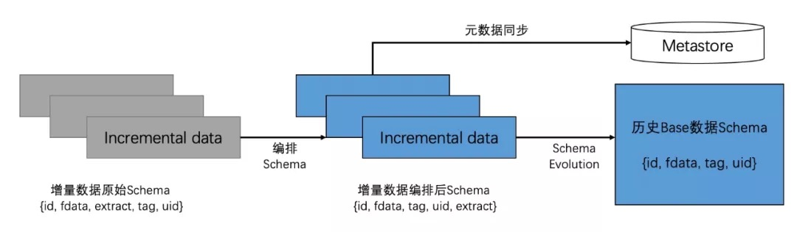
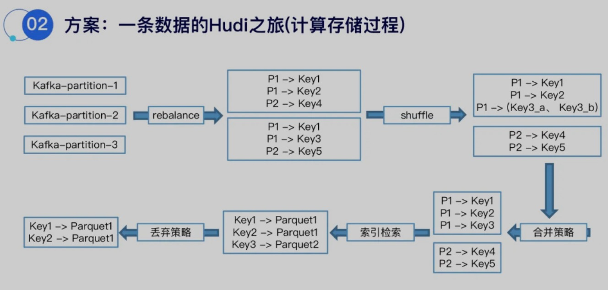
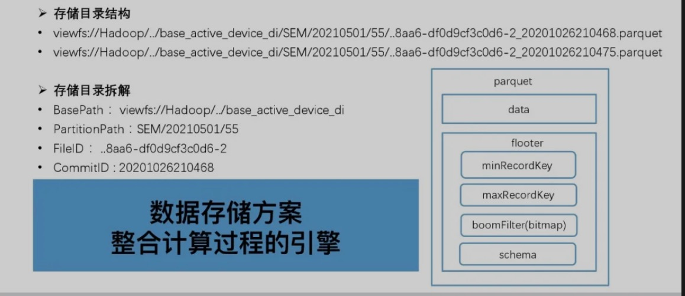
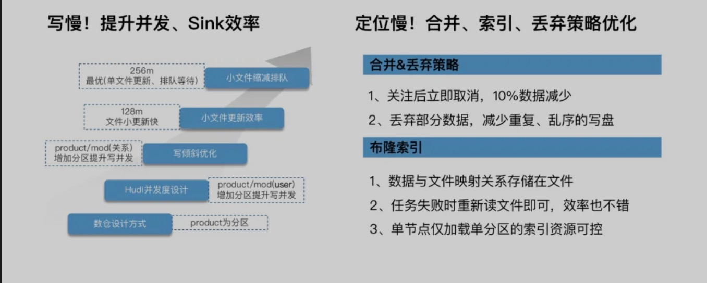

# hudi解决的问题

## schema增量字段位置乱序对齐方案

* 基于hudi携带的schema evolution可以解决历史数据base schema从(id、age、name)变更为(id,sex,age,name)这种乱序schema的情况。



## 一条数据进入Hudi的流程





## 流量毛刺问题

### 集中毛刺更新

#### 离线架构存在的问题

1. 数据峰值任务处理周期长、引起时效性报警。
2. 数据量持续变大引起GC严重，任务OOM问题。
3. 峰值持续时间长、造成数据积压，失败的任务重启失败。

#### Hudi解决方式



## hudi实践

### 参数设置

1. 0.8.0版本写Hudi重试失败导致数据丢失风险。解决办法：`hoodie.datasource.write.streaming.ignore.failed.batch`设置为false，不然Task会间隔`hoodie.datasource.write.streaming.retry.interval.ms`(默认2000)重试`hoodie.datasource.write.streaming.retry.count`(默认3)
2. 根据业务场景合理设置保留版本数对应参数为`hoodie.keep.min.commits`、`hoodie.keep.max.commits`调大cleanup retention版本数对应参数为`hoodie.cleaner.commits.retained`
3. 0.8.0版本Upsert模式下数据丢失问题。解决办法：`hoodie.datasource.write.insert.drop.duplicates`设置为false，这个参数会将已经存在index的record丢弃，如果存在update的record会被丢弃
4. Spark读取hudi可能会存在path not exists的问题，这个是由于cleanup导致的，解决办法：调整文件版本并进行重试读取

### 部分更新

* Hudi中默认只支持覆盖更新，采集端点上报的数据不可能包含完整的业务对象，如用户年龄的增长，在上报时只会包含一个字段的信息

```json
{
  "id": 123,
  "ts": 1435290195610,
  "data": {
    "age": 25
  }
}
```

* 这就需要先找出 rowkey=123 的数据内容，并与待更新内容进行合并后再写入。合并时如果待写入数据的字段不为空，那么进行归并。Hudi默认采用 `OverwriteWithLatestAvroPayload` 的 `combineAndGetUpdateValue` 方法,这样会导致如果写入的值为null的话会覆盖掉历史数据。
* 可以采用`OverwriteNonDefaultsWithLatestAvroPayload`这样空值不会进行覆盖，如果真的希望将某个字段更新为空值，那么使用 `OverwriteNonDefaultsWithLatestAvroPayload` 是无法实现的。
