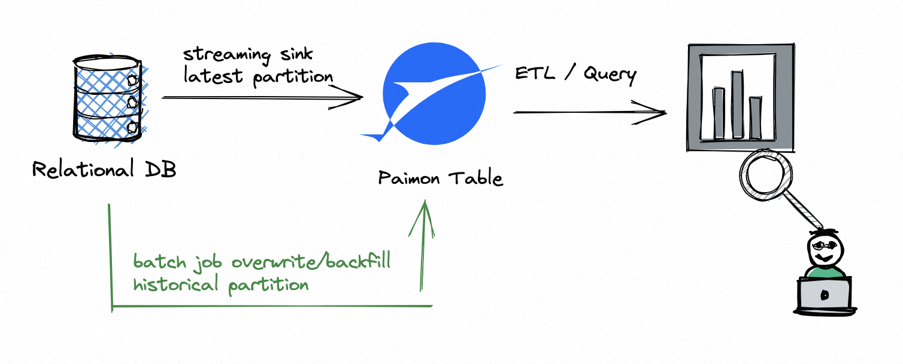

# System Table

## 表指定的系统表

* 表指定的系统表包含每个表的元数据和信息，例如创建的快照和正在使用的options。用户可以通过批量查询访问系统表。当前Flink、Spark、Trino和StarRocks都支持查询系统表:

```sql
-- spark sql里需要指定``查询系统表，Flink中非系统关键字无需``,建议查询系统表统一加上``
SELECT * FROM my_catalog.my_db.`my_table$snapshots`;
```

### Snapshots表

* 可以通过snapshot表来查询snapshot的历史信息，包含这个snapshot的记录条数

```sql
SELECT * FROM `test1$snapshots`;

/*
+----+----------------------+----------------------+--------------------------------+----------------------+--------------------------------+-------------------------+--------------------------------+--------------------------------+--------------------------------+----------------------+----------------------+------------------------+----------------------+
| op |          snapshot_id |            schema_id |                    commit_user |    commit_identifier |                    commit_kind |             commit_time |             base_manifest_list |            delta_manifest_list |        changelog_manifest_list |   total_record_count |   delta_record_count | changelog_record_count |            watermark |
+----+----------------------+----------------------+--------------------------------+----------------------+--------------------------------+-------------------------+--------------------------------+--------------------------------+--------------------------------+----------------------+----------------------+------------------------+----------------------+
| +I |                    1 |                    0 | b37669f9-b10c-4cef-a93c-281... |  9223372036854775807 |                         APPEND | 2024-07-25 19:32:15.142 | manifest-list-ad2de2e4-0128... | manifest-list-ad2de2e4-0128... |                         <NULL> |                    1 |                    1 |                      0 | -9223372036854775808 |
| +I |                    2 |                    0 | 531d4222-ab99-4e9b-a26a-22d... |  9223372036854775807 |                         APPEND | 2024-07-31 19:28:36.812 | manifest-list-4f384451-97e9... | manifest-list-4f384451-97e9... |                         <NULL> |                    2 |                    1 |                      0 | -9223372036854775808 |
| +I |                    3 |                    0 | 5bc607f6-14a6-451f-9711-48c... |  9223372036854775807 |                         APPEND | 2024-07-31 19:29:02.977 | manifest-list-3ce8f366-6bba... | manifest-list-3ce8f366-6bba... |                         <NULL> |                    3 |                    1 |                      0 | -9223372036854775808 |
| +I |                    4 |                    0 | 20ed6d5c-fb41-4579-b198-6d5... |  9223372036854775807 |                         APPEND | 2024-07-31 20:40:39.784 | manifest-list-096a31fc-4300... | manifest-list-096a31fc-4300... |                         <NULL> |                    4 |                    1 |                      0 | -9223372036854775808 |
| +I |                    5 |                    0 | be7d020a-03c1-43f1-a57e-171... |  9223372036854775807 |                        COMPACT | 2024-08-05 19:51:19.601 | manifest-list-f00239a5-35db... | manifest-list-f00239a5-35db... |                         <NULL> |                    1 |                   -3 |                      0 | -9223372036854775808 |
+----+----------------------+----------------------+--------------------------------+----------------------+--------------------------------+-------------------------+--------------------------------+--------------------------------+--------------------------------+----------------------+----------------------+------------------------+----------------------+
*/
```

### Schemas表

* 可以通过schemas表查询该表的历史的schema

```sql
SELECT * FROM `test1$schemas`;
/*
+----+----------------------+--------------------------------+--------------------------------+--------------------------------+--------------------------------+--------------------------------+-------------------------+
| op |            schema_id |                         fields |                 partition_keys |                   primary_keys |                        options |                        comment |             update_time |
+----+----------------------+--------------------------------+--------------------------------+--------------------------------+--------------------------------+--------------------------------+-------------------------+
| +I |                    0 | [{"id":0,"name":"id","type"... |                             [] |                         ["id"] |                             {} |                                | 2024-07-25 19:32:05.460 |
+----+----------------------+--------------------------------+--------------------------------+--------------------------------+--------------------------------+--------------------------------+-------------------------+
*/
```

* 可以join snapshot表和schema表以获得给定snapshot的字段。

```sql
SELECT s.snapshot_id, t.schema_id, t.fields 
    FROM `test1$snapshots` s JOIN `test1$schemas` t 
    ON s.schema_id=t.schema_id where s.snapshot_id=5;
```

### Options表

* 查询表的配置信息，这些信息是从DDL中通过options指定的。未显示的选项将是默认值

```sql
SELECT * FROM `test1$options`;
/*
+------------------------+--------------------+
|         key            |        value       |
+------------------------+--------------------+
| snapshot.time-retained |         5 h        |
+------------------------+--------------------+
1 rows in set
*/
```

### Audit log表

* 如果需要audit表的变更日志，可以使用`audit_log`系统表。通过`audit_log`表，可以在获取表的增量数据时获取`rowkind`列。可以使用该列进行过滤和其他操作，以完成审计。
* rowkind有四个值:
  * `+I`: 插入操作
  * `-U`: 更新操作，具有更新的行的前一个内容
  * `+U`: 更新操作，具有更新的行的新内容
  * `-D`: 删除操作

```sql
SELECT * FROM `test1$audit_log`;

/*
+------------------+-----------------+-----------------+
|     rowkind      |     column_0    |     column_1    |
+------------------+-----------------+-----------------+
|        +I        |      ...        |      ...        |
+------------------+-----------------+-----------------+
|        -U        |      ...        |      ...        |
+------------------+-----------------+-----------------+
|        +U        |      ...        |      ...        |
+------------------+-----------------+-----------------+
3 rows in set
*/
```

### Read-optimized表

*  如果需要极高的读取性能，并且可以接受读取稍旧的数据，可以使用`ro`(读取优化)系统表。读优化系统表通过只扫描不需要合并的文件来提高读性能。
* 对于主键表，`ro`系统表只扫描最顶层的文件。也就是说，每个`ro`系统表只产生最近一次完全compaction的结果。

> 不同的bucket可能在不同的时间执行full compaction，因此不同的键值可能来自不同的快照。

```sql
SELECT * FROM `test1$ro`;
```

### Files表

* 查询指定快照表的文件

```sql
-- 查询最新快照文件
SELECT * FROM `test1$files`;
/*
+-----------+--------+--------------------------------+-------------+-----------+-------+--------------+--------------------+---------+---------+-------------------+-----------------+-----------------+---------------------+---------------------+-------------------------+
| partition | bucket |                      file_path | file_format | schema_id | level | record_count | file_size_in_bytes | min_key | max_key | null_value_counts | min_value_stats | max_value_stats | min_sequence_number | max_sequence_number |           creation_time |
+-----------+--------+--------------------------------+-------------+-----------+-------+--------------+--------------------+---------+---------+-------------------+-----------------+-----------------+---------------------+---------------------+-------------------------+
|        [] |      0 | data-c3270823-5cbc-4656-9e4... |     parquet |         0 |     5 |            1 |               1004 |     [1] |     [1] |    {id=0, name=0} |  {id=1, name=1} |  {id=1, name=1} |                   3 |                   3 | 2024-08-05 19:51:19.370 |
+-----------+--------+--------------------------------+-------------+-----------+-------+--------------+--------------------+---------+---------+-------------------+-----------------+-----------------+---------------------+---------------------+-------------------------+
1 row in set (3.55 seconds)
*/
-- 查询指定快照文件
SELECT * FROM `test1$files` /*+ OPTIONS('scan.snapshot-id'='1') */;
/*
+-----------+--------+--------------------------------+-------------+-----------+-------+--------------+--------------------+---------+---------+-------------------+------------------+------------------+---------------------+---------------------+-------------------------+
| partition | bucket |                      file_path | file_format | schema_id | level | record_count | file_size_in_bytes | min_key | max_key | null_value_counts |  min_value_stats |  max_value_stats | min_sequence_number | max_sequence_number |           creation_time |
+-----------+--------+--------------------------------+-------------+-----------+-------+--------------+--------------------+---------+---------+-------------------+------------------+------------------+---------------------+---------------------+-------------------------+
|        [] |      0 | data-7c3ab572-173f-4b0c-8e7... |     parquet |         0 |     0 |            1 |               1018 |     [1] |     [1] |    {id=0, name=0} | {id=1, name=hsm} | {id=1, name=hsm} |                   0 |                   0 | 2024-07-25 19:32:15.090 |
+-----------+--------+--------------------------------+-------------+-----------+-------+--------------+--------------------+---------+---------+-------------------+------------------+------------------+---------------------+---------------------+-------------------------+
1 row in set (0.97 seconds)
*/
```

### Tags表

* 可以查询对应表的tag的历史信息，查看tag对应的快照

```sql
SELECT * FROM `test1$tags`;
/*
+----------+-------------+-----------+-------------------------+--------------+-------------+---------------+
| tag_name | snapshot_id | schema_id |             commit_time | record_count | create_time | time_retained |
+----------+-------------+-----------+-------------------------+--------------+-------------+---------------+
|   my_tag |           1 |         0 | 2024-07-25 19:32:15.142 |            1 |      <NULL> |        <NULL> |
| 20240731 |           3 |         0 | 2024-07-31 19:29:02.977 |            3 |      <NULL> |        <NULL> |
| 20240730 |           2 |         0 | 2024-07-31 19:28:36.812 |            2 |      <NULL> |        <NULL> |
| 20240729 |           1 |         0 | 2024-07-25 19:32:15.142 |            1 |      <NULL> |        <NULL> |
+----------+-------------+-----------+-------------------------+--------------+-------------+---------------+
4 rows in set (1.09 seconds)
*/
```

### Branches表

```sql
SELECT * FROM `test1$branches`;
/*
+----------------------+---------------------------+--------------------------+-------------------------+
|          branch_name |          created_from_tag |    created_from_snapshot |             create_time |
+----------------------+---------------------------+--------------------------+-------------------------+
|              branch1 |                    tag1   |                        2 | 2024-07-18 20:31:39.084 |
|              branch2 |                    tag2   |                        5 | 2024-07-18 21:11:14.373 |
+----------------------+---------------------------+--------------------------+-------------------------+
2 rows in set
*/
```

### Consumers表

* 查询包含下一个快照的所有消费者。

```sql
SELECT * FROM `test1$consumers`;
/*
+-------------+------------------+
| consumer_id | next_snapshot_id |
+-------------+------------------+
|         id1 |                1 |
|         id2 |                3 |
+-------------+------------------+
2 rows in set
*/
```

### Manifests Table

* 查询当前表的最新快照或指定快照中包含的所有manifest文件。

```sql
SELECT * FROM `test1$manifests`;

/*
+--------------------------------+-----------+-----------------+-------------------+-----------+
|                      file_name | file_size | num_added_files | num_deleted_files | schema_id |
+--------------------------------+-----------+-----------------+-------------------+-----------+
| manifest-802f8afa-28f8-457a... |      1866 |               1 |                 0 |         0 |
| manifest-ffced53d-291c-45fc... |      1867 |               1 |                 0 |         0 |
| manifest-c22f5bde-2682-4d63... |      1866 |               1 |                 0 |         0 |
| manifest-508bc98e-0623-4ffc... |      1863 |               1 |                 0 |         0 |
| manifest-93269eec-b278-4fd6... |      2069 |               1 |                 4 |         0 |
+--------------------------------+-----------+-----------------+-------------------+-----------+
5 rows in set (0.93 seconds)
*/

-- 查询指定快照
SELECT * FROM `test1$manifests` /*+ OPTIONS('scan.snapshot-id'='1') */;
/*
+--------------------------------+-----------+-----------------+-------------------+-----------+
|                      file_name | file_size | num_added_files | num_deleted_files | schema_id |
+--------------------------------+-----------+-----------------+-------------------+-----------+
| manifest-802f8afa-28f8-457a... |      1866 |               1 |                 0 |         0 |
+--------------------------------+-----------+-----------------+-------------------+-----------+
1 row in set (0.98 seconds)
*/
```

### Aggregation fields表

* 通过Aggregation fields表可以查询该表的历史聚合情况。

```sql
SELECT * FROM `test1$aggregation_fields`;

/*
+------------+-----------------+--------------+--------------------------------+---------+
| field_name |      field_type |    function  |               function_options | comment |
+------------+-----------------+--------------+--------------------------------+---------+
| product_id | BIGINT NOT NULL |           [] |                             [] |  <NULL> |
|      price |             INT | [true,count] | [fields.price.ignore-retrac... |  <NULL> |
|      sales |          BIGINT |        [sum] | [fields.sales.aggregate-fun... |  <NULL> |
+------------+-----------------+--------------+--------------------------------+---------+
3 rows in set
*/
```

### Partitions表

* 通过partitions表可以查看当前表所有分区

```sql
SELECT * FROM `test1$$partitions`;

/*
+---------------+----------------+--------------------+--------------------+------------------------+
|  partition    |   record_count |  file_size_in_bytes|          file_count|        last_update_time|
+---------------+----------------+--------------------+--------------------+------------------------+
|  [1]          |           1    |             645    |                1   | 2024-06-24 10:25:57.400|
+---------------+----------------+--------------------+--------------------+------------------------+
*/
```

## 全局System Table

* 全局系统表包含当前paimon存在的所有表的统计信息。通过一下方式访问全局系统表

```sql
USE sys;
SHOW TABLES;
+----------------------+
|           table name |
+----------------------+
|    all_table_options |
|      catalog_options |
|   sink_table_lineage |
| source_table_lineage |
+----------------------+
4 rows in set
```

### All Options Table

* 这个表类似于options表，它会显示全部db的全部paimon表的options

```sql
SELECT * FROM sys.all_table_options;

/*
+---------------+--------------------------------+--------------------------------+------------------+
| database_name |                     table_name |                            key |            value |
+---------------+--------------------------------+--------------------------------+------------------+
|         my_db |                    Orders_orc  |                         bucket |               -1 |
|         my_db |                        Orders2 |                         bucket |               -1 |
|         my_db |                        Orders2 |               sink.parallelism |                7 |
|         my_db2|                      OrdersSum |                         bucket |                1 |
+---------------+--------------------------------+--------------------------------+------------------+
7 rows in set
*/
```

### Catalog Options Table

```sql
SELECT * FROM sys.catalog_options;

/*
+-----------+---------------------------+
|       key |                     value |
+-----------+---------------------------+
| warehouse | hdfs:///path/to/warehouse |
+-----------+---------------------------+
1 rows in set
*/
```

# Write Performance

* Paimon的写入性能和Checkpoint有关，通过Checkpoint的相关配置可以提升paimon写吞吐：
  * 增大checkpoint的间隔（`execution.checkpointing.interval`），增大最大并行checkpoint个数为3（`execution.checkpointing.max-concurrent-checkpoints`），或者使用批模式写。
  * 增大`write-buffer-size`
  * 开启`write-buffer-spillable`
  * 使用固定桶模式，请重新调整桶号。
* 参数 `'changelog-producer' = 'lookup' 或 'full-compaction'`, 和参数 `'full-compaction.delta-commits'`对写入性能十分影响，如果使用快照 /完整同步阶段，则可以删除这些参数，然后在增量阶段再次启用它们。
* 如果发现运行的作业呈现锯齿状背压情况，可以尝试开启异步compaction（[Asynchronous Compaction](https://paimon.apache.org/docs/master/maintenance/write-performance/#asynchronous-compaction)）

## Parallelism

* 建议sink的并行度小于等于桶数，最好等于桶数。

| Option           | Required | Default | Type    | Description                                                  |
| :--------------- | :------- | :------ | :------ | :----------------------------------------------------------- |
| sink.parallelism | No       | (none)  | Integer | 定义sink operator的并行度，默认情况，与sink operator上游operator保持一致。 |

## Local Merging

* 如果写入paimon的任务受到主键导致的数据倾斜（存在热点key问题），可以通过设置`'local-merge-buffer-size'`,输入的记录在被bucket重新shuffle并写入sink之前就会被缓冲和合并，当存在热点key时这有助于很大的缓解热key问题。
* 缓冲区满时将刷新，默认情况下建议`'local-merge-buffer-size'`配置从`64m`开始增大，Flink CDC暂时不支持本地合并。

## File Format

* 如果想要最大的compaction性能，建议使用AVRO存储格式
  * **优点：** 其可以实现高写吞吐量和compaction性能。
  * **缺点：** 正常分析查询将会很慢，AVRO是行存储，它的最大问题是它没有查询projection。例如，如果表有100列，但只查询几列，对于行存来说需要就需要查询全部列的IO。此外，压缩效率会降低，存储成本会增加。
* 配置文件存储格式为行存：

```shell
file.format = avro
#  采集行存储的统计信息有点昂贵，建议关闭统计信息。
metadata.stats-mode = none
```

* 通过 `'file.format.per.level' = '0:avro,1:avro'`配置，可以指定前2层存储格式为avro。

## File Compression

* 默认情况下，Paimon使用`zstd`压缩第一层数据文件，可以通过下述参数修改
  * `'file.compression.zstd-level'`: 默认情况为1。为了获得更高的压缩率，可以将其配置为9，但是读写速度会显著降低。

## 稳定性

* 如果bucket或资源过少，full compaction可能导致checkpoint超时，Flink的默认checkpoint超时时间为10分钟，可以调大checkpoint超时时间：

```shell
execution.checkpointing.timeout = 60 min
```

## 初始化写操作

* 在初始化写操作时，桶的写入器需要读取所有的历史文件。如果这里存在瓶颈(例如，同时写入大量分区)，可以使用`write-manifest-cache`来缓存读取的manifest数据，以加速初始化。

## Write Memory

* 在Paimon中，占用内存的地方主要有三个：
  * **写入器的内存缓冲区** ，由单个任务的所有写入器共享和抢占。这个内存值可以通过`write-buffer-size`表属性来调整。
  * **合并多个sorted runs以进行compaction时消耗的内存**。可以通过`num-sorted-run.compaction-trigger`进行调整，以更改要合并的sorted runs的数量。
  * 如果行非常大，一次读取太多行数据将在进行compaction时消耗大量内存。减少`read.batch-size`配置可以减轻这种情况的影响。
  * **写列式ORC文件所消耗的内存**。减少`orc.write.batch-size`配置可以减少ORC格式的内存消耗。
  * 如果在写任务中动态compaction文件，那么某些大列的dictionary在compaction过程中会大量消耗内存
    * 禁用parquet格式所有dictionary编码，配置`'parquet.enable.dictionary'= 'false'`
    * 禁用ORC格式所有dictionary编码，配置`orc.dictionary.key.threshold='0'`,另外设置`orc.column.encoding.direct='field1,field2'`可以关闭指定列的dictionary编码。
* 如果不使用Flink状态，可以通过以下参数降低manged内存

```shell
taskmanager.memory.managed.size=1m
```

* 或者可以通过以下参数，使用managed内存作为写缓冲区，防止OOM

```shell
sink.use-managed-memory-allocator=true
```

## Commit Memory

* 如果写入表的数据量巨大，commiter节点可能会使用大内存，如果内存太小，可能会发生OOM。在这种情况下，需要增加Committer堆内存，如果统一增加Flink的TaskManager的内存，这可能会导致内存浪费，可以通过以下配置管理Commiter内存：
  * 配置Flink配置`cluster.fine-grained-resource-management.enabled: true`（Flink1.18之后默认为true）
  * 配置Paimon表参数`sink.committer-memory`,例如300 MB，取决于TaskManger大小。(也支持`sink.committer-cpu`)

# Dedicated Compaction

* Paimon的快照管理支持多个写入器的写入。

> 对于类似于S3的对象存储，因为不支持"RENAME"语义，所以需要配置Hive metastore并且配置catalog的'lock.enabled'为true

* 默认情况Paimon支持并发写入不同分区，推荐的模式是流作业将记录写入Paimon的最新分区;同时批处理作业(覆盖)将记录写入历史分区。



* 如果需要多个写入器将记录写入同一个分区，情况就会稍微复杂一些。如果不想使用UNION ALL，有多个流作业将记录写入"partial-update"Paimon表。

## Dedicated Compaction Job

* 默认情况下，Paimon写入器将在写入记录期间根据需要执行compaction，大多数情况下没什么问题。
* Compaction将会标记一些数据文件为"deleted"(不是真正的删除，而是通过快照过期方式清理数据)。如果多个写入器标记这些文件，则在提交更改时将发生冲突。Paimon将会动态的解决冲突，但是可能会导致任务重启。
* 为了避免这些缺点，用户还可以选择跳过写入器中的Compaction，并运行专门的Compaction作业。由于Compaction只由专门的作业执行，因此写入器可以不暂停地持续写入记录，并且不会发生冲突。配置后台异步Compaction作业需要将Paimon以下属性设置为true:

| Option     | Required | Default | Type    | Description                                                  |
| :--------- | :------- | :------ | :------ | :----------------------------------------------------------- |
| write-only | No       | false   | Boolean | 如果设置为true，Compaction和snapshot过期将会被跳过，这个配置依赖于后台Compact任务 |

* 启动一个后台Compaction任务：

```sql
-- 通过flink run启动
<FLINK_HOME>/bin/flink run \
    /path/to/paimon-flink-action-0.9-SNAPSHOT.jar \
    compact \
    --warehouse <warehouse-path> \
    --database <database-name> \ 
    --table <table-name> \
    [--partition <partition-name>] \
    [--table_conf <table_conf>] \
    [--catalog_conf <paimon-catalog-conf> [--catalog_conf <paimon-catalog-conf> ...]]
    
-- 通过flink sql方式
-- compact table
CALL sys.compact(`table` => 'default.T');

-- compact table with options
CALL sys.compact(`table` => 'default.T', `options` => 'sink.parallelism=4');

-- compact table partition
CALL sys.compact(`table` => 'default.T', `partitions` => 'p=0');

-- compact table partition with filter
CALL sys.compact(`table` => 'default.T', `where` => 'dt>10 and h<20');
```

## Database Compaction Job

* 通过以下SQL调用Paimon内置Procedures

```sql
CALL sys.compact_database('includingDatabases')

CALL sys.compact_database('includingDatabases', 'mode')

CALL sys.compact_database('includingDatabases', 'mode', 'includingTables')

CALL sys.compact_database('includingDatabases', 'mode', 'includingTables', 'excludingTables')

CALL sys.compact_database('includingDatabases', 'mode', 'includingTables', 'excludingTables', 'tableOptions')

-- example
CALL sys.compact_database('db1|db2', 'combined', 'table_.*', 'ignore', 'sink.parallelism=4')
```

## Sort Compact

* 如果Paimon配置了动态bucket主键或者是append表，可以使用指定的列排序触发Compaction，以加快查询速度。

```sql
-- sort compact table
CALL sys.compact(`table` => 'default.T', order_strategy => 'zorder', order_by => 'a,b')
```

## Historical Partition Compact

* 对于一段时间没有收到任何新数据的分区，可以执行以下命令提交压缩作业。这些分区中的小文件将被完全压缩，目前仅支持批处理模式

### For Table

```sql
-- history partition compact table
CALL sys.compact(`table` => 'default.T', 'partition_idle_time' => '1 d')
```

### For Databases

```sql
-- history partition compact table语法
CALL sys.compact_database('includingDatabases', 'mode', 'includingTables', 'excludingTables', 'tableOptions', 'partition_idle_time')
-- history partition compact table
CALL sys.compact_database('test_db', 'combined', '', '', '', '1 d')
```

# Manage Snapshots

## Expire Snapshots

* Paimon写入器每次提交生成一个或两个快照。每个快照可能会添加一些新的数据文件或将一些旧的数据文件标记为已删除。但是，标记的数据文件并没有真正被删除，因为Paimon还支持time traveling到更早的快照。只有当快照过期时才会删除。
* 目前，Paimon写入器在提交新更改时自动执行过期。通过过期快照，可以删除不再使用的旧数据文件和元数据文件，释放磁盘空间。
* 快照过期由以下表属性控制：

| Option                         | Required | Default           | Type     | Description                                        |
| :----------------------------- | :------- | :---------------- | :------- | :------------------------------------------------- |
| snapshot.time-retained         | No       | 1 h               | Duration | 完成快照保留的最大时间                             |
| snapshot.num-retained.min      | No       | 10                | Integer  | 完成快照保留最小数量，必须大于等于1                |
| snapshot.num-retained.max      | No       | Integer.MAX_VALUE | Integer  | 完成快照保留最大数量，必须大于等于最小快照保留数量 |
| snapshot.expire.execution-mode | No       | sync              | Enum     | 指定执行的过期模式                                 |
| snapshot.expire.limit          | No       | 10                | Integer  | 一次允许过期的最大快照数。                         |

* 当快照的数量小于`snapshot.num-retained.min`时，没有快照会过期(即使`snapshot.time-retained`配置满足)，`snapshot.num-retained.max`和`snapshot.time-retained`用于控制快照过期，直到剩余的快照满足条件。
* 以下案例为快照过期详情(`snapshot.num-retained.min` = 2, `snapshot.time-retained` = 1h, `snapshot.num-retained.max` = 5):

| New Snapshots                   | All snapshots after expiration check                         | explanation                                                  |
| :------------------------------ | :----------------------------------------------------------- | :----------------------------------------------------------- |
| (snapshots-1, 2023-07-06 10:00) | (snapshots-1, 2023-07-06 10:00)                              | No snapshot expired                                          |
| (snapshots-2, 2023-07-06 10:20) | (snapshots-1, 2023-07-06 10:00) (snapshots-2, 2023-07-06 10:20) | No snapshot expired                                          |
| (snapshots-3, 2023-07-06 10:40) | (snapshots-1, 2023-07-06 10:00) (snapshots-2, 2023-07-06 10:20) (snapshots-3, 2023-07-06 10:40) | No snapshot expired                                          |
| (snapshots-4, 2023-07-06 11:00) | (snapshots-1, 2023-07-06 10:00) (snapshots-2, 2023-07-06 10:20) (snapshots-3, 2023-07-06 10:40) (snapshots-4, 2023-07-06 11:00) | No snapshot expired                                          |
| (snapshots-5, 2023-07-06 11:20) | (snapshots-2, 2023-07-06 10:20) (snapshots-3, 2023-07-06 10:40) (snapshots-4, 2023-07-06 11:00) (snapshots-5, 2023-07-06 11:20) | snapshot-1 was expired because the condition `snapshot.time-retained` is not met |
| (snapshots-6, 2023-07-06 11:30) | (snapshots-3, 2023-07-06 10:40) (snapshots-4, 2023-07-06 11:00) (snapshots-5, 2023-07-06 11:20) (snapshots-6, 2023-07-06 11:30) | snapshot-2 was expired because the condition `snapshot.time-retained` is not met |
| (snapshots-7, 2023-07-06 11:35) | (snapshots-3, 2023-07-06 10:40) (snapshots-4, 2023-07-06 11:00) (snapshots-5, 2023-07-06 11:20) (snapshots-6, 2023-07-06 11:30) (snapshots-7, 2023-07-06 11:35) | No snapshot expired                                          |
| (snapshots-8, 2023-07-06 11:36) | (snapshots-4, 2023-07-06 11:00) (snapshots-5, 2023-07-06 11:20) (snapshots-6, 2023-07-06 11:30) (snapshots-7, 2023-07-06 11:35) (snapshots-8, 2023-07-06 11:36) | snapshot-3 was expired because the condition `snapshot.num-retained.max` is not met |

* **注意** ，保留时间过短或保留数量过少可能导致以下问题：
  * 批量查询无法找到该文件。例如，表比较大，批处理查询需要10分钟才能读取，但是10分钟前的快照过期，此时批处理查询将读取已删除的快照。
  * 重新启动表文件上的流式读取作业失败。当作业重新启动时，它所记录的快照可能已经过期。(您可以使用消费者Id来保护流读取在快照过期的小保留时间，被消费的快照即使过期也不会被删除)。
* 默认情况下，paimon会**同步删除过期快照**。当需要删除的文件太多时，它们可能不会被快速删除，并向上游operator进行反压。为了避免这种情况，可以设置`snapshot.expire.execution-mode`为`async`来避免。

## Rollback to Snapshot

```java
// flink run方式
<FLINK_HOME>/bin/flink run \
    /path/to/paimon-flink-action-0.9-SNAPSHOT.jar \
    rollback_to \
    --warehouse <warehouse-path> \
    --database <database-name> \ 
    --table <table-name> \
    --version <snapshot-id> \
    [--catalog_conf <paimon-catalog-conf> [--catalog_conf <paimon-catalog-conf> ...]]
// java api
import org.apache.paimon.table.Table;

public class RollbackTo {

    public static void main(String[] args) {
        // before rollback:
        // snapshot-3
        // snapshot-4
        // snapshot-5
        // snapshot-6
        // snapshot-7
      
        table.rollbackTo(5);
        
        // after rollback:
        // snapshot-3
        // snapshot-4
        // snapshot-5
    }
}
// spark
CALL rollback(table => 'test.T', version => '2');
```

## 清理孤儿文件

* 只有快照过期时才会物理删除Paimon文件。但是，在删除文件时可能会发生一些意想不到的错误，因此可能存在未被Paimon快照使用的文件(所谓的孤立文件)。您可以提交一个删除孤立文件作业来清理它们

```sql
-- spark/Flink SQL
CALL sys.remove_orphan_files(table => "my_db.my_table", [older_than => "2023-10-31 12:00:00"])

CALL sys.remove_orphan_files(table => "my_db.*", [older_than => "2023-10-31 12:00:00"])

-- flink run action
<FLINK_HOME>/bin/flink run \
    /path/to/paimon-flink-action-0.9-SNAPSHOT.jar \
    remove_orphan_files \
    --warehouse <warehouse-path> \
    --database <database-name> \ 
    --table <table-name> \
    [--older_than <timestamp>] \
    [--dry_run <false/true>] 
```

# Rescale Bucket

* 由于bucket的数量极大地影响了性能，因此Paimon允许用户通过Alter Table命令来调整存储桶号，并通过**INSERT OVERWRITE**而无需重新创建表/分区来重新组织数据布局。执行覆盖作业时，该框架将使用旧的存储桶号自动扫描数据，并根据当前的存储桶号哈希记录。

## Rescale Overwrite

```sql
-- rescale number of total buckets
ALTER TABLE table_identifier SET ('bucket' = '...');

-- reorganize data layout of table/partition
INSERT OVERWRITE table_identifier [PARTITION (part_spec)]
SELECT ... 
FROM table_identifier
[WHERE part_spec];
```

* **ALTER TABLE**只修改表的元数据，不会重新组织或重新格式化现有数据。重组现有数据必须通过**INSERT OVERWRITE**来实现。
* 重新调整bucket数不会影响读作业和正在运行的写作业。
* 一旦更改了存储bucket数，任何新调度的**INSERT INTO**作业，如果写入未重组的现有表/分区，将抛出TableException，消息如下：

```text
Try to write table/partition ... with a new bucket num ..., 
but the previous bucket num is ... Please switch to batch mode, 
and perform INSERT OVERWRITE to rescale current data layout first.
```

* 对于分区表，不同的分区可以有不同的bucket数量，例如：

```sql
ALTER TABLE my_table SET ('bucket' = '4');
INSERT OVERWRITE my_table PARTITION (dt = '2022-01-01')
SELECT * FROM ...;
  
ALTER TABLE my_table SET ('bucket' = '8');
INSERT OVERWRITE my_table PARTITION (dt = '2022-01-02')
SELECT * FROM ...;
```

* 在覆盖期内，请确保没有其他作业写入相同的表/分区。

> 注:对于启用日志系统的表(例如:Kafka)，请重新调整topic分区，以保持一致性。

## 使用Case

https://paimon.apache.org/docs/master/maintenance/rescale-bucket/#use-case

# Manage Tags

* Paimon的快照机制可以使用简单的方式查询历史数据，但是在大多数情况下，作业会生成太多快照，并且根据表配置，表将过期旧快照。快照过期会同时删除旧的数据文件，过期快照的历史数据将无法查询。
* 为了解决这个问题，可以根据快照创建tag。tag将维护快照的manifest和数据文件。典型的用法是每天创建标记，然后可以维护每天的历史数据以进行批量读取。

## Automatic Creation

* Paimon支持在写作业中自动创建Tag

### 选择创建模式

* 通过表参数`tag.automatic-creation`配置动态创建Tag模式
  * `process-time`: 基于机器时间创建Tag
  * `watermark`: 根据Sink输入的水印创建TAG。
  * `batch`: 在批处理场景下，当前任务完成后会生成一个标签。

> 如果选择"watermark"，需要指定水印的时区，如果水印不是UTC时区，配置'sink.watermark-time-zone'

### 选择创建周期

* 配置表参数`tag.creation-period`为'daily'`, `'hourly'` and `'two-hours'来指定tag的创建周期，如果需要等待延迟的数据可以配置`'tag.creation-delay'`来指定延迟的间隔

### 选择动态删除Tag的方式

* 配置表参数`'tag.num-retained-max'` 或 `'tag.default-time-retained'`，配置tag保留的最大数量和最大时间，过期的tag将会动态删除

```sql
-- Flink SQL
CREATE TABLE test_batch_tag_table (
    id INT PRIMARY KEY NOT ENFORCED,
    age INT
) WITH (
    'tag.automatic-creation' = 'batch',
    'tag.num-retained-max' = '90'
);

insert into test_batch_tag_table values(2,25);

-- 查询快照
select * from test_batch_tag_table/*+ OPTIONS('scan.tag-name' ='batch-write-2024-08-30')*/;
```

## Create Tags

```sql
# Flink run action
<FLINK_HOME>/bin/flink run \
    /path/to/paimon-flink-action-0.9-SNAPSHOT.jar \
    create_tag \
    --warehouse <warehouse-path> \
    --database <database-name> \ 
    --table <table-name> \
    --tag_name <tag-name> \
    [--snapshot <snapshot_id>] \
    [--time_retained <time-retained>] \
    [--catalog_conf <paimon-catalog-conf> [--catalog_conf <paimon-catalog-conf> ...]]
# java api
import org.apache.paimon.table.Table;

public class CreateTag {

    public static void main(String[] args) {
        Table table = ...;
        table.createTag("my-tag", 1);
        table.createTag("my-tag-retained-12-hours", 1, Duration.ofHours(12));
    }
}
# spark sql
CALL sys.create_tag(table => 'test.t', tag => 'test_tag', snapshot => 2);
# 创建tag保留一天
CALL sys.create_tag(table => 'test.t', tag => 'test_tag', snapshot => 2, time_retained => '1 d');
# 基于最新的快照创建tag
CALL sys.create_tag(table => 'test.t', tag => 'test_tag');
```

## Delete Tags

```java
// java api
import org.apache.paimon.table.Table;

public class DeleteTag {

    public static void main(String[] args) {
        Table table = ...;
        table.deleteTag("my-tag");
    }
}
// spark sql
CALL sys.delete_tag(table => 'test.t', tag => 'test_tag');
```

## Rollback to Tag

* 回滚表到指定tag，所有快照id大于标签的快照和标签都会被删除(数据也会被删除)。

```java
// java api
import org.apache.paimon.table.Table;

public class RollbackTo {

    public static void main(String[] args) {
        // before rollback:
        // snapshot-3 [expired] -> tag3
        // snapshot-4 [expired]
        // snapshot-5 -> tag5
        // snapshot-6
        // snapshot-7
      
        table.rollbackTo("tag3");
        
        // after rollback:
        // snapshot-3 -> tag3
    }
}
// spark sql
CALL sys.rollback(table => 'test.t', version => '2');
```

# Manage Branches

* 在流数据处理中，由于数据的修正可能会影响到现有的数据，因此很难对数据进行修正，并且用户会看到流的临时结果。假设现有工作流正在处理的分支是“main”分支，通过创建自定义数据分支，可以帮助进行测试和数据对现有表上的新作业进行验证，这无需停止现有的读取/写入工作流，无需从主分支复制数据。通过合并或替换分支操作，用户可以完成数据的校正。

## Create Branches

* Paimon支持根据指定的快照或者tag创建分支，或者只是创建一个空分支，这意味着创建的分支的初始状态就像一个空表。

```sql
# Flink SQL
-- 基于tag:batch-write-2024-09-05 创建branch1
CALL sys.create_branch('default.test_batch_tag_table', 'branch1', 'batch-write-2024-09-05');

-- create empty branch named 'branch2'
CALL sys.create_branch('default.test_batch_tag_table', 'branch2');

# Flink Action Jar
<FLINK_HOME>/bin/flink run \
    /path/to/paimon-flink-action-0.9-SNAPSHOT.jar \
    create_branch \
    --warehouse <warehouse-path> \
    --database <database-name> \ 
    --table <table-name> \
    --branch_name <branch-name> \
    [--tag_name <tag-name>] \
    [--catalog_conf <paimon-catalog-conf> [--catalog_conf <paimon-catalog-conf> ...]]
```

## Delete Branches

```sql
# Flink SQL
-- 删除branch2
CALL sys.delete_branch('default.test_batch_tag_table', 'branch2');

# Flink Action Jar
<FLINK_HOME>/bin/flink run \
    /path/to/paimon-flink-action-0.9-SNAPSHOT.jar \
    delete_branch \
    --warehouse <warehouse-path> \
    --database <database-name> \ 
    --table <table-name> \
    --branch_name <branch-name> \
    [--catalog_conf <paimon-catalog-conf> [--catalog_conf <paimon-catalog-conf> ...]]
```

## Read / Write With Branch

* 查询指定分支或者向指定分支写数据

```sql
select * from `test_batch_tag_table$branch_branch2`;
select * from `test_batch_tag_table$branch_branch1` /*+ OPTIONS('consumer-id' = 'myid') */;

-- write to branch 'branch2'
INSERT INTO `test_batch_tag_table$branch_branch2` SELECT * from `test_batch_tag_table$branch_branch1`;
```

## Fast Forward

* 将自定义分支推到`main`分支时将删除在分支初始tag之后创建的所有快照、tag和schema。并将快照、tag和scheam从自定义分支复制到`main分支`。

```sql
# Flink SQL
-- 切换表主分支到branch1
CALL sys.fast_forward('default.test_batch_tag_table', 'branch1');

# Flink Action Jar
<FLINK_HOME>/bin/flink run \
    /path/to/paimon-flink-action-0.9-SNAPSHOT.jar \
    fast_forward \
    --warehouse <warehouse-path> \
    --database <database-name> \ 
    --table <table-name> \
    --branch_name <branch-name> \
    [--catalog_conf <paimon-catalog-conf> [--catalog_conf <paimon-catalog-conf> ...]]
```

### Batch Reading from Fallback Branch

* 设置表参数`scan.fallback-branch`当批处理作业从当前分支读取时，如果分区不存在，读取器将尝试从fallback分支(`scan.fallback-branch`配置的分支)读取该分区。对于流式读作业，目前不支持此特性，并且只会从当前分支生成结果。
* **应用场景**
  * 假设创建了一个按日期分区的Paimon表。有一个长时间运行的流作业，它将记录插入到Paimon中，以便可以及时查询今天的数据。还有一个批处理作业，每天晚上运行，将昨天的更正记录插入到Paimon中，从而保证数据的准确性。
  * 当从这个Paimon表中查询时，首先从批处理作业的结果中读取。但是，如果分区(例如：今天的分区)在其结果中不存在，那么您希望从流作业的结果中读取。在这种情况下，您可以为流作业创建分支，并设置`scan.fallback-branch`为流的分支

```sql
-- create Paimon table
CREATE TABLE T (
    dt STRING NOT NULL,
    name STRING NOT NULL,
    amount BIGINT
) PARTITIONED BY (dt);

-- create a branch for streaming job
CALL sys.create_branch('default.T', 'test');

-- set primary key and bucket number for the branch
ALTER TABLE `T$branch_test` SET (
    'primary-key' = 'dt,name',
    'bucket' = '2',
    'changelog-producer' = 'lookup'
);

-- set fallback branch
ALTER TABLE T SET (
    'scan.fallback-branch' = 'test'
);

-- write records into the streaming branch
INSERT INTO `T$branch_test` VALUES ('20240725', 'apple', 4), ('20240725', 'peach', 10), ('20240726', 'cherry', 3), ('20240726', 'pear', 6);

-- write records into the default branch
INSERT INTO T VALUES ('20240725', 'apple', 5), ('20240725', 'banana', 7);

SELECT * FROM T;
/*
+------------------+------------------+--------+
|               dt |             name | amount |
+------------------+------------------+--------+
|         20240725 |            apple |      5 |
|         20240725 |           banana |      7 |
|         20240726 |           cherry |      3 |
|         20240726 |             pear |      6 |
+------------------+------------------+--------+
*/

-- reset fallback branch
ALTER TABLE T RESET ( 'scan.fallback-branch' );

-- now it only reads from default branch
SELECT * FROM T;
/*
+------------------+------------------+--------+
|               dt |             name | amount |
+------------------+------------------+--------+
|         20240725 |            apple |      5 |
|         20240725 |           banana |      7 |
+------------------+------------------+--------+
*/
```