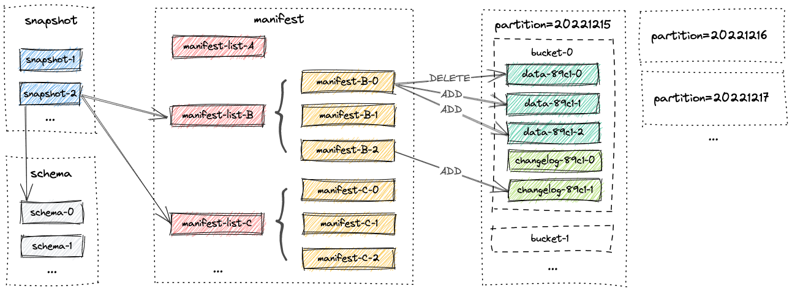
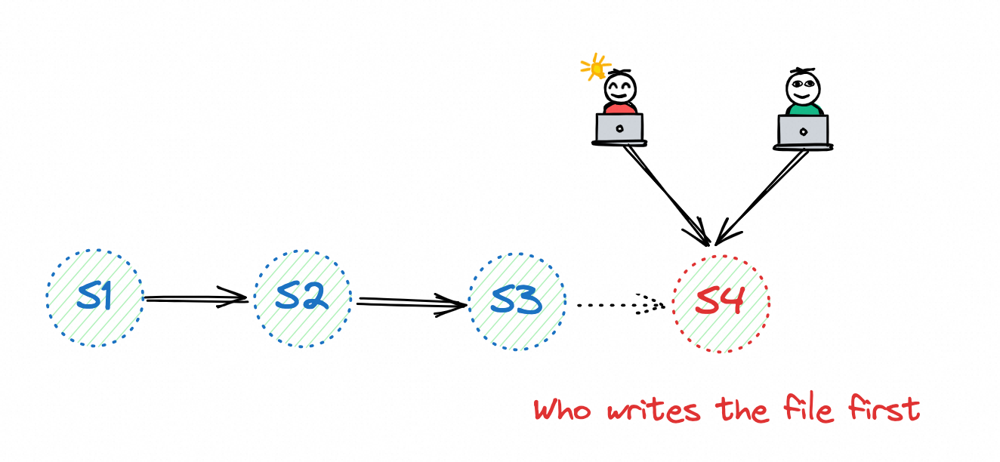
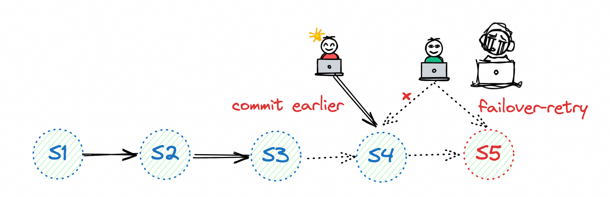

# 基础概念

* Apache Paimon (incubating) 是一项流式数据湖存储技术，可以为用户提供高吞吐、低延迟的数据摄入、流式订阅以及实时查询能力。Paimon 采用开放的数据格式和技术理念，可以与 Apache Flink / Spark / Trino 等诸多业界主流计算引擎进行对接，共同推进 Streaming Lakehouse 架构的普及和发展。
* 作为一种新型的可更新数据湖，Paimon具有以下特点：
  - 大吞吐量的更新数据摄取，同时提供良好的查询性能。
  - 具有主键过滤器的高性能查询，响应时间最快可达到百毫秒级别。
  - 流式读取在 Lake Storage 上可用，Lake Storage 还可以与 Kafka 集成，以提供毫秒级流式读取。

## 文件布局

* 一个paimon标的全部文件存储在一个基础目录里，文件以分层的方式组织。如下图是paimon的文件部署，从Snapshot文件开始，Paimon文件读取器可以递归地访问表中的所有数记录。



* Schema:字段、主键定义、分区键定义和options。
* Snapshot:在某个特定时间点提交的所有数据的入口。
* Manifest list: 包含若干个manifest文件
* Manifest:包含若干data文件和changelog文件
* Data File:包含增量记录
* Changelog File:包含由changelog-producer生成的记录。
* Global Index:bucket或partition的索引
* Data File Index:data文件的索引

```
warehouse
└── default.db
    └── my_table
        ├── bucket-0
        │   └── data-59f60cb9-44af-48cc-b5ad-59e85c663c8f-0.orc
        ├── index
        │   └── index-5625e6d9-dd44-403b-a738-2b6ea92e20f1-0
        ├── manifest
        │   ├── index-manifest-5d670043-da25-4265-9a26-e31affc98039-0
        │   ├── manifest-6758823b-2010-4d06-aef0-3b1b597723d6-0
        │   ├── manifest-list-9f856d52-5b33-4c10-8933-a0eddfaa25bf-0
        │   └── manifest-list-9f856d52-5b33-4c10-8933-a0eddfaa25bf-1
        ├── schema
        │   └── schema-0
        └── snapshot
            ├── EARLIEST
            ├── LATEST
            └── snapshot-1
```

## Schema

* schema文件的版本从0开始，当前保留schema的所有版本。可能存在依赖于旧schema版本的旧文件，因此应该谨慎删除它。schema文件是一个json，包含：
  * fields:数据字段集合，数据字段包含id，name，type，field id被用于支持schema evolution
  * partitionKeys:字段名集合，表的分区定义，不能够修改
  * primaryKeys:字段名集合，表的主键定义，不能够修改
  * options:map<string,string>,无序的，表的配置属性，包括许多功能和优化。

```shell
{
  "version" : 3,
  "id" : 0,
  "fields" : [ {
    "id" : 0,
    "name" : "order_id",
    "type" : "BIGINT NOT NULL"
  }, {
    "id" : 1,
    "name" : "order_name",
    "type" : "STRING"
  }, {
    "id" : 2,
    "name" : "order_user_id",
    "type" : "BIGINT"
  }, {
    "id" : 3,
    "name" : "order_shop_id",
    "type" : "BIGINT"
  } ],
  "highestFieldId" : 3,
  "partitionKeys" : [ ],
  "primaryKeys" : [ "order_id" ],
  "options" : {
    "bucket" : "5"
  },
  "comment" : "",
  "timeMillis" : 1720496663041
}
```

### update schema

* 更新schema应该会生成一个新的schema文件。

```shell
warehouse
└── default.db
    └── my_table
        ├── schema
            ├── schema-0
            ├── schema-1
            └── schema-2
```

* 快照中有一个对schema的引用。数值最高的schema文件通常是最新的schema文件。不能直接删除旧的schema文件，因为可能存在引用旧schema文件的旧数据文件。在读取表时，需要依赖它们进行schema演化读取。

## Snapshot

* 所有snapshot文件都存储在`snapshot`目录下，一个snapshot文件是一个JSON格式的文件，包含关于这个snapshot的基础信息，如下：
  * 使用的schema文件
  * 记录这个snapshot的全部修改的manifest list
* Snapshot捕获表在某个时间点的状态。用户可以通过最新的snapshot访问表的最新数据。通过**time traveling**，用户还可以通过较早的快照访问表的先前状态。
* 每次提交都会生成一个snapshot文件，snapshot文件的版本号从1开始，且必须是连续的。最早和最新是snapshot列表开头和结尾的提示文件，它们可能不准确。当提示文件不准确时，读取将扫描所有snapshot文件以确定开始和结束。

```shell
warehouse
└── default.db
    └── my_table
        ├── snapshot
            ├── EARLIEST
            ├── LATEST
            ├── snapshot-1
            ├── snapshot-2
            └── snapshot-3
```

* 写提交将抢占下一个snapshot id，一旦成功写入snapshot文件，这个提交将是可见的。Snapshot是一个JSON，包含：
  * version: Snapshot file version, current is 3.
  * id: snapshot id, same to file name.
  * schemaId: the corresponding schema version for this commit.
  * baseManifestList: a manifest list recording all changes from the previous snapshots.
  * deltaManifestList: a manifest list recording all new changes occurred in this snapshot.
  * changelogManifestList: a manifest list recording all changelog produced in this snapshot, null if no changelog is produced.
  * indexManifest: a manifest recording all index files of this table, null if no index file.
  * commitUser: usually generated by UUID, it is used for recovery of streaming writes, one stream write job with one user.
  * commitIdentifier: transaction id corresponding to streaming write, each transaction may result in multiple commits for different commitKinds.
  * commitKind: type of changes in this snapshot, including append, compact, overwrite and analyze.
  * timeMillis: commit time millis.
  * totalRecordCount: record count of all changes occurred in this snapshot.
  * deltaRecordCount: record count of all new changes occurred in this snapshot.
  * changelogRecordCount: record count of all changelog produced in this snapshot.
  * watermark: watermark for input records, from Flink watermark mechanism, null if there is no watermark.
  * statistics: stats file name for statistics of this table.

## Manifest Flies

* 全部manifest list和manifest文件都存储在`manifest`目录，一个manifest list是manifest文件名的列表。manifest文件是包含有关LSM data files和changlog files的更改的文件。例如，在相应的snapshot中创建了哪个LSM data file，删除了哪个文件。

### Manifest List

* Manifest list包含若干个manifest文件的元数据，它的名字包含UUID，它是一个avro文件，结构如下：
  * fileName: manifest文件名称
  * fileSize:manifest文件大小
  * numAddedFiles:manifest中添加的文件数量。
  * numDeletedFiles:manifest中删除的文件数量。
  * partitionStats:分区状态，这个manifest中分区字段的最小值和最大值有利于在查询期间跳过某些manifest文件，它是一个SimpleStats。
  * schemaId: 当写入这个manifest文件时候的schema id

### Manifest

* Manifest包含若干data files或changelog files的元数据，它的名字包含UUID，是一个avro文件.文件的更改保存在manifest中，并且可以添加或删除文件。manifest应该是有序的，同一个文件可以被多次添加或删除。最后一个版本应该读一下。这种设计可以使提交更轻，以支持压缩生成的文件删除。这个文件内容是：
  * kind: ADD or DELETE
  * partition:分区描述，一个二进制行
  * bucket: 这个文件的bucket
  * totalBuckets:当写入此文件时，该文件用于bucket更改后的验证。
  * file:数据文件元数据
* data file元数据：
  * fileName: file name.
  * fileSize: file size.
  * rowCount: total number of rows (including add & delete) in this file.
  * minKey: the minimum key of this file.
  * maxKey: the maximum key of this file.
  * keyStats: the statistics of the key.
  * valueStats: the statistics of the value.
  * minSequenceNumber: the minimum sequence number.
  * maxSequenceNumber: the maximum sequence number.
  * schemaId: schema id when write this file.
  * level: level of this file, in LSM.
  * extraFiles: extra files for this file, for example, data file index file.
  * creationTime: creation time of this file.
  * deleteRowCount: rowCount = addRowCount + deleteRowCount.
  * embeddedIndex: if data file index is too small, store the index in manifest.

## Data Files

* data files按分区分组。目前，Paimon支持使用**parqeut(默认)**、**orc**和**avro**作为data files格式。

```shell
part_t
├── dt=20240514
│   └── bucket-0
│       └── data-ca1c3c38-dc8d-4533-949b-82e195b41bd4-0.orc
├── manifest
│   ├── manifest-08995fe5-c2ac-4f54-9a5f-d3af1fcde41d-0
│   ├── manifest-list-51c16f7b-421c-4bc0-80a0-17677f343358-0
│   └── manifest-list-51c16f7b-421c-4bc0-80a0-17677f343358-1
├── schema
│   └── schema-0
└── snapshot
    ├── EARLIEST
    ├── LATEST
    └── snapshot-1
```

### Bucket

* 所有Paimon表的存储都依赖于bucket，data file存储在bucket目录中。在Paimon中各种表类型和bucket之间的关系
  * Primary Key Table:
    * bucket=-1:默认模式，动态桶模式通过索引文件记录键对应的桶。该索引记录了主键的哈希值与桶的对应关系。
    * bucket=10:根据桶键的哈希值(默认为主键)将数据分发到相应的桶中。
  * Append Table:
    * bucket=-1:默认模式，忽略bucket概念，尽管所有数据都写入bucket-0，但读写的并行性是不受限制的。
    * bucket=10:还需要定义bucket-key，根据bucket key的哈希值将数据分发到相应的bucket中。

### Data File

* Data file的名字是`data-${uuid}-${id}.${format}`.对于append-table，文件存储表的数据，而不添加任何新列。但是对于主键表，每一行数据存储额外的系统列
  * `_VALUE_KIND`: 行式被删除或者被添加.类似于Rocksdb，每一行的数据都能够被删除或被添加，它将被用于主键表
  * `_SEQUENCE_NUMBER`: 此数字用于更新期间的比较，确定哪些数据先出现，哪些数据后出现。
  * `_KEY_` 键列的前缀，这是为了避免与表的列冲突。

### Changelog File

* Changelog文件和Data文件完全相同，只对主键表生效。它类似于数据库中的Binlog，记录对表中数据的更改。

## Index File

### Global Index

* 全局索引在索引目录中，目前只有两个地方会使用全局索引
  * bucket = -1 + primary key table: 在动态桶模式下，索引记录主键的哈希值与桶的对应关系，每个桶有一个索引文件。
  * Deletion Vectors: Index存储删除文件，每个bucket都有一个删除文件。

### Data File Index

* 定义`file-index.bloom-filter.columns`，Paimon将为每个文件创建相应的索引文件。如果索引文件太小，它将直接存储在manifest中，或者存储在数据文件的目录中。每个数据文件对应一个索引文件，索引文件有一个单独的文件定义，可以包含不同类型的索引和多个列。

## Partition

* Paimon采用与Apache Hive相同的分区概念来分离数据。分区是一种可选的方法，可以根据**特定列(如日期、城市和部门)的值**将表划分为相关部分。每个表可以**有一个或多个分区键来标识一个特定的分区**。通过分区，用户可以有效地操作表中的记录切片。

## 一致性保证

* Paimon写入器使用2PC自动将一批记录提交到表中。每次提交在提交时最多产生两个快照。它取决于增量写入和压缩策略。如果只执行增量写操作而不触发压缩操作，则只创建增量快照。如果触发了压缩操作，将创建一个增量快照和一个压缩快照。
* 对于任何两个同时修改表的写入器，只要他们不修改同一个分区，他们的提交可以并行进行。如果修改的是同一个分区，则只保证快照隔离。也就是说，最终的表状态可能是两次提交的混合状态，但不会丢失任何更改。

# 并发控制

* Paimon支持对多个并发写作业进行乐观并发。每个作业都以自己的速度写入数据，并在提交时通过应用增量文件(删除或添加文件)基于当前快照生成新的快照。这里可能有两种类型的提交失败如下：
  * **Snapshot conflic:**snapshot ID已经被抢占，该表已从另一个工作中产生了一个新快照。进行重新提交；
  * **Files conflict:**此作业要删除的文件已被其他作业删除。此时，作业只能失败。(对于流作业，它将失败并重新启动，进行一次故障转移)

## Snapshot conflic

* Paimon的snapshot id是唯一的，因此，只要作业将其snapshot文件写入文件系统，就认为写入成功。



* Paimon使用文件系统的**重命名机制来提交快照**，这对HDFS来说是安全的，因为它确保了**事务性和原子性的重命名**。但对于OSS和S3等对象存储，它们的**"RENAME"没有原子语义**。我们需要配置Hive或jdbc元存储，并为目录启用**"lock.enabled"**选项。否则，可能会丢失快照。

## Files conflic

* 当Paimon提交文件删除(这只是一个逻辑删除)时，它会检查与最新快照的冲突。如果存在冲突(这意味着文件在逻辑上已被删除)，它就不能再在此提交节点上继续，因此它只能有意地触发故障转移以重新启动，作业将从文件系统检索最新状态，以期解决此冲突。



* Paimon将确保这里没有数据丢失或重复，但如果两个流作业同时写入并且存在冲突，您将看到它们不断重新启动，这不是一件好事。冲突的本质在于删除文件(逻辑上)，而删除文件是从压缩中诞生的，所以只要我们关闭写作业的压缩(**将write-only设置为true**)，并启动一个单独的作业来做压缩工作即可。

# 快速开始

* Flink1.14之后才支持Table Stroe(现改名为paimon)，下载对应版本的Flink。

## 前置环境

### 下载Paimon所需依赖

* 下载[flink1.16](https://www.apache.org/dyn/closer.lua/flink/flink-1.16.1/flink-1.16.1-bin-scala_2.12.tgz)
* 下载[Paimon](https://repository.apache.org/snapshots/org/apache/paimon/paimon-flink-1.16/0.4-SNAPSHOT/)

```shell
cp paimon-flink-*.jar <FLINK_HOME>/lib/
```

* 下载[flink hadoop](https://repo.maven.apache.org/maven2/org/apache/flink/flink-shaded-hadoop-2-uber/2.8.3-10.0/flink-shaded-hadoop-2-uber-2.8.3-10.0.jar)

```shell
cp flink-shaded-hadoop-2-uber-*.jar FLINK_HOME/lib/
```

### 启动flink本地集群

* 修改配置

```shell
vim ./conf/flink-conf.yaml

taskmanager.numberOfTaskSlots: 2
```

* 启动local cluster

```shell
./bin/start-cluster.sh
```

* 启动SQL Client

```shell
./bin/sql-client.sh embedded
```

## 通过Table Store读写数据

### 创建table store表

```sql
CREATE CATALOG my_catalog WITH (
  'type'='paimon',
  'warehouse'='file:/Users/huangshimin/Documents/study/flink/tableStoreData'
);

USE CATALOG my_catalog;

-- create a word count table
CREATE TABLE word_count (
    word STRING PRIMARY KEY NOT ENFORCED,
    cnt BIGINT
);
```

### 写入数据

```sql
-- create a word data generator table
CREATE TEMPORARY TABLE word_table (
    word STRING
) WITH (
    'connector' = 'datagen',
    'fields.word.length' = '1'
);

-- table store requires checkpoint interval in streaming mode
SET 'execution.checkpointing.interval' = '10 s';

-- write streaming data to dynamic table
INSERT INTO word_count SELECT word, COUNT(*) FROM word_table GROUP BY word;
```

### 读取数据

```shell
-- use tableau result mode
SET 'sql-client.execution.result-mode' = 'tableau';

-- switch to batch mode，批量读取
RESET 'execution.checkpointing.interval';
SET 'execution.runtime-mode' = 'batch';

-- olap query the table
SELECT * FROM word_count;

-- 流式读取
SET 'execution.runtime-mode' = 'streaming';
SELECT `interval`, COUNT(*) AS interval_cnt FROM
  (SELECT cnt / 10000 AS `interval` FROM word_count) GROUP BY `interval`;
```
