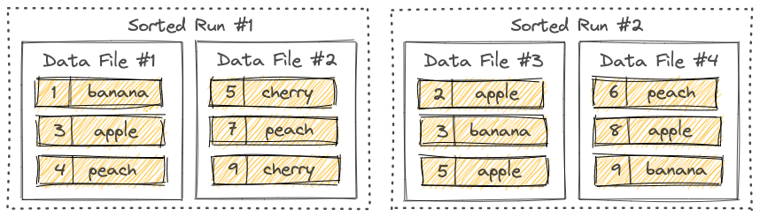
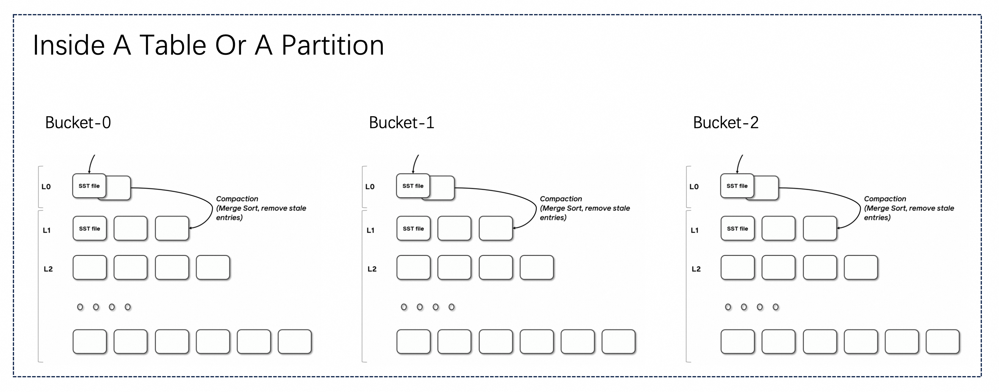
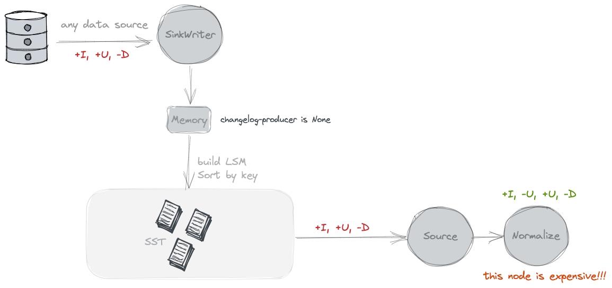
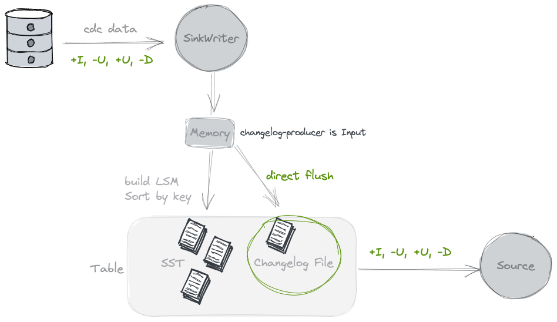
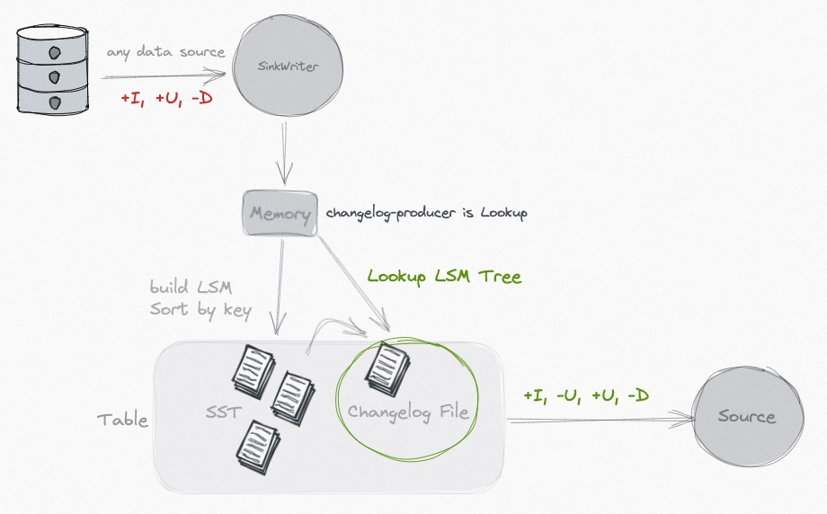
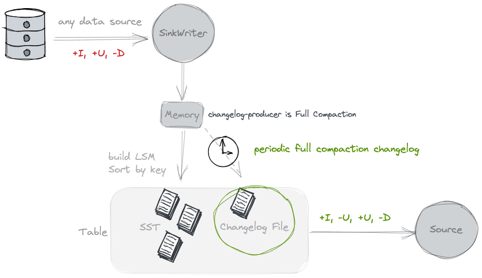

# Overview

* Paimon的主键表支持insert、update和delete操作，主键由一组列组成，这些列包含每个记录的唯一值。Paimon通过对每个bucket中的主键进行排序来实现数据排序，允许用户通过对主键应用过滤条件来实现高性能。

## Bucket

* 未分区的表或分区表中的分区被细分为bucket，为数据提供额外的结构，可用于更有效的查询。每个bucket目录下**包含LSM tree和changelog文件**。bucket的范围由记录中一个或多个列的哈希值决定。用户可以通过提供`bucket-key`选项来指定bucket列。如果没有指定桶键选项，则使用`主键(如果定义了)或完整记录`作为bucket key。
* bucket是用于读写的最小存储单元，因此bucket的数量限制了最大的处理并行性。bucket的个数不能过多，否则将**导致大量小文件和低读取性能**。一般情况下，建议每个bucket中的数据大小在**200MB - 1GB**左右。

## LSM Tree

* Paimon采用LSM树(log-structured merge-tree)作为文件存储的数据结构。

### Sorted Runs

* LSM树将文件组织成若干个sorted runs。一个sorted run由一个或多个数据文件组成，每个数据文件只属于一个sorted run。数据文件中的记录按其**主键排序**。在单个sorted run中，数据文件的主键范围从不重叠。



* 如上图，不同的sorted run可能有重叠的主键范围，甚至可能包含相同的主键。在查询LSM树时，必须将所有sorted run组合起来，并且必须根据用户指定的合并引擎和每条记录的时间戳合并具有相同主键的所有记录。写入LSM树的新记录将首先在内存中进行缓冲。**当内存缓冲区已满时，将对内存中的所有记录进行排序并刷新到磁盘**，立刻创建一个新的sorted run。

# 数据分布

## 固定桶

* 配置一个大于0的bucket，使用**Fixed bucket**模式，根据`Math.abs(key_hashcode % numBuckets)`来计算记录的bucket。重新减少bucket只能通过离线进程进行，bucket的数量过多会导致小文件过多，bucket的数量过少会导致写性能不佳，建议每个bucket中的数据大小在**200MB - 1GB**左右。

## 动态桶

* 主键表的默认模式或者配置bucket='-1'，最先到达的键将落入旧的bucket中，新键将落入新bucket中，bucket和键的分布取决于数据到达的顺序。Paimon维护一个索引来确定哪个键对应于哪个bucket。Paimon将自动扩展桶的数量。
  * 配置1:`dynamic-bucket.target-row-num`: 控制一个bucket的目标行数
  * 配置2:`dynamic-bucket.initial-buckets`:控制初始化bucket的个数

> Dynamic bucket只支持单写入任务。不要启动多个作业来写入同一个分区(这可能导致重复数据)。即使启用"write-only"并启动专用的压缩作业，它也不会起作用。

### 普通动态桶模式

* 当更新没有跨分区(没有分区，或者主键包含所有分区字段)时，动态桶模式使用HASH索引来维护从键到bucket的映射，它比固定桶模式需要更多的内存。
* 性能影响：
  * 一般来说，没有性能损失，但会有一些**额外的内存消耗**，**一个分区中的1亿个条目会多占用1 GB的内存**，不再活动的分区不会占用内存。
  * 对于更新率较低的表，建议使用该模式，以显著提高性能。
* 普通动态桶模式支持排序压缩以加快查询速度

### 跨分区Upsert动态桶模式

* 当需要跨分区upsert(主键不包含所有分区字段)时，动态桶模式直接维护键到分区和bucket的映射，使用本地磁盘，并在开始流式写作业时通过读取表中所有现有键来初始化索引。不同的合并引擎有不同的行为：
  * `Deduplicate`:删除旧分区中的数据，并将新数据插入新分区。
  * `PartialUpdate & Aggregation:`将新数据插入旧分区。
  * `FirstRow`:如果存在旧数据忽略新数据
* **性能影响：**对于具有大量数据的表，将会有很大的性能损失。而且，初始化需要很长时间。
* 如果upsert不依赖于**太旧的数据，您可以考虑配置索引TTL来减少索引和初始化时间**。
  * `'cross-partition-upsert.index-ttl'`: 在rocksdb中设置TTL索引和初始化，这样可以避免维护过多的索引而导致性能越来越差。

## 选择分区字段

* 以下三种类型的字段可以定义为仓库中的分区字段：
  * **创建时间(推荐):**创建时间通常是不可变的，因此您可以放心地将其作为分区字段并将其添加到主键中。
  * **事件时间:**事件时间是原表中的一个字段。对于CDC数据，例如从MySQL CDC同步的表或者由Paimon生成的Changelogs，它们都是完整的CDC数据，包括UPDATE BEFORE记录，即使你声明了包含分区字段的主键，也可以达到唯一的效果(要求'changelog-producer'='input')。
  * **CDC OP_TS：**不能将其定义为分区字段，无法知道以前的记录时间戳。因此，您需要使用跨分区UPSERT，它将消耗更多资源。

# Table模式



* **主键表**的文件结构大致如上图所示。表或分区包含多个桶，每个桶是一个单独的LSM树结构，其中包含多个文件。LSM的写入过程大致如下:Flink检查点刷新L0文件，并根据需要触发compaction以合并数据。根据写入过程中处理方式的不同，有三种模式：
  * **MOR (Merge On Read):** 默认表模式，只执行minor compactions，并且在读取时需要合并。
  * **COW (Copy On Write):** 使用 `'full-compaction.delta-commits' = '1'`开启, 同步进行full compaction, 这意味着合并在写入时完成。
  * **MOW (Merge On Write):** 使用 `'deletion-vectors.enabled' = 'true'`开启, 在写入阶段，查询LSM生成数据文件的删除向量文件，读取时直接过滤掉不需要的行。

## Merge On Read

* MOR是主键表的默认模式，当表模式为MOR时，它需要合并所有文件进行读取，因为所有文件都是有序的，并且经过多路合并，其中包括主键的比较计算。**单个LSM树只能有一个线程进行读取，因此读取并行性是有限的**。如果bucket中的数据量太大，可能会导致读性能差。因此，为了提高读性能，建议将bucket中的数据量设置在**200MB到1GB之间**。
* 另外，由于合并过程的原因，不能对非主键列进行基于Filter的data shipping，否则会过滤掉新数据，导致旧数据不正确。

### MOR读写性能

* 写性能：非常好，顺序Append写入
* 读性能：不太好，读时合并，配合合适的compaction策略可以提速

## Copy On Write

* 修改表类型为COW

```sql
ALTER TABLE orders SET ('full-compaction.delta-commits' = '1');
```

* 将`full-compact.delta-commits`设置为1，这意味着每次写都将触发full compaction，并且所有数据都将合并到最高level。读取时，此时不需要合并，读取性能最高。但是每次写入都需要完全合并，并且**写入放大非常严重**。

### COW读写性能

* 写性能：非常差
* 读性能：非常好

## Merge On Write

* 修改表类型为MOW

```sql
ALTER TABLE orders SET ('deletion-vectors.enabled' = 'true');
```

* 由于Paimon的LSM结构，它具有按主键查询的能力。我们可以在写入时生成删除向量文件，表示文件中的哪些数据已被删除。这直接过滤掉读取过程中不需要的行，相当于合并，不影响读取性能。
* 例如：通过先删除旧记录然后添加新记录来更新数据。

### MOW读写性能

* 写性能：好
* 读性能：好

> 可见性保证:表在删除向量模式下，层级为0的文件只有在压缩后才可见。因此，默认情况下，压缩是同步的，如果打开异步，则可能存在数据延迟。

## MOR读取优化

* 如果你不想MOW模式，你想查询足够快的MOR模式，但只能找到旧的数据，你也可以：
  * 异步Compaction：当写数据的时候配置`compaction.optimization-interval`;对于流作业，copmaction将定期执行。对于批处理作业，将在作业结束时执行优化的Compaction。(或者配置`full-compaction.delta-commits`，**它的缺点是只能同步执行copmaction，这会影响写效率**)
  * 读优化系统表：从读优化的系统表中查询。从优化文件的结果中读取可以避免合并具有相同键的记录，从而提高读取性能。

# Merge Engine

* 当Paimon sink接收到具有相同主键的两条或多条记录时，它会将它们合并到一条记录中，以保持主键的唯一性。通过指定`merge-engine`的配置，用户可以选择如何将记录合并在一起。

> 通常在Flink SQL的TableConfig中设置`table.exec.sink.upsert-materialize`为`NONE`，sink的upsert-materialize配置可能会导致数据重复，当输入是无序的，我们建议您使用序列字段来纠正混乱。

## Deduplicate

* 默认的合并引擎是`deduplicate`，Paimon将只保留最新的记录，并丢弃具有相同主键的其他记录。如果最新的记录是一条`DELETE`记录，那么所有具有相同主键的记录都将被删除。可以通过配置`ignore-delete`来忽略它。

## Partial Update

* 配置`'merge-engine' = 'partial-update'`,用户可以通过多次更新来更新同一行记录的不同列。通过使用相同主键下的最新数据逐个更新值字段来实现的，此过程中空值不会更新。举例如下三条记录：
  * `<1, 23.0, 10, NULL>`
  * `<1, NULL, NULL, 'This is a book'>`
  * `<1, 25.2, NULL, NULL>`
* 最终得到的结果为 `<1, 25.2, 10, 'This is a book'>`.

> 对于流式查询场景下`partial-update`合并引擎需要配合`lookup`或`full-compaction`changelog producer来使用

* 默认情况下，`partial-update`不能接受删除记录，可以选择以下解决方案之一：
  * 配置 `ignore-delete`来忽略删除的记录
  * 配置`partial-update.remove-record-on-delete`，当接收到删除记录时移除整行
  * 配置`sequence-group`来回撤部分列

### Sequence Group

* 序列字段可能无法解决具有多个流更新的`partial-update`表的无序问题，因为在多流更新期间，序列字段可能被另一个流的最新数据覆盖。因此，引入了`partial-update `表的序列组机制。它可以解决:
  * 多流更新过程中的混乱。每个流定义自己的序列组。
  * 真正的部分更新，而不仅仅是非空更新。

```sql
-- 配置partial-update表，定义不同字段的序列组
CREATE TABLE t
(
    k   INT,
    a   INT,
    b   INT,
    g_1 INT,
    c   INT,
    d   INT,
    g_2 INT,
    PRIMARY KEY (k) NOT ENFORCED
) WITH (
      'merge-engine' = 'partial-update',
  --  g_1的序列组为a,b字段
      'fields.g_1.sequence-group' = 'a,b',
  -- g2的序列组为c,d字段
      'fields.g_2.sequence-group' = 'c,d'
      );

-- 插入默认数据1
INSERT INTO t
VALUES (1, 1, 1, 1, 1, 1, 1);

-- 因为g_2为空，所以它的序列组字段c,d也不会被更新
INSERT INTO t
VALUES (1, 2, 2, 2, 2, 2, CAST(NULL AS INT));

SELECT *
FROM t;
-- output 1, 2, 2, 2, 1, 1, 1

-- 因为g_1是最小的，a,b也不会被更新
INSERT INTO t
VALUES (1, 3, 3, 1, 3, 3, 3);

SELECT *
FROM t; -- output 1, 2, 2, 2, 3, 3, 3
```

*  `fields.<field-name>.sequence-group`,有效的比较数据类型包括:DECIMAL、TINYINT、SMALLINT、INTEGER、BIGINT、FLOAT、DOUBLE、DATE、TIME、TIMESTAMP和TIMESTAMP LTZ。
* 也可以在一个`sequence-group`中配置多个排序字段，如`fields.<field-name1>,<field-name2>.sequence-group`，多个字段将按顺序进行比较。

```sql
CREATE TABLE SG
(
    k   INT,
    a   INT,
    b   INT,
    g_1 INT,
    c   INT,
    d   INT,
    g_2 INT,
    g_3 INT,
    PRIMARY KEY (k) NOT ENFORCED
) WITH (
      'merge-engine' = 'partial-update',
      'fields.g_1.sequence-group' = 'a,b',
      'fields.g_2,g_3.sequence-group' = 'c,d'
      );

INSERT INTO SG
VALUES (1, 1, 1, 1, 1, 1, 1, 1);

-- g_2, g_3 should not be updated
INSERT INTO SG
VALUES (1, 2, 2, 2, 2, 2, 1, CAST(NULL AS INT));

SELECT *
FROM SG;
-- output 1, 2, 2, 2, 1, 1, 1, 1

-- g_1 should not be updated
INSERT INTO SG
VALUES (1, 3, 3, 1, 3, 3, 3, 1);

SELECT *
FROM SG;
-- output 1, 2, 2, 2, 3, 3, 3, 1
```

### 局部更新的聚合

```sql
CREATE TABLE t
(
    k INT,
    a INT,
    b INT,
    c INT,
    d INT,
    PRIMARY KEY (k) NOT ENFORCED
) WITH (
      'merge-engine' = 'partial-update',
      'fields.a.sequence-group' = 'b',
      'fields.b.aggregate-function' = 'first_value',
      'fields.c.sequence-group' = 'd',
      'fields.d.aggregate-function' = 'sum'
      );
INSERT INTO t
VALUES (1, 1, 1, CAST(NULL AS INT), CAST(NULL AS INT));
INSERT INTO t
VALUES (1, CAST(NULL AS INT), CAST(NULL AS INT), 1, 1);
INSERT INTO t
VALUES (1, 2, 2, CAST(NULL AS INT), CAST(NULL AS INT));
INSERT INTO t
VALUES (1, CAST(NULL AS INT), CAST(NULL AS INT), 2, 2);


SELECT *
FROM t; -- output 1, 2, 1, 2, 3
```

## Aggregation

> 通常在Flink SQL的TableConfig中设置`table.exec.sink.upsert-materialize`为`NONE`

* 有时用户只关心聚合的结果。聚合合并引擎根据聚合函数，在相同的主键下，将具有最新数据的每个值字段逐一聚合。每个不属于主键的字段都可以被赋予一个聚合函数，由`fields.<field-name>.aggregate-function`表属性指定，否则将默认使用`last_non_null_value`聚合。

```sql
CREATE TABLE my_table (
    product_id BIGINT,
    price DOUBLE,
    sales BIGINT,
    PRIMARY KEY (product_id) NOT ENFORCED
) WITH (
    'merge-engine' = 'aggregation',
    'fields.price.aggregate-function' = 'max',
    'fields.sales.aggregate-function' = 'sum'
);
```

* 字段`price`将聚合最大值，`sales`将聚合总和，给定`<1, 23.0, 15>` 和 `<1, 30.2, 20>`俩个输入，得到结果`<1,30.2,35>`

### Aggregation Functions

* 当前支持的聚合函数和数据类型如下表：

| 函数名               | 函数含义                                                     | 支持的数据类型                                               |
| -------------------- | ------------------------------------------------------------ | ------------------------------------------------------------ |
| sum                  | sum函数将跨多行的值求总和                                    | DECIMAL, TINYINT, SMALLINT, INTEGER, BIGINT, FLOAT,  DOUBLE  |
| product              | product函数可以跨多个行计算乘积值                            | DECIMAL, TINYINT, SMALLINT, INTEGER, BIGINT, FLOAT,  DOUBLE  |
| count                | count函数对跨多行的值进行计数                                | INTEGER, BIGINT                                              |
| max                  | max函数识别并保留最大值                                      | CHAR, VARCHAR, DECIMAL, TINYINT, SMALLINT, INTEGER, BIGINT, FLOAT, DOUBLE, DATE, TIME, TIMESTAMP,  TIMESTAMP_LTZ |
| min                  | min函数识别并保留最小值                                      | CHAR, VARCHAR, DECIMAL, TINYINT, SMALLINT, INTEGER, BIGINT, FLOAT, DOUBLE, DATE, TIME, TIMESTAMP,  TIMESTAMP_LTZ |
| last_value           | last_value函数用最近导入的值替换了上一个值                   | ALL                                                          |
| last_non_null_value  | **默认聚合函数，**last_non_null_value函数将上一个值替换为最新的非空值 | ALL                                                          |
| listagg              | listagg函数将多个字符串值连接成一个字符串                    | STRING                                                       |
| bool_and             | bool_and函数评估布尔集中的所有值是否为true                   | BOOLEAN                                                      |
| bool_or              | bool_or函数检查布尔集合中至少一个值是否为true                | BOOLEAN                                                      |
| first_value          | first_value函数从数据集检索第一个空值                        | ALL                                                          |
| first_non_null_value | first_non_null_value函数从数据集检索第一个非空值             | BOOLEAN                                                      |
| rbm32                | rbm32函数汇总了多个序列化的32位RoaringbitMap，为单个RoaringBitMap | VARBINARY                                                    |
| rbm64                | rbm64函数汇总了多个序列化的64位Roaring64Bitmap，为单个Roaring64Bitmap | VARBINARY                                                    |
| nested_update        | nested_update函数将多行收集到一个数组（所谓的“嵌套表”）；使用`fields.<field-name>.nested-key=pk0,pk1,...`来指定聚合表的主键，如果没有键，记录将会被追加到数组 ； [案例](https://paimon.apache.org/docs/master/primary-key-table/merge-engine/aggregation/#nested_update) | ARRAY                                                        |
| collect              | collect函数将元素收集到Array中；设置`fields.<field-name>.distinct=true`来去重数组元素 | ARRAY                                                        |
| merge_map            | merge_map用来合并map                                         | MAP                                                          |
| theta_sketch         | theta_sketch函数将多个序列化的Sketch对象汇总到单个Sketch中   | VARBINARY                                                    |

### Retraction

* 只有`sum`, `product`, `count`, `collect`, `merge_map`, `nested_update`, `last_value` 和`last_non_null_value`支持Retraction(`UPDATE_BEFORE` 和 `DELETE`).配置`fields.${field_name}.ignore-retract'='true'`忽略Retraction消息。`last_value`和`last_non_null_value`只需在接受Retraction消息时将字段设置为null。
* `collect`和`merge_map`函数最大努力处理撤回消息，但不能保证结果是准确的。在处理撤回消息时可能会发生以下行为：
  * 如果记录是无序的，它可能无法处理撤回消息。例如：该表使用`collect`函数，上游发送`+I['A', 'B']` 和 `-U['A']`消息，这个表首先接收到了`-U['A']`，它什么都不做，然后接收到了`+I['A', 'B']`,合并结果的到`+I['A', 'B']`，而不是正确结果`+I['B']`
  * 来自一个上游的撤回消息将撤回来自多个上游合并的结果。例如：该表使用`merge_map`函数，然后其中一个上游发送消息`+I[1->A]`,另一个上游之后发送`+I[1->B]`, `-D[1->B]`消息，该表将首先将两个插入值合并到 `+I[1->B]` ，然后 `-D[1->B]`将回撤整个结果，因此最终结果是一个空的映射，而不是`+I[1->A]`

## First Row

* 通过 `'merge-engine' = 'first-row'`配置，用户可以保留同一主键的第一行。它与`deduplicate`不同的是，在`first-row`合并引擎中，它将生成只允许插入的变更日志。
  * 不支持指定` sequence.field`
  * 不接收`DELETE`和`UPDATE_BEFORE`消息，通过配置`ignore-delete`来忽略这俩类消息
  * 可见性保证：具有`first-row`引擎的表，level为0的文件仅在compaction后才可见。因此，默认情况下，compaction是同步的，如果打开异步，数据中可能会延迟。

# Changelog Producer

* 流式写入能够持续不断地为流式读取提供最新的变化数据，通过在创建表的时候指定`changelog-producer`配置，用户可以选择从表文件产生的changelog-producer。

> changelog-producer可能会显著降低压缩性能，除非必要，否则请不要启用它。

## NONE

* `changelog-producer`默认配置，没有额外的changelog producer将应用到表的写入器。Paimon Source只能在快照之间看到合并的更改，例如删除键以及某些键的新值是什么。然而，这些合并的更改不能形成一个完整的更改日志，因为我们不能直接从中读取键的旧值。合并的更改要求使用者**记住每个键的值**，并在不看到旧值的情况下重写这些值。然而，一些消费者需要旧的值**来确保正确性或效率**。
* 考虑一个消费者可以计算某些分组键上的总和（可能不等于主键）。如果消费者仅看到一个新值5，则无法确定应将哪些值添加到求和结果中。例如，如果旧值为4，则应为结果加1。但是，如果旧值为6，则应从结果中减去1。旧价值对这些类型的消费者很重要。
* 根据上述要求，`node`配置的changelog-producer最适合的消费者是数据库系统。Flink还具有内置的“normalize”操作，该算子保存状态中每个键的值。这种操作成本非常高，应该避免使用。(通过`scan.remove-normalize`配置移除`normalize`操作。)



## Input

* 通过`'changelog-producer' = 'input'`配置，Paimon写入器依赖于他们的输入作为完整更改日志的数据。所有输入记录都将保存在分开的changelog文件中，并通过Paimon Source提供给消费者。
* 当Paimon写入器的输入是完整的changelog时`input`changelog producer将被使用，例如数据来源是数据库CDC数据或者Flink有状态计算产出的数据



## Lookup

* 如果输入不能够提供完整的changelog数据，但是仍然希望摆脱昂贵的normalized操作符，则可以考虑使用'lookup' changelog producer。
* 通过配置 `'changelog-producer' = 'lookup'`，在提交数据写入之前，Paimon将通过`lookup`生成变更日志。



* `lookup`将缓存内存和本地磁盘上的数据，您可以使用以下配置来调优性能：

| 配置                         | 默认值    | 数据类型   | 描述                                                         |
| :--------------------------- | :-------- | :--------- | :----------------------------------------------------------- |
| lookup.cache-file-retention  | 1 h       | Duration   | lookup缓存文件保留的时长，文件过期后，如果需要访问，将从DFS重新读取它，以便在本地磁盘上建立索引。 |
| lookup.cache-max-disk-size   | unlimited | MemorySize | lookup缓存使用的最大磁盘大小，通过这个参数可以限制使用的本地磁盘大小 |
| lookup.cache-max-memory-size | 256 mb    | MemorySize | lookup使用的最大内存大小                                     |

* Lookup changelog-producer支持`changelog-producer.row-deduplicatr`以避免为同一条记录生成`-U、+U`更改日志。

**注意：**增加'execution.checkpointing.max-concurrent-checkpoints'可以提升性能。

## Full Compaction

* 如果认为`lookup`消耗的资源太大，可以使用`full-compaction`changelog producer，它可以解耦数据写入和变更日志生成，并且更适合高延迟(例如10分钟)的场景。
* 通过配置 `'changelog-producer' = 'full-compaction'`,Paimon将会比较full copmaction之间的结果作为变更日志。变更日志的时效性受full compaction频率的影响。
* 通过指定 `full-compaction.delta-commits` 表配置，在进行增量提交(checkpoints)之后不断触发full copmaction.默认值为1，表示每次checkpoint都会触发一次full compaction来生成变更日志。



> `full compaction` changelog producer能够为任何类型的数据源生成完整的changelog，但是，它不如`input` changelog producer高效，并且生成变更日志的延迟可能很高。

* Full-compaction changelog-producer 支持 `changelog-producer.row-deduplicate` 以避免为同一条记录生成`-U， +U`更改日志。

**注意：**增加'execution.checkpointing.max-concurrent-checkpoints'可以提升性能。

# Sequence & RowKind

* 创建表的时候指定`sequence.field`配置来决定更新的顺序，或者配置`rowkind.field`来决定记录的changelog rowkind；

## Sequence Field

* 默认情况下，主键表根据输入顺序确定合并顺序(最后一个输入记录将是最后一个合并)。然而，在分布式计算中，会出现一些导致数据混乱的情况。此时，您可以使用时间字段作为`sequence.field`，例如:

```sql
CREATE TABLE my_table (
    pk BIGINT PRIMARY KEY NOT ENFORCED,
    v1 DOUBLE,
    v2 BIGINT,
    update_time TIMESTAMP
) WITH (
    'sequence.field' = 'update_time'
);
```

* 记录中`sequence.field`的最大值将会最后被合并，**如果值相同，则将使用输入顺序来确定哪一个是最后一个**。` sequence.field`支持所有数据类型的字段。`sequence.field`也支持配置多个，多个字段将按顺序进行比较。

## Row Kind Field

* 默认情况下，**主键表根据输入行确定row kind**。你也可以使用`'rowkind.field'`以使用字段提取行类型。
* 有效的row kind字符串应该是`+I`、`-U`、`+U`或`-D`。

# Compaction

* 当越来越多的记录写到LSM树，sorted runs的数量将会增长.因为查询LSM树需要全部的sorted runs组合，太多的sorted runs将会导致查询性能差或者内存浪费。为了限制sorted runs的个数，我们必须定期合并若干个sorted runs为一个大的sorted run。这个过程被叫做compaction。
* 然而，compaction是一个资源密集型过程，它会消耗一定的CPU时间和磁盘IO，因此过于频繁的compaction可能会导致写速度变慢。这是查询性能和写性能之间的权衡。目前，Paimon采用了一种类似于Rocksdb通用compaction策略。
* Compaction解决方案：
  * 减少level 0文件避免查询性能下降。
  * 通过`changelog-producer`生成变更日志。
  * 产生删除向量以MOW模式。
  * 快照过期，Tag过期，分区过期
* 限制：
  * 同一个分区上只能有一个作业进行copmaction，否则会导致冲突，一方会抛出异常失败。
* 写入性能几乎总是受到copmaction的影响，因此其调优至关重要。

## 异步Compaction

* compaction本质上是异步的，但是如果您希望它是完全异步的，并且不阻塞写入，期望一个模式具有最大的写入吞吐量，compaction可以缓慢地完成，而不是匆忙地完成。对表进行以下配置：

```shell
num-sorted-run.stop-trigger = 2147483647
sort-spill-threshold = 10
lookup-wait = false
```

* 这种配置可以在写高峰时生成更多的文件，在写低时逐渐融合成最佳的读性能。

## 专用copmaction任务

* 通常，如果您希望将多个作业写入同一个表，则需要分离copmaction，您可以使用专用的copmaction作业。

## Record-Level expire

* 在copmaction中，您可以配置记录级别的过期时间来过期记录，如下：
  * `'record-level.expire-time'`: 记录的保留时间
  * `'record-level.time-field'`:用于过期的时间字段，它是INT类型的秒
* 过期是在copmaction过程中发生的，并且不能保证及时过期记录，类似于惰性删除

## Compaction配置

### 暂停写入的Sorted Run个数

* 当sorted run的次数很少时，Paimon写入器将在分开的线程中异步执行Compaction，因此可以连续地将记录写入表中。然而，为了避免sorted run的无界增长，写入器将在sorted run的数量达到阈值时暂停写入。

| Option                      | Required | Default | Type    | Description                                                  |
| :-------------------------- | :------- | :------ | :------ | :----------------------------------------------------------- |
| num-sorted-run.stop-trigger | No       | (none)  | Integer | ed runs到达一定数量时停止写入，默认值 是'num-sorted-run.compaction-trigger' +3 |

* 当`num-sorted-run.stop-trigger`增大时，写停滞将变得不那么频繁，从而提高写入性能。但是此值太大，查询表将消耗更多的CPU时间和内存。如果担心OOM问题，需要配置下列选项，他决定内存的大小。

| Option               | Required | Default | Type    | Description                                                  |
| :------------------- | :------- | :------ | :------ | :----------------------------------------------------------- |
| sort-spill-threshold | No       | (none)  | Integer | 如果排序读取器的最大数量超过此值，将尝试溢出。这可以防止过多的读取器消耗过多的内存并导致OOM。 |

### Sorted Run的个数触发Compaction

* Paimon使用LSM树来支持大规模的更新。LSM在若干个sorted runs中组织文件。当在LSM树种查询记录的时候，全部的sorted runs必须被组合来提供全部记录的完整视图。
* 因此太多的sorted runs将会导致查询性能差，为了保持sorted runs的个数在合理范围内，Paimon写入器将会自动执行Compaction，下列配置根据sorted runs的最小数量来触发Compaction。

| Option                            | Required | Default | Type    | Description                                                  |
| :-------------------------------- | :------- | :------ | :------ | :----------------------------------------------------------- |
| num-sorted-run.compaction-trigger | No       | 5       | Integer | 触发compaction的sorted run个数，包含level0文件(一个文件一个sorted run)和更高level的sorted run |

* 当` num-sorted-run.compaction-trigger`变大时，compaction将变的不那么频繁，从而提高写性能，如果此值过大，则查询表将消耗更多的CPU时间和内存。