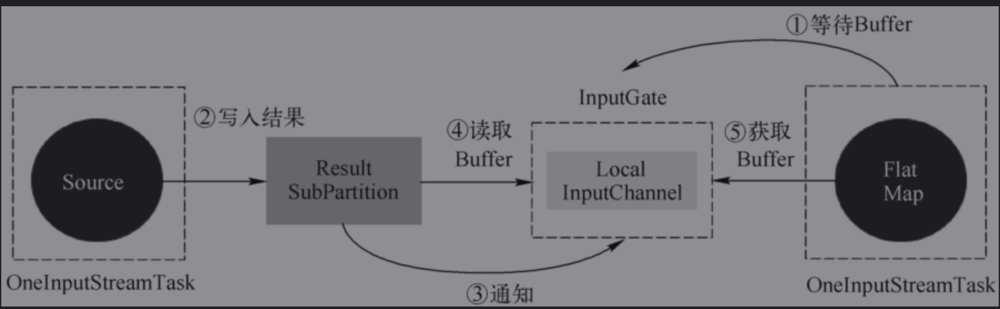
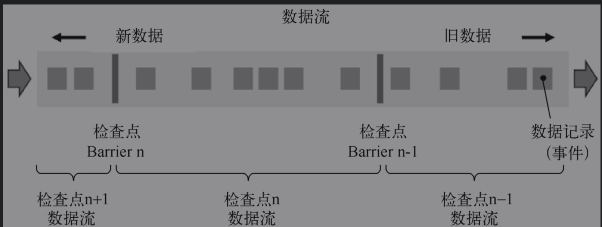
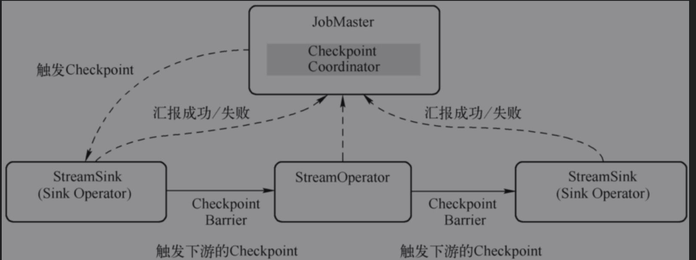
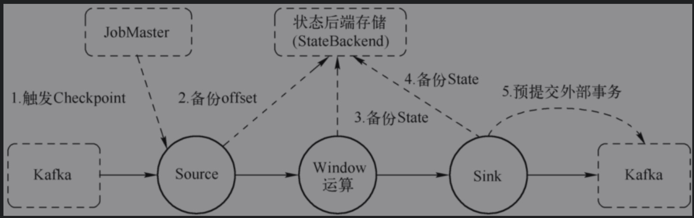
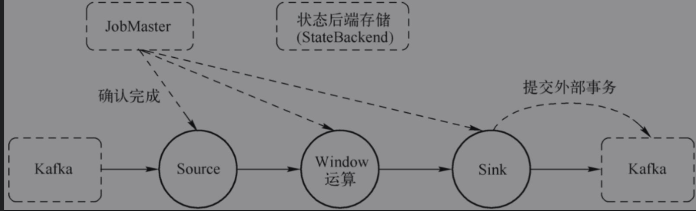

# 作业执行

## 作业执行图

* 最终执行图为ExecutionGraph，核心对象包括Task、ResultPartition & ResultSubPartition、InputGate & InputChannel。

## 核心对象

### 输入处理器StreamInputProcessor

#### 相关实现

* StreamOneInputProcessor：用在OneInputStreamTask中，只有1个上游输入。
* StreamTwoInputProcessor：用在TwoInputStreamTask中，有2个上游输入。
* StreamMultipleInputProcessor：多输入实现

#### 核心方法

* processInput

```java
public InputStatus emitNext(DataOutput<T> output) throws Exception {

		while (true) {
			// get the stream element from the deserializer
			if (currentRecordDeserializer != null) {
				DeserializationResult result = currentRecordDeserializer.getNextRecord(deserializationDelegate);
				if (result.isBufferConsumed()) {
					currentRecordDeserializer.getCurrentBuffer().recycleBuffer();
					currentRecordDeserializer = null;
				}

				if (result.isFullRecord()) {
          // 底层调用udf的processElement
					processElement(deserializationDelegate.getInstance(), output);
					return InputStatus.MORE_AVAILABLE;
				}
			}

			Optional<BufferOrEvent> bufferOrEvent = checkpointedInputGate.pollNext();
			if (bufferOrEvent.isPresent()) {
				// return to the mailbox after receiving a checkpoint barrier to avoid processing of
				// data after the barrier before checkpoint is performed for unaligned checkpoint mode
				if (bufferOrEvent.get().isEvent() && bufferOrEvent.get().getEvent() instanceof CheckpointBarrier) {
					return InputStatus.MORE_AVAILABLE;
				}
				processBufferOrEvent(bufferOrEvent.get());
			} else {
				if (checkpointedInputGate.isFinished()) {
					checkState(checkpointedInputGate.getAvailableFuture().isDone(), "Finished BarrierHandler should be available");
					return InputStatus.END_OF_INPUT;
				}
				return InputStatus.NOTHING_AVAILABLE;
			}
		}
	}
```

### Task输入

#### StreamTaskInput

* StreamTaskNetworkInput负责从上游Task获取数据，使用InputGate作为底层读取数据。
* StreamTaskSourceInput负责从外部数据源获取数据，本质上是使用SourceFunction读取数据，交给下游的Task。

### Task输出

#### StreamTaskNetworkOutput

* StreamTaskNetworkOutput只是负责将数据交给算子来进行处理，实际的数据写出是在算子层面上执行的

### ResultPartition 

* 作业单个Task产生的数据，一个ResultPartition是一组Buffer实例。
* ResultPartition由ResultSubPartition组成，ResultSubPartition用来进一步将ResultPartition进行切分，切分成多少个ResultSubPartition取决于直接下游子任务的`并行度和数据分发`模式。

### ResultSubPartition 

* 负责存储实际的Buffer，如果上游Task对接下游4个Task，就为ResultPartition生成4个ResultSubPartition，一个并行度一个ResultSubPartition。

#### PipelinedSubPartition

* 纯内存型的ResultSubPartition，只能被消费一次。

#### BoundedBlockingSubParittion

* 用作对批处理Task的计算结果的数据存储，其行为是阻塞式，需要等待上游所有的数据处理完毕，然后下游才开始消费数据，可以消费1次或者多次

### InputGate

* Task的输入数据的封装，和JobGraph中的JobEdge一一对应，对应于上游的ResultPartition。
* 其中负责实际数据消费的是InputChannel，是InputChannel的容器，用于读取中间结果（IntermediateResult）在并行执行时由上游Task产生的一个或多个结果分区（ResultPartition）。
* SingleInputGate是消费ResultPartition的实体，对应于一个IntermediateResult。而UnionInputGate主要充当InputGate容器的角色，将多个InputGate联合起来，当作一个InputGate，一般是对应于上游的多个输出类型相同的IntermediateResult，对应于多个上游的IntermediateResult。


### InputChannel

* 每个InputGate会包含一个以上的InputChannel，和ExecutionEdge一一对应，也和结果子分区一对一相连，即一个InputChannel接收一个结果子分区的输出。

#### InputChannel实现

* LocalInputChannel：对应于本地结果子分区的输入通道，用来在本地进程内不同线程之间的数据交换。

* RemoteInputChannel：对应于远程的结果子分区的输入通道，用来表示跨网络的数据交换，底层基于Netty。

* UnknownInputChannel：一种用于占位目的的输入通道，需要占位通道是因为暂未确定相对于Task生产者的位置，在确定上游Task位置之后，如果位于不同的TaskManager则替换为RemoteInputChannel，如果位于相同的TaskManager则转换为LocalInputChannel。

## Task执行

* 由以前的锁机制改造为多线程模型，所有的并发操作都通过队列进行排队（Mailbox），单线程 （Mailbox线程）依次处理，这样就避免了并发操作。

### Task处理数据

```java
1. StreamInputProcessor#processInput
2. PushingAsyncDataInput#emitNext
public InputStatus emitNext(DataOutput<T> output) throws Exception {

		while (true) {
			// get the stream element from the deserializer
			if (currentRecordDeserializer != null) {
				DeserializationResult result = currentRecordDeserializer.getNextRecord(deserializationDelegate);
				if (result.isBufferConsumed()) {
					currentRecordDeserializer.getCurrentBuffer().recycleBuffer();
					currentRecordDeserializer = null;
				}

				if (result.isFullRecord()) {
					processElement(deserializationDelegate.getInstance(), output);
					return InputStatus.MORE_AVAILABLE;
				}
			}

			Optional<BufferOrEvent> bufferOrEvent = checkpointedInputGate.pollNext();
			if (bufferOrEvent.isPresent()) {
				// return to the mailbox after receiving a checkpoint barrier to avoid processing of
				// data after the barrier before checkpoint is performed for unaligned checkpoint mode
				if (bufferOrEvent.get().isEvent() && bufferOrEvent.get().getEvent() instanceof CheckpointBarrier) {
					return InputStatus.MORE_AVAILABLE;
				}
				processBufferOrEvent(bufferOrEvent.get());
			} else {
				if (checkpointedInputGate.isFinished()) {
					checkState(checkpointedInputGate.getAvailableFuture().isDone(), "Finished BarrierHandler should be available");
					return InputStatus.END_OF_INPUT;
				}
				return InputStatus.NOTHING_AVAILABLE;
			}
		}
	}

# processElement
  private void processElement(StreamElement recordOrMark, DataOutput<T> output) throws Exception {
		if (recordOrMark.isRecord()){
			output.emitRecord(recordOrMark.asRecord());
		} else if (recordOrMark.isWatermark()) {
			statusWatermarkValve.inputWatermark(recordOrMark.asWatermark(), lastChannel);
		} else if (recordOrMark.isLatencyMarker()) {
			output.emitLatencyMarker(recordOrMark.asLatencyMarker());
		} else if (recordOrMark.isStreamStatus()) {
			statusWatermarkValve.inputStreamStatus(recordOrMark.asStreamStatus(), lastChannel);
		} else {
			throw new UnsupportedOperationException("Unknown type of StreamElement");
		}
	}
# udf processElement
  public void emitRecord(StreamRecord<IN> record) throws Exception {
			numRecordsIn.inc();
			// 设置流上下文
			operator.setKeyContextElement1(record);
			// SchedulerNG调用对应算子udf
			operator.processElement(record);
		}
```

1. OperatorChain内部的数据传递，发生OperatorChain所在本地线程内。
2. 同一个TaskManager的不同Task之间传递数据，发生在同一个JVM的不同线程之间。
3. 不同TaskManager的Task之间传递数据，即跨JVM的数据传递，需要使用跨网络的通信，即便TaskManager位于同一个物理机上，也会使用网络协议进行数据传递。

### Task处理WaterMarker

#### 单流Watermark

* 单流输入逻辑比较简单，如果有定时器服务，则判断是否触发计算，并将Watermark发往下游

#### 双流waterMarker

* 双流输入从上游两个算子中接收到两个Watermark，inputWatermark1表示第一个输入流的Watermark，inputWatermark2表示第2个输入流的Watermark，选择其中较小的那一个Min（inputWatermrk1，inputWatermark2）作为当前的Watermark。

### Task处理StreamStatus

* StreamStatus是StreamElement的一种，用来标识Task是活动状态还是空闲状态。当SourceStreamTask或一般的StreamTask处于闲置状态（IDLE），不会向下游发送数据或Watermark时，就向下游发送StreamStatus#IDLE状态告知下游，依次向下传递。当恢复向下游发送数据或者Watermark前，首先发送StreamStatus#ACTIVE状态告知下游。

###  Task处理LatencyMarker

* LatencyMarker用来近似评估数据从读取到写出之间的延迟，但是并不包含计算的延迟。在算子中只能将数据记录交给UDF执行，所以收到LatencyMarker就直接交给下游了

# 数据交换

## 数据传递模式

### Batch模式

* Batch的计算模型采用PULL模式，与Spark类似，将计算过程分成多个阶段，上游完全计算完毕之后，下游从上游拉取数据开始下一阶段计算，直到最终所有的阶段都计算完毕，输出结果，BatchJob结束退出。

### Stream模式

* Stream的计算模型采用的是PUSH模式，上游主动向下游推送数据，上下游之间采用生产者-消费者模式，下游收到数据触发计算，没有数据则进入等待状态。PUSH模式的数据处理过程也叫作Pipeline，提到Pipeline或者流水线的时候，一般是指PUSH模式的数据处理过程。


## 关键组件

### RecordWriter

* 负责将Task处理的数据输出，面向StreamRecords直接处理算子的输出结果，ResultPatitionWriter面向的是Buffer，起到承上启下的作用，RecordWriter底层依赖于ResultPatitionWriter。

#### 单播

* 通过ChannelSelector将StreamRecord写入ResultSubPartition中，默认为RoundRobinChannelSelector以轮询的方式输出数据到对应的ResultPartition

#### 广播

* 广播就是向下游所有的Task发送相同的数据，在所有的ResultSubPartition中写入N份相同数据。但是在实际实现时，同时写入N份重复的数据是资源浪费，所以对于广播类型的输出，只会写入编号为0的ResultSubPartition中，下游Task对于广播类型的数据，都会从编号为0的ResultSubPartition中获取数据。

### RecordSerializer

* 实现为SpanningRecordSerializer是一种支持跨内存段的序列化器，其实现借助于中间缓冲区来缓存序列化后的数据，然后再往真正的目标Buffer里写，在写的时候会维护两个“指针”：
  * 表示目标Buffer内存段长度的limit
  * 表示其当前写入位置的position

### RecordDeserializer

* 负责数据的反序列化SpillingAdaptiveSpanningRecordDeserializer是唯一实现
  * PARTIAL_RECORD： 表示记录并未完全被读取，但缓冲中的数据已被消费完成。
  * INTERMEDIATERECORDFROM_BUFFER： 表示记录的数据已被完全读取，但缓冲中的数据并未被完全消费。
  * LASTRECORDFROM_BUFFER： 记录被完全读取，且缓冲中的数据也正好被完全消费。

### ResultSubPartitionView

* 定义了ResultSubPartition中读取数据、释放资源等抽象行为
  * PipelinedSubPartitionView：用来读取PipelinedSubPartition中的数据。
  * BoundedBlockingSubPartitionReader：用来读取BoundedBlockingSubPartition中的数据。

## 数据传递

### 本地线程内的数据传递

* 本质是属于同一个OperatorChain的算子之间的数据传递，算子chain优化方式传递数据。

### 本地线程内数据传递

* 位于同一TaskMananger的不同Task算子之间，不会通过算子间的直接调用方法传输数据，而是通过本地内存进行数据传递。
* 不同Task线程共享一个BufferPool，通过wait和notifyAll来同步，以此来进行数据传递。

### 本地线程内数据交换的过程



### 跨网络的数据传递

* 运行在不同TaskManager JVM中的Task之间的数据传递，与本地线程间的数据交换类似。


## 数据传递过程

### 数据传递过程

1. 数据在本算子处理完后，交给RecordWriter，经过ChannelSelector找到对应ResultSubPartition。
2. 每个ResultSubPartition都有一个独有的序列化器（避免多线程竞争），将这条记录序列化为二进制数据。
3. 数据被写入ResultSubPartition中此时数据已经存入DirectBuffer(MemorySegment)中
4. 单独的线程控制数据的flush速度，一旦触发flush，则通过Netty的nio通道向对端写入。
5. 对端的Netty Client接收到数据，解码出来把数据复制到Buffer中，通知InputGate的InputChannel
6. 有可用数据时，下游算子从阻塞唤醒，从InputChannel中取出Buffer，再反序列化成数据记录交给算子的UDF。

### 数据写出

* Task调用算子执行UDF之后，需要将数据交给下游进行处理。RecordWriter类负责将StreamRecord进行序列化，调用SpaningRecordSerializer，再调用BufferBuilder写入MemorySegment中（每个Task都有自己的LocalBufferPool，LocalBufferPool中包含了多个MemorySegment）

# 应用容错

## 容错保证语义

### At Most Once

* 最低级别的数据处理保证，即At-Most-Once，数据不重复处理，但可能会丢失，在Flink中，不开启检查点就是最多一次的处理保证。

### At Least Once

* 最少一次，即At-Least-Once，数据可能重复处理，但保证不丢失，在Flink中，开启检查点不进行Barrier对齐就是最少一次的处理保证。

### Exactly Once

* 严格一次，即Exactly-Once，在计算引擎内部，数据不丢失、不重复，在Flink中开启检查点，且对Barrier进行对齐，就能达到引擎内严格一次的处理保证。如果数据源支持断点读取，则能支持从数据源到引擎处理完毕，再写出到外部存储之前的过程中的严格一次。

### End to End Exactly Once

* 端到端严格一次，即End-to-End Exactly-Once，从数据读取、引擎处理到写入外部存储的整个过程中，数据不重复、不丢失。
  * 端到端严格一次语义需要数据源支持可重放，外部存储支持事务机制，能够进行回滚。在Flink中，设计了两阶段提交协议，提供了框架级别的支持，即TwoPhaseCommitSinkFunction，在前面的函数体系中提到过，本章中的后续内容会详细介绍。

## 作业恢复

* 外部检查点:检查点完成时，在用户给定的外部持久化存储保存。当作业Failed(或者Cancled)时，外部存储的检查点会保存下来。
* 保存点:通过命令触发的savepoint操作，用于作业迁移等操作。

### 检查点恢复

#### 自动检查点恢复

* 通过作业重启策略自动从checkpoint恢复。

#### 手动检查点恢复

* 通过启动命令`-s`指定对应的checkpoint文件即可手动通过ck恢复。

### 保存点恢复

#### 算子的顺序改变

* 对应的UID没变，可以通过savepoint恢复，如果UID变化则恢复失败

#### 作业中添加了新的算子

* 如果是无状态算子，没有影响，就可以正常恢复，如果是有状态算子，跟无状态的算子一样处理。

#### 从作业删除了一个有状态的算子

* 默认需要恢复保存点中所记录的所有算子的状态，如果删除了一个有状态的算子，从保存点恢复的时候被删除的OperatorID找不到，所以会报错。，可以通过`-allowNonRestoredState`跳过无法恢复的算子。

#### 添加和删除无状态的算子

* 如果手动设置了UID，则可以恢复，保存点中不记录无状态的算子；如果是自动分配UID，那么有状态的算子UID可能会变，可能会恢复失败。

#### 恢复的时候调整并行度

* Flink1.2.0以上的版本，如果没有使用废弃的API则没问题，但是需要控制最大并行度相同。

## 关键组件

### CheckpointCoordinator

* 负责协调Flink算子的State的分布式快照，当触发快照的时候，CheckpointCoordinator向Source算子中注入Barrier消息，然后等待所有的Task通知Checkpoint完成，同时持有所有Task在确认完成消息中上报的State句柄。

###  检查点消息

* 在执行检查点的过程中，TaskManager和JobManager之间通过消息确认检查点执行成功还是取消。
* 检查点消息的三个标识：JobID、检查点编号、Task标识。
* AbstractCheckpointMessage#AcknowledgeCheckpoint：该消息从TaskExecutor发送JobMaster，告知算子的快照备份完成。
* AbstractCheckpointMessage#DeclineCheckpoint:该消息从TaskExecutor发往JobMaster，告知算子无法执行快照备份，如Task了Runing状态但是内部还没有准备好执行快照备份。

## 轻量级异步分布式快照

### 基本概念

* 分布式快照使用Barrier将数据流切分，Barrier会周期性地注入数据流中，作为数据流的一部分，从上游到下游被算子处理。Barriers会严格保证顺序，不会超过其前边的数据，Barrier将记录分割成记录集，两个Barrier之间的数据流中的数据隶属同一个检查点。
* 每个Barrier携带一个所属快照的ID编号，Barrier随着数据向下流动，不会打断数据流。



* Barrier会在Source端注入并行数据流，Barrier n所在的位置就是恢复时数据重新处理的起始位置，对于kafka来说这个位置就是最后消费的offset。

#### sink算子接受到Barrier的情况

* 如果是引擎内严格一次处理保证，当Sink算子已经收到了所有上游的Barrier n时，Sink算子对自己的State进行快照，然后通知检查点协调器（CheckpointCoordinator），当所有的算子都向检查点协调器汇报成功之后，检查点协调器向所有的算子确认本次快照完成。
* 如果是端到端严格一次处理保证，当Sink算子已经收到了所有上游的Barrier n时，Sink算子对自己的State进行快照，并预提交事务，再通知检查点协调器（CheckpointCoordinator），检查点协调器向所有的算子确认本次快照完成，Sink算子提交事务，本次事务完成。

### Barrier对齐

* 当一个算子有多个上游输入的时候，为了达到引擎内严格一次、端到端严格一次两种保证语义，`此时必须要Barrier对齐`。


1. 算子收到输入通道1的Barrier，输入通道2的Barrier尚未到达算子。
2. 算子收到输入通道1的Barrier，会继续从输入通道1接收数据，但是并不处理，而是保存在输入缓存中，等待输入通道2的Barrier到达。在输入通道2 Barrier到达前，缓存了3条数据（3,2,1）。
3. 输入通道2的Barrier到达，算子开始对其State进行异步快照，并将Barrier向下游广播，并不等待快照执行完毕。
4. 算子在做异步快照，首先处理缓存中积压的数据，然后再从输入通道中获取数据。（Barrier对齐的核心，对齐Barrier会处理buffer中的数据，这也会影响checkpoint的时间。）

## 检查点执行过程



### JobMaster触发检查点

* JobMaster调度作业时会为作业提供一个CheckpointCoordinator，周期性地触发检查点的执行。CheckpointCoordinator只需要通知SourceTask产生CheckpointBarrier事件，注入数据流中，数据流向下流动时被算子读取，在算子上触发Checkpoint。

#### 前置检查

1. 前置检查，确保作业关闭过程中不允许执行，如果未启用或未达到触发检查点的最小间隔等不会执行。
2. 检查是否所有需要执行Checkpoint的Task都处于执行状态，能够执行checkpoint向jobmaster汇报，若不是则整个作业的checkpoint无法执行。
3. 执行checkpointID=CheckpointIdCounter.getAndIncrement（），生成一个新的id，然后生成一个PendingCheckpoint。PendingCheckpoint是一个启动了的检查点，但是还没有被确认。等到所有的Task都确认了本次检查点，那么这个检查点对象将转化为一个CompletedCheckpoint。
4. JobMaster不能无限期等待检查点的执行，所以需要进行超时监视（Checkpoint timeout配置控制），如果超时尚未完成检查点，则取消本次检查点。
5. 触发MasterHooks，用户可以定义一些额外的操作，用以增强检查点的功能（如准备和清理外部资源）
6. 再次执行步骤1）和步骤2）中的检查，如果一切正常，则向各个SourceStreamTask发送通知，触发检查点执行。

### TaskExecutor执行检查点

* JobMaster通过TaskManagerGateway触发TaskManager的检查点执行，TaskManager则转交给Task执行。

#### Task层面的检查点执行准备

* Task类中的部分，该类创建了一个CheckpointMetaData的对象，确保Task处于Running状态，把工作转交给StreamTask

## 检查点恢复过程

* JobMaster会将恢复状态包装到Task的任务描述信息中，Task使用TaskStateSnapshot向JobMaster汇报自身的状态信息，恢复的时候也是使用TaskStateSnapshot对象。

### OperatorState恢复

* 在初始化算子状态的时候，从OperatorStateStore中获取ListState类型的状态，由OperatorStateStore负责从对应的StateBackend中读取状态重新赋予算子中的状态变量

### KeyState恢复

* WindowOperator是KeyedState的典型应用，其窗口使用了KeyedState在StateBackend中保存窗口数据、定时器等，在恢复的时候，除了恢复OperatorState和函数State之外，还进行了窗口定时器等State的恢复

## 端到端一致

### 两阶段提交协议

* 端到端一致只需要相关source/sink满足一下条件
  * 数据源支持断点读取
  * 外部存储支持回滚机制或者满足幂等性
* Flink使用两阶段提交协议以及预提交（Pre-commit）阶段来解决这个问题。两阶段提交协议分为预提交（Pre-Commit）阶段和提交（Commit）阶段。
* 两阶段提交协议依赖于Flink的两阶段检查点机制，JobMaster触发检查点，所有算子完成各自快照备份即预提交阶段，在这个阶段Sink也要把待写出的数据备份到可靠的存储中，确保不会丢失，向支持外部事务的存储预提交，当检查点的第一阶段完成之后，JobMaster确认检查点完成，此时Sink提交才真正写入外部存储。

### 预提交阶段

* 当开始执行检查点的时候进入预提交阶段，JobMaster向Soure Task注入CheckpointBarrier，Source Task将CheckpointBarrier插入数据流，向下游广播开启本次快照。
* CheckpointBarrier除了起到触发检查点的作用，在两阶段提交协议中，还负责将流中所有消息分割成属于本次检查点的消息以及属于下次检查点的两个集合，每个集合表示一组需要提交的数据，即属于同一个事务。
* 在预提交阶段，Sink把要写入外部存储的数据以State的形式保存到状态后端存储（StateBackend）中，同时以事务的方式将数据写入外部存储。



### 提交阶段

* 预提交阶段完成之后，下一步就是通知所有的算子，确认检查点已成功完成。然后进入第二阶段——提交阶段。该阶段中JobMaster会为作业中每个算子发起检查点已完成的回调逻辑。
* 预提交阶段数据已经写入外部存储，只是因为事务原因不可读，所以Sink在事务提交成功后数据就算真正下发，否则就会根据重启策略回滚。



