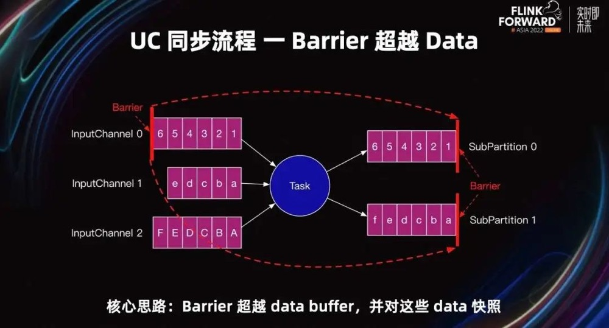
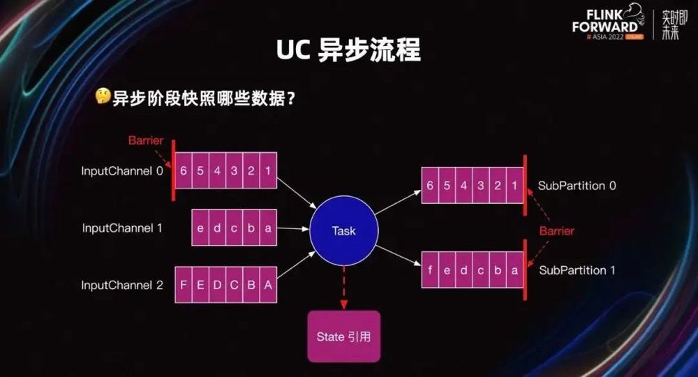
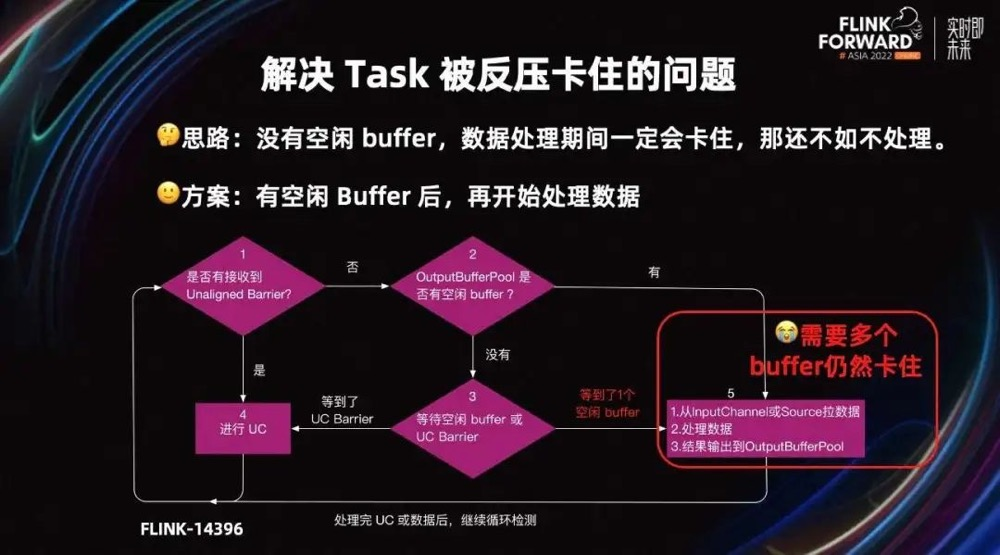

# Checkpointing

* Flink 中的每个方法或算子都能够是**有状态的**。 状态化的方法在处理单个 元素/事件 的时候存储数据，让状态成为使各个类型的算子更加精细的重要部分。 为了让状态容错，Flink 需要为状态添加 **checkpoint（检查点）**。Checkpoint 使得 Flink 能够恢复状态和在流中的位置，从而向应用提供和无故障执行时一样的语义。

## 前提条件

* Flink的checkpoint机制需要河持久化存储进行交互，读写状态，需要具备以下能力：
  * 能够回放一段时间内数据的持久化数据源，例如持久化消息队列（例如 Apache Kafka、RabbitMQ、 Amazon Kinesis、 Google PubSub 等）或文件系统（例如 HDFS、 S3、 GFS、 NFS、 Ceph 等）。
  * 存放状态的持久化存储，通常为分布式文件系统（比如 HDFS、 S3、 GFS、 NFS、 Ceph 等）。

## 开启与配置Checkpoint

* checkpoint默认情况下`是被禁用的`。通过可调用 `StreamExecutionEnvironment` 的 `enableCheckpointing(n)` 来启用 checkpoint，里面的 *n* 是进行 checkpoint 的间隔，单位毫秒。

**Checkpoint的属性包括：**

* *Checkpoint存储：*设置检查点快照的持久化位置。默认情况下，Flink使用JobManger的堆。生产中应该为持久性文件系统。
* *精确一次（exactly-once）对比至少一次（at-least-once）*：通过 `enableCheckpointing(long interval, CheckpointingMode mode)` 方法中传入一个模式来选择使用两种保证等级中的哪一种。 对于大多数应用来说，精确一次是较好的选择。至少一次可能与某些延迟超低（始终只有几毫秒）的应用的关联较大。
* *checkpoint 超时*：如果 checkpoint 执行的时间超过了该配置的阈值，还在进行中的 checkpoint 操作就会被抛弃。
* *checkpoints 之间的最小时间*：该属性定义在 checkpoint 之间需要多久的时间，以确保流应用在 checkpoint 之间有足够的进展。如果值设置为了 *5000*， 无论 checkpoint 持续时间与间隔是多久，在前一个 checkpoint 完成时的至少五秒后会才开始下一个 checkpoint。**注意这个值也意味着并发 checkpoint 的数目是*一*。**
* *checkpoint 可容忍连续失败次数*：该属性定义可容忍多少次连续的 checkpoint 失败。超过这个阈值之后会触发作业错误 fail over。 默认次数为“0”，这意味着不容忍 checkpoint 失败，作业将在第一次 checkpoint 失败时fail over。可容忍的checkpoint失败仅适用于下列情形：Job Manager的IOException、TaskManager做checkpoint时异步部分的失败、checkpoint超时等；TaskManager做checkpoint时同步部分的失败会直接触发作业fail over。其它的checkpoint失败（如一个checkpoint被另一个checkpoint包含）会被忽略掉。
* *并发 checkpoint 的数目*: 默认情况下，在上一个 checkpoint 未完成（失败或者成功）的情况下，系统不会触发另一个 checkpoint。这确保了拓扑不会在 checkpoint 上花费太多时间，从而影响正常的处理流程。 不过允许多个 checkpoint 并行进行是可行的，**对于有确定的处理延迟（例如某方法所调用比较耗时的外部服务），但是仍然想进行频繁的 checkpoint 去最小化故障后重跑的 pipelines 来说，是有意义的。** 注意： **不能和 “checkpoints 间的最小时间"同时使用。**
* *externalized checkpoints*: 你可以配置周期存储 checkpoint 到外部系统中。Externalized checkpoints 将他们的元数据写到持久化存储上并且在 job 失败的时候*不会*被自动删除。 这种方式下，如果你的 job 失败，你将会有一个现有的 checkpoint 去恢复。
* *非对齐 checkpoints*: 你可以启用[非对齐 checkpoints](https://nightlies.apache.org/flink/flink-docs-release-1.19/zh/docs/ops/state/checkpointing_under_backpressure/#非对齐-checkpoints) 以在背压时大大减少创建checkpoint的时间。这仅适用于精确一次（exactly-once）checkpoints 并且只有一个并发检查点。
* *部分任务结束的 checkpoints*： 默认情况下，即使DAG的部分已经处理完它们的所有记录，Flink也会继续执行 checkpoints。

```java
StreamExecutionEnvironment env = StreamExecutionEnvironment.getExecutionEnvironment();

// 每 1000ms 开始一次 checkpoint
env.enableCheckpointing(1000);

// 高级选项：

// 设置模式为精确一次 (这是默认值)
env.getCheckpointConfig().setCheckpointingMode(CheckpointingMode.EXACTLY_ONCE);

// 确认 checkpoints 之间的时间会进行 500 ms
env.getCheckpointConfig().setMinPauseBetweenCheckpoints(500);

// Checkpoint 必须在一分钟内完成，否则就会被抛弃
env.getCheckpointConfig().setCheckpointTimeout(60000);

// 允许两个连续的 checkpoint 错误
env.getCheckpointConfig().setTolerableCheckpointFailureNumber(2);
        
// 同一时间只允许一个 checkpoint 进行
env.getCheckpointConfig().setMaxConcurrentCheckpoints(1);

// 使用 externalized checkpoints，这样 checkpoint 在作业取消后仍就会被保留
env.getCheckpointConfig().setExternalizedCheckpointCleanup(
        ExternalizedCheckpointCleanup.RETAIN_ON_CANCELLATION);

// 开启实验性的 unaligned checkpoints
env.getCheckpointConfig().enableUnalignedCheckpoints();
```

### Checkpoint相关配置

| Key                                    | Default | Type       | Description                                                  |
| :------------------------------------- | :------ | :--------- | :----------------------------------------------------------- |
| state.backend.incremental              | false   | Boolean    | 是否开启增量Checkpoint，默认为false。对于增量Checkpoint，只存储与前一个Checkpoint的差异，而不是完整的Checkpoint状态。一旦启用，在web UI中显示的状态大小或从Rest API中获取的状态大小只代表增量Checkpoint大小，而不是完整的Checkpoint大小。一些状态后端可能不支持增量检查点并忽略此选项。 |
| state.backend.local-recovery           | false   | Boolean    | 状态后端是否开启本地恢复。默认情况为fasle本地恢复。目前只支持keyed state backends(包括EmbeddedRocksDBStateBackend和HashMapStateBackend)。 |
| state.checkpoint-storage               | (none)  | String     | 用于指定checkpoint所用的存储，支持'jobmanager'和'filesystem'以及'rocksdb' |
| state.checkpoint.cleaner.parallel-mode | true    | Boolean    | 是否使用并行过期状态清理器                                   |
| state.checkpoints.create-subdir        | true    | Boolean    | 是否要在'state.checkpoints.dir'下创建**由Job ID命名的子目录以存储检查点的数据文件和元数据**。默认为true，可以在相同检查点目录下运行多个作业。 |
| state.checkpoints.dir                  | (none)  | String     | 用于将检查点的数据文件和元数据存储在flink支持的文件系统中的默认目录。需要支持Taskmanger和Jobmanager访问。 |
| state.checkpoints.num-retained         | 1       | Integer    | 警告：这是一种高级配置。如果设置为false，则用户必须确保没有使用相同检查点目录运行多个作业，并且在启动新作业时恢复当前作业所需的文件之外，没有其他文件。The maximum number of completed checkpoints to retain. |
| state.savepoints.dir                   | (none)  | String     | savepoint的存储目录.                                         |
| state.storage.fs.memory-threshold      | 20 kb   | MemorySize | 状态数据文件的最小大小。小于该值的所有状态块都内联存储在根检查点元数据文件中。此配置的最大内存阈值为1MB。 |
| state.storage.fs.write-buffer-size     | 4096    | Integer    | 写入文件系统的检查点流的写缓冲区的默认大小。实际写缓冲区大小为该配置和'state.storage.fso.fs.memory-threshold'的最大值。 |
| taskmanager.state.local.root-dirs      | (none)  | String     | 为本地恢复的存储基于文件的状态定义根目录的配置参数。本地恢复目前仅涵盖键控状态后端。如果未配置，它将默认为<WORKING_DIR>/localState。可以通过`process.taskmanager.working-dir`配置<WORKING_DIR> |

* **设置重启策略**
  * noRestart
  * fallBackRestart:回滚
  * fixedDelayRestart: 固定延迟时间重启策略，在固定时间间隔内重启
  * failureRateRestart: 失败率重启

## 配置State Backend

* Flink的checkpoint机制会将timer和stateful的operator进行快照，然后进行存储(connector、windows以及用户自定义的状态)。checkpoint存储在哪里主要根据配置的State Backend决定(Jobmanager memory、file system、database)

```java
Configuration config = new Configuration();
config.set(StateBackendOptions.STATE_BACKEND, "hashmap");
env.configure(config);
```

## 部分任务结束后的 Checkpoint

* 为了解决1.14版本之前存在的一旦有算子Finished状态后就没办法继续正常Checkpoint，从而导致无法保证Exactly Once语义；

  ```java
  Configuration config = new Configuration();
  config.set(ExecutionCheckpointingOptions.ENABLE_CHECKPOINTS_AFTER_TASKS_FINISH, false);
  StreamExecutionEnvironment env = StreamExecutionEnvironment.getExecutionEnvironment(config);
  ```

* 在这种情况下，结束的任务不会参与 Checkpoint 的过程。在实现自定义的算子或者 UDF （用户自定义函数）时需要考虑这一点
* 为了支持部分任务结束后的 Checkpoint 操作，我们调整了 [任务的生命周期](https://nightlies.apache.org/flink/flink-docs-release-1.19/zh/docs/internals/task_lifecycle/) 并且引入了 [StreamOperator#finish ](https://nightlies.apache.org/flink/flink-docs-release-1.19/api/java//org/apache/flink/streaming/api/operators/StreamOperator.html#finish--)方法。 在这一方法中，用户需要写出所有缓冲区中的数据。在 finish 方法调用后的 checkpoint 中，这一任务一定不能再有缓冲区中的数据，因为在 `finish()` 后没有办法来输出这些数据。 在大部分情况下，`finish()` 后这一任务的状态为空，唯一的例外是如果其中某些算子中包含外部系统事务的句柄（例如为了实现恰好一次语义）， 在这种情况下，在 `finish()` 后进行的 checkpoint 操作应该保留这些句柄，并且在结束 checkpoint（即任务退出前所等待的 checkpoint）时提交。 一个可以参考的例子是满足恰好一次语义的 sink 接口与 `TwoPhaseCommitSinkFunction`。

### 对 operator state 的影响 

* 在部分 Task 结束后的checkpoint中，Flink 对 `UnionListState` 进行了特殊的处理。 `UnionListState` 一般用于实现对外部系统读取位置的一个全局视图（例如，用于记录所有 Kafka 分区的读取偏移）。 如果我们在算子的某个并发调用 `close()` 方法后丢弃它的状态，我们就会丢失它所分配的分区的偏移量信息。 为了解决这一问题，对于使用 `UnionListState` 的算子我们只允许在它的并发都在运行或都已结束的时候才能进行 checkpoint 操作。
* `ListState` 一般不会用于类似的场景，但是用户仍然需要注意在调用 `close()` 方法后进行的 checkpoint 会丢弃算子的状态并且 这些状态在算子重启后不可用。
* 任何支持并发修改操作的算子也可以支持部分并发实例结束后的恢复操作。从这种类型的快照中恢复等价于将算子的并发改为正在运行的并发实例数。

### 任务结束前等待最后一次 Checkpoint

* 为了保证使用两阶段提交的算子可以提交所有的数据，任务会在所有算子都调用 `finish()` 方法后等待下一次 checkpoint 成功后退出。 需要注意的是，这一行为可能会延长任务运行的时间，如果 checkpoint 周期比较大，这一延迟会非常明显。 极端情况下，如果 checkpoint 的周期被设置为 `Long.MAX_VALUE`，那么任务永远不会结束，因为下一次 checkpoint 不会进行。

## 容错与状态

### Checkpoint

#### 一致性检查点


* Flink故障恢复机制的核心，就是应用状态的一致性检查点
* 有状态流应用的一致检查点，其实就是所有任务的状态，在某个时间点的一份拷贝；这个时间点，`应该是所有任务恰好处理完一个相同的输入数据的时候,如果各个算子单独处理对应的offset，`就会存在source端和算子端checkpoint的offset存在异常，导致数据无法恢复。

#### 从检查点恢复

* 重启应用程序，从上次保存的checkpoint恢复，当所有checkpoint恢复到各个算子中，然后开始消费并处理checkpoint到发生故障之间的所有数据，这种checkpoint的保存和恢复机制可以为程序提供"exactly-once"的一致性，所有算子都会保存checkpoint并恢复其所有状态，这样就保证了状态的最终一致性。

#### 检查点算法

* **一种简单的想法**

    * 暂停应用，保存状态到检查点，再重新恢复应用，程序存在中断状态

* **Flink实现方式**

    * 基于`Chandy-Lamport`算法的分布式快照
    * 将检查点的保存和数据处理分离开，不暂停整个应用，对Source进行`checkpoint barrier`控制

* **检查点屏障(Checkpoint Barrier)**

    * Flink的检查点算法用到一种称为屏障(barrier)的特殊数据形式，用来把一条流上数据按照不同的检查点分开。
    * Barrier之前到来的数据导致的状态更改，都会被包含在当前分界线所属的检查点中；基于barrier之后的数据导致的所有更改，就会被包含在之后的检查点中。

* **检查点barrier流程**

    * 有两个输入流的应用程序，并行的两个Source任务来读取，JobManager会向每个Source任务发送一个带有新checkpoint ID的消息，通过这种方式来启动checkpoint。
    * 数据源将它们的状态写入checkpoint，并发出一个`checkpoint barrier`，状态后端在状态存入checkpoint之后，会返回通知给source任务，source任务就会向JobManager确认checkpoint完成。
    * **barrier对齐**：barrier向下游传递，sum任务会等待所有输入分区的barrier达到，对于barrier已经到达的分区，继续到达的数据会`被缓存`，而barrier尚未到达的分区，数据会被正常处理。
    * 当收到所有输入分区的barrier时，任务就将其状态保存到`状态后端的checkpoint中`，然后将barrier继续向下游转发，下游继续正常处理数据。
    * Sink任务向JobManager确认状态保存到checkpoint完毕，当所有任务都确认已成功将状态保存到checkpoint时，checkpoint完毕。

  

  

  

### 保留 Checkpoint

Checkpoint 在默认的情况下仅用于恢复失败的作业，并不保留，当程序取消时 checkpoint 就会被删除。当然，你可以通过配置来保留 checkpoint，这些被保留的 checkpoint 在作业失败或取消时不会被清除。这样，你就可以使用该 checkpoint 来恢复失败的作业。

```java
CheckpointConfig config = env.getCheckpointConfig();
config.setExternalizedCheckpointCleanup(ExternalizedCheckpointCleanup.RETAIN_ON_CANCELLATION);
```

`ExternalizedCheckpointCleanup` 配置项定义了当作业取消时，对作业 checkpoint 的操作：

- **`ExternalizedCheckpointCleanup.RETAIN_ON_CANCELLATION`**：当作业取消时，保留作业的 checkpoint。注意，这种情况下，需要手动清除该作业保留的 checkpoint。
- **`ExternalizedCheckpointCleanup.DELETE_ON_CANCELLATION`**：当作业取消时，删除作业的 checkpoint。仅当作业失败时，作业的 checkpoint 才会被保留。

#### 目录结构

* 与 [savepoints](https://nightlies.apache.org/flink/flink-docs-release-1.19/zh/docs/ops/state/savepoints/) 相似，checkpoint 由元数据文件、数据文件（与 state backend 相关）组成。可通过配置文件中 'state.checkpoints.dir' 配置项来指定元数据文件和数据文件的存储路径，另外也可以在代码中针对单个作业特别指定该配置项。

```shell
/user-defined-checkpoint-dir
    /{job-id}
        |
        + --shared/
        + --taskowned/
        + --chk-1/
        + --chk-2/
        + --chk-3/
        ...   
```

* 其中 **SHARED** 目录保存了可能被多个 checkpoint 引用的文件，**TASKOWNED** 保存了不会被 JobManager 删除的文件，**EXCLUSIVE** 则保存那些仅被单个 checkpoint 引用的文件。

#### 通过配置文件全局配置

```yaml
state.checkpoints.dir: hdfs:///checkpoints/
```

#### 创建 state backend 对单个作业进行配置

```java
Configuration config = new Configuration();
config.set(StateBackendOptions.STATE_BACKEND, "rocksdb");
config.set(CheckpointingOptions.CHECKPOINT_STORAGE, "filesystem");
config.set(CheckpointingOptions.CHECKPOINTS_DIRECTORY, "hdfs:///checkpoints-data/");
env.configure(config);
```

#### 从保留的checkpoint中恢复状态

```shell
$ bin/flink run -s :checkpointMetaDataPath [:runArgs]
```

### 背压下的Checkpointing

* 通常情况下，对齐 Checkpoint 的时长主要受 Checkpointing 过程中的**同步和异步**两个部分的影响。当 Flink 作业正运行在严重的背压下时，Checkpoint 端到端延迟的主要**影响因子将会是传递 Checkpoint Barrier 到所有的算子的时间**。这在 [checkpointing process](https://nightlies.apache.org/flink/flink-docs-release-1.19/zh/docs/concepts/stateful-stream-processing/#checkpointing)) 的概述中有说明原因。并且可以通过高 [alignment time and start delay metrics](https://nightlies.apache.org/flink/flink-docs-release-1.19/zh/docs/ops/monitoring/checkpoint_monitoring/#history-tab) 观察到。 当这种情况发生并成为一个问题时，有三种方法可以解决这个问题：
  * 消除背压源头，通过优化 Flink 作业，通过调整 Flink 或 JVM 参数，抑或是通过扩容(增加并行度)。
  * 减少 Flink 作业中缓冲在 In-flight 数据的数据量（对齐数据）。
  * 启用非对齐 Checkpoints。 这些选项并不是互斥的，可以组合在一起。

#### 缓冲区Debloating

* Flink 1.14 引入了一个新的工具，用于自动控制在 Flink 算子/子任务之间缓冲的 **In-flight 数据的数据量**。缓冲区 Debloating 机制可以通过将属性`taskmanager.network.memory.buffer-debloat.enabled`设置为`true`来启用。
* 此特性**对对齐和非对齐 Checkpoint 都生效**，并且在这两种情况下**都能缩短 Checkpointing 的时间**，不过 Debloating 的效果对于 对齐 Checkpoint 最明显。 当在非对齐 Checkpoint 情况下使用缓冲区 Debloating 时，额外的好处是 Checkpoint 大小会更小，并且恢复时间更快 (需要保存 和恢复的 In-flight 数据更少)。
* 有关缓冲区 Debloating 功能如何工作以及如何配置的更多信息，可以参考 [network memory tuning guide](https://nightlies.apache.org/flink/flink-docs-release-1.19/zh/docs/deployment/memory/network_mem_tuning/)。 

#### 非对齐Checkpoints

* 从**Flink 1.11**开始，Checkpoint 可以是非对齐的。 [Unaligned checkpoints](https://nightlies.apache.org/flink/flink-docs-release-1.19/zh/docs/concepts/stateful-stream-processing/#unaligned-checkpointing) 包含 In-flight 数据(例如，存储在缓冲区中的数据)作为 Checkpoint State的一部分，允许 Checkpoint Barrier 跨越这些缓冲区。因此， Checkpoint 时长变得与当前吞吐量无关，因为 Checkpoint Barrier 实际上已经不再嵌入到数据流当中。
* 如果您的 Checkpointing 由于背压导致周期非常的长，您应该使用非对齐 Checkpoint。这样，Checkpointing 时间基本上就与端到端延迟无关。请注意，非对齐 Checkpointing 会增加状态存储的 I/O，因此当状态存储的 I/O 是整个 Checkpointing 过程当中真正的瓶颈时，您不应当使用非对齐 Checkpointing。
* 为了启用非对齐 Checkpoint，您可以：

```java
StreamExecutionEnvironment env = StreamExecutionEnvironment.getExecutionEnvironment();

// 启用非对齐 Checkpoint
env.getCheckpointConfig().enableUnalignedCheckpoints();
```

* 或者在 `flink-conf.yml` 配置文件中增加配置：

```yaml
execution.checkpointing.unaligned: true
```

##### 对齐Checkpoint的超时

* 在启用非对齐 Checkpoint 后，你依然可以通过编程的方式指定对齐 Checkpoint 的超时：

```java
StreamExecutionEnvironment env = StreamExecutionEnvironment.getExecutionEnvironment();
env.getCheckpointConfig().setAlignedCheckpointTimeout(Duration.ofSeconds(30));
```

* 或是在 `flink-conf.yml` 配置文件中配置：

```yaml
execution.checkpointing.aligned-checkpoint-timeout: 30 s
```

* 在启动时，每个 Checkpoint 仍然是 aligned checkpoint，但是当全局 Checkpoint 持续时间超过 `aligned-checkpoint-timeout` 时， 如果 aligned checkpoint 还没完成，那么 Checkpoint 将会转换为 Unaligned Checkpoint。

##### 限制

###### 并发 Checkpoint

* Flink 当前并不支持并发的非对齐 Checkpoint。然而，由于更可预测的和更短的 Checkpointing 时长，可能也根本就不需要并发的 Checkpoint。此外，Savepoint 也不能与非对齐 Checkpoint 同时发生，因此它们将会花费稍长的时间。

###### 与 Watermark 的相互影响

* 非对齐 Checkpoint 在恢复的过程中改变了关于 Watermark 的一个隐式保证。目前，Flink 确保了 Watermark 作为恢复的第一步， 而不是将最近的 Watermark 存放在 Operator 中，以方便扩缩容。在非对齐 Checkpoint 中，这意味着当恢复时，**Flink 会在恢复 In-flight 数据后再生成 Watermark**。如果您的 Pipeline 中使用了**对每条记录都应用最新的 Watermark 的算子**将会相对于使用对齐 Checkpoint产生**不同的结果**。如果您的 Operator 依赖于最新的 Watermark 始终可用，解决办法是将 Watermark 存放在 OperatorState 中。在这种情况下，Watermark 应该使用单键 group 存放在 UnionState 以方便扩缩容。

### Savepoint

* Savepoint 由俩部分组成：数据二进制文件的目录（通常很大）和元数据文件（相对较小）。 数据存储的文件表示作业执行状态的数据镜像。 Savepoint 的`元数据文件以（绝对路径）的形式包含（主要）指向作为 Savepoint 一部分的所有数据文件的指针`。

#### 与checkpoint的区别

* **Checkpoint**类似于恢复日志的概念(redo log)，Checkpoint 的主要目的是`为意外失败的作业提供恢复机制`。 Checkpoint 的生命周期由 Flink 管理，即 Flink 创建、管理和删除 Checkpoint无需用户交互。 作为一种恢复和定期触发的方法，Checkpoint 实现有两个设计目标：`i）轻量级创建和 ii）尽可能快地恢复`。
* Savepoint 由用户创建、拥有和删除。 通过手动备份和恢复，恢复成本相对于checkpoint会更高一些，相对checkpoint更重量一些。
* Savepoint和Checkpoint的区别
  * ✓ - Flink 完全支持这种类型的快照
  * x - Flink 不支持这种类型的快照
  * ! - 虽然这些操作目前有效，但 Flink 并未正式保证对它们的支持，因此它们存在一定程度的风险


| 操作                     | 标准 Savepoint | 原生 Savepoint | 对齐 Checkpoint | 非对齐 Checkpoint |
| :----------------------- | :------------- | :------------- | :-------------- | :---------------- |
| 更换状态后端             | ✓              | x              | x               | x                 |
| State Processor API (写) | ✓              | x              | x               | x                 |
| State Processor API (读) | ✓              | !              | !               | x                 |
| 自包含和可移动           | ✓              | ✓              | x               | x                 |
| Schema 变更              | ✓              | !              | !               | !                 |
| 任意 job 升级            | ✓              | ✓              | ✓               | x                 |
| 非任意 job 升级          | ✓              | ✓              | ✓               | ✓                 |
| Flink 小版本升级         | ✓              | ✓              | ✓               | x                 |
| Flink bug/patch 版本升级 | ✓              | ✓              | ✓               | ✓                 |
| 扩缩容                   | ✓              | ✓              | ✓               | ✓                 |

- [更换状态后端](https://nightlies.apache.org/flink/flink-docs-release-1.19/zh/docs/ops/state/state_backends/) - 配置与创建快照时使用的不同的状态后端。
- [State Processor API (写)](https://nightlies.apache.org/flink/flink-docs-release-1.19/zh/docs/libs/state_processor_api/#writing-new-savepoints) - 通过 State Processor API 创建这种类型的新快照的能力。
- [State Processor API (读)](https://nightlies.apache.org/flink/flink-docs-release-1.19/zh/docs/libs/state_processor_api/#reading-state) - 通过 State Processor API 从该类型的现有快照中读取状态的能力。
- 自包含和可移动 - 快照目录包含从该快照恢复所需的所有内容，并且不依赖于其他快照，这意味着如果需要的话，它可以轻松移动到另一个地方。
- [Schema 变更](https://nightlies.apache.org/flink/flink-docs-release-1.19/zh/docs/dev/datastream/fault-tolerance/serialization/schema_evolution/) - 如果使用支持 Schema 变更的序列化器（例如 POJO 和 Avro 类型），则可以更改*状态*数据类型。
- 任意 job 升级 - 即使现有算子的 [partitioning 类型](https://nightlies.apache.org/flink/flink-docs-release-1.19/zh/docs/dev/datastream/operators/overview/#physical-partitioning)（rescale, rebalance, map, 等）或运行中数据类型已经更改，也可以从该快照恢复。
- 非任意 job 升级 - 如果作业图拓扑和运行中数据类型保持不变，则可以使用变更后的 operator 恢复快照。
- Flink 小版本升级 - 从更旧的 Flink 小版本创建的快照恢复（1.x → 1.y）。
- Flink bug/patch 版本升级 - 从更旧的 Flink 补丁版本创建的快照恢复（1.14.x → 1.14.y）。
- 扩缩容 - 使用与快照制作时不同的并发度从该快照恢复。

#### 分配算子ID

* 通过`uid(String)`方法手动指定算子ID，算子ID用于恢复每个算子的状态。**分配uid能够解决flink operatorchain变化时savepoint时可以根据uid找到特定operator的状态。**

```java
datasource.uid("network-source").map(new WordCountMapFunction())
                .uid("map-id")
                .keyBy((KeySelector<Tuple2<String, Integer>, Object>) stringIntegerTuple2 -> stringIntegerTuple2.f0)
                .timeWindow(Time.seconds(30))
                .reduce(new SumReduceFunction())
                .uid("reduce-id")
                .print().setParallelism(1);
```

##### Savepoint状态

* 你可以将 Savepoint 想象为每个有状态的算子保存一个映射“**算子 ID ->状态**”:

```plain
Operator ID | State
------------+------------------------
source-id   | State of StatefulSource
mapper-id   | State of StatefulMapper
```

在上面的示例中，print sink 是无状态的，因此不是 Savepoint 状态的一部分。默认情况下，我们尝试将 Savepoint 的每个条目映射回新程序。

#### 触发Savepoint操作

* 触发Savepoint

```shell
$ bin/flink savepoint :jobId [:targetDirectory]
# 这将触发 ID 为 :jobId 的作业的 Savepoint，并返回创建的 Savepoint 路径。 你需要此路径来恢复和删除 Savepoint 。你也可以指定创建 Savepoint 的格式。如果没有指定，会采用标准格式创建 Savepoint。
$ bin/flink savepoint --type [native/canonical] :jobId [:targetDirectory]
# 使用上述命令触发savepoint时，client需要等待savepoint制作完成，因此当任务的状态较大时，可能会导致client出现超时的情况。在这种情况下可以使用detach模式来触发savepoint。
$ bin/flink savepoint :jobId [:targetDirectory] -detached
# 使用该命令时，client拿到本次savepoint的trigger id后立即返回，可以通过REST API来监控本次savepoint的制作情况。
```

* 使用YARN触发Savepoint

```shell
$ bin/flink savepoint :jobId [:targetDirectory] -yid :yarnAppId
# 这将触发 ID 为 :jobId 和 YARN 应用程序 ID :yarnAppId 的作业的 Savepoint，并返回创建的 Savepoint 的路径。
```

* 使用Savepoint停止作业

```shell
$ bin/flink stop --type [native/canonical] --savepointPath [:targetDirectory] :jobId
# 这将自动触发 ID 为 :jobid 的作业的 Savepoint，并停止该作业。此外，你可以指定一个目标文件系统目录来存储 Savepoint 。该目录需要能被 JobManager(s) 和 TaskManager(s) 访问。你也可以指定创建 Savepoint 的格式。如果没有指定，会采用标准格式创建 Savepoint。如果你想使用detach模式触发Savepoint，在命令行后添加选项-detached即可。
```

* 从Savepoint恢复

```shell
$ bin/flink run -s :savepointPath [:runArgs]
# 跳过跳过无法映射的状态恢复
默认情况下，resume 操作将尝试将 Savepoint 的所有状态映射回你要还原的程序。 如果删除了运算符，则可以通过 --allowNonRestoredState（short：-n）选项跳过无法映射到新程序的状态：
# Restore 模式
Restore模式决定了在 restore 之后谁拥有Savepoint 或者 externalized checkpoint的文件的所有权。在这种语境下 Savepoint 和 externalized checkpoint 的行为相似。 这里我们将它们都称为“快照”，除非另有明确说明。
如前所述，restore 模式决定了谁来接管我们从中恢复的快照文件的所有权。快照可被用户或者 Flink 自身拥有。如果快照归用户所有，Flink 不会删除其中的文件，而且 Flink 不能依赖该快照中文件的存在，因为它可能在 Flink 的控制之外被删除。
每种 restore 模式都有特定的用途。尽管如此，我们仍然认为默认的 NO_CLAIM 模式在大多数情况下是一个很好的折中方案，因为它在提供明确的所有权归属的同时只给恢复后第一个 checkpoint 带来较小的代价。
你可以通过如下方式指定 restore 模式：
$ bin/flink run -s :savepointPath -restoreMode :mode -n [:runArgs]
```

* 删除savepoint

```shell
$ bin/flink savepoint -d :savepointPath
```

##### **Savepoint存储结构**

```shell
# Savepoint 目标目录
/savepoint/

# Savepoint 目录
/savepoint/savepoint-:shortjobid-:savepointid/

# Savepoint 文件包含 Checkpoint元数据
/savepoint/savepoint-:shortjobid-:savepointid/_metadata

# Savepoint 状态
/savepoint/savepoint-:shortjobid-:savepointid/...
```

##### Savepoint格式

- **标准格式** - 一种在所有 state backends 间统一的格式，允许你使用一种状态后端创建 savepoint 后，使用另一种状态后端恢复这个 savepoint。这是最稳定的格式，旨在与之前的版本、模式、修改等保持最大兼容性。
- **原生格式** - 标准格式的缺点是它的创建和恢复速度通常很慢。原生格式以特定于使用的状态后端的格式创建快照（例如 RocksDB 的 SST 文件）。

> 以原生格式创建 savepoint 的能力在 Flink 1.15 中引入，在那之前 savepoint 都是以标准格式创建的。

#### 配置

你可以通过 `state.savepoints.dir` 配置 savepoint 的默认目录。 触发 savepoint 时，将使用此目录来存储 savepoint。 你可以通过使用触发器命令指定自定义目标目录来覆盖缺省值（请参阅[`:targetDirectory`参数](https://nightlies.apache.org/flink/flink-docs-release-1.19/zh/docs/ops/state/savepoints/#触发-savepoint-1)）。

```yaml
# 默认 Savepoint 目标目录
state.savepoints.dir: hdfs:///flink/savepoints
```

如果既未配置缺省值也未指定自定义目标目录，则触发 Savepoint 将失败。

### 状态快照

#### 概念

- *快照* – 是 Flink 作业状态全局一致镜像的通用术语。快照包括指向每个数据源的指针（例如，数据文件或 Kafka 分区的偏移量）以及每个作业的有状态operator的状态副本，该状态副本是处理了 sources 偏移位置之前所有的事件后而生成的状态。
- *Checkpoint* – 一种由 Flink 自动执行的快照，其目的是能够从故障中恢复。Checkpoints 可以是增量的，并为快速恢复进行了优化。
- *外部化的 Checkpoint* – 通常 checkpoints 不会被用户操纵。Flink 只保留作业运行时的最近的 *n* 个 checkpoints（*n* 可配置），并在作业取消时删除它们。但你可以将它们配置为保留，在这种情况下，你可以手动从中恢复。
- *Savepoint* – 用户出于某种操作目的（例如有状态的重新部署/升级/缩放操作）手动（或 API 调用）触发的快照。Savepoints 始终是完整的，并且已针对操作灵活性进行了优化

#### Checkpoint Barrier原理

* 基于异步barrier快照(asynchronous barrier snapshotting),当 checkpoint coordinator（job manager 的一部分）指示 taskManager开始checkpoint 时，它会让所有 sources 记录它们的偏移量，并将 *checkpoint barriers* 的编号插入到它们的流中。这些 barriers 流经 job graph，标注每个 checkpoint 前后的流部分。


* **barrier对齐机制**


* 图中先到达的checkpoint barrier会将后续数据放入到buffers中，后续进行下一次checkpoint时辉县将buffer数据进行对齐。
* Flink 的 state backends 利用写时复制（copy-on-write）机制允许当异步生成旧版本的状态快照时，能够不受影响地继续流处理。只有当快照被持久保存后，这些旧版本的状态才会被当做垃圾回收。

### State Backends

* 用 [Data Stream API](https://nightlies.apache.org/flink/flink-docs-release-1.19/zh/docs/dev/datastream/overview/) 编写的程序通常以各种形式保存状态：

  - 在 Window 触发之前要么收集元素、要么聚合

  - 转换函数可以使用 key/value 格式的状态接口来存储状态

  - 转换函数可以实现 `CheckpointedFunction` 接口，使其本地变量具有容错能力

* 在启动 CheckPoint 机制时，状态会随着 CheckPoint 而持久化，以防止数据丢失、保障恢复时的一致性。 状态内部的存储格式、状态在 CheckPoint 时如何持久化以及持久化在哪里均取决于选择的 **State Backend**。

#### 可用的State Backends

##### HashMapStateBackend

* Flink默认状态后端，在 *HashMapStateBackend* 内部，数据以 Java 对象的形式存储在堆中。 Key/value 形式的状态和窗口算子会持有一个 hash table，其中存储着状态值、触发器。

* **HashMapStateBackend 的适用场景：**

  - 有较大 state，较长 window 和较大 key/value 状态的 Job。

  - 所有的高可用场景。

* 建议同时将 [managed memory](https://nightlies.apache.org/flink/flink-docs-release-1.19/zh/docs/deployment/memory/mem_setup_tm/#managed-memory) 设为0，以保证将最大限度的内存分配给 JVM 上的用户代码。

**注意：**由于 HashMapStateBackend 将数据以对象形式存储在堆中，因此重用这些对象数据是不安全的。

##### EmbeddedRocksDBStateBackend

* EmbeddedRocksDBStateBackend 将正在运行中的状态数据保存在 [RocksDB](http://rocksdb.org/) 数据库中，RocksDB 数据库默认将数据存储在 TaskManager 的数据目录。 不同于 `HashMapStateBackend` 中的 java 对象，数据被以序列化字节数组的方式存储，这种方式由序列化器决定，因此 key 之间的比较是以字节序的形式进行而不是使用 Java 的 `hashCode` 或 `equals()` 方法。
* EmbeddedRocksDBStateBackend 会使用异步的方式生成 snapshots。
* **EmbeddedRocksDBStateBackend 的局限：**
  - 由于 RocksDB 的 JNI API 构建在 byte[] 数据结构之上, 所以每个 key 和 value 最大支持 2^31 字节。 RocksDB 合并操作的状态（例如：ListState）累积数据量大小可以超过 2^31 字节，但是会在下一次获取数据时失败。这是当前 RocksDB JNI 的限制。

* **EmbeddedRocksDBStateBackend 的适用场景**：

  - 状态非常大、窗口非常长、key/value 状态非常大的 Job。

  - 所有高可用的场景。

**注意：**可以保留的状态大小仅受磁盘空间的限制。与状态存储在内存中的 HashMapStateBackend 相比，EmbeddedRocksDBStateBackend 允许存储非常大的状态。 然而，这也意味着使用 EmbeddedRocksDBStateBackend 将会使应用程序的最大吞吐量降低。 所有的读写都必须序列化、反序列化操作，这个比基于堆内存的 state backend 的效率要低很多。 同时因为存在这些序列化、反序列化操作，重用放入 EmbeddedRocksDBStateBackend 的对象是安全的。

* EmbeddedRocksDBStateBackend 是目前唯一支持增量 CheckPoint 的 State Backend。
* 可以使用一些 RocksDB 的本地指标(metrics)，但默认是关闭的。你能在 [这里](https://nightlies.apache.org/flink/flink-docs-release-1.19/zh/docs/deployment/config/#rocksdb-native-metrics) 找到关于 RocksDB 本地指标的文档。
* 每个 slot 中的 RocksDB instance 的内存大小是有限制的，详情请见 [这里](https://nightlies.apache.org/flink/flink-docs-release-1.19/zh/docs/ops/state/large_state_tuning/)。

#### 选择适合的State Backends

* 在选择 `HashMapStateBackend` 和 `RocksDB` 的时候，其实就是在性能与可扩展性之间权衡。`HashMapStateBackend` 是非常快的，因为每个状态的读取和算子对于 objects 的更新都是在 Java 的 heap 上；但是状态的大小受限于集群中可用的内存。 另一方面，`RocksDB` 可以根据可用的 disk 空间扩展，并且只有它支持增量 snapshot。 然而，每个状态的读取和更新都需要(反)序列化，而且在 disk 上进行读操作的性能可能要比基于内存的 state backend 慢一个数量级。

#### 设置State Backend

* 如果没有指定特定State Backend，Flink默认使用`jobmanager`作为默认State Backend，可以通过在`flink-conf.yaml`配置文件中来指定全局State Backend，也可以在Flink作业中配置，配置JOB粒度状态后端

##### 设置每个 Job 的 State Backend

```java
// 配置hashmap 内存方式作为state backend
Configuration config = new Configuration();
config.set(StateBackendOptions.STATE_BACKEND, "hashmap");
env.configure(config);
```

* 如果需要在IDE中使用EmbeddedRocksDBStateBackend，需要引入rocksdb的依赖

```xml
<dependency>
    <groupId>org.apache.flink</groupId>
    <artifactId>flink-statebackend-rocksdb</artifactId>
    <version>1.19.0</version>
    <scope>provided</scope>
</dependency>
```

##### 设置默认的（全局的） State Backend

* 在 [Flink 配置文件](https://nightlies.apache.org/flink/flink-docs-release-1.19/zh/docs/deployment/config/#flink-配置文件) 可以通过键 `state.backend.type` 设置默认的 State Backend。
* 可选值包括 *jobmanager* (HashMapStateBackend), *rocksdb* (EmbeddedRocksDBStateBackend)， 或使用实现了 state backend 工厂 [StateBackendFactory ](https://github.com/apache/flink/blob/release-1.19/flink-runtime/src/main/java/org/apache/flink/runtime/state/StateBackendFactory.java)的类的全限定类名， 例如： EmbeddedRocksDBStateBackend 对应为 `org.apache.flink.contrib.streaming.state.EmbeddedRocksDBStateBackendFactory`。
* `state.checkpoints.dir` 选项指定了所有 State Backend 写 CheckPoint 数据和元数据文件的目录。具体配置如下：

```yaml
# 用于存储 operator state 快照的 State Backend
state.backend: hashmap
# 存储快照的目录
state.checkpoints.dir: hdfs://namenode:40010/flink/checkpoints
```

#### RocksDb State Backend进阶

##### 增量快照

* RocksDB 支持*增量快照*。不同于产生一个包含**所有数据的全量备份**，增量快照中**只包含自上一次快照完成之后被修改的记录**，因此可以显著减少快照完成的耗时。
* 一个增量快照是**基于（通常多个）前序快照构建的**。由于 RocksDB 内部**存在 compaction 机制对 sst 文件进行合并**，Flink 的增量快照也会定期重新设立起点（rebase），因此增量链条不会一直增长，旧快照包含的文件也会逐渐过期并被自动清理。
* 如何于全量快照的恢复时间相比，如果**网络带宽是瓶颈**，那么基于增量快照恢复**可能会消耗更多时间**，因为增量快照**包含的 sst 文件之间可能存在数据重叠导致需要下载的数据量变大(读放大)**；而**当 CPU 或者 IO 是瓶颈**的时候，基于增量快照恢复会更快，因为从增量快照恢复不需要解析 Flink 的统一快照格式来重建本地的 RocksDB 数据表，而是可以直接基于 sst 文件加载。
* 虽然状态数据量很大时我们推荐使用增量快照，但这并不是默认的快照机制，您需要通过下述配置手动开启该功能：
  - 在 [Flink 配置文件](https://nightlies.apache.org/flink/flink-docs-release-1.19/zh/docs/deployment/config/#flink-配置文件) 中设置：`state.backend.incremental: true` 或者在代码中按照右侧方式配置（来覆盖默认配置）：`EmbeddedRocksDBStateBackend backend = new EmbeddedRocksDBStateBackend(true);`

**注意**，一旦启用了增量快照，网页上展示的 `Checkpointed Data Size` 只代表增量上传的数据量，而不是一次快照的完整数据量。

##### 内存管理

* Flink通过控制整体进程的内存消耗，来确保Flink的TaskManger的内存保障，从而既不会在容器（Docker/Kubernetes, Yarn等）环境中由于**内存超用被杀掉**，也不会因为内存利用率过低导致不必要的数据落盘或是缓存命中率下降，致使性能下降。
* Flink默认将 RocksDB 的**可用内存配置为任务管理器的单槽（per-slot）托管内存量**，如果需要调整内存只需要简单的增加 Flink 的托管内存即可改善内存相关性能问题。
* 可以手动为 RocksDB 的每个列族（ColumnFamily）分配内存（**每个算子的每个 state 都对应一个列族**）。请参阅 [large state tuning](https://nightlies.apache.org/flink/flink-docs-release-1.19/zh/docs/ops/state/large_state_tuning/#tuning-rocksdb-memory) 了解有关大状态数据性能调优的一些指导原则。

**RocksDB 使用托管内存**

* Rocksdb使用托管内存默认是打开，可以通过 `state.backend.rocksdb.memory.managed` 来配置

* Flink 并不直接控制 RocksDB 的 native 内存分配，而是通过配置 RocksDB 来确保其使用的内存正好与 Flink 的托管内存预算相同。这是在任务槽（per-slot）级别上完成的（**托管内存以任务槽为粒度计算**）。一个slot一块Rocksdb托管内存

* 为了设置 RocksDB 实例的总内存使用量，Flink 对同一个任务槽上的所有 RocksDB 实例使用共享的 [cache](https://github.com/facebook/RocksDB/wiki/Block-cache) 以及 [write buffer manager](https://github.com/facebook/rocksdb/wiki/write-buffer-manager)。 共享 cache 将对 RocksDB 中内存消耗的[三个主要来源](https://github.com/facebook/rocksdb/wiki/Memory-usage-in-rocksdb)（块缓存、索引和bloom过滤器、MemTables）设置上限。

* Flink还提供了两个参数来控制*写路径*（MemTable）和*读路径*（索引及过滤器，读缓存）之间的内存分配。当您看到 RocksDB 由于缺少写缓冲内存（频繁刷新）或读缓存未命中而性能不佳时，可以使用这些参数调整读写间的内存分配。

  - `state.backend.rocksdb.memory.write-buffer-ratio`，默认值 `0.5`，即 50% 的给定内存会分配给写缓冲区使用。

  - `state.backend.rocksdb.memory.high-prio-pool-ratio`，默认值 `0.1`，即 10% 的 block cache 内存会优先分配给索引及过滤器。 我们强烈建议不要将此值设置为零，以防止索引和过滤器被频繁踢出缓存而导致性能问题。此外，我们默认将L0级的过滤器和索引将被固定到缓存中以提高性能，更多详细信息请参阅 [RocksDB 文档](https://github.com/facebook/rocksdb/wiki/Block-Cache#caching-index-filter-and-compression-dictionary-blocks)。

**注意：**上述机制开启时将覆盖用户在 [`PredefinedOptions`](https://nightlies.apache.org/flink/flink-docs-release-1.19/zh/docs/ops/state/state_backends/#predefined-per-columnfamily-options) 和 [`RocksDBOptionsFactory`](https://nightlies.apache.org/flink/flink-docs-release-1.19/zh/docs/ops/state/state_backends/#passing-options-factory-to-rocksdb) 中对 block cache 和 write buffer 进行的配置。

**注意：** *仅面向专业用户*：若要手动控制内存，可以将 `state.backend.rocksdb.memory.managed` 设置为 `false`，并通过 [`ColumnFamilyOptions`](https://nightlies.apache.org/flink/flink-docs-release-1.19/zh/docs/ops/state/state_backends/#passing-options-factory-to-rocksdb) 配置 RocksDB。 或者可以复用上述 cache/write-buffer-manager 机制，但将内存大小设置为与 Flink 的托管内存大小无关的固定大小（通过 `state.backend.rocksdb.memory.fixed-per-slot`/`state.backend.rocksdb.memory.fixed-per-tm` 选项）。 注意在这两种情况下，用户都需要确保在 JVM 之外有足够的内存可供 RocksDB 使用。

#### 计时器(内存vsRocksDB)

* 计时器（Timer）用于安排稍后的操作（基于事件时间或处理时间），例如触发窗口或回调 `ProcessFunction`。
* 当选择 RocksDB 作为 State Backend 时，默认情况下**计时器也存储在 RocksDB中** 。这是一种健壮且可扩展的方式，允许应用程序使用很多个计时器。另一方面，在 RocksDB 中维护计时器会有一定的成本，因此 Flink 也提供了将计时器存储在 JVM 堆上而使用 RocksDB 存储其他状态的选项。当计时器数量较少时，基于堆的计时器可以有更好的性能。
* 您可以通过将 `state.backend.rocksdb.timer-service.factory` 配置项设置为 `heap`（而不是默认的 `rocksdb`）来将计时器存储在堆上。

**注意：** *在 RocksDB state backend 中使用基于堆的计时器的组合当前不支持计时器状态的异步快照。其他状态（如 keyed state）可以被异步快照。*

#### 开启RocksDB原生监控指标配置

* 具体查看文档 [开启 RocksDB 原生监控指标](https://nightlies.apache.org/flink/flink-docs-release-1.19/zh/docs/ops/state/state_backends/#开启-rocksdb-原生监控指标)

#### Changlog

* Changlog Checkpoint用于减少Checkpoint的耗时，以此来解决Exactly Once模式下端到端的延迟；一般情况下 checkpoint 的持续时间受如下因素影响：
  * Barrier 到达和对齐时间，可以通过 [Unaligned checkpoints](https://nightlies.apache.org/flink/flink-docs-release-1.19/zh/docs/ops/state/checkpointing_under_backpressure/#unaligned-checkpoints) 和 [Buffer debloating](https://nightlies.apache.org/flink/flink-docs-release-1.19/zh/docs/ops/state/checkpointing_under_backpressure/#buffer-debloating) 解决。
  * 快照制作时间（所谓同步阶段）, 可以通过异步快照解决（如[上文](https://nightlies.apache.org/flink/flink-docs-release-1.19/zh/docs/ops/state/state_backends/#the-embeddedrocksdbstatebackend)所述）。
  * 快照上传时间（异步阶段）。
* 可以使用增量Checkpoint来解决上传快照耗时的问题，目前支持增量Checkpoint的状态后端为Rocksdb，后台需要定期Compaction来合并底层的SST文件，这会导致除了新的变更之外还要重新上传旧状态。在大规模部署中，每次 checkpoint 中至少有一个 task 上传大量数据的可能性往往非常高。
* 开启Changlog后Flink会不断的上传状态变更形成changlog，创建Checkpoint后只有changlog相关的状态才会被上传，而配置的状态后端则会定期在后台进行快照，快照成功上传后，相关的changelog 将会被截断。
* 异步阶段的持续时间减少（另外因为不需要将数据刷新到磁盘，同步阶段持续时间也减少了），特别是长尾延迟得到了改善。同时，还可以获得一些其他好处：
  * 更稳定、更低的端到端时延。
  * Failover 后数据重放更少。
  * 资源利用更加稳定。
* 但是，资源使用会变得更高：
  - 将会在 DFS 上创建更多文件
  - 将使用更多的 IO 带宽用来上传状态变更
  - 将使用更多 CPU 资源来序列化状态变更
  - Task Managers 将会使用更多内存来缓存状态变更
* Changelog 增加了少量的日常 CPU 和网络带宽资源使用， 但会降低峰值的 CPU 和网络带宽使用量。
* 另一项需要考虑的事情是恢复时间。取决于 `state.backend.changelog.periodic-materialize.interval` 的设置，changelog 可能会变得冗长，因此重放会花费更多时间。即使这样，恢复时间加上 checkpoint 持续时间仍然可能低于不开启 changelog 功能的时间，从而在故障恢复的情况下也能提供更低的端到端延迟。当然，取决于上述时间的实际比例，有效恢复时间也有可能会增加。

##### 配置

* 全局配置

```yaml
state.backend.changelog.enabled: true
state.backend.changelog.storage: filesystem # 当前只支持 filesystem 和 memory（仅供测试用）
dstl.dfs.base-path: s3://<bucket-name> # 类似于 state.checkpoints.dir
# 需要设置为默认值
execution.checkpointing.max-concurrent-checkpoints: 1

```

* 单个JOB粒度

```java
StreamExecutionEnvironment env = StreamExecutionEnvironment.getExecutionEnvironment();
env.enableChangelogStateBackend(true);
```

##### 限制

* 最多同时创建一个 checkpoint
* 到 Flink 1.15 为止, 只有 filesystem changelog 实现可用
* 尚不支持 NO_CLAIM 模式

### 大状态与Checkpoint优化

* checkpoint时间过长导致反压问题

```shell
# checkpoint开始的延迟时间
checkpoint_start_delay = end_to_end_duration - synchronous_duration - asynchronous_duration
```

* 在对齐期间缓冲的数据量，对于exactly-once语义，Flink将接收多个输入流的操作符中的流进行对齐，并缓冲一些数据以实现对齐。理想情况下，缓冲的数据量较低和较高的缓冲量意味着不同的输入流在不同的时间接收检查点屏障。

#### 优化Chckpoint

* checkpoint触发的正常间隔可以在程序配置，当一个检查点完成的时间长于检查点间隔时，下一个检查点在进程中的检查点完成之前不会被触发。默认情况下，下一个checkpoint点将在当前checkpoint完成后立即触发。
* 当检查点花费的时间经常超过基本间隔时(例如，由于状态增长超过了计划，或者检查点存储的存储空间暂时变慢)，系统就会不断地接受检查点(一旦进行，一旦完成，就会立即启动新的检查点)。这可能意味着太多的资源被持续地占用在检查点上，而算子的进展太少。此行为对使用异步检查点状态的流应用程序影响较小，但仍可能对总体应用程序性能产生影响。

```java
# 为了防止这种情况，应用程序可以定义检查点之间的最小持续时间，这个持续时间是最近的检查点结束到下一个检查点开始之间必须经过的最小时间间隔。
StreamExecutionEnvironment.getCheckpointConfig().setMinPauseBetweenCheckpoints(milliseconds)
```


#### 优化RocksDB

##### 增量checkpoint

* 开启rocksDB增量checkpoint可以减少checkpoint的时间。

##### 定时器存储在RocksDB或JVM堆

* 默认情况下timers存储在rocksDB中，这是更健壮和可扩展的选择。当性能调优只有少量计时器(没有窗口，在ProcessFunction中不使用计时器)的任务时，将这些计时器放在`jvm heap`中可以提高性能。要小心使用此特性，因为基于堆的计时器可能会增加检查点时间，而且自然不能扩展到内存之外。

##### 优化RocksDB内存

* 默认情况下RocksDB状态后端使用Flink管理的RocksDBs缓冲区和缓存的内存预算`state.backend.rocksdb.memory.managed: true`
* 修改`state.backend.rocksdb.memory.write-buffer-ratio`比率，writebuffer占用总内存的比例，有助于state写入的性能

# Aligned Checkpoint和Unaligned Checkpoint

## Aligned Checkpoint

### Checkpoint导致的问题

1. Flink通过Checkpoint恢复时间长，会导致服务可用率降低。
2. 非幂等或非事务场景，导致大量业务数据重复。
3. Flink 任务如果持续反压严重，可能会进入死循环，永远追不上 lag。因为反压严重会导致 Flink Checkpoint 失败，Job 不能无限容忍 Checkpoint 失败，所以 Checkpoint 连续失败会导致 Job 失败。Job 失败后任务又会从很久之前的 Checkpoint 恢复开始追 lag，追 lag 时反压又很严重，Checkpoint 又会失败。从而进入死循环，任务永远追不上 Lag。
4. 在一些大流量场景中，SSD 成本很高，所以 Kafka 只会保留最近三小时的数据。如果 Checkpoint 持续三小时内失败，任务一旦重启，数据将无法恢复。

### Checkpoint为什么会失败？

* **Checkpoint Barrier** 从 Source 生成，并且 Barrier 从 Source 发送到 Sink Task。当 Barrier 到达 Task 时，该 Task 开始 Checkpoint。当这个 Job 的所有 Task 完成 Checkpoint 时，这个 Job 的 Checkpoint 就完成了。
* Task 必须处理完 Barrier 之前的所有数据，才能接收到 Barrier。例如 一个任务的某个 Task 处理数据慢，Task 不能快速消费完 Barrier 前的所有数据，所以不能接收到 Barrier。最终 这个Task 的 Checkpoint 就会失败，从而导致 Job 的 Checkpoint 失败。

## **Unaligned Checkpoint**

### UC Vs AC

* UC 的核心思路是 Barrier 超越这些 ongoing data，即 Buffer 中的数据，并快照这些数据。由此可见，当 Barrier 超越 ongoing data 后，快速到达了 Sink Task。与此同时，这些数据需要被快照，防止数据丢失。


* 上图是 UC 和 AC 的简单对比，对于 AC，Offset 与数据库 Change log 类似。对于 UC，Offset 和 data 与数据库的 Change log 类似。Offset6 和 data 的组合，可以认为是 Offset4。其中，Offset4 和 Offset5 的数据从 State 中恢复，Offset6 以及以后的数据从 Kafka 中恢复。

### Unaligned Checkpoint底层原理

* 假设当前 Task 的上游 Task 并行度为 3，下游 Task 并行度为 2。Task 会有三个 InputChannel 和两个 SubPartition。紫红色框表示 Buffer 中的一条条数据。
* UC 开始后，Task 的三个 InputChannel 会陆续收到上游发送的 Barrier。如图所示，InputChannel 0 先收到了 Barrier，其他 Inputchannel 还没有收到 Barrier。当某一个 InputChannel 接收到 Barrier 时，Task 会直接开始 UC 的第一阶段，即：**UC 同步阶段**。
* 只要有任意一个 Barrier 进入 Task 网络层的输入缓冲区，Task 就会直接开始 UC，不用等其他 InputChannel 接收到 Barrier，也不需要处理完 InputChannel 内 Barrier 之前的数据。

#### UC同步阶段



* UC 同步阶段的核心思路是：**Barrier 超越所有的 data Buffer**，并对这些**超越的 data Buffer 快照**。我们可以看到 Barrier 被直接发送到所有 SubPartition 的头部，超越了所有的 input 和 output Buffer，从而 Barrier 可以被快速发送到下游 Task。这也解释了为什么反压时 UC 可以成功：

  - 从 Task 视角来看，Barrier 可以在 Task 内部快速超车。

  - 从 Job 视角来看，如果每个 Task 都可以快速超车，那么 Barrier 就可以从 Source Task 快速超车到 Sink Task。

* 为了保证数据一致性，在 UC 同步阶段 Task 不能处理数据。同步阶段主要的流程如下。

  * Barrier 超车：保证 Barrier 快速发送到下游 Task。
  * 对 Buffer 进行引用：这里只是引用，真正的快照会在异步阶段完成。
  * 调用 Task 的 SnapshotState 方法。
  * State backend 同步快照。

#### UC异步阶段



* 当 UC 同步阶段完成后，会继续处理数据。与此同时，开启 UC 的第二阶段：**Barrier 对齐和 UC 异步阶段。**异步阶段要**快照同步阶段引用的所有 input 和 output Buffer，以及同步阶段引用的算子内部的 State**。
* UC也需要进行Barrier对齐，当 Task 开始 UC 时，有很多 Inputchannel 没接收到 Barrier。**这些 InputChannel Barrier 之前的 Buffer，可能也 需要快照**。UC的异步阶段需要等待所有InputChannel的Barrier到达，且Barrier之前的Buffer都需要快照，这就是**UC Barrier对齐**。这个速度理论上是比较快的，只需要把Barrier超越发送到下游算子即可。
* UC 异步阶段流程。异步阶段需要写三部分数据到 FileSystem，分别是：
  - 同步阶段引用的算子内部的 State。
  - 同步阶段引用的所有 input 和 output Buffer。
  - 以及其他 input channel Barrier 之前的 Buffer。
* 当这三部分数据写完后，Task 会将结果汇报给 JobManager，Task 的异步阶段结束。其中算子 State 和汇报元数据流程与 Aligned Checkpoint 一致。

### UC性能调优

####  UC失败场景

##### output buffer不足



* 如果 Task 处理一条数据并写入到 output Buffer 需要十分钟。那么在这 10 分钟期间，就算 UC Barrier 来了，Task 也不能进行 Checkpoint，所以 UC 还是会超时。通常处理一条数据不会很慢，**但写入到 output Buffer 里，可能会比较耗时。因为反压严重时，Task 的 output Buffer 经常没有可用的 Buffer，导致 Task 输出数据时经常卡在 request memory 上**。

###### 空闲buffer检测

* 社区在Flink-14396引入空闲buffer检测机制，如果buffer非空闲则不写output buffer，不做空闲检测前，Task 会卡在第五步的数据处理环节，不能及时响应 UC。空闲buffer检测后，Task 会卡在第三步，在这个环节接收到 UC Barrier 时，也可以快速开始 UC。
* 第三步，只检查是否有一个空闲 Buffer**。所以当处理一条数据需要多个 Buffer 的场景，Task 处理完数据输出结果时，可能仍然会卡在第五步，导致 Task 不能处理 UC**。例如单条数据较大，flatmap 算子、window 触发以及广播 watermark，都是处理一条数据，需要多个 Buffer 的场景。这些场景 Task 仍然会卡在 request memory 上。

######  **Overdraft Buffer**(1.6版本支持)

* Task 处理数据时有三步，即拉数据、处理数据以及输出结果。**透支 Buffer** 的思路是，在输出结果时，如果 output Buffer pool 中的 Buffer 不足，且 Task 有足够的 network Buffer。则**当前 Task 会向 TM 透支一些 Buffer**，从而完成数据处理环节，防止 Task 阻塞。
* 优化后处理一条数据需要多个 Buffer 的场景，UC 也可以较好的工作。默认每个 gate 可以透支五个 Buffer，可以调节 `taskmanager.network.memory.max-overdraft-buffers-per-gate` 参数来控制可以透支的 Buffer 量。

### UC风险点

* **Schema升级:**schema升级后，如果序列化不兼容，UC无法恢复；
* **链接改变:**算子之间的链接发送变化，UC无法恢复
* **小文件:**Data Buffer会写大量的filesystem小文件

#### 利用Aligned Timeout混合使用AC+UC

* 配置`execution.checkpointing.aligned-checkpoint-timeout` ck对齐超时时间，超时后会由AC切换至UC

#### 利用Task共享文件解决小文件问题

* 为了解决小文件的问题的优化思路是，同一个 TM 的多个 Task，不再单独创建文件，而是共享一个文件。

* 默认 **execution.checkpointing.unaligned.max-subTasks-per-channel-state-file** 是 5，即五个 Task 共享一个 UC 文件。UC 文件个数就会减少为原来的 1/5。五个 Task 只能串行写文件，来保证数据正确性，所以耗时会增加。

* 从生产经验来看，大量的 UC 小文件都会在 1M 以内，所以 20 个 Task 共享一个文件也是可以接受的。如果系统压力较小，且 Flink Job 更追求写效率，可以设置该参数为 1，表示 Task 不共享 UC 文件。

  **Flink 1.17 已经支持了 UC 小文件合并的 feature。**

# 状态一致性剖析

### 什么是状态一致性

* 有状态的流处理，内部每个算子任务都可以有自己的状态，对于流处理器内部来说，所谓的状态一致性，就是计算结果要保证准确。
* 一条数据不应该丢失也不应该重复计算，再遇到故障时可以恢复状态，恢复以后可以重新计算，结果应该也是完全正确的。

### 一致性分类

* AT-MOST-ONCE 最多一次
    * 当任务故障时，最简单的做法是什么都不干，即不恢复丢失的状态，也不重播丢失的数据。
* AT-LEAST-ONCE 至少一次
* EXACTLY-ONCE 精准一次

### 一致性检查点(Checkpoints)

* Flink使用轻量级快照机制-检查点(checkpoint)来保证exactly-once语义
* 有状态流应用的一致检查点，其实就是所有任务的状态，在某个时间点的一份拷贝，这个时间点，应该是所有任务都恰好处理完一个相同的输入数据的时候，应用状态的一致检查点是flink故障恢复机制的核心。

### 端到端状态一致性

* 前提条件Source端可以重置偏移量
* 目前flink保证了状态的一致性，但是外部的数据源和输出到持久化系统也需要保证一致性
* 端到端的一致性保证，意味着结果的正确性贯穿了整个流处理应用的始终，每个组件都需要保证自己的一致性
* 整个端到端一致性级别取决于所有组件中一致性最弱的组件

### source端

* 可重设数据的读取位置

### 内部保证

* checkpoint机制保证

### sink端

* 从故障恢复时，数据不会重复写入外部系统
* 幂等写入，依赖下游主键或其他方式
* 事务写入
    * Write-Ahead-Log WAL
        * 把结果数据先当成状态保存，然后在收到checkpoint完成的通知时，一次性写入sink系统
        * 简单已于实现，由于数据提前在状态后端中做了缓存，所以无论什么sink系统，都能一批搞定
        * DataStream API提供一个模版类:`GenericWriteAheadSink`来实现。
        * 存在的问题，延迟性大，如果存在批量写入失败时需要考虑回滚重放。
    * 2PAC（Two-Phase-Commit）
        * 对于每个checkpoint，sink任务会启动一个事务，并将接下来所有接收的数据添加到事务里。
        * 然后将这些数据写入外部sink系统，但不提交它们--这时只是"预提交"
        * 当它收到checkpoint完成的通知时，它才正式提交事务，实现结果真正写入（参考checkpoint barrier sink端写入完成后的ack checkpoint通知）
        * Flink提供`TwoPhaseCommitSinkFunction`接口,参考`FlinkKafkaProducer`
        * 对外部sink系统的要求
            * 外部sink系统提供事务支持，或者sink任务必须能够模拟外部系统上的事务
            * 在checkpoint的间隔期间，必须能够开启一个事务并接收数据写入
            * 在收到checkpoint完成的通知之前，事务必须时“等待提交”的状态。在故障恢复情况下，可能需要一些时间。如果这个时候sink系统关闭了事务，那么未提交的数据就丢失了。
            * sink任务必须能在进程失败后恢复事务，提交事务时幂等操作。

### Flink+Kafka端到端一致性保证

* 内部--利用checkpoint机制，把状态存盘，故障时可以恢复，保证内部状态一致性
* Source端---提供source端offset可以重置，checkpoint存储kafka consumer offset
* sink端---基于Flink提供的2PC机制，保证Exactly-Once

### Exactly-once两阶段提交

* JobManager协调各个TaskManager进行checkpoint存储
* checkpoint保存在StateBackend中，默认StateBackend时内存级，可以修改为文件级别的持久化保存。

#### 预提交阶段

* 当checkpoint启动时，jobmanager会将checkpoint barrier注入数据流，经过barrier对齐然后barrier会在算子间传递到下游。
* 每个算子会对当前的状态做个快照，保存到状态后端，barrier最终sink后会给JobManger一个ack checkpoint完成。
* 每个内部的transform任务遇到barrier时，都会把状态存到checkpoint里，sink任务首先把数据写入到外部kafka，这些数据都属于预提交的事务；遇到barrier时，把状态保存到状态后端，并开启新的预提交事务。
* 当所有算子任务的快照完成，也就是checkpoint完成时，jobmanager会向所有任务发送通知，确认这次checkpoint完成，sink任务收到确认通知，正式提交事务，kafka中未确认数据改为"已确认"


