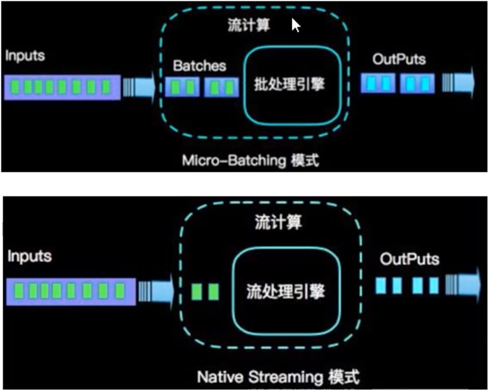
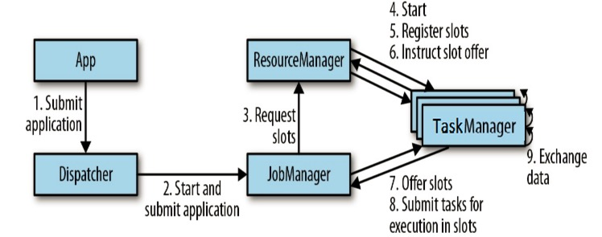
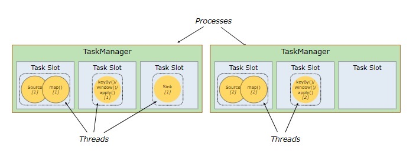
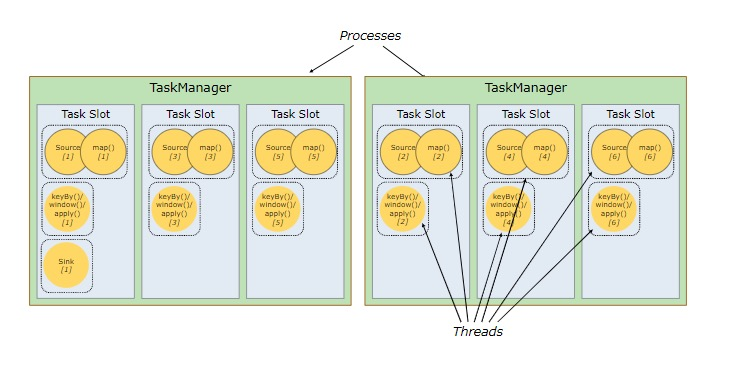
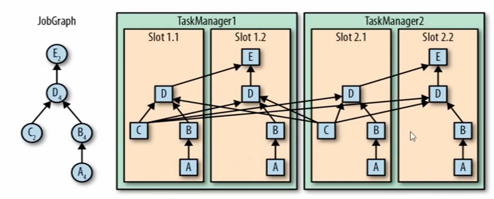

#   概述

## Flink的优势

* Apache Flink 是一个分布式大数据处理引擎，可对有限数据流和无限数据流进行有状态或无状态的计算，能够部署在各种集群环境，对各种规模大小的数据进行快速计算。
* 有状态的计算，状态容错性依赖于checkpoint机制做状态持久化存储。
* 多层API(Table/SQL API、DataStream/DataSet API、ProcessFunction API)
* exactly-once语义，状态一致性保证
* 低延迟，每秒处理数百万个event，毫秒级别延迟。

## 流处理架构演变

### lambda架构

* 俩套系统，同时保证低延迟和结果准确。


* 开发维护、迭代比较麻烦，涉及到离线数仓和实时数仓的异构架构，难度偏大。

## Flink和SparkStreaming区别

* stream and micro-batching(流和微批)



* 数据模型
  * spark采用RDD模型，spark Streaming的DStream相当于对RDD序列的操作，是一小批一小批的RDD集合统称为DStream(离散流)
  * flink基本数据模型是数据流，以及事件序列。
* 运行时架构
  * spark是批计算，将DAG划分为不同的stage，一个stage完成后才可以计算下一个，通过BFS（广度优先搜索）方式进行调度。
  * flink是标准的流执行模式，一个事件在一个节点处理完后可以直接发往下一个节点进行处理，operator粒度

# Flink集群架构

## 核心组件

按照上面的介绍，Flink 核心架构的第二层是 Runtime 层， 该层采用标准的 **Master - Slave** 结构， 其中，Master 部分又包含了三个核心组件：**Dispatcher、ResourceManager 和 JobManager**，而 Slave 则主要是 **TaskManager** 进程。它们的功能分别如下：

- **JobManagers** (也称为 *masters*) ：JobManagers 接收由 Dispatcher 传递过来的执行程序，该执行程序包含了作业图 (JobGraph)，逻辑数据流图 (logical dataflow graph) 及其所有的 classes 文件以及第三方类库 (libraries) 等等 。紧接着 JobManagers 会将 JobGraph 转换为执行图 (ExecutionGraph)，然后向 ResourceManager 申请资源来执行该任务，一旦申请到资源，就将执行图分发给对应的 TaskManagers 。因此每个作业 (Job) 至少有一个 JobManager；高可用部署下可以有多个 JobManagers，其中一个作为 *leader*，其余的则处于 *standby* 状态。
- **TaskManagers** (也称为 *workers*) : TaskManagers 负责实际的子任务 (subtasks) 的执行，每个 TaskManagers 都拥有一定数量的 slots。Slot 是一组固定大小的资源的合集 (如计算能力，存储空间)。TaskManagers 启动后，会将其所拥有的 slots 注册到 ResourceManager 上，由 ResourceManager 进行统一管理。
- **Dispatcher**：负责接收客户端提交的执行程序，并传递给 JobManager 。除此之外，它还提供了一个 WEB UI 界面，用于监控管理作业的执行情况(Flink Web UI)。
- **ResourceManager** ：负责管理 slots 并协调集群资源。ResourceManager 接收来自 JobManager 的资源请求，并将存在空闲 slots 的 TaskManagers 分配给 JobManager 执行任务。Flink 基于不同的部署平台，如 YARN , Mesos，K8s 等提供了不同的资源管理器，当 TaskManagers 没有足够的 slots 来执行任务时，它会向第三方平台发起会话来请求额外的资源。



## Task & SubTask

上面我们提到：TaskManagers 实际执行的是 `SubTask`，而不是` Task`，这里解释一下两者的区别：

* 在执行分布式计算时，Flink 将可以将的算子 (operators) 链接到一起，这就是 Task。之所以这样做， 是为了**减少线程间切换和缓冲而导致的开销**，在降低延迟的同时可以提高整体的吞吐量。 但不是所有的 operator 都可以**被链接**，如下 keyBy 等操作会导致网络 shuffle 和重分区（类似于Spark根据宽窄依赖区分Stage），因此其就不能被链接(operator chain)，只能被单独作为一个 Task。  简单来说，一个 Task 就是一个可以链接的最小的算子链 (Operator Chains) 。如下图，source 和 map 算子被链接到一块，因此整个作业就只有三个 Task：

  

* 解释完 Task ，我们在解释一下什么是 SubTask，其准确的翻译是： *A subtask is one parallel slice of a task*，即**一个 Task 可以按照其并行度拆分为多个 SubTask**。如上图，source & map 具有两个并行度，KeyBy 具有两个并行度，Sink 具有一个并行度，因此整个虽然只有 3 个 Task，但是却有 5 个 SubTask。Jobmanager 负责定义和拆分这些 SubTask，并将其交给 Taskmanagers 来执行，每个 SubTask 都是一个**单独的线程**。

## 资源管理

理解了 SubTasks ，我们再来看看其与 Slots 的对应情况。一种可能的分配情况如下：



* 这时每个 SubTask 线程运行在一个独立的 TaskSlot， 它们共享所属的 TaskManager 进程的TCP 连接（通过多路复用技术）和心跳信息 (heartbeat messages)，从而可以降低整体的性能开销。此时看似是最好的情况，但是每个操作需要的资源都是不尽相同的，这里假设该作业 keyBy 操作所需资源的数量比 Sink 多很多 ，那么此时 Sink 所在 Slot 的资源就没有得到有效的利用。
* 基于这个原因，Flink 允许多个 subtasks **共享 slots**，即使它们是不同 tasks 的 subtasks，但只要它们来自同一个 Job 就可以。假设上面 souce & map 和 keyBy 的并行度调整为 6，而 Slot 的数量不变，此时情况如下：



* 可以看到一个 Task Slot 中运行了多个 SubTask ，此时每个subtask仍然在一个独立的线程中执行，只不过共享一组 Sot 资源而已。那么 Flink 到底如何确定一个 Job 至少需要多少个 Slot 呢？Flink 对于这个问题的处理很简单，默认情况一个 Job 所需要的 Slot 的数量就等于其 Operation 操作的**最高并行度**。如下， A，B，D 操作的并行度为 4，而 C，E 操作的并行度为 2，那么此时整个 Job 就需要至少四个 Slots 来完成。通过这个机制，Flink 就可以不必去关心一个 Job 到底会被拆分为多少个 Tasks 和 SubTasks。


* 资源比例：1 task: n subtask, 1 subtask: 1 slot,但是可以存在slot共享的情况，如果subtask对应的并行度**一直不存在shuffle情况则可以共享一个slot**。

## 组件通讯

* Flink 的所有组件都基于 Actor System 来进行通讯。Actor system是多种角色的 actor 的容器，它提供调度，配置，日志记录等多种服务，并包含一个可以启动所有 actor 的线程池，如果 actor 是本地的，则消息通过共享内存进行共享，但如果 actor 是远程的，则通过 RPC 的调用来传递消息。


# Flink安装

* 基于Flink1.10.x之前，Flink1.10.x之后请参考官方文档

## Local部署模式

* 安装JDK
* 下载flink对应版本压缩包
* 进入flink/bin目录下，运行start-cluster.sh命令
* 访问localhost:8081启动集群

## Standalone模式

* 配置ssh免密登录

### flink-conf.yaml

```yaml
# 配置javahome
env.java.home: /Library/Java/JavaVirtualMachines/jdk1.8.0_221.jdk/Contents/Home
# 配置master节点
jobmanager.rpc.address: hadoop
# 配置每个节点运行申请的最大的jobmanager内存和taskmanager内存
jobmanager.memory.process.size: 8096mb
taskmanager.memory.process.size: 2048mb
```

### workes配置

```shell
# 将worker节点ip地址配置在此文件中
hadoop1
hadoop2
```

### 集群命令

```shell
# 启动集群
bin/start-cluster.sh和bin/stop-cluster.sh
## 添加jm
bin/jobmanager.sh ((start|start-foreground) [host] [webui-port])|stop|stop-all
## 添加tm
bin/taskmanager.sh start|start-foreground|stop|stop-all
```

## Yarn模式

### 前置条件

```shell
# 环境变量中配置HADOOP_CLASSPATH
export HADOOP_CLASSPATH=/Users/babywang/Documents/reserch/studySummary/module/hadoop-2.8.5/etc/hadoop:/Users/babywang/Documents/reserch/studySummary/module/hadoop-2.8.5/share/hadoop/common/lib/*:/Users/babywang/Documents/reserch/studySummary/module/hadoop-2.8.5/share/hadoop/common/*:/Users/babywang/Documents/reserch/studySummary/module/hadoop-2.8.5/share/hadoop/hdfs:/Users/babywang/Documents/reserch/studySummary/module/hadoop-2.8.5/share/hadoop/hdfs/lib/*:/Users/babywang/Documents/reserch/studySummary/module/hadoop-2.8.5/share/hadoop/hdfs/*:/Users/babywang/Documents/reserch/studySummary/module/hadoop-2.8.5/share/hadoop/yarn/lib/*:/Users/babywang/Documents/reserch/studySummary/module/hadoop-2.8.5/share/hadoop/yarn/*:/Users/babywang/Documents/reserch/studySummary/module/hadoop-2.8.5/share/hadoop/mapreduce/lib/*:/Users/babywang/Documents/reserch/studySummary/module/hadoop-2.8.5/share/hadoop/mapreduce/*:/Users/babywang/Documents/reserch/studySummary/module/hadoop-2.8.5/contrib/capacity-scheduler/*.jar:/Users/babywang/Documents/reserch/studySummary/module/hbase/hbase-1.6.0/lib
```

* 下载`flink-shaded-hadoop-2-uber-2.8.3-10.0.jar`放在lib下，1.10.x版本之后无需再将hadoop相关jar放置在**flinkHome**的lib下

### Session模式

* Session-Cluster模式需要先启动集群，然后再提交作业，接着会向yarn申请一块空间后，资源永远保持不变。如果资源满了，下个作业就无法提交类似于standalone模式。
* 所有作业共享**Dispatcher和ResourceManager**，共享资源，适合小规模执行时间短的作业。

```shell
yarn-session.sh
Usage:
   Optional
     -at,--applicationType <arg>     设置yarn自定义applicationType
     -D <property=value>             use value for given property
     -d,--detached                   后台运行模式
     -h,--help                       Help for the Yarn session CLI.
     -id,--applicationId <arg>       Attach to running YARN session
     -j,--jar <arg>                  flink jar路径
     -jm,--jobManagerMemory <arg>    jm大小，单位mb
     -m,--jobmanager <arg>           Set to yarn-cluster to use YARN execution mode.
     -nl,--nodeLabel <arg>           指定yarn nodeLabel
     -nm,--name <arg>                设置自定义yarn applicationName
     -q,--query                      Display available YARN resources (memory, cores)
     -qu,--queue <arg>               指定运行队列
     -s,--slots <arg>                指定taskManager slot个数
     -t,--ship <arg>                 Ship files in the specified directory (t for transfer)
     -tm,--taskManagerMemory <arg>   设置tm大小，单位mb
     -yd,--yarndetached              If present, runs the job in detached mode (deprecated; use non-YARN specific option instead)
     -z,--zookeeperNamespace <arg>   Namespace to create the Zookeeper sub-paths for high availability mode
     
# 通过—D动态参数方式覆盖flink-conf.yaml中的默认值
yarn-session.sh -Dfs.overwrite-files=true -Dtaskmanager.memory.network.min=536346624.
```

* 提交任务

```shell
flink run 
	-c classname 启动的driver主类
	-C url 
	-d 指定运行job的模式为后台模式
	-n 不能重新执行savepoint的时候允许跳过
	-p 程序执行并行度
	-s 指定从某个savepoint路径恢复
	-t 执行模式， "collection", "remote", "local","kubernetes-session", "yarn-per-job", "yarn-session","yarn-application" and "kubernetes-application"
```

* `yarn.per-job-cluster.include-user-jar` 用户jar包

### Pre-Job-Cluster模式

* 整个Job会对应一个集群，每提交一个作业会根据自身的情况，都会单独向yarn申请资源，直到作业执行完成，一个作业的失败与否不会影响下一个作业的正常提交和运行。
* **独享Dispatcher和ResourceManager**，按需接受资源申请，适合规模大长时间运行的作业。

```shell
flink run -t yarn-per-job -c dev.learn.flink.base.StreamingJob -d -yat flink -yjm 1024m -ytm 2048m -ynm test -ys 10 -p 2 -n flink-learn-1.0-SNAPSHOT.jar 
```

### application模式

```shell
# 运行WordCount
flink run-application -t yarn-application -Djobmanager.memory.process.size=2048m -Dtaskmanager.memory.process.size=4096m  ./examples/batch/WordCount.jar
```

* `yarn.provided.lib.dirs`flink classpath jars

```shell
flink run-application -t yarn-application \
-Dyarn.provided.lib.dirs="hdfs://myhdfs/my-remote-flink-dist-dir" \
hdfs://myhdfs/jars/my-application.jar
```

* `yarn.application.priority`:设置提交顺序

## HA配置

### Standalone Cluster模式

* masters配置

```
hadoop:8081
hadoop:8082
```

* flink-conf.yaml配置

```yaml
# 高可用配置，默认是随机选择的
high-availability.jobmanager.port: 50000-50025
# 高可用模式配置
high-availability: zookeeper
# zookeeper配置
high-availability.zookeeper.quorum: hadoop:2181
# 高可用flink jobmanager存储zk ZNODE配置
high-availability.zookeeper.path.root: /flink
# jobManager元数据将保留在文件系统storageDir中，并且只有指向此状态的指针存储在ZooKeeper中。
high-availability.storageDir: hdfs:///flink1.11.1/ha/
```

* start-cluster.sh启动集群

### Yarn Cluster高可用

* yarn-site.xml

```xml
# 配置am的最大重试时间
<property>
  <name>yarn.resourcemanager.am.max-attempts</name>
  <value>4</value>
  <description>
    The maximum number of application master execution attempts.
  </description>
</property>
```

* flink-conf.yaml

```yaml
# application最大重试时间
yarn.application-attempts: 10
```

* 启动yarn cluster

```shell
yarn-session.sh -tm 2048m -jm 1024m -s 4 -d -nm test
```

# 运行原理剖析

## 运行时架构

### 运行时组件

#### JobManager

* 控制应用程序的主进程，每个应用程序会被一个不同的JobManager所控制执行。
* JobManger会先接收到执行的应用程序，这个应用程序包含：作业图(JobGrap)、逻辑数据流图(logic dataflow graph)和打包了所有的类、库和其他资源的jar包。
* JobManager会把JobGraph转换成一个物理执行图，这个图被叫做“执行图”（ExecutionGraph），转换成可以并行执行的任务。
* JobManager会向ResourceManager请求执行任务必要的资源，就是TaskManager所需的slot。一旦获取足够的资源，就会将执行图分发到真正运行它们的TaskManager上。运行过程中，JobManager负责所需要中央协调的操作，比如checkpoint、savepoint的元数据存储等。

#### TaskManager

* TaskManager中资源调度的最小单元是taskSlot。TaskManager中的taskSlot数表示并发处理任务的数量。
* flink的工作进程存在多个，每个存在多个slot，slot的个数限制了TaskManager并发执行任务的数量。
* 启动后TaskManager向ResourceManager注册它的slot，收到ResourceManager的指令后，TaskManager会将一个或多个slot提供给JobManager调用。JobManager可以向slot分配tasks来执行。
* 执行的过程中，一个TaskManager可以跟其他运行同一个应用程序的TaskManager交换数据。（跨TaskManger网络传输）

#### ResourceManager

* ResourceManager负责Flink集群中的资源取消/分配和供应-它管理taskslot，这些taskslot是Flink集群中资源调度的单位。 Flink为不同的环境（例如YARN，Mesos，Kubernetes和Standalone）实现了多个ResourceManager。 在独立设置中，ResourceManager只能分配可用TaskManager的slot，而不能自行启动新的TaskManager。

#### Dispatcher

* 可以跨作业运行，它为应用提交提供了REST接口。
* 当一个应用被提交执行时，分发器就会启动并将应用移交给一个JobManager。
* Dispatcher会启动一个Web UI，用来方便的展示和监听作业执行的信息。

### 作业提交流程

* 运行机制


* 任务调度


* Yarn提交流程

.jpg)

### 任务和算子调用链

* 对于分布式执行，Flink将operator subtask chain到一起，形成多个task。每个task由一个线程执行。将operator chain到任务中是一种有用的优化:**它减少了线程到线程的切换和缓冲开销，提高了总体吞吐量，同时减少了延迟**。
* 一个特定算子的subtask的个数被称之为其并行度(parallelism)。一般情况下，一个stream的并行度就是其所有算子中的最大并行度（`因为slot共享的原因`）。


### TaskManger和Slots

#### task和slot的关系

* Flink中每一个TaskManager都是一个JVM进程，它会在独立的线程上运行一个或多个subtask
* 为了控制一个TaskManager能接收多个task，TaskManager通过task slot来进行控制(一个TaskManager至少有一个slot)


#### slot共享

* 默认情况下，flink允许subtask共享slot，即使是不同task的subtask，这样的结果是一个slot可以保存作业的整个pipeline。
* 如果是同一步操作的并行subtask需要放到不同的slot，如果是先后发生的不同的subtask可以放在同一个slot中，实现slot的共享。
* 自定义slot共享组

```java
# 该算子之后的操作都放到一个共享的slot组里
.slotSharingGroup("a")
```


### 并行子任务的分配



## Flink执行分析

### 数据流(DataFlow)

* 运行时Flink上运行的程序会被映射成"逻辑数据流"(dataflows)，它包含了三个部分，sources、sink以及transformations。

### 执行图(ExecutionGraph)

* Flink的执行度分为4层:`StreamGraph->JobGraph->ExecutionGraph->物理执行图`
* **StreamGraph**:是根据用户通过 Stream API 编写的代码生成的最初的图。用来表示程序的拓扑结构。
* **JobGraph**：StreamGraph经过优化后生成了 JobGraph，提交给 JobManager 的数据结构。主要的优化为，将多个符合条件的节点 **chain 在一起作为一个节点**，这样可以减少数据在节点之间流动所需要的`序列化/反序列化/传输消耗`。**operator chain优化**
* **ExecutionGraph**：JobManager 根据 JobGraph 生成ExecutionGraph。**ExecutionGraph是JobGraph的并行化版本**，是调度层最核心的数据结构。**并行化task 拆分subtask**
* **物理执行图**：JobManager 根据 ExecutionGraph 对 Job 进行调度后，在各个TaskManager 上部署 Task 后形成的“图”，并不是一个具体的数据结构。


### 数据传输形式

* 一个程序中，不同的算子可能具有不同的并行度。
* 算子之间传输数据的形式可以是**one-to-one(forwarding)的模式**也可以是**redistributing(重分区)**的模式，具体是哪种形式取决于算子的种类。
  * one-to-one:stream维护着分区以及元素的顺序(比如source和map之间)。这意味着map算子的子任务看到的元素的个数以顺序跟source算子的subtask产生的元素的个数、顺序相同。map、filter、flatMap等算子都是one-to-one的对应关系，类似于Spark的map、flatmap、filter等同样类似于窄依赖。
  * redistributing:stream的分区会发生改变。每个算子的subtask根据所选择的trasnsformation发送数据到不同的目标任务。例如keyBy基于hashCode重分区、而broadcast和rebalance会随机重新分区，这些算子都会引起redistributing过程，而redistribute过程就类似于spark中的shuffle过程。

### 任务链(operator chains)

* Flink采用一种称为任务链的优化技术，可以在特定条件下减少本地通信的开销。为了满足任务链的要求，必须将两个或多个算子设为**相同的并行度，并通过本地转发(local forward)的方式**进行连接。
* `相同的并行度`的one-to-one操作，flink这样**相连的算子链接在一起形成一个task**，原来的算子成为里面的subtask。
* `并行度相同，并且是one-to-one`操作，可以将俩个task合并。


* 禁止合并任务链优化

```java
# 全局任务链切段
env.disableOperatorChaining()
# 切断算子任务链
datasource.uid("network-source").map(new WordCountMapFunction())
                .uid("map-id")
                .keyBy((KeySelector<Tuple2<String, Integer>, Object>) stringIntegerTuple2 -> stringIntegerTuple2.f0)
                .timeWindow(Time.seconds(30))
                .reduce(new SumReduceFunction()).disableChaining()
```

