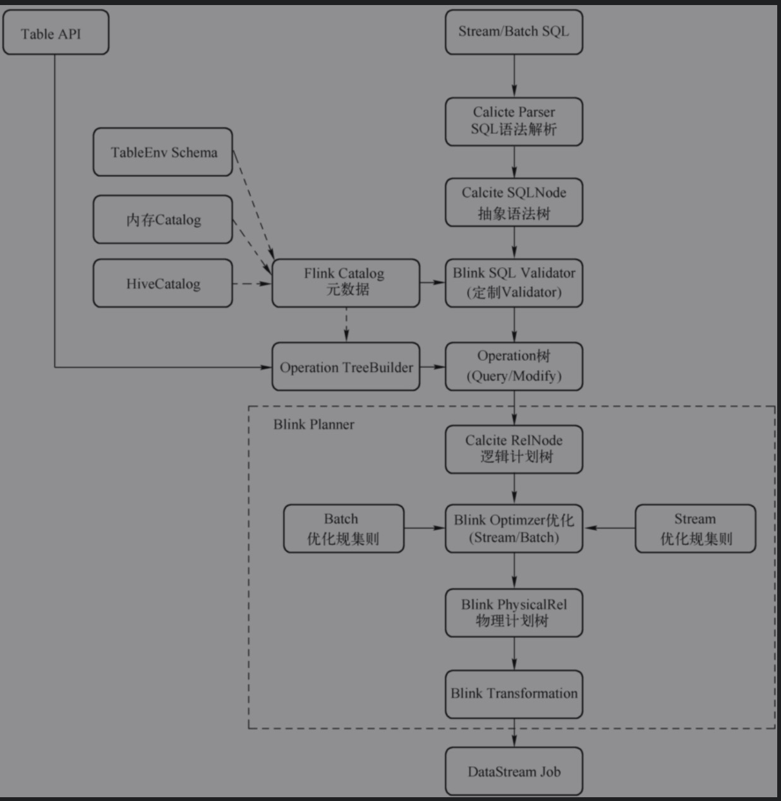
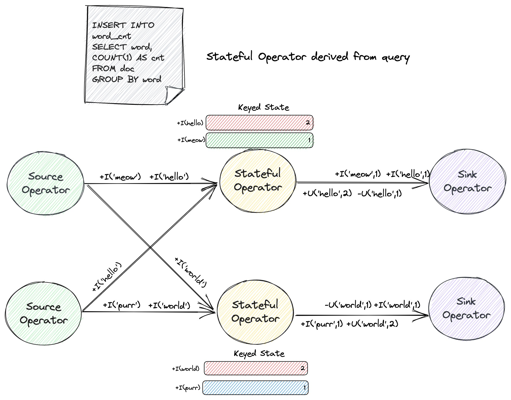
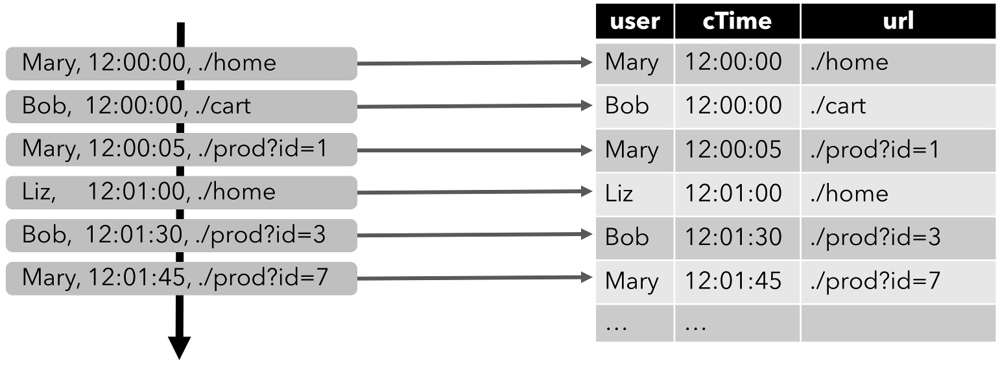
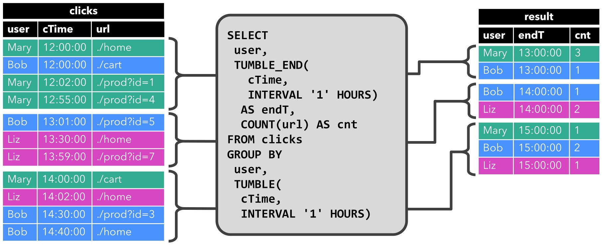
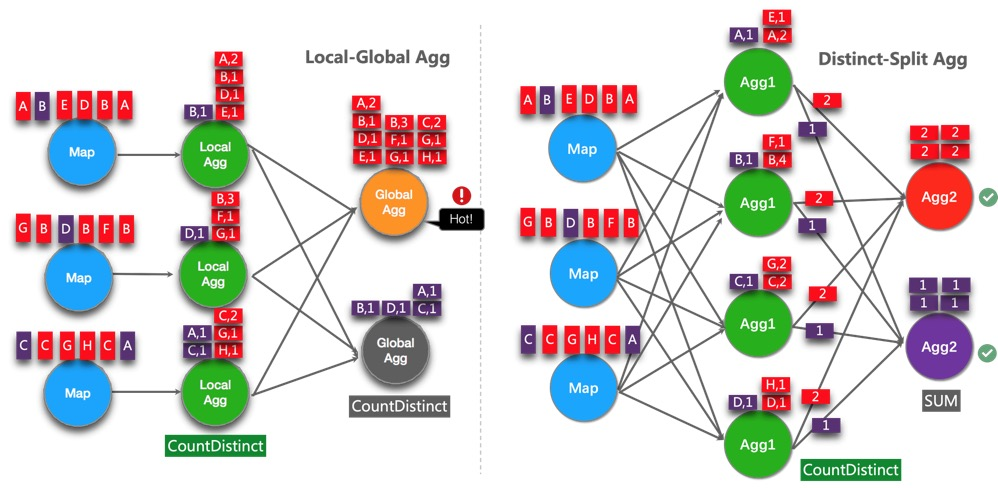
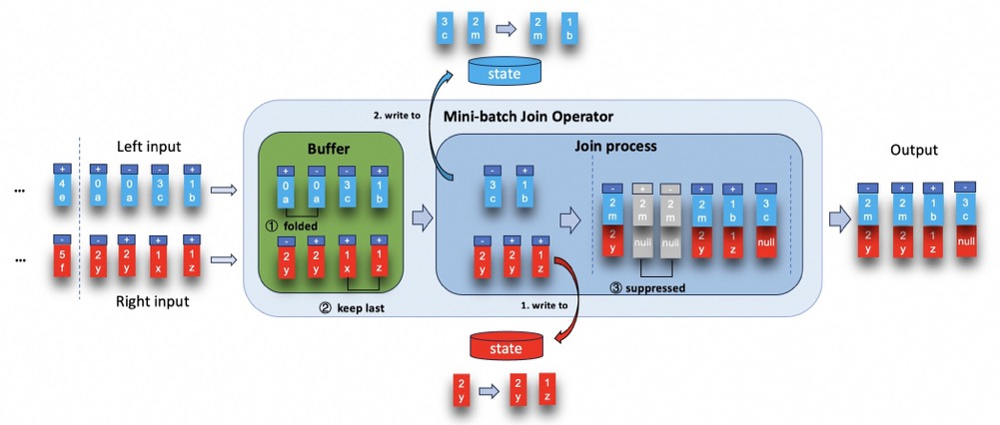
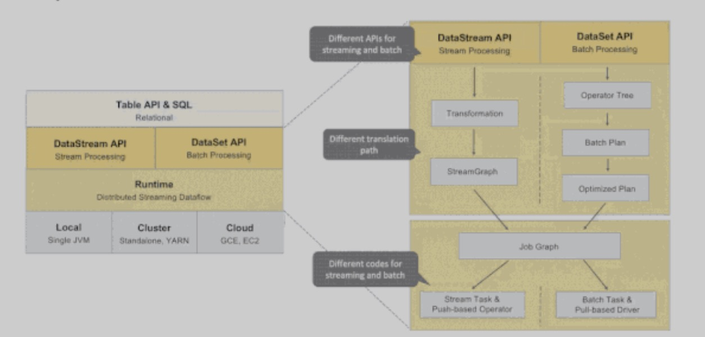
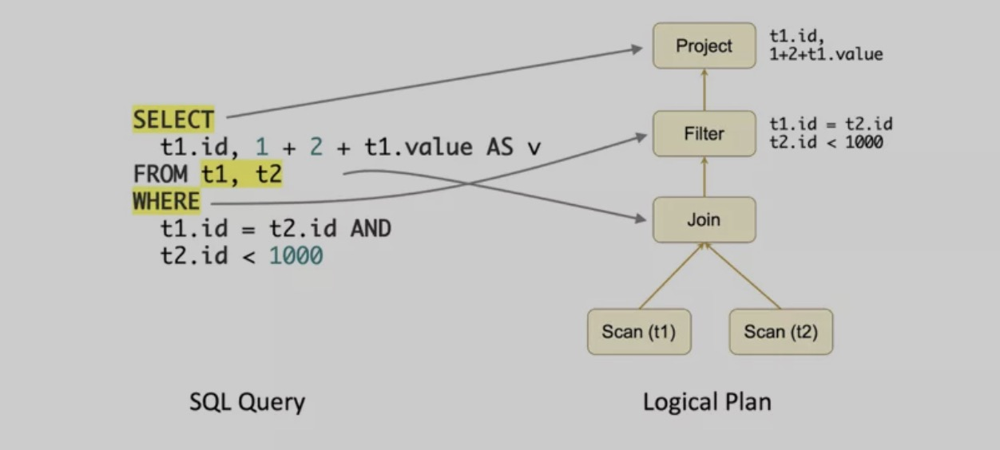
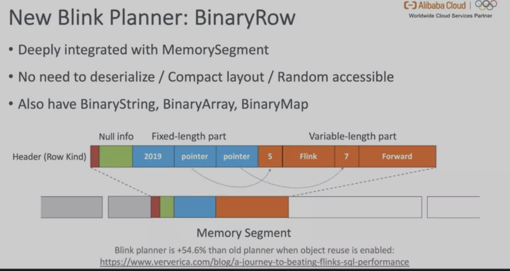

#  概览

## 基本程序结构



* Flink SQL基于Calcite实现，Calcite将SQL转换成关系代数或则通过Calcite提供的API直接创建它。
* Table API和SQL的程序结构，与流式处理的程序结构十分类似

```java
StreamExecutionEnvironment env = StreamExecutionEnvironment.getExecutionEnvironment();
        EnvironmentSettings settings = EnvironmentSettings.newInstance()
                .inStreamingMode()
                .useBlinkPlanner()
                .build();
StreamTableEnvironment tableEnvironment = StreamTableEnvironment.create(env,settings);
tableEnvironment.createTemporaryView();
Table table=tableEnvironment.from("tableName").select($("id"));
table.executeInsert()
```

## 创建TableEnvironment

* `TableEnvironment` 是 Table API 和 SQL 的核心概念。它负责:
  - 在内部的 catalog 中注册 `Table`
  - 注册外部的 catalog
  - 加载可插拔模块
  - 执行 SQL 查询
  - 注册自定义函数 （scalar、table 或 aggregation）
  - `DataStream` 和 `Table` 之间的转换(面向 `StreamTableEnvironment` )
* `Table` 总是与特定的 `TableEnvironment` 绑定。 不能在同一条查询中使用不同 TableEnvironment 中的表，例如，对它们进行 join 或 union 操作。 `TableEnvironment` 可以通过静态方法 `TableEnvironment.create()` 创建。

```java
          EnvironmentSettings settings = EnvironmentSettings
              .newInstance()
              .inStreamingMode()
              //.inBatchMode()
              .build();

          TableEnvironment tEnv = TableEnvironment.create(settings);
```

* 或者，用户可以从现有的 `StreamExecutionEnvironment` 创建一个 `StreamTableEnvironment` 与 `DataStream` API 互操作。

```java
import org.apache.flink.streaming.api.environment.StreamExecutionEnvironment;
import org.apache.flink.table.api.EnvironmentSettings;
import org.apache.flink.table.api.bridge.java.StreamTableEnvironment;

StreamExecutionEnvironment env = StreamExecutionEnvironment.getExecutionEnvironment();
StreamTableEnvironment tEnv = StreamTableEnvironment.create(env);
```

## 在Catalog中创建表

* `TableEnvironment` 维护着一个由标识符（identifier）创建的表 catalog 的映射。标识符由三个部分组成：catalog 名称、数据库名称以及对象名称。如果 catalog 或者数据库没有指明，就会使用当前默认值:"default_catalog"、"default_database"
* `Table` 可以是虚拟的（视图 `VIEWS`）也可以是常规的（表 `TABLES`）。视图 `VIEWS`可以从已经存在的`Table`中创建，一般是 Table API 或者 SQL 的查询结果。 表`TABLES`描述的是外部数据，例如文件、数据库表或者消息队列。

### 临时表（Temporary Table）和永久表（Permanent Table）

* 表可以是临时的，**并与单个 Flink 会话（session）的生命周期相关**，也可以是永久的，**并且在多个 Flink 会话和群集（cluster）中可见**。
* 永久表需要 [catalog](https://nightlies.apache.org/flink/flink-docs-release-1.19/zh/docs/dev/table/catalogs/)（例如 Hive Metastore）以维护表的元数据。**一旦永久表被创建，它将对任何连接到 catalog 的 Flink 会话可见且持续存在，直至被明确删除**。
* 临时表通常**保存于内存中并且仅在创建它们的 Flink 会话持续期间存在**。这些表对于其它会话是不可见的。它们不与任何 catalog 或者数据库绑定但可以在一个命名空间（namespace）中创建。即使它们对应的数据库被删除，临时表也不会被删除。

#### 屏蔽

* 可以使用与已存在的永久表相同的标识符去注册临时表。**临时表会屏蔽永久表，并且只要临时表存在，永久表就无法访问**。
* 这可能对实验（experimentation）有用。它允许先对一个临时表进行完全相同的查询，例如只有一个子集的数据，或者数据是不确定的。一旦验证了查询的正确性，就可以对实际的生产表进行查询。

### 创建表

#### 创建临时表

```java
// 创建 table 执行环境
TableEnvironment tableEnv = ...;

// 读取X表的xx字段
Table projTable = tableEnv.from("X").select(...);

// 注册X表的结果projTable为临时表projectedTable
tableEnv.createTemporaryView("projectedTable", projTable);
```

**注意：** 从传统数据库系统的角度来看，`Table` 对象与 `VIEW` 视图非常像。也就是，定义了 `Table` 的查询是没有被优化的， 而且会被内嵌到另一个引用了这个注册了的 `Table`的查询中。如果多个查询都引用了同一个注册了的`Table`，那么它会被内嵌每个查询中并被执行多次， 也就是说注册了的`Table`的结果**不会**被共享。

#### 通过Connector Tables

* Connector 描述了存储表数据的外部系统。存储系统例如 Apache Kafka 或者常规的文件系统都可以通过这种方式来声明。

```java
// 使用TableDescriptor定义datagen Connector表
final TableDescriptor sourceDescriptor = TableDescriptor.forConnector("datagen")
    .schema(Schema.newBuilder()
    .column("f0", DataTypes.STRING())
    .build())
    .option(DataGenConnectorOptions.ROWS_PER_SECOND, 100L)
    .build();

// 创建表
tableEnv.createTable("SourceTableA", sourceDescriptor);
tableEnv.createTemporaryTable("SourceTableB", sourceDescriptor);

// 使用DDL创建Connector表
tableEnv.executeSql("CREATE [TEMPORARY] TABLE MyTable (...) WITH (...)");
```

### 扩展表标识符

* 表通过三元标识符注册，包括 catalog 名、数据库名和表名。用户可以指定一个catalog和database作为当前catalog和database，后续读表只需要关注其下的表名即可。如果前两部分的标识符没有指定， 那么会使用当前的 catalog 和当前数据库。

```java
// 设置当前catalog和database
TableEnvironment tEnv = ...;
tEnv.useCatalog("custom_catalog");
tEnv.useDatabase("custom_database");

Table table = ...;


// custom_catalog的custom_database下注册exampleView临时表
tableEnv.createTemporaryView("exampleView", table);

// 在custom_catalog的other_database下注册exampleView临时表
tableEnv.createTemporaryView("other_database.exampleView", table);

// custom_catalog的custom_database下注册example.View临时表
tableEnv.createTemporaryView("`example.View`", table);

// 在other_catalog的other_database下注册exampleView临时表
tableEnv.createTemporaryView("other_catalog.other_database.exampleView", table);
```

## 查询表

* Table API

```java
// scan registered Orders table
Table orders = tableEnv.from("Orders");
// compute revenue for all customers from France
Table revenue = orders
  .filter($("cCountry").isEqual("FRANCE"))
  .groupBy($("cID"), $("cName"))
  .select($("cID"), $("cName"), $("revenue").sum().as("revSum"));
```

* SQL

```java
// 查询表
Table revenue = tableEnv.sqlQuery(
    "SELECT cID, cName, SUM(revenue) AS revSum " +
    "FROM Orders " +
    "WHERE cCountry = 'FRANCE' " +
    "GROUP BY cID, cName"
  );
// 插入数据
tableEnv.executeSql(
    "INSERT INTO RevenueFrance " +
    "SELECT cID, cName, SUM(revenue) AS revSum " +
    "FROM Orders " +
    "WHERE cCountry = 'FRANCE' " +
    "GROUP BY cID, cName"
  );
```

* Flink也支持Table API和SQL混用
  * 可以在 SQL 查询返回的 `Table` 对象上定义 Table API 查询。
  * 在 `TableEnvironment` 中注册的[结果表](https://nightlies.apache.org/flink/flink-docs-release-1.19/zh/docs/dev/table/common/#register-a-table)可以在 SQL 查询的 `FROM` 子句中引用，通过这种方法就可以在 Table API 查询的结果上定义 SQL 查询。

## 输出表

* `Table` 通过写入 `TableSink` 输出。`TableSink` 是一个通用接口，用于支持多种文件格式（如 CSV、Apache Parquet、Apache Avro）、存储系统（如 JDBC、Apache HBase、Apache Cassandra、Elasticsearch）或消息队列系统（如 Apache Kafka、RabbitMQ）。
* 批处理 `Table` 只能写入 `BatchTableSink`，而流处理 `Table` 需要指定写入 `AppendStreamTableSink`，`RetractStreamTableSink` 或者 `UpsertStreamTableSink`。
* `Table.insertInto(String tableName)` 定义了一个完整的端到端管道将源表中的数据传输到一个被注册的输出表中。 该方法通过名称在 catalog 中查找输出表并确认 `Table` schema 和输出表 schema 一致。 可以通过方法 `TablePipeline.explain()` 和 `TablePipeline.execute()` 分别来解释和执行一个数据流管道。

```java
// 定义schema
final Schema schema = Schema.newBuilder()
    .column("a", DataTypes.INT())
    .column("b", DataTypes.STRING())
    .column("c", DataTypes.BIGINT())
    .build();

// 创建csv格式的table sink
tableEnv.createTemporaryTable("CsvSinkTable", TableDescriptor.forConnector("filesystem")
    .schema(schema)
    .option("path", "/path/to/file")
    .format(FormatDescriptor.forFormat("csv")
        .option("field-delimiter", "|")
        .build())
    .build());

// 输入结果表
Table result = ...;

// 结果表写csv table sink
TablePipeline pipeline = result.insertInto("CsvSinkTable");

// 打印执行计划
pipeline.printExplain();

// 执行etl任务
pipeline.execute();
```

## explain与execute

* 不论输入数据源是流式的还是批式的，Table API 和 SQL 查询都会被转换成 [DataStream](https://nightlies.apache.org/flink/flink-docs-release-1.19/zh/docs/dev/datastream/overview/) 程序。 查询在内部表示为逻辑查询计划，并被翻译成两个阶段：
  * 优化逻辑执行计划
  * 翻译成 DataStream程序

* Table API 或者 SQL 查询在下列情况下会被翻译：

  - 当 `TableEnvironment.executeSql()` 被调用时。该方法是用来执行一个 SQL 语句，一旦该方法被调用， SQL 语句立即被翻译。

  - 当 `TablePipeline.execute()` 被调用时。该方法是用来执行一个源表到输出表的数据流，一旦该方法被调用， TABLE API 程序立即被翻译。

  - 当 `Table.execute()` 被调用时。该方法是用来将一个表的内容收集到本地，一旦该方法被调用， TABLE API 程序立即被翻译。

  - 当 `StatementSet.execute()` 被调用时。`TablePipeline` （通过 `StatementSet.add()` 输出给某个 `Sink`）和 INSERT 语句 （通过调用 `StatementSet.addInsertSql()`）会先被缓存到 `StatementSet` 中，`StatementSet.execute()` 方法被调用时，所有的 sink 会被优化成一张有向无环图。

  - 当 `Table` 被转换成 `DataStream` 时。转换完成后，它就成为一个普通的 DataStream 程序，并会在调用 `StreamExecutionEnvironment.execute()` 时被执行。

## 查询优化

* Apache Flink **使用并扩展了 Apache Calcite 来执行复杂的查询优化**。 这包括一系列基于规则和成本的优化，例如：

  - 基于 Apache Calcite 的子查询解相关

  - 投影剪裁 （Projection）

  - 分区剪裁

  - 过滤器下推 （PushDown）

  - 子计划消除重复数据以避免重复计算

  - 特殊子查询重写，包括两部分：
    - 将 IN 和 EXISTS 转换为 left semi-joins
    - 将 NOT IN 和 NOT EXISTS 转换为 left anti-join

  - 可选 join 重新排序
    - 通过 `table.optimizer.join-reorder-enabled` 启用

**注意：** 当前仅在子查询重写的结合条件下支持 IN / EXISTS / NOT IN / NOT EXISTS。

* 优化器不仅基于计划，而且还基于可从数据源获得的丰富统计信息以及每个算子（例如 io，cpu，网络和内存）的细粒度成本来做出明智的决策。
* 高级用户可以通过 `CalciteConfig` 对象提供自定义优化，可以通过调用 `TableEnvironment＃getConfig＃setPlannerConfig` 将其提供给 TableEnvironment。

## 查看执行计划

* Table API可以通过`Table.explain()` 方法或者 `StatementSet.explain()` 方法来查看对应的执行计划，`Table.explain()` 返回一个 Table 的计划。`StatementSet.explain()` 返回多 sink 计划的结果。它返回一个描述三种计划的字符串：
  * 关系查询的抽象语法树（the Abstract Syntax Tree），即未优化的逻辑查询计划，
  * 优化的逻辑查询计划，以及
  * 物理执行计划。

```java
StreamExecutionEnvironment env = StreamExecutionEnvironment.getExecutionEnvironment();
StreamTableEnvironment tEnv = StreamTableEnvironment.create(env);

DataStream<Tuple2<Integer, String>> stream1 = env.fromElements(new Tuple2<>(1, "hello"));
DataStream<Tuple2<Integer, String>> stream2 = env.fromElements(new Tuple2<>(1, "hello"));

// explain Table API
Table table1 = tEnv.fromDataStream(stream1, $("count"), $("word"));
Table table2 = tEnv.fromDataStream(stream2, $("count"), $("word"));
Table table = table1
  .where($("word").like("F%"))
  .unionAll(table2);

System.out.println(table.explain());

// Explain执行计划
== Abstract Syntax Tree ==
LogicalUnion(all=[true])
:- LogicalFilter(condition=[LIKE($1, _UTF-16LE'F%')])
:  +- LogicalTableScan(table=[[Unregistered_DataStream_1]])
+- LogicalTableScan(table=[[Unregistered_DataStream_2]])

== Optimized Physical Plan ==
Union(all=[true], union=[count, word])
:- Calc(select=[count, word], where=[LIKE(word, _UTF-16LE'F%')])
:  +- DataStreamScan(table=[[Unregistered_DataStream_1]], fields=[count, word])
+- DataStreamScan(table=[[Unregistered_DataStream_2]], fields=[count, word])

== Optimized Execution Plan ==
Union(all=[true], union=[count, word])
:- Calc(select=[count, word], where=[LIKE(word, _UTF-16LE'F%')])
:  +- DataStreamScan(table=[[Unregistered_DataStream_1]], fields=[count, word])
+- DataStreamScan(table=[[Unregistered_DataStream_2]], fields=[count, word])
```

## DataStream API整合

### Table和Datastream转换

#### 依赖

```xml
<dependency>
  <groupId>org.apache.flink</groupId>
  <artifactId>flink-table-api-java-bridge_2.12</artifactId>
  <version>1.19.0</version>
  <scope>provided</scope>
</dependency>
```

#### import

```java
// imports for Java DataStream API
import org.apache.flink.streaming.api.*;
import org.apache.flink.streaming.api.environment.*;

// imports for Table API with bridging to Java DataStream API
import org.apache.flink.table.api.*;
import org.apache.flink.table.api.bridge.java.*;
```

#### append-only和insert-only的stream-to-table

```java
// create environments of both APIs
StreamExecutionEnvironment env = StreamExecutionEnvironment.getExecutionEnvironment();
StreamTableEnvironment tableEnv = StreamTableEnvironment.create(env);

// create a DataStream
DataStream<String> dataStream = env.fromElements("Alice", "Bob", "John");

// interpret the insert-only DataStream as a Table
Table inputTable = tableEnv.fromDataStream(dataStream);

// register the Table object as a view and query it
tableEnv.createTemporaryView("InputTable", inputTable);
Table resultTable = tableEnv.sqlQuery("SELECT UPPER(f0) FROM InputTable");

// interpret the insert-only Table as a DataStream again
DataStream<Row> resultStream = tableEnv.toDataStream(resultTable);

// add a printing sink and execute in DataStream API
resultStream.print();
env.execute();

// prints:
// +I[ALICE]
// +I[BOB]
// +I[JOHN]
```

#### changlog的stream-to-table

```java
// create environments of both APIs
StreamExecutionEnvironment env = StreamExecutionEnvironment.getExecutionEnvironment();
StreamTableEnvironment tableEnv = StreamTableEnvironment.create(env);

// create a DataStream
DataStream<Row> dataStream = env.fromElements(
    Row.of("Alice", 12),
    Row.of("Bob", 10),
    Row.of("Alice", 100));

// interpret the insert-only DataStream as a Table
Table inputTable = tableEnv.fromDataStream(dataStream).as("name", "score");

// register the Table object as a view and query it
// the query contains an aggregation that produces updates
tableEnv.createTemporaryView("InputTable", inputTable);
Table resultTable = tableEnv.sqlQuery(
    "SELECT name, SUM(score) FROM InputTable GROUP BY name");

// interpret the updating Table as a changelog DataStream
DataStream<Row> resultStream = tableEnv.toChangelogStream(resultTable);

// add a printing sink and execute in DataStream API
resultStream.print();
env.execute();

// prints:
// +I[Alice, 12]
// +I[Bob, 10]
// -U[Alice, 12]
// +U[Alice, 112]
```

# 流式概念

## 流式概念

* Flink的Table API和SQL是流批一体API，这就表示Table API&SQL在无论有限的批式输入还是无限的流式输入下，都具有相同的语义。

### 状态管理

* 流模式下运行的表利用Flink作为有状态处理器的所有能力，一个表程序可以配置一个state backend和多个不同的checkpoint配置以处理对不同状态大小和容错需求，这可以对正在运行的Table API&SQL管道生产Savepoint，并在之后恢复应用程序的状态。

#### 状态使用

* 由于 Table API & SQL 程序是声明式的，管道内的状态会在哪以及如何被使用并不明确。 Planner 会确认是否需要状态来得到正确的计算结果， 管道会被现有优化规则集优化成尽可能少地使用状态。

##### **状态算子**

* 包含join、聚合或去重等操作的SQL语句都需要在Flink中保存状态结果
  * 例如对两个表进行join操作的普调SQL需要算子保存两个表的全部输入，基于正确的SQL语义，运行时假设两表会在任意时间点进行匹配。Flink提供了优化窗口和internval join聚合来利用watermarks概念来保持较小的状态存储。
  * 聚合方式计算词频，案例如下：`word` 是用于分组的键，连续查询（Continuous Query）维护了每个观察到的 `word` 次数。 输入 `word` 的值随时间变化。由于这个查询一直持续，Flink 会为每个 `word` 维护一个中间状态来保存当前词频，因此总状态量会随着 `word` 的发现不断地增长。

```sql
CREATE TABLE doc (
    word STRING
) WITH (
    'connector' = '...'
);
CREATE TABLE word_cnt (
    word STRING PRIMARY KEY NOT ENFORCED,
    cnt  BIGINT
) WITH (
    'connector' = '...'
);

INSERT INTO word_cnt
SELECT word, COUNT(1) AS cnt
FROM doc
GROUP BY word;
```

* 例如`SELECT .... FROM .... WHERE`这种场景的源表的消息类型只包含 *INSERT*，*UPDATE_AFTER* 和 *DELETE*，然而下游要求完整的 changelog（包含 *UPDATE_BEFORE*）。 所以虽然查询本身没有包含状态计算，但是优化器依然隐式地推导出了一个 ChangelogNormalize 状态算子来生成完整的 changelog。

##### 状态空闲维持时间

* 通过`table.exec.state.ttl`来定义状态的键在被更新后要保持多长时间才被移除。例如上述案例word的数目会在配置的时间内未更新时立刻被移除。通过移除状态的键，连续查询会完全忘记历史的键，如果一个状态带有历史被移除状态的键，这条记录将被认为是对应键的第一条记录，例如上述统计词频的cnt将被设置为0开始重新计数；

##### 指定状态TTL的不同方式

| 配置方式                           | TableAPI/SQL 支持    | 生效范围                                                     | 优先级                                                       |
| :--------------------------------- | :------------------- | :----------------------------------------------------------- | :----------------------------------------------------------- |
| SET 'table.exec.state.ttl' = '...' | **TableAPI** **SQL** | 作业粒度，默认情况下所有状态算子都会使用该值控制状态生命周期 | 默认配置，可被覆盖                                           |
| SELECT /*+ STATE_TTL(...) */ ...   | **SQL**              | 有限算子粒度，当前支持连接和分组聚合算子                     | 该值将会优先作用于相应算子的状态生命周期。查阅[状态生命周期提示](https://nightlies.apache.org/flink/flink-docs-release-1.19/zh/docs/dev/table/sql/queries/hints/#状态生命周期提示)获取更多信息。 |
| 修改序列化为 JSON 的 CompiledPlan  | **TableAPI** **SQL** | 通用算子粒度, 可修改任一状态算子的生命周期                   | table.exec.state.ttl 和 STATE_TTL 的值将会序列化到 CompiledPlan，如果作业使用 CompiledPlan 提交，则最终生效的生命周期由最后一次修改的状态元数据决定。 |

##### 配置算子状态粒度的TTL

* 从 Flink v1.18 开始，Table API & SQL 支持配置细粒度的状态 TTL 来优化状态使用，可配置粒度为每个状态算子的入边数。具体而言，`OneInputStreamOperator` 可以配置一个状态的 TTL，而 `TwoInputStreamOperator`（例如双流 join）则可以分别为左状态和右状态配置 TTL。更一般地，对于具有 K 个输入的 `MultipleInputStreamOperator`，可以配置 K 个状态 TTL。

  - 为 [双流 Join](https://nightlies.apache.org/flink/flink-docs-release-1.19/zh/docs/dev/table/sql/queries/joins/#regular-joins) 的左右流配置不同 TTL。 双流 Join 会生成拥有两条输入边的 `TwoInputStreamOperator` 的状态算子，它用到了两个状态，分别来保存来自左流和右流的更新。

  - 在同一个作业中为不同的状态计算设置不同 TTL。 举例来说，假设一个 ETL 作业使用 `ROW_NUMBER` 进行[去重](https://nightlies.apache.org/flink/flink-docs-release-1.19/zh/docs/dev/table/sql/queries/deduplication/)操作后， 紧接着使用 `GROUP BY` 语句进行[聚合](https://nightlies.apache.org/flink/flink-docs-release-1.19/zh/docs/dev/table/sql/queries/group-agg/)操作。 该作业会分别生成两个拥有单条输入边的 `OneInputStreamOperator` 状态算子。您可以为去重算子和聚合算子的状态分别设置不同的 TTL。

**生成Compiled Plan**

> COMPILE PLAN不支持查询语句SELECT....FROM...

* 指定`COMPILE PLAN`语句

```java
TableEnvironment tableEnv = TableEnvironment.create(EnvironmentSettings.inStreamingMode());
tableEnv.executeSql(
    "CREATE TABLE orders (order_id BIGINT, order_line_id BIGINT, buyer_id BIGINT, ...)");
tableEnv.executeSql(
    "CREATE TABLE line_orders (order_line_id BIGINT, order_status TINYINT, ...)");
tableEnv.executeSql(
    "CREATE TABLE enriched_orders (order_id BIGINT, order_line_id BIGINT, order_status TINYINT, ...)");

// CompilePlan#writeToFile only supports a local file path, if you need to write to remote filesystem,
// please use tableEnv.executeSql("COMPILE PLAN 'hdfs://path/to/plan.json' FOR ...")
CompiledPlan compiledPlan = 
    tableEnv.compilePlanSql(
        "INSERT INTO enriched_orders \n" 
       + "SELECT a.order_id, a.order_line_id, b.order_status, ... \n" 
       + "FROM orders a JOIN line_orders b ON a.order_line_id = b.order_line_id");

compiledPlan.writeToFile("/path/to/plan.json");
```

* SQL语法,该语句会在指定位置 `/path/to/plan.json` 生成一个 JSON 文件。

```sql
COMPILE PLAN [IF NOT EXISTS] <plan_file_path> FOR <insert_statement>|<statement_set>;

statement_set:
    EXECUTE STATEMENT SET
    BEGIN
    insert_statement;
    ...
    insert_statement;
    END;

insert_statement:
    <insert_from_select>|<insert_from_values>
```

**修改 Compiled Plan**

* 每个状态算子会显式地生成一个名为 “state” 的 JSON 数组，具有如下结构。 理论上一个拥有 k 路输入的状态算子拥有 k 个状态。

```json
"state": [
    {
      "index": 0,
      "ttl": "0 ms",
      "name": "${1st input state name}"
    },
    {
      "index": 1,
      "ttl": "0 ms",
      "name": "${2nd input state name}"
    },
    ...
  ]
```

* 找到您需要修改的状态算子，将 TTL 的值设置为一个正整数，注意需要带上时间单位毫秒。举例来说，如果想将当前状态算子的 TTL 设置为 1 小时，您可以按照如下格式修改 JSON：

```json
{
  "index": 0,
  "ttl": "3600000 ms",
  "name": "${1st input state name}"
}
```

* 保存好文件，然后使用 `EXECUTE PLAN` 语句来提交作业。理论上，**下游状态算子的 TTL 不应小于上游状态算子的 TTL**。

**执行 Compiled Plan**

* `EXECUTE PLAN` 语句将会反序列化上述 JSON 文件，进一步生成 JobGraph 并提交作业。 通过 `EXECUTE PLAN` 语句提交的作业，其状态算子的 TTL 的值将会从文件中读取，配置项 `table.exec.state.ttl` 的值将会被忽略。
* table API

```java
TableEnvironment tableEnv = TableEnvironment.create(EnvironmentSettings.inStreamingMode());
tableEnv.executeSql(
    "CREATE TABLE orders (order_id BIGINT, order_line_id BIGINT, buyer_id BIGINT, ...)");
tableEnv.executeSql(
    "CREATE TABLE line_orders (order_line_id BIGINT, order_status TINYINT, ...)");
tableEnv.executeSql(
    "CREATE TABLE enriched_orders (order_id BIGINT, order_line_id BIGINT, order_status TINYINT, ...)");

// PlanReference#fromFile only supports a local file path, if you need to read from remote filesystem,
// please use tableEnv.executeSql("EXECUTE PLAN 'hdfs://path/to/plan.json'").await();
tableEnv.loadPlan(PlanReference.fromFile("/path/to/plan.json")).execute().await();
```

* SQL语法

```sql
EXECUTE PLAN [IF EXISTS] <plan_file_path>;
```

## 动态表(Dynamic Tables)

### DataStream上的关系查询

* 传统关系代数和流处理与输入数据、执行和输出结果的关系

| 关系代数 / SQL                                               | 流处理                                                     |
| ------------------------------------------------------------ | ---------------------------------------------------------- |
| 关系(或表)是有界(多)元组集合。                               | 流是一个无限元组序列。                                     |
| 对批数据(例如关系数据库中的表)执行的查询可以访问完整的输入数据。 | 流式查询在启动时不能访问所有数据，必须“等待”数据流入。     |
| 批处理查询在产生固定大小的结果后终止。                       | 流查询不断地根据接收到的记录更新其结果，并且始终不会结束。 |

* 尽管关系代数和流处理存在如上差异，但是使用关系代数/SQL查询流并不是不可能的，一些常见的开源OLAP引擎(例如Doris、Clickhouse)提供*物化视图(Materialized Views)* 的特性。物化视图**被定义为一条 SQL 查询，就像常规的虚拟视图一样。与虚拟视图相反，物化视图缓存查询的结果，因此在访问视图时不需要对查询进行计算**。缓存的一个常见难题是**防止缓存为过期的结果提供服务。当其定义查询的基表被修改时，物化视图将过期**。 *即时视图维护(Eager View Maintenance)* **是一种一旦更新了物化视图的基表就立即更新视图的技术**。
* 类比物化视图的思路，对于SQL查询流数据的前提如下：
  * 数据库表是 `INSERT`、`UPDATE` 和 `DELETE` DML 语句的 *stream* 的结果，通常称为 *changelog stream* 。
  * 物化视图被定义为一条 SQL 查询。为了更新视图，查询不断地处理视图的基本关系的changelog 流。
  * 物化视图是流式 SQL 查询的结果。

### 动态表和连续查询(Continuous Query)

* 动态表是Flink对流数据的Table API和SQL支持的核心概念。
* 与表示批处理数据的静态表不同，动态表随时间变化的。
* 动态表可以像静态的批处理表一样进行查询，查询一个动态表产生**持续查询(Continuous Query)**
* 连续查询永远不会终止，并会生成另一个动态表。
* 查询会不断更新其动态结果表，以反映动态输入表上的更改。本质上动态查询类似于定义物化视图的查询。

**流、动态表和连续查询的关系**


1. 将流转换为动态表。
2. 在动态表上计算一个连续查询，生成一个新的动态表。
3. 生成的动态表被转换回流。

**注意：** 动态表首先是一个逻辑概念。在查询执行期间不一定(完全)物化动态表。

### 在流上定义表

* 为了使用关系查询处理流，必须将其转换成 `Table`。从概念上讲，流的每条记录都被解释为对结果表的 `INSERT` 操作。本质上我们正在从一个 `INSERT`-only 的 changelog 流构建表。



**注意：**在流上定义的表在内部没有物化

#### 连续查询

* 在动态表上计算一个连续查询，并生成一个新的动态表。**与批处理查询不同，连续查询从不终止，并根据其输入表上的更新更新其结果表**。在任何时候，连续查询的结果在语义上与以批处理模式在输入表快照上执行的相同查询的结果相同。

**连续查询案例**

下图查询是一个简单的 `GROUP-BY COUNT` 聚合查询。它基于 `user` 字段对 `clicks` 表进行分组，并统计访问的 URL 的数量。下面的图显示了当 `clicks` 表被附加的行更新时，查询是如何被评估的。


* 当查询开始，`clicks` 表(左侧)是空的。当第一行数据被插入到 `clicks` 表时，查询开始计算结果表。第一行数据 `[Mary,./home]` 插入后，**结果表(右侧，上部)**由一行 `[Mary, 1]` 组成。当第二行 `[Bob, ./cart]` 插入到 `clicks` 表时，查询会更新结果表并插入了一行新数据 `[Bob, 1]`。第三行 `[Mary, ./prod?id=1]` 将产生已计算的结果行的更新，`[Mary, 1]` 更新成 `[Mary, 2]`。最后，当第四行数据加入 `clicks` 表时，查询将第三行 `[Liz, 1]` 插入到结果表中。

案例二与案例一类似，除了用户属性之外，还将clicks分组至每小时滚动窗口中，计算每小时url数量。



* 与前面一样，左边显示了输入表 `clicks`。查询每小时持续计算结果并更新结果表。clicks表包含四行带有时间戳(`cTime`)的数据，时间戳在 `12:00:00` 和 `12:59:59` 之间。查询从这个输入计算出两个结果行(每个 `user` 一个)，并将它们附加到结果表中。对于 `13:00:00` 和 `13:59:59` 之间的下一个窗口，`clicks` 表包含三行，这将导致另外两行被追加到结果表。随着时间的推移，更多的行被添加到 `click` 中，结果表将被更新。

#### 更新和追加查询

* 上述俩个SQL查询有一个不同点
  * SQL1查询更新先前输出的结果，即定义结果表的changelog流包含`INSERT`和`UPDATE`操作
  * SQL2查询只附加到结果表，即结果表的changelog流只包含`INSERT`操作。
* 一个查询是产生一个只追加的表还是一个更新的表有一些特性：
  * 产生更新更改的查询通常必须维护更多的状态。
  * 将 append-only 的表转换为流与将已更新的表转换为流是不同的。

#### 查询的限制

* 许多(但不是全部)语义上有效的查询可以作为流上的连续查询进行评估。有些查询代价太高而无法计算，这可能是由于它们**需要维护的状态大小，也可能是由于计算更新代价太高**。

  * **状态大小：** 连续查询在无界流上计算，通常应该运行数周或数月。因此，连续查询处理的数据总量可能非常大。必须更新先前输出的结果的查询需要维护所有输出的行，以便能够更新它们。例如，第一个查询示例需要存储每个用户的 URL 计数，以便能够增加该计数并在输入表接收新行时发送新结果。如果只跟踪注册用户，则要维护的计数数量可能不会太高。但是，如果未注册的用户分配了一个惟一的用户名，那么要维护的计数数量将随着时间增长，并可能最终导致查询失败。

    ```sql
    SELECT user, COUNT(url)
    FROM clicks
    GROUP BY user;
    ```

  - **计算更新：** 有些查询需要重新计算和更新大量已输出的结果行，即使只添加或更新一条输入记录。显然，这样的查询不适合作为连续查询执行。下面的查询就是一个例子，它根据最后一次单击的时间为每个用户计算一个 `RANK`。一旦 `click` 表接收到一个新行，用户的 `lastAction` 就会更新，并必须计算一个新的排名。然而，由于两行不能具有相同的排名，所以所有较低排名的行也需要更新。

    ```sql
    SELECT user, RANK() OVER (ORDER BY lastAction)
    FROM (
      SELECT user, MAX(cTime) AS lastAction FROM clicks GROUP BY user
    );
    ```

### 表到流的转换

* 动态表可以像普通数据库表一样通过 `INSERT`、`UPDATE` 和 `DELETE` 来不断修改。它可能是一个只有一行、不断更新的表，也可能是一个 insert-only 的表，没有 `UPDATE` 和 `DELETE` 修改，或者介于两者之间的其他表。
* 在将动态表转换为流或将其写入外部系统时，需要对这些更改进行编码。Flink的 Table API 和 SQL 支持三种方式来编码一个动态表的变化:
  * **Append-only 流：** 仅通过 `INSERT` 操作修改的动态表可以通过输出插入的行转换为流。
  * **Retract 流：** retract 流包含两种类型的 message： *add messages* 和 *retract messages* 。通过将`INSERT` 操作编码为 add message、将 `DELETE` 操作编码为 retract message、将 `UPDATE` 操作编码为更新(先前)行的 retract message 和更新(新)行的 add message，将动态表转换为 retract 流。下图显示了将动态表转换为 retract 流的过程。


- **Upsert 流:** upsert 流包含两种类型的 message： *upsert messages* 和*delete messages*。转换为 upsert 流的动态表需要(可能是组合的)唯一键。通过将 `INSERT` 和 `UPDATE` 操作编码为 upsert message，将 `DELETE` 操作编码为 delete message ，将具有唯一键的动态表转换为流。消费流的算子需要知道唯一键的属性，以便正确地应用 message。与 retract 流的主要区别在于 `UPDATE` 操作是用单个 message 编码的，不需要拆分为`retract message`和`add message`，因此效率更高。下图显示了将动态表转换为 upsert 流的过程。


## 时间属性

Flink基于几种不同的时间概念来处理数据

* **处理时间:**执行具体操作时的机器时间（大家熟知的绝对时间, 例如 Java的 `System.currentTimeMillis()`) ）
* **事件时间:**数据本身携带的时间。这个时间是在事件产生时的时间。
* **摄入时间:**数据进入 Flink 的时间；在系统内部，会把它当做事件时间来处理。

### 时间属性介绍

* 像窗口这种基于时间的操作，需要时间属性相关信息，因此Table API中的表需要提供`逻辑时间属性`来表示时间，以及支持时间相关的操作。
* 每种类型的表都可以有时间属性，可以在用*CREATE TABLE DDL*创建表的时候指定、也可以在 `DataStream` 中指定、也可以在定义 `TableSource` 时指定。一旦时间属性定义好，它就可以像普通列一样使用，也可以在时间相关的操作中使用。
* 只要时间属性没有被修改，而是简单地从一个表传递到另一个表，它就仍然是一个有效的时间属性。时间属性可以像普通的时间戳的列一样被使用和计算。一旦时间属性被用在了计算中，它就会被物化，进而变成一个普通的时间戳。普通的时间戳是无法跟 Flink 的时间以及watermark等一起使用的，所以普通的时间戳就无法用在时间相关的操作中。
* Table API 程序需要在 streaming environment 中指定时间属性：

```java
final StreamExecutionEnvironment env = StreamExecutionEnvironment.getExecutionEnvironment();

env.setStreamTimeCharacteristic(TimeCharacteristic.ProcessingTime);
// 或者:
// env.setStreamTimeCharacteristic(TimeCharacteristic.IngestionTime);
// env.setStreamTimeCharacteristic(TimeCharacteristic.EventTime);
```

### 处理时间

* 处理时间**基于机器的本地时间来处理数据**，它不能够提供确定性。它既不需要从数据里获取时间，也不需要生产watermark，有三种方式定义处理时间

#### **DDL中定义**

```sql
CREATE TABLE user_actions (
  user_name STRING,
  data STRING,
  user_action_time AS PROCTIME() -- 声明一个额外的列作为处理时间属性
) WITH (
  ...
);

SELECT TUMBLE_START(user_action_time, INTERVAL '10' MINUTE), COUNT(DISTINCT user_name)
FROM user_actions
GROUP BY TUMBLE(user_action_time, INTERVAL '10' MINUTE);
```

#### **DataStream转换Table时定义**

```java
DataStream<Tuple2<String, String>> stream = ...;

// 声明一个额外的字段作为时间属性字段
Table table = tEnv.fromDataStream(stream, $("user_name"), $("data"), 
// 定义处理时间
$("user_action_time").proctime());

WindowedTable windowedTable = table.window(
        Tumble.over(lit(10).minutes())
            .on($("user_action_time"))
            .as("userActionWindow"));
```

#### **使用TableSource定义**

```java
// 定义一个由处理时间属性的 table source
public class UserActionSource implements StreamTableSource<Row>, DefinedProctimeAttribute {

	@Override
	public TypeInformation<Row> getReturnType() {
		String[] names = new String[] {"user_name" , "data"};
		TypeInformation[] types = new TypeInformation[] {Types.STRING(), Types.STRING()};
		return Types.ROW(names, types);
	}

	@Override
	public DataStream<Row> getDataStream(StreamExecutionEnvironment execEnv) {
		// create stream
		DataStream<Row> stream = ...;
		return stream;
	}

	@Override
	public String getProctimeAttribute() {
		// 这个名字的列会被追加到最后，作为第三列
		return "user_action_time";
	}
}

// register table source
tEnv.registerTableSource("user_actions", new UserActionSource());

WindowedTable windowedTable = tEnv
	.from("user_actions")
	.window(Tumble
	    .over(lit(10).minutes())
	    .on($("user_action_time"))
	    .as("userActionWindow"));
```

### 事件时间

* 事件时间允许程序**按照数据中包含的时间来处理**，这样可以在有乱序或者晚到的数据的情况下产生一致的处理结果。它可以保证从外部存储读取数据后产生可以复现（replayable）的结果。
* 事件时间可以让程序在流式和批式作业中使用同样的语法。在流式程序中的事件时间属性，在批式程序中就是一个正常的时间字段。
* 为了能够处理乱序的事件，并且区分正常到达和晚到的事件，Flink 需要从事件中**获取事件时间并且产生 watermark**。事件时间属性也有类似于处理时间的三种定义方式

#### **在DDL中定义**

##### 使用Timestamp定义

Flink 支持和在 TIMESTAMP列和 TIMESTAMP_LTZ(携带时区)  列上定义事件时间。如果源数据中的时间戳数据表示为年-月-日-时-分-秒，则通常为不带时区信息的字符串值，例如 `2020-04-15 20:13:40.564`，建议将事件时间属性定义在 `TIMESTAMP` 列上:

```sql
CREATE TABLE user_actions (
  user_name STRING,
  data STRING,
  user_action_time TIMESTAMP(3),
  -- 声明 user_action_time 是事件时间属性，并且用 延迟 5 秒的策略来生成 watermark
  WATERMARK FOR user_action_time AS user_action_time - INTERVAL '5' SECOND
) WITH (
  ...
);

SELECT TUMBLE_START(user_action_time, INTERVAL '10' MINUTE), COUNT(DISTINCT user_name)
FROM user_actions
GROUP BY TUMBLE(user_action_time, INTERVAL '10' MINUTE);
```

##### 使用TIMESTAMP_LTZ定义

源数据中的时间戳数据表示为一个纪元 (epoch) 时间，通常是一个 long 值，例如 `1618989564564`，建议将事件时间属性定义在 `TIMESTAMP_LTZ` 列上：

```sql
CREATE TABLE user_actions (
 user_name STRING,
 data STRING,
 ts BIGINT,
 time_ltz AS TO_TIMESTAMP_LTZ(ts, 3),
 -- declare time_ltz as event time attribute and use 5 seconds delayed watermark strategy
 WATERMARK FOR time_ltz AS time_ltz - INTERVAL '5' SECOND
) WITH (
 ...
);

SELECT TUMBLE_START(time_ltz, INTERVAL '10' MINUTE), COUNT(DISTINCT user_name)
FROM user_actions
GROUP BY TUMBLE(time_ltz, INTERVAL '10' MINUTE);
```

##### SQL配置Watermark进阶方式

**注意：**只有实现了`SupportsWatermarkPushDown`接口的源连接器(source connector)（比如kafka、pulsar）才可以使用这些进阶功能。

**配置Watermark生成方式**

* on-periodic: 周期性发射
* on-event: 每条事件数据发射一次watermark

```sql
-- ddl中配置
CREATE TABLE user_actions (
  ...
  user_action_time TIMESTAMP(3),
  WATERMARK FOR user_action_time AS user_action_time - INTERVAL '5' SECOND
) WITH (
  'scan.watermark.emit.strategy'='on-event',
  ...
);
-- 通过sql 'OPTIONS' hint配置
select ... from source_table /*+ OPTIONS('scan.watermark.emit.strategy'='on-periodic') */
```

**配置数据源(Source)的空闲超时时间**

* 如果数据源中的某一个分区/分片在一段时间内未发送事件数据，则意味着`WatermarkGenerator`也不会获得任何新数据去生成watermark，我们称这类数据源为空闲输入或空闲源。在这种情况下，如果其他某些分区仍然在发送事件数据就会出现问题，因为下游算子watermark的计算方式是取所有上游并行数据源watermark的最小值，由于空闲的分片/分区没有计算新的watermark，任务的watermark将不会发生变化，如果配置了数据源的空闲超时时间，一个分区/分片在超时时间没有发送事件数据就会被标记为空闲，下游计算新的watermark的时候将会忽略这个空闲sourse，从而让watermark继续推进。
* 在sql中可以通过`table.exec.source.idle-timeout`参数来定义一个全局的超时时间，每个数据源都会生效。但如果你想为每个数据源设置不同的空闲超时时间，可以直接在源表中进行设置：

```sql
-- ddl中配置
CREATE TABLE user_actions (
  ...
  user_action_time TIMESTAMP(3),
  WATERMARK FOR user_action_time AS user_action_time - INTERVAL '5' SECOND
) WITH (
  'scan.watermark.idle-timeout'='1min',
  ...
);
-- 通过sql 'OPTIONS' hint配置
select ... from source_table /*+ OPTIONS('scan.watermark.idle-timeout'='1min') */
```

* 如果用户同时使用`table.exec.source.idle-timeout`参数和`scan.watermark.idle-timeout`参数配置了数据源的空闲超时时间，`scan.watermark.idle-timeout`参数会优先生效。

**Watermark对齐**

* 受到数据分布或者机器负载等各种因素的影响，同一个数据源的不同分区/分片之间可能出现消费速度不一样的情况，不同数据源之间的消费速度也可能不一样，假如下游有一些有状态的算子，这些算子可能需要在状态中缓存更多那些消费更快的数据，等待那些消费慢的数据，状态可能会变得很大；消费速率不一致也可能造成更严重的数据乱序情况，可能会影响窗口的计算准确度。这些场景都可以使用watermark对齐功能，确保源表的某个分片/分块/分区的watermark不会比其他分片/分块/分区增加太快，从而避免上述问题，需要注意的是watermark对齐功能会影响任务的性能，这取决于不同源表之间数据消费差别有多大。

```sql
-- ddl中配置
CREATE TABLE user_actions (
...
user_action_time TIMESTAMP(3),
  WATERMARK FOR user_action_time AS user_action_time - INTERVAL '5' SECOND
) WITH (
'scan.watermark.alignment.group'='alignment-group-1',
'scan.watermark.alignment.max-drift'='1min',
'scan.watermark.alignment.update-interval'='1s',
...
);
-- 通过sql 'OPTIONS' hint配置
select ... from source_table /*+ OPTIONS('scan.watermark.alignment.group'='alignment-group-1', 'scan.watermark.alignment.max-drift'='1min', 'scan.watermark.alignment.update-interval'='1s') */
```

* 参数的具体含义：
  * `scan.watermark.alignment.group`配置对齐组名称，在同一个组的数据源将会对齐
  * `scan.watermark.alignment.max-drift`配置分片/分块/分区允许偏离对齐时间的最大范围
  * `scan.watermark.alignment.update-interval`配置计算对齐时间的频率，非必需，默认是1s

#### **在 DataStream 到 Table 转换时定义**

* 事件时间属性可以用 `.rowtime` 后缀在定义 `DataStream` schema 的时候来定义。[时间戳和 watermark](https://nightlies.apache.org/flink/flink-docs-release-1.19/zh/docs/concepts/time/) 在这之前一定是在 `DataStream` 上已经定义好了。 在从 DataStream 转换到 Table 时，由于 `DataStream` 没有时区概念，因此 Flink 总是将 `rowtime` 属性解析成 `TIMESTAMP WITHOUT TIME ZONE` 类型，并且将所有事件时间的值都视为 UTC 时区的值。
* 在从 `DataStream` 到 `Table` 转换时定义事件时间属性有两种方式。取决于用 `.rowtime` 后缀修饰的字段名字是否是已有字段，事件时间字段可以是：
  - 在 schema 的结尾追加一个新的字段
  - 替换一个已经存在的字段。

```java
// Option 1:

// 基于 stream 中的事件产生时间戳和 watermark
DataStream<Tuple2<String, String>> stream = inputStream.assignTimestampsAndWatermarks(...);

// 声明一个额外的逻辑字段作为事件时间属性
Table table = tEnv.fromDataStream(stream, $("user_name"), $("data"), $("user_action_time").rowtime());


// Option 2:

// 从第一个字段获取事件时间，并且产生 watermark
DataStream<Tuple3<Long, String, String>> stream = inputStream.assignTimestampsAndWatermarks(...);

// 第一个字段已经用作事件时间抽取了，不用再用一个新字段来表示事件时间了
Table table = tEnv.fromDataStream(stream, $("user_action_time").rowtime(), $("user_name"), $("data"));

// Usage:

WindowedTable windowedTable = table.window(Tumble
       .over(lit(10).minutes())
       .on($("user_action_time"))
       .as("userActionWindow"));
```

#### **用 TableSource 定义**

* 事件时间属性可以在实现了 `DefinedRowTimeAttributes` 的 `TableSource` 中定义。`getRowtimeAttributeDescriptors()` 方法返回 `RowtimeAttributeDescriptor` 的列表，包含了描述事件时间属性的字段名字、如何计算事件时间、以及 watermark 生成策略等信息。

  同时需要确保 `getDataStream` 返回的 `DataStream` 已经定义好了时间属性。 只有在定义了 `StreamRecordTimestamp` 时间戳分配器的时候，才认为 `DataStream` 是有时间戳信息的。 只有定义了 `PreserveWatermarks` watermark 生成策略的 `DataStream` 的 watermark 才会被保留。反之，则只有时间字段的值是生效的。

```java
// 定义一个有事件时间属性的 table source
public class UserActionSource implements StreamTableSource<Row>, DefinedRowtimeAttributes {

	@Override
	public TypeInformation<Row> getReturnType() {
		String[] names = new String[] {"user_name", "data", "user_action_time"};
		TypeInformation[] types =
		    new TypeInformation[] {Types.STRING(), Types.STRING(), Types.LONG()};
		return Types.ROW(names, types);
	}

	@Override
	public DataStream<Row> getDataStream(StreamExecutionEnvironment execEnv) {
		// 构造 DataStream
		// ...
		// 基于 "user_action_time" 定义 watermark
		DataStream<Row> stream = inputStream.assignTimestampsAndWatermarks(...);
		return stream;
	}

	@Override
	public List<RowtimeAttributeDescriptor> getRowtimeAttributeDescriptors() {
		// 标记 "user_action_time" 字段是事件时间字段
		// 给 "user_action_time" 构造一个时间属性描述符
		RowtimeAttributeDescriptor rowtimeAttrDescr = new RowtimeAttributeDescriptor(
			"user_action_time",
			new ExistingField("user_action_time"),
			new AscendingTimestamps());
		List<RowtimeAttributeDescriptor> listRowtimeAttrDescr = Collections.singletonList(rowtimeAttrDescr);
		return listRowtimeAttrDescr;
	}
}

// register the table source
tEnv.registerTableSource("user_actions", new UserActionSource());

WindowedTable windowedTable = tEnv
	.from("user_actions")
	.window(Tumble.over(lit(10).minutes()).on($("user_action_time")).as("userActionWindow"));
```

## 时态表(Temporal Tables)

* 时态表(Temporal Table)是一张随时间变化的表，在Flink中称为动态表，时态表中的每条记录都关联了一个或多个时间段，所有的 Flink 表都是时态的（动态的）。
* 时态表包含表的**一个或多个有版本的表快照**，时态表可以是一张跟踪**所有变更记录的表**（例如数据库表的 changelog，包含多个表快照），也可以是**物化所有变更之后的表**（例如数据库表，只有最新表快照）。
* **版本**: 时态表可以划分成一系列带版本的表快照集合，表快照中的版本代表了快照中所有记录的有效区间，有效区间的开始时间和结束时间可以通过用户指定，根据时态表是否可以追踪自身的历史版本与否，时态表可以分为 `版本表` 和 `普通表`。
  * **版本表**: 如果时态表中的记录可以追踪和并访问它的历史版本，这种表我们称之为版本表，来自数据库的 changelog 可以定义成版本表。
  * **普通表**: 如果时态表中的记录仅仅可以追踪并和它的最新版本，这种表我们称之为普通表，来自数据库 或 HBase 的表可以定义成普通表。

### 声明表

#### 版本表

* 定义了主键约束和事件时间属性的表就是版本表

```sql
-- 定义一张版本表
CREATE TABLE product_changelog (
  product_id STRING,
  product_name STRING,
  product_price DECIMAL(10, 4),
  update_time TIMESTAMP(3) METADATA FROM 'value.source.timestamp' VIRTUAL,
  PRIMARY KEY(product_id) NOT ENFORCED,      -- (1) 定义主键约束
  WATERMARK FOR update_time AS update_time   -- (2) 通过 watermark 定义事件时间              
) WITH (
  'connector' = 'kafka',
  'topic' = 'products',
  'scan.startup.mode' = 'earliest-offset',
  'properties.bootstrap.servers' = 'localhost:9092',
  'value.format' = 'debezium-json'
);
```

* `METADATA FROM 'value.source.timestamp' VIRTUAL`语法的意思是从每条 changelog 中抽取 changelog 对应的数据库表中操作的执行时间，**强烈推荐使用数据库表中操作的执行时间作为事件时间 ，否则通过时间抽取的版本可能和数据库中的版本不匹配**。

#### 版本视图

* 定义版本视图需要一个视图包含主键和事件时间，首先定义一个append-only表

```sql
-- 定义一张 append-only 表
CREATE TABLE RatesHistory (
    currency_time TIMESTAMP(3),
    currency STRING,
    rate DECIMAL(38, 10),
    WATERMARK FOR currency_time AS currency_time   -- 定义事件时间
) WITH (
  'connector' = 'kafka',
  'topic' = 'rates',
  'scan.startup.mode' = 'earliest-offset',
  'properties.bootstrap.servers' = 'localhost:9092',
  'format' = 'json'                                -- 普通的 append-only 流
)
-- 数据格式如下
SELECT * FROM RatesHistory;

currency_time currency  rate
============= ========= ====
09:00:00      US Dollar 102
09:00:00      Euro      114
09:00:00      Yen       1
10:45:00      Euro      116
11:15:00      Euro      119
11:49:00      Pounds    108

-- 基于append-only表定义版本视图，通过去重查询方式来讲append-only流转换为changelog流
CREATE VIEW versioned_rates AS              
SELECT currency, rate, currency_time            -- (1) `currency_time` 保留了事件时间
  FROM (
      SELECT *,
      ROW_NUMBER() OVER (PARTITION BY currency  -- (2) `currency` 是去重 query 的 unique key，可以作为主键
         ORDER BY currency_time DESC) AS rowNum 
      FROM RatesHistory )
WHERE rowNum = 1; 

-- 视图 `versioned_rates` 将会产出如下的 changelog:

(changelog kind) currency_time currency   rate
================ ============= =========  ====
+(INSERT)        09:00:00      US Dollar  102
+(INSERT)        09:00:00      Euro       114
+(INSERT)        09:00:00      Yen        1
+(UPDATE_AFTER)  10:45:00      Euro       116
+(UPDATE_AFTER)  11:15:00      Euro       119
+(INSERT)        11:49:00      Pounds     108

```

* 视图中去重的`query`会被Flink优化并高效地产出changelog stream，产出的changelog保留了主键约束和事件时间

#### 普通表

* 普通表和Flink建表DDL一致

```sql
-- 用 DDL 定义一张 HBase 表，然后我们可以在 SQL 中将其当作一张时态表使用
-- 'currency' 列是 HBase 表中的 rowKey
 CREATE TABLE LatestRates (   
     currency STRING,   
     fam1 ROW<rate DOUBLE>   
 ) WITH (   
    'connector' = 'hbase-1.4',   
    'table-name' = 'rates',   
    'zookeeper.quorum' = 'localhost:2181'   
 );
```

* **注意：** 理论上讲任意都能用作时态表并在基于处理时间的时态表 Join 中使用，但当前支持作为时态表的普通表必须实现接口 `LookupableTableSource`。接口 `LookupableTableSource` 的实例只能作为时态表用于基于处理时间的时态 Join ，这样相当于每次都是直接查询底层时态表。
* 通过 `LookupableTableSource` 定义的表意味着该表具备了在运行时通过一个或多个 key 去查询外部存储系统的能力，当前支持在 基于处理时间的时态表 join 中使用的表包括 [JDBC](https://nightlies.apache.org/flink/flink-docs-release-1.19/zh/docs/connectors/table/jdbc/), [HBase](https://nightlies.apache.org/flink/flink-docs-release-1.19/zh/docs/connectors/table/hbase/) 和 [Hive](https://nightlies.apache.org/flink/flink-docs-release-1.19/zh/docs/connectors/table/hive/hive_read_write/#temporal-table-join)。

### 时态表函数

* 时态表函数提供了在特定时间点对时态表版本的访问。为了访问时态表中的数据，必须传递一个时间属性，该属性决定将返回的表的版本。Flink使用表函数的SQL语法来提供一种表达它的方法。
* 与版本表不同的是，时态表函数只能在只允许追加的流上定义，它不支持更改日志输入。此外，不能在纯SQL DDL中定义时态表函数。

#### 定义一个时态表函数

* 时态表函数可以使用table API在仅append-only stream之上定义。表注册了一个或多个键列，以及一个用于版本控制的时间属性。

```sql
SELECT * FROM currency_rates;

update_time   currency   rate
============= =========  ====
09:00:00      Yen        102
09:00:00      Euro       114
09:00:00      USD        1
11:15:00      Euro       119
11:49:00      Pounds     108
-- 基于currency_rates表的update_time和currency字段注册时态表函数rates
TemporalTableFunction rates = tEnv
    .from("currency_rates")
    .createTemporalTableFunction("update_time", "currency");
 
tEnv.createTemporarySystemFunction("rates", rates);       
```

#### 关联时态表函数

* 一旦定义，时态表函数就被用作标准表函数。在append-only表(左输入/探测端)可以与temporal表(右输入/构建端)join，即随时间变化并跟踪其变化的表，以检索键在特定时间点的值。

```sql
-- 类似于order表直接和currency_rates进行join
SELECT
  SUM(amount * rate) AS amount
FROM
  orders,
  LATERAL TABLE (rates(order_time))
WHERE
  rates.currency = orders.currency
```

## 性能调优

### MiniBatch 聚合

* 默认情况下，无界聚合算子是逐条处理输入的记录，即：（1）从状态中读取累加器，（2）累加/撤回记录至累加器，（3）将累加器写回状态，（4）下一条记录将再次从（1）开始处理。这种处理模式可能会增加 StateBackend 开销（尤其是对于 RocksDB StateBackend ）。此外，生产中非常常见的数据倾斜会使这个问题恶化，并且容易导致 job 发生反压。
* MiniBatch聚合的核心思想是`将一组输入的数据缓存在聚合算子内部的缓冲区中`，当输入的数据被触发处理时，每个key只需一个操作即可访问状态，这样可以大大减少状态开销并获得更好的吞吐量。
* 但是，这可能会增加一些延迟，因为它会缓冲一些记录而不是立即处理它们。这是吞吐量和延迟之间的权衡。下图是mini-batch聚合如何减少状态操作的流程对比，可以看出开启mini-batch优化后只需要一次状态操作就可以操作一批数据。


* 默认情况下，对于无界聚合算子来说，mini-batch优化是被禁止的。下列参数用于开启mini-batch优化

```java
TableEnvironment tEnv = ...;
// 获取flink配置
TableConfig configuration = tEnv.getConfig();
// 开启mini-batch优化
configuration.set("table.exec.mini-batch.enabled", "true"); 
// 一批数据buffer的时间
configuration.set("table.exec.mini-batch.allow-latency", "5 s"); 
// 最大的批次数量
configuration.set("table.exec.mini-batch.size", "5000"); 
```

### Local-Global 聚合

* Local-global聚合是为解决数据倾斜问题，通过将一组聚合分为两个阶段，首先在上游进行本地聚合，然后在下游进行全局聚合，类似于MR中的**Combine+Reduce**模式。以下SQL来看

```sql
SELECT color, sum(id)
FROM T
GROUP BY color
```

* 数据流中的记录可能会倾斜，因此某些聚合算子的实例必须比其他实例处理更多的记录，这会产生**热点问题**。本地聚合可以将一定数量具有相同 key 的输入数据累加到单个累加器中。全局聚合将仅接收 reduce 后的累加器，而不是大量的原始输入数据。这可以大大减少网络 shuffle 和状态访问的成本。每次本地聚合累积的输入数据量基于 mini-batch 间隔。这意味着 local-global 聚合依赖于启用了 mini-batch 优化。


```java
TableEnvironment tEnv = ...;
// 获取flink配置
TableConfig configuration = tEnv.getConfig();
// 开启mini-batch优化
configuration.set("table.exec.mini-batch.enabled", "true"); 
// 一批数据buffer的时间
configuration.set("table.exec.mini-batch.allow-latency", "5 s"); 
// 最大的批次数量
configuration.set("table.exec.mini-batch.size", "5000"); 
// 开启TWO_PHASE local-global聚合
configuration.set("table.optimizer.agg-phase-strategy", "TWO_PHASE"); 
```

### 拆分distinct聚合

* Local-Global优化可有效消除常规聚合的数据清洗，例如SUM、COUNT、MAX、MIN、AVG。但是在处理distinct聚合时，并不能从根本缓解数据倾斜问题。

```sql
-- 查询每天登录的uv
SELECT day, COUNT(DISTINCT user_id)
FROM T
GROUP BY day
```

* 如果 distinct key （即 user_id）的值分布稀疏，则 COUNT DISTINCT 不适合减少数据。即使启用了 local-global 优化也没有太大帮助。因为累加器仍然包含几乎所有原始记录，并且全局聚合将成为瓶颈（大多数繁重的累加器由一个任务处理，即同一天）。

* 这个优化的想法是将不同的聚合（例如 `COUNT(DISTINCT col)`）分为两个级别。第一次聚合由 group key 和额外的 bucket key 进行 shuffle。bucket key 是使用 `HASH_CODE(distinct_key) % BUCKET_NUM` 计算的。`BUCKET_NUM` 默认为1024，可以通过 `table.optimizer.distinct-agg.split.bucket-num` 选项进行配置。第二次聚合是由原始 group key 进行 shuffle，并使用 `SUM` 聚合来自不同 buckets 的 COUNT DISTINCT 值。由于相同的 distinct key 将仅在同一 bucket 中计算，因此转换是等效的。bucket key 充当附加 group key 的角色，以分担 group key 中热点的负担。bucket key 使 job 具有可伸缩性来解决不同聚合中的数据倾斜/热点。拆分 distinct 聚合后，**以上查询将被自动改写为以下查询：**

  ```sql
  SELECT day, SUM(cnt)
  FROM (
      SELECT day, COUNT(DISTINCT user_id) as cnt
      FROM T
      GROUP BY day, MOD(HASH_CODE(user_id), 1024)
  )
  GROUP BY day
  ```

* 下图显示了拆分 distinct 聚合如何提高性能（假设颜色表示 days，字母表示 user_id）。



* **注意：**上面是可以从这个优化中受益的最简单的示例。除此之外，Flink 还支持拆分更复杂的聚合查询，例如，多个具有不同 distinct key （例如 `COUNT(DISTINCT a), SUM(DISTINCT b)` ）的 distinct 聚合，可以与其他非 distinct 聚合（例如 `SUM`、`MAX`、`MIN`、`COUNT` ）一起使用。当前，拆分优化**不支持包含用户定义的 AggregateFunction 聚合**。

```java
TableEnvironment tEnv = ...;
// 开启拆分distinct聚合优化
tEnv.getConfig()
  .set("table.optimizer.distinct-agg.split.enabled", "true"); 
```

### 在 distinct 聚合上使用 FILTER 修饰符

* 在某些情况下，用户可能需要从不同维度计算 UV（独立访客）的数量，例如来自 Android 的 UV、iPhone 的 UV、Web 的 UV 和总 UV。很多人会选择 `CASE WHEN`，例如：

```sql
SELECT
 day,
 // 计算整体uv
 COUNT(DISTINCT user_id) AS total_uv,
 // 计算app端uv
 COUNT(DISTINCT CASE WHEN flag IN ('android', 'iphone') THEN user_id ELSE NULL END) AS app_uv,
 // 计算web端uv
 COUNT(DISTINCT CASE WHEN flag IN ('wap', 'other') THEN user_id ELSE NULL END) AS web_uv
FROM T
GROUP BY day
```

* 在这种情况下，**建议使用 `FILTER` 语法而不是 CASE WHEN**。因为 `FILTER` 更符合 SQL 标准，并且**能获得更多的性能提升**。`FILTER` 是用于聚合函数的修饰符，用于限制聚合中使用的值。将上面的示例替换为 `FILTER` 修饰符，如下所示：

```sql
SELECT
 day,
 COUNT(DISTINCT user_id) AS total_uv,
 COUNT(DISTINCT user_id) FILTER (WHERE flag IN ('android', 'iphone')) AS app_uv,
 COUNT(DISTINCT user_id) FILTER (WHERE flag IN ('wap', 'other')) AS web_uv
FROM T
GROUP BY day
```

* Flink SQL 优化器可以识别相同的 distinct key 上的不同过滤器参数。例如，在上面的示例中，三个 COUNT DISTINCT 都在 `user_id` 一列上。Flink 可以只使用一个共享状态实例，而不是三个状态实例，以减少状态访问和状态大小。在某些工作负载下，可以获得显著的性能提升。

### MiniBatch Regular Joins

* 默认情况下，regular join 算子是逐条处理输入的记录，即：（1）根据当前输入记录的 join key 关联对方状态中的记录，（2）根据当前记录写入或者撤回状态中的记录，（3）根据当前的输入记录和关联到的记录输出结果。 这种处理模式可能会**增加 StateBackend 的开销**（尤其是对于 RocksDB StateBackend ）。除此之外，这会导致**严重的中间结果放大**。尤其在**多级级联 join 的场景，会产生很多的中间结果从而导致性能降低**。
* MiniBatch join 主要解决 regular join 存在的中间结果放大和 StateBackend 开销较大的问题。其核心思想是将一组输入的数据缓存在 join 算子内部的缓冲区中，一旦达到时间阈值或者缓存容量阈值，就触发 join 执行流程。 这有两个主要的优化点：
  * 在缓存中折叠数据，以此**减少 join 的次数**。
  * 尽最大可能在处理数据时抑制冗余数据下发。

* 以 left join 为例子，左右流的输入都是 join key 包含 unique key 的情况。假设 `id` 为 join key 和 unique key （数字代表 `id`, 字母代表 `content`）, 具体 SQL 如下:

```sql
-- 和mini batch配置一致
SET 'table.exec.mini-batch.enabled' = 'true';
SET 'table.exec.mini-batch.allow-latency' = '5S';
SET 'table.exec.mini-batch.size' = '5000';
    
SELECT a.id as a_id, a.a_content, b.id as b_id, b.b_content
FROM a LEFT JOIN b
ON a.id = b.id
```

* 针对上述场景，mini-batch join 算子的具体处理过程如下图所示。



* 默认情况下，对于 regular join 算子来说，mini-batch 优化是被禁用的。开启这项优化，需要设置选项 `table.exec.mini-batch.enabled`、`table.exec.mini-batch.allow-latency` 和 `table.exec.mini-batch.size`。

## 时区

* Flink为日期和时间提供了丰富的数据类型，包括DATE、TIME、TIMESTAMP、TIMESTAMP_LTZ、INTERVAL YEAR TO MONTH、INTERVAL DAY TO SECOND。Flink支持在session级别设置时区。M

### TIMESTAMP vs TIMESTAMP_LTZ

#### TIMESTAMP 类型

- `TIMESTAMP(p)` 是 `TIMESTAMP(p) WITHOUT TIME ZONE` 的简写， 精度 `p` 支持的范围是0-9， 默认是6。
- `TIMESTAMP` 用于描述年， 月， 日， 小时， 分钟， 秒 和 小数秒对应的时间戳。
- `TIMESTAMP` 可以通过一个字符串来指定，例如：

```sql
Flink SQL> SELECT TIMESTAMP '1970-01-01 00:00:04.001';
+-------------------------+
| 1970-01-01 00:00:04.001 |
+-------------------------+
```

#### TIMESTAMP_LTZ 类型

- `TIMESTAMP_LTZ(p)` 是 `TIMESTAMP(p) WITH LOCAL TIME ZONE` 的简写， 精度 `p` 支持的范围是0-9， 默认是6。
- `TIMESTAMP_LTZ` 用于描述时间线上的绝对时间点， 使用 long 保存从 epoch 至今的毫秒数， 使用int保存毫秒中的纳秒数。 epoch 时间是从 java 的标准 epoch 时间 `1970-01-01T00:00:00Z` 开始计算。 在计算和可视化时， 每个 `TIMESTAMP_LTZ` 类型的数据都是使用的 session （会话）中配置的时区。
- `TIMESTAMP_LTZ` 没有字符串表达形式因此无法通过字符串来指定， 可以通过一个 long 类型的 epoch 时间来转化(例如: 通过 Java 来产生一个 long 类型的 epoch 时间 `System.currentTimeMillis()`)

```sql
Flink SQL> CREATE VIEW T1 AS SELECT TO_TIMESTAMP_LTZ(4001, 3);
Flink SQL> SET 'table.local-time-zone' = 'UTC';
Flink SQL> SELECT * FROM T1;
+---------------------------+
| TO_TIMESTAMP_LTZ(4001, 3) |
+---------------------------+
|   1970-01-01 00:00:04.001 |
+---------------------------+

Flink SQL> SET 'table.local-time-zone' = 'Asia/Shanghai';
Flink SQL> SELECT * FROM T1;
+---------------------------+
| TO_TIMESTAMP_LTZ(4001, 3) |
+---------------------------+
|   1970-01-01 08:00:04.001 |
+---------------------------+
```

- `TIMESTAMP_LTZ` 可以用于跨时区的计算，因为它是一个基于 epoch 的绝对时间点（比如上例中的 `4001` 毫秒）代表的就是不同时区的同一个绝对时间点。 补充一个背景知识：在同一个时间点， 全世界所有的机器上执行 `System.currentTimeMillis()` 都会返回同样的值。 (比如上例中的 `4001` milliseconds), 这就是绝对时间的定义。

### 时区的作用

* 本地时区定义了当前会话所在的时区,可以通过下述命令配置

```sql
-- 设置为 UTC 时区
Flink SQL> SET 'table.local-time-zone' = 'UTC';

-- 设置为上海时区
Flink SQL> SET 'table.local-time-zone' = 'Asia/Shanghai';

-- 设置为Los_Angeles时区
Flink SQL> SET 'table.local-time-zone' = 'America/Los_Angeles';
```

#### 确定时间函数的返回值

* 会话的时区设置对以下函数生效：
  * LOCALTIME
  * LOCALTIMESTAMP
  * CURRENT_DATE
  * CURRENT_TIME
  * CURRENT_TIMESTAMP
  * CURRENT_ROW_TIMESTAMP()
  * NOW()
  * PROCTIME()

```sql
Flink SQL> SET 'sql-client.execution.result-mode' = 'tableau';
Flink SQL> CREATE VIEW MyView1 AS SELECT LOCALTIME, LOCALTIMESTAMP, CURRENT_DATE, CURRENT_TIME, CURRENT_TIMESTAMP, CURRENT_ROW_TIMESTAMP(), NOW(), PROCTIME();
Flink SQL> DESC MyView1;
-- 设置时区为UTC
Flink SQL> SET 'table.local-time-zone' = 'UTC';
Flink SQL> SELECT * FROM MyView1;

+-----------+-------------------------+--------------+--------------+-------------------------+-------------------------+-------------------------+-------------------------+
| LOCALTIME |          LOCALTIMESTAMP | CURRENT_DATE | CURRENT_TIME |       CURRENT_TIMESTAMP | CURRENT_ROW_TIMESTAMP() |                   NOW() |              PROCTIME() |
+-----------+-------------------------+--------------+--------------+-------------------------+-------------------------+-------------------------+-------------------------+
|  15:18:36 | 2021-04-15 15:18:36.384 |   2021-04-15 |     15:18:36 | 2021-04-15 15:18:36.384 | 2021-04-15 15:18:36.384 | 2021-04-15 15:18:36.384 | 2021-04-15 15:18:36.384 |
+-----------+-------------------------+--------------+--------------+-------------------------+-------------------------+-------------------------+-------------------------+

-- 设置时区为上海
Flink SQL> SET 'table.local-time-zone' = 'Asia/Shanghai';
Flink SQL> SELECT * FROM MyView1;

+-----------+-------------------------+--------------+--------------+-------------------------+-------------------------+-------------------------+-------------------------+
| LOCALTIME |          LOCALTIMESTAMP | CURRENT_DATE | CURRENT_TIME |       CURRENT_TIMESTAMP | CURRENT_ROW_TIMESTAMP() |                   NOW() |              PROCTIME() |
+-----------+-------------------------+--------------+--------------+-------------------------+-------------------------+-------------------------+-------------------------+
|  23:18:36 | 2021-04-15 23:18:36.384 |   2021-04-15 |     23:18:36 | 2021-04-15 23:18:36.384 | 2021-04-15 23:18:36.384 | 2021-04-15 23:18:36.384 | 2021-04-15 23:18:36.384 |
+-----------+-------------------------+--------------+--------------+-------------------------+-------------------------+-------------------------+-------------------------+
```

#### TIMESTAMP_LTZ字符串表示

* 当一个 `TIMESTAMP_LTZ` 值转为 string 格式时， 会话中配置的时区会生效。 例如打印这个值，将类型强制转化为 `STRING` 类型， 将类型强制转换为 `TIMESTAMP` ，将 `TIMESTAMP` 的值转化为 `TIMESTAMP_LTZ` 

### 时间属性和时区

#### 处理时间和时区

* Flink SQL 使用函数 `PROCTIME()` 来定义处理时间属性， 该函数返回的类型是 `TIMESTAMP_LTZ` 。1.13之前`PROCTIME()`返回的类型为`TIMESTAMP`，返回值是UTC时区下的TIMESTAMP。1.13之后，返回的是本地时区的时间

```sql
Flink SQL> SET 'table.local-time-zone' = 'UTC';
Flink SQL> SELECT PROCTIME();
+-------------------------+
|              PROCTIME() |
+-------------------------+
| 2021-04-15 14:48:31.387 |
+-------------------------+

-- 切换时区为上海
Flink SQL> SET 'table.local-time-zone' = 'Asia/Shanghai';
Flink SQL> SELECT PROCTIME();
+-------------------------+
|              PROCTIME() |
+-------------------------+
| 2021-04-15 22:48:31.387 |
+-------------------------+
```

#### 事件时间和时区

**TIMESTAMP上的事件时间属性**

* 如果 source 中的时间用于表示年-月-日-小时-分钟-秒， 通常是一个不带时区的字符串， 例如: `2020-04-15 20:13:40.564`。 推荐在 `TIMESTAMP` 列上定义事件时间属性。
* TIMESTAMP定义的事件时间属性不携带时区，会话中设置`table.local-time-zone`不会影响事件时间的值

**TIMESTAMP_LTZ 上的事件时间属性**

* 如果源数据中的时间为一个 epoch 时间， 通常是一个 long 值， 例如: `1618989564564` ，推荐将事件时间属性定义在 `TIMESTAMP_LTZ` 列上。
* TIMESTAMP_LTZ定义的事件时间属性携带时区，会话中设置`table.local-time-zone`会影响事件时间的值

# Flink SQL架构

## Old Planner架构



* 存在的问题:虽然面向用户的 Table API & SQL 是统一的，但是流式和批式任务在翻译层分别对应了 DataStreamAPI 和 DataSetAPI，在 Runtime 层面也要根据不同的 API 获取执行计划，两层的设计使得整个架构能够复用的模块有限，不易扩展。

## Blink Planner架构

* Blink Planner将批 SQL 处理作为流 SQL 处理的特例，尽量对通用的处理和优化逻辑进行抽象和复用，通过 Flink 内部的 Stream Transformation API 实现流 & 批的统一处理，替代原 Flink Planner 将流 & 批区分处理的方式。
* 从SQL语句到Operation，再转换为Transformation，最后转换为Execution执行。


### 从SQL到Operation

* Blink ParserImpl#parse将SQL语句生成为Operation树，生成新的Table对象。
  * 1） 解析SQL字符串转换为QueryOperation。2） SQL字符串解析为SqlNode。3）校验SqlNode。4）调用Calcite SQLToRelConverter将SqlNode转换为RelNode逻辑树。5）RelNode转换为Operation。

### Operation到Transformation

* DQL、DML转换，ModifyOperation→RelNode→FlinkPhysicalRel→ExecNode→Transformation。

### Blink优化

#### 优化器

* Blink没有使用Calcite的优化器，而是通过规则组合和Calcite优化器的组合，分为流和批实现了自定义的优化器。


#### 代价计算

* 代价计算通过数据量、CPU资源使用、内存资源使用、IO资源使用和网络资源使用来进行计算。

## Flink SQL工作流


* 将Flink SQL/Table API程序转换为可执行的JobGraph经历以下阶段
  * 将SQL文本/TableAPI代码转化为逻辑执行计划(Logical Plan)
  * Logical Plan通过优化器优化为物理执行计划(Physical Plan)
  * 通过代码生成技术生成Transformations后进一步编译为可执行的JobGraph提交运行

### Logical Planning

* Flink SQL 引擎使用 Apache Calcite SQL Parser 将 SQL 文本解析为词法树，SQL Validator 获取 Catalog 中元数据的信息进行语法分析和验证，转化为关系代数表达式（RelNode），再由 Optimizer 将关系代数表达式转换为初始状态的逻辑执行计划。



#### Flink SQL优化器优化方式

##### Expression Reduce（Spark类似操作，常数优化）

* 表达式（Expression） 是 SQL 中最常见的语法。比如 t1.id 是一个表达式， 1 + 2 + t1.value 也是一个表达式。优化器在优化过程中会递归遍历树上节点，尽可能预计算出每个表达式的值，这个过程就称为表达式折叠。这种转换在逻辑上等价，通过优化后，真正执行时不再需要为每一条记录都计算一遍 1 + 2。

##### PushDown Optimization(Rule-Based Optimization(RBO))

* 下推优化是指在保持关系代数语义不变的前提下将 SQL 语句中的变换操作尽可能下推到靠近数据源的位置以获得更优的性能，常见的下推优化有谓词下推（Predicate Pushdown），投影下推（Projection Pushdown，有时也译作列裁剪）等。
* Predicate Pushdown（谓词下推）
  * WHERE 条件表达式中 t2.id < 1000 这个过滤条件描述的是对表 t2 的约束，跟表 t1 无关，完全可以下推到 JOIN 操作之前完成。假设表 t2 中有一百万行数据，但是满足 id < 1000 的数据只有 1,000 条，则通过谓词下推优化后到达 JOIN 节点的数据量降低了1,000 倍，极大地节省了 I / O 开销，提升了 JOIN 性能。
  * 谓词下推（Predicate Pushdown）是优化 SQL 查询的一项基本技术，谓词一词来源于数学，指能推导出一个布尔返回值（TRUE / FALSE）的函数或表达式，通过判断布尔值可以进行数据过滤。谓词下推是指保持关系代数语义不变的前提下将 Filter 尽可能移至靠近数据源的位置（比如读取数据的 SCAN 阶段）来降低查询和传递的数据量（记录数）。
* Projection Pushdown（列裁剪）
  * 列裁剪是 Projection Pushdown 更直观的描述方式，指在优化过程中去掉没有使用的列来降低 I / O 开销，提升性能。但与谓词下推只移动节点位置不同，投影下推可能会增加节点个数。比如最后计算出的投影组合应该放在 TableScan 操作之上，而 TableScan 节点之上没有 Projection 节点，优化器就会显式地新增 Projection 节点来完成优化。另外如果输入表是基于列式存储的（如 Parquet 或 ORC 等），优化还会继续下推到 Scan 操作中进行。

### Physical Planning on Batch

* 逻辑执行计划描述了执行步骤和每一步需要完成的操作，但没有描述操作的具体实现方式。而物理执行计划会考虑物理实现的特性，生成每一个操作的具体实现方式。比如 Join 是使用 SortMergeJoin、HashJoin 或 BroadcastHashJoin 等。优化器在生成逻辑执行计划时会计算整棵树上每一个节点的 Cost，对于有多种实现方式的节点（比如 Join 节点），优化器会展开所有可能的 Join 方式分别计算。最终整条路径上 Cost 最小的实现方式就被选中成为 Final Physical Plan。Cost-Based Optimization(CBO)

### Translation&Code Generation

* 从 Physical Plan 到生成 Transformation Tree 过程中就使用了 Code Generation，将各种优化后的物理执行计划动态生成Transformations，最终在转换为StreamGraph-》VerxtGraph-》JobGraph

### Physical Planning on Stream

#### **Retraction Mechanism**（撤回流）

* Retraction 是流式数据处理中撤回过早下发（Early Firing）数据的一种机制，类似于传统数据库的 Update 操作。级联的聚合等复杂 SQL 中如果没有 Retraction 机制，就会导致最终的计算结果与批处理不同，这也是目前业界很多流计算引擎的缺陷。
* Flink SQL 在流计算领域中的一个重大贡献就是首次提出了这个机制的具体实现方案。Retraction 机制又名 Changelog 机制，因为某种程度上 Flink 将输入的流数据看作是数据库的 Changelog，每条输入数据都可以看作是对数据库的一次变更操作，比如 Insert，Delete 或者 Update。以 MySQL 数据库为例，其Binlog 信息以二进制形式存储，其中 Update_rows_log_event 会对应 2 条标记 Before Image （BI） 和 After Image （AI），分别表示某一行在更新前后的信息。
* 在 Flink SQL 优化器生成流作业的 Physical Plan 时会判断当前节点是否是更新操作，如果是则会同时发出 2 条消息 update_before 和 update_after 到下游节点，update_before 表示之前“错误”下发的数据，需要被撤回，update_after 表示当前下发的“正确”数据。下游收到后，会在结果上先减去 update_before，再加上 update_after。
* update_before 是一条非常关键的信息，相当于标记出了导致当前结果不正确的那个“元凶”。不过额外操作会带来额外的开销，有些情况下不需要发送 update_before 也可以获得正确的结果，比如下游节点接的是 UpsertSink（MySQL 或者 HBase的情况下，数据库可以按主键用 update_after 消息覆盖结果）。是否发送 update_before 由优化器决定，用户不需要关心。

####  **Update_before Decision**

1. 确定每个节点对应的changelog变更类型
   * 数据库中最常见的三种操作类型分别是 Insert （记为 [I]），Delete（记为 [D]），Update（记为 [U]）。优化器首先会自底向上检查每个节点，判断它属于哪（几）种类型，分别打上对应标记。
2. **确定每个节点发送的消息类型**
   * 在 Flink 中 Update 由两条 update_before（简称 UB）和 update_after （简称 UA）来表示，其中 UB 消息在某些情况下可以不发送，从而提高性能。
   * 在1 中优化器自底向上推导出了每个节点对应的 Changelog 变更操作，这一步里会先自顶向下推断当前节点需要父节点提供的消息类型，直到遇到第一个不需要父节点提供任何消息类型的节点，再往上回推每个节点最终的实现方式和需要的消息类型。

## Flink SQL内部优化

### 查询优化器

* 查询优化器分为两类：基于规则的优化器(Rule-Base Optimizer,RBO)和基于代价的优化器(Cost-Based Optimizer,CBO);

#### RBO（Rule-Based Optimization）

* RBO根据事先设定好的优化规则对SQL计划树进行转换，降低计算成本。只要SQL语句相同，应用完规则就会得到相同的SQL物理执行计划，也就是说RBO并不考虑数据的规模、数据倾斜等问题，对数据不敏感，导致优化后的执行计划往往并不是最优的。这就要求SQL的使用者了解更多的RBO的规则，使用门槛更高。

#### CBO（Cost-Based Optimization）

* CBO优化器根据事先设定好的优化规则对SQL计划树反复应用规则，SQL语句生成一组可能被使用的执行计划，然后CBO会根据统计信息和代价模型（Cost Model）计算每个执行计划的代价，从中挑选代价最小的执行计划。由上可知，CBO中有两个依赖：统计信息和代价模型。统计信息的准确与否、代价模型的合理与否都会影响CBO选择最优计划。
* 一般情况下，CBO是优于RBO的，原因是RBO是一种只认规则，只针对数据不敏感的过时的优化器。在实际场景中，数据往往是有变化的，通过RBO生成的执行计划很有可能不是最优的。

### BinaryRow

* Flink1.9.x前，Flink Runtime层各算子间传递的数据结构是Row，其内部实现是 Object[]，因此需要维护额外的Object Metadata，计算过程中还涉及到大量序列化/反序列化（特别是只需要处理某几个字段时需要反序列化整个 Row），primitive 类型的拆 / 装箱等，都会带来大量额外的性能开销。 
* Blink Planner使用二进制数据结构的BinaryRow来表示Record。BinaryRow 作用于默认大小为 32K 的 Memory Segment，直接映射到内存。BinaryRow 内部分为 Header，定长区和变长区。Header 用于存储 Retraction 消息的标识，定长区使用 8 个 bytes 来记录字段的 Nullable 信息及所有 primitive 和可以在 8 个 bytes 内表示的类型。其它类型会按照基于起始位置的 offset 存放在变长区。
* 首先存储上更为紧凑，去掉了额外开销；其次在序列化和反序列化上带来的显著性能提升，可根据 offset 只反序列化需要的字段，在开启 Object Reuse 后，序列化可以直接通过内存拷贝完成。



### Mini-batch Processing

* 在内存中 buffer 一定量的数据，预先做一次聚合后再更新 State，则不但会降低操作 State 的开销，还会有效减少发送到下游的数据量，提升吞吐量，降低两层聚合时由 Retraction 引起的数据抖动, 这就是 Mini-batch 攒批优化的核心思想。
* 把所有的数据先聚合一次，类似一个微批处理，然后再把这个数据写到 State 里面，或者在从 State 里面查出来，这样可以大大的减轻对 State 查询的压力。
* 通过以下配置设置:

```properties
SET table.exec.mini-batch.enabled=true;
SET table.exec.mini-batch.allow-latency="5 s";
SET table.exec.mini-batch.size=5000;
```


### 数据倾斜处理

* 对于数据倾斜的优化，主要分为是否带 DISTINCT 去重语义的两种方式。对于普通聚合的数据倾斜，Flink 引入了 Local-Global 两阶段优化，类似于 MapReduce 增加 Local Combiner 的处理模式。
* 通过以下配置设置:

```properties
# 开启local-global二阶段优化
SET table.optimizer.agg-phase-strategy=TWO_PHASE
```


* 而对于带有去重的聚合，Flink 则会将用户的 SQL 按原有聚合的 key 组合再加上 DISTINCT key 做 Hash 取模后改写为两层聚合来进行打散。

```properties
# distinct key
SET table.optimizer.distinct-agg.split.enabled=true
SET table.optimizer.distinct-agg.split.bucket-num=1024，默认1024个bucket
```


* distinct key案例

```sql
-- 原始sql
SELECT day, COUNT(DISTINCT user_id)
FROM T
GROUP BY day
-- 开启SET table.optimizer.distinct-agg.split.bucket-num=1024，默认1024个bucket后的sql
SET table.optimizer.distinct-agg.split.enabled=true;
SET table.optimizer.distinct-agg.split.bucket-num=1024;
SELECT day, SUM(cnt)
FROM (
    SELECT day, COUNT(DISTINCT user_id) as cnt
    FROM T
    GROUP BY day, MOD(HASH_CODE(user_id), 1024)
)
GROUP BY day
```

### Top-N重写

```sql
SELECT *
FROM(
  SELECT *, -- you can get like shopId or other information from this
    ROW_NUMBER() OVER (PARTITION BY category ORDER BY sales DESC) AS rowNum
  FROM shop_sales ) 
WHERE rowNum <= 3
```

* 在生成 Plan 方面，ROW_NUMBER 语义对应 OverAggregate 窗口节点和一个过滤行数的 Calc 节点，而这个窗口节点在实现层面需要为每一个到达的数据重新将 State 中的历史数据拿出来排序，这显然不是最优解。
* 我们知道流式场景求解极大 / 小值的最优操作是通过维护一个 size 为 N 的 minHeap / maxHeap。由实现反推出我们需要在优化器上新增一条规则，在遇到 ROW_NUMBER 生成的逻辑节点后，将其优化为一个特殊的 Rank 节点，对应上述的最优实现方式（当然这只是特殊 Rank 对应的其中一种实现）。这便是 Top-N Rewrite 的核心思想。

# Table&SQL API

## Table API类型转换

* WindowTable在1.13后发生改变，对window语法也进行了修改。


* Table:Table API核心接口
* GroupedTable:在Table上使用列、表达式(不包含时间窗口)、两者组合进行分组之后的Table，可以理解为对Table进行GroupBy运算。
* GroupWindowedTable:使用格式将窗口分组后的Table，按照时间对数据进行切分，**时间窗口**必须是GroupBy中的第一项，且每个GroupBy只支持一个窗口。
* WindowedGroupTable:GroupWindowdTable和WindowedGroupTable一般组合使用，在GroupWindowedTable上再按照字段进行GroupBy运算后的Table
* AggregatedTable:对分组之后的Table（如GroupedTable和WindowedGroupTable）执行AggregationFunction聚合函数的结果
* FlatAggregateTable:对分组之后的Table（如GroupedTable和WindowedGroupTable）执行TableAggregationFunction（表聚合函数）的结果

## Flink SQL

* DQL：查询语句
* DML：INSERT语句，不包含UPDATE、DELETE语句，后面这两类语句的运算实际上在Flink SQL中也有体现，通过Retract召回实现了流上的UPDATE和DELETE。
* DDL：Create、Drop、Alter语句

### Hints

#### 动态表选项

* 语法

```sql
table_path /*+ OPTIONS(key=val [, key=val]*) */

key:
    stringLiteral
val:
    stringLiteral
```

* 案例

```sql
CREATE TABLE kafka_table1 (id BIGINT, name STRING, age INT) WITH (...);
CREATE TABLE kafka_table2 (id BIGINT, name STRING, age INT) WITH (...);

-- 覆盖查询语句中源表的选项
select id, name from kafka_table1 /*+ OPTIONS('scan.startup.mode'='earliest-offset') */;

-- 覆盖 join 中源表的选项
select * from
    kafka_table1 /*+ OPTIONS('scan.startup.mode'='earliest-offset') */ t1
    join
    kafka_table2 /*+ OPTIONS('scan.startup.mode'='earliest-offset') */ t2
    on t1.id = t2.id;

-- 覆盖插入语句中结果表的选项
insert into kafka_table1 /*+ OPTIONS('sink.partitioner'='round-robin') */ select * from kafka_table2;
```

#### Query Hints

* 语法

```sql
# Query hints:
SELECT /*+ hint [, hint ] */ ...

hint:
        hintName
    |   hintName '(' optionKey '=' optionVal [, optionKey '=' optionVal ]* ')'
    |   hintName '(' hintOption [, hintOption ]* ')'

optionKey:
        simpleIdentifier
    |   stringLiteral

optionVal:
        stringLiteral

hintOption:
        simpleIdentifier
    |   numericLiteral
    |   stringLiteral
```

##### Join Hints

* 联接提示（`Join Hints`）是查询提示（`Query Hints`）的一种，该提示允许用户手动指定表联接（join）时使用的联接策略，来达到优化执行的目的。Flink 联接提示现在支持 `BROADCAST`， `SHUFFLE_HASH`，`SHUFFLE_MERGE` 和 `NEST_LOOP`。

**BROADCAST**

`BROADCAST` 推荐联接使用 `BroadCast` 策略。如果该联接提示生效，不管是否设置了 `table.optimizer.join.broadcast-threshold`， 指定了联接提示的联接端（join side）都会被广播到下游。所以当该联接端是小表时，更推荐使用 `BROADCAST`。

> 注意： BROADCAST 只支持等值的联接条件，且不支持 Full Outer Join。

```sql
CREATE TABLE t1 (id BIGINT, name STRING, age INT) WITH (...);
CREATE TABLE t2 (id BIGINT, name STRING, age INT) WITH (...);
CREATE TABLE t3 (id BIGINT, name STRING, age INT) WITH (...);

-- Flink 会使用 broadcast join，且表 t1 会被当作需 broadcast 的表。
SELECT /*+ BROADCAST(t1) */ * FROM t1 JOIN t2 ON t1.id = t2.id;

-- Flink 会在两个联接中都使用 broadcast join，且 t1 和 t3 会被作为需 broadcast 到下游的表。
SELECT /*+ BROADCAST(t1, t3) */ * FROM t1 JOIN t2 ON t1.id = t2.id JOIN t3 ON t1.id = t3.id;

-- BROADCAST 只支持等值的联接条件
-- 联接提示会失效，只能使用支持非等值条件联接的 nested loop join。
SELECT /*+ BROADCAST(t1) */ * FROM t1 join t2 ON t1.id > t2.id;

-- BROADCAST 不支持 `Full Outer Join`
-- 联接提示会失效，planner 会根据 cost 选择最合适的联接策略。
SELECT /*+ BROADCAST(t1) */ * FROM t1 FULL OUTER JOIN t2 ON t1.id = t2.id;
```

**SHUFFLE_HASH**

`SHUFFLE_HASH` 推荐联接使用 `Shuffle Hash` 策略。如果该联接提示生效，指定了联接提示的联接端将会被作为联接的 build 端。 该提示在被指定的表较小（相较于 `BROADCAST`，小表的数据量更大）时，表现得更好。

> 注意：SHUFFLE_HASH 只支持等值的联接条件。

```sql
CREATE TABLE t1 (id BIGINT, name STRING, age INT) WITH (...);
CREATE TABLE t2 (id BIGINT, name STRING, age INT) WITH (...);
CREATE TABLE t3 (id BIGINT, name STRING, age INT) WITH (...);

-- Flink 会使用 hash join，且 t1 会被作为联接的 build 端。
SELECT /*+ SHUFFLE_HASH(t1) */ * FROM t1 JOIN t2 ON t1.id = t2.id;

-- Flink 会在两个联接中都使用 hash join，且 t1 和 t3 会被作为联接的 build 端。
SELECT /*+ SHUFFLE_HASH(t1, t3) */ * FROM t1 JOIN t2 ON t1.id = t2.id JOIN t3 ON t1.id = t3.id;

-- SHUFFLE_HASH 只支持等值联接条件
-- 联接提示会失效，只能使用支持非等值条件联接的 nested loop join。
SELECT /*+ SHUFFLE_HASH(t1) */ * FROM t1 join t2 ON t1.id > t2.id;
```

**SHUFFLE_MERGE**

`SHUFFLE_MERGE` 推荐联接使用 `Sort Merge` 策略。该联接提示适用于联接两端的表数据量都非常大，或者联接两端的表都有序的场景。

> 注意：SHUFFLE_MERGE 只支持等值的联接条件。

```sql
CREATE TABLE t1 (id BIGINT, name STRING, age INT) WITH (...);
CREATE TABLE t2 (id BIGINT, name STRING, age INT) WITH (...);
CREATE TABLE t3 (id BIGINT, name STRING, age INT) WITH (...);

-- 会使用 sort merge join。
SELECT /*+ SHUFFLE_MERGE(t1) */ * FROM t1 JOIN t2 ON t1.id = t2.id;

-- Sort merge join 会使用在两次不同的联接中。
SELECT /*+ SHUFFLE_MERGE(t1, t3) */ * FROM t1 JOIN t2 ON t1.id = t2.id JOIN t3 ON t1.id = t3.id;

-- SHUFFLE_MERGE 只支持等值的联接条件，
-- 联接提示会失效，只能使用支持非等值条件联接的 nested loop join。
SELECT /*+ SHUFFLE_MERGE(t1) */ * FROM t1 join t2 ON t1.id > t2.id;
```

**NEST_LOOP**

`NEST_LOOP` 推荐联接使用 `Nested Loop` 策略。如无特殊的场景需求，不推荐使用该类型的联接提示。

> 注意：NEST_LOOP 同时支持等值的和非等值的联接条件。

```sql
CREATE TABLE t1 (id BIGINT, name STRING, age INT) WITH (...);
CREATE TABLE t2 (id BIGINT, name STRING, age INT) WITH (...);
CREATE TABLE t3 (id BIGINT, name STRING, age INT) WITH (...);

-- Flink 会使用 nest loop join，且 t1 会被作为联接的 build 端。
SELECT /*+ NEST_LOOP(t1) */ * FROM t1 JOIN t2 ON t1.id = t2.id;

-- Flink 会在两次联接中都使用 nest loop join，且 t1 和 t3 会被作为联接的 build 端。
SELECT /*+ NEST_LOOP(t1, t3) */ * FROM t1 JOIN t2 ON t1.id = t2.id JOIN t3 ON t1.id = t3.id;
```

**LOOKUP**

* 仅支持Streaming模式

LOOKUP 联接提示允许用户建议 Flink 优化器:

1. 使用同步或异步的查找函数
2. 配置异步查找相关参数
3. 启用延迟重试查找策略

**LOOKUP 提示选项：**

| 选项类型       | 选项名称        | 必选     | 选项值类型 | 默认值                                                       | 选项说明                                                     |
| -------------- | --------------- | -------- | ---------- | ------------------------------------------------------------ | :----------------------------------------------------------- |
| table          | table           | Y        | string     | N/A                                                          | 查找源表的表名                                               |
| async          | async           | N        | boolean    | N/A                                                          | 值可以是 'true' 或 'false', 以建议优化器选择对应的查找函数。若底层的连接器无法提供建议模式的查找函数，提示就不会生效 |
| output-mode    | N               | string   | ordered    | 值可以是 'ordered' 或 'allow_unordered'，'allow_unordered' 代表用户允许不保序的输出, 在优化器判断不影响 正确性的情况下会转成 `AsyncDataStream.OutputMode.UNORDERED`， 否则转成 `ORDERED`。 这与作业参数 `ExecutionConfigOptions#TABLE_EXEC_ASYNC_LOOKUP_OUTPUT_MODE` 是一致的 |                                                              |
| capacity       | N               | integer  | 100        | 异步查找使用的底层 `AsyncWaitOperator` 算子的缓冲队列大小    |                                                              |
| timeout        | N               | duration | 300s       | 异步查找从第一次调用到最终查找完成的超时时间，可能包含了多次重试，在发生 failover 时会重置 |                                                              |
| retry          | retry-predicate | N        | string     | N/A                                                          | 可以是 'lookup_miss'，表示在查找结果为空是启用重试           |
| retry-strategy | N               | string   | N/A        | 可以是 'fixed_delay'                                         |                                                              |
| fixed-delay    | N               | duration | N/A        | 固定延迟策略的延迟时长                                       |                                                              |
| max-attempts   | N               | integer  | N/A        | 固定延迟策略的最大重试次数                                   |                                                              |

> 注意：其中
>
> - ’table’ 是必选项，需要填写目标联接表的表名（和 FROM 子句引用的表名保持一致），注意当前不支持填写表的别名（这将在后续版本中支持）。
> - 异步查找参数可按需设置一个或多个，未设置的参数按默认值生效。
> - 重试查找参数没有默认值，在需要开启时所有参数都必须设置为有效值。

```sql
-- 建议优化器选择同步查找
LOOKUP('table'='Customers', 'async'='false')

-- 建议优化器选择异步查找
LOOKUP('table'='Customers', 'async'='true')

```

# Catalogs

* Catalog 提供了元数据信息，例如数据库、表、分区、视图以及数据库或其他外部系统中存储的函数和信息。

## Catalog类型

### GenericInMemoryCatalog

* `GenericInMemoryCatalog` 是基于内存实现的 Catalog，所有元数据只在 session 的生命周期内可用。

### JdbcCatalog

* `JdbcCatalog` 使得用户可以将 Flink 通过 JDBC 协议连接到关系数据库。`PostgresCatalog` 是当前实现的唯一一种 JDBC Catalog。

### HiveCatalog

* `HiveCatalog` 有两个用途：作为原生 Flink 元数据的持久化存储，以及作为读写现有 Hive 元数据的接口。

### 用户自定义 Catalog

* Catalog 是可扩展的，用户可以通过实现 `Catalog` 接口来开发自定义 Catalog。 想要在 SQL CLI 中使用自定义 Catalog，用户除了需要实现自定义的 Catalog 之外，还需要为这个 Catalog 实现对应的 `CatalogFactory` 接口。
* `CatalogFactory` 定义了一组属性，用于 SQL CLI 启动时配置 Catalog。 这组属性集将传递给发现服务，在该服务中，服务会尝试将属性关联到 `CatalogFactory` 并初始化相应的 Catalog 实例。

## 创建Flink表注册到Catalog中

### 使用SQL DDL

```java
// Create a HiveCatalog 
Catalog catalog = new HiveCatalog("myhive", null, "<path_of_hive_conf>");

// Register the catalog
tableEnv.registerCatalog("myhive", catalog);

// Create a catalog database
tableEnv.executeSql("CREATE DATABASE mydb WITH (...)");

// Create a catalog table
tableEnv.executeSql("CREATE TABLE mytable (name STRING, age INT) WITH (...)");

tableEnv.listTables(); 
```

### 使用Java

```java
// Create a catalog database
catalog.createDatabase("mydb", new CatalogDatabaseImpl(...));

// Create a catalog table
TableSchema schema = TableSchema.builder()
    .field("name", DataTypes.STRING())
    .field("age", DataTypes.INT())
    .build();

catalog.createTable(
        new ObjectPath("mydb", "mytable"),
        new CatalogTableImpl(
            schema,
            new Kafka()
                .version("0.11")
                ....
                .startFromEarlist()
                .toProperties(),
            "my comment"
        ),
        false
    );

List<String> tables = catalog.listTables("mydb");
```

## Catalog API

### 数据库操作

```java
// create database
catalog.createDatabase("mydb", new CatalogDatabaseImpl(...), false);

// drop database
catalog.dropDatabase("mydb", false);

// alter database
catalog.alterDatabase("mydb", new CatalogDatabaseImpl(...), false);

// get databse
catalog.getDatabase("mydb");

// check if a database exist
catalog.databaseExists("mydb");

// list databases in a catalog
catalog.listDatabases("mycatalog");
```

### 表操作

```java
// create table
catalog.createTable(new ObjectPath("mydb", "mytable"), new CatalogTableImpl(...), false);

// drop table
catalog.dropTable(new ObjectPath("mydb", "mytable"), false);

// alter table
catalog.alterTable(new ObjectPath("mydb", "mytable"), new CatalogTableImpl(...), false);

// rename table
catalog.renameTable(new ObjectPath("mydb", "mytable"), "my_new_table");

// get table
catalog.getTable("mytable");

// check if a table exist or not
catalog.tableExists("mytable");

// list tables in a database
catalog.listTables("mydb");
```

### 视图操作

```java
// create view
catalog.createTable(new ObjectPath("mydb", "myview"), new CatalogViewImpl(...), false);

// drop view
catalog.dropTable(new ObjectPath("mydb", "myview"), false);

// alter view
catalog.alterTable(new ObjectPath("mydb", "mytable"), new CatalogViewImpl(...), false);

// rename view
catalog.renameTable(new ObjectPath("mydb", "myview"), "my_new_view", false);

// get view
catalog.getTable("myview");

// check if a view exist or not
catalog.tableExists("mytable");

// list views in a database
catalog.listViews("mydb");
```

### 分区操作

```java
// create view
catalog.createPartition(
    new ObjectPath("mydb", "mytable"),
    new CatalogPartitionSpec(...),
    new CatalogPartitionImpl(...),
    false);

// drop partition
catalog.dropPartition(new ObjectPath("mydb", "mytable"), new CatalogPartitionSpec(...), false);

// alter partition
catalog.alterPartition(
    new ObjectPath("mydb", "mytable"),
    new CatalogPartitionSpec(...),
    new CatalogPartitionImpl(...),
    false);

// get partition
catalog.getPartition(new ObjectPath("mydb", "mytable"), new CatalogPartitionSpec(...));

// check if a partition exist or not
catalog.partitionExists(new ObjectPath("mydb", "mytable"), new CatalogPartitionSpec(...));

// list partitions of a table
catalog.listPartitions(new ObjectPath("mydb", "mytable"));
  
// list partitions of a table under a give partition spec
catalog.listPartitions(new ObjectPath("mydb", "mytable"), new CatalogPartitionSpec(...));

// list partitions of a table by expression filter
catalog.listPartitions(new ObjectPath("mydb", "mytable"), Arrays.asList(epr1, ...));
```

### 函数操作

```java
// create function
catalog.createFunction(new ObjectPath("mydb", "myfunc"), new CatalogFunctionImpl(...), false);

// drop function
catalog.dropFunction(new ObjectPath("mydb", "myfunc"), false);

// alter function
catalog.alterFunction(new ObjectPath("mydb", "myfunc"), new CatalogFunctionImpl(...), false);

// get function
catalog.getFunction("myfunc");

// check if a function exist or not
catalog.functionExists("myfunc");

// list functions in a database
catalog.listFunctions("mydb");
```

# 执行配置

## 获取配置

```java
 public static void main(String[] args) {
        StreamExecutionEnvironment env = StreamExecutionEnvironment.getExecutionEnvironment();

        // 获取执行配置
        ExecutionConfig config = env.getConfig();

        // 级别设置，
        // 默认为ClosureCleanerLevel.RECURSIVE 递归地清除所有字段。
        // TOP_LEVEL:只清理顶级类，不递归到字段中
        config.setClosureCleanerLevel(ExecutionConfig.ClosureCleanerLevel.TOP_LEVEL);
        // 设置并行度
        config.setParallelism(3);
        // 为作业设置默认的最大并行度。此设置确定最大并行度，并指定动态缩放的上限。
        config.setMaxParallelism(6);
        //设置失败任务重新执行的次数。值为零有效地禁用了容错。值-1表示应该使用系统默认值(如配置中定义的)。这个配置过期可以设置重启策略
        config.setNumberOfExecutionRetries(3);
        // 默认模式PIPELINED，设置执行模式执行程序，执行模式定义数据交换是以批处理方式执行还是以流水线方式执行。
        config.setExecutionMode(ExecutionMode.PIPELINED_FORCED);

        config.disableForceKryo();
        config.disableForceAvro();
        config.disableObjectReuse();

        // 开启JobManager状态system.out.print日志
        config.enableSysoutLogging();
        config.disableSysoutLogging();

        // 设置全局Job参数
//        config.setGlobalJobParameters();

        // 添加默认kryo序列化器
//        config.addDefaultKryoSerializer()
        //设置连续尝试取消正在运行的任务之间的等待间隔(以毫秒为单位)。当一个任务被取消时，会创建一个新线程，如果该任务线程在一定时间内没有终止，该线程会定期调用interrupt()。这个参数指的是连续调用interrupt()之间的时间，默认设置为30000毫秒，即30秒。
        config.setTaskCancellationInterval(1000);

    }
```

## 打印执行计划

```java
final ExecutionEnvironment env = ExecutionEnvironment.getExecutionEnvironment();

...

System.out.println(env.getExecutionPlan());
```

## Task故障恢复

### Restart Stragtegies

* none,off,disable:不设置重启策略
* fixeddelay,fixed-delay:固定延迟重启策略

```yaml
# 重试次数
restart-strategy.fixed-delay.attempts: 3
# 失败重试间隔
restart-strategy.fixed-delay.delay: 10 s

# Java
ExecutionEnvironment env = ExecutionEnvironment.getExecutionEnvironment();
env.setRestartStrategy(RestartStrategies.fixedDelayRestart(
  3, // 尝试重启的次数
  Time.of(10, TimeUnit.SECONDS) // 延时
));
```

* failurerate,failure-rate:失败比率重启策略

```yaml
# 最大失败次数
restart-strategy.failure-rate.max-failures-per-interval: 3
# 失败间隔
restart-strategy.failure-rate.failure-rate-interval: 5 min
# 
restart-strategy.failure-rate.delay: 10 s

# Java
ExecutionEnvironment env = ExecutionEnvironment.getExecutionEnvironment();
env.setRestartStrategy(RestartStrategies.failureRateRestart(
  3, // 每个时间间隔的最大故障次数
  Time.of(5, TimeUnit.MINUTES), // 测量故障率的时间间隔
  Time.of(10, TimeUnit.SECONDS) // 延时
));
```

