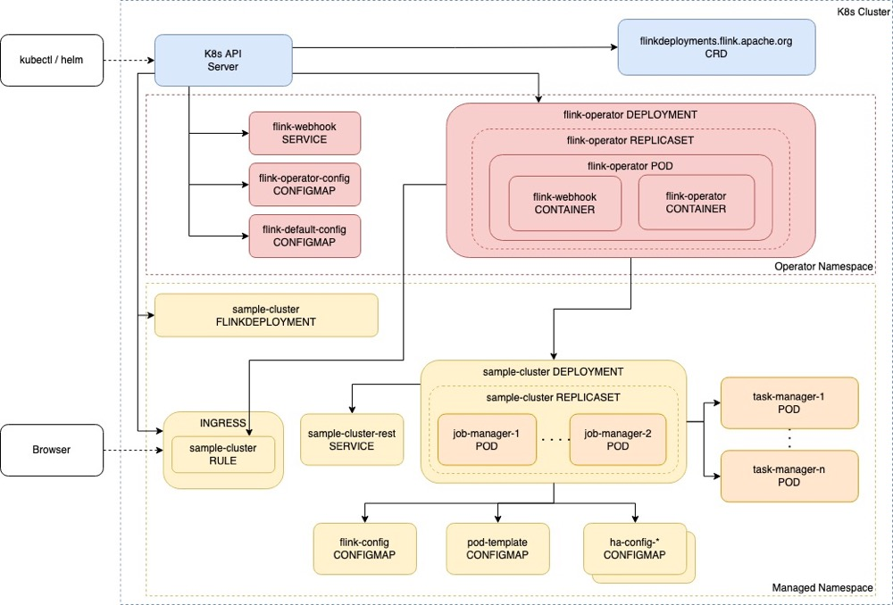
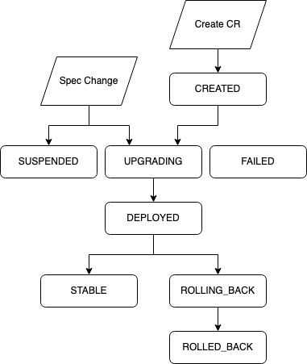
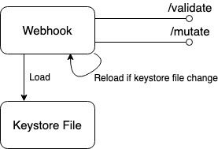
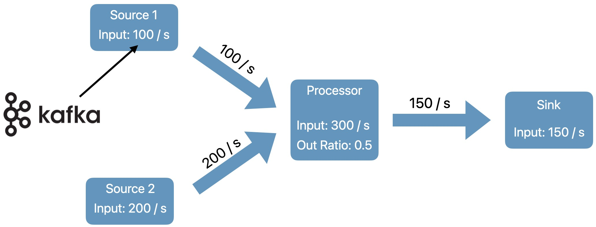
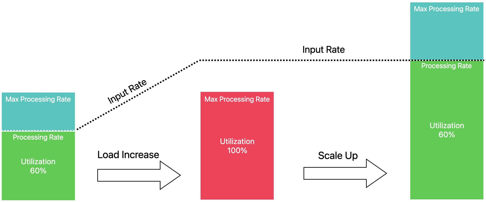
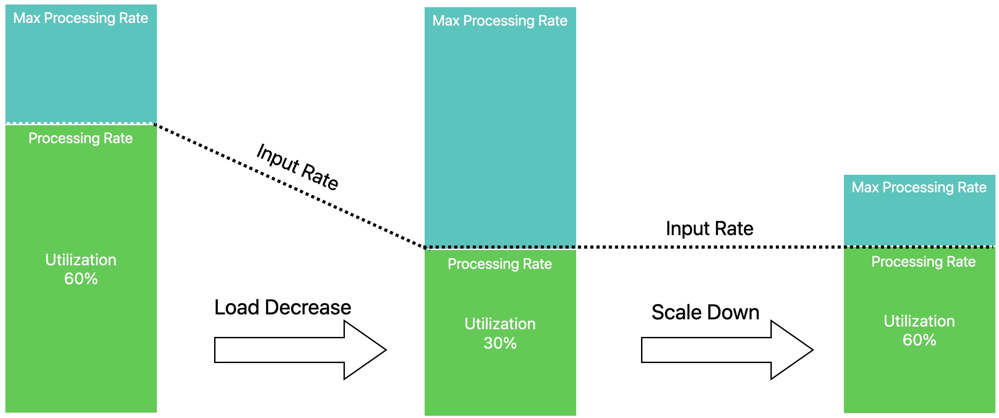

# OverView

* Flink On K8s Operator是Flink 1.15大版本推出的Flink On K8s方案，之前Flink社区提供的Flink Native K8s方式相对来说使用繁琐并且没有统一的容器管理方案，整体任务管理起来比较复杂。因此社区基于flink-kubernetes底层sdk开发基于operator的flink k8s方案，其提供更加成熟的容器管理方案。

## 核心特点

* **全自动作业生命周期管理**
  * 运行、挂起和删除应用
  * 有状态和无状态的应用程序升级
  * 触发和管理savepoints
  * 处理错误，回滚异常的升级
* **支持多版本flink:v1.13，v1.14，v1.15，v1.16，v1.17**
* **多种部署模式支持**
  * Application Cluster
  * Session Cluster
  * Session Job
* [**支持高可用**](https://nightlies.apache.org/flink/flink-docs-master/docs/deployment/ha/kubernetes_ha/)
* **可扩展的架构**
  * [自定义校验器](https://nightlies.apache.org/flink/flink-kubernetes-operator-docs-release-1.6/docs/operations/plugins/#custom-flink-resource-validators)
  * [自定义资源监听器](https://nightlies.apache.org/flink/flink-kubernetes-operator-docs-release-1.6/docs/operations/plugins/#custom-flink-resource-listeners)
* **更先进的配置管理**
  * 默认配置动态更新
  * 预配置job
  * 环境变量
* **支持pod template增强pod**
  * native kubernetes pod定义
  * 分层 (Base/JobManager/TaskManager overrides)
* [**作业自动资源分配**](https://nightlies.apache.org/flink/flink-kubernetes-operator-docs-release-1.6/docs/custom-resource/autoscaler/)
  * 收集滞后和利用率指标
  * 将作业vertices缩放到理想的并行度
  * 随着负载的变化而上下缩放


## Operations

* **Operator Mertrics**
  * 采用flink指标系统
  * 插件化指标上报器
  * 详细资源和Kubernetes API访问指标
* 完全自定义log
  * 默认log配置
  * job预配置log
  * 基于Sidecar的日志转发器
* Flink web ui和rest入口访问
  * 支持flink native k8s的全部expose type
  * Dynamic [Ingress templates](https://nightlies.apache.org/flink/flink-kubernetes-operator-docs-main/docs/operations/ingress/)
* Helm based installation
  - Automated [RBAC configuration](https://nightlies.apache.org/flink/flink-kubernetes-operator-docs-main/docs/operations/rbac/)
  - Advanced customization techniques
* 最新的公共存储库
  - GitHub Container Registry [ghcr.io/apache/flink-kubernetes-operator](http://ghcr.io/apache/flink-kubernetes-operator)
  - DockerHub https://hub.docker.com/r/apache/flink-kubernetes-operator

# Quick Start

## 前置条件

* 准备以下基础环境
* [docker](https://docs.docker.com/)
* [kubernetes](https://kubernetes.io/)
* [helm](https://helm.sh/docs/intro/quickstart/)

```shell
# 启动minikube
minikube start --kubernetes-version=v1.24.3
# 安装helm
brew install helm
# 安装k9s,推荐使用k9s来管理k8s pod
brew install k9s
```

* k9s文档:https://k9scli.io/

## 部署operator

```shell
# 在Kubernetes集群中安装证书管理器来添加webhook组件(每个Kubernetes集群只需要添加一次):
kubectl create -f https://github.com/jetstack/cert-manager/releases/download/v1.8.2/cert-manager.yaml
# 添加flink k8s operator helm chart，这里选择1.0.1版本的operator
helm repo add flink-operator-repo160 https://downloads.apache.org/flink/flink-kubernetes-operator-1.6.0/
helm install flink-kubernetes-operator flink-operator-repo160/flink-kubernetes-operator
```

* **kubectl get pods**查看flink-kubernetes-operator是否启动成功
* **helm list**查看对应chart是否安装成功

## 提交flink任务

* 根据官方提供的yaml配置提交一个flink job

```shell
# 创建测试flink任务
kubectl create -f https://raw.githubusercontent.com/apache/flink-kubernetes-operator/release-1.6/examples/basic.yaml
# 查看容器日志
kubectl logs -f deploy/basic-example
# 暴露对应任务web port
kubectl port-forward svc/basic-example-rest 8081
# 删除作业
kubectl delete flinkdeployment/basic-example
```

* 通过localhost:8081就可以访问flink web dashboard，basic文件含义

```yaml
################################################################################
#  Licensed to the Apache Software Foundation (ASF) under one
#  or more contributor license agreements.  See the NOTICE file
#  distributed with this work for additional information
#  regarding copyright ownership.  The ASF licenses this file
#  to you under the Apache License, Version 2.0 (the
#  "License"); you may not use this file except in compliance
#  with the License.  You may obtain a copy of the License at
#
#      http://www.apache.org/licenses/LICENSE-2.0
#
#  Unless required by applicable law or agreed to in writing, software
#  distributed under the License is distributed on an "AS IS" BASIS,
#  WITHOUT WARRANTIES OR CONDITIONS OF ANY KIND, either express or implied.
#  See the License for the specific language governing permissions and
# limitations under the License.
################################################################################
apiVersion: flink.apache.org/v1beta1
# 部署类型
kind: FlinkDeployment
metadata:
  name: basic-example
spec:
  image: flink:1.15
  flinkVersion: v1_15
  flinkConfiguration:
  # flink配置
    taskmanager.numberOfTaskSlots: "2"
  # flink service用户
  serviceAccount: flink
  # jm资源配置
  jobManager:
    resource:
      memory: "2048m"
      cpu: 1
  taskManager:
    resource:
      memory: "2048m"
      cpu: 1
  job:
  # jar包地址
    jarURI: local:///opt/flink/examples/streaming/StateMachineExample.jar
    # 并行度
    parallelism: 2
    upgradeMode: stateless
```

# Architecture

* Flink Kubernetes Operator (Operator)作为一个**控制平台**，管理Apache Flink应用的整个**部署生命周期**。**Operator**可以通过**Helm**安装在**Kubernetes**集群上。在大多数生产环境中，它通常部署在指定的**namespace**中，并在一个或多个托管**namespace**中控制Flink的deployment。



## 控制流程


* 用户可以使用Kubernetes命令行工具kubectl与operator进行交互。operator持续跟踪**FlinkDeployment**/**FlinkSessionJob**自定义资源相关的集群事件。当operator收到新的资源更新时，它将采取行动将Kubernetes集群调整到所需的状态，作为和解循环的一部分。初始循环由以下高级步骤组成:
  * 用户通过`kubectl`提交一个`FlinkDeployment/FlinkSessionJob`的自定义资源。
  * Operator观察flink资源(如果先前部署)的当前状态
  * Operator校验提交资源的改变
  * Operator协调任何需要的更改并执行升级
* 自定义资源能够在任何时间应用于集群中。Operator不断地根据期望状态进行调整，直到当前状态变为期望状态。在Operator中，所有生命周期管理操作都使用这个非常简单的原则来实现。

## Flink资源生命周期

* Operator管理者flink资源的生命周期，Flink资源的生命周期各个阶段如下图：



- CREATED : The resource was created in Kubernetes but not yet handled by the operator
- SUSPENDED : The (job) resource has been suspended
- UPGRADING : The resource is suspended before upgrading to a new spec
- DEPLOYED : The resource is deployed/submitted to Kubernetes, but it’s not yet considered to be stable and might be rolled back in the future
- STABLE : The resource deployment is considered to be stable and won’t be rolled back
- ROLLING_BACK : The resource is being rolled back to the last stable spec
- ROLLED_BACK : The resource is deployed with the last stable spec
- FAILED : The job terminally failed

## Admission Control

* 除了编译的准入插件，一个名为`Flink Kubernetes Operator Webhook (Webhook)`的自定义准入插件可以作为扩展启动并作为Webhook运行。
* Webhook遵循Kubernetes的原则，特别是动态准入控制。
* 当使用Helm将Operator安装在Kubernetes集群上时，默认会部署它。
* Webhook默认使用TLS协议进行通信。当keystore文件发生更改时，它会自动加载/重新加载keystore文件，并提供以下端点:



# Custom Resource

* Flink Kubernetes操作员面向用户的核心API是FlinkDeployment和FlinkSessionJob自定义资源(CR)。自定义资源是k8s api的扩展和定义一个新的对象类型。FlinkDeployment CR(自定义资源)定义一个Flink Application和Session集群deployments。FlinkSessionJob的CR定义一个session任务在Session集群并且每个session集群可以运行多个FlinkSessionJob。
* 一但Flink K8s Operator被安装和运行在k8s环境，它将会持续的监听FlinkDeployment和FlinkSessionJob对象，以检测新的CR和对现有CR的更改。
* 俩种CR类型，FlinkDeployment和FlinkSessionJob
  * Flink应用的管理通过FlinkDeployment
  * 由FlinkDeployment管理的空Flink Session+由FlinkSessionJobs管理的多个作业。对会话任务的操作是相互独立的。

## FlinkDeployment

```yaml
apiVersion: flink.apache.org/v1beta1
# 部署类型
kind: FlinkDeployment
metadata:
  namespace: namespace-of-my-deployment
  name: my-deployment
spec:
  // Deployment specs of your Flink Session/Application
```

* 查看FlinkDeployment具体yaml配置

```shell
w
```

### FlinkDeployment spec描述

* image:Docker用于运行Flink作业和任务管理器进程
* flinkVersion:flink镜像的版本(v1_13,v1_14,v1_15)
* serviceAccount:flink pod使用的k8s账户
* taskManager，jobManager:job和task管理pod资源的描述(cpu、memory等)
* flinkConfiguration:flink配置的字典，例如ck和ha配置
* job:任务相关描述

### Application Deployments

* jarURI:任务jar包路径
* parallelism: 任务并行度
* upgradeMode: 作业的更新模式(stateless/savepoint/last-state)
* state:任务的描述状态(运行/挂起)

**创建一个新的namespace和serviceaccount**

```shell
# 创建namespace
kubectl create namespace flink-operator
# 创建serviceaccount
kubectl create serviceaccount flink -n flink-operator
# 赋予权限
kubectl create clusterrolebinding flink-role-binding-flink-operator_flink \
     --clusterrole=edit   --serviceaccount=flink-operator:flink
clusterrolebinding.rbac.authorization.k8s.io/flink-role-binding-flink-operator_flink created
```

**FlinkDeployment模式flink job yaml**

```yaml
apiVersion: flink.apache.org/v1beta1
kind: FlinkDeployment
metadata:
  namespace: flink-operator
  name: flink-deployment-test
spec:
  image: flink:1.15
  flinkVersion: v1_15
  flinkConfiguration:
    taskmanager.numberOfTaskSlots: "2"
  serviceAccount: flink
  jobManager:
    resource:
      memory: "2048m"
      cpu: 1
  taskManager:
    resource:
      memory: "2048m"
      cpu: 1
  job:
    jarURI: local:///opt/flink/examples/streaming/StateMachineExample.jar
    parallelism: 2
    upgradeMode: stateless
    state: running
```

**启动对应flink任务**

```shell
kubectl apply -f your-deployment.yaml
# 转发端口
kubectl port-forward svc/flink-deployment-test-rest 8081 -n flink-operator

## 如果遇到以下错误标识端口占用
Unable to listen on port 8081: Listeners failed to create with the following errors: [unable to create listener: Error listen tcp4 127.0.0.1:8081: bind: address already in use unable to create listener: Error listen tcp6 [::1]:8081: bind: address already in use]
error: unable to listen on any of the requested ports: [{8081 8081}]
## 通过lsof kill对应应用
lsof -i :8080
kill -9 pid
```

* port-forward作用:https://kubernetes.io/zh-cn/docs/tasks/access-application-cluster/port-forward-access-application-cluster/

## FlinkSessionJob

* 整体的yaml文件的结构类似于FlinkDeployment

```yaml
apiVersion: flink.apache.org/v1beta1
kind: FlinkSessionJob
metadata:
  name: basic-session-job-example
spec:
  deploymentName: basic-session-cluster
  job:
    jarURI: https://repo1.maven.org/maven2/org/apache/flink/flink-examples-streaming_2.12/1.15.1/flink-examples-streaming_2.12-1.15.1-TopSpeedWindowing.jar
    parallelism: 4
    upgradeMode: stateless
```

### FlinkSessionJob spec描述

* flink session的jar可以来着远程的资源，可以从不同的系统获取任务jar，例如支持从hadoop文件系统拉取jar需要改造原始flink operator打包新的镜像，如下：

```dockerfile
FROM apache/flink-kubernetes-operator
ENV FLINK_PLUGINS_DIR=/opt/flink/plugins
COPY flink-hadoop-fs-1.15-SNAPSHOT.jar $FLINK_PLUGINS_DIR/hadoop-fs/
```

### 限制

* FlinkSessionJob目前还不支持`LastState`的升级模式

### FlinkSessionJob Quick Start

#### 启动一个Session Cluster

* 基础yaml文件配置

```yaml
################################################################################
#  Licensed to the Apache Software Foundation (ASF) under one
#  or more contributor license agreements.  See the NOTICE file
#  distributed with this work for additional information
#  regarding copyright ownership.  The ASF licenses this file
#  to you under the Apache License, Version 2.0 (the
#  "License"); you may not use this file except in compliance
#  with the License.  You may obtain a copy of the License at
#
#      http://www.apache.org/licenses/LICENSE-2.0
#
#  Unless required by applicable law or agreed to in writing, software
#  distributed under the License is distributed on an "AS IS" BASIS,
#  WITHOUT WARRANTIES OR CONDITIONS OF ANY KIND, either express or implied.
#  See the License for the specific language governing permissions and
# limitations under the License.
################################################################################

apiVersion: flink.apache.org/v1beta1
kind: FlinkDeployment
metadata:
  name: basic-session-deployment-only-example
spec:
  image: flink:1.15
  flinkVersion: v1_15
  flinkConfiguration:
    taskmanager.numberOfTaskSlots: "2"
  serviceAccount: flink
  jobManager:
    resource:
      memory: "2048m"
      cpu: 1
  taskManager:
    resource:
      memory: "2048m"
      cpu: 1
```

* 部署deployment任务

```shell
kubectl apply -f basic-session-deployment-only-example.yaml
```

#### 添加任务至basic-session-deployment-only-example

* 基础yaml文件配置

```yaml
################################################################################
#  Licensed to the Apache Software Foundation (ASF) under one
#  or more contributor license agreements.  See the NOTICE file
#  distributed with this work for additional information
#  regarding copyright ownership.  The ASF licenses this file
#  to you under the Apache License, Version 2.0 (the
#  "License"); you may not use this file except in compliance
#  with the License.  You may obtain a copy of the License at
#
#      http://www.apache.org/licenses/LICENSE-2.0
#
#  Unless required by applicable law or agreed to in writing, software
#  distributed under the License is distributed on an "AS IS" BASIS,
#  WITHOUT WARRANTIES OR CONDITIONS OF ANY KIND, either express or implied.
#  See the License for the specific language governing permissions and
# limitations under the License.
################################################################################
apiVersion: flink.apache.org/v1beta1
kind: FlinkSessionJob
metadata:
  name: basic-session-job-only-example
spec:
# 部署的deployment名称
  deploymentName: basic-session-deployment-only-example
  job:
    jarURI: https://repo1.maven.org/maven2/org/apache/flink/flink-examples-streaming_2.12/1.15.0/flink-examples-streaming_2.12-1.15.0-TopSpeedWindowing.jar
    parallelism: 4
    upgradeMode: stateless
```

* 添加任务运行

```shell
kubectl apply -f basic-session-job-only-example.yaml
```

## 任务管理

### Flink生命周期管理

* flink operator的核心特性是如何去管理一个Flink应用程序的完整生命周期。
  * 运行、挂起和删除应用
  * 有状态和无状态的应用更新方式
  * 触发和管理savepoint
  * 处理错误，回滚损坏的升级
* 以上特点都可以通过JobSpec来控制

### 启动、挂起和删除应用

* 取消/删除应用

```shell
kubectl delete flinkdeployment/flinksessionjob my-deployment
```

### 有状态和无状态应用升级

* operator可以停止当前正在运行的作业(除非已经挂起或者redeploy)，并使用上次运行有状态应用程序时保留的最新spec和状态重新部署它。
* 通过JobSpec的`upgradeMode`进行设置，支持以下值
  * **stateless:** 可以通过空状态来升级无状态应用
  * **savepoint:** 使用savepoint来升级。
  * **last-state: **在任何应用程序状态下(即使作业失败)进行快速升级，都不需要健康的作业，因为它总是使用最后检查点信息。当HA元数据丢失时，可能需要手动恢复。

|                 | Stateless       | Last State                                 | Savepoint                              |
| --------------- | --------------- | ------------------------------------------ | -------------------------------------- |
| **必需配置**    | 无              | **Checkpointing & Kubernetes HA Enabled**  | Checkpoint/Savepoint directory defined |
| **Job状态要求** | 无              | HA元数据可用                               | Job运行状态                            |
| **暂停机制**    | Cancel / Delete | Delete Flink deployment (keep HA metadata) | 通过Savepoint取消任务                  |
| **恢复机制**    | 从空状态部署    | 使用HA元数据恢复最新ck                     | Restore From savepoint                 |
| **生产使用**    | 不推荐          | 推荐                                       | 推荐                                   |

#### last-state yaml配置

* **last-state**模式仅支持`FlinkDeployment`类型作业

```yaml
apiVersion: flink.apache.org/v1beta1
kind: FlinkDeployment
metadata:
  name: basic-checkpoint-ha-example
spec:
  image: flink:1.15
  flinkVersion: v1_15
  flinkConfiguration:
    taskmanager.numberOfTaskSlots: "2"
    state.savepoints.dir: file:///flink-data/savepoints
    state.checkpoints.dir: file:///flink-data/checkpoints
    high-availability: org.apache.flink.kubernetes.highavailability.KubernetesHaServicesFactory
    high-availability.storageDir: file:///flink-data/ha
  serviceAccount: flink
  jobManager:
    resource:
      memory: "2048m"
      cpu: 1
  taskManager:
    resource:
      memory: "2048m"
      cpu: 1
  podTemplate:
    spec:
      containers:
        - name: flink-main-container
          volumeMounts:
            - mountPath: /flink-data
              name: flink-volume
      volumes:
        - name: flink-volume
          hostPath:
            # directory location on host
            path: /tmp/flink
            # this field is optional
            type: Directory
  job:
    jarURI: local:///opt/flink/examples/streaming/StateMachineExample.jar
    parallelism: 2
    upgradeMode: last-state
    state: running
```

#### 应用重启没有spec变化

* 在某些情况下，用户只是希望重启Flink部署来处理一些临时问题。可以通过restartNonce来配置重启次数

```yaml
 spec:
    ...
    restartNonce: 123
```

### savepoint管理

#### 手动savepoint触发

* 通过`savepointTriggerNonce`来手动控制savepoint触发，改变`savepointTriggerNonce`的值将会触发一个新的savepoint

```yaml
job:
    ...
    savepointTriggerNonce: 123
```

#### 定期savepoint触发

```yaml
flinkConfiguration:
    ...
    kubernetes.operator.periodic.savepoint.interval: 6h
```

* 不能保证定期保存点的及时执行，因为不健康的作业状态或其他干扰用户操作可能会延迟它们的执行。

#### savepoint history

* operator可以动态跟踪由升级或手动保存点操作触发的保存点历史。

```yaml
flinkConfiguration:
    ...
		kubernetes.operator.savepoint.history.max.age: 24 h
		kubernetes.operator.savepoint.history.max.count: 5
```

* `kubernetes.operator.savepoint.cleanup.enabled: false`可以关闭savepoint清理能力

### Recovery of missing job deployments

* 当启用Kubernetes HA时，operator可以在用户或某些外部进程意外删除Flink集群部署的情况下恢复它。可以通过设置`kubernetes.operator.jm-deployment-recovery.enabled`在配置中关闭部署恢复。启用为false，但是建议保持该设置为默认的true值。

### 不健康job deployment的重启

* 当开启HA时，当Flink集群部署被认为不健康时，operator可以重新启动它。通过设置`kubernetes.operator.cluster.health-check`为true启用不健康的部署重启(默认为false)。要使此功能发挥作用，必须启用`kubernetes.operator.jm-deployment-recovery.enabled`。
* 目前以下俩种情况被认为是不健康的job:
  * Flink job在`kubernetes.operator.cluster.health-check.restart`的时间窗口内。窗口(默认:2分钟)重启次数超过`kubernetes.operator.cluster.health-check.restarts.threshold`配置,默认64。
  * `cluster.health-check.checkpoint-progress`设置为true，并且Flink的成功检查点计数在`kubernetes.operator.cluster.health-check.checkpoint-progress`的时间窗口内没有变化。窗口(默认为5分钟)。

### 重新启动失败的job deployment

* operator可以重新启动失败的Flink作业，当作业主任务能够重新配置作业以处理这些故障时，当`kubernetes.operator.job.restart.faile`设置为true时，当作业状态设置为`FAILED`时，**kubernetes opeartor将删除当前作业，并使用最新成功的检查点重新部署作业。**

### 手动恢复

* 手动恢复作业步骤：
  * 在配置ck/sp的路径找到最新的ck/sp
  * 删除`FlinkDeployment`资源应用
  * 校验是否存在需要恢复的savepoint，确认`FlinkDeployment`应用是否完全删除
  * 修改`FlinkDeployment`yaml配置中的jobSpec,指定`initialSavepointPath`位置为需要恢复的savepoint路径
  * 重新创建`FlinkDeployment`

## Pod Template

* operator的CRD提供`flinkConfiguration`和`podTemplate`配置，pod template允许自定义Flink作业和任务管理器pod，例如指定卷安装，临时存储，sidecar容器等。
* operator会合并job manager和task manger的通用和特定模板，以下为pod template demo

```yaml
apiVersion: flink.apache.org/v1beta1
kind: FlinkDeployment
metadata:
  namespace: default
  name: pod-template-example
spec:
  image: flink:1.17
  flinkVersion: v1_17
  flinkConfiguration:
    taskmanager.numberOfTaskSlots: "2"
  serviceAccount: flink
  podTemplate:
    apiVersion: v1
    kind: Pod
    metadata:
      name: pod-template
    spec:
      containers:
        # Do not change the main container name
        - name: flink-main-container
          volumeMounts:
            - mountPath: /opt/flink/log
              name: flink-logs
        # Sample sidecar container
        - name: fluentbit
          image: fluent/fluent-bit:1.8.12-debug
          command: [ 'sh','-c','/fluent-bit/bin/fluent-bit -i tail -p path=/flink-logs/*.log -p multiline.parser=java -o stdout' ]
          volumeMounts:
            - mountPath: /flink-logs
              name: flink-logs
      volumes:
        - name: flink-logs
          emptyDir: { }
  jobManager:
    resource:
      memory: "2048m"
      cpu: 1
  taskManager:
    resource:
      memory: "2048m"
      cpu: 1
    podTemplate:
      apiVersion: v1
      kind: Pod
      metadata:
        name: task-manager-pod-template
      spec:
        initContainers:
          # Sample sidecar container
          - name: busybox
            image: busybox:1.35.0
            command: [ 'sh','-c','echo hello from task manager' ]
  job:
    jarURI: local:///opt/flink/examples/streaming/StateMachineExample.jar
    parallelism: 2
```

# Autoscaler

* 作业自动扩缩容功能可以**收集Flink作业的各种指标**，并自动缩放单个作业vertexes(chained operator groups)，以消除反压力，满足用户设定的利用率目标。通过调整作业vertexes级别的并行度(与作业并行度相反)，我们可以有效地自动扩展复杂和异构的流应用程序。
* 关键特性如下：
  * 更好的集群资源利用率和更低的运维成本
  * 自动并行调优，甚至复杂的流管道
  * 自动适应不断变化的负载模式
  * 用于性能调试的详细利用率指标

## 概览

* 自动扩缩容依赖于Flink度量系统为单个任务提供的度量，指标直接从Flink作业查询，收集的度量指标如下:
  * 每个source的backlog信息
  * source数据的传入数据速率(例如:records/sec 写入kafka的速度)
  * 每个job的vertex每秒处理的记录数
  * 每个job的vertex每秒的繁忙时间(**目前的利用率**)
* 该算法从source开始，递归地计算pipeline中每个operator所需的处理能力(目标数据率)。在source vertices，目标数据速率等于传入数据速率(来自Kafka主题)。
* 对于下游算子，计算目标数据速率为输入(上游)算子沿着处理图中给定边缘的输出数据速率的总和。



* 用户可以配置管道中operator的目标利用率，例如将所有operators的繁忙度保持在60% - 80%之间。然后，autoscaler找到一个并行配置，使所有操作的输出速率与其所有下游操作的输入速率在目标利用率上匹配。
* 如下图所示，可以看出来autoscaler如何影响pipeline：



* 类似地，当负载减少时，autoscaler会调整单个opeartor的并行度水平，以匹配当前随时间变化的速率。



## autoscaler配置

* 默认情况下，autoscaler使用operator内置的作业升级机制来执行自动扩缩容，详见 [Job Management and Stateful upgrades](https://nightlies.apache.org/flink/flink-kubernetes-operator-docs-release-1.6/docs/custom-resource/job-management/).

### Flink 1.18和autoscaler支持

* 即将发布的Flink 1.18版本通过新的资源需求rest端点对扩展操作的速度进行了非常显著的改进。这允许autoscaler在不执行完整作业升级周期的情况下就地缩放顶点。
* 要尝试此实验性功能，请使用当前可用的Flink 1.18快照基础映像来构建应用程序docker映像。此外，确保在`FlinkDeployment` yaml中将`Flink version`设置为`v1_18`，并启用该特性所需的自适应调度器。

```yaml
jobmanager.scheduler: adaptive
```

## Job的要求和限制

### 要求

* Autoscaler目前只适用于Flink 1.17和更高版本的Flink镜像，或者在将以下修复程序反向移植到1.15/1.16 Flink image后:
  * Job vertex parallelism overrides (must have)
    - [Add option to override job vertex parallelisms during job submission](https://github.com/apache/flink/commit/23ce2281a0bb4047c64def9af7ddd5f19d88e2a9)
    - [Change ForwardPartitioner to RebalancePartitioner on parallelism changes](https://github.com/apache/flink/pull/21443) (consists of 5 commits)
    - [Fix logic for determining downstream subtasks for partitioner replacement](https://github.com/apache/flink/commit/fb482fe39844efda33a4c05858903f5b64e158a3)
  * [Support timespan for busyTime metrics](https://github.com/apache/flink/commit/a7fdab8b23cddf568fa32ee7eb804d7c3eb23a35) (good to have)

### 限制

* 默认情况下，Autoscaler可用于处理图中的所有job vertices。
* source scaling要求source符合一下特性：
  * 使用最新的 [Source API](https://cwiki.apache.org/confluence/display/FLINK/FLIP-27%3A+Refactor+Source+Interface) 并且暴露繁忙时间指标 (强需要，大部分连接器都已经符合)
  * 暴露 [standardized connector metrics](https://cwiki.apache.org/confluence/display/FLINK/FLIP-33%3A+Standardize+Connector+Metrics) 访问 backlog信息 (good to have, extra capacity will be added for catching up with backlog)
* 在当前状态下，Autoscaler与Kafka source最适配，因为kafka source暴露了所有标准化的指标。当使用Kafka时，还带来了一些额外的好处，比如自动检测和限制源最大并行度与Kafka分区的数量。

## 配置指南

