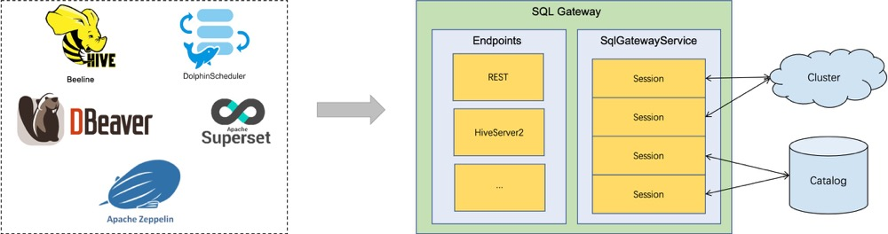

# Flink SQL Gateway

## 概览

* SQL Gateway支持多种客户端远程并行的执行SQL的服务，它提供了一种提交Flink Job、查找元数据和在线分析数据的简单方法。SQL Gateway由可插拔的endpoint和SqlGatewayService组成。SqlGatewayService是一个被endpoint重用来处理请求的处理器。endpoint是允许用户连接的入口点。根据endpoint类型，用户可以使用不同的工具进行连接。



## 快速开始

* 启动flink集群&sql gateway

```shell
-- 启动flink standalone集群
./bin/start-cluster.sh
-- 启动sql gateway service，指定endpoint为本地
./bin/sql-gateway.sh start -Dsql-gateway.endpoint.rest.address=localhost
```

* 查看sql gateway版本

```shell
 curl http://localhost:8083/v1/info
 
 -- output
 {"productName":"Apache Flink","version":"1.16.1"}%
```

* 运行SQL

```shell
-- 开启会话
curl --request POST http://localhost:8083/v1/sessions
--output
{"sessionHandle":"472a226c-993d-4af0-822e-961493dfbc49"}%

-- 运行sql，传入sessionHandle
curl --request POST http://localhost:8083/v1/sessions/${sessionHandle}/statements/ --data '{"statement": "SELECT 1"}'
--demo
curl --request POST http://localhost:8083/v1/sessions/472a226c-993d-4af0-822e-961493dfbc49/statements/ --data '{"statement": "SELECT 1"}'
--output
{"operationHandle":"bb2e730d-a5ab-4dc2-b2c0-7d49e939f0a2"}%

-- 拉取结果 传入sessionHandle和operationHandle
curl --request GET http://localhost:8083/v1/sessions/${sessionHandle}/operations/${operationHandle}/result/0
--demo
curl --request GET http://localhost:8083/v1/sessions/472a226c-993d-4af0-822e-961493dfbc49/operations/bb2e730d-a5ab-4dc2-b2c0-7d49e939f0a2/result/0
--output
{"results":{"columns":[{"name":"EXPR$0","logicalType":{"type":"INTEGER","nullable":false},"comment":null}],"data":[{"kind":"INSERT","fields":[1]}]},"resultType":"PAYLOAD","nextResultUri":"/v1/sessions/472a226c-993d-4af0-822e-961493dfbc49/operations/bb2e730d-a5ab-4dc2-b2c0-7d49e939f0a2/result/1"}%

—— 获取下一行结果，窜如nextResultUri
curl --request GET ${nextResultUri}
--demo
curl --request GET http://localhost:8083/v1/sessions/472a226c-993d-4af0-822e-961493dfbc49/operations/bb2e730d-a5ab-4dc2-b2c0-7d49e939f0a2/result/1

```

## 配置

### SQL Gateway命令配置

```shell
./bin/sql-gateway.sh --help

Usage: sql-gateway.sh [start|start-foreground|stop|stop-all] [args]
  commands:
    start               - Run a SQL Gateway as a daemon
    start-foreground    - Run a SQL Gateway as a console application
    stop                - Stop the SQL Gateway daemon
    stop-all            - Stop all the SQL Gateway daemons
    -h | --help         - Show this help message
```

### SQL Gateway Configuration

```shell
$ ./sql-gateway -Dkey=value
```

| Key                                | Default | Type     | Description                                                  |
| :--------------------------------- | :------ | :------- | :----------------------------------------------------------- |
| sql-gateway.session.check-interval | 1 min   | Duration | 空闲session超时校验间隔，设置为0和负数表示关闭               |
| sql-gateway.session.idle-timeout   | 10 min  | Duration | session的空闲超时时间，设置为0和负数表示不会超时             |
| sql-gateway.session.max-num        | 1000000 | Integer  | sql gateway最大的session个数                                 |
| sql-gateway.worker.keepalive-time  | 5 min   | Duration | Keepalive time for an idle worker thread. When the number of workers exceeds min workers, excessive threads are killed after this time interval. |
| sql-gateway.worker.threads.max     | 500     | Integer  | The maximum number of worker threads for sql gateway service. |
| sql-gateway.worker.threads.min     | 5       | Integer  | The minimum number of worker threads for sql gateway service. |

## 支持的Endpoint

* hiveserver2

```shell
./bin/sql-gateway.sh start -Dsql-gateway.endpoint.type=hiveserver2
```

## RestFul Endpoint

* [操作文档](https://nightlies.apache.org/flink/flink-docs-release-1.16/zh/docs/dev/table/sql-gateway/rest/)

## HiveServer2 Endpoint
