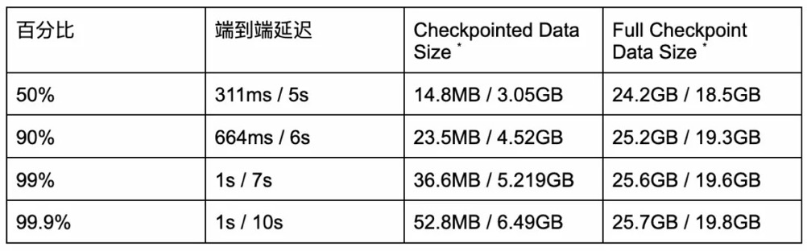
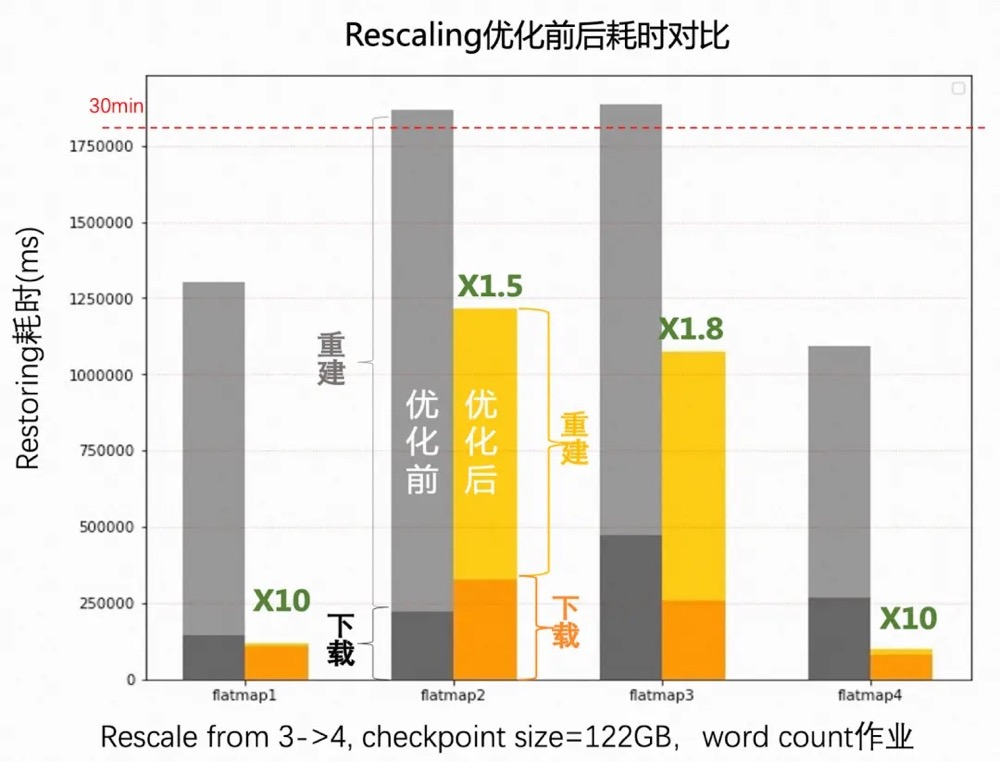

# Overviews

## Batch Processing Overview

### 易用性

* 随着SQL Gateway的引入和与Hive Server2的完全兼容，用户可以非常轻松地提交Flink SQL作业和Hive SQL作业，也可以很容易地连接到原有的Hive生态系统。

### 功能性

* join hints允许Flink SQL用户手动指定join策略，以避免不合理的执行计划。Hive SQL的兼容性已经达到94%，用户可以以非常低的成本从Hive迁移到Flink。

### 稳定性

* 支持推测执行机制，预防作业的长尾sub task问题，从而导致整体任务延迟过久，提高稳定性。
* 改进HashJoin，引入失败回滚机制，避免join失败。

### 性能

* 引入动态分区修剪以减少扫描I/O并改进星型模式查询的连接处理。TPC-DS基准有30%的改进。可以使用混合shuffle模式来提高资源利用率和处理性能。

## Streaming Processing Overview

* 支持Changelog State Backend为用户提供秒级甚至毫秒级的检查点，以显著改善容错体验，同时为事务性Sink作业提供更小的端到端延迟体验。
* Lookup Join更广放的应用在流式处理中。通过通用`缓存机制`、`异步输入`和`可检索查找`解决了查找速度慢、吞吐量低和更新延迟等问题，解决了用户的大部分痛点问题。
* 优化了Flink SQL的不稳定性

# Details

## Batch Processing Detail

### SQL Gateway

* 从各个渠道反馈中了解到，SQL Gateway [5] 一直是用户非常期待的功能，尤其是对批用户。1.16 里，该功能终于完成（设计见 FLIP-91 [6]）。SQL Gateway 是对 SQL Client 的扩展和增强，支持多租户和插件式 API 协议（Endpoint），解决了 SQL Client 只能服务单用户并且不能对接外部服务或组件的问题。当前 SQL Gateway 已支持 REST API 和 HiveServer2 协议，用户可以通过 cURL，Postman，各种编程语言的 HTTP 客户端链接到 SQL Gateway 提交流作业、批作业，甚至 OLAP 作业。

### **Hive 语法兼容**

* 为了降低从 Hive 到 Flink 的迁移成本，这个版本里我们引入了 HiveServer2 协议并继续改进 Hive 语法的兼容性。
* HiveServer2 协议 [7] 允许用户使用 Hive JDBC/Beeline 和 SQL Gateway 进行交互，Hive 生态（DBeaver, Apache Superset, Apache DolphinScheduler, and Apache Zeppelin）也因此很容易迁移到 Flink。当用户使用 HiveServer2 协议连接 SQL Gateway，SQL Gateway 会自动注册 Hive Catalog，自动切换到 Hive 方言，自动使用批处理模式提交作业，用户可以得到和直接使用 HiveServer2 一样的体验。
* Hive 语法 [8] 已经是大数据处理的事实标准，Flink 完善了对 Hive 语法的兼容，增加了对 Hive 若干生产中常用语法的支持。通过对 Hive 语法的兼容，可以帮助用户将已有的 Hive SQL 任务迁移到 Flink，并且方便熟悉 Hive 语法的用户使用 Hive 语法编写 SQL 以查询注册进 Flink 中的表。到目前为止，基于 Hive qtest 测试集（包含 12K 个 SQL 案例），Hive 2.3 版本的查询兼容性已达到 94.1%，如果排除 ACID 的查询语句，则已达到 97.3%。

### **Join Hint**

* Hint 一直是业界用来干预执行计划以改善优化器缺点的通用解决方案。Join 作为批作业中最广泛使用的算子，Flink 支持多种 Join 策略。统计信息缺失或优化器的代价模型不完善都会导致选出错误 Join 策略，从而导致作业运行慢甚至有运行失败的风险。用户通过指定 Join Hint [9] ，让优化器尽可能选择用户指定的 Join 策略，从而避免优化器的各种不足，以确保批作业的生产可用性。

### **自适应 Hash Join**

* 对于批作业而言，数据倾斜是非常常见的，而此时使用 HashJoin 可能运行失败，这是非常糟糕的体验。为了解决该问题，我们引入了自适应的 HashJoin：Join 算子运行时一旦 HashJoin 运行失败，可以自动回退到 SortMergeJoin，并且是 Task 粒度。通过该机制可确保 HashJoin 算子始终成功，从而提高了作业的稳定性。

### **批处理的预测执行**

* 为了解决问题机器导致批作业处理慢的问题，Flink 1.16 引入了预测执行。问题机器是指存在硬件问题、突发 I/O 繁忙或 CPU 负载高等问题的机器，这些问题可能会使得运行在该机器上的任务比其他机器上的任务要慢得多，从而影响批处理作业的整体执行时间。
* 当启用预测执行时，Flink 将持续检测慢任务。一旦检测到慢任务，该任务所在的机器将被识别为问题机器，并通过黑名单机制（FLIP-224 [10] ）被加黑。调度器将为慢任务创建新的执行实例并将它们部署到未被加黑的节点，同时现有执行实例也将继续运行。新的执行实例和老的执行实例将处理相同的输入数据并产出相同的结果数据。一旦任何执行实例率先完成，它将被视为该任务的唯一完成执行实例，并且该任务的其余执行实例都将被取消。
* 大多数现有 Source 都可以使用预测执行 (FLIP-245 [11] )。只有当一个 Source 使用了 `SourceEvent` 时，它必须额外实现 `SupportsHandleExecutionAttemptSourceEvent` 接口以支持预测执行。目前 Sink 尚不支持预测执行，因此预测执行不会在 Sink 上发生。
* 我们也改进了 Web UI 和 REST API (FLIP-249 [12] ) ，以显示任务的多个执行实例和被加黑的 TaskManager。

### **混合 Shuffle 模式**

* 我们为批处理引入了一种新的混合 Shuffle [13] 模式。它结合了 Blocking Shuffle 和 Pipeline Shuffle（主要用于流式处理）的优点：

  - 与 Blocking Shuffle 一样，它不要求上下游任务同时运行，这允许使用很少的资源执行作业。

  - 与 Pipeline Shuffle 一样，它不要求上游任务完成后才执行下游任务，这在给定足够资源情况下减少了作业的整体执行时间。

  - 用户可以选择不同的落盘策略，以满足减少数据落盘或是降低任务重启代价的不同需求。

**注意：该功能为实验性的，并且默认关闭。**

### **Blocking shuffle 进一步改进**

* 在这个版本中，我们进一步改进了 Blocking Shuffle 的可用性和性能，包括自适应网络缓冲区分配、顺序 IO 优化和结果分区重用，允许多个消费者节点重用同一个物理结果分区，以减少磁盘 IO 和存储空间。在 TPC-DS 10TB 规模的测试中，这些优化可以实现 7% 的整体性能提升。此外，还引入了两种压缩率更高的压缩算法（LZO 和 ZSTD）。与默认的 LZ4 压缩算法相比，可以进一步减少存储空间，但要付出一些 CPU 成本。

### **动态分区裁剪**

* 对于批作业，生产环境中分区表比非分区表使用更为广泛。当前 Flink 已经支持静态分区裁剪，即在优化阶段，优化器将 Filter 中的 Partition 相关的过滤条件下推到 Source Connector 中从而减少不必要的分区读取。星形模型 [14] 是数据集市模式中最简单且使用最广泛的模式，我们发现很多用户的作业没法使用静态分区裁剪，因为分区裁剪信息在执行时才能确定，这就需要动态分区裁剪技术 [15] ，即运行时根据其他相关表的数据确定分区裁剪信息从而减少对分区表中无效分区的读取。通过 TPC-DS 10TB 规模数据集的验证，该功能可提升 30% 的性能。

## Streaming Processing Overview

### **Generalized Incremental Checkpoint**

* Changelog State Backend 旨在令 Checkpoint 的间隔更短、更加可预测。这个版本在自身易用性上和与其他 State Backend 兼容性上做了诸多改进，使其达到生产可用。

  - 支持状态迁移

  - 支持 Failover 时从本地恢复

  - 引入文件缓存优化恢复过程的性能

  - 支持从 Checkpoint 进行切换

  - 优化监控体验：
    - 扩充了 Changelog 的监控指标
    - 在 Flink WebUI 上显示 Changelog 相关的配置

表 1: Value State 上 Changelog Enabled / Changelog Disabled 对比

### **RocksDB Rescaling 改进及性能测试**

* 对于使用 Flink 构建的云服务应用来说，Rescaling 是一种非常频繁的操作。这个版本使用了 RocksDB 的区间删除 [17] 来优化增量 RocksDB State Backend 的 Rescaling 性能。区间删除被用来避免在 Rescaling 过程中大量的扫描和单点删除操作，对有大量的状态需要删除的扩并发来说，单个并发上的恢复速度可以提高 2~10 倍 [18] 。

### **改善 State Backend 的监测体验和可用性**

* 改善了状态后台的监控体验和可用性。之前，RocksDB 的日志位于它自己的 DB 目录中，这使得调试 RocksDB 没那么容易。这个版本让 RocksDB 的日志默认留在 Flink 的日志目录中。新增了 RocksDB 相关的统计指标，以帮助调试 DB 级别的性能，例如，在 DB 内的总块缓存命中 / 失败计数。

### **支持透支缓冲区**

* 透支缓冲区 [19] （Overdraft Buffers）旨在缓解反压情况下 Subtask 被阻塞的概率，可以通过设置 `taskmanager.network.memory.max-overdraft-buffers-per-gate` [20] 开启。
* 从 1.16 开始，一个 Flink 的 Subtask 可以申请 5 个（默认）额外的透支缓冲区。透支缓冲区会轻微地增加作业的内存使用量，但可以极大地减少 Checkpoint 的间隔，特别是在开启 Unaligned Checkpoint 情况下。只有当前 Subtask 被下游 Subtasks 反压且当前 Subtask 需要请求超过 1 个网络缓冲区（Network Buffer）才能完成当前的操作时，透支缓冲区才会被使用。

### **对齐 Checkpoint 超时**

* 这个版本更新了从 Aligned Checkpoint（AC） 切换到 Unaligned Checkpoint （UC） 的时间点。在开启 UC 的情况下，如果配置了 `execution.checkpointing.aligned-checkpoint-timeout` [22] , 在启动时每个 Checkpoint 仍然是 AC，但当全局 Checkpoint 持续时间超过` aligned-checkpoint-timeout` 时， 如果 AC 还没完成，那么 Checkpoint 将会转换为 UC。
* 以前，对一个 Substask 来说，AC 到 UC 的切换需要等所有上游的 Barriers 到达后才能开始，在反压严重的情况下，在 checkpointing-timeout [23] 过期之前，下游的 Substask 可能无法完全地收到所有 Barriers，从而导致 Checkpoint 失败。
* 在这个版本中，如果上游 Subtask 中的 Barrier 无法在 `execution.checkpointing.aligned-checkpoint-timeout` [24] 内发送到下游，Flink 会让上游的 Subtask 先切换成 UC，以把 Barrier 发送到下游，从而减少反压情况下 Checkpoint 超时的概率。

### **流计算的非确定性**

* Flink SQL 用户经常抱怨理解流处理的成本太高，其中一个痛点是流处理中的非确定性（而且通常不直观），它可能会导致错误的结果或异常。而这些痛点在 Flink SQL 的早期就已经存在了。
* 对于复杂的流作业，现在可以在运行前检测并解决潜在的正确性问题。如果问题不能完全解决，一个详细的消息可以提示用户如何调整 SQL，以避免引入非确定性问题。

### **维表增强**

* 维表关联在流处理中被广泛使用，在 1.16 中我们为此加入了多项优化和增强：

  - 支持了通用的缓存机制和相关指标 [27] ，可以加速维表查询。

  - 通过作业配置 [28] 或查询提示 [29] 支持可配置的异步模式（ALLOW_UNORDERED），在不影响正确性的前提下大大提升查询吞吐。

  - 可重试的查询机制 [30] 让用户解决维表数据更新延迟问题有了更多的手段。

### **异步 I/O 支持重试**

* 为异步 I/O [31] 引入了内置的重试机制，它对用户现有代码是透明的，可以灵活地满足用户的重试和异常处理需求。

# **其他**

### **新语法**

1.16 扩展了多个 DDL 语法以帮助用户更好的使用 SQL：

- USING JAR [32] 支持动态加载 UDF jar 包，方便平台开发者轻松实现 UDF 的管理和相关作业的提交。
- CREATE TABLE AS SELECT [33] (CTAS) 方便用户基于已有的表和查询创建新的表。
- ANALYZE TABLE [34] 支持用户手工为原表生成统计信息，以便优化器可以生成更优的执行计划。

### **DataStream 中的缓存**

* 支持通过 DataStream#cache 缓存 Transformation 的执行结果。缓存的中间结果在首次计算中间结果时才生成，以便以后的作业可以重用该结果。如果缓存丢失，原始的 Transformation 将会被重新计算以得到结果。目前该功能只在**批处理模式下支持**。这个功能对于 Python 中的 ML 和交互式编程非常有用。

### **History Server 及已完成作业的信息增强**

在这个版本中，我们加强了查看已完成作业的信息的体验。

- JobManager / HistoryServer WebUI 提供了详细的执行时间指标，包括任务在每个执行状态下的耗时，以及在运行过程中繁忙 / 空闲 / 反压总时间。
- JobManager / HistoryServer WebUI 提供了按 Task 或者 TaskManager 维度分组的主要子任务指标的聚合。
- JobManager / HistoryServer WebUI 提供了更多的环境信息，包括环境变量，JVM 选项和 Classpath。
- HistoryServer 现在支持从外部日志归档服务中浏览日志，更多细节可以参考文档 [35] 。

### **Protobuf 格式**

* Flink 现在支持 Protocol Buffers [36] (Protobuf) 格式，这允许您直接在 Table API 或 SQL 应用程序中使用这种格式。

### **为异步 Sink 引入可配置的 RateLimitingStrategy**

* 1.15 中实现了异步 Sink，允许用户轻松实现自定义异步 Sink。这个版本里，我们对此进行扩展以支持可配置的 RateLimitingStrategy。这意味着 Sink 的实现者现在可以自定义其异步 Sink 在请求失败时的行为方式，具体行为取决于特定的 Sink。如果没有指定 RateLimitingStrategy，它将默认使用 AIMDScalingStrategy。
