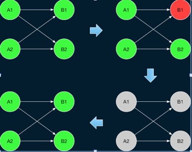
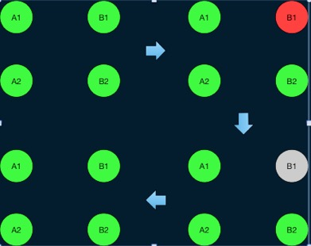

# Flink Runtime核心机制浅入深出

## 概览

* Flink在1.12版本对DataSet API标识为过期，并在支持逐渐将Connector组件的底层Source和Sink实现API更替为Data Source、Data Sink、SplitReader API，从而在Flink1.15版本之后对整体组件架构升级为流批一体架构；流批一体的目标是希望能够为有限数据和无限数据提供一套统一的处理 API，包括 Datastream API 与 Table/SQL API，其中有限数据的处理对应离线处理，而无限数据的处理则对应在线处理。本文主要对Flink Runtime整体架构、核心组件、资源管理和作业调度等方面进行介绍；

## Flink整体架构

* 下图为Flink整体架构图，其中主要包含最底层的部署层从Local环境到Standalone、Yarn环境再到最后的云原生环境Native Kubernetes和Kubernetes Operator。
* 针对不同的执行环境，Flink 提供了一套统一的分布式作业执行引擎，也就是 Flink Runtime 这层。Flink 在 Runtime 层之上提供了 DataStream 和 DataSet 两套 API，Flink1.12版本周后官方建议不再使用DataSet API(已被标记为软过期)，DataStream API为用户提供一套处理流批作业统一API；


* Flink Runtime的主要架构如要如下图所示，它主要描述了Flink程序和JobManger及TaskManger之前的工作流程具体代码实现可以参考[FLIP-6](https://cwiki.apache.org/confluence/pages/viewpage.action?pageId=65147077) ，整体来看，它采用了标准 master-slave 的结构，AM(ApplicationMaster)则为Master，它负责管理整个集群中的资源和作业；而右侧的两个 TaskExecutor 则是 Slave，负责提供具体的资源并实际执行作业。

* Flink 应用程序的作业可以被提交到长期运行的 Flink Session 集群、专用的 Flink Job 集群 或 Flink Application 集群。这些选项之间的差异主要与集群的生命周期和资源隔离保证有关。

### Flink Session 集群

- **集群生命周期**：在 Flink Session 集群中，客户端连接到一个预先存在的、长期运行的集群，该集群可以接受多个作业提交。即使所有作业完成后，集群（和 JobManager）仍将继续运行直到手动停止 session 为止。因此，Flink Session 集群的寿命不受任何 Flink 作业寿命的约束。
- **资源隔离**：TaskManager slot 由 ResourceManager 在提交作业时分配，并在作业完成时释放。由于所有作业都共享同一集群，因此在集群资源方面存在一些竞争 — 例如提交工作阶段的网络带宽。此共享设置的局限性在于，如果 TaskManager 崩溃，则在此 TaskManager 上运行 task 的所有作业都将失败；类似的，如果 JobManager 上发生一些致命错误，它将影响集群中正在运行的所有作业。
- **其他注意事项**：拥有一个预先存在的集群可以节省大量时间申请资源和启动 TaskManager。有种场景很重要，作业执行时间短并且启动时间长会对端到端的用户体验产生负面的影响 — 就像对简短查询的交互式分析一样，希望作业可以使用现有资源快速执行计算。

> 以前，Flink Session 集群也被称为 *session 模式*下的 Flink 集群。

### Flink Job 集群

- **集群生命周期**：在 Flink Job 集群中，可用的集群管理器（例如 YARN）用于为每个提交的作业启动一个集群，并且该集群仅可用于该作业。在这里，客户端首先从集群管理器请求资源启动 JobManager，然后将作业提交给在这个进程中运行的 Dispatcher。然后根据作业的资源请求惰性的分配 TaskManager。一旦作业完成，Flink Job 集群将被拆除。
- **资源隔离**：JobManager 中的致命错误仅影响在 Flink Job 集群中运行的一个作业。
- **其他注意事项**：由于 ResourceManager 必须应用并等待外部资源管理组件来启动 TaskManager 进程和分配资源，因此 Flink Job 集群更适合长期运行、具有高稳定性要求且对较长的启动时间不敏感的大型作业。

> 以前，Flink Job 集群也被称为 *job (or per-job) 模式*下的 Flink 集群。
>
> Kubernetes不支持Flink Job集群。

### Flink Application 集群

- **集群生命周期**：Flink Application 集群是专用的 Flink 集群，仅从 Flink 应用程序执行作业，并且 `main()`方法在集群上而不是客户端上运行。提交作业是一个单步骤过程：无需先启动 Flink 集群，然后将作业提交到现有的 session 集群；相反，将应用程序逻辑和依赖打包成一个可执行的作业 JAR 中，并且集群入口（`ApplicationClusterEntryPoint`）负责调用 `main()`方法来提取 JobGraph。例如，这允许你像在 Kubernetes 上部署任何其他应用程序一样部署 Flink 应用程序。因此，Flink Application 集群的寿命与 Flink 应用程序的寿命有关。
- **资源隔离**：在 Flink Application 集群中，ResourceManager 和 Dispatcher 作用于单个的 Flink 应用程序，相比于 Flink Session 集群，它提供了更好的隔离。

> Flink Job 集群可以看做是 Flink Application 集群”客户端运行“的替代方案。

## Runtime核心组件


* Runtime层包含了四个组件，即 Dispatcher、ResourceManager 和 JobManager、TaskManger，下图为Flink作业提交流程:


### **JobManager**

* 控制应用程序的主进程，每个应用程序会被一个不同的JobManager所控制执行。
* JobManger会先接收到执行的应用程序，这个应用程序包含：作业图(JobGrap)、逻辑数据流图(logic dataflow graph)和打包了所有的类、库和其他资源的jar包。
* JobManager会把JobGraph转换成一个物理层面的数据流图，这个图被叫做“执行图”（ExecutionGraph），转换成可以并行执行的任务。
* JobManager会向ResourceManager请求执行任务必要的资源，就是TaskManager所需的slot。一旦获取足够的资源，就会将执行图分发到真正运行它们的TaskManager上。运行过程中，JobManager负责所需要中央协调的操作，比如checkpoint、savepoint的元数据存储等。

#### ResourceManager

* ResourceManager 负责 Flink 集群中的资源提供、回收、分配 - 它管理 task slots，这是 Flink 集群中资源调度的单位。Flink 为不同的环境和资源提供者（例如 YARN、Kubernetes 和 standalone 部署）实现了对应的 ResourceManager。在 standalone 设置中，ResourceManager 只能分配可用 TaskManager 的 slots，而不能自行启动新的 TaskManager。

#### **Dispatcher**

* 可以跨作业运行，它为应用提交提供了REST接口。
* 当一个应用被提交执行时，分发器就会启动并将应用移交给一个JM。
* Dispatcher会启动一个Web UI，用来方便的展示和监听作业执行的信息。

#### JobMaster

* 负责管理单个JobGraph的执行。Flink 集群中可以同时运行多个作业，每个作业都有自己的 JobMaster。

始终至少有一个 JobManager。高可用（HA）设置中可能有多个 JobManager，其中一个始终是 leader，其他的则是 standby（请参考 高可用（HA））。

### TaskManager

TaskManager（也称为 worker）执行作业流的 task，并且缓存和交换数据流。

* TaskManager中资源调度的最小单元是task slot。TaskManager中的taskSlot数表示并发处理任务的数量。
* flink的工作进程存在多个，每个存在多个slot，slot的个数限制了TaskManager并发执行任务的数量。
* 启动后TaskManager向ResourceManager注册它的slot，收到ResourceManager的指令后，TaskManager会将一个或多个slot提供给JobManager调用。JobManager可以向slot分配tasks来执行。
* 执行的过程中，一个TaskManager可以跟其他运行同一个应用程序的TaskManager交换数据。（跨TaskManger网络传输）

#### Tasks 和算子链

* 对于分布式执行，Flink 将算子的 subtasks 链接成 tasks。每个 task 由一个线程执行。将算子链接成 task 是个有用的优化：它减少线程间切换、缓冲的开销，并且减少延迟的同时增加整体吞吐量。
* 一个特定算子的子任务(subtask)的个数被称之为其并行度(parallelism)。一般情况下，一个stream的并行度就是其所有算子中的最大并行度（`因为slot共享的原因`）。


## 资源管理

* Flink中资源是通过Slot来表示的，每个 worker（TaskManager）都是一个 JVM 进程，可以在单独的线程中执行一个或多个 subtask。为了控制一个 TaskManager 中接受多少个 task，就有了所谓的 task slots（至少一个）。
* 每个 task slot 代表 TaskManager 中资源的固定子集。例如，具有 3 个 slot 的 TaskManager，会将其托管内存 1/3 用于每个 slot。分配资源意味着 subtask 不会与其他作业的 subtask 竞争托管内存，而是具有一定数量的保留托管内存。注意此处没有 CPU 隔离；当前 slot 仅分离 task 的托管内存。
* 通过调整 task slot 的数量，用户可以定义 subtask 如何互相隔离。每个 TaskManager 有一个 slot，这意味着每个 task 组都在单独的 JVM 中运行（例如，可以在单独的容器中启动）。具有多个 slot 意味着更多 subtask 共享同一 JVM。同一 JVM 中的 task 共享 TCP 连接（通过多路复用）和心跳信息。它们还可以共享数据集和数据结构，从而减少了每个 task 的开销。


* 默认情况下，Flink 允许 subtask 共享 slot，即便它们是不同的 task 的 subtask，只要是来自于同一作业即可。结果就是一个 slot 可以持有整个作业管道。允许 *slot 共享*有两个主要优点：
  - Flink 集群所需的 task slot 和作业中使用的最大并行度恰好一样。无需计算程序总共包含多少个 task（具有不同并行度）。
  - 容易获得更好的资源利用。如果没有 slot 共享，非密集 subtask（*source/map()*）将阻塞和密集型 subtask（*window*） 一样多的资源。通过 slot 共享，我们示例中的基本并行度从 2 增加到 6，可以充分利用分配的资源，同时确保繁重的 subtask 在 TaskManager 之间公平分配。


## 作业调度

* Flink运行时程序会被映射成"逻辑数据流"(dataflows)，它包含了三个部分，sources、sink以及transformations。

### 作业调度模式

* 主要分为流和批次

#### Eager调度

* 适用于流计算，一次性申请需要的所有资源，如资源不足，则作业启动失败。

#### 分阶段调度

* **LAZY_FROM_SOURCES**适用于批处理，从SourceTask开始分阶段调度，申请资源的时候，一次性申请本阶段所需要的所有资源。上游Task执行完毕后开始调度执行下游的Task，读取上游的数据，执行本阶段的计算任务，执行完毕之后，调度后一个阶段的Task，依次进行调度，直到作业完成。

#### 分阶段Slot重用调度

* LAZY_FROM_SOURCES_WITH_BATCH_SLOT_REQUEST适用于批处理。与分阶段调度基本一样，区别在于该模式下适用批处理资源申请模式，可以在资源不足的情况下执行作业，但是需要确保在本阶段的作业执行中没有Shuffle行为。

### 作业调度策略

* SchedulingStrategy
  * EagerSchedulingStrategy:适用于流计算，同时调度所有的task
  * LazyFromSourcesSchedulingStrategy:适用于批计算，当输入数据准备好时(上游处理完)进行vertices调度。
  * PipelinedRegionSchedulingStrategy:以流水线的局部为粒度进行调度。从1.11加入，1.12开始作为任务的默认调度策略。

### 作业执行图(ExecutionGraph)

* Flink的执行度分为4层:`StreamGraph->JobGraph->ExecutionGraph->物理执行图`
* **StreamGraph**:是根据用户通过 Stream API 编写的代码生成的最初的图。用来表示程序的拓扑结构。
* **JobGraph**：StreamGraph经过优化后生成了 JobGraph，提交给 JobManager 的数据结构。主要的优化为，将多个符合条件的节点 **chain 在一起作为一个节点**，这样可以减少数据在节点之间流动所需要的`序列化/反序列化/传输消耗`。**operator chain优化**
* **ExecutionGraph**：JobManager 根据 JobGraph 生成ExecutionGraph。**ExecutionGraph是JobGraph的并行化版本**，是调度层最核心的数据结构。**并行化task 拆分subtask**
* **物理执行图**：JobManager 根据 ExecutionGraph 对 Job 进行调度后，在各个TaskManager 上部署 Task 后形成的“图”，并不是一个具体的数据结构。


#### 数据传输形式

* 一个程序中，不同的算子可能具有不同的并行度。
* 算子之间传输数据的形式可以是`one-to-one(forwarding)的模式`也可以是`redistributing`(重分区)的模式，具体是哪种形式取决于算子的种类。
  * one-to-one:stream维护着分区以及元素的顺序(比如source和map之间)。这意味着map算子的子任务看到的元素的个数以顺序跟source算子的subtask产生的元素的个数、顺序相同。map、filter、flatMap等算子都是one-to-one的对应关系，类似于Spark的map、flatmap、filter等同样类似于窄依赖。
  * redistributing:stream的分区会发生改变。每个算子的subtask根据所选择的trasnsformation发送数据到不同的目标任务。例如keyBy基于hashCode重分区、而broadcast和rebalance会随机重新分区，这些算子都会引起redistributing过程，而redistribute过程就类似于spark中的shuffle过程。

#### 任务链(operator chains)

* Flink采用一种称为任务链的优化技术，可以在特定条件下减少本地通信的开销。为了满足任务链的要求，必须将两个或多个算子设为**相同的并行度，并通过本地转发(local forward)的方式**进行连接。
* `相同的并行度`的one-to-one操作，flink这样**相连的算子链接在一起形成一个task**，原来的算子成为里面的subtask。
* `并行度相同，并且是one-to-one`操作，可以将俩个task合并。


* 禁止合并任务链优化

```java
# 全局任务链切段
env.disableOperatorChaining()
# 切断算子任务链
datasource.uid("network-source").map(new WordCountMapFunction())
                .uid("map-id")
                .keyBy((KeySelector<Tuple2<String, Integer>, Object>) stringIntegerTuple2 -> stringIntegerTuple2.f0)
                .timeWindow(Time.seconds(30))
                .reduce(new SumReduceFunction()).disableChaining()
```

## 错误恢复

### Flink错误种类

* Task 执行出现错误
* Flink 集群的 Master 出现错误

### Task错误恢复策略

#### Restart-all

* 直接重启所有的 Task。对于 Flink 的流任务，由于 Flink 提供了 Checkpoint 机制，因此当任务重启后可以直接从上次的 Checkpoint 开始继续执行。因此这种方式更适合于流作业。



#### Restart-individual

* 该策略只适用于 Task之间不需要数据传输的作业，对于这种作业可以只重启出现错误的 Task。



#### Region-Based

* 增强Batch作业的Failover策略，如果是由于下游任务本身导致的错误，可以只重启下游对应的 Region。

### Flink 集群的 Master 进行发生异常

* Flink 支持启动多个 Master 作为备份，这些 Master 可以通过 ZK 来进行选主，从而保证某一时刻只有一个 Master 在运行。当前活跃的 Master 发生异常时,某个备份的 Master 可以接管协调的工作。为了保证 Master 可以准确维护作业的状态，Flink 目前采用了一种最简单的实现方式，即直接重启整个作业。实际上，由于作业本身可能仍在正常运行，因此这种方式存在一定的改进空间。

## Runtime新特性

### Generic Log-Based Incremental Checkpointing

* Generic Log-Based Incremental Checkpointing 的设计初衷是我们将全量的状态快照和增量的检查点机制分隔开，通过持续上传增量 Changelog 的方法，来确保每次 Checkpointing 可以稳定快速的完成，从而减小 Checkpointing 之间的间隔，提升 Flink系统端到端的延迟。拓展开来说，主要有如下三点提升：
  1. 更短的端到端延迟：尤其是对于 Transactional Sink。Transactional Sink 在 Checkpoint 完成的时候才能完成两阶段提交，因此减小 Checkpointing 的间隔意味着可以更频繁的提交，达到更短的端到端的延迟。
  2. 更稳定的 Checkpoint 完成时间：目前 Checkpoint 完成时间很大程度上取决于在 Checkpointing 时需要持久化的（增量）状态的大小。在新的设计中，我们通过持续上传增量，以达到减少 Checkpoint Flush 时所需要持久化的数据，来保证 Checkpoint 完成的稳定性。
  3. 容错恢复需要回滚的数据量更少：Checkpointing 之间的间隔越短，每次容错恢复后需要重新处理的数据就越少。

### 部分Task结束后Checkpoint

* 1.14版本之前Flink作业中如果有一个或多个Task处于**Finished**状态时作业是没办法正常开启Checkpoint，这也就导致流式作业读取外部静态数据时需要将静态数据通过广播流或其他方式才能正常使用Checkpoint机制，从而也导致以下问题：
  * 第一，两阶段提交的 sink 在流模式下依赖于 checkpoint 实现数据端到端的一致性。这种情况下，两阶段提交的 sink 会首先将数据写入临时文件或外部事务中，只有当 Flink 内部的 checkpoint 成功之后，在保证 checkpoint 之前的数据不会进行重放的前提下，两阶段提交的 sink 才可以放心地通过重命名文件或提交事务的方式来进行事务实际的提交。如果部分 task 结束之后不能做 checkpoint，那么最后一部分数据总是无法进行提交，也就无法保证流模式与批模式处理结果的一致性。
  * 第二，对于同时包括有限数据 source 和无限数据 source 的混合作业，如果部分执行结束后不能进行 checkpoint，那么后续执行一旦发生 failover 就会由于回退导致较大的开销。
* 1.14版本之后Flink提供`execution.checkpointing.checkpoints-after-tasks-finish.enabled`参数来开启部分作业结束后仍然可以正常Checkpoint，1.14该参数默认关闭需要手动开启，1.15后该参数默认为开启状态。

### Hybrid source

* Hybrid source 支持用户读取历史批数据之后，再切回到有限流数据上进行处理，它适用于处理逻辑一致的情况下进行流批互转的操作。也就是在实时数据已经落盘用户需要进行 backfill，且流批处理逻辑一致的情况下，用户可以方便地使用 hybrid source 来实现作业。

## 总结&QA

* 从上述介绍可以快速地对Flink Runtime层的核心组件、资源管理、调度方式有个全面的任务，社区也在进一步提升Runtime层的稳定性与性能，并更深入地考虑流模式和批处理模式的本质差异，以及流批一体更深刻的内涵。
