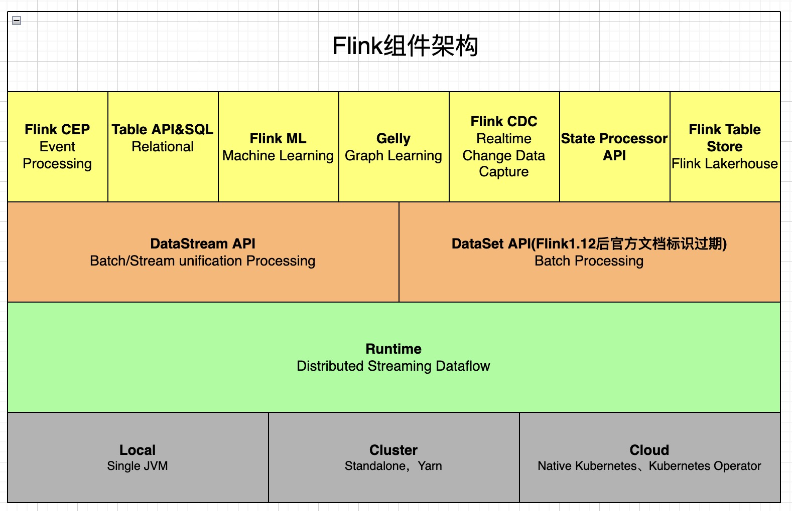
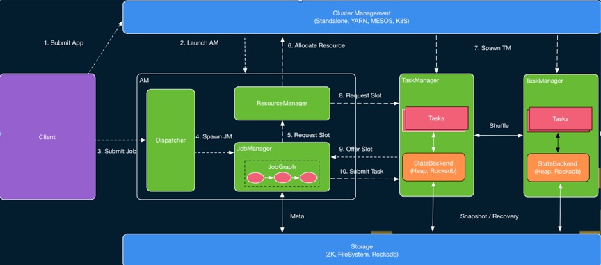
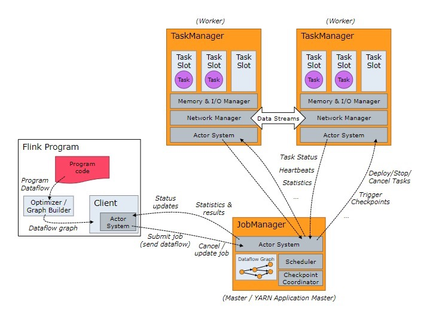

# Flink Runtime核心机制浅入深出

## 概览

* Flink在1.12版本对DataSet API标识为过期，并在支持逐渐将Connector组件的底层Source和Sink实现API更替为Data Source、Data Sink、SplitReader API，从而在Flink1.15版本之后对整体组件架构升级为流批一体架构；流批一体的目标是希望能够为有限数据和无限数据提供一套统一的处理 API，包括 Datastream API 与 Table/SQL API，其中有限数据的处理对应离线处理，而无限数据的处理则对应在线处理。本文主要对Flink Runtime整体架构、核心组件、资源管理和作业调度等方面进行介绍；

## Flink整体架构

* 下图为Flink整体架构图，其中主要包含最底层的部署层从Local环境到Standalone、Yarn环境再到最后的云原生环境Native Kubernetes和Kubernetes Operator。
* 针对不同的执行环境，Flink 提供了一套统一的分布式作业执行引擎，也就是 Flink Runtime 这层。Flink 在 Runtime 层之上提供了 DataStream 和 DataSet 两套 API，Flink1.12版本周后官方建议不再使用DataSet API(已被标记为软过期)，DataStream API为用户提供一套处理流批作业统一API；

* Flink Runtime的主要架构如要如下图所示，它主要描述了Flink程序和JobManger及TaskManger之前的工作流程具体代码实现可以参考[FLIP-6](https://cwiki.apache.org/confluence/pages/viewpage.action?pageId=65147077) ，整体来看，它采用了标准 master-slave 的结构，AM(ApplicationMaster)则为Master，它负责管理整个集群中的资源和作业；而右侧的两个 TaskExecutor 则是 Slave，负责提供具体的资源并实际执行作业。

* Runtime层包含了四个组件，即 Dispatcher、ResourceManager 和 JobManager、TaskManger。
  * **JobManager**
    * 控制应用程序的主进程，每个应用程序会被一个不同的JobManager所控制执行。
    * JobManger会先接收到执行的应用程序，这个应用程序包含：作业图(JobGrap)、逻辑数据流图(logic dataflow graph)和打包了所有的类、库和其他资源的jar包。
    * JobManager会把JobGraph转换成一个物理层面的数据流图，这个图被叫做“执行图”（ExecutionGraph），转换成可以并行执行的任务。
    * JobManager会向ResourceManager请求执行任务必要的资源，就是TaskManager所需的slot。一旦获取足够的资源，就会将执行图分发到真正运行它们的TaskManager上。运行过程中，JobManager负责所需要中央协调的操作，比如checkpoint、savepoint的元数据存储等。
  * **ResourceManager:**负责Flink集群中的资源取消/分配和供应-它管理taskslot，这些taskslot是Flink集群中资源调度的单位。 Flink为不同的环境（例如YARN，Mesos，Kubernetes和Standalone）实现了多个ResourceManager。 在独立设置中，ResourceManager只能分配可用TaskManager的插槽，而不能自行启动新的TaskManager。
  * **TaskManager**
    * 任务管理器中资源调度的最小单元是taskSlot。TaskManager中的taskSlot数表示并发处理任务的数量。
    * flink的工作进程存在多个，每个存在多个slot，slot的个数限制了TaskManager并发执行任务的数量。
    * 启动后TaskManager向ResourceManager注册它的slot，收到ResourceManager的指令后，TaskManager会将一个或多个slot提供给JobManager调用。JobManager可以向slot分配tasks来执行。
    * 执行的过程中，一个TaskManager可以跟其他运行同一个应用程序的TaskManager交换数据。（跨TaskManger网络传输）
  * **Dispatcher**
    * 可以跨作业运行，它为应用提交提供了REST接口。
    * 当一个应用被提交执行时，分发器就会启动并将应用移交给一个JM。
    * Dispatcher会启动一个Web UI，用来方便的展示和监听作业执行的信息。

