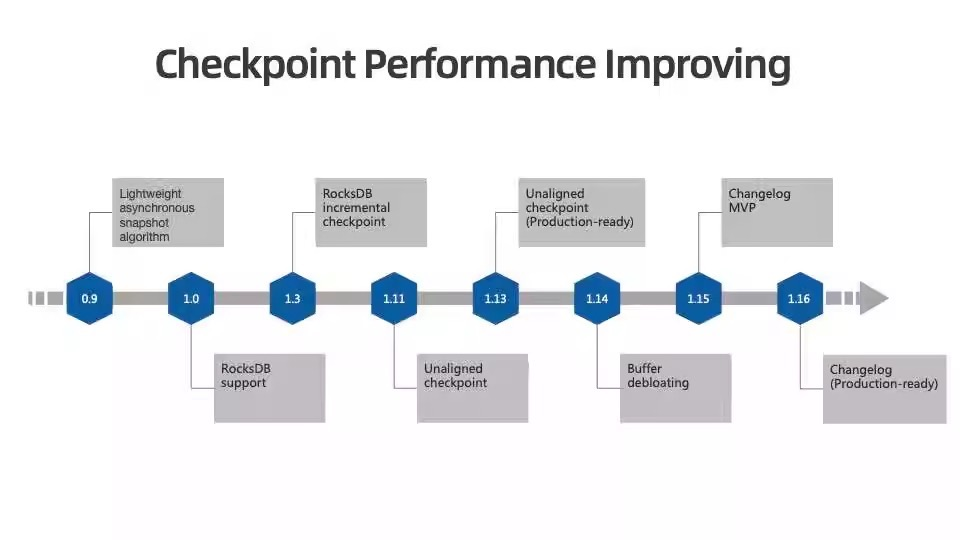
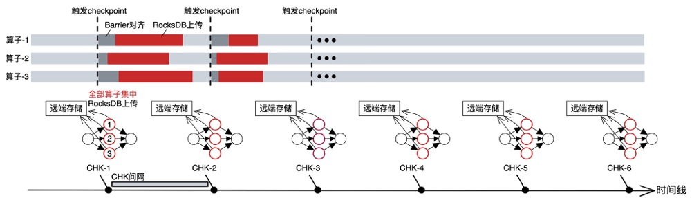
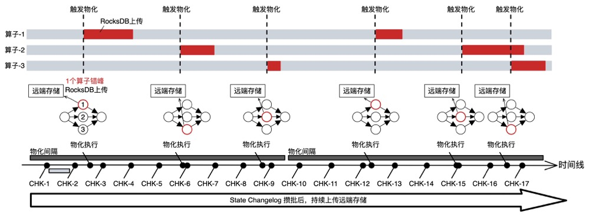
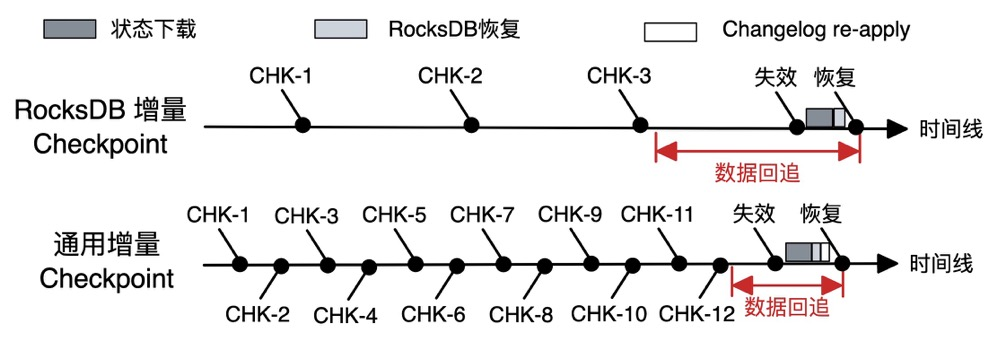
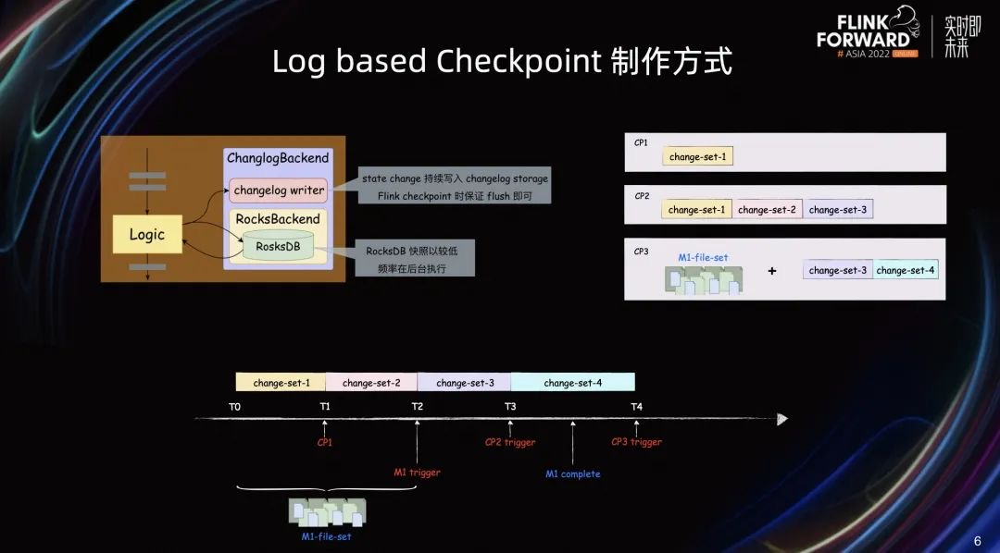
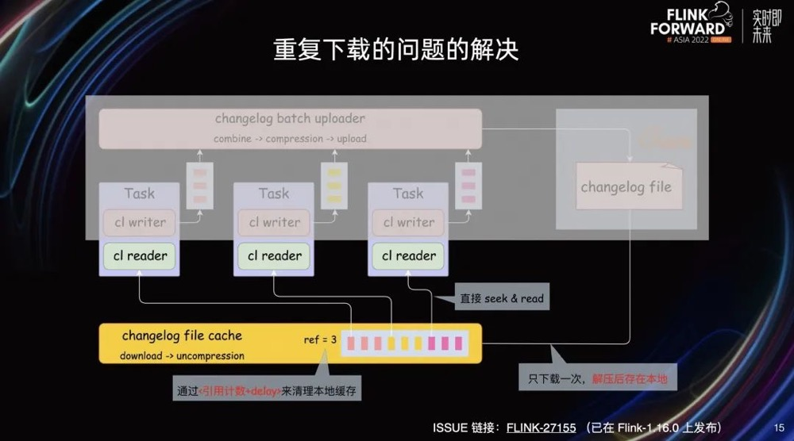
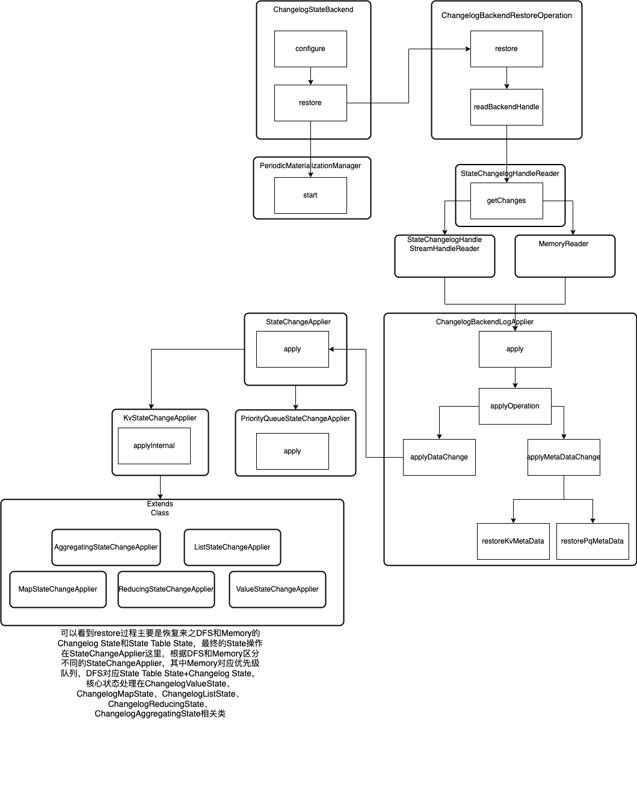

# 概念



* Flink Changelog Checkpoint是Flink1.15之后推出的一种基于增量Log方式的Checkpoint机制，它通过更通用的 Incremental Checkpoint 机制进一步提升了 Checkpoint 的异步性能。

## **Changelog Checkpoint的目标**

* 更稳定的Checkpoint
  * 通过解耦 Compaction 和 Checkpoint 过程，使 Checkpoint 更稳定，大幅减少 Checkpoint Duration 突增的情况，还可进一步减少 CPU 抖动，使网络带宽变得更平稳。
  * 在大规模、大状态作业上经常会出现 CPU 随着 Checkpoint 周期性抖动，进而影响作业和集群稳定性的情况。Changelog 通过解耦 Checkpoint 触发 Compaction 的过程，可以使 CPU 变得更平稳。另外，**在异步过程中，Compaction 导致的大量文件同时上传有时会将网络带宽打满， 而 Changelog 是能够缓解该状况的**。

**Rocksdb Checkpoint步骤**



**Changelog Checkpoint优化**

		1.通用增量 Checkpoint 通过将增量状态变化日志（State Changelog)**持续**上传到远端持久化存储，可以将网络流量的消耗均摊在整个 Checkpoint 过程中；

  	  2.Checkpoint 过程与存储后端快照过程解耦可以使得 RocksDB 低频、错峰执行物化过程，解决 RocksDB 频繁执行 Compaction 操作和集中向远端存储上传数据的问题，从而降低 CPU 和网络资源使用量和波动性。

* 更快速的Checkpoint
  * Checkpoint期间上传相对固定的增量数据，秒级/亚秒级完成Checkpoint
* 更小的端到端延迟
  * Flink 中实现端到端的 Exactly-once 语义主要依赖于 Checkpoint 的完成时间。Checkpoint 完成越快，Transactional sink 可以提交得更频繁，保证更好的数据新鲜度。后续可与 Paimon 结合，保证 Paimon上的数据更新鲜。
* 更少的数据追回
  * 通过设置更小的 Checkpoint Interval 加速 Failover 过程，可以减少数据回追。
  * **在没有使用 Exactly-once Sink 的情况下，数据回追会导致重复输出。**如果下游不支持完全去重，会在一定程度上影响数据正确性。



## Rocksdb增量Checkpoint

### 数据写入Rocksdb的过程

* 当一条 Record 写到 RocksDB 时，首先会写到 Memtable ，数据量达到 Memtable 阈值后会 Memtable 变为 **Immutable Memtable**；当数据量再达到整个 Memory 所有 Memtable 的阈值后，会 Flush 到磁盘，形成 SST Files 。L0 的 SST files 之间是有重叠的 。Flink 默认使用 RocksDB 的 Level Compaction 机制 ，因此在 L0 达到阈值后，会继续触发 Level Compaction，与 L1 进行 Compaction ，进一步可能触发后续 Level Compaction。

### Checkpoint 同步阶段和异步阶段过程

* 在同步过程中，Checkpoint 首先会触发 Memtable 强制 Flush，这一过程可能会触发后面级联的 Level Compaction，该步骤可能导致大量文件需要重新上传。同时，同步过程中会做 Local Checkpoint ，这是 RocksDB 本地的 Checkpoint 机制，对 Rocksdb 而言其实就是硬链接一些 SST Files，是相对轻量的。异步过程会将这些 SST Files 上传，同时写入 Meta 信息。

### Rocksdb增量ck存在的问题

* 数据量达到阈值，或者 Checkpoint 的同步阶段，**是会触发 Memtable Flush，进一步触发级联 Level Compation，进一步导致大量文件需要重新上传，如果需要上传的状态比较大，会在很短时间内对 CPU 和网络产生较大的压力。**
* 在大规模作业中，每次 Checkpoint 可能都会因为某一个 Subtask 异步时间过长而需要重新上传很多文件。端到端 Duration 会因为 **Compaction** 机制而变得很长。

## Changelog Checkpoint的改进

| 术语            | 描述                                                         |
| --------------- | ------------------------------------------------------------ |
| State Table     | 本地状态数据读写结构，如Rocksdb                              |
| Materialization | State table的持久化过程，目前会定时触发，在完成一次成功的Materialization(物化)后会Truncate Changelog |
| DSTL            | Durable Short-time Log(持久短时间日志).Changelog的存储组件   |
| Changelog       | 以Append-only Log形式存储的状态记录                          |

* **State Table** 是本地状态数据读写结构，比如 RocksDB。已有的 StateBackend（HashmapStateBackend/RocksDBStateBackend，或者自定义的一种StateBackend）均可以打开该功能 。而且在 1.16 中实现了 Changelog **开到关和关到开的兼容性，用户可以非常方便地在存量作业中使用**。
* Materialization **是 State Table 持久化的过程**，可以理解为 RocksDBStateBackend 或 HashmapStateBackend 做 Checkpoint 的过程。目前会定时触发，完成一次成功的 Materialization 后会 Truncate 掉 Changelog ，即做 Changelog 的清理。
* DSTL 是 Changelog 的存储组件。Changelog 的写入需要提供持久化、低延迟、一致性及并发支持。目前基于 **DFS** 实现了 DSTL。

### Changelog流程

* Changelog机制类似于WAL日志的机制，首先，在状态写入时，**会同时写到 State Table 和 DSTL**，如果 State Table 是 Rocksdb，那么它的后续流程就像我们刚才提到的一样，包括写 Memtable，Flush，触发 Compaction 等等过程。DSTL 这个部分会以操作日志的方式追加写入 DSTL，我们也支持了不同 State 类型的各种操作的写入。
* 其中 DSTL 会有一套完整的**定时持久化机制持久化到远端存储中**，所有 Changelog 将会在运行过程中连续上传，同时在 Checkpoint 上传较小的增量。
* State Table **会定时进行 Materialization**，在完成一次完整的 Materialization 后将会对 Changelog 进行 Truncate，清理掉失效的 Changelog，然后新的 Checkpoint 将以这个 Materialization 为基准继续持续上传增量。

>在状态写入时，会双写到 State Table 和 Dstl，读取时会从 State Table 中读取，即读写链路上只是多了个双写，且 Dstl 的部分是 append-only 的写入，会非常轻量级。
>
>在 Checkpoint 时，依赖于定时 Materilize State Table，以及定期 Persist Changelog，需要上传的增量会非常小，在上传小增量后只需要把 Materialization 部分的 Handle 和 Changelog 部分的 Handle 组合返回给 jm 即可。同时我们也会依赖于 Truncate 机制去及时清理无效 Changelog。
>
>在 Restore 时，我们拿到了 State Table 的 Handle 和 Changelog 的 Handle，State Table 部分会按之前的方式进行 Retsore，比如是 Rocksdb，在没开启 Local Recovery 时，会先下载远端 SST Files，再 Rebuild。Changelog 部分再没有开启 Local Recovery 时，会先下载远端 State Change，然后重新 Apply 到 State Table，Rebuild Changelog 部分。

### Changelog的额外开销

* **额外的存储空间**。Truncate 之前，State Changelog 会一直占用额外的存储空间。
* **额外的恢复开销**。Restore 过程需要额外 Apply 以及额外下载，因此也需要额外的恢复，恢复过程会占用耗时。
* **额外的性能开销**。State Changelog 会做定时上传，存在一定的性能开销。

# Checkpoint制作方式

## 普通增量快照制作方式


* RocksDBStateBackend Checkpoint 在制作时直接触发底层的 RocksDB 快照。在此过程中 RocksDB 需要将内存中的 MemTable Flush 到磁盘上，形成 L0 层的 SST 文件，以保证 SST 文件中保存了全量一致的状态数据。


## Log based checkpoint制作方式



- T0 时刻作业启动，随之开始处理数据。数据处理过程中不断地有 **State Change** 发生。T1 时刻 **Checkpoint-1** 触发，此时从 T0 到 T1 **所有 State Change 就是 Checkpoint-1 中的所有状态数据**，也就是图中的 Change-Set-1。
- T2 时刻触发了一次**物化**，即**异步制作 RocksDB 快照并上传，我们简称为 m1**。同时在 T2 时刻将在 State Changelog 中记录同步点，使得 T1 到 T2 之间的 State Change 构成 Change-Set-2。
- T3 时刻触发了 Checkpoint-2，**由于此时 m1 还没有完成，Checkpoint-2 仍然只由 Changelog 构成，即包含了 Change-Set-1、Change-Set-2 和 Change-Set-3。**在 Checkpoint-2 制作完成之后，m1 也制作完成了。
- T4 时刻触发了 Checkpoint-3，这时候可以发现存在一个最近完成的 m1，**Checkpoint-3 可以直接由 m1 及其之后的 Change-Set-3 和 Change-Set-4 构成。**
- 通过这种方式，Flink 的 Checkpoint 与底层的状态存储快照进行了解耦，使得 Flink Checkpoint 能够以较高的频率和速度执行。

# Changelog生产问题

## 基于DFS方式的Changelog Storage

**Changelog Restore重复下载问题**

* 为了避免产生过多小文件，同一 TaskManager 内的 State Changelog 会尽量聚合到同一个文件中。而在 Restore 时这些文件会被同一个 TM 内的 operator 重复下载，导致 Restore 性能差。
* **解决方案**
  * 减少同一个Tm的Slot个数，从而单个Tm Restore的读放大问题就会减缓，但是会加重小文件问题，因为Tm的个数变多了
  * 细粒度Restore流程，将原本的每个operator全量Restore changelog文件修改为每个operator Restore自己的changelog文件，已在ISSUE Flink-27155支持。
    * 在 TM 上增加一个 Changelog File Cache 组件，代理 Changelog 文件的下载。Cache 组件会在需要的时候将 Changelog 文件下载并直接解压缩后存储到本地，当 Changelog Reader 发起请求时，可以直接在本地缓存的文件上 Seek 到相应的 Offset 后读取。
    * 这样在 Restore 的过程中，每个 Changelog 文件都只需要下载和解压各一次。Changelog File Cache 组件会在内部对每个本地缓存文件记录引用计数，通过引用计数和可配置的 TTL 来清理本地缓存



**小文件问题严重，HDFS NameNode压力巨大**

* 即使经过 TM 粒度的聚合，小文件问题仍然严重，HDFS NN 压力巨大。以一个 4800 并发的作业为例，默认配置下会产生 130 万左右个 Changelog 文件，单个作业带来的 NN 请求高达 18000 次/秒左右。

**changelog文件写延迟太高，影响Checkpoint制作速度**

* 以 4800 并发作业为例，写 Changelog 文件 p99 延迟在 3 秒左右，最大延迟甚至达到 2 分钟，导致 Checkpoint 的制作时间非常不稳定。

# 源码分析

## Changelog状态后端

* ChangelogStateBackend、DeactivatedChangelogStateBackend-->ConfigurableStateBackend、AbstractChangelogStateBackend

### ConfigurableStateBackend

* 提供通过额外配置参数构建状态后端，通过`configure(ReadableConfig config, ClassLoader classLoader)`接口配置化构建状态后端

```java
@Internal
public interface ConfigurableStateBackend extends StateBackend {
    StateBackend configure(ReadableConfig config, ClassLoader classLoader)
            throws IllegalConfigurationException;
}
```

### AbstractChangelogStateBackend

* Changelog状态后端基础类，包含创建对于Changelog `Keyed`、`Operator`状态后端方法，其子类DeactivatedChangelogStateBackend、ChangelogStateBackend重写`restore`方法进行Changelog状态恢复

```java
// 核心方法restore，其实现类为DeactivatedChangelogStateBackend、ChangelogStateBackend
protected abstract <K> CheckpointableKeyedStateBackend<K> restore(
            Environment env,
            String operatorIdentifier,
            KeyGroupRange keyGroupRange,
            TtlTimeProvider ttlTimeProvider,
            MetricGroup metricGroup,
            Collection<ChangelogStateBackendHandle> stateBackendHandles,
            BaseBackendBuilder<K> baseBackendBuilder)
            throws Exception;
```

### ChangelogStateBackend

* Changelog状态后端，将工作状态保存在最底层的委托状态后端中(state table statebacked)，然后转发state更改为ChangelogState

```java
public class ChangelogStateBackend extends AbstractChangelogStateBackend
        implements ConfigurableStateBackend {

    private static final long serialVersionUID = 1000L;

    ChangelogStateBackend(StateBackend stateBackend) {
        super(stateBackend);
    }

    @Override
    public StateBackend configure(ReadableConfig config, ClassLoader classLoader)
            throws IllegalConfigurationException {

        // 如果委托类实现了ConfigurableStateBackend接口，直接创建ChangelogStateBackend
        if (delegatedStateBackend instanceof ConfigurableStateBackend) {
            return new ChangelogStateBackend(
                    ((ConfigurableStateBackend) delegatedStateBackend)
                            .configure(config, classLoader));
        }

        return this;
    }

    /**
     * 恢复快照逻辑
     *
     * @param env 执行环境
     * @param operatorIdentifier 算子标识
     * @param keyGroupRange keyGroupRange
     * @param ttlTimeProvider ttl配置
     * @param metricGroup 指标配置
     * @param stateBackendHandles 状态后端处理器
     * @param baseBackendBuilder
     * @param <K>
     *
     * @return
     *
     * @throws Exception
     */
    @Override
    @SuppressWarnings({"unchecked", "rawtypes"})
    protected <K> CheckpointableKeyedStateBackend<K> restore(
            Environment env,
            String operatorIdentifier,
            KeyGroupRange keyGroupRange,
            TtlTimeProvider ttlTimeProvider,
            MetricGroup metricGroup,
            Collection<ChangelogStateBackendHandle> stateBackendHandles,
            BaseBackendBuilder<K> baseBackendBuilder)
            throws Exception {
        StateChangelogStorage<?> changelogStorage =
                Preconditions.checkNotNull(
                        env.getTaskStateManager().getStateChangelogStorage(),
                        "Changelog storage is null when creating and restoring"
                                + " the ChangelogKeyedStateBackend.");

        String subtaskName = env.getTaskInfo().getTaskNameWithSubtasks();
        ExecutionConfig executionConfig = env.getExecutionConfig();

        ChangelogStateFactory changelogStateFactory = new ChangelogStateFactory();
      // 核心类ChangelogBackendRestoreOperation
        CheckpointableKeyedStateBackend<K> keyedStateBackend =
                ChangelogBackendRestoreOperation.restore(
                        env.getTaskManagerInfo().getConfiguration(),
                        env.getUserCodeClassLoader().asClassLoader(),
                        env.getTaskStateManager(),
                        stateBackendHandles,
                        baseBackendBuilder,
                        (baseBackend, baseState) ->
                                new ChangelogKeyedStateBackend(
                                        baseBackend,
                                        subtaskName,
                                        executionConfig,
                                        ttlTimeProvider,
                                        new ChangelogStateBackendMetricGroup(metricGroup),
                                        changelogStorage.createWriter(
                                                operatorIdentifier,
                                                keyGroupRange,
                                                env.getMainMailboxExecutor()),
                                        baseState,
                                        env.getCheckpointStorageAccess(),
                                        changelogStateFactory)
                                        .getChangelogRestoreTarget());
        // build changelogKeyed状态后端
        ChangelogKeyedStateBackend<K> changelogKeyedStateBackend =
                (ChangelogKeyedStateBackend<K>) keyedStateBackend;
        // build 定期Materialization管理器
        PeriodicMaterializationManager periodicMaterializationManager =
                new PeriodicMaterializationManager(
                        checkNotNull(env.getMainMailboxExecutor()),
                        checkNotNull(env.getAsyncOperationsThreadPool()),
                        subtaskName,
                        (message, exception) ->
                                env.failExternally(new AsynchronousException(message, exception)),
                        changelogKeyedStateBackend,
                        new ChangelogMaterializationMetricGroup(metricGroup),
                        executionConfig.getPeriodicMaterializeIntervalMillis(),
                        executionConfig.getMaterializationMaxAllowedFailures(),
                        operatorIdentifier);

        // keyedStateBackend is responsible to close periodicMaterializationManager
        // This indicates periodicMaterializationManager binds to the keyedStateBackend
        // However PeriodicMaterializationManager can not be part of keyedStateBackend
        // because of cyclic reference
        changelogKeyedStateBackend.registerCloseable(periodicMaterializationManager);

        // 启动定期Materialization管理器
        periodicMaterializationManager.start();

        return keyedStateBackend;
    }
}
```

* **ChangelogBackendRestoreOperation**:Changelog状态后端restore操作类

## Changelog Restore

* Changelog涉及到原始状态后端和Changelog增量变更状态，如何进行状态Restore是一个问题？具体流程如下图：



## Changelog State

### ChangelogAggregatingState

* Changelog聚合状态，实现与AggregatingState状态

```java
class ChangelogAggregatingState<K, N, IN, ACC, OUT>
        extends AbstractChangelogState<K, N, ACC, InternalAggregatingState<K, N, IN, ACC, OUT>>
        implements InternalAggregatingState<K, N, IN, ACC, OUT> {

    /**
     * key context,当前聚合key
     */
    private final InternalKeyContext<K> keyContext;

    ChangelogAggregatingState(
            InternalAggregatingState<K, N, IN, ACC, OUT> delegatedState,
            KvStateChangeLogger<ACC, N> changeLogger,
            InternalKeyContext<K> keyContext) {
        super(delegatedState, changeLogger);
        this.keyContext = keyContext;
    }

    /**
     * 将给定的源端Namespaces的当前键的状态合并到对象的状态目标Namespaces。
     * @param target The target namespace where the merged state should be stored.
     * @param sources The source namespaces whose state should be merged.
     * @throws Exception
     */
    @Override
    public void mergeNamespaces(N target, Collection<N> sources) throws Exception {
        // 合并stateTable Ns
        delegatedState.mergeNamespaces(target, sources);
        // 合并changelog Ns
        changeLogger.namespacesMerged(target, sources);
    }

    @Override
    public ACC getInternal() throws Exception {
        // 获取当前stateTable的value
        return delegatedState.getInternal();
    }

    @Override
    public void updateInternal(ACC valueToStore) throws Exception {
        // 更新当前stateTable的value
        delegatedState.updateInternal(valueToStore);
        // 更新changelog的value
        changeLogger.valueUpdatedInternal(valueToStore, getCurrentNamespace());
    }

    @Override
    public OUT get() throws Exception {
        // 获取当前stateTable的value，底层调用getInternal
        return delegatedState.get();
    }

    @Override
    public void add(IN value) throws Exception {
        // 底层调用stateTable的add方法
        delegatedState.add(value);
        // On recovery, we must end up with the same state as we have now in delegatedState.
        // However, the actual state update is generated by a user-defined function
        // which is not necessarily deterministic and immediately known on recovery.
        // Therefore, we have to store the whole current state (and there is no need to store the
        // added value).
        // Additionally, the updated state can be smaller than the added value (e.g. a counter);
        // or bigger (e.g. a list). But this can't be determined easily.
        changeLogger.valueUpdatedInternal(delegatedState.getInternal(), getCurrentNamespace());
    }

    @Override
    public void clear() {
        delegatedState.clear();
        try {
            changeLogger.valueCleared(getCurrentNamespace());
        } catch (IOException e) {
            ExceptionUtils.rethrow(e);
        }
    }

    @SuppressWarnings("unchecked")
    static <T, K, N, SV, S extends State, IS extends S> IS create(
            InternalKvState<K, N, SV> aggregatingState,
            KvStateChangeLogger<SV, N> changeLogger,
            InternalKeyContext<K> keyContext) {
        return (IS)
                new ChangelogAggregatingState<>(
                        (InternalAggregatingState<K, N, T, SV, ?>) aggregatingState,
                        changeLogger,
                        keyContext);
    }

    @Override
    public StateChangeApplier getChangeApplier(ChangelogApplierFactory factory) {
        return factory.forAggregating(delegatedState, keyContext);
    }
}
```

### ChangelogValueState

* changelog value state，包含state table和changelog state，具体api与ChangelogAggregatingState类似，底层调用AbstractStateChangeLogger#log方法，根据StateChangeOperation区分不同的操作类型

### ChangelogListState

* changelog list state,包含state table list state和changelog state

```java
class ChangelogListState<K, N, V>
        extends AbstractChangelogState<K, N, List<V>, InternalListState<K, N, V>>
        implements InternalListState<K, N, V> {

    private final InternalKeyContext<K> keyContext;

    ChangelogListState(
            InternalListState<K, N, V> delegatedState,
            KvStateChangeLogger<List<V>, N> changeLogger,
            InternalKeyContext<K> keyContext) {
        super(delegatedState, changeLogger);
        this.keyContext = keyContext;
    }

    @Override
    public void update(List<V> values) throws Exception {
        // 修改state table&changelog state
        delegatedState.update(values);
        changeLogger.valueUpdated(values, getCurrentNamespace());
    }

    @Override
    public void addAll(List<V> values) throws Exception {
        delegatedState.addAll(values);
        changeLogger.valueAdded(values, getCurrentNamespace());
    }

    @Override
    public void updateInternal(List<V> valueToStore) throws Exception {
        delegatedState.updateInternal(valueToStore);
        changeLogger.valueUpdatedInternal(valueToStore, getCurrentNamespace());
    }

    @Override
    public void add(V value) throws Exception {
        delegatedState.add(value);
        changeLogger.valueElementAdded(
                w ->
                        ((ListSerializer<V>) getValueSerializer())
                                .getElementSerializer()
                                .serialize(value, w),
                getCurrentNamespace());
    }

    @Override
    public void mergeNamespaces(N target, Collection<N> sources) throws Exception {
        delegatedState.mergeNamespaces(target, sources);
        // do not simply store the new value for the target namespace
        // because old namespaces need to be removed
        changeLogger.namespacesMerged(target, sources);
    }

    @Override
    public List<V> getInternal() throws Exception {
        // NOTE: Both heap and rocks return copied state. But in RocksDB, changes to the returned
        // value will not get into the snapshot.
        return delegatedState.getInternal();
    }

    @Override
    public Iterable<V> get() throws Exception {
        // NOTE: Both heap and rocks return copied state. But in RocksDB, changes to the returned
        // value will not get into the snapshot.
        return delegatedState.get();
    }

    @Override
    public void clear() {
        delegatedState.clear();
        try {
            changeLogger.valueCleared(getCurrentNamespace());
        } catch (IOException e) {
            ExceptionUtils.rethrow(e);
        }
    }

    @SuppressWarnings("unchecked")
    static <K, N, SV, S extends State, IS extends S> IS create(
            InternalKvState<K, N, SV> listState,
            KvStateChangeLogger<SV, N> changeLogger,
            InternalKeyContext<K> keyContext) {
        return (IS)
                new ChangelogListState<>(
                        (InternalListState<K, N, SV>) listState,
                        (KvStateChangeLogger<List<SV>, N>) changeLogger,
                        keyContext);
    }

    @Override
    public StateChangeApplier getChangeApplier(ChangelogApplierFactory factory) {
        return factory.forList(delegatedState, keyContext);
    }
}
```

### ChangelogMapState

* changelog map state,包含state table map state和changelog state

```java
class ChangelogMapState<K, N, UK, UV>
        extends AbstractChangelogState<K, N, Map<UK, UV>, InternalMapState<K, N, UK, UV>>
        implements InternalMapState<K, N, UK, UV> {

    private final InternalKeyContext<K> keyContext;

    ChangelogMapState(
            InternalMapState<K, N, UK, UV> delegatedState,
            KvStateChangeLogger<Map<UK, UV>, N> changeLogger,
            InternalKeyContext<K> keyContext) {
        super(delegatedState, changeLogger);
        this.keyContext = keyContext;
    }

    private Map.Entry<UK, UV> loggingMapEntry(
            Map.Entry<UK, UV> entry, KvStateChangeLogger<Map<UK, UV>, N> changeLogger, N ns) {
        // 构建Map.Entry<UK, UV>，并且将最新的entry写入changeLogger
        return new Map.Entry<UK, UV>() {
            @Override
            public UK getKey() {
                return entry.getKey();
            }

            @Override
            public UV getValue() {
                return entry.getValue();
            }

            @Override
            public UV setValue(UV value) {
                UV oldValue = entry.setValue(value);
                try {
                    changeLogger.valueElementAddedOrUpdated(
                            getWriter(entry.getKey(), entry.getValue()), ns);
                } catch (IOException e) {
                    ExceptionUtils.rethrow(e);
                }
                return oldValue;
            }
        };
    }

    @Override
    public UV get(UK key) throws Exception {
        return delegatedState.get(key);
    }

    @Override
    public void put(UK key, UV value) throws Exception {
        delegatedState.put(key, value);
        changeLogger.valueElementAddedOrUpdated(getWriter(key, value), getCurrentNamespace());
    }

    @Override
    public void putAll(Map<UK, UV> map) throws Exception {
        delegatedState.putAll(map);
        changeLogger.valueAdded(map, getCurrentNamespace());
    }

    @Override
    public void remove(UK key) throws Exception {
        delegatedState.remove(key);
        changeLogger.valueElementRemoved(out -> serializeKey(key, out), getCurrentNamespace());
    }

    @Override
    public boolean contains(UK key) throws Exception {
        return delegatedState.contains(key);
    }

    @Override
    public Iterable<Map.Entry<UK, UV>> entries() throws Exception {
        Iterator<Map.Entry<UK, UV>> iterator = delegatedState.iterator();
        return () -> getEntryIterator(iterator);
    }

    private Iterator<Map.Entry<UK, UV>> getEntryIterator(Iterator<Map.Entry<UK, UV>> iterator) {
        final N currentNamespace = getCurrentNamespace();
        return StateChangeLoggingIterator.create(
                CloseableIterator.adapterForIterator(
                        new Iterator<Map.Entry<UK, UV>>() {
                            @Override
                            public Map.Entry<UK, UV> next() {
                                return loggingMapEntry(
                                        iterator.next(), changeLogger, currentNamespace);
                            }

                            @Override
                            public boolean hasNext() {
                                return iterator.hasNext();
                            }

                            @Override
                            public void remove() {
                                iterator.remove();
                            }
                        }),
                changeLogger,
                (entry, out) -> serializeKey(entry.getKey(), out),
                currentNamespace);
    }

    @Override
    public Iterable<UK> keys() throws Exception {
        Iterable<UK> iterable = delegatedState.keys();
        return () ->
                StateChangeLoggingIterator.create(
                        CloseableIterator.adapterForIterator(iterable.iterator()),
                        changeLogger,
                        this::serializeKey,
                        getCurrentNamespace());
    }

    @Override
    public Iterable<UV> values() throws Exception {
        Iterator<Map.Entry<UK, UV>> iterator = entries().iterator();
        return () ->
                new Iterator<UV>() {
                    @Override
                    public boolean hasNext() {
                        return iterator.hasNext();
                    }

                    @Override
                    public UV next() {
                        return iterator.next().getValue();
                    }

                    @Override
                    public void remove() {
                        iterator.remove();
                    }
                };
    }

    @Override
    public Iterator<Map.Entry<UK, UV>> iterator() throws Exception {
        return getEntryIterator(delegatedState.iterator());
    }

    @Override
    public boolean isEmpty() throws Exception {
        return delegatedState.isEmpty();
    }

    @Override
    public void clear() {
        delegatedState.clear();
        try {
            changeLogger.valueCleared(getCurrentNamespace());
        } catch (IOException e) {
            ExceptionUtils.rethrow(e);
        }
    }

    private void serializeValue(UV value, DataOutputView out) throws IOException {
        getMapSerializer().getValueSerializer().serialize(value, out);
    }

    private void serializeKey(UK key, DataOutputView out) throws IOException {
        getMapSerializer().getKeySerializer().serialize(key, out);
    }

    private ThrowingConsumer<DataOutputView, IOException> getWriter(UK key, UV value) {
        return out -> {
            serializeKey(key, out);
            serializeValue(value, out);
        };
    }

    private MapSerializer<UK, UV> getMapSerializer() {
        return (MapSerializer<UK, UV>) getValueSerializer();
    }

    @SuppressWarnings("unchecked")
    static <UK, UV, K, N, SV, S extends State, IS extends S> IS create(
            InternalKvState<K, N, SV> mapState,
            KvStateChangeLogger<SV, N> changeLogger,
            InternalKeyContext<K> keyContext) {
        return (IS)
                new ChangelogMapState<>(
                        (InternalMapState<K, N, UK, UV>) mapState,
                        (KvStateChangeLogger<Map<UK, UV>, N>) changeLogger,
                        keyContext);
    }

    @Override
    public StateChangeApplier getChangeApplier(ChangelogApplierFactory factory) {
        return factory.forMap(delegatedState, keyContext);
    }
}
```

### ChangelogReducingState

* changelog reduce state,包含state table reduce state和changelog state
