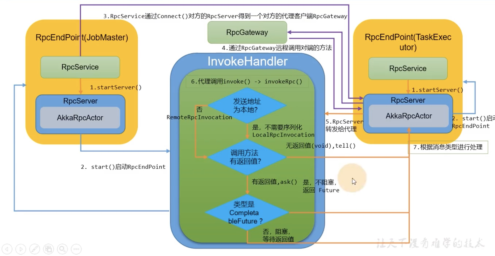
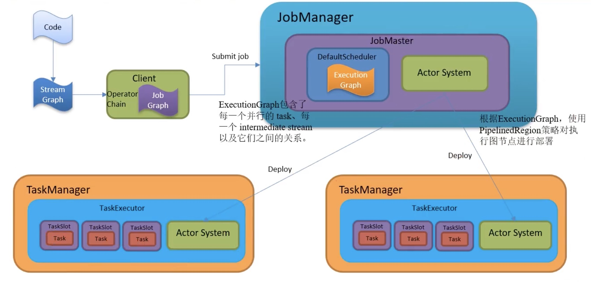
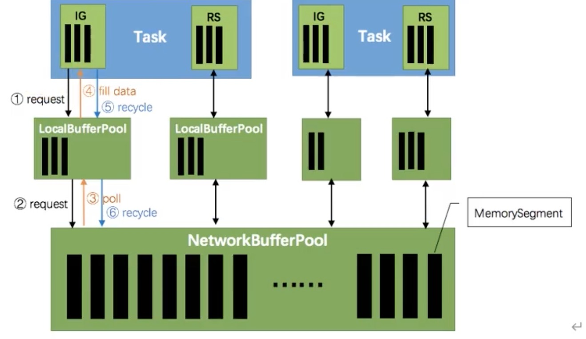

# 任务提交流程


* Flink run -t yarn-per-job -c xxxx xxx.jar

## CliFrontend

* `flink run`入口类`org.apache.flink.client.cli.CliFrontend `，通过`config.sh`读取Flink相关环境信息；
* 核心逻辑main方法，具体代码分析可以跟进`CliFrontend#run`方法

```java
public static void main(final String[] args) {
		EnvironmentInformation.logEnvironmentInfo(LOG, "Command Line Client", args);

		// 1. find the configuration directory
		// 获取flink-conf.yaml路径
		final String configurationDirectory = getConfigurationDirectoryFromEnv();

		// 2. load the global configuration
		// 根据路径加载配置
		final Configuration configuration = GlobalConfiguration.loadConfiguration(configurationDirectory);

		// 3. load the custom command lines
		// 加载自定义命令行，依次添加generic、yarn、default三种命令行客户端
		final List<CustomCommandLine> customCommandLines = loadCustomCommandLines(
			configuration,
			configurationDirectory);

		try {
			// 创建CliFrontend
			final CliFrontend cli = new CliFrontend(
				configuration,
				customCommandLines);

			SecurityUtils.install(new SecurityConfiguration(cli.configuration));
			int retCode = SecurityUtils.getInstalledContext()
					.runSecured(() -> cli.parseParameters(args));
			System.exit(retCode);
		}
		catch (Throwable t) {
			final Throwable strippedThrowable = ExceptionUtils.stripException(t, UndeclaredThrowableException.class);
			LOG.error("Fatal error while running command line interface.", strippedThrowable);
			strippedThrowable.printStackTrace();
			System.exit(31);
		}
	}
```

* 参数解析、封装CommandLine：三个执行对应命令、配置封装、执行用户代码、生成StreamGraph、Executor生成JobGraph、集群描述符：上传jar包、配置，封装提交给yarn、yarnClient提交应用

## ClusterEntrypoint

* applicationMaster执行入口类

* Dispatcher的创建和启动
* ResourceManager的创建、启动：里面有slotmanager（管理slot资源，向yarn申请资源）
* Dispatcher启动JobManager（里面有一个slotpool，发送真正的请求）
* slootpool向slotmanager申请资源，slotmanager向yarn申请资源（启动新节点）

## TaskExecutorRunner

* TaskManager的入口类
* 启动TaskExecutor
* 向RM注册slot，RM分配Slot，taskExecutor接收到分配的指令，提供offset给JobMaster（slotpool）
* JobMaster提交任务给TaskExecutor执行任务

# 组件通信

* Flink内部节点之间的通信是用的Akka，数据的网络传输是通过Netty。0.9版本开始使用Akka，主要影响的组件是JobManager、TaskManager、Dispatcher、ResourceManager等。

## Flink RPC过程



### RpcGateway

* 定义通信行为，用于调用RpcEndpoint的某些方法，相当于ActorRef。
* JobMaster、ResourcceManager、Dispatcher、TaskExecutor都有对应的网关接口。

### RpcEndpoint

* 通信终端，提供RPC服务组件的生命周期管理(start、stop)，每个RpcEndpoint对应了一个路径(endpointId和actorSystem确定)，每个路径对应一个Actor，其实现了RpcGateway接口。

### RpcService和RpcServer

* RpcEndpoint的成员变量

#### RpcService

* 根据提供的RpcEndpoint来启动和停止RpcServer(Actor)
* 根据提供的地址链接对方的RpcServer，并返回一个RpcGateway
* 延迟/立刻调度Runnable、Callable

Flink中实现类为AkkaRpcService，是Akka的ActorSystem的封装，基本可以理解为ActorSystem的一个适配器。

#### RpcServer

* 组件自身的代理，A组件通过B组件Gateway调用自身的rpcServer。
* AkkaInvocationHandler，封装ActorRef
* FencedAkkaInvocationHandler，封装ActorRef

### Rpc交互过程

#### 请求发送过程

* 在RpcService中调用connect方法与对端的RpcEndpoint(RpcServer)建立连接，connect方法根据给的地址返回InvocationHandler(AkkaInvacationHandler、FencedAkkaInvocationHanlder动态代理。)，核心查看invoke动态代理核心逻辑。

#### 响应过程

* AkkaRpcActor处理对应响应

# 任务调度

## Graph的概念


* Flink的执行图可以分成四层:StreamGraph->JobGraph->ExecutionGraph->物理执行图
* StreamGraph:是根据用户通过StreamAPI编写的代码生成的最初的图，表示程序的拓扑结构。
  * StreamNode:用来代表operator的类，并具有所有相关的属性，如并发度，入边和出边（表示算子的上游和下游）等。
  * StreamEdge:表示连续两个StreamNode的边。
* JobGraph:StreamGraph经过优化后生成了JobGraph，提交给JobManager的数据结构，会进行operator chain链优化，减少各个节点所需的序列化/反序列化/传输消耗。
  * JobVertex:经过优化后符合条件的多个StreamNode可能会chain在一起生成一个Vertex，即一个JobVertex包含一个或多个opeartor，JobVertext的输入是Jobedge，输出是IntermediateDataSet。
  * IntermediateDataSet:表示JobVertex的输出，即经过opeartor处理产生的数据集，producer是JobVertex，consumer是JobEdge。
  * JobEdge:代表了JobGraph中的一条数据传输通道。source是IntermediateDataSet，target是JobVertex。即数据通过JobEdge由IntermediateDataSet传递给目标的JobVertex。
* ExecutionGraph:JobManager根据JobGraph生成ExecutionGraph，是并行版本的JobGraph，是调度层最核心的数据结构。
  * ExecutionVertex:表示ExecutionJobVertex的其中一个并发子任务，输入是ExecutionEdge，输出是IntermediateResultPartition。
  * IntermediateResult:和JobGraph的IntermediateDataSet一一对应。`一个IntermediateResult包含多个IntermediateResultPartition`，其个数等于该operator的并行度。
  * IntermediateResultPartition:表示ExecutionVertex的一个输入分区，producer是ExecutionVertex，consumer是若干个Executionedge。
  * ExecutionEdge:表示ExecutionVertex的输入，source是IntermediateResultPartition，traget是ExecutionVertex，source和target都只能有一个。
  * Execution:是执行一个ExecutionVertex的一次尝试，当发生故障或者数据需要重算的情况下ExecutionVertex可能会有多个ExecutionAttemptID，一个Execution通过ExecutionAttemptID来唯一标识。JM和TM之间关于task的部署和task status的更新都是通过ExecutionAttemptID来确定消息接受者。
* 物理执行图:JobManager根据executionGraph对Job进行调度后，在各个TaskManager上部署Task后形成的"图"，并不是一个具体的数据结构。
  * Task:Execution被调度后分配的TaskManager中启动对应的Task。Task包裹来具有用户执行逻辑的operator。
  * ResultPartition:代表一个Task的生成的数据，和ExecutionGraph的IntermediateResultPartition一一对应。
  * ResultSubPartition:是ResultPartition的一个子分区。每个ResultPartition都多个ResultSubPartition，其数目要由下游消费Task数和DistributionPattern来决定。
  * InputGate:代表Task的输入封装。每个InputGate消费一个或多个ResultPartition。
  * InputChannel:每个InputGate会包含一个以上的InputChannel，和ExecutionGraph的ExecutionEdge一一对应，也和ResultSubPartition一对一地相连，即一个InputChannel接收一个ResultSubPartition的输出。

## Task任务调度



## StreamGraph在Client生成

* StreamExecutionEnvironment.execute()

```
-->execute(jobName):
		-->getStreamGraph(jobName);
			-->getStreamGraphGenerator()
			   -->最终通过StreamGraph streamGraph = getStreamGraphGenerator().setJobName(jobName).generate();生成流图
```

* 核心逻辑查看github flink源码的StreamGraph和StreamNode及StreamEdge相关源码。

## JobGraph在Client生成

### JobGraph生成流程

```
-->PipelineExecutor#execute()
   -->PipelineExecutorUtils.getJobGraph(pipeline, configuration);
      -->StreamGraphTranslator#translateToJobGraph
```

### StreamGraph到JobGraph的转换

* StreamNode转换JobVertex
  * 每个JobVertex都对应可序列化的StreamConfig，用来发送给JobManager和TaskManager。最后在TM中起Task时，需要从这里反序列化出所需要的配置信息，包含用户代码含有的StreamOpeator。
  * setChaining会对source调用createChain方法，将StreamNode转换成JobVertex放置在内存里，并将配置放入StreamConfig中。
* StreamEdge转换JobEdge
* JobEdge和JobVertex之间创建IntermediateDataSet来连接
  * connect方法创建JobEdge和创建中间结果集连接。

## ExecutionGraph在JobManager生成

* 将JobGraph并行化，JobVertex转换为ExecutionJobVertex，interalmediaDataset转换IntermediateResult，JobEdge转换ExecutionJobEdge。

### ExecutionGraph生成方式

```
-->Dispatcher#runJob()
	-->Dispatcher#createJobManagerRunner
		 -->DefaultJobManagerRunnerFactory#createJobManagerRunner
		   -->DefaultJobMasterServiceFactory#createJobMasterService
		   		-->JobMaster构造方法的createScheduler方法
		   			-->DefaultSchedulerFactory#createInstance
		   			   -->SchedulerBase#createAndRestoreExecutionGraph
```

* createAndRestoreExecutionGraph内部涉及到jobGraph各个组件转换的ExecutionGraph的操作。

## 物理执行图(Task的调度和执行)

* ExecutionGraph各个组件拆分执行逻辑流程

```
-->JobMaster#startJobExecution
	-->JobMaster#resetAndStartScheduler
		-->SchedulerBase#startScheduling
			-->SchedulerBase#startSchedulingInternal
				-->DefaultScheduler#startScheduling
					-->PipelinedRegionSchedulingStrategy#startScheduling 默认调度策略
						-->PipelinedRegionSchedulingStrategy#maybeScheduleRegions
							-->DefaultScheduler#allocateSlotsAndDeploy
								-->Execution#deploy
```

### Task执行

```
-->TaskManangerGateway#submitTask
	-->RpcTaskManangerGateway#submitTask
		-->TaskExecutor#submitTask
			-->Task#startTaskThread
				-->StreamTask#invoke
					-->MailboxProcessor#runMailboxLoop
```

## 调度

### 调度器

* SchedulerNG及其子类、实现类

#### 作用

* 作业的生命周期管理，如作业的发布、挂起、取消。
* 作业执行资源的申请、分配、释放。
* 作业的状态管理，作业发布过程中的状态变化和作业异常时的FailOver等。
* 作业的信息提供，对外提供作业的详细信息。

#### 实现类

* SchedulerBase、DefaultScheduler

### 调度模式

* 主要分为流和批次

#### Eager调度

* 适用于流计算，一次性申请需要的所有资源，如资源不足，则作业启动失败。

#### 分阶段调度

* LAZY_FROM_SOURCES适用于批处理，从SourceTask开始分阶段调度，申请资源的时候，一次性申请本阶段所需要的所有资源。上游Task执行完毕后开始调度执行下游的Task，读取上游的数据，执行本阶段的计算任务，执行完毕之后，调度后一个阶段的Task，依次进行调度，直到作业完成。

#### 分阶段Slot重用调度

* LAZY_FROM_SOURCES_WITH_BATCH_SLOT_REQUEST适用于批处理。与分阶段调度基本一样，区别在于该模式下适用批处理资源申请模式，可以在资源不足的情况下执行作业，但是需要确保在本阶段的作业执行中没有Shuffle行为。

### 调度策略

* SchedulingStrategy
  * EagerSchedulingStrategy:适用于流计算，同时调度所有的task
  * LazyFromSourcesSchedulingStrategy:适用于批计算，当输入数据准备好时(上游处理完)进行vertices调度。
  * PipelinedRegionSchedulingStrategy:以流水线的局部为粒度进行调度。从1.11加入，1.12开始作为任务的默认调度策略。

# 内存管理

* Flink自定义了内存管理机制，规避传统JVM内存管理存在的问题，多级缓存未命中，内存占用过大，Full GC问题等

## JobMananger内存模型

* `jobmananger.memory.process.size`管理堆外堆内内存，以及metaspace、jvmoverhead相关

### JobManagerFlinkMemory

```
 *               ┌ ─ ─  Total Flink Memory - ─ ─ ┐
 *                 ┌───────────────────────────┐
 *               | │       JVM Heap Memory     │ |
 *                 └───────────────────────────┘
 *               │ ┌───────────────────────────┐ │
 *                 |    Off-heap Heap Memory   │   -─ JVM Direct Memory
 *               │ └───────────────────────────┘ │
 *               └ ─ ─ ─ ─ ─ ─ ─ ─ ─ ─ ─ ─ ─ ─ ─ ┘
```

### 内存分配

```
-->YarnClusterDescriptor#startAppMaster
	-->JobManagerProcessUtils#processSpecFromConfigWithNewOptionToInterpretLegacyHeap
		-->JobManagerProcessUtils#processSpecFromConfig
			-->JobManagerProcessUtils#createMemoryProcessSpec
```

## TaskManager内存模型

**taskManager使用堆上和堆外内存**

* Flink框架内存使用了堆上和堆外内存，不计入slot资源
* Task执行的内存使用了堆上内存和堆外内存。
* 网络缓冲内存:网络数据交换所使用的堆外内存大小，如网络数据交换缓冲区

**框架堆外内存、Task堆外内存、网络缓冲内存，都在堆外的直接内存里**

* 管理内存:Flink管理的堆外内存。用于管理排序、哈希表、缓存中间结果及RocksDB State Backend的本地内存。
* JVM特有内存:JVM本身占用的内存，包括Metaspace和执行开销JVMOverhead。

```
Flink使用内存=框架堆内和堆外内存+Task堆内和堆外内存+网络缓冲内存+管理内存
进程内存=Flink内存+JVM特有内存
```

### TaskExecutorFlinkMemory

```
 *               ┌ ─ ─  Total Flink Memory - ─ ─ ┐
 *               |┌ ─ ─ - - - On-Heap - - - ─ ─ ┐|
 *                 ┌───────────────────────────┐
 *               |││   Framework Heap Memory   ││|
 *                 └───────────────────────────┘
 *               │ ┌───────────────────────────┐ │
 *                ||      Task Heap Memory     ││
 *               │ └───────────────────────────┘ │
 *                └ ─ ─ ─ ─ ─ ─ ─ ─ ─ ─ ─ ─ ─ ─ ┘
 *               |┌ ─ ─ - - - Off-Heap  - - ─ ─ ┐|
 *                │┌───────────────────────────┐│
 *               │ │ Framework Off-Heap Memory │ │ ─┐
 *                │└───────────────────────────┘│   │
 *               │ ┌───────────────────────────┐ │  │
 *                ││   Task Off-Heap Memory    ││   ┼─ JVM Direct Memory
 *               │ └───────────────────────────┘ │  │
 *                │┌───────────────────────────┐│   │
 *               │ │      Network Memory       │ │ ─┘
 *                │└───────────────────────────┘│
 *               │ ┌───────────────────────────┐ │
 *                |│      Managed Memory       │|
 *               │ └───────────────────────────┘ │
 *                └ ─ ─ ─ ─ ─ ─ ─ ─ ─ ─ ─ ─ ─ ─ ┘
 *               └ ─ ─ ─ ─ ─ ─ ─ ─ ─ ─ ─ ─ ─ ─ ─ ┘
```

### 内存分配

```
-->ActiveResourceManager#requestNewWorker
	-->TaskExecutorProcessUtils#processSpecFromWorkerResourceSpec
```

## 内存数据结构

### 内存段

* 内存段是MemorySegment，是Flink中最小的内存分配单元，默认大小32KB。它是堆上内存(Java的byte数组)，也可以是堆外内存 (基于Netty的DirectByteBuffer)，同时提供了对二进制数据进行读取和写入的方法。
* 实现类为HeapMemorySegment、HybridMemorySegment
  * HeapMemorySegment:用来分配堆上内存
  * HybridMemorySegment用来分配堆外和堆上内存，目前主要使用HybridMemorySegment

### 内存页

* 内存页是MemorySegement之上的数据访问视图，数据读取抽象为DataInputView，数据写入抽象为DataOutputView。

### Buffer

* Task算子之间在网络层面上传输数据，使用的是Buffer，申请和释放由Flink自行管理，实现类为NetworkBuffer。1个NetworkBuffer包装一个MemorySegment，同时继承了AbstractReferenceCountedByteBuffer，是Netty的抽象类。

### Buffer资源池

* BufferPool用来管理Buffer，包含Buffer的申请、释放、销毁、可用Buffer通知等，实现类是LocalBufferPool，每个**Task拥有自己的LocalBufferPool**。
* BufferPoolFactory用来提供BufferPool的创建和销毁，唯一的实现类是NetworkBufferPool，每个TaskManager只有一个NetworkBufferPool。同一个TaskManager上的Task共享NetworkBufferPool。

## 内存管理器

* MemoryManager用来管理Flink中用于排序、Hash表、中间结果缓存或使用堆外内存的状态后端的内存。1.10之前负责TM所有内存，1.10之后范围为Slot级别。

### 堆外内存资源申请

```
-->MemoryManager#allocatePages
	-->MemorySegmentFactory#allocateOffHeapUnsafeMemory 创建默认的HybridMemorySegment
```

## 网络传输中的内存管理

* 可以查看[Flink反压机制](./Flink网络流控及反压.md)

