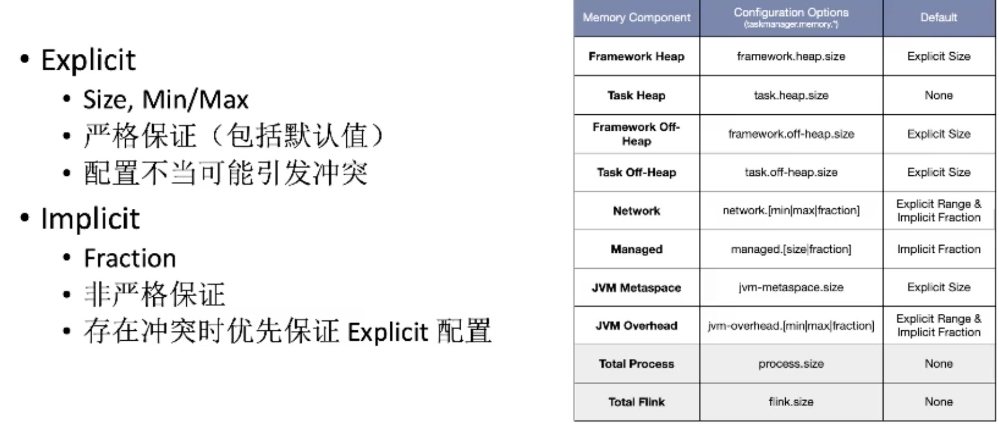
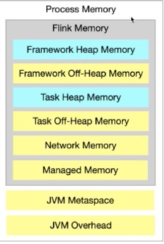
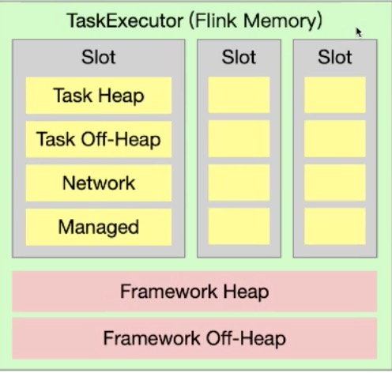

# TaskManager内存配置

## 内存配置

### 配置概览


### 严格和非严格配置



* 不建议`total process`、`total flink`、`task Heap&Managed`同时配置两项以上，因为子项和总内存都配置的话会因为严格匹配的原因导致冲突，所以其中至少有一项配置。

### 配置参数描述

| **组成部分**                                                 | **配置参数**                                                 | **描述**                                                     |
| :----------------------------------------------------------- | :----------------------------------------------------------- | :----------------------------------------------------------- |
| [框架堆内存（Framework Heap Memory）](https://ci.apache.org/projects/flink/flink-docs-release-1.11/zh/ops/memory/mem_setup_tm.html#framework-memory) | [`taskmanager.memory.framework.heap.size`](https://ci.apache.org/projects/flink/flink-docs-release-1.11/zh/ops/config.html#taskmanager-memory-framework-heap-size) | 用于 Flink 框架的 JVM 堆内存（进阶配置）。                   |
| [任务堆内存（Task Heap Memory）](https://ci.apache.org/projects/flink/flink-docs-release-1.11/zh/ops/memory/mem_setup_tm.html#task-operator-heap-memory) | [`taskmanager.memory.task.heap.size`](https://ci.apache.org/projects/flink/flink-docs-release-1.11/zh/ops/config.html#taskmanager-memory-task-heap-size) | 用于 Flink 应用的算子及用户代码的 JVM 堆内存。               |
| [托管内存（Managed memory）](https://ci.apache.org/projects/flink/flink-docs-release-1.11/zh/ops/memory/mem_setup_tm.html#managed-memory) | [`taskmanager.memory.managed.size`](https://ci.apache.org/projects/flink/flink-docs-release-1.11/zh/ops/config.html#taskmanager-memory-managed-size) [`taskmanager.memory.managed.fraction`](https://ci.apache.org/projects/flink/flink-docs-release-1.11/zh/ops/config.html#taskmanager-memory-managed-fraction) | 由 Flink 管理的用于**排序、哈希表、缓存中间结果及 RocksDB State Backend** 的本地内存。 |
| [框架堆外内存（Framework Off-heap Memory）](https://ci.apache.org/projects/flink/flink-docs-release-1.11/zh/ops/memory/mem_setup_tm.html#framework-memory) | [`taskmanager.memory.framework.off-heap.size`](https://ci.apache.org/projects/flink/flink-docs-release-1.11/zh/ops/config.html#taskmanager-memory-framework-off-heap-size) | 用于 Flink 框架的[堆外内存（直接内存或本地内存）](https://ci.apache.org/projects/flink/flink-docs-release-1.11/zh/ops/memory/mem_setup_tm.html#configure-off-heap-memory-direct-or-native)（进阶配置）。 |
| [任务堆外内存（Task Off-heap Memory）](https://ci.apache.org/projects/flink/flink-docs-release-1.11/zh/ops/memory/mem_setup_tm.html#configure-off-heap-memory-direct-or-native) | [`taskmanager.memory.task.off-heap.size`](https://ci.apache.org/projects/flink/flink-docs-release-1.11/zh/ops/config.html#taskmanager-memory-task-off-heap-size) | 用于 Flink 应用的算子及用户代码的[堆外内存（直接内存或本地内存）](https://ci.apache.org/projects/flink/flink-docs-release-1.11/zh/ops/memory/mem_setup_tm.html#configure-off-heap-memory-direct-or-native)。 |
| 网络内存（Network Memory）                                   | [`taskmanager.memory.network.min`](https://ci.apache.org/projects/flink/flink-docs-release-1.11/zh/ops/config.html#taskmanager-memory-network-min) [`taskmanager.memory.network.max`](https://ci.apache.org/projects/flink/flink-docs-release-1.11/zh/ops/config.html#taskmanager-memory-network-max) [`taskmanager.memory.network.fraction`](https://ci.apache.org/projects/flink/flink-docs-release-1.11/zh/ops/config.html#taskmanager-memory-network-fraction) | 用于任务之间数据传输的直接内存（例如网络传输缓冲）。该内存部分为基于 [Flink 总内存](https://ci.apache.org/projects/flink/flink-docs-release-1.11/zh/ops/memory/mem_setup.html#configure-total-memory)的[受限的等比内存部分](https://ci.apache.org/projects/flink/flink-docs-release-1.11/zh/ops/memory/mem_setup.html#capped-fractionated-components)。NetworkBufferPool |
| [JVM Metaspace](https://ci.apache.org/projects/flink/flink-docs-release-1.11/zh/ops/memory/mem_setup.html#jvm-parameters) | [`taskmanager.memory.jvm-metaspace.size`](https://ci.apache.org/projects/flink/flink-docs-release-1.11/zh/ops/config.html#taskmanager-memory-jvm-metaspace-size) | Flink JVM 进程的 Metaspace。                                 |
| JVM 开销                                                     | [`taskmanager.memory.jvm-overhead.min`](https://ci.apache.org/projects/flink/flink-docs-release-1.11/zh/ops/config.html#taskmanager-memory-jvm-overhead-min) [`taskmanager.memory.jvm-overhead.max`](https://ci.apache.org/projects/flink/flink-docs-release-1.11/zh/ops/config.html#taskmanager-memory-jvm-overhead-max) [`taskmanager.memory.jvm-overhead.fraction`](https://ci.apache.org/projects/flink/flink-docs-release-1.11/zh/ops/config.html#taskmanager-memory-jvm-overhead-fraction) | 用于其他 JVM 开销的本地内存，例如栈空间、垃圾回收空间等。该内存部分为基于[进程总内存](https://ci.apache.org/projects/flink/flink-docs-release-1.11/zh/ops/memory/mem_setup.html#configure-total-memory)的[受限的等比内存部分](https://ci.apache.org/projects/flink/flink-docs-release-1.11/zh/ops/memory/mem_setup.html#capped-fractionated-components)。 |

## 内存模型

* Flink JVM 进程的*进程总内存（Total Process Memory）*包含了由 Flink 应用使用的内存（*Flink 总内存*）以及由运行 Flink 的 JVM 使用的内存。 *Flink 总内存（Total Flink Memory）*包括 *JVM 堆内存（Heap Memory）*和*堆外内存（Off-Heap Memory）*。 其中堆外内存包括*直接内存（Direct Memory）*和*本地内存（Native Memory）*。

### 内存分块图




#### Frameworks和Task 的区别



* 区别:是否计入Slot资源，Task计入Slot资源，Framework不计入Slot资源
* 总用量限制
  * -Xmx=Framework Heap+Task Heap
  * -Xx:MaxDiectMemorySize=...+Framework Off-heap+Task Off-Heap
* Slot和Framwork的内存无隔离

#### Heap和Off-Heap Memory

* Heap
  * 大多数Java对象
  * HeapStateBackend存储的State
* Off-Heap
  * Direct
    * DirectbyteBuffer
    * MappedByteBuffer
  * Native
    * JNI，C/C++，Python，etc

#### NetWork Memory

* Direct Memory
* 用于数据传输缓冲，NetworkBufferPool
* 特点
  * 同一个taskExecutor的各slot之间没有隔离
  * 需要多少由作业拓扑决定，不足会导致运行失败
* Task的网络内存计算

```shell
networkMemory=bufferSize<32KB>*inputBuffers=remoteChannles*buffersPerChannel<2>+gates*buffersPergates<8>


remoteChannels 不在当前TM的上游SubTask的数量
gates 上游task数量
subpartitions 下游subtask数量
```

#### Managed Memory

* Native Memory
* 用于:RocksDBStateBackend、Batch Operator、HeapStateBackend/无状态不需要Managed Meory可以设置为0
* 特点
  * 统一个TaskExecutor的各个slot之间严格隔离
  * 与性能挂钩
* RocksDB内存限制
  * `state.backend.rocksdb.memory.managed(default:true)`
  * 设置RocksDB使用内存大小为Managed Memory大小
  * 目的:防止容器内存超用

#### JVM Metaspace& Overhead

* Metaspace
  * 存放JVM加载的类的元数据
  * 加载的类越多，需要的空间越大
* 需要调大Metaspace的情况
  * Metaspace OOM问题
  * 需要加载大量的第三方内库
  * 多个不同作业的任务运行在同一个TaskExecutor上
* JVM Overhead
  * Native Memory
  * 用于其他JVM开销
    * Code Cache
    * Thread Stack

## 内存特性

### Java内存类型


* Heap和OffHeap
* 底层又分为Young和Old区域

### Heap Memory特性

* 包括:`Framework Heap Memory`和`Task heap Memory` 
* 用量上限受于JVM控制
  * -Xmx:Framework Heap+Task heap
  * 达到上限后触发GC
  * GC后仍然空间不足，触发OOM异常并退出

### Direct Memory&Metaspace特性

#### Direct Meory

* 包括Framework和Task的Off-Heap以及Netowrk memory
* 用量受-XX:MaxDirectMemorySize限制
* 达到上限时触发GC，GC后仍然空间不足触发OOM异常并退出

#### Metaspace

* 受限制与-XX:MetaspaceSize

### Native Memory特性

* Framework Off-Heap Memory（部分）
* Task Off-Heap Memory（部分）
* Managed Memory
* JVM Overhead
* 用量上限不受JVM控制

# JobManager内存

## 参数配置

### 配置总内存

* `jobmanager.memory.process.size`
* `jobmanager.memory.flink.size`

### 详细配置


| **组成部分**                                                 | **配置参数**                                                 | **描述**                                                     |
| :----------------------------------------------------------- | :----------------------------------------------------------- | :----------------------------------------------------------- |
| [JVM 堆内存](https://ci.apache.org/projects/flink/flink-docs-release-1.11/zh/ops/memory/mem_setup_jobmanager.html#configure-jvm-heap) | [`jobmanager.memory.heap.size`](https://ci.apache.org/projects/flink/flink-docs-release-1.11/zh/ops/config.html#jobmanager-memory-heap-size) | JobManager 的 *JVM 堆内存*。                                 |
| [堆外内存](https://ci.apache.org/projects/flink/flink-docs-release-1.11/zh/ops/memory/mem_setup_jobmanager.html#configure-off-heap-memory) | [`jobmanager.memory.off-heap.size`](https://ci.apache.org/projects/flink/flink-docs-release-1.11/zh/ops/config.html#jobmanager-memory-off-heap-size) | JobManager 的*堆外内存（直接内存或本地内存）*。              |
| [JVM Metaspace](https://ci.apache.org/projects/flink/flink-docs-release-1.11/zh/ops/memory/mem_setup.html#jvm-parameters) | [`jobmanager.memory.jvm-metaspace.size`](https://ci.apache.org/projects/flink/flink-docs-release-1.11/zh/ops/config.html#jobmanager-memory-jvm-metaspace-size) | Flink JVM 进程的 Metaspace。                                 |
| JVM 开销                                                     | [`jobmanager.memory.jvm-overhead.min`](https://ci.apache.org/projects/flink/flink-docs-release-1.11/zh/ops/config.html#jobmanager-memory-jvm-overhead-min) [`jobmanager.memory.jvm-overhead.max`](https://ci.apache.org/projects/flink/flink-docs-release-1.11/zh/ops/config.html#jobmanager-memory-jvm-overhead-max) [`jobmanager.memory.jvm-overhead.fraction`](https://ci.apache.org/projects/flink/flink-docs-release-1.11/zh/ops/config.html#jobmanager-memory-jvm-overhead-fraction) | 用于其他 JVM 开销的本地内存，例如栈空间、垃圾回收空间等。该内存部分为基于[进程总内存](https://ci.apache.org/projects/flink/flink-docs-release-1.11/zh/ops/memory/mem_setup.html#configure-total-memory)的[受限的等比内存部分](https://ci.apache.org/projects/flink/flink-docs-release-1.11/zh/ops/memory/mem_setup.html#capped-fractionated-components)。 |

## 内存特性

### 堆内内存

* 以下会用到堆内内存
  * 用于Flink框架
  * 在作业提交时（例如一些特殊的批处理 Source）及 Checkpoint 完成的回调函数中执行的用户代码
* 需要多少堆内内存取决于运行的作业数量、作业的结构及上述用户代码需求。

### 堆外内存

* *堆外内存*包括 *JVM 直接内存* 和 *本地内存*。 可以通过配置参数 [`jobmanager.memory.enable-jvm-direct-memory-limit`](https://ci.apache.org/projects/flink/flink-docs-release-1.11/zh/ops/config.html#jobmanager-memory-enable-jvm-direct-memory-limit) 设置是否启用 *JVM 直接内存限制*。 如果该配置项设置为 `true`，Flink 会根据配置的*堆外内存*大小设置 JVM 参数 *-XX:MaxDirectMemorySize*。 
* 可以通过配置参数 [`jobmanager.memory.off-heap.size`](https://ci.apache.org/projects/flink/flink-docs-release-1.11/zh/ops/config.html#jobmanager-memory-off-heap-size) 设置堆外内存的大小。 如果遇到 JobManager 进程抛出 “OutOfMemoryError: Direct buffer memory” 的异常，可以尝试调大这项配置。
* 以下情况可能用到堆外内存：
  - Flink 框架依赖（例如 Akka 的网络通信）
  - 在作业提交时（例如一些特殊的批处理 Source）及 Checkpoint 完成的回调函数中执行的用户代码

# 工具

## bash-java-utils.jar

* Flink目录bin下的bash-java-utils.jar

* https://github.com/KarmaGYZ/flink-memory-calculator


