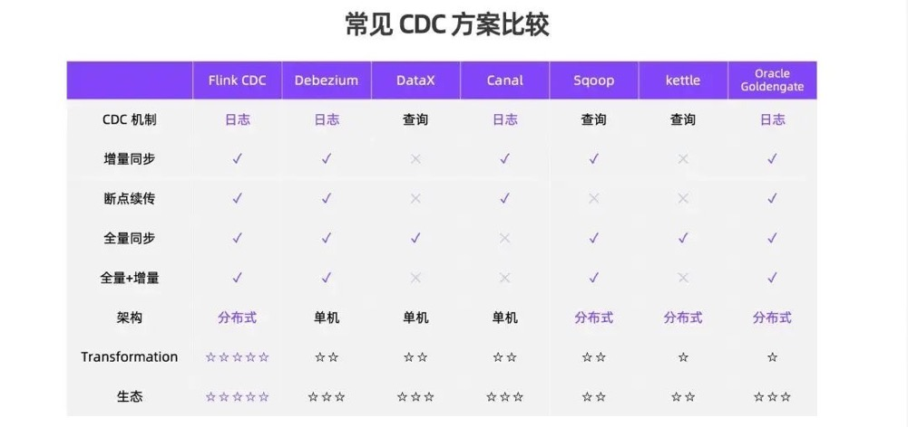
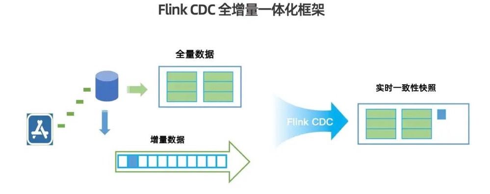

# Flink CDC技术对比与分析

## 变更数据捕获(CDC)数据

* 广义概念上，能够捕获数据变更的技术统称为 CDC（**Change Data Capture**）。通常我们说的 CDC 主要面向数据库的变更，是一种用于捕获数据库中数据变化的技术。
* CDC 的主要应用有三个方面：
  * **数据同步**，通过 CDC 将数据同步到其他存储位置来进行异地灾备或备份。
  * **数据分发**，通过 CDC 将数据从一个数据源抽取出来后分发给下游各个业务方做数据处理和变换。
  * **数据采集**，使用 CDC 将源端数据库中的数据读取出来后，经过 ETL 写入数据仓库或数据湖。

* CDC实现机制
  * **基于查询**
    * 基于查询的 CDC 通过定时调度离线任务的方式实现，一般为批处理模式，无法保证数据的实时性，数据一致性也会受到影响。
  * **基于日志的 CDC**
    * 基于日志的 CDC 通过实时消费数据库里的日志变化实现，如通过连接器直接读取 MySQL 的 binlog 捕获变更。这种流处理模式可以做到低延迟，因此更好地保障了数据的实时性和一致性。

## Flink CDC的优势

- 在实现机制方面，Flink CDC 通过直接读取数据库日志捕获数据变更，保障了数据实时性和一致性。
- 在同步能力方面，Flink CDC 支持全量和增量两种读取模式，并且可以做到无缝切换。
- 在数据连续性方面，Flink CDC 充分利用了 Apache Flink 的 checkpoint 机制，提供了断点续传功能，当作业出现故障重启后可以从中断的位置直接启动恢复。
- 在架构方面，Flink CDC 的分布式设计使得用户可以启动多个并发来消费源库中的数据。
- 在数据变换方面，Flink CDC 将从数据库中读取出来后，可以通过 DataStream、SQL 等进行各种复杂计算和数据处理。
- 在生态方面，Flink CDC 依托于强大的 Flink 生态和众多的 connector 种类，可以将实时数据对接至多种外部系统。

## Flink CDC全增量一体化框架

* Flink CDC从2.0版本之后， 引入了增量快照框架，实现了数据库全量和增量数据的一体化读取，并可以在全量和增量读取之间进行无缝切换。在读取全量数据时，Flink CDC source 会首先将数据表中的已有数据根据主键分布切分成多个 chunk（如上图中的绿色方块所示），并将 chunk 分发给多个 reader 进行并发读取。
* 对于数据变化频繁、已有数据较多的数据库，在全量同步过程中已同步的数据可能会发生变化。Flink CDC 的增量快照框架引入了水位线（watermark）的概念：在启动全量同步前，首先获取数据库当前最新的 binlog 位点，记为低水位线（low watermark），随后启动全量读取。
* 在所有全量数据读取完成后，CDC source 会再次获取最新的 binlog 位点，并记为高水位线（high watermark）。位于高低水位线之间、与被捕获表相关的 binlog 事件即为全量数据在读取阶段发生的数据变化，CDC source 会将这部分增量数据合并至现有快照，合并完成后即可获得与源数据库完全一致的实时快照，并且在此过程中无需对数据库进行加锁，不会影响线上业务的正常运行。