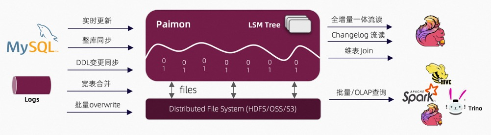
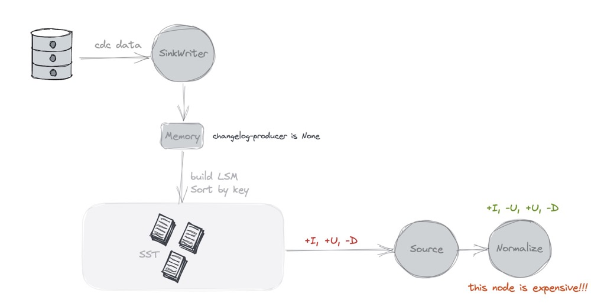
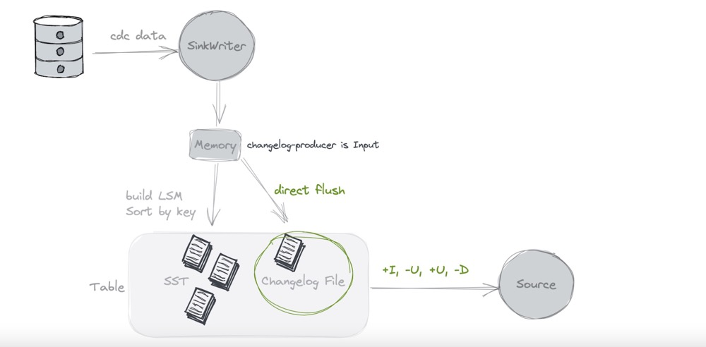

# Quick Start

* Flink1.14之后才支持Table Stroe，下载对应版本的Flink。

## 前置环境

### 下载Flink Table Store所需依赖

* 下载[flink1.15]([**https://dlcdn.apache.org/flink/flink-1.15.2/flink-1.15.2-bin-scala_2.12.tgz**](https://dlcdn.apache.org/flink/flink-1.15.2/flink-1.15.2-bin-scala_2.12.tgz))
* 编译[Flink Table Store](https://nightlies.apache.org/flink/flink-table-store-docs-master/docs/engines/build/)

```shell
cp flink-table-store-dist-*.jar FLINK_HOME/lib/
```

* 下载[flink hadoop](https://repo.maven.apache.org/maven2/org/apache/flink/flink-shaded-hadoop-2-uber/2.8.3-10.0/flink-shaded-hadoop-2-uber-2.8.3-10.0.jar)

```shell
cp flink-shaded-hadoop-2-uber-*.jar FLINK_HOME/lib/
```

### 启动flink本地集群

* 修改配置

```shell
vim ./conf/flink-conf.yaml

taskmanager.numberOfTaskSlots: 2
```

* 启动local cluster

```shell
./bin/start-cluster.sh
```

* 启动SQL Client

```shell
./bin/sql-client.sh embedded
```

## 通过Table Store读写数据

### 创建table store表

```sql
CREATE CATALOG my_catalog WITH (
  'type'='table-store',
  'warehouse'='file:/Users/huangshimin/Documents/study/flink/tableStoreData'
);

USE CATALOG my_catalog;

-- create a word count table
CREATE TABLE word_count (
    word STRING PRIMARY KEY NOT ENFORCED,
    cnt BIGINT
);
```

### 写入数据

```sql
-- create a word data generator table
CREATE TEMPORARY TABLE word_table (
    word STRING
) WITH (
    'connector' = 'datagen',
    'fields.word.length' = '1'
);

-- table store requires checkpoint interval in streaming mode
SET 'execution.checkpointing.interval' = '10 s';

-- write streaming data to dynamic table
INSERT INTO word_count SELECT word, COUNT(*) FROM word_table GROUP BY word;
```

### 读取数据

```shell
-- use tableau result mode
SET 'sql-client.execution.result-mode' = 'tableau';

-- switch to batch mode，批量读取
RESET 'execution.checkpointing.interval';
SET 'execution.runtime-mode' = 'batch';

-- olap query the table
SELECT * FROM word_count;

-- 流式读取
SET 'execution.runtime-mode' = 'streaming';
SELECT `interval`, COUNT(*) AS interval_cnt FROM
  (SELECT cnt / 10000 AS `interval` FROM word_count) GROUP BY `interval`;
```

# Table Store概述

* Flink Table Store是在Flink中构建动态表进行流处理和批处理的统一存储，支持高速数据摄取和及时数据查询。Table Store提供以下核心功能:
  * 支持大规模数据集的存储，允许批处理和流模式下的读写。
  * 支持延迟最小至毫秒的流查询。
  * 支持最小延迟至第二级的批次/OLAP查询。
  * 默认支持增量快照流消费。因此用户不需要自己组合不同的数据管道。

## 架构



* **读/写:**  Table Store支持读写数据和执行OLAP查询的通用方法。
  * 对于读，它支持读取数据来自1.历史快照(batch mode) 2.来自最新的offset(streaming mode) 3.混合方式读取增量快照数据
  * 对于写，支持从数据库的变更日志(CDC)的流同步或从离线数据的批量插入/覆盖。
* **外部生态系统:**  除了支持Flink以外，Table Store还支持通过其他计算引擎来读取例如Hive/Spark/Trino。
* **内部原理:**  Table Store使用混合存储体系结构，使用湖格式存储历史数据，使用消息队列系统存储增量数据。前者将列存文件存储在文件系统/对象存储中，并使用LSM树结构支持大量数据更新和高性能查询。后者使用Apache Kafka实时捕获数据。

## 统一的存储

* Flink SQL支持三种类型的连接器
  * **消息队列**，例如kafka，在这个管道的source阶段和中间处理阶段都使用它，以确保延迟保持在几秒内。
  * **OLAP系统**，例如clickhouse，它以流的方式接收处理过的数据，并为用户的特别查询服务。
  * **批次存储**，例如HIve，它支持传统批处理的各种操作，包括INSERT OVERWRITE。
* Flink Table Store提供表抽象。它的使用方式与传统数据库没有区别:
  * 在flink的`batch`执行模式，它就像一个Hive表，支持Batch SQL的各种操作。查询它可以查看最新的快照。
  * 在flink的`streaming`执行模式，他类似消息队列，查询它就像从一个消息队列中查询历史数据永不过期的流更改日志。

# Create Table

## Catalog

* Table Store使用独立的catalog来管理全部的database和table，需要指定`table-store`的类型和对应的`warehouse`路径

```sql
CREATE CATALOG my_catalog WITH (
  'type'='table-store',
  'warehouse'='hdfs://nn:8020/warehouse/path' -- or 'file://tmp/foo/bar'
);
USE CATALOG my_catalog;
```

* Table Store catalog支持以下SQL
  * `CREATE TABLE ... PARTITIONED BY`
  * `DROP TABLE ...`
  * `ALTER TABLE ...`
  * `SHOW DATABASES`
  * `SHOW TABLES`

```sql
CREATE TABLE [IF NOT EXISTS] [catalog_name.][db_name.]table_name
  (
    { <physical_column_definition> | <computed_column_definition> }[ , ...n]
    [ <watermark_definition> ]
    [ <table_constraint> ][ , ...n]
  )
  [PARTITIONED BY (partition_column_name1, partition_column_name2, ...)]
  WITH (key1=val1, key2=val2, ...)
   
<physical_column_definition>:
  column_name column_type [ <column_constraint> ] [COMMENT column_comment]
  
<column_constraint>:
  [CONSTRAINT constraint_name] PRIMARY KEY NOT ENFORCED

<table_constraint>:
  [CONSTRAINT constraint_name] PRIMARY KEY (column_name, ...) NOT ENFORCED

<computed_column_definition>:
  column_name AS computed_column_expression [COMMENT column_comment]

<watermark_definition>:
  WATERMARK FOR rowtime_column_name AS watermark_strategy_expression
```

* 数据会存储在`${warehouse}/${database_name}.db/${table_name}`下

## Table Options

| Option                  | Required | Default | Type    | Description                                                  |
| :---------------------- | :------- | :------ | :------ | :----------------------------------------------------------- |
| bucket                  | Yes      | 1       | Integer | table store的bucket数量，存储数据的地方                      |
| log.system              | No       | (none)  | String  | The log system used to keep changes of the table, supports 'kafka'. |
| kafka.bootstrap.servers | No       | (none)  | String  | Required Kafka server connection string for log store.       |
| kafka.topic             | No       | (none)  | String  | Topic of this kafka table.                                   |

## Distribution

* table store的数据分布由三个概念组成:Partition, Bucket, and Primary Key

```sql
CREATE TABLE MyTable (
  user_id BIGINT,
  item_id BIGINT,
  behavior STRING,
  dt STRING,
  PRIMARY KEY (dt, user_id) NOT ENFORCED
) PARTITIONED BY (dt) WITH (
  'bucket' = '4'
);
```

* partition:根据分区字段隔离不同的数据
* bucket:在单个分区内，根据主键的hash值分布到4个不同的bucket
* primary key:在当个bucket内，按照主键排序，构建LSM结构。

## Partition

* Table Store采用类似于hive的分区去分离数据，因此，各种操作可以通过分区作为一个管理单元进行管理。
* 分区过滤可以用最高效的方式来提升性能，查询语句应该尽可能的包含分区过滤条件

## Bucket

* Bucket的概念是将数据划分为更易于管理的部分，以实现更高效的查询。
* 用N作为bucket number，记录落入(0,1，…n - 1)bucket。对于每条记录，它属于哪个bucket是通过一个或多个列(表示为bucket键)的哈希值计算的，并根据bucket number进行mod。

```shell
bucket_id=hash_func(bucket_key)%num_of_buckets
```

* 使用方式如下,通过`bucket-key`显式指定bucket key。如果没有特殊指定会使用primary key或者整行记录作为bucket key。

```sql
CREATE TABLE MyTable (
  catalog_id BIGINT,
  user_id BIGINT,
  item_id BIGINT,
  behavior STRING,
  dt STRING
) WITH (
    'bucket-key' = 'catalog_id'
);
```

* Bucket key不能在表创建后更改。ALTER TABLE SET ('bucket-key' =…)或ALTER TABLE RESET ('bucket-key')将抛出异常。
* Bucket的数量非常重要，因为它决定了最坏情况下的最大处理并行度。但不能太大，否则，系统会创建很多小文件。一般情况下，要求的文件大小为**128mb**，建议每个子桶保存在磁盘上的**数据大小为1gb左右**。

## Primary Key

* 主键是唯一的，并且被索引。Flink Table Store对数据进行了排序，这意味着系统将对每个bucket中的主键进行排序。如果没有定义主键，将使用所有字段进行排序。使用此特性，可以通过在主键上添加筛选条件来实现高性能查询。在设置复合主键时。一个经验法则是把最常查询的字段放在前面。

## Partial Update

* 通过`merge-engine`配置部分更新

```sql
CREATE TABLE MyTable (
  product_id BIGINT,
  price DOUBLE,
  number BIGINT,
  detail STRING,
  PRIMARY KEY (product_id) NOT ENFORCED
) WITH (
  'merge-engine' = 'partial-update'
);

INSERT INTO MyTable
SELECT product_id, price, number, CAST(NULL AS STRING) FROM Src1 UNION ALL
SELECT product_id, CAST(NULL AS DOUBLE), CAST(NULL AS BIGINT), detail FROM Src2;
```

* 值字段在相同的主键下逐个更新为最新的数据，空值不覆盖数据。

* For example, the inputs:

  - <1, 23.0, 10, NULL>
  - <1, NULL, NULL, ‘This is a book’>
  - <1, 25.2, NULL, NULL>

  Output:

  - <1, 25.2, 10, ‘This is a book’>

* 部分修改仅支持有主键的表、不支持streaming消费。

## Pre-aggregate

* `pre-aggregate`可以为每个字段设置聚合规则

```sql
-- 取price的最大值，取sales的总和
CREATE TABLE MyTable (
  product_id BIGINT,
  price DOUBLE,
  sales BIGINT,
  PRIMARY KEY (product_id) NOT ENFORCED
) WITH (
  'merge-engine' = 'aggregation',
  'fields.price.aggregate-function'='max',
  'fields.sales.aggregate-function'='sum'
);
```

### 支持的聚合函数和对应的数据类型

* 支持`sum`, `max/min`, `last_non_null_value`, `last_value`, `listagg`, `bool_or/bool_and`
  * `sum` supports DECIMAL, TINYINT, SMALLINT, INTEGER, BIGINT, FLOAT, DOUBLE data types.
  * `max/min` support DECIMAL, TINYINT, SMALLINT, INTEGER, BIGINT, FLOAT, DOUBLE, DATE, TIME, TIMESTAMP, TIMESTAMP_LTZ data types.
  * `last_non_null_value/last_value` support all data types.
  * `listagg` supports STRING data types.
  * `bool_and/bool_or` support BOOLEAN data type.

> pre-aggregate仅支持有主键的表
>
> pre-aggregate不支持流式读取表
>
> pre-aggregate当前仅支持INSERT的改变

## Append-only Table

* 性能相比于支持update和去重的方式高很多，仅支持`INSERT_ONLY`数据

### 创建Append-only Table

* 通过`write-mode`设置为`append-only`来创建append-only表

```sql
CREATE TABLE IF NOT EXISTS T1 (
    f0 INT,
    f1 DOUBLE,
    f2 STRING
) WITH (
    'write-mode' = 'append-only',
    'bucket' = '1' --specify the total number of buckets
)
```

* append-only表不能定义主键，与不定义主键的更改日志表不同。对于后者，可以更新或删除整个行，尽管没有主键。

## 支持的flink数据类型

* `MULTISET`不支持全部的`write-mode`,`MAP`仅支持非主键字段在一个主键表里。

# Write Table

```sql
INSERT { INTO | OVERWRITE } [catalog_name.][db_name.]table_name
  [PARTITION part_spec] [column_list] select_statement

part_spec:
  (part_col_name1=val1 [, part_col_name2=val2, ...])

column_list:
  (col_name1 [, column_name2, ...])
```

* `STREAMING`mode写入需要开启checkpoint
* `execution.checkpointing.unaligned=true` 不支持table store写`STREAMING`表
* `execution.checkpointing.mode=AT_LEAST_ONCE` 不支持table store写`STREAMING`表

## Parallelism

* 推荐并行度小于buckets的数量，最好和bucket数量相等。

| Option           | Required | Default | Type    | Description                                                  |
| :--------------- | :------- | :------ | :------ | :----------------------------------------------------------- |
| sink.parallelism | No       | (none)  | Integer | 定义sink operator的并行度，默认并行度通过上游算子的并行度来决定 |

## Expiring Snapshot

* Table Store生成1或2个快照预提交，为了防止过多的快照造成大量的小文件和冗余存储，Table Store写入默认值以消除过期的快照:

| Option                    | Required | Default           | Type     | Description              |
| :------------------------ | :------- | :---------------- | :------- | :----------------------- |
| snapshot.time-retained    | No       | 1 h               | Duration | 完成的快照的最大保留时间 |
| snapshot.num-retained.min | No       | 10                | Integer  | 完成的快照保存的最小数量 |
| snapshot.num-retained.max | No       | Integer.MAX_VALUE | Integer  | 完成的快照保存的最大数量 |

## Performance

* TAble Store使用LSM数据结构，它本身支持大数据量的更新。更新的性能和查询的性能需要一个权衡，可以通过以下参数来配置：

| Option                            | Required | Default | Type    | Description                                                  |
| :-------------------------------- | :------- | :------ | :------ | :----------------------------------------------------------- |
| num-sorted-run.compaction-trigger | No       | 5       | Integer | The sorted run number to trigger compaction. Includes level0 files (one file one sorted run) and high-level runs (one level one sorted run). |

* compaction-trigger决定了compaction的频率。sorted-run配置的越小，compaction越多，反之越少。
  * `num-sorted-run.compaction-trigger`越大，更新数据时的合并成本就越低，这可以避免许多无效的合并。但是，如果这个值太大，在合并文件时将需要更多的内存，因为每个FileReader将占用大量内存。
  * `num-sorted-run.compaction-trigger`越小，查询的性能发越好，小文件将会被合并。

## Write Stalls

* 写入自动管理LSM的结构，这意味着会有异步线程不断地compaction，但如果写速度比compaction速度快，就可能发生写停顿。写将会停止。
* 如果不限制写的速度，会存在以下问题：
  * 磁盘空间会耗尽
  * 增加读放大，极大程度降低读的性能

| Option                      | Required | Default | Type    | Description                                                  |
| :-------------------------- | :------- | :------ | :------ | :----------------------------------------------------------- |
| num-sorted-run.stop-trigger | No       | 10      | Integer | The number of sorted-runs that trigger the stopping of writes.sorted-runs的数量触发写停止。 |

## Memory

* 在Table Store的sink写入器中，占用内存的主要位置有三个:
  * MemTable的写入buffer，单个任务的全部写入器共享和抢占内存。内存的配置可以通过`write-buffer-size`来控制。
  * compaction过程中读取文件所占用的内存，通过`num-sorted-run.compaction-trigger`可以调整最大多少个文件被合并。
  * 写入列式存储文件占用的内存，不能手动调整。

# Query Table

```sql
-- 设置batch mode读取最新的快照
SET 'execution.runtime-mode' = 'batch';
SELECT * FROM MyTable;
```

## Query Engines

* Table Stroe不仅支持原生的Flink SQL客户端也支持其它的主流引擎，如Trino、Hive等

## 查询优化

* 推荐指定分区和主键来进行查询，这样可以过滤掉大量数据（data-skipping）。
* 下列函数可以加快数据过滤
  * `=`
  * `<`
  * `<=`
  * `>`
  * `>=`
  * `IN (...)`
  * `LIKE 'abc%'`
  * `IS NULL`
* Table Store将按主键对数据进行排序，这加快了点查询和范围查询的速度。当使用复合主键时，查询过滤器最好在主键的最左边形成一个前缀，以获得良好的加速效果。

## Streaming Query

* Table支持Flink流式查询，Table Stroe是流批一体，可以根据`execution.runtime-mode`配置来查询全量或者增量数据

```sql
-- Batch mode, 读取最新的快照
SET 'execution.runtime-mode' = 'batch';
SELECT * FROM MyTable;

-- Streaming mode, streaming reading, read incremental snapshot, read the snapshot first, then read the incremental
SET 'execution.runtime-mode' = 'streaming';
SELECT * FROM MyTable;

-- Streaming mode, streaming reading, read latest incremental
SET 'execution.runtime-mode' = 'streaming';
SELECT * FROM MyTable /*+ OPTIONS ('log.scan'='latest') */;
```

* 不同的`log.scan`模式将结果呈现不同的消费模式

| Scan Mode | Default | Description                                                  |
| :-------- | :------ | :----------------------------------------------------------- |
| FULL      | Yes     | FULL scan mode performs a hybrid reading with a snapshot scan and the streaming incremental scan.读取快照和增量数据，全量+增量 |
| LATEST    | No      | LATEST scan mode only reads incremental data from the latest offset.只读取增量数据 |

## Streaming Query on files

* 你可以直接选择消费增量变化的湖存储文件通过streaming mode。与Kafka相比，这种模式的成本较低，但延迟较高，这取决于写入作业的检查点间隔。
* 默认情况下，下行流消费是无序的(在键内有序)upsert数据流。如果期待一个有序的CDC流，并删除下游变更的日志数据，可以通过下列配置来实现：

```sql
CREATE TABLE T (...)
WITH (
    'changelog-producer' = 'input'
)
```

* changelog-producer(none)和changelog-producer(input)的区别如下图所示:



* 当changelog-producer为none时，因为存储只保留upsert数据，而没有包含update_before的完整的更改日志数据，因此下游消费作业需要使用规范化节点来生成完整的更改日志。



* 当` changelog-producer`为input时，存储相信输入数据是一个完整的变更日志，以便下游消费也可以读取完整的变更日志。

## Streaming Query on Kafka

* 表可以配置一个日志系统例如kafka，数据可以双写文件存储和kafka topic在流模式智商。对于查询，将来可以通过混合读取来增量读取。

```sql
CREATE TABLE T (...)
WITH (
    'log.system' = 'kafka',
    'kafka.bootstrap.servers' = '...',
    'kafka.topic' = '...'
)
```

* kafka topic的分区数需要和bucket的数量一致，默认情况下，数据只在检查点之后可见，这意味着流读取具有事务一致性。中间结果的可见性可以通过`log.consistency` = `eventual`.配置。
