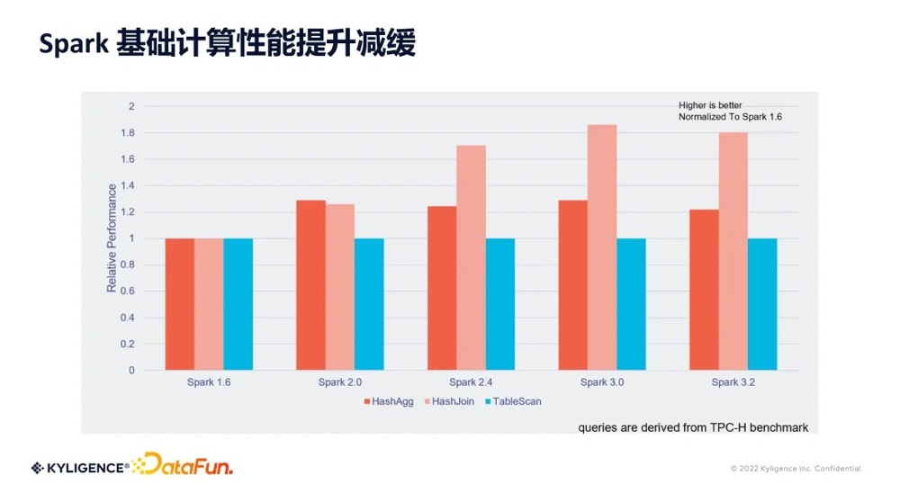
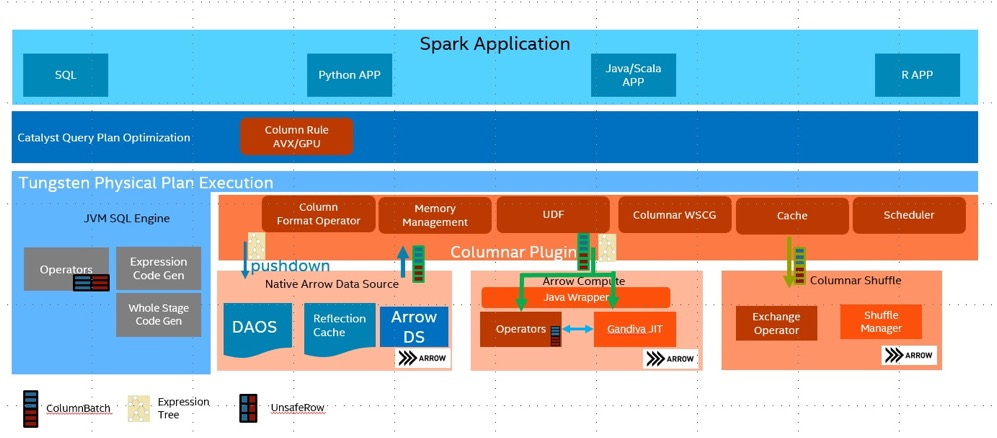
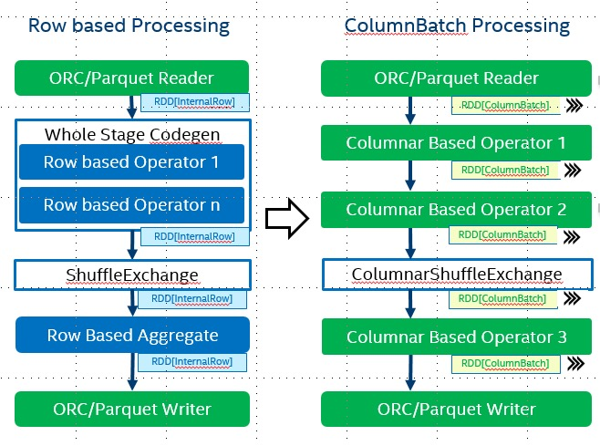
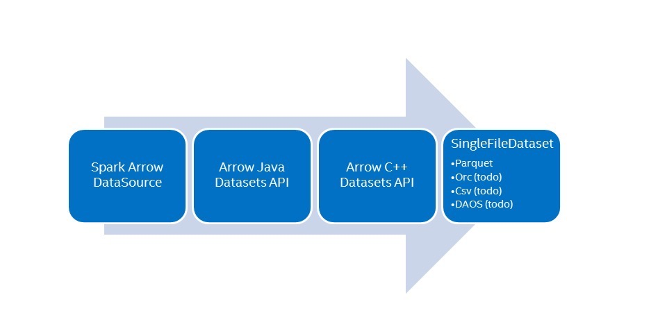
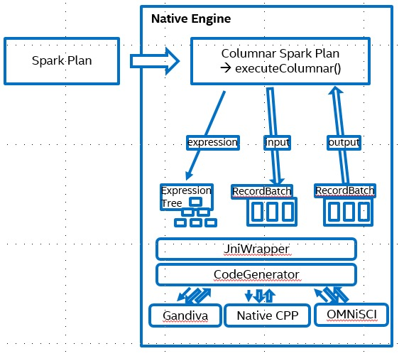
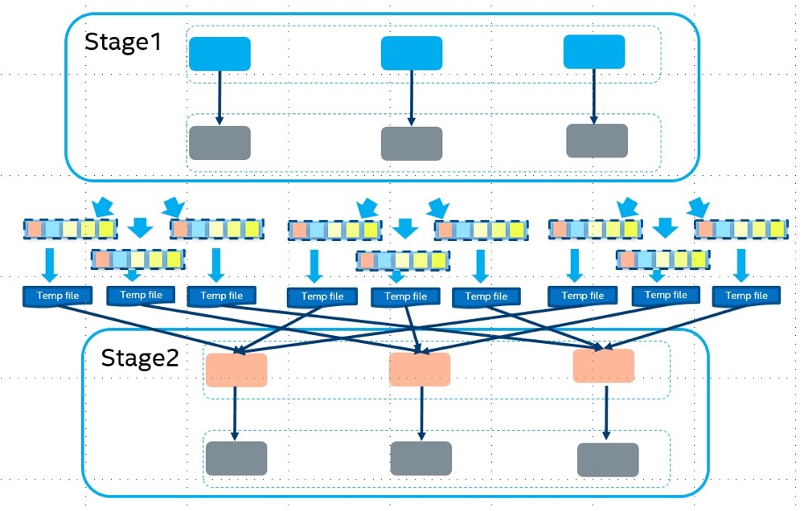

# 背景

## Spark存在的问题

* **上图**是 Spark 各个版本在 TPCH 下的基础算子性能图。这里抽取的是三个主要的基础算子，**HashAgg、HashJoin** 和 **TableScan**。从 Spark 的 1.6 版本以来，逐步引入了诸如**钨丝计划、向量化 Parquet Reader** 等一系列优化之后，整体的计算性能有两倍左右的提升。但同时我们也发现，在 3.0 版本以后，整体计算性能的提升有所减缓。
* 通过TPCH对Spark计算节点的监控，可以发现CPU 是 Spark 计算性能所面临的较大瓶颈。Spark 是基于 JVM 的，而 JVM 只能利用到一些比较基础的 CPU 指令集。虽然有 JIT 的加持，但相比目前市面上很多的 Native 向量化计算引擎而言，性能还是有较大差距。因此考虑如何将具有高性能计算能力的 Native 向量引擎引用到 Spark 里来，从而提升 Spark 的计算性能，突破 CPU 瓶颈。

### Cpu性能问题根因

目前的Spark引擎是以Row为基本数据结构、以火山模型（进阶为WSCG）为执行方式进行计算的，算子与算子之间通过next调用，数据Row通过一个个next的调用最终从原始数据到最终数据产出。但这个执行过程并未完全挖掘CPU的执行效率，主要原因如下：

**大量虚函数调用**

​       由于算子与算子之间是通过next调用的，所有算子都是SparkPlan的子类，这就导致程序执行过程中存在大量的虚函数调用，用来找到具体的执行算子；

**CPU cache命中率低**

​       CPU在计算过程中会预测接下来的执行指令，并加载到寄存器。由于Spark是行级别的数据且是next串行执行的，就导致一旦数据在filter判断无效时，就需要抛弃整行的数据以及寄存器的指令，然后重新加载数据以及指令；

**指令无法并行**

​       最新的CPU都支持多个指令并行，即取数、计算、输出等指令并行执行，但由于Spark是串行执行的，这就导致大量CPU效率没有有效利用起来；

**数据计算无法并行**

​       最新的CPU都支持比较大的寄存器，可以同时存储更多的数据，但由于Spark串行执行且是行级别的数据结果，就导致数据每次只能串行执行，无法充分利用寄存器的优势；

# 向量化引擎

* 近几年来 Native SQL 向量化计算引擎层出不穷，出现多种优秀框架。这些框架大致可以分为两类，**一类**以产品方式发布，比如 **ClickHouse、DuckDB、MongoDB**。ClickHouse 使用很广泛，DuckDB 是单机下类似 SQLite 的向量化计算引擎。**第二类**是以 Library 方式发布，比如 Meta 公司发布的 **Velox**，其主旨也是想利用 Library 方式替换掉 Presto 基于 JVM 的计算模型，进而提升 Presto 计算能力。还有其他的，如 **Arrow Computer Engine** 也是以 Library 方式进行发布。
* 以上提到的几种 Native 向量化计算引擎，它们都有一些共同特点，比如都是使用 C++ 开发，**就很容易利用 CPU 原生指令集的优化。另外它们都是基于列式数据格式。**结合这两点，这些引擎就很容易可以去做向量化处理，进而达到高性能计算。基于这两点， Gluten 项目也就应运而生。它是一个基于 Spark 的向量化引擎中间件。会把 Spark SQL 整个执行过程当中的计算转移到向量化引擎去执行，来获得指令集的原生加速。

## 向量化引擎收益

​       向量化引擎主要采用的是纯列式的数据内存结构和向量化的算子，纯列式的数据内存结构可以允许CPU一次性处理更多数据，而向量化的算子可以通过CPU指令集充分挖掘CPU性能。其具体收益如下：

**少量的虚函数调用**

​      向量化引擎是列式的数据结构，每次处理一个batch（一般8K），这就意味着8k的数据在处理过程中所需要的指令集是固定的，因此完全可以用同样的指令集一次性处理完当前batch所有的数据，减少虚函数的调用

**CPU cache命中率高**

​       由于数据是批次加载的，而且数据是按照列独立分布的，这就意味着指令集是固定的且寄存器内的数据都是要进行处理的，这就保证了CPU预先加载指令集以及数据的命中率，减少无效的指令以及数据切换

**指令并行**

​       由于一批次内执行的指令是完全相同的，而且指令是独立，不需要串行执行，因此可以充分利用CPU指令并行的能力，并行处理数据，提交CPU的利用率

**数据并行**

​       纯列式的数据因为CPU友好的特征，允许通过CPU指令集（比如AVX512等）并行加载数据并计算。比如int+int的计算，行数据时只能一次处理1个加法计算，而基于AVX512，可以同时存储并计算16个int值

**更高的压缩率**

​       纯列式的数据结构使得相同列的数据存放在一起，这在进行shuffle的网络传输时会因为数据比较相似带来比较大的数据压缩率

**更低的内存使用**

​       纯列式的数据结构由于是按列存储的，其数据可以在内存中顺序存放，通过指针访问，与Java内存随机分配以及行数据内存碎片相比，向量化引擎的内存利用率更高

# Native SQL Engine

## 架构

* Spark SQL基于Row为基本数据结构。它使用WholeStageCodeGen(火山模型)通过Java JIT代码来提高性能。但是，Java Jit通常很好的使用最新的SIMD指令，尤其是在复杂的查询下。Apache Arrow提供了CPU-cache友好的列式内存布局，它的SIMD优化内核和基于LLVM的SQL引擎Gandiva也非常高效。Native SQL Engine使用了这些技术，为Spark SQL带来了更好的性能。

## 关键特性

### Spark算子中间数据处理基于行转换为基于列

* 使用[Spark 27396](https://issues.apache.org/jira/browse/SPARK-27396) ，可以将Columnarbatch的RDD传递给Spark Opeartor。通过Arrow列存格式实现了这个API。

### 基于Arrow为Parquet和其他格式提供Native Readers

### 基于Apache Arrow Compute/Gandiva的操作符

* 基于Apache Arrow Compute和gandava实现了通用的Spark Opeartor。使用protobuf协议将SQL表达式编译为一个表达式树，并传递给本机内核。然后，本机内核将基于输入列批计算这些表达式。

### Native列式Shuffle算子支持高性能压缩

* 实现了列式Shuffle来提高shuffle性能。通过列式存储布局，我们可以对不同的数据格式进行非常有效的数据压缩。

[支持的Spark算子](https://oap-project.github.io/gazelle_plugin/1.1.0/operators/)

# Gazelle Plugin Native SQL Engine接入

# 文献参考

[sigmod_photon paper](https://www-cs.stanford.edu/~matei/papers/2022/sigmod_photon.pdf)

[GLUTEN 向量化引擎原理剖析](https://zhuanlan.zhihu.com/p/617944074)

[gazelle Native SQL Engine](https://oap-project.github.io/gazelle_plugin/latest/User-Guide/#introduction)