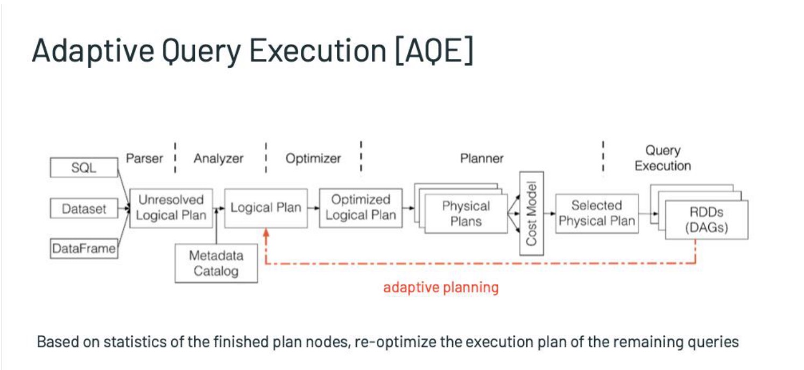
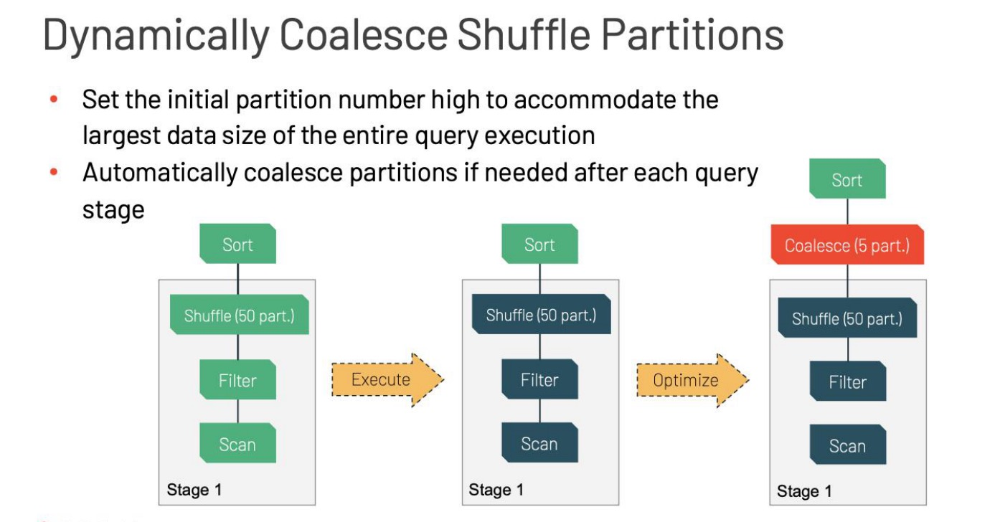
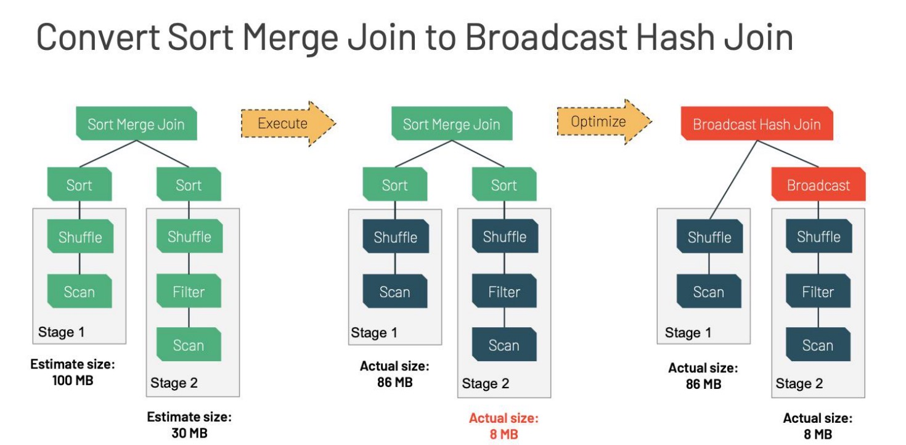
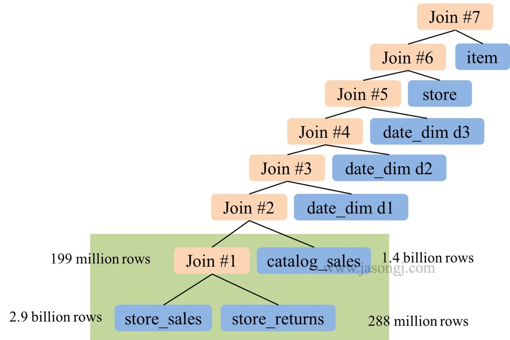
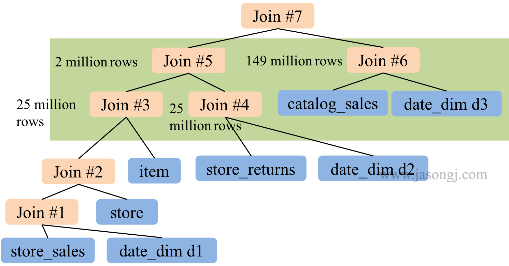
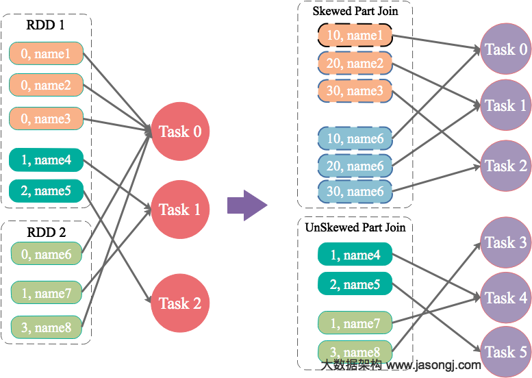
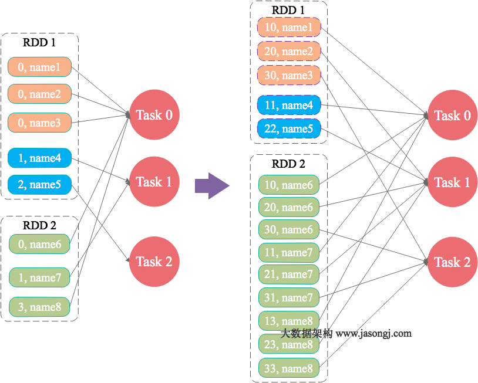

# AQE(Adaptive Query Execution )

* AQE作用于运行时执行计划优化阶段，如下图：



* 3.0.0之后特性，3.2.0默认开启，通过`spark.sql.adaptive.enabled`设置，默认优化合并shuffle write分区小文件、转换sort-merge join为broadcast join，join倾斜优化。可以基于运行期的统计信息，将Sort Merge Join 转换为Broadcast Hash Join;可以基于数据运行中间结果的统计信息，减少reducer数量，避免数据在shuffle期间的过量分区导致性能损失； 可以处理数据分布不均导致的skew join。 

## 合并shuffle后的分区



* 通过设置`spark.sql.adaptive.enabled` 和`spark.sql.adaptive.coalescePartitions.enabled`为`true`开启shuffle分区合并，基于map端输出分析合并shuffle后的分区。不需要在通过`spark.shuffle.partition`设置特定的分区数，只需要设置`spark.sql.adaptive.coalescePartitions.initialPartitionNum`初始化分区配置spark就可以找到他合适的分区数。
* 合并的分区为了保证IO顺序读写只会合并相邻的partition，并且spark提供个一个mapper可以读取多个分区的接口，保证读取多个合并的partition的时候只经过一次IO。

| Property Name                                               | Default | Meaning                                                      | Since Version |
| :---------------------------------------------------------- | :------ | :----------------------------------------------------------- | :------------ |
| `spark.sql.adaptive.coalescePartitions.enabled`             | true    | 当和`spark.sql.adaptive.enabled`都设置为`true`时，Spark将会按照目标的`spark.sql.adaptive.advisoryPartitionSizeInBytes`配置的大小缩减分区 | 3.0.0         |
| `spark.sql.adaptive.coalescePartitions.parallelismFirst`    | true    | 设置为true时会忽略`spark.sql.adaptive.advisoryPartitionSizeInBytes`配置去合并分区，而是根据`spark.sql.adaptive.coalescePartitions.minPartitionSize`去合并分区并按照最大并行度，建议设置为false | 3.2.0         |
| `spark.sql.adaptive.coalescePartitions.minPartitionSize`    | 1MB     | 最多为`spark.sql.adaptive.advisoryPartitionSizeInBytes`的百分之20 | 3.2.0         |
| `spark.sql.adaptive.coalescePartitions.initialPartitionNum` | (none)  | 合并前的初始shuffle分区数。如果没有设置，它等于' spark.sql.shuffle.partitions '。此配置仅在spark.sql.adaptive`和`spark.sql.adaptive.coalescePartitions`启用时生效。 | 3.0.0         |
| `spark.sql.adaptive.advisoryPartitionSizeInBytes`           | 64 MB   | 在spark.sql.adaptive`和`spark.sql.adaptive.coalescePartitions`启用时生效。 | 3.0.0         |

## sort-merge join转换为broadcast join

* 当分析出运行时任何join方小于broadcast hash join设置的阈值则会转换为broadcast join。这不是表示broadcast hash join最高效，但是它优于sort-merge join，因为我们可以保证链接俩端排序并且能够本地读shuffle文件通过`spark.sql.adaptive.localShuffleReader.enabled`设置为`true`，`spark.sql.adaptive.autoBroadcastJoinThreshold`是转换为broadcast join的阈值，如果小于则可以将merge-sort join转换为broadcast join

### sort-merge join转换broadcast join流程



## 转换sort-merge join转换为shuffle hash join

* 当shuffle分区数小于设置的阈值则会将sort-merge join转换为hash join,阈值通过` spark.sql.adaptive.maxShuffledHashJoinLocalMapThreshold`配置

## 优化倾斜join

* 数据倾斜会严重降低join查询的性能。该特性通过将倾斜的任务拆分(如果需要，还可以复制)为大小大致相同的任务来动态处理sort-merge join中的倾斜。当`spark.sql.adaptive.enabled` 和 `spark.sql.adaptive.skewJoin.enabled`配置同时启用时生效。
* `spark.sql.adaptive.skewJoin.enabled`当和`spark.sql.adaptive.enabled`同时为true时，spark会通过分裂(必要时复制)倾斜分区来动态处理sort-merge join的倾斜分区。
* `spark.sql.adaptive.skewJoin.skewedPartitionFactor`，如果一个分区的大小大于这个因子乘以分区中值大小，并且大于`spark.sql.adaptive.skewJoin.skewedPartitionThresholdInBytes`，则认为该分区是倾斜的。
* `spark.sql.adaptive.skewJoin.skewedPartitionThresholdInBytes`,如果分区的字节大小大于这个阈值，并且大于`spark.sql.adaptive.skewJoin.skewedPartitionFactor`乘以分区大小中值，则认为分区是倾斜的。理想情况下，这个配置应该设置比`spark.sql.adaptive.advisoryPartitionSizeInBytes`大。

# Join Hints

* Spark3.x之后增加了Sort-Merge join、Shuffle hash join和Shuffle nested loop join需要根据对应的数据特点选择特定的Join方式。

## Broadcast hash join

* 适合一侧的数据集比较小的情况，没有shuffle、sort

## Shuffle Hash Join

* 需要shuffle的数据但是排序，可以处理大表，但是可能因为数据倾斜到时OOM

## Sort-Merge Join

* 稳定的。能够处理任何大小的数据量，需要shuffle和排序数据，在大多数情况下，当表大小很小时，速度会变慢

## Shuffle Nested Loop Join

* 不需要join key

# RBO(Rule-base Optimization)

* 在将`Resolved Logical`转换为`Optimized Resolved Logical`时会基于Rule进行优化。
  * 每个优化以 Rule 的形式存在，每条 Rule 都是对 Analyzed Plan 的等价转换
  * RBO 设计良好，易于扩展，新的规则可以非常方便地嵌入进 Optimizer
  * RBO 目前已经足够好，但仍然需要更多规则来 cover 更多的场景
  * 优化思路主要是减少参与计算的数据量以及计算本身的代价

## PushDownPredicate

* 算子下推优化，如果俩个表进行join可以先进行filter后再去进行join，这个优化输入LogicalPlan的优化，从逻辑上保证了将Filter下推后由于参与Join的数据量变少而提高性能。
* 在物理层面，Filter 下推后，对于支持 Filter 下推的 Storage，并不需要将表的全量数据扫描出来再过滤，而是直接只扫描符合 Filter 条件的数据，从而在物理层面极大减少了扫描表的开销，提高了执行速度。

## ConstantFolding

* 如果Project包含对于常量的计算比如`select 100+20 from xx`类似操作，如果记录过多就会进行多次操作，可以通过`ConstantFolding`进行常量合并，从而减少不必要的计算，提高执行速度。

## ColumnPruning

* Filter 与 Join 操作会保留两边所有字段，然后在 Project 操作中筛选出需要的特定列。`ColumnPruning`规则能将 Project 下推，在扫描表时就只筛选出满足后续操作的最小字段集，则能大大减少 Filter 与 Project 操作的中间结果集数据量，从而极大提高执行速度。从物理层面在Project下推后，对于列式存储，扫描表时就只扫描需要的列减少IO消耗。

# CBO(Cost-Based Optimizer)

[文章引用](http://www.jasongj.com/spark/rbo/)

* 基于代价优化考虑了数据本身的特点（如大小、分布）以及操作算子的特点（中间结果集的分布及大小）及代价，从而更好的选择执行代价最小的物理执行计划，即 SparkPlan(物理执行计划)。
* 每个执行节点的代价分为俩个部分：
  * 该执行节点对数据集的影响，或者说该节点输出数据集的大小与分布
  * 该执行节点操作算子的代价
* 代价主要考虑的问题为以下俩个方面
  * 原始数据集的统计信息
  * 如何根据输入数据集估算特定算子的输出数据集

## Statistics收集

* 通过`ANALYZE`语句可以计算出整个表的记录总数以及大小

```sql
ANALYZE TABLE table_name COMPUTE STATISTICS;

# 查看表信息

desc extended tableName;
....
Statistics     xxxx bytes, xxx rows
...

# 统计指定列的信息，可以分析指定列的最小值、最大值、null值个数、不同值个数、平均列长度、最大列长度
ANALYZE TABLE table_name COMPUTE STATISTICS FOR COLUMNS [column1] [,column2] [,column3] [,column4] ... [,columnn];
```

* 设置`spark.sql.statistics.histogram.enabled`为`true`统计的信息输出为直方图

## 算子对数据集影响估计

* 对于常见的 `Column A < value B` Filter，可通过如下方式估算输出中间结果的统计信息

  - 若 B < A.min，则无数据被选中，输出结果为空

  - 若 B > A.max，则全部数据被选中，输出结果与 A 相同，且统计信息不变

  - 若 A.min < B < A.max，则被选中的数据占比为 (B.value - A.min) / (A.max - A.min)，A.min 不变，A.max 更新为 B.value，A.ndv = A.ndv * (B.value - A.min) / (A.max - A.min)
  - 如果数据

* 很多时候，数据分布并不均匀，且当数据倾斜严重是，上述估算误差较大。此时，可充分利用 histogram 进行更精确的估算。启用 Historgram 后，Filter `Column A < value B`的估算方法为

  - 若 B < A.min，则无数据被选中，输出结果为空
  - 若 B > A.max，则全部数据被选中，输出结果与 A 相同，且统计信息不变
  - 若 A.min < B < A.max，则被选中的数据占比为 height(<B) / height(All)，A.min 不变，A.max = B.value，A.ndv = ndv(<B)

## 算子代价估计

* SQL 中常见的操作有 Selection（由 select 语句表示），Filter（由 where 语句表示）以及笛卡尔乘积（由 join 语句表示）。其中代价最高的是 join。
* Spark SQL中CBO通过以下方法估算join的代价

```shell
Cost = rows * weight + size * (1 - weight)
Cost = CostCPU * weight + CostIO * (1 - weight)
# rows 即记录行数代表了 CPU 代价，size 代表了 IO 代价。weight 由 spark.sql.cbo.joinReorder.card.weight 决定，其默认值为 0.7。
```

## Build侧算子

* hash join俩标一般选择小表作为build size构建哈希表，另一边作为 probe side。如果没开启CBO，大表经过`filter过滤后大小小于小表`，这时候还是会选择原始小表为build size，如果开启CBO则会选择最终`filter后的表`为build size。

## 优化Join类型

* 在 Spark SQL 中，Join 可分为 Shuffle based Join 和 BroadcastJoin。Shuffle based Join 需要引入 Shuffle，代价相对较高。BroadcastJoin 无须 Join，但要求至少有一张表足够小，能通过 Spark 的 Broadcast 机制广播到每个 Executor 中。
* 在不开启 CBO 中，Spark SQL 通过 spark.sql.autoBroadcastJoinThreshold 判断是否启用 BroadcastJoin。其默认值为 10485760 即 10 MB。并且该判断基于参与 Join 的表的原始大小。
* 如果Table 1 大小为 1 TB，Table 2 大小为 20 GB，因此在对二者进行 join 时，由于二者都远大于自动 BroatcastJoin 的阈值，因此 Spark SQL 在未开启 CBO 时选用 SortMergeJoin 对二者进行 Join。
* 而开启 CBO 后，由于 Table 1 经过 Filter 1 后结果集大小为 500 GB，`Table 2 经过 Filter 2 后结果集大小为 10 MB 低于自动 BroatcastJoin 阈值`，因此 Spark SQL 选用 BroadcastJoin。

## 优化多表join顺序

* 未开启 CBO 时，Spark SQL 按 SQL 中 join 顺序进行 Join。极端情况下，整个 Join 可能是 left-deep tree
  * left-deep tree，因此所有后续 Join 都依赖于前面的 Join 结果，各 Join 间无法并行进行
  * 前面的两次 Join 输入输出数据量均非常大，属于大 Join，执行时间较长



开启 CBO 后， Spark SQL 将执行计划优化如下



- Join 树不再是 left-deep tree，因此 Join 3 与 Join 4 可并行进行，Join 5 与 Join 6 可并行进行
- 最大的 Join 5 输出数据只有两百万条结果，Join 6 有 1.49 亿条结果，Join 7相当于小 Join

## CBO的缺点

* 统计信息过期或缺失导致估计错误
* 收集统计信息代价较大(比如column histograms)
* 某些谓词使用自定义UDF导致无法预估
* 手动指定hint跟不上数据变化

Spark3.x对这块进行了升级和修复，引用AQE完全基于精确的运行时统计信息进行优化，引入了一个基本的概念Query Stages，并且以Query Stage为粒度，进行运行时的优化。

# 数据倾斜优化方案

## 不重复的key数据倾斜

### 数据量大

* 通过增加并行度或者减少并行度保证每个task处理的数据相对均匀
* 自定义分区器根据数据的特性写出相对合适的分区器保证数据分布均匀

### 数据量不大

* 通过调整broadcast的阈值将reduce join转换为map join。

## 重复的key的数据量过大

### 为skew的key增加随机前/后缀



* 为数据量特别大的Key增加随机前/后缀，使得原来Key相同的数据变为Key不相同的数据，从而使倾斜的数据集分散到不同的Task中，彻底解决数据倾斜问题。Join另一则的数据中，与倾斜Key对应的部分数据，与随机前缀集作笛卡尔乘积，从而保证无论数据倾斜侧倾斜Key如何加前缀，都能与之正常Join。

```java
public class SparkDataSkew{
    public static void main(String[] args) {
      int parallelism = 48;
      SparkConf sparkConf = new SparkConf();
      sparkConf.setAppName("SolveDataSkewWithRandomPrefix");
      sparkConf.set("spark.default.parallelism", parallelism + "");
      JavaSparkContext javaSparkContext = new JavaSparkContext(sparkConf);

      JavaPairRDD<String, String> leftRDD = javaSparkContext.textFile("hdfs://hadoop1:8020/apps/hive/warehouse/default/test/")
        .mapToPair((String row) -> {
          String[] str = row.split(",");
            return new Tuple2<String, String>(str[0], str[1]);
        });

        JavaPairRDD<String, String> rightRDD = javaSparkContext.textFile("hdfs://hadoop1:8020/apps/hive/warehouse/default/test_new/")
          .mapToPair((String row) -> {
            String[] str = row.split(",");
              return new Tuple2<String, String>(str[0], str[1]);
          });

        String[] skewedKeyArray = new String[]{"9500048", "9500096"};
        Set<String> skewedKeySet = new HashSet<String>();
        List<String> addList = new ArrayList<String>();
        for(int i = 1; i <=24; i++) {
            addList.add(i + "");
        }
        for(String key : skewedKeyArray) {
            skewedKeySet.add(key);
        }

        Broadcast<Set<String>> skewedKeys = javaSparkContext.broadcast(skewedKeySet);
        Broadcast<List<String>> addListKeys = javaSparkContext.broadcast(addList);

        JavaPairRDD<String, String> leftSkewRDD = leftRDD
          .filter((Tuple2<String, String> tuple) -> skewedKeys.value().contains(tuple._1()))
          .mapToPair((Tuple2<String, String> tuple) -> new Tuple2<String, String>((new Random().nextInt(24) + 1) + "," + tuple._1(), tuple._2()));
			 // 将右表没一行按照随机前缀变成n份保证左边每条数据都可以正常join
        JavaPairRDD<String, String> rightSkewRDD = rightRDD.filter((Tuple2<String, String> tuple) -> skewedKeys.value().contains(tuple._1()))
          .flatMapToPair((Tuple2<String, String> tuple) -> addListKeys.value().stream()
          .map((String i) -> new Tuple2<String, String>( i + "," + tuple._1(), tuple._2()))
          .collect(Collectors.toList())
          .iterator()
        );

        JavaPairRDD<String, String> skewedJoinRDD = leftSkewRDD
          .join(rightSkewRDD, parallelism)
          .mapToPair((Tuple2<String, Tuple2<String, String>> tuple) -> new Tuple2<String, String>(tuple._1().split(",")[1], tuple._2()._2()));

        JavaPairRDD<String, String> leftUnSkewRDD = leftRDD.filter((Tuple2<String, String> tuple) -> !skewedKeys.value().contains(tuple._1()));
        JavaPairRDD<String, String> unskewedJoinRDD = leftUnSkewRDD.join(rightRDD, parallelism).mapToPair((Tuple2<String, Tuple2<String, String>> tuple) -> new Tuple2<String, String>(tuple._1(), tuple._2()._2()));

        skewedJoinRDD.union(unskewedJoinRDD).foreachPartition((Iterator<Tuple2<String, String>> iterator) -> {
          AtomicInteger atomicInteger = new AtomicInteger();
          iterator.forEachRemaining((Tuple2<String, String> tuple) -> atomicInteger.incrementAndGet());
        });

        javaSparkContext.stop();
        javaSparkContext.close();
    }
}
```

#### 总结

**适用场景**

* 两张表都比较大，无法使用Map则Join。其中一个RDD有少数几个Key的数据量过大，另外一个RDD的Key分布较为均匀。

**解决方案**

* 将有数据倾斜的RDD中倾斜Key对应的数据集单独抽取出来加上随机前缀，另外一个RDD每条数据分别与随机前缀结合形成新的RDD（相当于将其数据增到到原来的N倍，N即为随机前缀的总个数），然后将二者Join并去掉前缀。然后将不包含倾斜Key的剩余数据进行Join。最后将两次Join的结果集通过union合并，即可得到全部Join结果。

**优势**

* 相对于Map侧Join，更能适应大数据集的Join。如果资源充足，倾斜部分数据集与非倾斜部分数据集可并行进行，效率提升明显。且只针对倾斜部分的数据做数据扩展，增加的资源消耗有限。

**劣势**

* 如果倾斜Key非常多，则另一侧数据膨胀非常大，此方案不适用。而且此时对倾斜Key与非倾斜Key分开处理，需要扫描数据集两遍，增加了开销。

### 大表随机添加N种随机前缀，小表扩大N倍（AQE实现原理）

* 如果出现数据倾斜的Key比较多，上一种方法将这些大量的倾斜Key分拆出来，意义不大。此时更适合直接对存在数据倾斜的数据集全部加上随机前缀，然后对另外一个不存在严重数据倾斜的数据集整体与随机前缀集作笛卡尔乘积（即将数据量扩大N倍）。



```java
public class SparkDataSkew {
  public static void main(String[] args) {
    SparkConf sparkConf = new SparkConf();
    sparkConf.setAppName("ResolveDataSkewWithNAndRandom");
    sparkConf.set("spark.default.parallelism", parallelism + "");
    JavaSparkContext javaSparkContext = new JavaSparkContext(sparkConf);

    // 左倾斜表
    JavaPairRDD<String, String> leftRDD = javaSparkContext.textFile("hdfs://hadoop1:8020/apps/hive/warehouse/default/test/")
      .mapToPair((String row) -> {
        String[] str = row.split(",");
        return new Tuple2<String, String>(str[0], str[1]);
      });

    // 右少量倾斜
    JavaPairRDD<String, String> rightRDD = javaSparkContext.textFile("hdfs://hadoop1:8020/apps/hive/warehouse/default/test_new/")
      .mapToPair((String row) -> {
        String[] str = row.split(",");
        return new Tuple2<String, String>(str[0], str[1]);
    });

    // 添加48个key前缀
    List<String> addList = new ArrayList<String>();
    for(int i = 1; i <=48; i++) {
      addList.add(i + "");
    }

    // 广播数据
    Broadcast<List<String>> addListKeys = javaSparkContext.broadcast(addList);

    // 处理左数据拼接随机前缀
    JavaPairRDD<String, String> leftRandomRDD = leftRDD.mapToPair((Tuple2<String, String> tuple) -> new Tuple2<String, String>(new Random().nextInt(48) + "," + tuple._1(), tuple._2()));

    // 扩大48倍右边数据
    JavaPairRDD<String, String> rightNewRDD = rightRDD
      .flatMapToPair((Tuple2<String, String> tuple) -> addListKeys.value().stream()
      .map((String i) -> new Tuple2<String, String>( i + "," + tuple._1(), tuple._2()))
      .collect(Collectors.toList())
      .iterator()
    );

    // join处理数据
    JavaPairRDD<String, String> joinRDD = leftRandomRDD
      .join(rightNewRDD, parallelism)
      .mapToPair((Tuple2<String, Tuple2<String, String>> tuple) -> new Tuple2<String, String>(tuple._1().split(",")[1], tuple._2()._2()));

    joinRDD.foreachPartition((Iterator<Tuple2<String, String>> iterator) -> {
      AtomicInteger atomicInteger = new AtomicInteger();
      iterator.forEachRemaining((Tuple2<String, String> tuple) -> atomicInteger.incrementAndGet());
    });

    javaSparkContext.stop();
    javaSparkContext.close();
  }
}
```

#### 总结

**适用场景**

* 一个数据集存在的倾斜Key比较多，另外一个数据集数据分布比较均匀。

**优势**

* 对大部分场景都适用，效果不错。

**劣势**

* 需要将一个数据集整体扩大N倍，会增加资源消耗。

# Spark ORC/Parquet和map task合并策略

## Orc|Parquet读策略(小文件读取首先有基础参数要设置)

```properties
# 不开启读并发控制不生效
spark.sql.hive.convertMetastoreOrc
说明：设置为true，使用spark的reader和writer来处理orc表；设置为false，使用hive的serde处理
默认：true
spark.sql.hive.convertMetastoreParquet=true
说明：设置为true，使用spark的reader和writer来处理orc表；设置为false，使用hive的serde处理
默认：true
```

## 读并发控制

```properties
spark.sql.files.openCostInBytes
说明：map读时小文件合并，降低map并发，小于该值的文件，将被合并
默认值：4194304 (4 MB)
spark.sql.files.maxPartitionBytes
说明：map读时大文件拆分，提高map并发，超过该大小的文件，将被拆分
默认值：134217728 (128 MB)
spark.sql.files.minPartitionNum
说明：map最小并行度
默认值：无（等于spark.default.parallelism）
```

