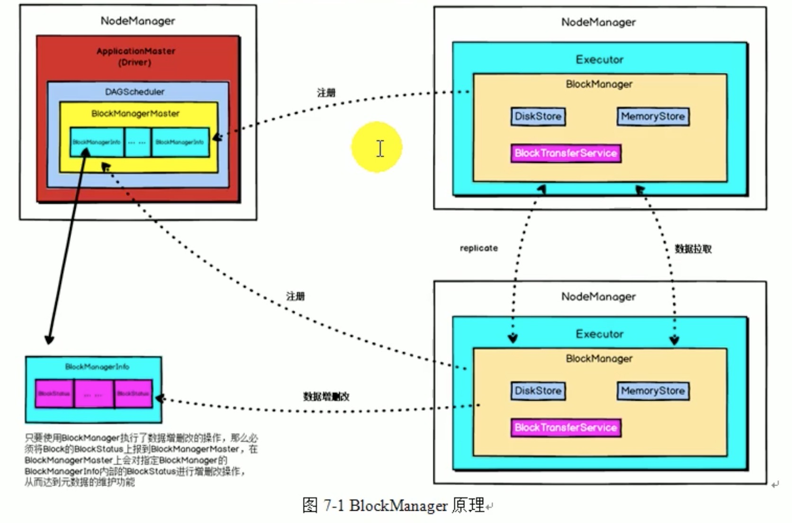
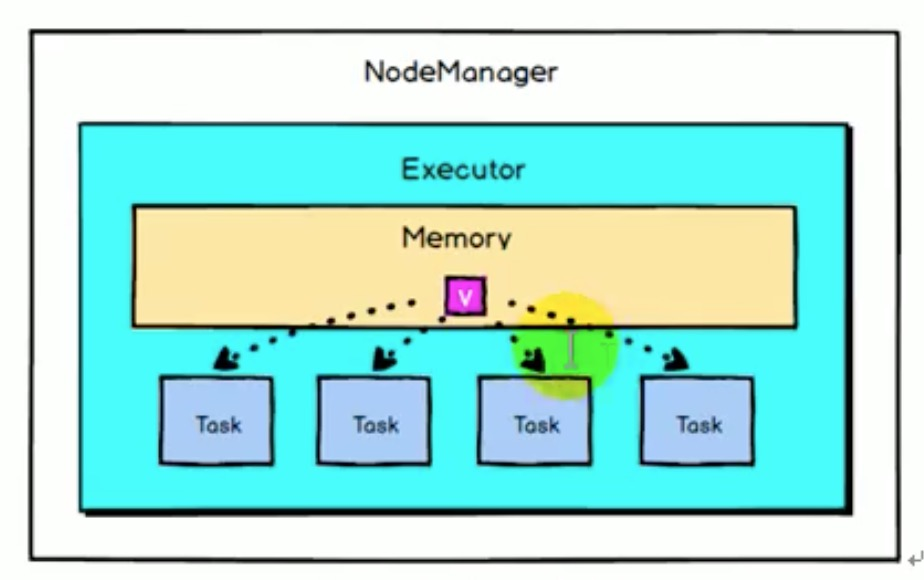

# Spark核心对象

## BlockManager数据存储与管理机制

* BlockManager是整个Spark底层负责数据存储与管理的一个组件，Driver和Executor的所有数据都由对应的BlockManager进行管理。
* Driver上有BlockManagerMaster，负责对各个节点上BlockManager内部管理的数据的元数据进行维护，比如block的增删改查等操作，都会在这里维护好元数据的变更。
* 每个节点都有一个BlockManager，每个BlockManager创建之后，第一件事情是向BlockManagerMaster进行注册，此时BlockManagerMaster会为其创建对应的BlockManagerInfo



* **BlockManagerMaster与BlockManager类似于NameNode和DataNode的关系:BlockManagerMaster中保存中BlockManager内部管理数据的元数据，进行维护，当BlockManager进行Block增删改等操作，都会在BlockManagerMaster中进行元数据的变更。**
* 每个节点上都有一个BlockManager，BlockManager中有3个核心组件:
  * DiskStore:负责对磁盘数据进行读写
  * MemoryStore:负责对内存数据进行读写
  * BlockTransferService:负责建立BlockManager到远程其他节点的BlockManager连接，负责对远程其他节点的BlockManager的数据进行读写。
* **每个BlockManager创建之后，会向BlockManagerMaster进行注册，此时BlockManagerMaster会为其创建对应的BlockManagerInfo。使用BlockManager进行写操作时，如果使用persist会优先将数据写入内存中，如果内存大小不够，会使用自己的算法，将内存中的部分写入磁盘(根据StoageLevel)；如果persist指定了副本会使用BlockTransferService**向其他节点写入一份副本。使用BlockManager进行读操作时，对于ShuffleRead操作，如果能从本地节点读取，就利用DiskStore或者MemoryStore从本地读取，如果没有的话就会利用**BlockTransferService**从其他节点的BlockManager建立连接来读取数据。
* 如果使用BlockManager进行增删改操作，就会将Block的BlockStatus上报到BlockManagerMaster，在BlockamangerMaster上会对指定BlockManager的BlockManagerInfo内部的BlockStatus进行增删改查操作，从而来维护元数据。

## Spark共享变量底层实现

* 默认情况下，一个算子的函数中如果使用到外部变量，那么这个**变量就会被拷贝到每个task中**，此时每个task只能操作自己的那份副本，类似于copyOnWrite的概念，无法做到多个task共享一份变量。
* Spark提供了**Broadcast Variable和Accumulator累加变量**，Broadcast Variable将用到的变量，仅仅**为每个节点拷贝一份**，即每个**Executor**拷贝一份，这样可以优化性能，减少资源和网络传输的消耗。Accumulator可以让**多个task共同操作一份变量**，主要可以进行变量累加操作。

### 闭包源码

* 下类可以看下闭包

```
类ClosureCleaner
```

### Scala序列化

*   重写writeReplace方法，scala序列化会利用java的方式，java在序列化时会判断是否存在该方法，存在就调用，spark累加器利用这一特性实现对数据的判断

    ```scala
      // Called by Java when serializing an object 
    final protected def writeReplace(): Any = {
        if (atDriverSide) {
          if (!isRegistered) {
            throw new UnsupportedOperationException(
              "Accumulator must be registered before send to executor")
          }
          val copyAcc = copyAndReset()
          assert(copyAcc.isZero, "copyAndReset must return a zero value copy")
          val isInternalAcc = name.isDefined && name.get.startsWith(InternalAccumulator.METRICS_PREFIX)
          if (isInternalAcc) {
            // Do not serialize the name of internal accumulator and send it to executor.
            copyAcc.metadata = metadata.copy(name = None)
          } else {
            // For non-internal accumulators, we still need to send the name because users may need to
            // access the accumulator name at executor side, or they may keep the accumulators sent from
            // executors and access the name when the registered accumulator is already garbage
            // collected(e.g. SQLMetrics).
            copyAcc.metadata = metadata
          }
          copyAcc
        } else {
          this
        }
      }

    --- ObjectOutputStream
     if (!desc.hasWriteReplaceMethod() ||
                        (obj = desc.invokeWriteReplace(obj)) == null ||
                        (repCl = obj.getClass()) == cl)
                    {
                        break;
                    }
                    cl = repCl;
    ```

    ### 广播变量

    * **广播变量是在每个Executor上保留外部数据的只读变量，而不是给每个任务发送一个副本**，每个task都会保存一份它所使用的外部变量时，对于Executor内存的消耗是非常大的，因此可以将大型外部变量封装成广播变量，此时一个Executor保存一个变量副本，此Executor上所有task共用此变量，**不再是一个task单独保存一个副本，这在一定程度降低了Spark任务的内存占用。**
    * Spark尝试使用高效的广播算法分发广播变量，以降低通信成本，Spark提供的Broadcast Variable是只读的，并且在每个Executor上只会有一个副本，而不会为每个task都拷贝一份副本，因此，它的最大作用，**就是减少变量到各个节点的网络传输消耗。**




### 累加器

* Accumulator是仅仅被相关操作累加的变量，因此可以并行中被有效支持，可以实现计数器或总和计数。
* \*\*Accumulator存储在Driver端，集群上运行的task进行Accumulator的累加，随后把值发送给Driver端，在Driver端汇总，由于Accumulator存在Driver端，从节点读取不到Accumulator的数值。\*\*Spark中的主要用于多节点对一个变量进行共享性的操作，task只能对其进行累加，不能对其进行读取。


