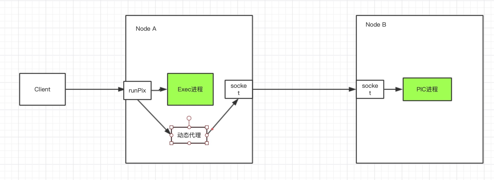

# Spark通信架构

## Spark通信架构概述

* Spark2.x使用Netty作为内部通信组件。spark基于netty新的rpc框架借鉴了Akka的中的设计， 它是基于Actor模型。

## Spark Actor模型

!\[image-20200705174334769]\(./img/Spark Actor.jpg)

* Endpoint(Client/Master/Worker)有一个InBox和N个OutBox(N>=1,N取决于当前Endpoint于多少其他的Endpoint进行通信，一个与其通讯的其他Endpoint对应一个OutBox)，Endpoint接收到的消息被写入InBox，发送出去的消息写入OutBox并被发送到其他Endpoint的InBox中。

