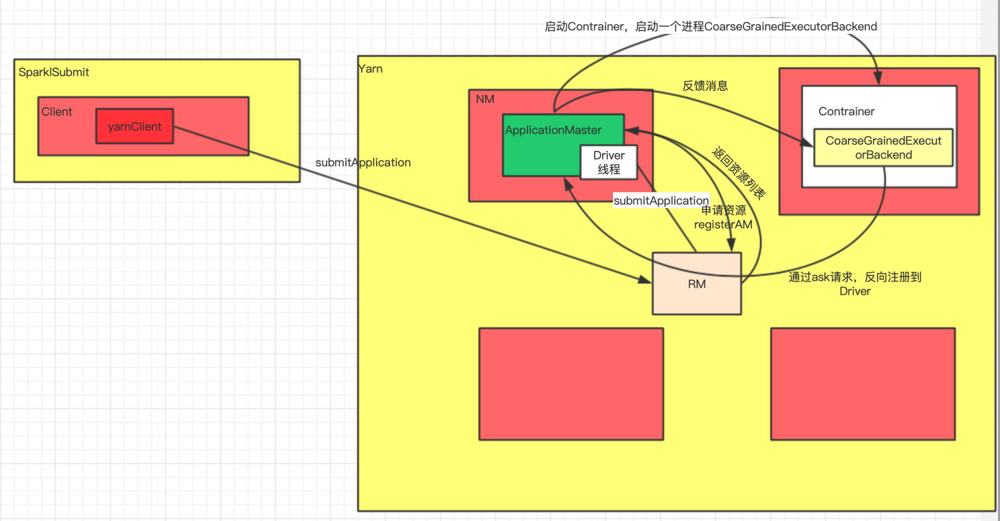

# yarn的部署流程

## SparkSubmit

```
-- main 启动进程
	--new SparkSubmitArguments //封装启动参数
	--submit //提交
	--doRunMain 执行main方法
	--runMain(args: SparkSubmitArguments, uninitLog: Boolean)
	  --prepareSubmitEnvironment 准备环境变量
	  	//Cluster
	  	--childMainClass = "org.apache.spark.deploy.yarn.YarnClusterApplication"
	  	//Client
	  	--childMainClass = args.mainClass
	  --val loader = getSubmitClassLoader(sparkConf) 拿到submit的classloader
	      --将maven jar包添加至classpath下
	  -- mainClass = Utils.classForName(childMainClass) 反射加载类，childMainClass就是参数指定的-class配置
	  -- mainClass.getConstructor().newInstance().asInstanceOf[SparkApplication]& new JavaMainApplication(mainClass) 根据main方法创建SparkApplication
	  -- mainMethod.invoke(null, args)
```

## Client

```
--main 主方法
	--new ClientArguments(args) 封装client参数
		--parse 解析启动参数
	--new Client
		--yarnClient=YarnClient.createYarnClient
	--client.run
		--submitApplication
			//创建容器的执行上下文，设置JVM参数，封装指令
      (Cluster) 
      command=/bin/java org.apache.spark.deploy.yarn.ApplicationMaster 
      (Client) 逻辑与Cluster一致，实际直接调用ApplicationMaster的main方法
      command=/bin/java org.apache.spark.deploy.yarn.ExecutorLauncher 
			-- createContainerLaunchContext(newAppResponse)   
			-- createApplicationSubmissionContext(newApp, containerContext)
			-- yarnClient.submitApplication(appContext) //提交指令
```

## ApplicationMaster

```
--main
	-- new ApplicationMasterArguments 封装am的参数
	// 创建ApplicationMaster对象
	-- new ApplicationMaster(amArgs)
	-- master.run()
		//Cluster
		--runDriver
		  // 启动用户指定的--class的类
		  -- startUserApplication()
		     //获取--class指定的类的main方法
		     --userClassLoader.loadClass(args.userClass).getMethod("main", classOf[Array[String]])
		     --val userThread = new Thread 启动个用户线程去执行
		  --registerAM  注册AM
		     --client.register 获取yarn资源
		  --createAllocator(driverRef, userConf) 创建Yarn资源调度器
		     --allocateResources 分配资源
		        --handleAllocatedContainers 处理资源容器
		        	--runAllocatedContainers 运行资源容器
		        	--new ExecutorRunnable().run()
		        		--nmClient = NMClient.createNMClient()
		        		--startContainer()
		        			--prepareEnvironment().asJava 准备环境
		        			--prepareCommand() jvm参数等,封装指令,command=bin/java org.apache.spark.executor.CoarseGrainedExecutorBackend
		//Client
		--runExecutorLauncher
```

## CoarseGrainedExecutorBackend

* 生命周期
  * constructor -> onStart -> receive\* -> onStop

```
-- main
  -- 模式匹配设置参数
  -- run 运行executor
  	--onStart
  		-- ref.ask[Boolean](RegisterExecutor(executorId, self, hostname, cores, extractLogUrls)) ask反向注册
  	--receive
  	  -- case RegisteredExecutor
  	     --new Executor
```

## Yarn部署流程图

* 根据上面源码流程跟进



*   通用流程

    

    ## Yarn模式运行机制

    ### Yarn Client模式

    !\[yarn Client]\(./img/yarn Client模式.jpg)

    ### Yarn Cluster模式

    !\[yarn Cluster]\(./img/yarn Cluster模式.jpg)

### Client和Cluster模式的区别

* Driver存储地址
  * Client:本地机器
  * Cluster:Yarn的Nodemanager的ApplicationMaster上
* 流量激增问题
  * Client:因为Driver放在本地机器负责Spark调度，所以流量会激增
  * Cluster放在Yarn集群没有这类问题
* 网络问题
  * Client:Driver放在本地，通常来说本地机器和Yarn机器不在一个机房，所以存在网络问题
  * Cluster:Driver和Yarn集群运行在同一个机房内
