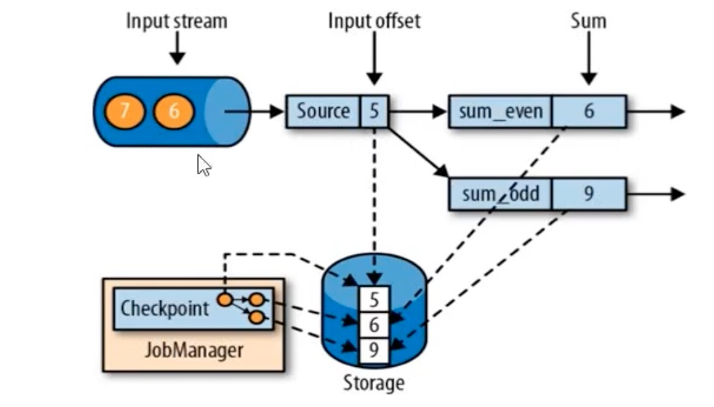
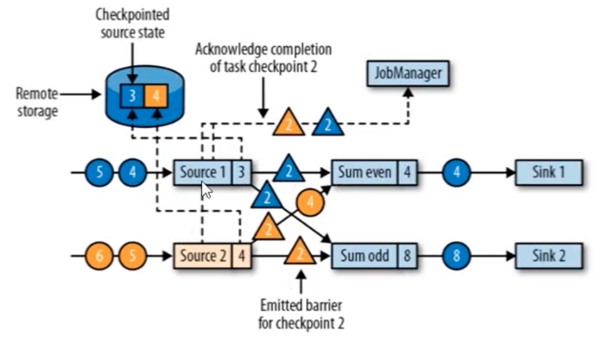
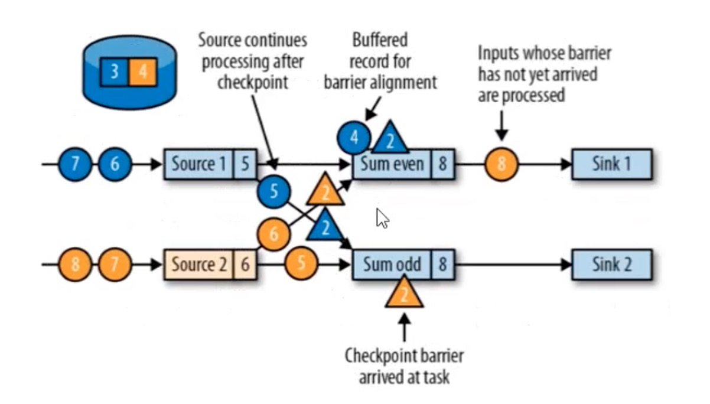
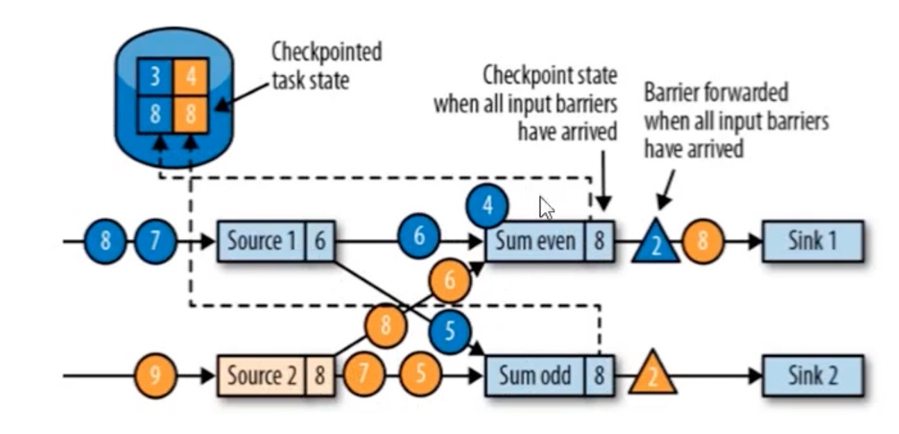
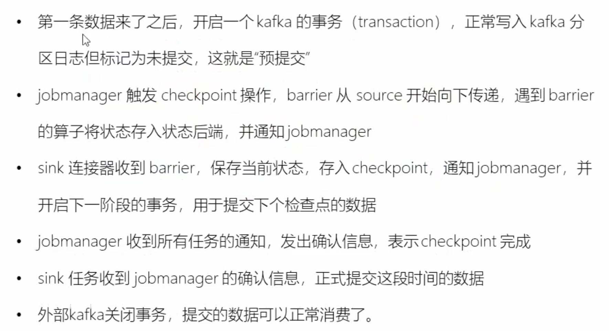

#   概述

## Flink的优势

* Apache Flink 是一个分布式大数据处理引擎，可对有限数据流和无限数据流进行有状态或无状态的计算，能够部署在各种集群环境，对各种规模大小的数据进行快速计算。
* 有状态的计算，状态容错性依赖于checkpoint机制做状态持久化存储。
* 多层API(Table/SQL API、DataStream/DataSet API、ProcessFunction API)
* exactly-once语义，状态一致性保证
* 低延迟，每秒处理数百万个事件，毫秒级别延迟。

## 流处理演变

### lambda架构

* 俩套系统，同时保证低延迟和结果准确。


* 开发维护、迭代比较麻烦，涉及到离线数仓和实时数仓的异构架构，难度偏大。

## Flink和SparkStreaming区别

* stream and micro-batching


* 数据模型
  * spark采用RDD模型，spark Streaming的DStream相当于对RDD序列的操作，是一小批一小批的RDD集合。
  * flink基本数据模型是数据流，以及事件序列。
* 运行时架构
  * spark是批计算，将DAG划分为不同的stage，一个stage完成后才可以计算下一个。
  * flink是标准的流执行模式，一个事件在一个节点处理完后可以直接发往下一个节点进行处理。

# Flink安装

## Local部署模式

* 安装JDK
* 下载flink对应版本压缩包
* 进入flink/bin目录下，运行start-cluster.sh命令
* 访问localhost:8081启动集群

## Standalone模式

* 配置ssh免密登录

### flink-conf.yaml

```yaml
# 配置javahome
env.java.home: /Library/Java/JavaVirtualMachines/jdk1.8.0_221.jdk/Contents/Home
# 配置master节点
jobmanager.rpc.address: hadoop
# 配置每个节点运行申请的最大的jobmanager内存和taskmanager内存
jobmanager.memory.process.size: 8096mb
taskmanager.memory.process.size: 2048mb
```

### workes配置

```shell
# 将worker节点ip地址配置在此文件中
hadoop1
hadoop2
```

### 集群命令

#### 启动集群

* bin/start-cluster.sh和bin/stop-cluster.sh

#### 添加JobManager

* bin/jobmanager.sh ((start|start-foreground) [host] [webui-port])|stop|stop-all

#### 添加taskManager

* bin/taskmanager.sh start|start-foreground|stop|stop-all

## Yarn模式

### 前置条件

```shell
# 环境变量中配置HADOOP_CLASSPATH
export HADOOP_CLASSPATH=/Users/babywang/Documents/reserch/studySummary/module/hadoop-2.8.5/etc/hadoop:/Users/babywang/Documents/reserch/studySummary/module/hadoop-2.8.5/share/hadoop/common/lib/*:/Users/babywang/Documents/reserch/studySummary/module/hadoop-2.8.5/share/hadoop/common/*:/Users/babywang/Documents/reserch/studySummary/module/hadoop-2.8.5/share/hadoop/hdfs:/Users/babywang/Documents/reserch/studySummary/module/hadoop-2.8.5/share/hadoop/hdfs/lib/*:/Users/babywang/Documents/reserch/studySummary/module/hadoop-2.8.5/share/hadoop/hdfs/*:/Users/babywang/Documents/reserch/studySummary/module/hadoop-2.8.5/share/hadoop/yarn/lib/*:/Users/babywang/Documents/reserch/studySummary/module/hadoop-2.8.5/share/hadoop/yarn/*:/Users/babywang/Documents/reserch/studySummary/module/hadoop-2.8.5/share/hadoop/mapreduce/lib/*:/Users/babywang/Documents/reserch/studySummary/module/hadoop-2.8.5/share/hadoop/mapreduce/*:/Users/babywang/Documents/reserch/studySummary/module/hadoop-2.8.5/contrib/capacity-scheduler/*.jar:/Users/babywang/Documents/reserch/studySummary/module/hbase/hbase-1.6.0/lib
```

* 下载`flink-shaded-hadoop-2-uber-2.8.3-10.0.jar`放在lib下

### Session模式

* Session-Cluster模式需要先启动集群，然后再提交作业，接着会向yarn申请一块空间后，资源永远保持不变。如果资源满了，下个作业就无法提交类似于standalone模式。
* 所有作业共享Dispatcher和RM，共享资源，适合小规模执行时间短的作业。

```shell
yarn-session.sh
Usage:
   Optional
     -D <arg>                        Dynamic properties 动态参数
     -d,--detached                   Start detached # 后台进程
     -jm,--jobManagerMemory <arg>    Memory for JobManager Container with optional unit (default: MB) 
     -nm,--name                      Set a custom name for the application on YARN 自定义applicationName
     -at,--applicationType           Set a custom application type on YARN 自定义Yarn的应用类型
     -q,--query                      Display available YARN resources (memory, cores) 查看可用YARN的资源
     -qu,--queue <arg>               Specify YARN queue. 指定YARN队列
     -s,--slots <arg>                Number of slots per TaskManager 指定TaskManager可用的slot数
     -tm,--taskManagerMemory <arg>   Memory per TaskManager Container with optional unit (default: MB)
     -z,--zookeeperNamespace <arg>   Namespace to create the Zookeeper sub-paths for HA mode 高可用zookeeper的ZNODE名称
     
# 通过—D动态参数方式覆盖flink-conf.yaml中的默认值
yarn-session.sh -Dfs.overwrite-files=true -Dtaskmanager.memory.network.min=536346624.
```

* 提交任务

```shell
flin run 
	-c classname 启动的driver主类
	-C url 
	-d 指定运行job的模式为后台模式
	-n 不能重新执行savepoint的时候允许跳过
	-p 程序执行并行度
	-s 指定从某个savepoint路径恢复
	-t 执行模式， "collection", "remote", "local","kubernetes-session", "yarn-per-job", "yarn-session","yarn-application" and "kubernetes-application"
```

* yarn.per-job-cluster.include-user-jar 用户jar包

### Pre-Job-Cluster模式

* 耦合Job会对应一个集群，每提交一个作业会根据自身的情况，都会单独向yarn申请资源，直到作业执行完成，一个作业的失败与否不会影响下一个作业的正常提交和运行。
* 独享Dispatcher和RM，按需接受资源申请，适合规模大长时间运行的作业。

```shell
flink run -t yarn-per-job -c dev.learn.flink.base.StreamingJob -d -yat flink -yjm 1024m -ytm 2048m -ynm test -ys 10 -p 2 -n flink-learn-1.0-SNAPSHOT.jar 
```

### application模式

```shell
# 运行WordCount
flink run-application -t yarn-application -Djobmanager.memory.process.size=2048m -Dtaskmanager.memory.process.size=4096m  ./examples/batch/WordCount.jar
```

* `yarn.provided.lib.dirs`提前在应用运行前提交的jar包

```shell
flink run-application -t yarn-application \
-Dyarn.provided.lib.dirs="hdfs://myhdfs/my-remote-flink-dist-dir" \
hdfs://myhdfs/jars/my-application.jar
```

* `yarn.application.priority`:设置提交顺序

## HA配置

### Standalone Cluster模式

* masters配置

```
hadoop:8081
hadoop:8082
```

* flink-conf.yaml配置

```yaml
# 高可用配置，默认是随机选择的
high-availability.jobmanager.port: 50000-50025
# 高可用模式配置
high-availability: zookeeper
# zookeeper配置
high-availability.zookeeper.quorum: hadoop:2181
# 高可用flink jobmanager存储zk ZNODE配置
high-availability.zookeeper.path.root: /flink
# jobManager元数据将保留在文件系统storageDir中，并且只有指向此状态的指针存储在ZooKeeper中。
high-availability.storageDir: hdfs:///flink1.11.1/ha/
```

* start-cluster.sh启动集群

### Yarn Cluster高可用

* yarn-site.xml

```xml
# 配置am的最大重试时间
<property>
  <name>yarn.resourcemanager.am.max-attempts</name>
  <value>4</value>
  <description>
    The maximum number of application master execution attempts.
  </description>
</property>
```

* flink-conf.yaml

```yaml
# application最大重试时间
yarn.application-attempts: 10
```

* 启动yarn cluster

```shell
yarn-session.sh -tm 2048m -jm 1024m -s 4 -d -nm test
```

## 容错与状态

### Checkpoint

#### 一致性检查点



* Flink故障恢复机制的核心，就是应用状态的一致性检查点
* 有状态流应用的一只检查点，其实就是所有任务的状态，在某个时间点的一份拷贝；这个时间点，`应该是所有任务恰好处理完一个相同的输入数据的时候,如果各个算子单独处理对应的offset，`就会存在source端和算子端checkpoint的offset存在异常，导致数据无法恢复。

#### 从检查点恢复

* 重启应用程序，从上次保存的checkpoint恢复，当所有checkpoint恢复到各个算子中，然后开始消费并处理checkpoint到发生故障之间的所有数据，这种checkpoint的保存和恢复机制可以为程序提供"exactly-once"的一致性，所有算子都会保存checkpoint并恢复其所有状态，这样就保证了状态的最终一致性。

#### 检查点算法

* 一种简单的想法

  * 暂停应用，保存状态到检查点，再重新恢复应用。

* Flink实现方式

  * 基于Chandy-Lamport算法的分布式快照
  * 将检查点的保存和数据处理分离开，不暂停整个应用，对Source进行checkpoint barrier控制

* 检查点屏障(Checkpoint Barrier)

  * Flink的检查点算法用到一种称为屏障(barrier)的特殊数据形式，用来把一条流上数据按照不同的检查点分开。
  * Barrier之前到来的数据导致的状态更改，都会被包含在当前分界线所属的检查点中；基于barrier之后的数据导致的所有更改，就会被包含在之后的检查点中。

* **检查点屏障流程**

  * 有两个输入流的应用程序，并行的两个Source任务来读取，JobManager会向每个Source任务发送一个带有新checkpoint ID的消息，通过这种方式来启动checkpoint。
  * 数据源将它们的状态写入checkpoint，并发出一个checkpointbarrier，状态后端在状态存入checkpoint之后，会返回通知给source任务，source任务就会向JobManager确认checkpoint完成。
  * **barrier对齐**：barrier向下游传递，sum任务会等待所有输入分区的barrier达到，对于barrier已经到达的分区，继续到达的数据会被缓存，而barrier尚未到达的分区，数据会被正常处理。
  * 当收到所有输入分区的barrier时，任务就将其状态保存到状态后端的checkpoint中，然后将barrier继续向下游转发，下游继续正常处理数据。
  * Sink任务向JobManager确认状态保存到checkpoint完毕，当所有任务都确认已成功将状态保存到checkpoint时，checkpoint完毕。

  

  

  

#### checkpoint配置

* checkpoint默认情况下`仅用于恢复失败的作业，并不保留，当程序取消时checkpoint就会被删除`。可以通过配置来保留checkpoint，保留的checkpoint在作业失败或取消时不会被清除。

* **`ExternalizedCheckpointCleanup.RETAIN_ON_CANCELLATION`**：当作业取消时，保留作业的 checkpoint。注意，这种情况下，需要手动清除该作业保留的 checkpoint。
* **`ExternalizedCheckpointCleanup.DELETE_ON_CANCELLATION`**：当作业取消时，删除作业的 checkpoint。仅当作业失败时，作业的 checkpoint 才会被保留。

```java
StreamExecutionEnvironment env = StreamExecutionEnvironment.getExecutionEnvironment();

// 每 1000ms 开始一次 checkpoint
env.enableCheckpointing(1000);

// 高级选项：

// 设置模式为精确一次 (这是默认值)
env.getCheckpointConfig().setCheckpointingMode(CheckpointingMode.EXACTLY_ONCE);

// 确认 checkpoints 之间的时间会进行 500 ms
env.getCheckpointConfig().setMinPauseBetweenCheckpoints(500);

// Checkpoint 必须在一分钟内完成，否则就会被抛弃
env.getCheckpointConfig().setCheckpointTimeout(60000);

// 同一时间只允许一个 checkpoint 进行
env.getCheckpointConfig().setMaxConcurrentCheckpoints(1);

// 开启在 job 中止后仍然保留的 externalized checkpoints
env.getCheckpointConfig().enableExternalizedCheckpoints(ExternalizedCheckpointCleanup.RETAIN_ON_CANCELLATION);

// 允许在有更近 savepoint 时回退到 checkpoint
env.getCheckpointConfig().setPreferCheckpointForRecovery(true);
```

* **设置重启策略**
  * noRestart
  * fallBackRestart:回滚
  * fixedDelayRestart: 固定延迟时间重启策略，在固定时间间隔内重启
  * failureRateRestart: 失败率重启

##### checkpoint存储目录

* checkpoint由元数据文件、数据文件组成。通过`statecheckpoints.dir`配置元数据文件和数据文件存储路径，也可以在代码中设置。

```
/user-defined-checkpoint-dir
    /{job-id}
        |
        + --shared/
        + --taskowned/
        + --chk-1/
        + --chk-2/
        + --chk-3/
        ...
```

* 其中 **SHARED** 目录保存了可能被多个 checkpoint 引用的文件，**TASKOWNED** 保存了不会被 JobManager 删除的文件，**EXCLUSIVE** 则保存那些仅被单个 checkpoint 引用的文件。

* 从保留的checkpoint中恢复状态

```shell
$ bin/flink run -s :checkpointMetaDataPath [:runArgs]
```

##### flink-conf容错配置

```yaml
state.backend: rocksdb
# 异步checkpoint
state.backend.async: true
state.checkpoints.dir: hdfs://hadoop:8020/flink1.11.1/checkpoints
state.savepoints.dir: hdfs://hadoop:8020/flink1.11.1/savepoints
state.backend.incremental: true
# 故障转移策略，默认为region，按照区域恢复
jobmanager.execution.failover-strategy: region
# checkpoint文件最小值
state.backend.fs.memory-threshold: 20kb
# 写到文件系统的检查点流的写缓冲区的默认大小。实际的写缓冲区大小被确定为这个选项和选项'state.backend.fs.memory-threshold'的最大值。
state.backend.fs.write-buffer-size: 4096
# 本地恢复当前仅涵盖键控状态后端。 当前，MemoryStateBackend不支持本地恢复，请忽略此选项。
state.backend.local-recovery: true
# 要保留的已完成检查点的最大数量。
state.checkpoints.num-retained: 1
# 定义根目录的配置参数，用于存储用于本地恢复的基于文件的状态。本地恢复目前只覆盖键控状态后端。目前，MemoryStateBackend不支持本地恢复并忽略此选项
taskmanager.state.local.root-dirs: hdfs://hadoop:8020/flink1.11.1/tm/checkpoints
```

### savepoint

* Savepoint 由俩部分组成：稳定存储上包含二进制文件的目录（通常很大），和元数据文件（相对较小）。 稳定存储上的文件表示作业执行状态的数据镜像。 Savepoint 的`元数据文件以（绝对路径）的形式包含（主要）指向作为 Savepoint 一部分的稳定存储上的所有文件的指针`。

#### 与checkpoint的区别

* **checkpoint**类似于恢复日志的概念(redolog), Checkpoint 的主要目的是`为意外失败的作业提供恢复机制`。 Checkpoint 的生命周期由 Flink 管理，即 Flink 创建，管理和删除 Checkpoint - 无需用户交互。 作为一种恢复和定期触发的方法，Checkpoint 实现有两个设计目标：`i）轻量级创建和 ii）尽可能快地恢复`。
* Savepoint 由用户创建，拥有和删除。 他们的用例是计划的，手动备份和恢复,恢复成本相对于checkpoint会更高一些，相对checkpoint更重量一些。

#### 分配算子ID

* 通过`uid(String)`方法手动指定算子ID，算子ID用于恢复每个算子的状态。

```java
datasource.uid("network-source").map(new WordCountMapFunction())
                .uid("map-id")
                .keyBy((KeySelector<Tuple2<String, Integer>, Object>) stringIntegerTuple2 -> stringIntegerTuple2.f0)
                .timeWindow(Time.seconds(30))
                .reduce(new SumReduceFunction())
                .uid("reduce-id")
                .print().setParallelism(1);
```

#### savepoint操作

* 触发savepoint,`flink savepoint :jobId [:targetDirctory]`
* 使用YARN触发Savepoint,`flink savepoint :jobId [:targetDirctory] -yid :yarnAppId`
* 使用savepoint取消作业,`flink cancel -s [:targetDirectory] :jobId`
* 从savepoint恢复,`flink run -s :savepointPath [:runArgs]`
  * --allowNoRestoredState 跳过无法映射到新程序的状态
* 删除savepoint,`flink savepoint -d :savepointPath`

### 状态快照

#### 概念

- *快照* – 是 Flink 作业状态全局一致镜像的通用术语。快照包括指向每个数据源的指针（例如，到文件或 Kafka 分区的偏移量）以及每个作业的有状态运算符的状态副本，该状态副本是处理了 sources 偏移位置之前所有的事件后而生成的状态。
- *Checkpoint* – 一种由 Flink 自动执行的快照，其目的是能够从故障中恢复。Checkpoints 可以是增量的，并为快速恢复进行了优化。
- *外部化的 Checkpoint* – 通常 checkpoints 不会被用户操纵。Flink 只保留作业运行时的最近的 *n* 个 checkpoints（*n* 可配置），并在作业取消时删除它们。但你可以将它们配置为保留，在这种情况下，你可以手动从中恢复。
- *Savepoint* – 用户出于某种操作目的（例如有状态的重新部署/升级/缩放操作）手动（或 API 调用）触发的快照。Savepoints 始终是完整的，并且已针对操作灵活性进行了优化

#### 原理

* 基于异步barrier快照(asynchronous barrier snapshotting),当 checkpoint coordinator（job manager 的一部分）指示 task manager 开始 checkpoint 时，它会让所有 sources 记录它们的偏移量，并将编号的 *checkpoint barriers* 插入到它们的流中。这些 barriers 流经 job graph，标注每个 checkpoint 前后的流部分。


* Flink 的 state backends 利用写时复制（copy-on-write）机制允许当异步生成旧版本的状态快照时，能够不受影响地继续流处理。只有当快照被持久保存后，这些旧版本的状态才会被当做垃圾回收。

### 大状态与Checkpoint优化

* checkpoint时间过长导致反压问题

```
# checkpoint开始的延迟时间
checkpoint_start_delay = end_to_end_duration - synchronous_duration - asynchronous_duration
```

* 在对齐期间缓冲的数据量，对于exactly-once语义，Flink将接收多个输入流的操作符中的流进行对齐，并缓冲一些数据以实现对齐。理想情况下，缓冲的数据量较低——较高的缓冲量意味着不同的输入流在非常不同的时间接收检查点屏障。

#### 优化Chckpoint

* checkpoint触发的正常间隔可以在程序配置，当一个检查点完成的时间长于检查点间隔时，下一个检查点在进程中的检查点完成之前不会被触发。默认情况下，下一个checkpoint点将在当前checkpoint完成后立即触发。
* 当检查点花费的时间经常超过基本间隔时(例如，由于状态增长超过了计划，或者检查点存储的存储空间暂时变慢)，系统就会不断地接受检查点(一旦进行，一旦完成，就会立即启动新的检查点)。这可能意味着太多的资源被持续地占用在检查点上，而算子的进展太少。此行为对使用异步检查点状态的流应用程序影响较小，但仍可能对总体应用程序性能产生影响。

```
# 为了防止这种情况，应用程序可以定义检查点之间的最小持续时间，这个持续时间是最近的检查点结束到下一个检查点开始之间必须经过的最小时间间隔。
StreamExecutionEnvironment.getCheckpointConfig().setMinPauseBetweenCheckpoints(milliseconds)
```


#### 优化RocksDB

##### 增量checkpoint

* 开启rocksDB增量checkpoint可以减少checkpoint的时间。

##### 定时器存储在RocksDB或JVM堆

* 默认情况下timers存储在rocksDB中，这是更健壮和可扩展的选择。当性能调优只有少量计时器(没有窗口，在ProcessFunction中不使用计时器)的任务时，将这些计时器放在堆中可以提高性能。要小心使用此特性，因为基于堆的计时器可能会增加检查点时间，而且自然不能扩展到内存之外。

##### 优化RocksDB内存

* 默认情况下RocksDB状态后端使用Flink管理的RocksDBs缓冲区和缓存的内存预算`state.backend.rocksdb.memory.managed: true`
* 修改`state.backend.rocksdb.memory.write-buffer-ratio`比率

## 内存配置

### 配置flink进程内存

#### 配置总内存

* Flink JVM 进程的*进程总内存（Total Process Memory）*包含了由 Flink 应用使用的内存（*Flink 总内存*）以及由运行 Flink 的 JVM 使用的内存。 *Flink 总内存（Total Flink Memory）*包括 *JVM 堆内存（Heap Memory）*和*堆外内存（Off-Heap Memory）*。 其中堆外内存包括*直接内存（Direct Memory）*和*本地内存（Native Memory）*。


| **配置项**   | **TaskManager 配置参数**          | **JobManager 配置参数**          |
| :----------- | :-------------------------------- | :------------------------------- |
| Flink 总内存 | `taskmanager.memory.flink.size`   | `jobmanager.memory.flink.size`   |
| 进程总内存   | `taskmanager.memory.process.size` | `jobmanager.memory.process.size` |

* jobmanager.memory.enable-jvm-direct-memory-limit 设置为 `true` 时，JobManager 才会设置 *JVM 直接内存限制*。

# 原理剖析

## 运行时架构

### 运行时组件

* JobManager,作业管理器
  * 控制应用程序的主进程，每个应用程序会被一个不同的JobManager所控制执行。
  * JobManger会先接收到执行的应用程序，这个应用程序包含：作业图(JobGrap)、逻辑数据流图(logic dataflow graph)和打包了所有的累、库和其他资源的jar包。
  * jobManager会把JobGraph转换成一个物理层面的数据流图，这个图被叫做“执行图”（ExecutionGraph），包含了所有可以并行执行的任务。
  * JobManager会向RM请求执行任务必要的资源，就是tm所需的slot。一旦获取足够的资源，就会将执行图分发到真正运行它们的tm上。运行过程中，Jm负责所需要中央协调的操作，比如checkpoint、savepoint的元数据存储等。
* TaskManager，任务管理器
  * 任务管理器中资源调度的最小单元是任务槽。任务管理器中的任务槽数表示并发处理任务的数量。
  * flink的工作进程，存在多个每个存在多个slot，slot的个数限制了tm执行任务的数量。
  * 启动后tm会想rm注册它的slot，收到rm的指令后，tm会将一个或多个slot提供给jm调用。dm可以向slot分配tasks来执行。
  * 执行的过程中，一个tm可以跟其他运行同一个应用程序的tm交换数据。
* ResourceManager，资源管理器
  * ResourceManager负责Flink集群中的资源取消/分配和供应-它管理任务插槽，这些任务插槽是Flink集群中资源调度的单位（请参阅TaskManagers）。 Flink为不同的环境和资源提供者（例如YARN，Mesos，Kubernetes和独立部署）实现了多个ResourceManager。 在独立设置中，ResourceManager只能分配可用TaskManager的插槽，而不能自行启动新的TaskManager。
* Dispatcher，分发器
  * 可以跨作业运行，它为应用提交提供了REST接口。
  * 当一个应用被提交执行时，分发器就会启动并将应用移交给一个JM。
  * Dispatcher会启动一个Web UI，用来方便的展示和监听作业执行的信息。

### 作业提交流程

* 运行机制


* 任务调度


* Yarn提交流程

.jpg)

### 任务和算子调用链

* 对于分布式执行，Flink将操作符子任务连接到一起，形成多个任务。每个任务由一个线程执行。将操作符链接到任务中是一种有用的优化:它减少了线程到线程的切换和缓冲开销，提高了总体吞吐量，同时减少了延迟。
* 一个特定算子的子任务(subtask)的个数被称之为其并行度(parallelism)。一般情况下，一个stream的并行度，可以任务就是其所有算子中的最大并行度（`因为slot共享的原因`）。


### TaskManger和Slots

#### task和slot的关系

* Flink中每一个TaskManager都是一个JVM进程，它坑会在独立的线程上运行一个或多个subtask
* 为了控制一个taskmanager能接受多个task，TaskManager通过task slot来进行控制(一个TaskManager至少有一个slot)


#### slot共享

* 默认情况下，flink允许字任务共享slot，即使是不同任务的字任务，这样的结果是一个slot可以保存作业的整个管道。
* 如果是同一步操作的并行subtask需要放到不同的slot，如果是先后发生的不同的subtask可以放在同一个slot中，实现slot的共享。
* 自定义slot共享组

```java
# 该算子之后的操作都放到一个共享的slot组里
.slotSharingGroup("a")
```


### 并行子任务的分配


## Flink执行分析

### 数据流(DataFlow)

* 运行时Flink上运行的程序会被映射成"逻辑数据流"(dataflows)，它包含了三个部分，sources、sink以及transformations。

### 执行图(ExecutionGraph)

* Flink的执行度分为4层:StreamGraph->JobGraph->ExecutionGraph->物理执行图
* **StreamGraph**:是根据用户通过 Stream API 编写的代码生成的最初的图。用来表示程序的拓扑结构。
* **JobGraph**：StreamGraph经过优化后生成了 JobGraph，提交给 JobManager 的数据结构。主要的优化为，将多个符合条件的节点 **chain 在一起作为一个节点**，这样可以减少数据在节点之间流动所需要的序列化/反序列化/传输消耗。
* **ExecutionGraph**：JobManager 根据 JobGraph 生成ExecutionGraph。**ExecutionGraph是JobGraph的并行化版本**，是调度层最核心的数据结构。
* **物理执行图**：JobManager 根据 ExecutionGraph 对 Job 进行调度后，在各个TaskManager 上部署 Task 后形成的“图”，并不是一个具体的数据结构。


### 数据传输形式

* 一个程序中，不同的算子可能具有不同的并行度。
* 算子之间传输数据的形式可以是`one-to-one(forwarding)的模式`也可以是`redistributing`的模式，具体是哪种形式取决于算子的种类。
  * one-to-one:stream维护着分区以及元素的顺序(比如source和map之间)。这意味着map算子的子任务看到的元素的个数以顺序跟source算子的subtask产生的元素的个数、顺序相同。map、filter、flatMap等算子都是one-to-one的对应关系，类似于Spark的map、flatmap、filter等同样类似于窄依赖。
  * redistributing:stream的分区会发生改变。每个算子的subtask根据所选择的trasnsformation发送数据到不同的目标任务。例如keyBy基于hashCode重分区、而broadcast和rebalance会随机重新分区，这些算子都会引起redistributing过程，而redistribute过程就类似于spark中的shuffle过程。

### 任务链(operator chains)

* Flink采用一种称为任务链的优化技术，可以在特定条件下减少本地通信的开销。为了满足任务链的要求，必须将两个或多个算子设为相同的并行度，并通过本地转发(local forward)的方式进行连接。
* `相同的并行度`的one-to-one操作，flink这样相连的算子链接在一起形成一个task，原来的算子成为里面的subtask。
* `并行度相同，并且是one-to-one`操作，可以将俩个task合并。


* 禁止合并任务链优化

```java
# 全局任务链切段
env.disableOperatorChaining()
# 切断算子任务链
datasource.uid("network-source").map(new WordCountMapFunction())
                .uid("map-id")
                .keyBy((KeySelector<Tuple2<String, Integer>, Object>) stringIntegerTuple2 -> stringIntegerTuple2.f0)
                .timeWindow(Time.seconds(30))
                .reduce(new SumReduceFunction()).disableChaining()
```

## 状态一致性剖析

### 什么事状态一致性

* 有状态的流处理，内部每个算子任务都可以有自己的状态，对于流处理器内部来说，所谓的状态一致性，就是计算结果要保证准确。
* 一条数据不应该丢失也不应该重复计算，再遇到故障时可以恢复状态，恢复以后可以重新计算，结果应该也是完全正确的。

### 一致性分类

* AT-MOST-ONCE 最多一次
  * 当任务故障时，最简单的做法是什么都不敢，即不恢复丢失的状态，也不重播丢失的数据。
* AT-LEAST-ONCE 至少一次
* EXACTLY-ONCE 精准一次

### 一致性检查点(Checkpoints)

* Flkink使用轻量级快照机制-检查点(checkpoint)来保证exactly-once语义
* 有状态流应用的一致检查点，其实就是所有任务的状态，在某个时间点的一份拷贝，这个时间点，应该是所有任务都恰好处理完一个相同的输入数据的时候，应用状态的一致检查点事flink故障恢复机制的核心。

### 端到端状态一致性

* 前提条件Source端可以重置偏移量
* 目前flink保证了状态的一致性，但是外部的数据源和输出到持久化系统也需要保证一致性
* 端到端的一致性保证，意味着结果的正确性贯穿了整个流处理应用的始终，每个组件都需要保证自己的一致性
* 整个端到端一致性级别取决于所有组件中一致性最弱的组件

### source端

* 可重设数据的读取位置

### 内部保证

* checkpoint

### sink端

* 从故障恢复时，数据不会重复写入外部系统
* 幂等写入
* 事务写入
  * Write-Ahead-Log WAL
    * 把结果数据先当成状态保存，然后在收到checkpoint完成的通知时，一次性携入sink系统
    * 简单已于实现，由于数据提前在状态后端中做了缓存，所以无论什么sink系统，都能一批搞定
    * DataStream API提供一个模版类:GenericWriteAheadSink来实现。
    * 存在的问题，延迟性大，如果存在批量写入失败时需要考虑回滚重放。
  * 2PAC（Two-Phase-Commit）
    * 对于每个checkpoint，sink任务会启动一个事务，并将接下来所有接受的数据添加到事务里。
    * 然后将这些数据写入外部sink系统，但不提交它们--这时只是"预提交"
    * 当它收到checkpoint完成的通知时，它才正式提交事务，实现结果真正写入（参考checkpoint barrier sink端写入完成后的ack checkpoint通知）
    * Flink提供TwoPhaseCommitSinkFunction接口,参考`FlinkKafkaProducer`
    * 对外部sink系统的要求
      * 外部sink系统提供事务支持，或者sink任务必须能够模拟外部系统上的事务
      * 在checkpoint的间隔期间，必须能够开启一个事务并接收数据写入
      * 在收到checkpoint完成的通知之前，事务必须时“等待提交”的状态。在故障恢复情况下，可能需要一些时间。如果这个时候sink系统关闭了食物，那么未提交的数据就丢失了。
      * sink任务必须能在进程失败后恢复事务，提交事务时幂等操作。

### Flink+Kafka端到端一致性保证

* 内部--利用checkpoint机制，把状态存盘，故障时可以恢复，保证内部状态一致性
* Source端---提供source端offset可以重置，checkpoint存储kafka consumer offset
* sink端---基于Flink提供的2PC机制，保证Exactly-Once

### Exactly-once两阶段提交

* JobManager协调各个TaskManager进行checkpoint存储
* checkpoint保存在StateBackend中，默认StateBackend时内存级，可以修改为文件级别的持久化保存。

#### 预提交阶段

* 当checkpoint启动时，jobmanager会将checkpoint barrier注入数据流，进过barrier对齐然后barrier会在算子间传递到下游。
* 每个算子会对当前的状态做个快照，保存到状态后端，barrier最终sink后会给JobManger一个ack checkpoint完成。
* 每个内部的transform任务遇到barrier时，都会把状态存到checkpoint里，sink任务首先把数据写入到外部kafka，这些数据都属于预提交的事务；遇到barrier时，把状态保存到状态后端，并开启新的预提交事务。
* 当所有算子任务的快照完成，也就是checkpoint完成时，jobmanager会向所有任务发送通知，确认这次checkpoint完成，sink任务收到确认通知，正式提交事务，kafka中未确认数据改为"已确认"



