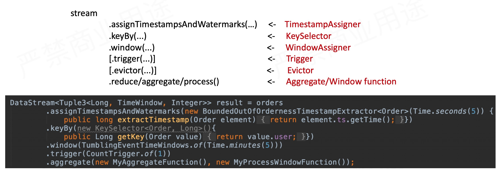
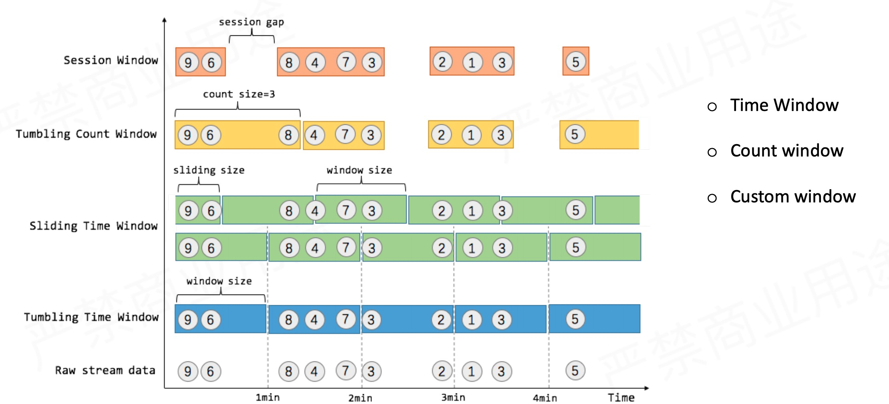

# 概念

## 使用场景

* 聚合统计相关，统计小时、天等级别的聚合数据
* 记录合并操作
* 双流join，通过interval join方式去join一个时间窗口类的记录

## Window抽象概念


* Timestampasasigner:指定记录中作为记录eventtime的字段
* keyselector:选择记录中的列作为key的键
* WindowAssigner:将记录划分一个个的窗口
* State:存储的中间状态，状态可以调用增量集合函数，增量的方式计算状态
* Trigger:  决定什么时候出发window的计算
* Evictor: 过滤不需要的记录
* WindowFunction: 窗口计算记录然后输出

## Window编程接口



## Window Assigner

* 时间窗口
* 记录窗口
* 自定义窗口



## Window Trigger


### 默认Triggers

* 对于Eventtime window asigners的triggers是EventTimeTrigger
* GlobalWindow的是NeverTrigger

### Fire and Purge

* 一旦触发器确定好一个窗口已经准备处理，它触发计算，它返回FIRE或者FIRE_AND_PURGE。这是窗口操作符发出当前窗口结果的信号。给定一个带有ProcessWindowFunction的窗口，所有元素都被传递给ProcessWindowFunction(可能在将它们传递给驱逐器之后)。使用ReduceFunction、AggregateFunction或FoldFunction的窗口只会发出它们急切地聚合的结果。
* 当触发器触发时，它既可以触发也可以触发并清除。FIRE保留窗口的内容，而FIRE_AND_PURGE则删除其内容。默认情况下，预先实现的触发器只是在不清除窗口状态的情况下触发。

### DeltaTrigger

* 计算当前窗口的记录和上次触发窗口计算的记录进行计算，如果超过指定的阈值则触发窗口

```java
  public void deltaTrigger() {
        StreamExecutionEnvironment env = StreamExecutionEnvironment.getExecutionEnvironment();

        env.fromElements(1, 2, 3, 4, 5)
                .keyBy(new KeySelector<Integer, Integer>() {
                    @Override
                    public Integer getKey(Integer value) throws Exception {
                        return value;
                    }
                }).window(GlobalWindows.create())
                .trigger(DeltaTrigger.of(10000, (oldDataPoint, newDataPoint) -> {
                    return newDataPoint - oldDataPoint;
                }, IntSerializer.INSTANCE)).max(1);
    }
```

## Window Evictor

### 内置Evictor

* CountEvictor:窗口计算时，只保留最近N条element
* TimeEvictor:窗口计算时，只保留最近N段时间范围的element
* DeltaEvictor:窗口计算时，最新的一条element与其他element做delta计算，保留delta在threshold内的element

### TimeEvictor

```java
    public void timeEvictor() {
        StreamExecutionEnvironment env = StreamExecutionEnvironment.getExecutionEnvironment();
        env.fromElements(1, 23, 4, 5, 6)
                .keyBy((KeySelector<Integer, Integer>) value -> value)
                .window(GlobalWindows.create())
                // 只看最近5分钟的记录
                .evictor(TimeEvictor.of(Time.minutes(5)))
                .trigger(PurgingTrigger.of(CountTrigger.of(5)))
                .max(1);
    }
```

## WindowFunction

### AggregateFunction

* 高度抽象的增量聚合函数

### ProcessWindowFunction

* 低级别抽象的全量聚合函数

### ReduceFunction

* 聚合函数，指定俩个元素如何去聚合并且输出相同类型的元素

### FoldFunction

* FoldFunction指定窗口的输入元素如何与输出类型的元素组合。对于添加到窗口的每个元素和当前输出值，将递增地调用FoldFunction。第一个元素与输出类型的预定义初始值组合在一起。

```java
input
    .keyBy(<key selector>)
    .window(<window assigner>)
    .fold("", new FoldFunction<Tuple2<String, Long>, String>> {
       public String fold(String acc, Tuple2<String, Long> value) {
         return acc + value.f1;
       }
    });
```

# 工作流程和实现机制

## WindowOperator工作流程

```java
public void processElement(StreamRecord<IN> element) throws Exception {
  // 获取元素规则的windows，windowAssigner来分配
		final Collection<W> elementWindows = windowAssigner.assignWindows(
			element.getValue(), element.getTimestamp(), windowAssignerContext);

		//if element is handled by none of assigned elementWindows
		boolean isSkippedElement = true;

		final K key = this.<K>getKeyedStateBackend().getCurrentKey();

		if (windowAssigner instanceof MergingWindowAssigner) {
			MergingWindowSet<W> mergingWindows = getMergingWindowSet();

			for (W window: elementWindows) {

				// adding the new window might result in a merge, in that case the actualWindow
				// is the merged window and we work with that. If we don't merge then
				// actualWindow == window
				W actualWindow = mergingWindows.addWindow(window, new MergingWindowSet.MergeFunction<W>() {
					@Override
					public void merge(W mergeResult,
							Collection<W> mergedWindows, W stateWindowResult,
							Collection<W> mergedStateWindows) throws Exception {

						if ((windowAssigner.isEventTime() && mergeResult.maxTimestamp() + allowedLateness <= internalTimerService.currentWatermark())) {
							throw new UnsupportedOperationException("The end timestamp of an " +
									"event-time window cannot become earlier than the current watermark " +
									"by merging. Current watermark: " + internalTimerService.currentWatermark() +
									" window: " + mergeResult);
						} else if (!windowAssigner.isEventTime()) {
							long currentProcessingTime = internalTimerService.currentProcessingTime();
							if (mergeResult.maxTimestamp() <= currentProcessingTime) {
								throw new UnsupportedOperationException("The end timestamp of a " +
									"processing-time window cannot become earlier than the current processing time " +
									"by merging. Current processing time: " + currentProcessingTime +
									" window: " + mergeResult);
							}
						}

						triggerContext.key = key;
						triggerContext.window = mergeResult;

						triggerContext.onMerge(mergedWindows);

						for (W m: mergedWindows) {
							triggerContext.window = m;
							triggerContext.clear();
							deleteCleanupTimer(m);
						}

						// merge the merged state windows into the newly resulting state window
						windowMergingState.mergeNamespaces(stateWindowResult, mergedStateWindows);
					}
				});

				// drop if the window is already late
				if (isWindowLate(actualWindow)) {
					mergingWindows.retireWindow(actualWindow);
					continue;
				}
				isSkippedElement = false;

				W stateWindow = mergingWindows.getStateWindow(actualWindow);
				if (stateWindow == null) {
					throw new IllegalStateException("Window " + window + " is not in in-flight window set.");
				}

				windowState.setCurrentNamespace(stateWindow);
				windowState.add(element.getValue());

				triggerContext.key = key;
				triggerContext.window = actualWindow;

				TriggerResult triggerResult = triggerContext.onElement(element);

				if (triggerResult.isFire()) {
					ACC contents = windowState.get();
					if (contents == null) {
						continue;
					}
					emitWindowContents(actualWindow, contents);
				}

				if (triggerResult.isPurge()) {
					windowState.clear();
				}
				registerCleanupTimer(actualWindow);
			}

			// need to make sure to update the merging state in state
			mergingWindows.persist();
		} else {
			for (W window: elementWindows) {

				// drop if the window is already late
				if (isWindowLate(window)) {
					continue;
				}
				isSkippedElement = false;

				windowState.setCurrentNamespace(window);
				windowState.add(element.getValue());

				triggerContext.key = key;
				triggerContext.window = window;

				TriggerResult triggerResult = triggerContext.onElement(element);

				if (triggerResult.isFire()) {
					ACC contents = windowState.get();
					if (contents == null) {
						continue;
					}
					emitWindowContents(window, contents);
				}

				if (triggerResult.isPurge()) {
					windowState.clear();
				}
				registerCleanupTimer(window);
			}
		}

		// side output input event if
		// element not handled by any window
		// late arriving tag has been set
		// windowAssigner is event time and current timestamp + allowed lateness no less than element timestamp
		if (isSkippedElement && isElementLate(element)) {
			if (lateDataOutputTag != null){
				sideOutput(element);
			} else {
				this.numLateRecordsDropped.inc();
			}
		}
	}
```

1. 获取element归属的windows
2. 获取element对应的key
3. 如果late data，跳过
4. 将element存入window state
5. 判断element是否触发trigger
6. 获取window state，注入window function
7. 清除window state
8. 注册timer，到窗口结束时间清理window

## Window State

### ListState

* process()/evitor()
* 全量状态计算

### AggregatingState

* Reduce()/aggregate()
* 增量状态计算

```java
public void add(IN value) throws IOException {
        N namespace = this.currentNamespace;
        if (value == null) {
            this.clear();
        } else {
            try {
                this.stateTable.transform(namespace, value, this.aggregateTransformation);
            } catch (Exception var4) {
                throw new IOException("Exception while applying AggregateFunction in aggregating state", var4);
            }
        }
    }
```

## Window Function

* 根据指定的window function，将window的记录放入prcoess中

```java
private void emitWindowContents(W window, ACC contents) throws Exception {
		timestampedCollector.setAbsoluteTimestamp(window.maxTimestamp());
		processContext.window = window;
		userFunction.process(triggerContext.key, window, processContext, contents, timestampedCollector);
	}
```

