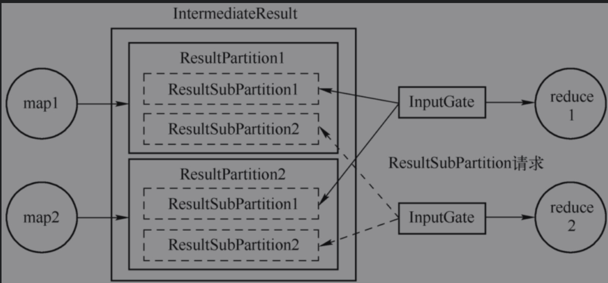
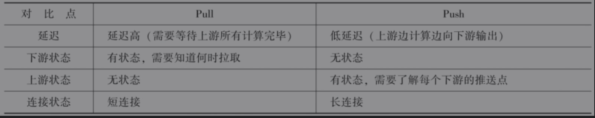
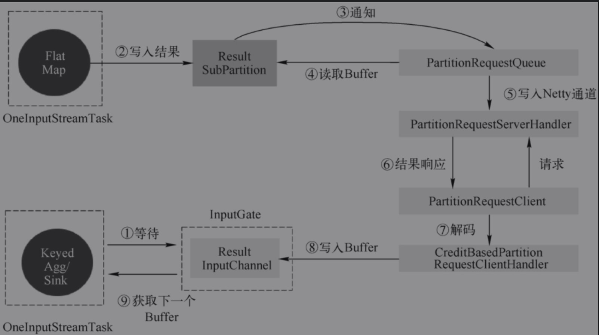

# 作业执行

## 作业执行图

* 最终执行图为ExecutionGraph，核心对象包括Task、ResultPartition & ResultSubPartition、InputGate & InputChannel。

## 核心对象

### 输入处理器StreamInputProcessor

#### 相关实现

* StreamOneInputProcessor：用在OneInputStreamTask中，只有1个上游输入。
* StreamTwoInputProcessor：用在TwoInputStreamTask中，有2个上游输入。
* StreamMultipleInputProcessor：多输入实现

#### 核心方法

* processInput

```java
public InputStatus emitNext(DataOutput<T> output) throws Exception {

		while (true) {
			// get the stream element from the deserializer
			if (currentRecordDeserializer != null) {
				DeserializationResult result = currentRecordDeserializer.getNextRecord(deserializationDelegate);
				if (result.isBufferConsumed()) {
					currentRecordDeserializer.getCurrentBuffer().recycleBuffer();
					currentRecordDeserializer = null;
				}

				if (result.isFullRecord()) {
          // 底层调用udf的processElement
					processElement(deserializationDelegate.getInstance(), output);
					return InputStatus.MORE_AVAILABLE;
				}
			}

			Optional<BufferOrEvent> bufferOrEvent = checkpointedInputGate.pollNext();
			if (bufferOrEvent.isPresent()) {
				// return to the mailbox after receiving a checkpoint barrier to avoid processing of
				// data after the barrier before checkpoint is performed for unaligned checkpoint mode
				if (bufferOrEvent.get().isEvent() && bufferOrEvent.get().getEvent() instanceof CheckpointBarrier) {
					return InputStatus.MORE_AVAILABLE;
				}
				processBufferOrEvent(bufferOrEvent.get());
			} else {
				if (checkpointedInputGate.isFinished()) {
					checkState(checkpointedInputGate.getAvailableFuture().isDone(), "Finished BarrierHandler should be available");
					return InputStatus.END_OF_INPUT;
				}
				return InputStatus.NOTHING_AVAILABLE;
			}
		}
	}
```

### Task输入

#### StreamTaskInput

* StreamTaskNetworkInput负责从上游Task获取数据，使用InputGate作为底层读取数据。
* StreamTaskSourceInput负责从外部数据源获取数据，本质上是使用SourceFunction读取数据，交给下游的Task。

### Task输出

#### StreamTaskNetworkOutput

* StreamTaskNetworkOutput只是负责将数据交给算子来进行处理，实际的数据写出是在算子层面上执行的

### ResultPartition 

* 作业单个Task产生的数据，一个ResultPartition是一组Buffer实例。
* ResultPartition由ResultSubPartition组成，ResultSubPartition用来进一步将ResultPartition进行切分，切分成多少个ResultSubPartition取决于直接下游子任务的`并行度和数据分发`模式。

### ResultSubPartition 

* 负责存储实际的Buffer，如果上游Task对接下游4个Task，就为ResultPartition生成4个ResultSubPartition，一个并行度一个ResultSubPartition。

#### PipelinedSubPartition

* 纯内存型的ResultSubPartition，只能被消费一次。

#### BoundedBlockingSubParittion

* 用作对批处理Task的计算结果的数据存储，其行为是阻塞式，需要等待上游所有的数据处理完毕，然后下游才开始消费数据，可以消费1次或者多次

### InputGate

* Task的输入数据的封装，和JobGraph中的JobEdge一一对应，对应于上游的ResultPartition。
* 其中负责实际数据消费的是InputChannel，是InputChannel的容器，用于读取中间结果（IntermediateResult）在并行执行时由上游Task产生的一个或多个结果分区（ResultPartition）。
* SingleInputGate是消费ResultPartition的实体，对应于一个IntermediateResult。而UnionInputGate主要充当InputGate容器的角色，将多个InputGate联合起来，当作一个InputGate，一般是对应于上游的多个输出类型相同的IntermediateResult，对应于多个上游的IntermediateResult。



### InputChannel

* 每个InputGate会包含一个以上的InputChannel，和ExecutionEdge一一对应，也和结果子分区一对一相连，即一个InputChannel接收一个结果子分区的输出。

#### InputChannel实现

* LocalInputChannel：对应于本地结果子分区的输入通道，用来在本地进程内不同线程之间的数据交换。

* RemoteInputChannel：对应于远程的结果子分区的输入通道，用来表示跨网络的数据交换，底层基于Netty。

* UnknownInputChannel：一种用于占位目的的输入通道，需要占位通道是因为暂未确定相对于Task生产者的位置，在确定上游Task位置之后，如果位于不同的TaskManager则替换为RemoteInputChannel，如果位于相同的TaskManager则转换为LocalInputChannel。

## Task执行

* 由以前的锁机制改造为多线程模型，所有的并发操作都通过队列进行排队（Mailbox），单线程 （Mailbox线程）依次处理，这样就避免了并发操作。

### Task处理数据

```java
1. StreamInputProcessor#processInput
2. PushingAsyncDataInput#emitNext
public InputStatus emitNext(DataOutput<T> output) throws Exception {

		while (true) {
			// get the stream element from the deserializer
			if (currentRecordDeserializer != null) {
				DeserializationResult result = currentRecordDeserializer.getNextRecord(deserializationDelegate);
				if (result.isBufferConsumed()) {
					currentRecordDeserializer.getCurrentBuffer().recycleBuffer();
					currentRecordDeserializer = null;
				}

				if (result.isFullRecord()) {
					processElement(deserializationDelegate.getInstance(), output);
					return InputStatus.MORE_AVAILABLE;
				}
			}

			Optional<BufferOrEvent> bufferOrEvent = checkpointedInputGate.pollNext();
			if (bufferOrEvent.isPresent()) {
				// return to the mailbox after receiving a checkpoint barrier to avoid processing of
				// data after the barrier before checkpoint is performed for unaligned checkpoint mode
				if (bufferOrEvent.get().isEvent() && bufferOrEvent.get().getEvent() instanceof CheckpointBarrier) {
					return InputStatus.MORE_AVAILABLE;
				}
				processBufferOrEvent(bufferOrEvent.get());
			} else {
				if (checkpointedInputGate.isFinished()) {
					checkState(checkpointedInputGate.getAvailableFuture().isDone(), "Finished BarrierHandler should be available");
					return InputStatus.END_OF_INPUT;
				}
				return InputStatus.NOTHING_AVAILABLE;
			}
		}
	}

# processElement
  private void processElement(StreamElement recordOrMark, DataOutput<T> output) throws Exception {
		if (recordOrMark.isRecord()){
			output.emitRecord(recordOrMark.asRecord());
		} else if (recordOrMark.isWatermark()) {
			statusWatermarkValve.inputWatermark(recordOrMark.asWatermark(), lastChannel);
		} else if (recordOrMark.isLatencyMarker()) {
			output.emitLatencyMarker(recordOrMark.asLatencyMarker());
		} else if (recordOrMark.isStreamStatus()) {
			statusWatermarkValve.inputStreamStatus(recordOrMark.asStreamStatus(), lastChannel);
		} else {
			throw new UnsupportedOperationException("Unknown type of StreamElement");
		}
	}
# udf processElement
  public void emitRecord(StreamRecord<IN> record) throws Exception {
			numRecordsIn.inc();
			// 设置流上下文
			operator.setKeyContextElement1(record);
			// SchedulerNG调用对应算子udf
			operator.processElement(record);
		}
```

1. OperatorChain内部的数据传递，发生OperatorChain所在本地线程内。
2. 同一个TaskManager的不同Task之间传递数据，发生在同一个JVM的不同线程之间。
3. 不同TaskManager的Task之间传递数据，即跨JVM的数据传递，需要使用跨网络的通信，即便TaskManager位于同一个物理机上，也会使用网络协议进行数据传递。

### Task处理WaterMarker

#### 单流Watermark

* 单流输入逻辑比较简单，如果有定时器服务，则判断是否触发计算，并将Watermark发往下游

#### 双流waterMarker

* 双流输入从上游两个算子中接收到两个Watermark，inputWatermark1表示第一个输入流的Watermark，inputWatermark2表示第2个输入流的Watermark，选择其中较小的那一个Min（inputWatermrk1，inputWatermark2）作为当前的Watermark。

### Task处理StreamStatus

* StreamStatus是StreamElement的一种，用来标识Task是活动状态还是空闲状态。当SourceStreamTask或一般的StreamTask处于闲置状态（IDLE），不会向下游发送数据或Watermark时，就向下游发送StreamStatus#IDLE状态告知下游，依次向下传递。当恢复向下游发送数据或者Watermark前，首先发送StreamStatus#ACTIVE状态告知下游。

###  Task处理LatencyMarker

* LatencyMarker用来近似评估数据从读取到写出之间的延迟，但是并不包含计算的延迟。在算子中只能将数据记录交给UDF执行，所以收到LatencyMarker就直接交给下游了

# 数据交换

## 数据传递模式

### Batch模式

* Batch的计算模型采用PULL模式，与Spark类似，将计算过程分成多个阶段，上游完全计算完毕之后，下游从上游拉取数据开始下一阶段计算，直到最终所有的阶段都计算完毕，输出结果，BatchJob结束退出。

### Stream模式

* Stream的计算模型采用的是PUSH模式，上游主动向下游推送数据，上下游之间采用生产者-消费者模式，下游收到数据触发计算，没有数据则进入等待状态。PUSH模式的数据处理过程也叫作Pipeline，提到Pipeline或者流水线的时候，一般是指PUSH模式的数据处理过程。



## 关键组件

### RecordWriter

* 负责将Task处理的数据输出，面向StreamRecords直接处理算子的输出结果，ResultPatitionWriter面向的是Buffer，起到承上启下的作用，RecordWriter底层依赖于ResultPatitionWriter。

#### 单播

* 通过ChannelSelector将StreamRecord写入ResultSubPartition中，默认为RoundRobinChannelSelector以轮询的方式输出数据到对应的ResultPartition

#### 广播

* 广播就是向下游所有的Task发送相同的数据，在所有的ResultSubPartition中写入N份相同数据。但是在实际实现时，同时写入N份重复的数据是资源浪费，所以对于广播类型的输出，只会写入编号为0的ResultSubPartition中，下游Task对于广播类型的数据，都会从编号为0的ResultSubPartition中获取数据。

### RecordSerializer

* 实现为SpanningRecordSerializer是一种支持跨内存段的序列化器，其实现借助于中间缓冲区来缓存序列化后的数据，然后再往真正的目标Buffer里写，在写的时候会维护两个“指针”：
  * 表示目标Buffer内存段长度的limit
  * 表示其当前写入位置的position

### RecordDeserializer

* 负责数据的反序列化SpillingAdaptiveSpanningRecordDeserializer是唯一实现
  * PARTIAL_RECORD： 表示记录并未完全被读取，但缓冲中的数据已被消费完成。
  * INTERMEDIATERECORDFROM_BUFFER： 表示记录的数据已被完全读取，但缓冲中的数据并未被完全消费。
  * LASTRECORDFROM_BUFFER： 记录被完全读取，且缓冲中的数据也正好被完全消费。

### ResultSubPartitionView

* 定义了ResultSubPartition中读取数据、释放资源等抽象行为
  * PipelinedSubPartitionView：用来读取PipelinedSubPartition中的数据。
  * BoundedBlockingSubPartitionReader：用来读取BoundedBlockingSubPartition中的数据。

## 数据传递

### 本地线程内的数据传递

* 本质是属于同一个OperatorChain的算子之间的数据传递，算子chain优化方式传递数据。

### 本地线程内数据传递

* 位于同一TaskMananger的不同Task算子之间，不会通过算子间的直接调用方法传输数据，而是通过本地内存进行数据传递。
* 不同Task线程共享一个BufferPool，通过wait和notifyAll来同步，以此来进行数据传递。

### 本地线程内数据交换的过程


### 跨网络的数据传递

* 运行在不同TaskManager JVM中的Task之间的数据传递，与本地线程间的数据交换类似。



## 数据传递过程

### 数据传递过程

1. 数据在本算子处理完后，交给RecordWriter，经过ChannelSelector找到对应ResultSubPartition。
2. 每个ResultSubPartition都有一个独有的序列化器（避免多线程竞争），将这条记录序列化为二进制数据。
3. 数据被写入ResultSubPartition中此时数据已经存入DirectBuffer(MemorySegment)中
4. 单独的线程控制数据的flush速度，一旦触发flush，则通过Netty的nio通道向对端写入。
5. 对端的Netty Client接收到数据，解码出来把数据复制到Buffer中，通知InputGate的InputChannel
6. 有可用数据时，下游算子从阻塞唤醒，从InputChannel中取出Buffer，再反序列化成数据记录交给算子的UDF。

### 数据写出

* Task调用算子执行UDF之后，需要将数据交给下游进行处理。RecordWriter类负责将StreamRecord进行序列化，调用SpaningRecordSerializer，再调用BufferBuilder写入MemorySegment中（每个Task都有自己的LocalBufferPool，LocalBufferPool中包含了多个MemorySegment）

