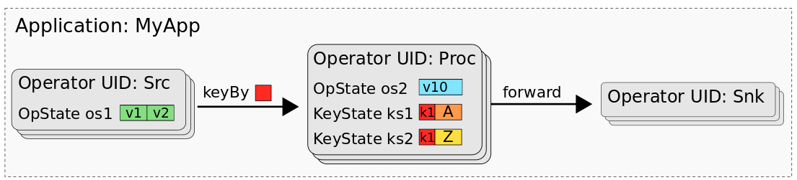

# 状态处理API

## use
* flink提供状态处理API用来可以读写、修改savepoint和checkpoint的手段，使用需要引入以下依赖：
```xml
<dependency>
    <groupId>org.apache.flink</groupId>
    <artifactId>flink-state-processor-api_2.11</artifactId>
    <version>1.13.2</version>
</dependency>
```

## 概述

* 以下是一个典型的flinkjob，其内部状态如下

  
* 对于状态而言每个算子的UID是状态映射的namesapce，状态存储在这个命名空间里，按照对应的状态区分，它的状态在应用里的映射如下

  
## 读取状态

```java
 public static void readState() throws Exception {
        ExecutionEnvironment bEnv = ExecutionEnvironment.getExecutionEnvironment();
        ExistingSavepoint savepoint = Savepoint.load(bEnv, "hdfs://flink/savepoints", new MemoryStateBackend());
        // 读取listState
        DataSource<Integer> listState = savepoint.readListState("my-uid", "name", TypeInformation.of(Integer.class));
        listState.print();
        //读取union状态
        savepoint.readUnionState("union-uid", "union", TypeInformation.of(Integer.class)).print();
        //读取broadCast状态
        savepoint.readBroadcastState("broadcast-uid", "broadcsat", TypeInformation.of(String.class),
                TypeInformation.of(Integer.class)).print();
        //读取自定义状态
        DataSet<Integer> customState = savepoint.readListState(
                "uid",
                "list-state",
                Types.INT, new TypeSerializer<Integer>() {
                    @Override
                    public boolean isImmutableType() {
                        return false;
                    }

                    @Override
                    public TypeSerializer<Integer> duplicate() {
                        return null;
                    }

                    @Override
                    public Integer createInstance() {
                        return null;
                    }

                    @Override
                    public Integer copy(Integer from) {
                        return null;
                    }

                    @Override
                    public Integer copy(Integer from, Integer reuse) {
                        return null;
                    }

                    @Override
                    public int getLength() {
                        return 0;
                    }

                    @Override
                    public void serialize(Integer record, DataOutputView target) throws IOException {

                    }

                    @Override
                    public Integer deserialize(DataInputView source) throws IOException {
                        return null;
                    }

                    @Override
                    public Integer deserialize(Integer reuse, DataInputView source) throws IOException {
                        return null;
                    }

                    @Override
                    public void copy(DataInputView source, DataOutputView target) throws IOException {

                    }

                    @Override
                    public boolean equals(Object obj) {
                        return false;
                    }

                    @Override
                    public int hashCode() {
                        return 0;
                    }

                    @Override
                    public TypeSerializerSnapshot<Integer> snapshotConfiguration() {
                        return null;
                    }
                });
    }
```

* read keyed state
```java
     savepoint.readKeyedState("keyed-uid",new ReaderFunction());
    }
    public static class KeyedState {
        public int key;

        public int value;

        public List<Long> times;
    }

    public static class ReaderFunction extends KeyedStateReaderFunction<Integer, KeyedState> {

        ValueState<Integer> state;

        ListState<Long> updateTimes;

        @Override
        public void open(Configuration parameters) {
            ValueStateDescriptor<Integer> stateDescriptor = new ValueStateDescriptor<>("state", Types.INT);
            state = getRuntimeContext().getState(stateDescriptor);

            ListStateDescriptor<Long> updateDescriptor = new ListStateDescriptor<>("times", Types.LONG);
            updateTimes = getRuntimeContext().getListState(updateDescriptor);
        }

        @Override
        public void readKey(
                Integer key,
                Context ctx,
                Collector<KeyedState> out) throws Exception {

            KeyedState data = new KeyedState();
            data.key    = key;
            data.value  = state.value();
            data.times  = StreamSupport
                    .stream(updateTimes.get().spliterator(), false)
                    .collect(Collectors.toList());

            out.collect(data);
        }
    }
```

## 写状态

```java
 public static void writeState(){
        ExecutionEnvironment env = ExecutionEnvironment.getExecutionEnvironment();
        DataSet<Integer> data = env.fromElements(1, 2, 3);
        //opeartor state


        BootstrapTransformation<Integer> transformation = OperatorTransformation
        .bootstrapWith(data)
        .transform(new SimpleBootstrapFunction());

        Savepoint.create(new MemoryStateBackend(),128)
        .withOperator("test",transformation)
        .write("hdfs://xxx/write");
        }
public static class SimpleBootstrapFunction extends StateBootstrapFunction<Integer> {

    private ListState<Integer> state;

    @Override
    public void processElement(Integer value, Context ctx) throws Exception {
        state.add(value);
    }

    @Override
    public void snapshotState(FunctionSnapshotContext context) throws Exception {
    }

    @Override
    public void initializeState(FunctionInitializationContext context) throws Exception {
        state = context.getOperatorStateStore().getListState(new ListStateDescriptor<>("state", Types.INT));
    }
}
```

## 修改状态
```java
  public static void modityState() throws IOException {
        ExecutionEnvironment env = ExecutionEnvironment.getExecutionEnvironment();
        DataSet<Integer> data = env.fromElements(1, 2, 3);
        BootstrapTransformation<Integer> transformation = OperatorTransformation
                .bootstrapWith(data)
                .transform(new SimpleBootstrapFunction());
        Savepoint.load(env,"hdfs://old/ck",new MemoryStateBackend())
                .withOperator("test-id",transformation)
                .write("hdfs://new/ck");
    }
```