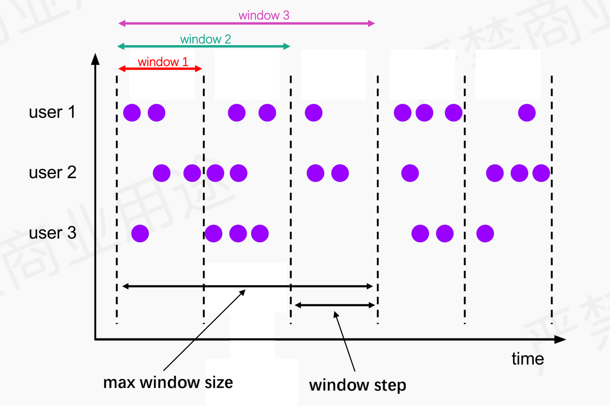
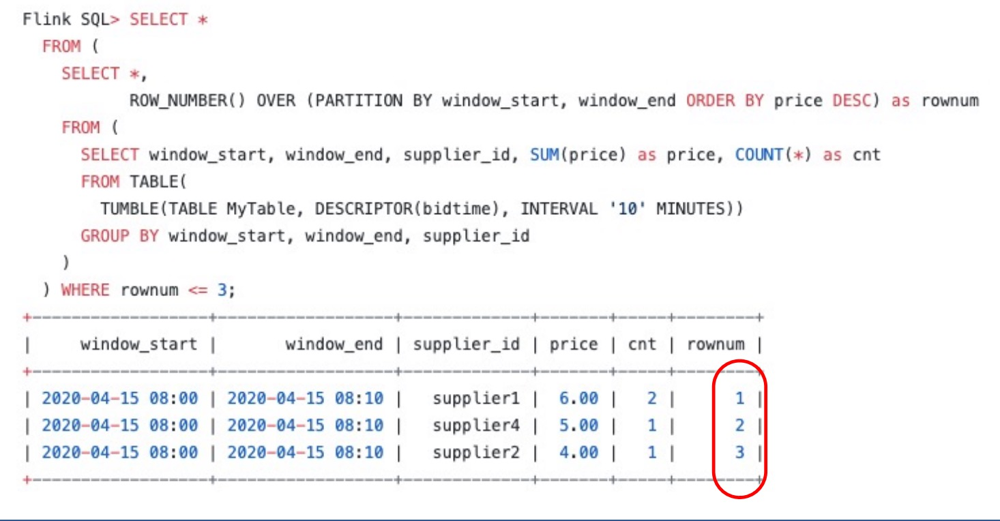
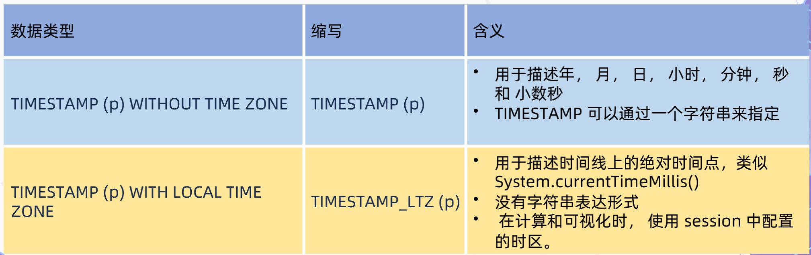

# Flink Table/SQL

## 概览

* 支持Window TVF
* 时区和时间函数
* 提升Hive语法兼容性
* 改善SQL Client
* 增强DataStream和Table的转换

## Window TVF

### Window TVF语法

#### Table-Valued Function

* 1.13之前是一个特殊的GroupWindowFunction，1.13使用Table-Valued Function进行语法标准化。

```sql
# 1.13之前
select TUMBLE_START(bidtime,INTERVAL '10' MINUTE) as window_start,
			 TUMBLE_END(bidtime,INTERVAL '10' MINUTES) as window_end,
       TUMBLE_ROWTIME(bidtime,INTERVAL '10' MINUTES) as rt,
       sum(price)
       from MyTable
       GROUP BY TUMBLE(bidtime,INTERVAL '10' MINUTE);
       
# 1.13
select window_start,window_end,window_time,sum(price)
			from TABLE(TUMBLE(bidtime,INTERVAL '10' MINUTES))
			GROUP BY window_start,window_end;
```

#### 关系代数表达式

* 完整的关系代数表达式，输入是一个关系，输出也是一个关系，每个关系对应一个数据集


#### window语法

* 支持TUMBLE、HOP WIndow
* 新增CUMULATE WINDOW，适合计算增量UV统计需求，比如当前uv从10点到下午6点增量数据



### Window性能优化

* 内存优化:通过内存预分配缓存window的数据，通过window watermark触发计算。
* 切片优化:将window切片，尽可能复用已计算结果，如hop window，cumulate window。
* 算子优化:window支持local-global优化，同事支持count(distinct)自动解热点优化。
* 迟到数据:支持迟到数据计算到后续分片，保证数据准确性。

### 多维数据分析

* GROUPING SETS:支持对多纬度数据分组
* ROLLUP:下卷
* CUBE
* Row Number:window topN



## 时区与时间函数

### 时区问题

* 处理事件窗口刚好晚8个小时
* BIGINT 转 TIMESTAMP是否隐含时区信息
* watermark + 8h 问题
* SQL 时区问题
* CURRENT_DATE 函数问题
* CURRENT_DATE, CURRENT_TIMESTAMP 时区问题
* long 转 timestamp 怎么做
* Hive 分区提交的时区差问题
* PROCTIME()函数语义问题
* 毫秒值如何声明成时间类型


#### 支持TIMESTAMP_LTZ类型



```sql
# 通过设置本地时区来决定timestamp_ltz时区
CREATE VIEW T1 AS SELECT TO_TIMESTAMP_LTZ(1621649473000,3)
set table.local-time-zone=UTC;
SELECT * FROM T1;
```

### 时间函数

* PROCTIME()、CURRENT_TIMESTAMP类型为TIMESTAMP_LTZ，LOCALTIMESTAMP类型为TIMESTAMP
* EVENT_TIME也支持TIMESTAMP_LTZ，时间窗口可以根据本地时区而定。

## 提升Hive语法兼容性

### 支持Hive的DML、DQL

* SORT、CLUSTER、DISTRIBUTE BY
* Group By
* Join
* Union
* LATERL VIEW
* Window Functions
* SubQueries
* CTE:[cte](https://cwiki.apache.org/confluence/display/Hive/Common+Table+Expression)
* INSERT INTO dest schema
* Implicit type conversions

```sql
# 使用hive catalog、hive module
create catalog myhive with('type'='hive');
use catalog myhive;
load module hive;
use modules hive,core;
set table.sql-dialect=hive;
# 创建hive function
create function function_name as class_name;
drop function [if exists]function_name;
```

## 改进SQL Client

```sql
# -i参数支持初始化表的多个ddl语句
sql-client.sh -i init.sql
# -f参数，其中sqlfile文件支持DML(insert into)语句
sql-client.sh -i init.sql -f sqlfile

# 开启verbose模式，输出异常堆栈信息
set sql-client.verbose=true;
# 支持设置作业模式
set execution.runtime-mode=streaming;
# 设置作业名
set pipeline.name=xxx;
# 设置作业savepoint路径
set execution.savepoint.path=xxx
# 指定insert into同步或异步执行，批模式下有依赖的pipeline非常有用
set table.dml-sync=true;
```

* 支持statement set

```sql
begin statement set;
insert into xx select a,b,c from d;
insert into xx1 select a,b,c from d;
end;
```

## 增强DataStream和Table的转换

* 支持Datastream和Table转换时传递event time和watermark

```java
Table table=tableEnv.fromDataStream(
dataStream,
Schema.newBuilder()
.columnByMetadata("rowtime","TIMESTAMP(3)")
.watermark("rowtime","SOURCE_WATERMARK()")
.build());
```

* 支持changlog数据流在table和datastream间互相转换

```
# DataStream转Table
StreamTableEnvironment.fromChangelogStream(DataStream<Row>):Table
StreamTableEnvironment.fromChangelogStream(DataStream<Row>,Schema):Table
# Table转DataStream
StreamTableEnvironment.toChangelogStream(Table):DataStream<Row>
StreamTableEnvironment.toChangelogStream(Table,Schema):DataStream<Row>
```

# Reactive Scaling

* 响应模式在调整事件上重新启动作业，并从最近完成的检查点恢复作业。这意味着没有创建保存点的开销(手动调整作业需要保存点)。此外，重新调整后重新处理的数据量取决于检查点间隔，恢复时间取决于状态大小。

```shell
./bin/standalone-job.sh start -Dscheduler-mode=reactive -Dexecution.checkpointing.interval="10s" -j org.apache.flink.streaming.examples.windowing.TopSpeedWindowing
# 动态增加tm
./bin/taskmanager.sh start
# 动态减少tm
./bin/taaskmanager.sh stop
```

* scheduler-mode=reactive开启reactive模式

# StateBackend

## StateBackend API调整


## 状态数据结构升级

### POJO类型

* 可以删除字段。一旦删除，被删除字段的前值将会在将来的 checkpoints 以及 savepoints 中删除。
* 可以添加字段。新字段会使用类型对应的默认值进行初始化
* **不可以修改字段的声明类型。**
* **不可以改变 POJO 类型的类名，包括类的命名空间。**

### Avro

* Flink 完全支持 Avro 状态类型的升级，只要数据结构的修改是被 [Avro 的数据结构解析规则](http://avro.apache.org/docs/current/spec.html#Schema+Resolution)认为兼容的即可。

* 一个例外是如果新的 Avro 数据 schema 生成的类无法被重定位或者使用了不同的命名空间，在作业恢复时状态数据会被认为是不兼容的。

  
