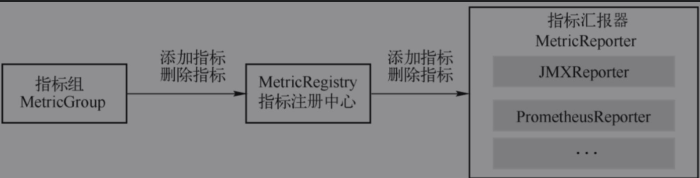

# 监控指标

* Flink提供Counter、Gauge、Histogram和Meter4类指标。

## Counter

* 用来统计一个指标的总量。以Flink中的指标为例，算子的接收记录总数（numRecordsIn）和发送记录总数（numRecordsOut）属于Counter类型。

## Gauge指标瞬时值

* 用来记录一个指标的瞬间值。以Flink中的指标为例，TaskManager中的JVM堆内存使用量（JVM.Heap.Used），记录某个时刻TaskManager进程的JVM堆内存使用量。

## Histogram直方图

* 指标的总量或者瞬时值都是单个值的指标，当想得到指标的最大值、最小值、中位数等统计信息时，需要用到Histogram。Flink中属于Histogram的指标很少，其中最重要的一个是算子的延迟。此项指标会记录数据处理的延迟信息，对任务监控起到很重要的作用。

## Meter平均值

* 用来记录一个指标在某个时间段内的平均值。Flink中类似的指标有Task/算子中的numRecordsInPerSecond，记录此Task或者算子每秒接收的记录数。

# 指标组

* Flink指标体系是一个树形结构，域是顶层分支，表示指标的大的分类。

```
<host>.taskmanger.<tm_id>.<job_name>.<operator_name>.<subtask_index>
```



# 监控集成

## MetricReporter主动集成

* 通过反射机制实例化MetricReporter，MetricReporter的实现类必须是public的访问修饰符，不能是抽象类，必须有一个无参构造函数。
* 使用MetricReporterFactory工厂模式实例化MetricReporter
* flink官方提供JMX、Graphite、InfluxDB、Prometheus、PrometheusPushGateway、StatsD、Datadog和Slf4j8种方式

## Rest API监控接口被动集成

* Flink提供Rest API监控接口，被动接收外部应用的调用，返回集群、组件、作业、Task、算子的状态。
* 具体可以查看官方文档Monitor部分。
