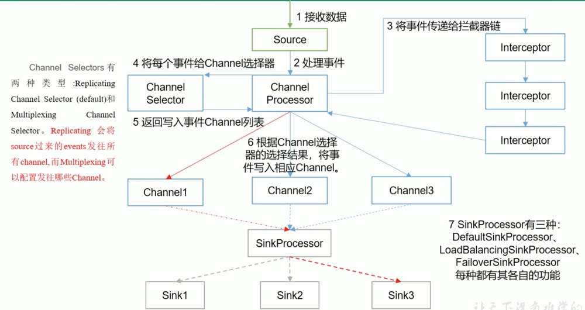
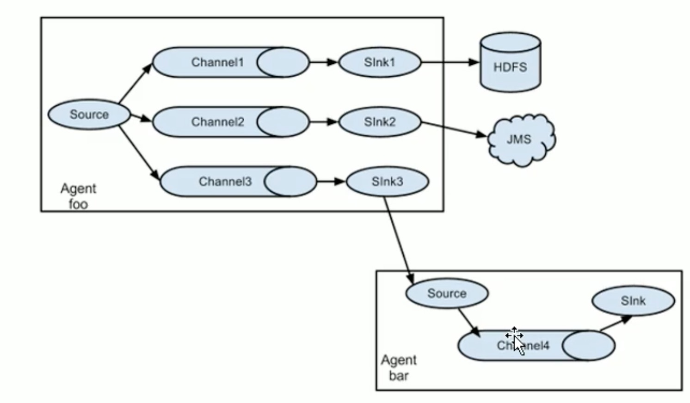
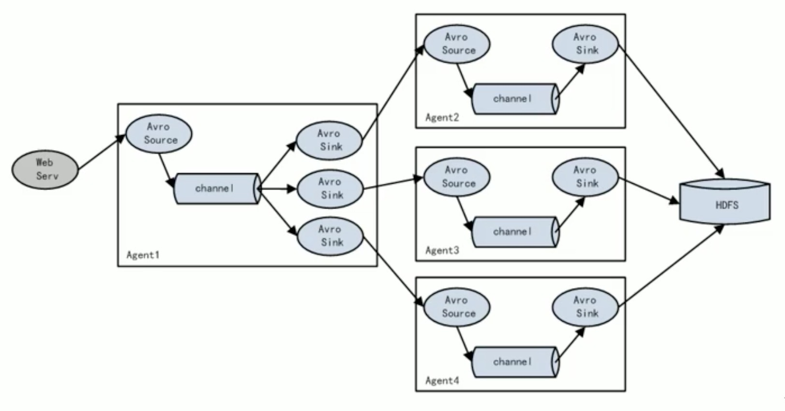

# Flume概述

## 定义

* Flume是向Hadoop批量导入基于事件的海量数据，例如利用Flume从一组Web服务器中搜集日志文件，然后把这些文件转移到一个新的HDFS汇总文件中以做进一步处理，其终点(或者sink)通常为HDFS。
* Flume也支持导入其他系统比如HBase或Solr。
* 基于流式架构，灵活简单。
* 支持动态配置，定时拉取flume-ng配置，配置热更新。

## Flume适合场景


## 运行流程

​              

* 使用Flume需要`运行Flume代理`，Flume代理是由`持续运行的source`、`sink`以及`channel`(用于连接source和sink)构成的Java进程
* Flume的`sourcgite产生事件`，并将其`传输给channel`，`channel存储这些事件直至转发给sink`。
* 可以把source-channel-sink的组合视为基本的Flume构件。

## 基础架构

### Agent

* `JVM进程`，以事件的形式将数据从source sink到目的地。
* 包含Souce、Channel、Sink是哪个部分

### Souce

* `Souce`复制接收数据到FLume Agent的组件。SOuce组件支持处理多种类型多种格式的日志数据，包括`avro`、thrift、`exec`、`jms`、spooling directory、`netcat`、sequence generator、syslog、http、legacy。

### Sink

* Sink不断地轮询Channel中的事件且批量地移除它们，并将这些事件批量写入到存储或索引系统、或者被发送到另一个Flume Agent.
* Sink组件目的地包括`hdfs`、`logger`、`avro`、thrift、ipc、`file`、`HBase`、solr、自定义。

### Channel

* Channel是位于`Source和Sink`之间的缓冲区。因此，Channel允许`Source和Sink运作在不同的速率`。Channel是`线程安全的`，可以同时处理`几个Source的写入操作和几个Sink的读取操作`。
* 自带Channel:`Memory`和`File`以及`KafkaChannel`。
* Memory Channel是内存中的队列。File Channel是将所有事件写到磁盘。

### Event

* 传输单元,Flume数据传输的基本单元，以Event的形式将数据从源头送至目的地。Event由`Header`和`Body`两部分组成，`Header`用来存放该event的一些属性，为K-V结构，Body用来`存放该条数据， 形式为字节数组`。

# Flume安装

## 安装配置

```properties
http://www.apache.org/dyn/closer.lua/flume/1.9.0/apache-flume-1.9.0-bin.tar.gz

# 解压
tar -zxvf apache-flume-1.9.0-bin.tar.gz
# 配置环境变量
#Flume环境
export FLUME_HOME=/Users/babywang/Documents/reserch/studySummary/bigdata/flume/apache-flume-1.9.0
export PATH=$PATH:$FLUME_HOME/bin

# 配置JAVA HOME
# export JAVA_HOME=/usr/lib/jvm/java-8-oracle
export JAVA_HOME=/Library/Java/JavaVirtualMachines/jdk1.8.0_221.jdk/Contents/Home
```

* Flume-ng启动代理查看是否安装成功

## 入门案例

### 官方文档Netcat

#### 创建配置

```properties
# example.conf: A single-node Flume configuration

# Name the components on this agent
# a1为agent的名称
a1.sources = r1
a1.sinks = k1
a1.channels = c1

# Describe/configure the source
# 配置agent a1的source配置
a1.sources.r1.type = netcat
a1.sources.r1.bind = localhost
a1.sources.r1.port = 9999

# Describe the sink
# 配置agent a1的sink配置
a1.sinks.k1.type = logger

# Use a channel which buffers events in memory
# 配置agent a1的channel配置
a1.channels.c1.type = memory
a1.channels.c1.capacity = 1000
a1.channels.c1.transactionCapacity = 100

# Bind the source and sink to the channel
# 绑定source和channel，sink和channel，channel和sink为1对n，source和channel为1对多
a1.sources.r1.channels = c1
a1.sinks.k1.channel = c1
```

#### 启动Flume-ng

```shell
flume-ng agent -n a1 -c $FLUME_HOME/conf -f netcat-flume-logger.conf -Dflume.root.logger=INFO,console
```

* -n: 指定运行的agent名称
* -c:指定flume配置文件目录
* -f:运行的Job

#### 启动netcat客户端

```shell
nc localhost 9999
```

### 实时监控单个文件

* 实时监控Zookeeper日志，并上传到HDFS中

#### 配置文件到日志

```properties
a1.sources = r1
a1.sinks = k1
a1.channels = c1


# 配置source -F失败后会重试 -f直接读取后面的数据
a1.sources.r1.type = exec
a1.sources.r1.command = tail -f /Users/babywang/Documents/reserch/studySummary/module/hadoop-2.8.5/logs/hadoop-babywang-namenode-research.log

# 配置sink
a1.sinks.k1.type = logger

# 配置agent a1的channel配置
a1.channels.c1.type = memory
a1.channels.c1.capacity = 1000
a1.channels.c1.transactionCapacity = 100

# source绑定channel
a1.sources.r1.channels = c1
a1.sinks.k1.channel=c1
```

* 启动flume-ng

```shell
flume-ng agent -n a1 -c $FLUME_HOME/conf -f file-flume-logger.conf -Dflume.root.logger=INFO,console
```

#### 日志到HDFS

* 将Hadoop相关jar拷贝至Flume lib目录下

```java
#从hadoop/shared目录下拷贝
hadoop-auth-2.8.5.jar
hadoop-common-2.8.5.jar
hadoop-hdfs-2.8.5.jar
commons-io-2.4.jar
commons-configuration-1.6.jar
htrace-core4-4.0.1-incubating.jar
```

* 配置

```properties
a1.sources = r1
a1.sinks = k1
a1.channels = c1


# 配置source -F失败后会重试 -f直接读取后面的数据
a1.sources.r1.type = exec
a1.sources.r1.command = tail -f /Users/babywang/Documents/reserch/studySummary/module/hadoop-2.8.5/logs/hadoop-babywang-namenode-research.log

# 配置sink
a1.sinks.k1.type = hdfs
a1.sinks.k1.hdfs.path = hdfs://hadoop:8020/hadoop/logs/%y-%m-%d/%H%M/%S
# 上传文件前缀
a1.sinks.k1.hdfs.filePrefix = namenode-
# 上传文件后缀
a1.sinks.k1.hdfs.fileSuffix = log
# 是否按照实际滚动文件夹
a1.sinks.k1.hdfs.round = true
# 多少时间单位创建一个新的文件夹
a1.sinks.k1.hdfs.roundValue = 1
a1.sinks.k1.hdfs.roundUnit = hour
# 是否使用本地时间戳
a1.sinks.k1.hdfs.useLocalTimeStamp = true
# 积攒多少个Event才flush到HDFS一次
a1.sinks.k1.hdfs.batchSize = 1000
# 设置文件类型，可支持压缩
a1.sinks.k1.hdfs.fileType = DataStream
# 多久生成一个文件
a1.sinks.k1.hdfs.rollInterval = 60
# 设置每个文件的滚动大小 
a1.sinks.k1.hdfs.rollSize = 134217700
# 文件的滚动与Event数量无关
a1.sinks.k1.hdfs.rollCount = 0

# 配置agent a1的channel配置
a1.channels.c1.type = memory
a1.channels.c1.capacity = 3000
a1.channels.c1.transactionCapacity = 2000

# source绑定channel
a1.sources.r1.channels = c1
a1.sinks.k1.channel=c1
```

* 启动脚本

```shell
flume-ng agent -n a1 -c $FLUME_HOME/conf -f file-flume-hdfs.conf
```

### 实时监控目录下多个新文件

* 使用Spooling Directory Source

```properties
a1.sources = s1
a1.sinks = k1
a1.channels = c1

# sources
a1.sources.s1.type = TAILDIR
a1.sources.s1.positionFile = /Users/babywang/Documents/reserch/studySummary/module/flume-1.9.0/job/taildir_position.json
a1.sources.s1.filegroups = f1 f2
a1.sources.s1.filegroups.f1 = /Users/babywang/Documents/reserch/studySummary/module/test/file1.txt
a1.sources.s1.filegroups.f2 = /Users/babywang/Documents/reserch/studySummary/module/test/file2.txt

# sink
a1.sinks.k1.type = logger

# channels
a1.channels.c1.type = memory
a1.channels.c1.capacity = 1000
a1.channels.c1.transactitionCapacity = 100

# binds
a1.sources.s1.channels = c1
a1.sinks.k1.channel = c1
```

* 启动脚本

```shell
flume-ng agent -n a1 -c $FLUME_HOME/conf -f dir-flume-hdfs.conf
```

### 实时监控目录下多个追加文件

* 无法使用Exec source因为Exec无法保证数据不丢失，Spooldir Source能够保证数据不丢失，且能够实现断点续传，存在延迟，不能实时监控；Taildir Source支持断点续传，也可以保证数据不丢失并且低延迟支持实时监控。

#### Taildir Source配置

# 高级特性

## 事务和可靠性

### 原理


* Flume使用`两个独立的事务`分别负责从`source到channel`以及从`channel到sink`的事件传递
* 一旦事务中的所有事件全部传递到channel且提交成功，那么source就将该文件标记为已完成。如果`事件失败就会回滚保存在channel中等待重新传递`。

### Flume的channel类型

* file channel，`具有持久性，只要事件被写入channel，即使代理重新启动，事件也不会丢失`
* memory channel，`事件缓冲在存储器中，不具有持久存储能力`。

### 批量处理

* Flume在有可能的情况下尽量以`事务为单位来批量处理事件`，而不是`逐个事件进行处理`。`批量处理有利于提高file channel的性能，因为每个事务只需要写一次本地磁盘和调用一次fsync函数`。
* `批量的大小取决于组件的类型，并且大多数情况下是配置的`。

## Flume Agent原理



### Multiplexing Channel Selector

```properties
a1.sources = r1
a1.channels = c1 c2 c3 c4
a1.sources.r1.selector.type = multiplexing
a1.sources.r1.selector.header = state
# 如果header中包含state CZ选择c1channel，包含state US选择c2 c3默认选择c4
a1.sources.r1.selector.mapping.CZ = c1
a1.sources.r1.selector.mapping.US = c2 c3
a1.sources.r1.selector.default = c4
```

## Flume拓扑结构

### 简单串联


* 这种模式是将多个flume顺序连接起来，从最初的source开始到最终sink传送的目的存储系统。不适合桥接过多的flume数量，flume数量过多会导致传送速度变慢和系统稳定性。

### 复制和多路复用



* Flume支持将事件流向一个或多个目的地。这种模式可以将相同数据复制到多个channel中，或者将不同数据分发到不同channel中，sink可以选择传送到不同的目的地。

#### single-source-mutil-sink

```properties
flume-1.sources = s1
flume-1.sinks = k1 k2
flume-1.channels = c1 c2

# source
flume-1.sources.s1.type = TAILDIR
flume-1.sources.s1.positionFile = /Users/babywang/Documents/reserch/studySummary/module/flume-1.9.0/job/position.json
flume-1.sources.s1.filegroups = f1
flume-1.sources.s1.filegroups.f1 = /Users/babywang/Documents/reserch/studySummary/module/hadoop-2.8.5/logs/hadoop-babywang-namenode-research.log


# sinks
## k1
flume-1.sinks.k1.type = avro
flume-1.sinks.k1.hostname = hadoop
flume-1.sinks.k1.port = 4545
## k2
flume-1.sinks.k2.type = avro
flume-1.sinks.k2.hostname = hadoop
flume-1.sinks.k2.port = 4546

# channels 
## c1
flume-1.channels.c1.type = memory
flume-1.channels.c1.capacity = 1000
flume-1.channels.c1.transactitionCapacity = 100

## c2
flume-1.channels.c2.type = memory
flume-1.channels.c2.capacity = 1000
flume-1.channels.c2.transactitionCapacity = 100

# 将数据流复制给所有channel
flume-1.sources.s1.selector.type = replicating

# bind
flume-1.sinks.k1.channel = c1
flume-1.sinks.k2.channel = c2
flume-1.sources.s1.channels = c1 c2
```

#### avro-logger

```properties
flume-2.sources = s1
flume-2.sinks = k1
flume-2.channels = c1

# source
flume-2.sources.s1.type = avro
flume-2.sources.s1.bind = hadoop
flume-2.sources.s1.port = 4546


# sinks
flume-2.sinks.k1.type = logger

# channels 
flume-2.channels.c1.type = memory
flume-2.channels.c1.capacity = 1000
flume-2.channels.c1.transactitionCapacity = 100

# bind
flume-2.sinks.k1.channel = c1
flume-2.sources.s1.channels = c1
```


#### avro-hdfs

```properties
flume-3.sources = s1
flume-3.sinks = k1
flume-3.channels = c1

# source
flume-3.sources.s1.type = avro
flume-3.sources.s1.bind = hadoop
flume-3.sources.s1.port = 4545


# sinks
flume-3.sinks.k1.type = hdfs
flume-3.sinks.k1.hdfs.path = hdfs://hadoop:8020/hadoop/logs/%y-%m-%d/%H%M/%S
# 上传文件前缀
flume-3.sinks.k1.hdfs.filePrefix = namenode-
# 上传文件后缀
flume-3.sinks.k1.hdfs.fileSuffix = log
# 是否按照实际滚动文件夹
flume-3.sinks.k1.hdfs.round = true
# 多少时间单位创建一个新的文件夹
flume-3.sinks.k1.hdfs.roundValue = 1
flume-3.sinks.k1.hdfs.roundUnit = hour
# 是否使用本地时间戳
flume-3.sinks.k1.hdfs.useLocalTimeStamp = true
# 积攒多少个Event才flush到HDFS一次
flume-3.sinks.k1.hdfs.batchSize = 100
# 设置文件类型，可支持压
flume-3.sinks.k1.hdfs.fileType = DataStream
# 多久生成一个文件
flume-3.sinks.k1.hdfs.rollInterval = 60
# 设置每个文件的滚动大小 
flume-3.sinks.k1.hdfs.rollSize = 134217700
# 文件的滚动与Event数量无关
flume-3.sinks.k1.hdfs.rollCount = 0


# channels 
flume-3.channels.c1.type = memory
flume-3.channels.c1.capacity = 1000
flume-3.channels.c1.transactitionCapacity = 200

# bind
flume-3.sinks.k1.channel = c1
flume-3.sources.s1.channels = c1
```

* 先启动下游Flume Ng，在启动上游Flume-Ng

### 负载均衡和故障转移



* 将多个sink逻辑上分到一个sink组，sink组配合不同的SinkProcessor可以实现负载均衡和故障转移。

#### single-source-failover-sink

```properties
# flume1
a1.sources = s1
a1.sinks = k1 k2
a1.channels = c1
a1.sinkgroups = g1
# sources
a1.sources.s1.type=netcat
a1.sources.s1.bind=hadoop
a1.sources.s1.port=9999
# sinks
a1.sinks.k1.type=avro
a1.sinks.k1.hostname=hadoop
a1.sinks.k1.port=4000
a1.sinks.k2.type=avro
a1.sinks.k2.hostname=hadoop
a1.sinks.k2.port=4001
# sink groups
a1.sinkgroups.g1.sinks = k1 k2
a1.sinkgroups.g1.processor.type = failover
a1.sinkgroups.g1.processor.priority.k1 = 5
a1.sinkgroups.g1.processor.priority.k2 = 10
a1.sinkgroups.g1.processor.maxpenalty = 10000
# channels
a1.channels.c1.type=memory
a1.channels.c1.capacity=1000
a1.channels.c1.transactionCapacity=100
# bind
a1.sources.s1.channels=c1
a1.sinks.k1.channel=c1
a1.sinks.k2.channel=c1

# sink1-flume2
a2.sources = s2
a2.sinks = k2
a2.channels = c2
# sources
a2.sources.s2.type=avro
a2.sources.s2.bind=hadoop
a2.sources.s2.port=4000
# sinks
a2.sinks.k2.type=logger
# channels
a2.channels.c2.type=memory
a2.channels.c2.capacity=1000
a2.channels.c2.transactionCapacity=100
# bind
a2.sources.s2.channels=c2
a2.sinks.k2.channel=c2

# sink2-flume3
a3.sources = s3
a3.sinks = k3
a3.channels = c3
# sources
a3.sources.s3.type=avro
a3.sources.s3.bind=hadoop
a3.sources.s3.port=4001
# sinks
a3.sinks.k3.type=logger
# channels
a3.channels.c3.type=memory
a3.channels.c3.capacity=1000
a3.channels.c3.transactionCapacity=100
# bind
a3.sources.s3.channels=c3
a3.sinks.k3.channel=c3
```

#### Load_balancing_sinks

```properties
# source端
a1.sources = s1
a1.sinks = k1 k2
a1.channels = c1
a1.sinkgroups = g1

# sources
a1.sources.s1.type=netcat
a1.sources.s1.bind=hadoop
a1.sources.s1.port=9999

# sinks
a1.sinks.k1.type=avro
a1.sinks.k1.hostname=hadoop
a1.sinks.k1.port=4000

a1.sinks.k2.type=avro
a1.sinks.k2.hostname=hadoop
a1.sinks.k2.port=4001

# sink groups
a1.sinkgroups.g1.sinks = k1 k2
a1.sinkgroups.g1.processor.type = load_balance
a1.sinkgroups.g1.processor.backoff = true
a1.sinkgroups.g1.processor.selector = round_robin

# channels
a1.channels.c1.type=memory
a1.channels.c1.capacity=1000
a1.channels.c1.transactionCapacity=100

# bind
a1.sources.s1.channels=c1
a1.sinks.k1.channel=c1
a1.sinks.k2.channel=c1

# sink1
a2.sources = s2
a2.sinks = k2
a2.channels = c2
# sources
a2.sources.s2.type=avro
a2.sources.s2.bind=hadoop
a2.sources.s2.port=4000
# sinks
a2.sinks.k2.type=logger
# channels
a2.channels.c2.type=memory
a2.channels.c2.capacity=1000
a2.channels.c2.transactionCapacity=100
# bind
a2.sources.s2.channels=c2
a2.sinks.k2.channel=c2

# sink2
a3.sources = s3
a3.sinks = k3
a3.channels = c3
# sources
a3.sources.s3.type=avro
a3.sources.s3.bind=hadoop
a3.sources.s3.port=4001
# sinks
a3.sinks.k3.type=logger
# channels
a3.channels.c3.type=memory
a3.channels.c3.capacity=1000
a3.channels.c3.transactionCapacity=100
# bind
a3.sources.s3.channels=c3
a3.sinks.k3.channel=c3
```


### 聚合


* 收集web应用日志分布式方式手机多个web服务器的日志然后汇总到一台最终sink到存储系统。

## 自定义Interceptor

* 实现`org.apache.flume.interceptor.Interceptor`接口

```java
/**
 * @fileName: TypeInterceptor.java
 * @description: 自定义Flume拦截器
 * @author: by echo huang
 * @date: 2020-07-31 00:12
 */
public class TypeInterceptor implements Interceptor {
    /**
     * 添加过头的事件
     */
    private List<Event> addHeaderEvents;

    @Override
    public void initialize() {
        this.addHeaderEvents = Lists.newArrayList();
    }

    /**
     * 单个事件拦截
     *
     * @param event
     * @return
     */
    @Override
    public Event intercept(Event event) {
        Map<String, String> headers = event.getHeaders();
        String body = new String(event.getBody());
        //如果event的body包含hello则向header添加一个标签
        if (body.contains("hello")) {
            headers.put("type", "yes");
        } else {
            headers.put("type", "no");
        }
        return event;
    }

    /**
     * 批量事件拦截
     *
     * @param list
     * @return
     */
    @Override
    public List<Event> intercept(List<Event> list) {
        this.addHeaderEvents.clear();

        list.forEach(event -> addHeaderEvents.add(intercept(event)));

        return this.addHeaderEvents;
    }

    @Override
    public void close() {

    }

    public static class InterceptorBulder implements Builder {

        @Override
        public Interceptor build() {
            return new TypeInterceptor();
        }

        /**
         * 传递配置，可以将外部配置传递至内部
         *
         * @param context 配置上下文
         */
        @Override
        public void configure(Context context) {

        }
    }
}
```

* 打包将jar包上传至flume的lib下

* 添加flume配置[interceptors](https://flume.apache.org/releases/content/1.9.0/FlumeUserGuide.html#flume-interceptors)

```properties
# interceptor
a2.sources.s1.interceptors = i1
a2.sources.s1.interceptors.i1.type = org.research.flume.interceptor.TypeInterceptor$InterceptorBulder

# channel selector
a2.sources.s1.selector.type=multiplexing
a2.sources.s1.selector.header=type
a2.sources.s1.selector.mapping.yes=c1
a2.sources.s1.selector.mapping.no=c2
```

## 自定义Source

* 继承`AbstractSource`类，实现`Configurable`和`PollableSource`接口

```java
public class OssSource extends AbstractSource implements Configurable, PollableSource {

    private String prefix;
    private String suffix;

    @Override
    public void configure(Context context) {
        this.prefix = context.getString("prefix");
        this.suffix = context.getString("suffix", "suffix");

    }

    /**
     * 1.接受数据(读取OSS数据)
     * 2.封装事件
     * 3.将事件传递给Channel
     *
     * @return
     * @throws EventDeliveryException
     */
    @Override
    public Status process() throws EventDeliveryException {
        Status status = null;
        try {
            for (int i = 0; i < 5; i++) {
                SimpleEvent event = new SimpleEvent();
                event.setBody((prefix + "--" + i + "--" + suffix).getBytes());
                //传递数据给Channel
                getChannelProcessor().processEvent(event);
                status = Status.READY;
            }
            Thread.sleep(2000);
        } catch (Exception e) {
            status = Status.BACKOFF;
        }
        return status;
    }

    @Override
    public long getBackOffSleepIncrement() {
        return 0;
    }

    @Override
    public long getMaxBackOffSleepInterval() {
        return 0;
    }
}
```

* 配置自定义source

```properties
a1.sources = s1
a1.sinks =k1
a1.channels=c1

# source
a1.sources.s1.type=org.research.flume.source.OssSource
a1.sources.s1.prefix=hello
a1.sources.s1.suffix=world

# sinks
a1.sinks.k1.type=logger

# channels
a1.channels.c1.type=memory
a1.channels.c1.capacity=1000
a1.channels.c1.transactionCapacity=100
# bind
a1.sources.s1.channels=c1
a1.sinks.k1.channel=c1
```

## 自定义Sink

* 继承`AbstractSink`实现`Configurable`接口，Sink是完全事务性的，从Channel批量删除数据之前，每个SInk用Channel启动一个事务，批量事件一旦成功写出则利用Channel提交事务。`事务一旦提交，该Channel从自己的内部缓冲区删除事件。`

```java
public class CustomSink extends AbstractSink implements Configurable {

    private static final Logger LOGGER = LoggerFactory.getLogger(CustomSink.class);

    private String prefix;
    private String suffix;

    @Override
    public Status process() throws EventDeliveryException {
        Status status = null;
        Channel channel = getChannel();
        //拿到channel事务
        Transaction transaction = channel.getTransaction();
        transaction.begin();
        try {
            Event take = channel.take();

            String body = new String(take.getBody(), Charsets.UTF_8);
            LOGGER.info("result:{}", prefix + body + suffix);
            transaction.commit();
            status = Status.READY;
        } catch (Exception e) {
            transaction.rollback();
            status = Status.BACKOFF;
        } finally {
            transaction.close();
        }
        return status;
    }

    @Override
    public void configure(Context context) {
        this.prefix = context.getString("prefix");
        this.suffix = context.getString("suffix", "on the road");
    }
}
```

* flume配置

```properties
a1.sources = s1
a1.sinks =k1
a1.channels=c1

# source
a1.sources.s1.type = netcat
a1.sources.s1.bind = hadoop
a1.sources.s1.port = 9999

# sinks
a1.sinks.k1.type=org.research.flume.sink.CustomSink
a1.sinks.k1.prefix=hello
a1.sinks.k1.suffix=world

# channels
a1.channels.c1.type=memory
a1.channels.c1.capacity=1000
a1.channels.c1.transactionCapacity=100
# bind
a1.sources.s1.channels=c1
a1.sinks.k1.channel=c1
```

## Flume数据流监控

### Ganglia的安装与部署

* 替换yum源

```shell
mv /etc/yum.repos.d/CentOS-Base.repo /etc/yum.repos.d/CentOS-Base.repo.backup
curl -o /etc/yum.repos.d/CentOS-Base.repo http://mirrors.aliyun.com/repo/Centos-7.repo
sed -i -e ‘/mirrors.cloud.aliyuncs.com/d‘ -e ‘/mirrors.aliyuncs.com/d‘ /etc/yum.repos.d/CentOS-Base.repo
```

* 安装httpd服务与php

```shell
sudo yum -y install httpd php	
```

* 安装其他依赖

```shell
sudo yum -y install rrdtool perl-rrdtool rrdtool-devel
sudo yum -y install apr-devel
```

* 安装ganglia

```shell
mv /etc/yum.repos.d/epel.repo /etc/yum.repos.d/epel.repo.backup
mv /etc/yum.repos.d/epel-testing.repo /etc/yum.repos.d/epel-testing.repo.backup
curl -o /etc/yum.repos.d/epel.repo http://mirrors.aliyun.com/repo/epel-7.repo

sudo yum -y install ganglia-gmetad
sudo yum -y install ganglia-web
sudo yum -y install ganglia-gmond
```

### 配置启动

* ganglia配置

```shell
sudo vim /etc/httpd/conf.d/ganglia.conf
```

```xml
Alias /ganglia /usr/share/ganglia

<Location /ganglia>
  # Options Indexes FollowSymLinks
  # AllowOverride None
  Require all granted
  # Order deny,allow
  # Deny from all
 Allow from all
  # Require local
  # Require ip 10.1.2.3
  # Require host example.org
</Location>
```

* gmetad配置修改数据源

```shell
sudo vim /etc/ganglia/gmetad.conf
```

```properties
# A list of machines which service the data source follows, in the 
# format ip:port, or name:port. If a port is not specified then 8649
# (the default gmond port) is assumed.
# default: There is no default value
#
# data_source "my cluster" 10 localhost  my.machine.edu:8649  1.2.3.5:8655
# data_source "my grid" 50 1.3.4.7:8655 grid.org:8651 grid-backup.org:8651
# data_source "another source" 1.3.4.7:8655  1.3.4.8

data_source "hadoop" 192.168.1.12
```

* 修改/etc/ganglia/gmond.conf

```properties
cluster {
  name = "hadoop"
  owner = "unspecified"
  latlong = "unspecified"
  url = "unspecified"
}

/* The host section describes attributes of the host, like the location */
host {
  location = "unspecified"
}

/* Feel free to specify as many udp_send_channels as you like.  Gmond
   used to only support having a single channel */
udp_send_channel {
  #bind_hostname = yes # Highly recommended, soon to be default.
                       # This option tells gmond to use a source address
                       # that resolves to the machine‘s hostname.  Without
                       # this, the metrics may appear to come from any
                       # interface and the DNS names associated with
                       # those IPs will be used to create the RRDs.
  # mcast_join = 239.2.11.71
  host = 192.168.1.12
  port = 8649
  ttl = 1
}

/* You can specify as many udp_recv_channels as you like as well. */
udp_recv_channel {
  # mcast_join = 239.2.11.71
  port = 8649
  bind = 192.168.1.12
  retry_bind = true
  # Size of the UDP buffer. If you are handling lots of metrics you really
  # should bump it up to e.g. 10MB or even higher.
  # buffer = 10485760
}
```

* 关闭selinux，临时关闭

```shell
sudo setenforce 0	
```

* 修改ganglia权限

```shell
sudo chmod -R 777 /var/lib/ganglia
```

* 启动ganglia

```
stytemctl start httpd
stytemctl start gmetad
stytemctl start gmond
```

* 访问ganglia页面

```
http://locahost/ganglia
```

# 面试题

## 如果实现Flume数据传输的监控？

* 使用ganglia实时监控，或者修改源码通过pushgateway将数据push至普罗米修斯中，通过granfa来监控。

## FLume的Source、Sink、Channel的作用？你们Source是什么类型？

### Source

* 收集数据，可以处理各种类型、各种格式的日志数据。

### Channel

* 采集到的数据进行缓存，可以存放到Memory或File中。

### SInk

* 用于将数据发送到目的地的组件，目的地包括HDFS、Logger、avro等

### 采用Source类型

* 监控后台日志:tairDir(支持多文件监控、支持断点续传、支持position容错checkpoint)、exec
* 监控后台产生日志端口:netcat、exec、tairDir

## Flume的Channel Selectors

* Replicating Channel Selector（default）和Multiplexing Channel Selectors（通过映射选择将不同的 header数据传输到不同的channel）

## 参数调优

* Source端增加BatchSize批次大小
* channel增大event容量并且增大事务容量，根据业务选择memory方式。
* Sink使用负载均衡的方式，增大batchSize个数，一次处理多条消息。

## Flume事务机制

* Flume使用两个独立的事务分别负责从Source到Channel(put事务)，以及从channel到SInk的事务(task事务)。

## FLume数据丢失问题

* Source到Channel不会丢失数据，Channel到Sink也不会丢失数据，但是如果channel是memory类型的会丢失数据，并且agent宕机导致数据丢失或者channel存储数据已满导致SOurce不可写入，未写入的数据丢失。
* `Flume会导致数据重复，因为FLume保证的语义为at least once`，比如因为网络原因导致source发送数据到channel一直没有响应，但是数据已经写出了，此时source重发就会导致数据重复。

