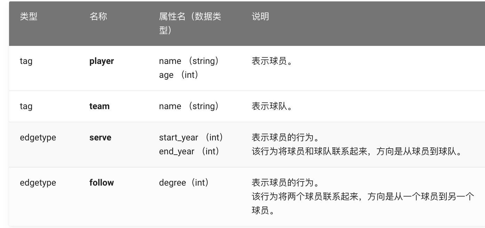
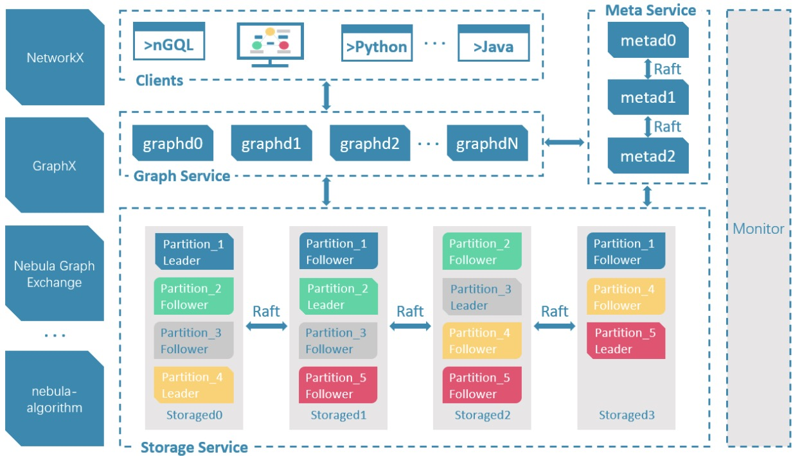
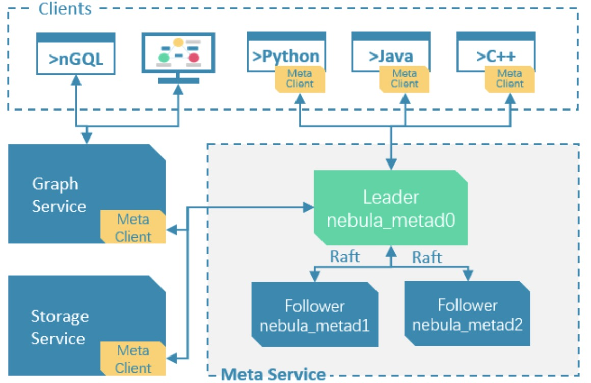
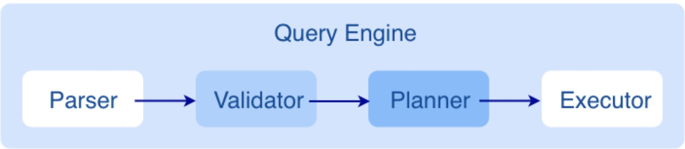
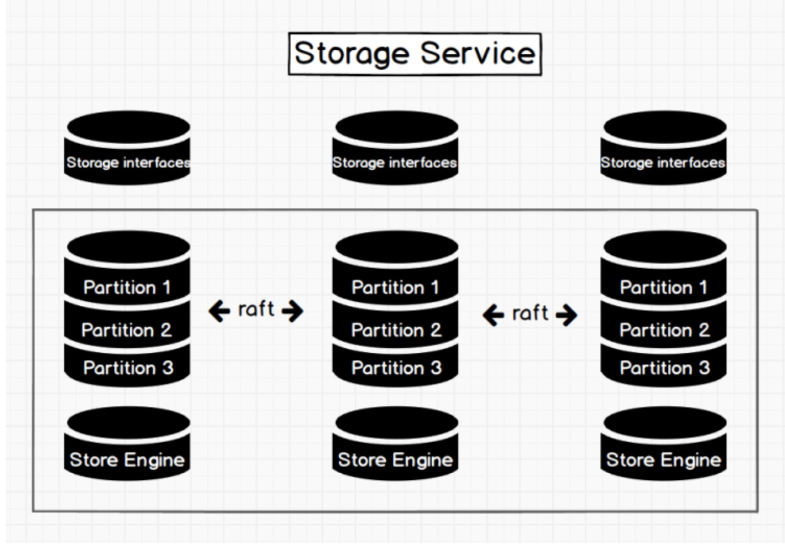
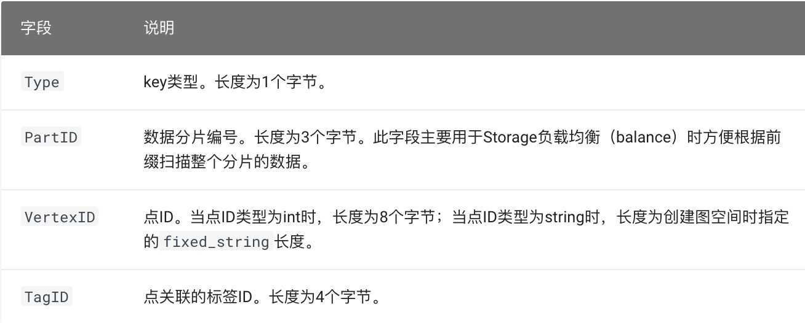
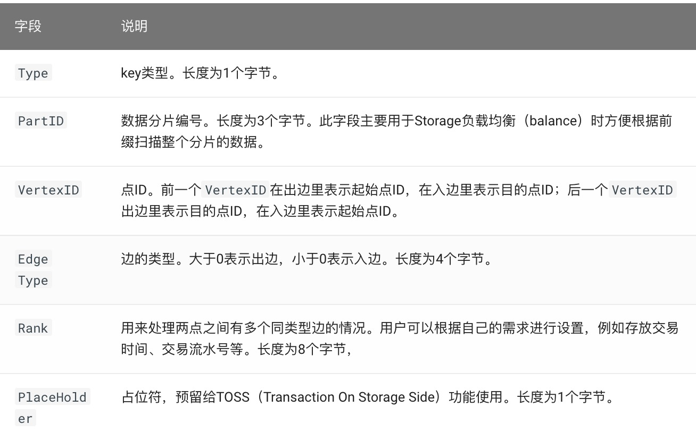

# 什么是图库

* 图数据库是专门存储庞大的图形网络并从中检索信息的数据库。它可以将图中的数据高效存储为点（vertex）和边（edge），还可以将属性（property）附加到点和边上。

## 特点

* 开源：C++语言开发github开放源码
* 高性能
* 易扩展:Nebula Graph采用shared-nothing架构，支持在不停止数据库服务的情况下扩缩容。
* 易开发:支持多种客户端，JAVA、GO、C++等
* 权限控制:支持LDAP、严格角色访问控制。
* 兼容openCypher查询语言:Nebula Graph查询语言nGQL，是一种声明性的、兼容openCypher查询语言。

# 数据模型

## 数据结构

**Nebula Graph数据模型使用6种基本的数据结构**

* 图空间(space)

图空间用于隔离不同团队或者项目的数据。不同图空间的数据是相互隔离的，可以指定不同的存储副本数、权限、分片等。这里可以类比一个database

- 点（vertex）

  点用来保存实体对象，特点如下：

  - 点是用点标识符（`VID`）标识的。`VID`在同一图空间中唯一。VID 是一个 int64, 或者 fixed_string(N)。
  - 点必须有至少一个标签（Tag)，也可以有多个标签。

- 边（edge）

  边是用来连接点的，表示两个点之间的关系或行为，特点如下：

  - 两点之间可以有多条边。
  - 边是有方向的，不存在无向边。
  - 四元组 `<起点VID、边类型（edgetype）、边排序值(rank)、终点VID>` 用于唯一标识一条边。边没有EID。
  - 一条边有且仅有一个边类型。
  - 一条边有且仅有一个 rank。其为int64, 默认为0。

- 标签（tag）

  标签由一组事先预定义的属性构成[^Tag](https://docs.nebula-graph.com.cn/2.0.1/1.introduction/2.data-model/Tag和edgetype的作用，类似于关系型数据库中点标和边标的表结构。)。

- 边类型（edgetype）

  边类型由一组事先预定义的属性构成[^Tag](https://docs.nebula-graph.com.cn/2.0.1/1.introduction/2.data-model/Tag和edgetype的作用，类似于关系型数据库中点标和边标的表结构。)。

- 属性（properties）

  属性是指以键值对（key-value）形式存储的信息。

## 有向属性图

* Nebula Graph使用有向属性图模型，指点和边构成的图，这些边是有方向的，点和边都可以有属性。
* 下表为篮球运动员数据集的结构示例，包括两种类型的点（**player**、**team**）和两种类型的边（**serve**、**like**）。

# Nebula Graph架构

## 架构总览

* Nebula Graph由三种服务构成：`Graph`服务、`Meta`服务和`Storage`服务。
* 每个服务都有可执行的二进制文件和对应进程，用户可以使用这些二进制文件在一个或多个计算机上部署Nebula Graph集群。

### Meta服务

* 在Nebula Graph架构中，Meta服务是由nebula-metad进程提供的，负责数据管理，例如Schema操作、集群管理和用户权限管理等。

### Graph服务和Storage服务

Nebula Graph采用计算存储分离架构。Graph服务负责处理计算请求，Storage服务负责存储数据。它们由不同的进程提供，Graph服务是由nebula-graphd进程提供，Storage服务是由nebula-storaged进程提供。计算存储分离架构的优势如下：

- 易扩展

  分布式架构保证了Graph服务和Storage服务的灵活性，方便扩容和缩容。

- 高可用

  如果提供Graph服务的服务器有一部分出现故障，其余服务器可以继续为客户端提供服务，而且Storage服务存储的数据不会丢失。服务恢复速度较快，甚至能做到用户无感知。

- 节约成本

  计算存储分离架构能够提高资源利用率，而且可根据业务需求灵活控制成本。如果使用[Nebula Graph Cloud](https://cloud.nebula-graph.com.cn/)，可以进一步节约前期成本。

- 更多可能性

  基于分离架构的特性，Graph服务将可以在更多类型的存储引擎上单独运行，Storage服务也可以为多种目的计算引擎提供服务。

## Meta服务

Meta服务是由nebula-metad进程提供的，用户可以根据场景配置nebula-metad进程数量：

* 测试环境中，用户可以在Nebula Graph集群中部署1个或3个nebula-metad进程。如果要部署3个，用户可以将它们部署在1台机器上，或者分别部署在不同的机器上。
* 生产环境中，建议在Nebula Graph集群中部署3个nebula-metad进程。请将这些进程部署在不同的机器上以保证高可用。

### Meta服务功能

#### 管理用户账号

* Meta服务中存储了用户的账号和权限信息，当客户端通过账号发送请求给Meta服务，Meta服务会检查账号信息，以及该账号是否有对应的请求权限。

#### 管理分片

* Meta服务负责存储和管理分片的位置信息，并且保证分片的负载均衡。

#### 管理图空间

* Nebula Graph支持多个图空间，不同图空间内的数据是安全隔离的。Meta服务存储所有图空间的元数据（非完整数据），并跟踪数据的变更，例如增加或删除图空间。

#### 管理Schema信息

* Nebula Graph是强类型图数据库，它的Schema包括标签、边类型、标签属性和边类型属性。
* Meta服务中存储了Schema信息，同时还负责Schema的添加、修改和删除，并记录它们的版本。

#### 管理基于TTL的数据回收

* Meta服务提供基于TTL（time to live）的自动数据回收和空间回收。

#### 管理作业

* Meta服务中的作业管理模块负责作业的创建、排队、查询和删除。

## Graph服务

* Graph服务主要负责处理查询请求，包括解析查询语句、校验语句、生成执行计划以及按照执行计划执行四个大步骤

### Graph服务架构

1. **Parser**：词法语法解析模块。
2. **Validator**：语义分析模块。
3. **Planner**：执行计划与优化器模块。
4. **Executor**：执行引擎模块。

### Parser

* Parser模块收到请求后，通过Flex(词法分析工具)和Bison(语法分析工具)生成的词法语法解析器，将语句转换为抽象语法树(AST)，在语法解析阶段会拦截不符合语法规则的语句。

### Validator

Validator模块对生成的AST进行语义校验，主要包括：

- 校验元数据信息

  校验语句中的元数据信息是否正确。

  例如解析`OVER`、`WHERE`和`YIELD`语句时，会查找Schema校验边类型、标签的信息是否存在，或者插入数据时校验插入的数据类型和Schema中的是否一致。

- 校验上下文引用信息

  校验引用的变量是否存在或者引用的属性是否属于变量。

  例如语句`$var = GO FROM "Tim" OVER like YIELD like._dst AS ID; GO FROM $var.ID OVER serve YIELD serve._dst`，Validator模块首先会检查变量`var`是否定义，其次再检查属性`ID`是否属于变量`var`。

- 校验类型推断

  推断表达式的结果类型，并根据子句校验类型是否正确。

  例如`WHERE`子句要求结果是`bool`、`null`或者`empty`。

- 校验*代表的信息

  查询语句中包含`*`时，校验子句时需要将`*`涉及的Schema都进行校验。

  例如语句`GO FROM "Tim" OVER * YIELD like._dst, like.likeness, serve._dst`，校验`OVER`子句时需要校验所有的边类型，如果边类型包含`like`和`serve`，该语句会展开为`GO FROM "Tim" OVER like,serve YIELD like._dst, like.likeness, serve._dst`。

- 校验输入输出

  校验管道符（|）前后的一致性。

  例如语句`GO FROM "Tim" OVER like YIELD like._dst AS ID | GO FROM $-.ID OVER serve YIELD serve._dst`，Validator模块会校验`$-.ID`在管道符左侧是否已经定义。

校验完成后，Validator模块还会生成一个默认可执行，但是未进行优化的执行计划，存储在目录`src/planner`内。

### Planner

* 如果配置文件`nebula-graphd.conf`和`enable_optimizer`设置为false，Planner模块不会优化Validator模块生成的执行计划，而是直接交给Executor模块执行。
* 如果配置文件`nebula-graphd.conf`中`enable_optimizer`设置为`true`，Planner模块会对Validator模块生成的执行计划进行优化。

### Executor

* Executor模块包含调度器（Scheduler）和执行器（Executor），通过调度器调度执行计划，让执行器根据执行计划生成对应的执行算子，从叶子节点开始执行，直到根节点结束。

## Storage服务

* Nebula Graph的存储包含两个部分，一个是Meta相关的存储，称为Meta服务，另一个是具体数据相关的存储，称为Storage服务。Meta服务运行在nebula-metad进程中，Storage服务运行在nebula-storaged进程中。本文仅介绍Storage服务的架构设计。

### 优势

- 高性能（自研KVStore）

- 易扩展（Shared-nothing架构）

- 强一致性（Raft）

- 高可用性（Raft）

- 支持向第三方系统进行同步（例如[全文索引](https://docs.nebula-graph.com.cn/2.0.1/4.deployment-and-installation/6.deploy-text-based-index/2.deploy-es/)）

### Storage服务架构

- Storage interface层

  Storage服务的最上层，定义了一系列和图相关的API。API请求会在这一层被翻译成一组针对[分片](https://docs.nebula-graph.com.cn/2.0.1/1.introduction/3.nebula-graph-architecture/4.storage-service/#数据分片)的KV操作，例如：

  \- `getNeighbors`：查询一批点的出边或者入边，返回边以及对应的属性，并且支持条件过滤。

  \- `insert vertex/edge`：插入一条点或者边及其属性。

  \- `getProps`：获取一个点或者一条边的属性。

  正是这一层的存在，使得Storage服务变成了真正的图存储，否则Storage服务只是一个KV存储服务。

- Consensus层

  Storage服务的中间层，实现了[Multi Group Raft](https://docs.nebula-graph.com.cn/2.0.1/1.introduction/3.nebula-graph-architecture/4.storage-service/#raft协议)，保证强一致性和高可用性。

- Store Engine层

  Storage服务的最底层，是一个单机版本地存储引擎，提供对本地数据的`get`、`put`、`scan`等操作。相关接口存储在`KVStore.h`和`KVEngine.h`文件，用户可以根据业务需求定制开发相关的本地存储插件。

### 自研KVStore

Nebula Graph使用自行开发的KVStore，而不是其他开源KVStore，原因如下：

- 需要高性能KVStore。

- 需要以库的形式提供，实现高效计算下推。对于强Schema的Nebula Graph来说，计算下推时如何提供Schema信息，是高效的关键。

- 需要数据强一致性。

基于上述原因，Nebula Graph使用RocksDB作为本地存储引擎，实现了自己的KVStore，有如下优势：

- 对于多硬盘机器，Nebula Graph只需配置多个不同的数据目录即可充分利用多硬盘的并发能力。

- 由Meta服务统一管理所有Storage服务，可以根据所有分片的分布情况和状态，手动进行负载均衡。
- 定制预写日志（WAL），每个分片都有自己的WAL。

- 支持多个图空间，不同图空间相互隔离，每个图空间可以设置自己的分片数和副本数。

### 数据存储格式

* 图存储的主要数据是点和边，Nebula Graph将点和边的信息存储为key，同时将点和边的属性信息存储在value中，以便更高效地使用属性过滤。

* 点数据存储格式

  

* 边数据存储格式

### 数据分片

* 目前Nebula Graph的分片策略采用**静态 Hash**的方式，即对点ID进行取模操作，同一个点的所有标签、出边和入边信息都会存储到同一个分片，这种方式极大地提升了查询效率。
* 对于在线图查询来说，最常见的操作便是从一个点开始向外拓展（广度优先），查询一个点的出边或者入边是最基本的操作，同时可能会根据属性进行过滤，Nebula Graph通过将属性与点边存储在一起，保证了整个操作的高效。