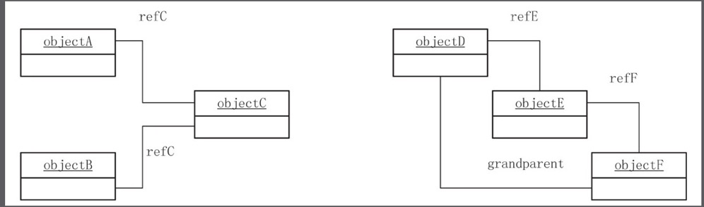
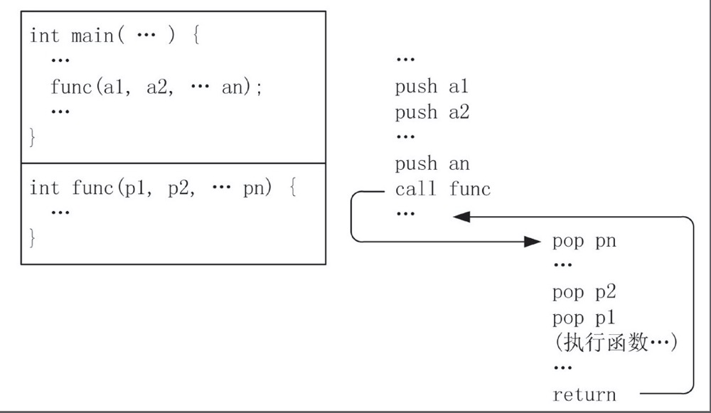
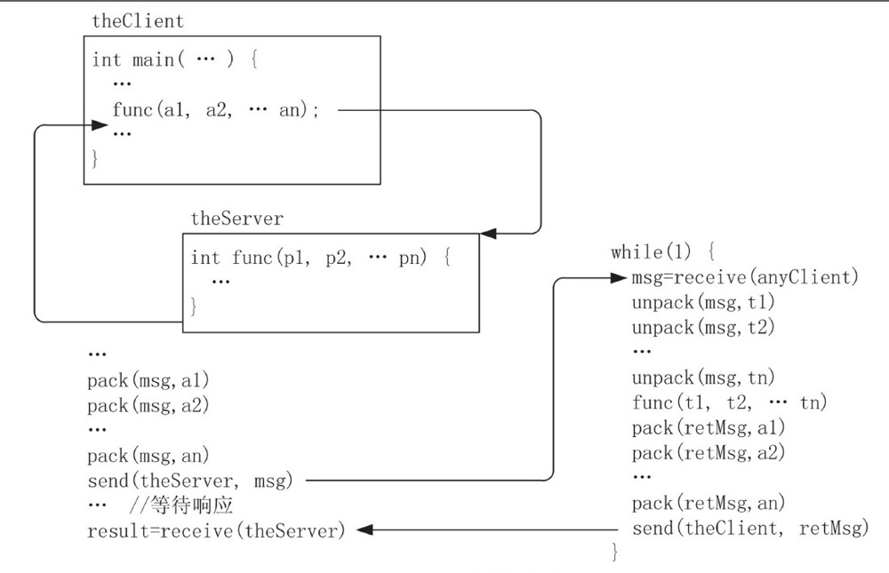
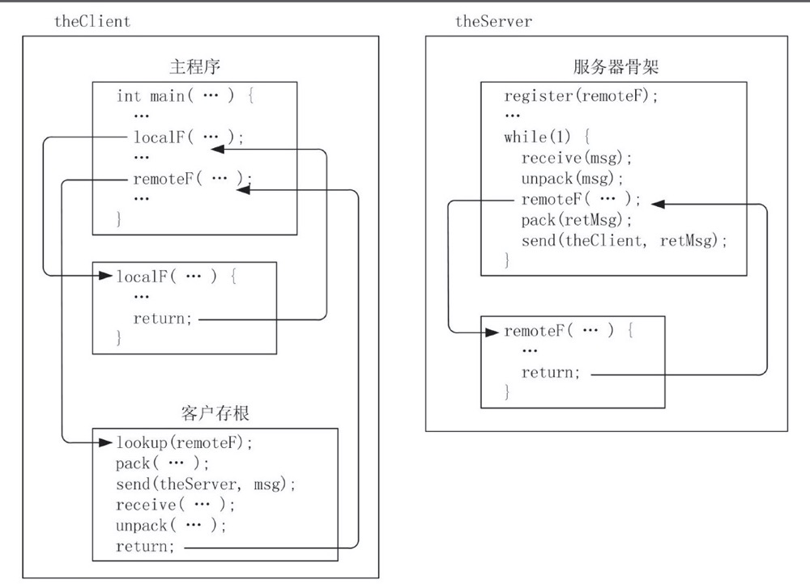
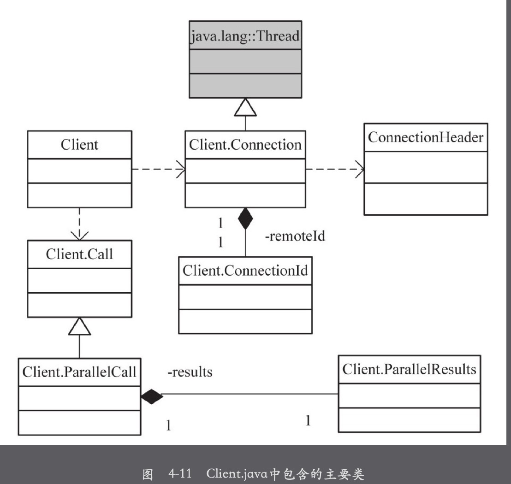
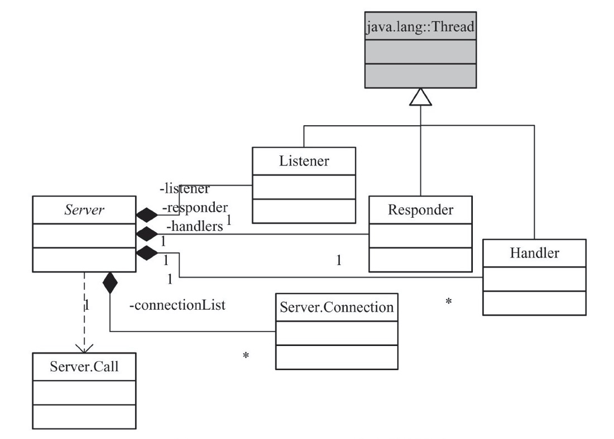
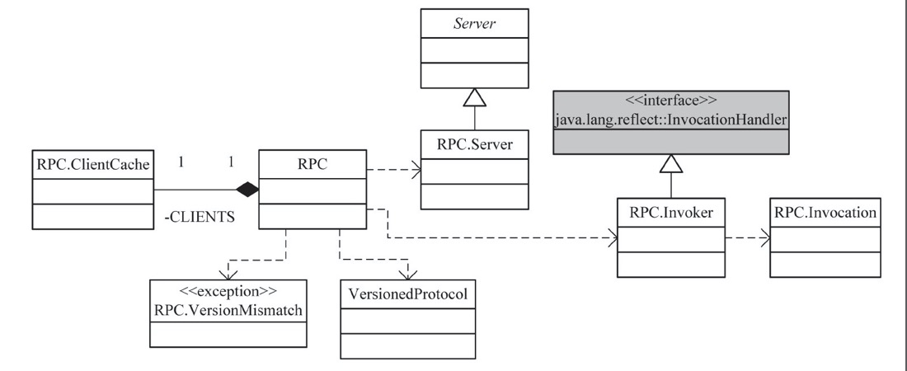

# 序列化与压缩

## 序列化

### 序列化的用途

1. 作为**一种持久化**，一个对象被持久化后，它的编码可以被存储到磁盘上，供以后反序列化使用。
2. 作为一种**通信数据格式**，序列化结果可以从一个正在运行的虚拟机，通过网络被传递到另一个虚拟机上
3. **作为一种拷贝、克隆机制:将对象序列化到内存的缓存区**，然后通过反序列化，可以得到一个对已存对象进行深拷贝的新对象。

**分布式数据处理中，主要使用数据持久化和通信数据格式。**

### Java的序列化机制

* **对象的类、类签名、类的所有非暂态和非静态成员的值，以及它所有的父类都要被写入。**

#### **Java序列化带来的问题**

* **Java序列化所需的数据量过大**，以Block类说，它包含3个长整数，但是它的序列化有112字节，而BlockMetaDataInfo比他多一个long成员变量，但是序列化后的结果已经到190字节了。
* Java序列化Block首先前两个字节是魔法数然后是版本号，然后是类的描述信息包括类的版本ID、是否实现writeObject和readObject方法等信息，对于拥有超类的类，超类信息也会被递归保存。这些信息都写到OutputStream对象，然后才会写对象的数据。因此Hadoop不适用Java序列化需要一种新的序列化方式。

### **Hadoop序列化机制**

* 和Java不同**Hadoop的序列化机制通过调用对象的write方法（传递一个DataOutput对象），将对象序列化到流中。反序列化的过程也是相同，通过readFields从流中读取数据。**
* **Java的序列化机制，反序列化过程会不断创建新的对象，Hadoop的机制中反序列化过程中，用户可以复用对象**。
#### Hadoop序列化机制的特征
* 紧凑:由于带宽是Hadoop集群中最稀缺的资源，一个紧凑的序列化机制可以节省很大的带宽消耗。
* 快速:在进程间通信(包括MR过程中涉及的数据交互)时会大量使用序列化机制，因此，必须尽量减少序列化和反序列化的开销。
* 可扩展:随着系统的发展，系统间通信的协议升级，类的定义会变化，序列化机制可以兼容。
* 互操作:可以支持与不同语言间通信。
**可以说java的序列化机制不符合如上要求，首先java序列化机制携带过多附带信息导致序列化数据量过大，而且java序列化不支持跨语言并且java序列化会在反序列化的时候不断创建新的对象给Jvm带来过大的压力。**
## Hadoop Writable机制

# Hadoop远程过程调用

## 传统调用

* **主程序将参数压入栈内并调用过程，这时候主程序停止执行并开始执行相应的过程。**被调用的过程从栈中获取参数，然后执行过程函数；执行完毕后，将返回参数入栈(或保存在寄存器里)，并将控制权交还给调用方。调用方获取返回参数，并继续执行。

## RPC过程

* Rpc的Sever运行时会阻塞在接收消息的调用上，当接到客户端的请求后，它会解包以获取请求参数，类似传统过程调用，被调用函数从栈中接收参数，然后确定调用过程的名字并调用相应过程。调用结束后，返回值通过主程序打包并发送回客户端，通知客户端调用结束。

### RPC机制的实现

## Java远程方法调用(RMI)

* Java RMI是Java的一个核型API和类库，运行一个JVM运行的Java程序调用在不同JVM虚拟机上运行的对象中的方法，即使这两个虚拟机运行于物理隔离的不同主机上。

## Hadoop远程过程调用

* Hadoop实现了自己的一套远程过程调用，Hadoop的IPC提供了进程间连接、超时、缓冲等通信细节。

### Hadoop IPC构建简单的分布式系统

* 实现Hadoop IPC必须实现VersionedProtocol接口与Java RMI类似(需要实现Remote接口)。

* Connection

  * IPC连接是IPC客户端和服务器关系的一个抽象，一个IPC客户端在调用服务器上的方法前，需要和服务器建立一个连接。由于客户端对连接的抽象与服务器端对连接的抽象不太一样，连接必须区分为客户端连接类Client.Connection和服务器连接类Server.Connection，它们各自提供了客户端和服务器管理连接需要的相关信息和方法。Hadoop的远程过程调用使用TCP协议进行通信，IPC连接建立在TCP连接之上。

    

## Hadoop IPC连接相关过程

* IPC连接是客户端和服务器关系一个抽象，它的实现包括连接建立、连接上的数据读写、连接维护和连接关闭四个过程。

# Hadoop文件系统

