# HDFS集群管理

## 集群规范

### 集群规模


#### Master节点场景

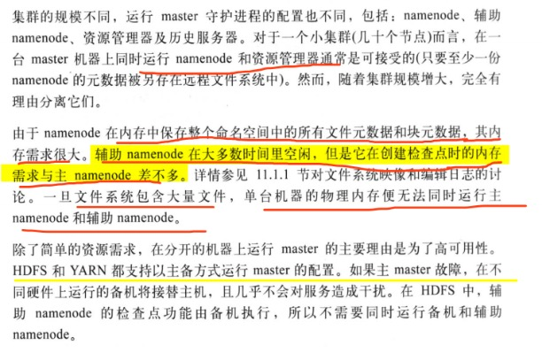

### 网络拓扑

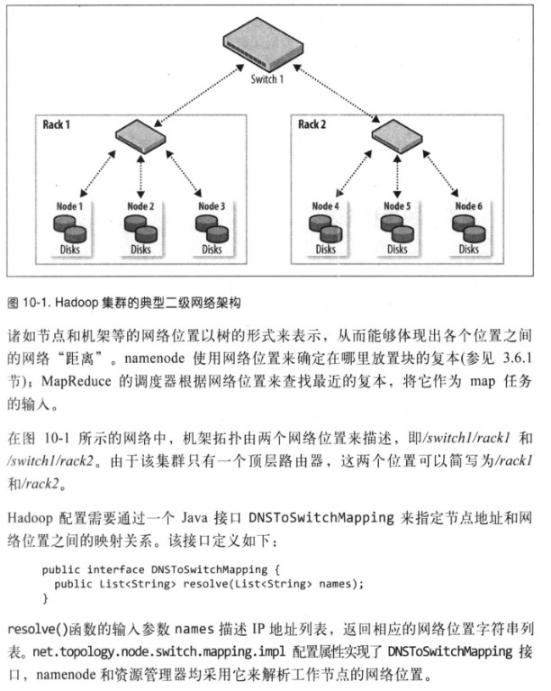

## 集群构建和安装

* 安装Java
* 创建unix用户账号

```shell
# 创建hadoop组
groupadd hadoop
# 创建yarn、mapred、hdfs账号
useradd -d /hadoop/yarn yarn
useradd -d /hadoop/yarn hdfs
useradd -d /hadoop/yarn mapred
```

* 安装Hadoop

```shell
# 解压
tar xzf hadoop-xx.tar
# 赋予文件对应的hadoop用户和组
chown -R hadoop:hadoop hadoop
# 配置环境
export HADOOP_HOME=/usr/local/hadoop
export PATH=$PATH:$HADOOOP_HOME/bin:$HADOOP_HOME/sbin
```

* SSH配置

```shell
Hadoop的控制脚本(非守护进程)依赖SSH来执行针对整个集群的操作，例如，某个脚本能够重启终止集群中的所有守护进程。也可以通过其他方式来控制脚本，如分布式shell或者专门的Hadooop管理应用。
为了支持无缝式工作，SSH安装好之后，需要运行来自其群内集群的hdfs用户和yarn用户能够无需密码即可登陆。方式是创建一个rsa的公钥/私钥对，存放在NFS之中，让整个集群共享该密钥对。
## 产生密钥
ssh-keygen -t rsa -f ~/.ssh/id_rsa
-f 指定的文件中，存放公钥文件名称。
## 将公钥存放在NFS文件下
cat ~/.ssh/id_rsa.pub >> ~/.ssh/authorized_keys
```

* 配置Hadoop
* 格式化HDFS文件系统


```shell
hdfs namenode -format
```

* 启动或者停止守护进程

```
sbin下的脚本可以在集群范围内启动或停止守护进程，为了使用这些脚本需要告诉Hadoop集群内由那些集群，使用slaves文件配置集群中的其他集群的主机名和IP地址,一行用一个host表示。slaves可以表示运行里datanode和NM的集群，
```

* 以hdfs用户身份启动HDFS守护进程

```shell
sh start-dfs.sh
1.在每台机器上启动一个namenode，这些机器由执行hdfs getconf -namenodes得到返回值所确定
2.在slaves文件列举的每台机器上启动一个datanode
3.在每台机器上启动一个辅助namenode，这些机器由执行hdfs getconf -secondaryNameNodes得到的返回值所确定
```

* namenode和辅助namenode运行所在的机器通过Hadoop配置询问机器主机名来决定

```shell
# 找到namenode的主机名
hdfs getconf -namenodes
默认情况下该命令从fs.defalutFS中找到namenode的主机名。
```

* 通过以yarn用户身份在托管资源服务器的机器上启动yarn

```shell
sh start-yarn.sh
1.本地集群启动一个RM
2.在slaves文件列举的每台机器上启动一个NM
```

* 这些脚本实际使用hadoop-deamon.sh脚本，YARN中是yarn-deamon.sh脚本，启动和停止hadoop守护进程。
* 启动作业历史服务器，是以mapred用户身份一下命令启动的

```shell
sh mr-jobhistory-daemon.sh start historyserver
```

* 创建用户目录

```shell
一旦建立并运行来Hadoop集群，就需要给用户提供访问手段，涉及到为每个用户创建home目录，给目录设置访问许可
hdfs dfs -mkdir /user/username
hdfs dfs -chown username:username /user/username
# 为目录设置空间限制
hdfs dfsadmin -setrSpaceQuota 1t /user/username
```

## Hadoop配置

* hadoop的配置在etc/hadoop下，也可以放在其他目录下，在启动守护进程时指定-config选项或者配置环境变量HADOOP\_CONF\_DIR即可。

### Hadoop配置文件

| 文件名称                       | 格式          | 描述                                              |
| -------------------------- | ----------- | ----------------------------------------------- |
| hadoop-env.sh              | Bash脚本      | 脚本中要用到的环境变量，以运行Hadoop                           |
| mapred-env.sh              | Bash脚本      | 脚本中要用到的环境变量，以运行MapReduce(覆盖hadoop-env.sh中设置的变量) |
| yarn-env.sh                | Bash脚本      | 脚本中要用到的环境变量，以运行YARN(覆盖hadoop-env.sh)            |
| core-site.xml              | Hadoop配置XML | Hadoop Core的配置项，列入HDFS、MapReduce和YARN常用的I/O设置等  |
| hdfs-site.xml              |             | Hadoop守护进程的配置项，包括namenode、辅助namenode和datanode等  |
| mapred-site.xml            |             | MarpReduce守护进程的配置项，包括作业服务器                      |
| yarn-site.xml              |             | YARN守护进程配置项，包括 RM、web应用代理服务器和NM                 |
| slaves                     | 纯文本         | 运行datanode和NM的机器列表(每行一个)                        |
| hadoop-metrics2.properties | Java属性      | 控制如何在Hadoop上发布度量的属性                             |
| log4j.properties           |             | 系统热值，NM审计日志，任务JVM进程的任务日志的相互                     |
| hadoop-policy.xml          |             | 安全模式下运行Hadoop时的访问控制列表的配置项                       |

### 配置管理

```
Hadoop集群上的每个节点都有各自的一系列配置文件，并由管理员完成这些配置文件的同步工作。
Hadoop也支持为所有master机器和worker机器采用同一套配置文件。
```

#### 按机器类划分

```
为每一机器类维护单独的配置文件，可以借助Chef、Puppet、CFEngine和Bcfg2完成。
```

### 环境设置

#### Java

```
需要设置Hadoop系统的Java安装的位置
1.在hadoop-env.sh文件中设置JAVA_HOME项
2.在shell中设置JAVA_HOME环境变量
```

#### 内存堆大小

```
默认情况下，Hadoop为各个守护进程分配1000MB内存。该内存值在hadoop-env.sh文件的HADOOP_HEAPSIZE参数控制。
1.可以为单独的守护进程修改堆大小，yarn-env.sh的YARN_RESOURCEMANAGER_HEAPSIZE，即可覆盖RM的堆大小
```

#### 守护进程需要多少内存


#### 系统日志文件

* 默认情况下，Hadoop生成的系统日志文件存放在$HADOOP\_HOME/log目录，可以通过`hadoop-env.sh`文件中的HADOOP\_LOG\_DIR来修改.
* 运行在各台机器上的Hadoop进程会产生两类日志文件
  * 以.log作为后缀名通过log4j记录，故障诊断的先检查该文件
  * 以.out为后缀的，记录标准输出和标准错误日志，该文件只包含少量记录。系统仅保留最新的5个日志文件，旧的文件会附加一个介于1和5之间的数字后缀，5表示最旧的文件。


* 日志名称通过hadoop-env.sh中的`HADOOP_IDENT_STRING`中配置

#### SSH配置

* 借助SSH协议，用户在主节点上使用控制脚本就能在远程工作节点上运行一些列指令。自定义的SSH配置，可以减少连接超时设定可以避免控制脚本长时间等待宕机节点想要。
* StricHostKeyChecking是一个很好的SSH设置，设置为no会自动将新主机键加到已知主机文件之中，该项默认值是ask，提示用户确认是否已验证来键指纹，因此不适合大型集群环境。
* hadoop-env.sh中定义`HADOOP_SSH_OPTS`环境变量能够项SSH很多配置

### Hadoop守护进程的关键属性

* 通过`[http://localhost:8088/conf](http://localhost:8088/conf)`查看当前RM的配置

#### 典型的配置

* 典型的core-site配置

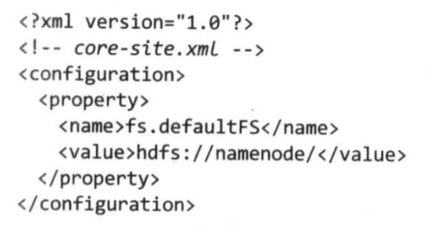

* 典型的hdfs-site.xml配置


* 典型的yarn-site配置

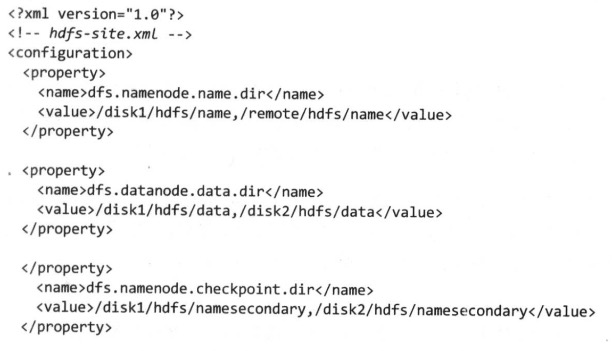

#### HDFS

```
运行HDFS需要将一台机器指定为namenode，通过fs.defaultFS来描述HDFS文件系统的URI，端口是rpc端口，默认为8020，同时也指定了默认文件系统，可以解析程相对路径，相对路径的长度更短，使用更便捷。
```

* namenode和datanode配置

```
# namenode
dfs.namenode.name.dir提供namenode存储永久性文件系统元数据(编辑日志和文件系统映象)，这些元数据文件会同时备份到所有指定目录中，通常配置dfs.namenode.name.dir属性可以将namenode元数据写到一两个本地磁盘和远程磁盘之中，这样的话即使本地磁盘故障，甚至整个namenode发生故障，都可以恢复元数据文件并且重构新的namenode(辅助namenode只是定期保存namenode的检查点，不维护namenode的最新备份)
指定辅助namenode存储文件系统的检查点目录，dfs.namenode.checkpoint.dir指定一些列目录来保存检查点。
# datanode
dfs.datanode.data.dir可以设定datanode存储数据块的目录列表，datanode描述的一系列目录是为了使datanode循环地在各个目录中写数据。为了提高性能，最好分别为各个本地磁盘指定一个存储目录，这样数据库块磁盘分布，针对不同数据块的读操作可以并发执行，从而提升读取性能。
```

* HDFS关键属性

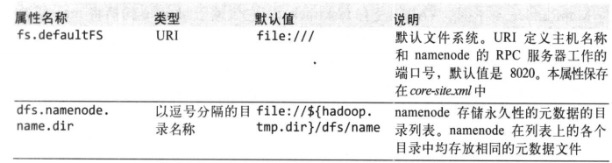

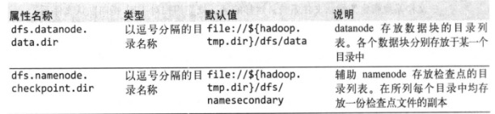

* 默认情况下，HDFS的存储目录存放在Hadoop的临时目录下(通过hadoop.tmp.dir配置，默认为`/tmp/hadoop-${user.name})`，在配置以上配置后，即使临时目录被情况数据仍然不会丢失。

#### YARN

* 运行YARN需要指定一台服务器为RM，将属性`yarn.resourcemanager.hostname`设置为运行RM的机器的主机名或IP地址。
* 通过`yarn.resourcemanager.address`设置RM服务器地址，格式为主机-端口名
* MapReduce作业过程中产生的中间数据和工作文件被写道临时本地文件中，由于这些数据包括map任务输出数据，数据量可能非常大，因此必须保证YARN容器本地临时存储空间(由`yarn.nodemanager.local-dirs`属性设置)的容量足够大。`yarn.nodemanager.local-dirs`属性使用一个逗号分割的目录名称列表，最后将这些目录分散到所有本地磁盘，以提升I/O操作的效率。
* 通常情况下，YARN本地存储会使用与datanode数据块存储相同的磁盘和分区(但是不同的目录)。datanode数据块存储目录由`dfs.datanode.data.dir`属性指定。
* 与MapReduce1不同，YARN没有tasktracker，它依赖shuffle句柄将map任务的输出送到reduce任务，Shuffle句柄是长期运行于NM的附加服务。可以在yarn-site.xml中配置`yarn.nodemanager.aux-services`属性设置为`mapreduce_shuffle`来显示启用MapReduce的shuffle句柄。
* YARN的关键配置

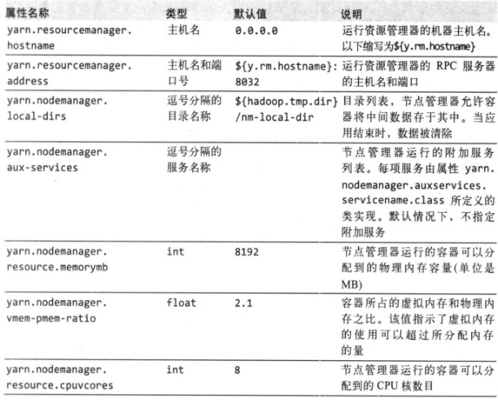

#### YARN和MapReudce中的内存设置

```
与MapReduce1基于slot模型相比，YARN以更精细化的方式来管理内存，YARN不会立刻指定一个节点上可以运行的map和reduce slot的最大数目，相反，它允许应用程序为一个任务请求任意规模的内存，因此在一个特定节点上运行任务数量取决于这些任务对内存的总需求量，而不简单取决于固定的slot数量。
默认Hadoop的守护进程使用1000MB，因此一个datanode和NM需要2000MB，为机器运行其他进程留出足够内存后，可以通过`yarn.nodemanager.resource.memory-mb`设置总分配量(单位是MB)，剩余的内存就是可以被指定给NM的容器使用，默认是8192MB。
容器大小由属性`mapreduce.map.memory.mb`和`mapreduce.reduce.memory.mb`决定，默认都是1024MB。AM会使用这些设置从集群中请求资源，此外NM也会使用这些设置运行、监控任务容器。java进程的堆大小由`mapred.child.java.opts`设置，默认为200MB，也可以单独为map和reduce任务设置java选项。
```

* MapReduce作业内存属性

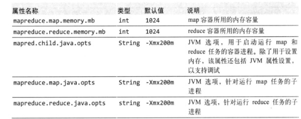

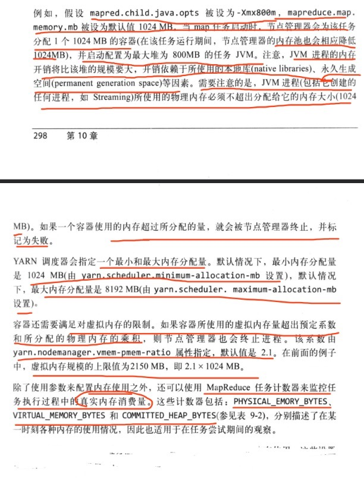

#### YARN和MapReduce中的CPU设置

* 应用程序可以通过AM申请对应的核数，通过属性`yarn.nodemanager.resource.cpuvcores`可以设置NM分配给容器的核数量。
* 应该设置为机器的总核数减去机器上运行的每个守护进程(datanode、NM核其他长期运行的进程)占用的核数
* 通过`mapreduce.map.cpu.vcores`核`mapreduce.reduce.cpu.vcores`控制Mapreduce作业分配给map核reduce容器的核数量，默认都为1.

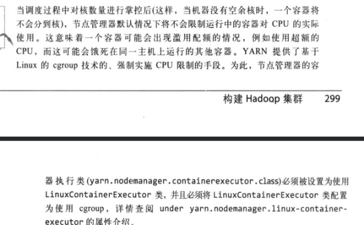

### Hadoop守护进程的地址和端口

```
Hadoop守护进程一般同时运行RPC和HTTP两个服务器，RPC服务器支持所有守护进程间的通信，HTTP服务器则提供于用户交互的Web页面。需要为每个服务器交互的网络地址和监听端口号，端口号0表示会选择一个空闲的端口号。
```

#### Rpc服务器属性


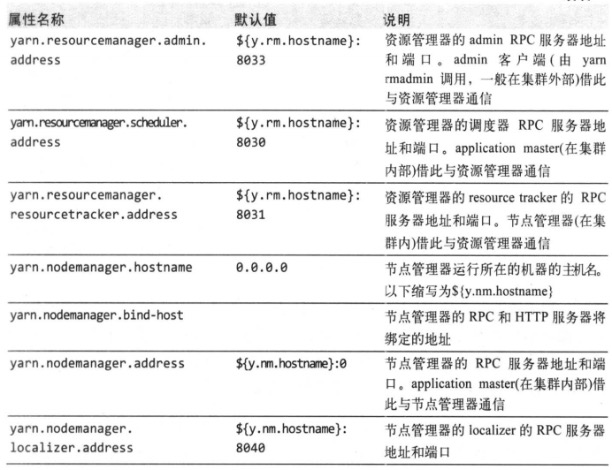

#### Http服务器属性

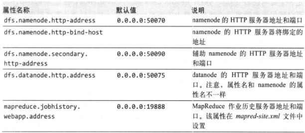

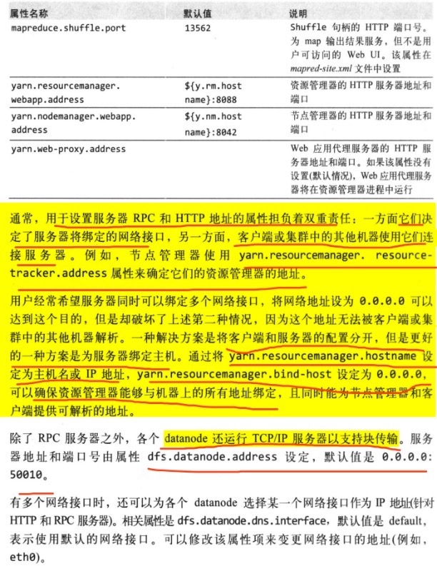

### Hadoop的其他属性

#### 集群成员

* 方便添加或移除节点，通过文件来指定一些允许作为datanode或NM加入集群的经过认证的机器，属性dfs.hosts记录允许作为datanode加入集群集群列表；属性`yarn.resourcemanager.nodes.include-path`记录允许作为节点管理器加入集群的机器列表。
* 属性`dfs.hosts.exclude`和`yarn.resourcemanager.nodes.exclude-path`代表指定的文件分别包含待解除的机器列表

#### 缓冲区大小

```
Hadoop使用一个4KB的缓冲区辅助I/O操作，对于现代硬件和操作系统来说，这个容量可能过低，增大缓缓冲区可以显著提高性能，来；例如128KB更常用，重构core-site.xml中的io.file.buffer.size属性来设置缓冲区大小
```

#### HDFS块大小

```
默认情况下，HDFS块大小是128MB，但是许多集群把块大小设的更大以降低namenode的内存压力，并向mapper传输更多数据。可以通过hdfs-site.xml中的dfs.blocksize属性设置块的大小
```

#### 保留的存储空间

* 默认情况下，datanode能够使用存储目录上所有的空间空间，如果计划将部分留给其他应用(非HDFS)，则需要设置`dfs.datanode.du.reserverd`属性来指定待保留空间的大小，以字节为单位

#### 回收站

* Hadoop文件系统也有回收站，被删除的文件并未真正删除，仅只转移到回收站(一个特定文件夹)，回收站的文件在被永久删除之前仍会至少保留一段时间。通过core-site.xml的fs.trash.interval属性(分钟单位)设置，默认情况下为0，表示回收站特性无效
* Hadoop回收站设施是用户级特性，有文件系统shell直接删除的文件才会被放到回收站，用程序删除的会被直接删除。如果使用Trash类，构造一个Trash实例，调用`moveToTrash()`方法会把指定路径的文件移动到回收站。
* 当回收站特性被启用，每个用户都有独立的回收站目录，即，home目录下的.Trash目录，恢复文件也容易:在.Trash的子目录找到文件，并将其移出.Trash目录
* HDFS会自动删除回收站中的文件，手动删除超过时间的文件
  * hdfs dfs -expunge: 清空回收站
  * Trash类的expunge方法也有一下效果

#### 作业调度

```
针对多用户的设置，可以升级作业调度器队列配置，以反映在组织方面的需求。
```

#### 慢启动reduce

* 默认情况下，调度器会一直等待，直到该作业的5%的map任务已经结束才会调度reduce任务，对于大型作业来说，这个会降低集群利用率，在等待的过程中占用率reduce容器，可以将`mapreduce.job.reduce.slowstart.completedmaps`的值设置更大，如0.80,能够提供吞吐率。

#### 短回路本地读

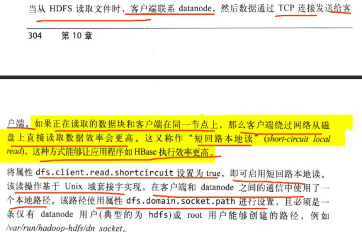

## 测试Hadoop集群


