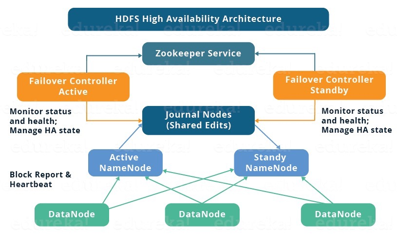
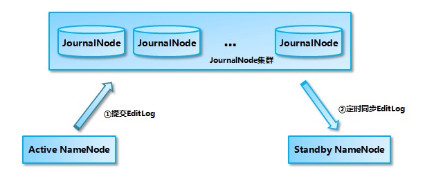
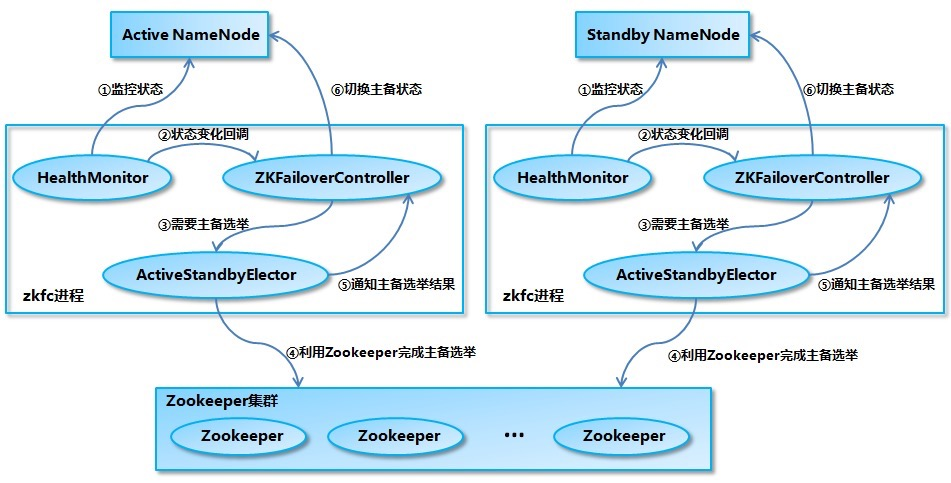

# NameNode-HA概述

* Hadoop2.0，在HDFS集群中NameNode存在单点故障(SPOF)
* NameNode主要以下两个方面影响HDFS集群
  * NameNode机器发生意外，如宕机，集群将无法使用。
  * NameNode机器需要升级，包括软件、硬件升级，此时集群无法使用。
* HDFS HA功能通过配置Active/Standby两个nameNode实现在集群中对NameNode的热备来解决问题，如果出现故障，如机器崩溃活机器需要升级维护，这时可通过此种方式将NameNode很快切换到另外一台机器。

## 高可用架构

<div align="center">  </div>

HDFS 高可用架构主要由以下组件所构成：

+ **Active NameNode 和 Standby NameNode**：两台 NameNode 形成互备，一台处于 Active 状态，为主 NameNode，另外一台处于 Standby 状态，为备 NameNode，只有主 NameNode 才能对外提供读写服务。

+ **主备切换控制器 ZKFailoverController**：ZKFailoverController 作为独立的进程运行，对 NameNode 的主备切换进行总体控制。ZKFailoverController 能及时检测到 NameNode 的健康状况，在主 NameNode 故障时借助 Zookeeper 实现自动的主备选举和切换，当然 NameNode 目前也支持不依赖于 Zookeeper 的手动主备切换。

+ **Zookeeper 集群**：为主备切换控制器提供主备选举支持。

+ **共享存储系统**：共享存储系统是实现 NameNode 的高可用最为关键的部分，共享存储系统保存了 NameNode 在运行过程中所产生的 HDFS 的元数据。主 NameNode 和 NameNode 通过共享存储系统实现元数据同步。在进行主备切换的时候，新的主 NameNode 在确认元数据完全同步之后才能继续对外提供服务。

+ **DataNode 节点**：除了通过共享存储系统共享 HDFS 的元数据信息之外，主 NameNode 和备 NameNode 还需要共享 HDFS 的数据块和 DataNode 之间的映射关系。DataNode 会同时向主 NameNode 和备 NameNode 上报数据块的位置信息。

## 工作机制

* 配置两个NameNode来消除单点故障
* [官方文档](https://hadoop.apache.org/docs/r2.8.5/hadoop-project-dist/hadoop-hdfs/HDFSHighAvailabilityWithQJM.html)
* **NameNode**
* **JournalNode**

### JournalNode工作机制

目前 Hadoop 支持使用 Quorum Journal Manager (QJM) 或 Network File System (NFS) 作为共享的存储系统，这里以 QJM 集群为例进行说明：Active NameNode 首先把 EditLog 提交到 JournalNode 集群，然后 Standby NameNode 再从 JournalNode 集群定时同步 EditLog，当 Active NameNode  宕机后， Standby  NameNode 在确认元数据完全同步之后就可以对外提供服务。

需要说明的是向 JournalNode 集群写入 EditLog 是遵循 “过半写入则成功” 的策略，所以你至少要有 3 个 JournalNode 节点，当然你也可以继续增加节点数量，但是应该保证节点总数是奇数。同时如果有 2N+1 台 JournalNode，那么根据过半写的原则，最多可以容忍有 N 台 JournalNode 节点挂掉。

<div align="center">  </div>

### NameNode准备切换

<div align="center">  </div>

1. HealthMonitor 初始化完成之后会启动内部的线程来定时调用对应 NameNode 的 HAServiceProtocol RPC 接口的方法，对 NameNode 的健康状态进行检测。
2. HealthMonitor 如果检测到 NameNode 的健康状态发生变化，会回调 ZKFailoverController 注册的相应方法进行处理。
3. 如果 ZKFailoverController 判断需要进行主备切换，会首先使用 ActiveStandbyElector 来进行自动的主备选举。
4. ActiveStandbyElector 与 Zookeeper 进行交互完成自动的主备选举。
5. ActiveStandbyElector 在主备选举完成后，会回调 ZKFailoverController 的相应方法来通知当前的 NameNode 成为主 NameNode 或备 NameNode。
6. ZKFailoverController 调用对应 NameNode 的 HAServiceProtocol RPC 接口的方法将 NameNode 转换为 Active 状态或 Standby 状态。

# HA 配置

## hdfs-site.xml

* `dfs.nameservices`,为该名称服务选择一个逻辑名称，例如“ mycluster”，然后将此逻辑名称用作此配置选项的值。 您选择的名称是任意的。 它既可以用于配置，也可以用作群集中绝对HDFS路径的权限组件。

```xml
<property>
  <name>dfs.nameservices</name>
  <value>mycluster</value>
</property>
```

* dfs.ha.namenodes.[nameservices],定义两个namenode的名称

```xml
<property>
  <name>dfs.ha.namenodes.mycluster</name>
  <value>nn1,nn2</value>
</property>
```

* **dfs.namenode.rpc-address.[nameservice ID].[name node ID]**,Namenode的RPC通信地址

```xml
<property>
  <name>dfs.namenode.rpc-address.mycluster.nn1</name>
  <value>hadoop1:8020</value>
</property>
<property>
  <name>dfs.namenode.rpc-address.mycluster.nn2</name>
  <value>hadoop2:8020</value>
</property>
```

* **dfs.namenode.http-address.[nameservice ID].[name node ID]**，HDFS UI端口

```xml
<property>
  <name>dfs.namenode.http-address.mycluster.nn1</name>
  <value>hadoop1:50070</value>
</property>
<property>
  <name>dfs.namenode.http-address.mycluster.nn2</name>
  <value>hadoop2:50070</value>
</property>
```

* **dfs.namenode.shared.edits.dir**,namenode共享的edits文件的存储目录,存储在journalnode地址，最少3台存储，奇数。

```xml
<property>
  <name>dfs.namenode.shared.edits.dir</name>
  <value>qjournal://hadoop102:8485;hadoop103:8485;hadoop104:8485/mycluster</value>
</property>
```

* **dfs.client.failover.proxy.provider.[nameservice ID]**,配置Java类的名称，DFS客户端将使用该Java类来确定哪个NameNode是当前的Active，从而确定哪个NameNode当前正在服务于客户端请求。

```xml
<!--快速失败方式代理类-->
<property>
  <name>dfs.client.failover.proxy.provider.mycluster</name>
  <value>org.apache.hadoop.hdfs.server.namenode.ha.ConfiguredFailoverProxyProvider</value>
</property>
```

* **dfs.ha.fencing.methods**,隔离机制,基于ssh机制

```xml
<!--为了保证系统的正确性，在任何给定时间只有一个NameNode处于Active状态。重要的是，使用Quorum Journal Manager时，将只允许一个NameNode写入JournalNodes，因此不会因裂脑情况而损坏文件系统元数据。但是，当发生故障转移时，以前的Active NameNode仍然有可能向客户端提供读取请求，这可能已过期，直到该NameNode在尝试写入JournalNodes时关闭为止。因此，即使使用Quorum Journal Manager，仍然需要配置一些防护方法。但是，为了在防护机制失败的情况下提高系统的可用性，建议配置一种防护方法，以确保成功返回列表中的最后一种防护方法。请注意，如果您选择不使用任何实际的防护方法，则仍然必须为此设置配置一些内容，例如“ shell（/ bin / true）”。故障转移期间使用的防护方法配置为以回车符分隔的列表，将按顺序尝试该列表，直到指示防护成功为止。 Hadoop附带两种方法：shell和sshfence。有关实现自己的自定义防护方法的信息-->
  <property>
      <name>dfs.ha.fencing.methods</name>
      <value>sshfence</value>
    </property>

    <property>
      <name>dfs.ha.fencing.ssh.private-key-files</name>
      <value>/home/exampleuser/.ssh/id_rsa</value>
    </property>
```

* `dfs.permissions.enable`,关闭权限检查

```xml
<property>
  <name>dfs.permissions.enable</name>
  <value>false</value>
</property>
```

## core-site.xml

* **fs.defaultFS**，文件系统的存储地址

```xml
<property>
  <name>fs.defaultFS</name>
  <value>hdfs://mycluster</value>
</property>
```

* **dfs.journalnode.edits.dir**,journalnode存储edit的目录

```xml
<property>
  <name>dfs.journalnode.edits.dir</name>
  <value>/path/to/journal/node/local/data</value>
</property>
```

* `hadoop.tmp.dir`,hadoop运行时产生文件存储目录

```xml
 <property>
        <name>hadoop.tmp.dir</name>
        <value>/Users/babywang/Documents/reserch/studySummary/module/hadoop-dir</value>
    </property>    
```

* `dfs.ha.automatic-failover.enabled`:开启自动故障转移

```xml
 <property>
   <name>dfs.ha.automatic-failover.enabled</name>
   <value>true</value>
 </property>
```

* `ha.zookeeper.quorum`:zookeeper集群

```xml
 <property>
   <name>ha.zookeeper.quorum</name>
   <value>zk1.example.com:2181,zk2.example.com:2181,zk3.example.com:2181</value>
 </property>
```

* `ha.zookeeper.auth/ha.zookeeper.acl`:配置zookeeper权限,确保能进入zookeeper

```xml
<property>
   <name>ha.zookeeper.auth</name>
   <value>@/path/to/zk-auth.txt</value>
 </property>
 <property>
   <name>ha.zookeeper.acl</name>
   <value>@/path/to/zk-acl.txt</value>
 </property>
```

# 故障转移

## 手动方式

### 启动服务

* 启动JournalNode,启动多台机器的journalnode

```shell
hadoop-daemon.sh start journalnode
```

* 格式化namenode

```shell
hdfs namenode -format
```

* 启动namenode

 ```shell
hadoop-daemon.sh start namenode
 ```

* 在nn2上同步nn1的元数据

```shell
hdfs namenode -bootstrapStandby
```

* 启动nn2

```
hadoop-daemon.sh start namenode
```

* 启动所有datanode

```shell
hadoop-daemons.sh start datanode
```

* 切换其中一个namenode为active，必须保证多个namenode进程都存在

```shell
Usage: haadmin
    [-transitionToActive <serviceId>] 将namenode转换为active
    [-transitionToStandby <serviceId>] 将namenode转换为standBy
    [-failover [--forcefence] [--forceactive] <serviceId> <serviceId>] 在两个NameNode之间启动故障转移
    [-getServiceState <serviceId>]  得到namenode的服务状态
    [-getAllServiceState] 得到全部服务状态
    [-checkHealth <serviceId>] 健康检查
    [-help <command>]
    
hdfs haadmin -transitionToActive nn1
```

## 自动故障转移

### 原理


* 动态故障转移依赖于Zookeeper quorum和ZKFailoverController(Hadoop进程)进程。

* `故障检查`:集群中的每个Namenode在Zookeeper维护了一个持久会话，如果机器崩溃，Zookeeper中的会话将会终止，Zookeeper通知另一个Namenode需要触发故障转移。
* `Active Namenode选举`:ZooKeeper提供了一种简单的机制来专门选择一个节点为active节点。 如果当前active的NameNode崩溃，则另一个节点可能会在ZooKeeper中采取特殊的排他锁，指示它应该成为下一个活动的NameNode。
* `监控监控`:ZKFC使用运行状况检查命令定期ping其本地NameNode。 只要NameNode以健康状态及时响应，ZKFC就会认为该节点是健康的。 如果节点已崩溃，冻结或以其他方式进入不正常状态，则运行状况监视器将其标记为不正常。
* `Zookeeper会话管理`:当本地Namenode是监控的，ZKFC在Zookeeper持有一个打开的会话，如果本地Namenode是active的，它还会持有一个特殊的'lock'Znode节点。这个锁使用Zookeeper支持的临时节点。如果会话过期，这个锁节点将会被动态删除。（分布式锁）
* `基于Zookeeper的选举`:如果本地NameNode运行状况良好，并且ZKFC看到当前没有其他节点持有锁znode，则它本身将尝试获取该锁。 如果成功，则它“赢得了选举”，并负责运行故障转移以使其本地NameNode处于active状态。 故障转移过程类似于上述的手动故障转移：首先，如有必要，将先前的活动节点隔离，然后将本地NameNode转换为活动状态。

### 启动

* 在zk中初始化HA状态

```shell
hdfs zkfc -formatZK
```

* 通过start-dfs.sh启动集群
* 手动启动集群

```shell
hadoop-daemon.sh --script $HADOOP_PREFIX/bin/hdfs start zkfc
```

# YARN-HA配置

## 原理


| Configuration Properties                                | Description                                                  |
| :------------------------------------------------------ | :----------------------------------------------------------- |
| `yarn.resourcemanager.zk-address`                       | Address of the ZK-quorum. Used both for the state-store and embedded leader-election. |
| `yarn.resourcemanager.ha.enabled`                       | Enable RM HA.                                                |
| `yarn.resourcemanager.ha.rm-ids`                        | List of logical IDs for the RMs. e.g., “rm1,rm2”.            |
| `yarn.resourcemanager.hostname.`*rm-id*                 | For each *rm-id*, specify the hostname the RM corresponds to. Alternately, one could set each of the RM’s service addresses. |
| `yarn.resourcemanager.address.`*rm-id*                  | For each *rm-id*, specify host:port for clients to submit jobs. If set, overrides the hostname set in `yarn.resourcemanager.hostname.`*rm-id*. |
| `yarn.resourcemanager.scheduler.address.`*rm-id*        | For each *rm-id*, specify scheduler host:port for ApplicationMasters to obtain resources. If set, overrides the hostname set in `yarn.resourcemanager.hostname.`*rm-id*. |
| `yarn.resourcemanager.resource-tracker.address.`*rm-id* | For each *rm-id*, specify host:port for NodeManagers to connect. If set, overrides the hostname set in `yarn.resourcemanager.hostname.`*rm-id*. |
| `yarn.resourcemanager.admin.address.`*rm-id*            | For each *rm-id*, specify host:port for administrative commands. If set, overrides the hostname set in `yarn.resourcemanager.hostname.`*rm-id*. |
| `yarn.resourcemanager.webapp.address.`*rm-id*           | For each *rm-id*, specify host:port of the RM web application corresponds to. You do not need this if you set `yarn.http.policy` to `HTTPS_ONLY`. If set, overrides the hostname set in `yarn.resourcemanager.hostname.`*rm-id*. |
| `yarn.resourcemanager.webapp.https.address.`*rm-id*     | For each *rm-id*, specify host:port of the RM https web application corresponds to. You do not need this if you set `yarn.http.policy` to `HTTP_ONLY`. If set, overrides the hostname set in `yarn.resourcemanager.hostname.`*rm-id*. |
| `yarn.resourcemanager.ha.id`                            | Identifies the RM in the ensemble. This is optional; however, if set, admins have to ensure that all the RMs have their own IDs in the config. |
| `yarn.resourcemanager.ha.automatic-failover.enabled`    | Enable automatic failover; By default, it is enabled only when HA is enabled. |
| `yarn.resourcemanager.ha.automatic-failover.embedded`   | Use embedded leader-elector to pick the Active RM, when automatic failover is enabled. By default, it is enabled only when HA is enabled. |
| `yarn.resourcemanager.cluster-id`                       | Identifies the cluster. Used by the elector to ensure an RM doesn’t take over as Active for another cluster. |
| `yarn.client.failover-proxy-provider`                   | The class to be used by Clients, AMs and NMs to failover to the Active RM. |
| `yarn.client.failover-max-attempts`                     | The max number of times FailoverProxyProvider should attempt failover. |
| `yarn.client.failover-sleep-base-ms`                    | The sleep base (in milliseconds) to be used for calculating the exponential delay between failovers. |
| `yarn.client.failover-sleep-max-ms`                     | The maximum sleep time (in milliseconds) between failovers.  |
| `yarn.client.failover-retries`                          | The number of retries per attempt to connect to a ResourceManager. |
| `yarn.client.failover-retries-on-socket-timeouts`       | The number of retries per attempt to connect to a ResourceManager on socket timeouts. |

## yarn-site.xml

```xml
<!--开启resourcemanagerha-->
<property>
  <name>yarn.resourcemanager.ha.enabled</name>
  <value>true</value>
</property>
<!--定义集群id-->
<property>
  <name>yarn.resourcemanager.cluster-id</name>
  <value>cluster1</value>
</property>
<!--定义rm集群名-->
<property>
  <name>yarn.resourcemanager.ha.rm-ids</name>
  <value>rm1,rm2</value>
</property>
<!--配置rmhostname-->
<property>
  <name>yarn.resourcemanager.hostname.rm1</name>
  <value>master1</value>
</property>
<property>
  <name>yarn.resourcemanager.hostname.rm2</name>
  <value>master2</value>
</property>
<!--配置rm web端口-->
<property>
  <name>yarn.resourcemanager.webapp.address.rm1</name>
  <value>master1:8088</value>
</property>
<property>
  <name>yarn.resourcemanager.webapp.address.rm2</name>
  <value>master2:8088</value>
</property>
<!--配置zk地址-->
<property>
  <name>yarn.resourcemanager.zk-address</name>
  <value>zk1:2181,zk2:2181,zk3:2181</value>
</property>
<property><!--启用RM重启的功能，默认为false-->
	  <name>yarn.resourcemanager.recovery.enabled</name>
	  <value>true</value>
	</property> 
	<property>
	  <name>yarn.resourcemanager.store.class</name>
	  <value>org.apache.hadoop.yarn.server.resourcemanager.recovery.ZKRMStateStore</value>
	</property>
```

* 启动RM

```shell
 sbin/yarn-daemon.sh start resourcemanager
```

* 启动nm

```shell
sbin/yarn-daemon.sh start nodemanager
```

* 查看状态

```shell
 $ yarn rmadmin -getServiceState rm1
 active

 $ yarn rmadmin -getServiceState rm2
 standby
```

# HDFS Federation架构设计

## NameNode架构的局限性

### NameSpace(命名空间)限制

* 由于NameNode在内存中存储所有的元数据，因此单个namenode所有存储的对象(文件+块)数据受到namenode所在JVM的heap size的限制。50G的heap能够存储20-亿个对象，这20亿对象支持4000个datanode，12PB的存储。随着数据的飞速增长，存储的需求也随之增长。单个datanode从4T增长到36T，集群的尺寸增长到8000个datanode。存储的需求从12PB增长到大于100PB。

### 隔离问题

* 由于HDFS仅有一个namenode，无法隔离各个程序，因此HDFS上的一个实验程序就很有可能影响整个HDFS允许的程序。

### 性能的瓶颈

* 由于单个namenode的HDFS架构，因此整个HDFS文件系统的吞吐量受限于单个namenode的吞吐量。